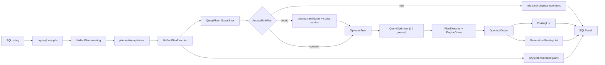

# UQA-RS Architecture

This is a high-level pointer for newcomers; the formal contract lives in [`docs/plans/0001-uqa-rs-implementation-plan.md`](../plans/0001-uqa-rs-implementation-plan.md).

## Crate dependency layers

```mermaid
graph TD
    core["uqa-core"]
    analysis["uqa-analysis"]
    storage["uqa-storage"]
    scoring["uqa-scoring"]
    fusion["uqa-fusion"]
    operators["uqa-operators"]
    graph["uqa-graph"]
    joins["uqa-joins"]
    sql["uqa-sql"]
    fdw["uqa-fdw"]
    engine["uqa-engine"]
    api["uqa-api"]
    cli["uqa-cli"]
    analysis --> core
    storage --> core
    storage --> analysis
    scoring --> core
    scoring --> storage
    fusion --> core
    fusion --> scoring
    operators --> storage
    operators --> scoring
    operators --> fusion
    graph --> core
    graph --> analysis
    joins --> core
    joins --> analysis
    joins --> graph
    sql --> core
    fdw --> core
    engine --> sql
    engine --> operators
    engine --> graph
    engine --> storage
    api --> engine
    cli --> engine
```

## What lives where

- `uqa-core` — `DocSet`, `Relation<K>`, `PostingList`, `RankedView`, `GeneralizedPostingList`, `Value`, `Vertex`, `Edge`, `IndexStats`, `Predicate`. The Boolean algebra over `DocSet` is property-tested against the 11 axioms; payload merge and ranking have separate contracts.
- `uqa-analysis` — porter stemmer, character filters, token filters, analyzer pipelines, language presets.
- `uqa-storage` — `DocumentStore`, `InvertedIndex`, `VectorIndex`, `BTreeIndex`, `BlockMaxIndex`, an in-memory `SpatialIndex` using a Haversine scan, and `Catalog` with schema migrations. Document, inverted, vector, B-tree, and catalog interfaces have SQLite-backed implementations; block-max and spatial indexes are currently in-memory.
- `uqa-scoring` — `BM25Scorer`, `BayesianBM25Scorer`, typed raw/evidence/prior/posterior score domains, the explicitly legacy composite-prior transform, `WANDScorer`, `BlockMaxWANDScorer`, calibration metrics, `MultiFieldBayesianScorer`, `ParameterLearner`.
- `uqa-fusion` — exact `BayesianEvidenceFusion`, heuristic `RobustPositiveEvidencePool` / `AdaptivePositiveEvidencePool`, `ProbabilisticBoolean`, `LearnedFusion`, `AttentionFusion`, `MultiHeadAttentionFusion`, query feature extractor.
- `uqa-operators` — `Operator` trait + `ExecutionContext`, primitive (TermOperator, FilterOperator, ScoreOperator, FacetOperator), boolean (Union/Intersect/Complement), hybrid (`HybridTextVectorOperator`, exact `BayesianEvidenceFusionOperator`, robust `RobustPositiveEvidencePoolOperator`), vector (Cosine/KNN/VectorSimilarity), multi-stage, sparse, progressive-fusion, hierarchical (PathFilter/Project/Aggregate / UnifiedFilter), deep-fusion (Embed/Signal/Dense/Flatten/GlobalPool/ Softmax/BatchNorm/Dropout/CNN1D/CNN2D/RNN/LSTM/Propagate/Conv/Pool/ Attention). The deep-fusion graph layers depend only on a `GraphNeighborLookup` trait so they remain decoupled from `uqa-graph`.
- `uqa-graph` — `MemoryGraphStore` with named graphs, `GraphPostingList` with a lossless Phi payload encoding, pattern matching (`GMatch` with arc consistency + MRV + negated-edge post-filter), RPQ parser/NFA/DFA + `RegularPathQuery` operator, an openCypher-oriented lexer/AST/recursive-descent parser for the supported clause set, read-only and mutating executors, centrality (PageRank, HITS, betweenness), message passing, embedding, indexes, incremental matcher, deltas + versioned store with rollback, temporal filtering, cross-paradigm operators.
- `uqa-joins` — text-similarity (Jaccard), vector-similarity (cosine), hybrid (structured + cosine), graph-driven, cross-paradigm vertex/document bridging.
- `uqa-sql` — `libpg_query` Postgres parser → internal AST → compiled statement; SQL function registry covers `text_match`, `knn_match`, exact `fuse_bayesian_evidence`, robust `pool_positive_evidence` (plus compatibility `fuse_log_odds`), `multi_field_match`, `staged_retrieval`, `graph_*`, `deep_predict`.
- `uqa-fdw` — `ForeignServer`, `ForeignTable`, `FDWPredicate`, `FDWHandler` trait, `MemoryHandler` reference implementation with predicate pushdown, projection, limit, and `LIKE` matching.
- `uqa-engine` — top-level `Engine` with table state, catalog restore, `search` / `knn_search` / `hybrid_search` / `sql` entry points, named graph storage, deep-model save/load/predict, parameter persistence.
- `uqa-api` — fluent `QueryBuilder` for common read and retrieval flows. Validated literal, vector, staged-retrieval, fusion, highlight, and facet helpers are fallible; retrieval and fusion helpers render `WHERE` predicates that enter the shared retrieval IR. Raw projection/predicate fragments cover appropriate expression-level extensions, while complete SQL remains available through `Engine::sql`.
- `uqa-cli` — `usql` REPL (multi-line SQL, meta commands, in-memory or persistent engines). The TTY path uses `rustyline` for editing, persistent prompt history, history hints, completion, and ANSI highlighting; completion combines static SQL keywords, live engine schema names, and `uqa-sql` registry names for UQA functions.

## Carrier boundaries

The query stack separates membership, value combination, physical storage, and ranking:

| Layer | Representation | Contract |
| --- | --- | --- |
| Document membership | `DocSet` | Finite Boolean algebra relative to an explicit universe; equality is document-id equality. |
| Semiring values | `Relation<K>` | Finite-support `DocId -> K`; pointwise `plus` and `times` use the laws supplied by `K`. `bool` gives support union/intersection, while `LogSemiring` gives log-space weighted relations. |
| Decorated storage | `PostingList` | Sorted unique `(doc_id, Payload)` entries. Collision merge unions positions, adds scores, and gives right-hand fields precedence. Full values are therefore not generally idempotent or commutative. |
| Ranking | `RankedView` | Descending score order and top-K selection, separate from the document-id ordering required by posting storage. |

`PostingList::support` is a lossy projection: multiple payload-bearing posting lists map to the same `DocSet`. The supported round trip is `support(PostingList::from(D)) == D`. The reverse reconstruction assigns default payloads and is not equal to a decorated input in general.

Planner cardinality values are estimates used for cost decisions. Analytical or sampling accuracy is documented with estimator assumptions and reproducible benchmarks; it is not treated as an implementation theorem or a query-correctness invariant.

## Data flow at a glance



`EngineDriver` exhaustively dispatches every concrete `OperatorTree` variant, including graph traversal and pattern matching, joins and centrality, aggregation, progressive fusion, and deep fusion. Join output remains a `GeneralizedPostingList`; it is not assigned synthetic scalar ids, so tuple identity survives subsequent tuple-support operations. Graph payloads retain their subgraph metadata through the `GraphPostingList` Phi encoding. Deep-layer parameters and progressive-fusion gating are explicit IR data, and weighted RPQ execution evaluates the stored path predicate rather than treating its selectivity estimate as a score. Physical failures propagate through `PlanExecutor` as errors, and unknown opaque operators fail explicitly.

The first `QueryOptimizer` pass applies idempotence and absorption through address-independent structural equivalence. It restricts those identities to membership-only subtrees whose execution emits default payloads. Score-bearing and decorated operators are deliberately excluded: `PostingList` payload merges add colliding scores and merge payload fields, so removing a duplicate there would change an observable `_score` or carrier value.

`OperatorTree` is a child access algebra, not the container for every SQL semantic. Arithmetic, subqueries, windows, and row mutations are represented by `ScalarExpr`, `QueryPlan`, and physical command nodes in the enclosing `UnifiedPlan`; retrieval, graph, join, centrality, and fusion nodes use `OperatorTree` where its posting-list or tuple carrier is the correct representation. The plan-native optimizer sees the complete relational/scalar plan and chooses row, operator-capable, or hybrid access after lowering. Every successfully compiled SQL form enters the same exhaustive `UnifiedPlanExecutor`, so this representation choice is not an execution bypass.

Relational/DML parser expressions, DML statements, and `SelectStmt` values end at lowering. Scalar subqueries use owned `QueryPlan` slots, query blocks execute directly without rebuilding an AST carrier, and CTE, view, prepared, and EXPLAIN bodies remain plan children. Catalog/procedural DDL keeps its typed command data, but it cannot re-enter a separate SQL executor.

The plan-native optimizer flattens reorderable INNER JOIN regions, obtains live row/column statistics from the engine, and materializes the DPccp order without crossing outer/lateral boundaries. DPccp costs equijoins using the physically available hash-join cost, retains `Hash` on the materialized `SourcePlan`, and physical lowering rejects the plan if its equality keys cannot be recovered; an unavailable index join is never used to influence the order. An unreordered clean equality between left/right qualified columns also selects `HashJoin`, while other predicates select `NestedLoopJoin`. Both consume the left child as batches, store the right child in `IndexedSpill`, spill output through `SpillBuffer`, and keep RIGHT/FULL match flags on disk. The hash index starts in memory and migrates to exact disk buckets when `work_mem` is exceeded. See [`crates/uqa-execution/src/join.rs`](../../crates/uqa-execution/src/join.rs) and the physical construction in [`crates/uqa-engine/src/sql/from_rows.rs`](../../crates/uqa-engine/src/sql/from_rows.rs).

## Inference and persistence

- `uqa-engine` keeps a session-local `MemoryGraphStore` cache for named graphs, but a persistent engine restores and atomically publishes graph definitions, vertices, edges, memberships, and path indexes through the catalog. Graph SQL functions and `OperatorTree` reads use the fallible `Engine::graph_with` boundary; Cypher writes apply the same persist-before-publish discipline by mutating a candidate graph, persisting it, and only then publishing it to the session cache.
- `uqa-ml` exposes serializable `DeepModel` specs, deep-fusion inference backends for dense, CNN, RNN, LSTM, graph, pooling, and attention layers, analytical `deep_learn`, and optional Apple MLX support through the official `mlx-c` system library when MLX development files are available. `uqa-engine` persists those models through the catalog's `_models` table and exposes the SQL adapters `deep_learn('model_name', 'training_table')` and `deep_predict('model_name')`.
- `uqa-scoring::ParameterLearner` uses the same sigmoid calibration: it updates `alpha` and `beta` with SGD on logistic loss and, when enabled, tracks `base_rate` with a positive-label-rate EMA.

## Parity, IR quality, and benchmarks

- SQL golden harness — `crates/uqa-engine/tests/sql_golden.rs`, fixture at `tests/parity/sql_golden_fixture.json`.
- BEIR-style relevance gate — `crates/uqa-engine/tests/beir_fixture.rs`, fixture at `tests/parity/beir_fixture.json`. Reads the corpus, graded judgments, and the `min_ndcg` / `min_map` floors directly from JSON so swapping in a real BEIR dataset is a file replacement. Format spec: [`docs/design/parity.md`](parity.md).
- IR metrics — `dcg_at_k`, `ndcg_at_k`, `average_precision_at_k`, `mean_average_precision_at_k` in `uqa-scoring::metrics`.
- Calibration metrics — `CalibrationMetrics::log_loss` and `CalibrationMetrics::brier`.
- Criterion benches:
  - `cargo bench -p uqa-core    --bench posting_list`
  - `cargo bench -p uqa-scoring --bench bm25`
  - `cargo bench -p uqa-scoring --bench calibration`
  - `cargo bench -p uqa-engine  --bench sql_e2e`
  - `cargo bench -p uqa-engine  --bench sql_1m`
  - `cargo bench -p uqa-engine  --bench knn`
  - `cargo bench -p uqa-engine  --bench join`
  - `cargo bench -p uqa-graph   --bench rpq`

## CLI

`usql` (built from `uqa-cli`) is a multi-line REPL: `--db <path>` opens persistent storage, `-c <sql>` executes and exits, and positional script files run before the REPL when stdin is interactive. Statement history persists to `$UQA_HISTORY` or the default `$HOME/.cognica/uqa/.usql_history`; `\history` dumps the buffer and `\history clear` deletes it. Interactive sessions add readline editing, history suggestions, backslash-command completion, table / foreign table / column completion from the live engine, and syntax highlighting. UQA function names are not duplicated in the CLI; the completer and highlighter ask `uqa_sql::registry` for registered SQL functions, so adding a function to the compiler registry makes it visible to the shell. Meta commands include `\?`, `\dt`, `\d`, `\di`, `\dF`, `\dS`, `\dg`, `\ds`, `\stats`, `\x`, `\o`, `\timing`, `\reset`, `\q`, plus migration and engine-switching helpers (`\open`, `\new`, `\where`, `\run`, `\migrate-python-db`).

## Where to read next

- Document-set algebra and posting projection — `crates/uqa-core/tests/algebra.rs`
- Lossless graph Phi encoding — `crates/uqa-graph/tests/algebra.rs`
- Cypher parsing — `crates/uqa-graph/src/cypher/parser.rs`
- SQL compilation — `crates/uqa-sql/src/compiler.rs`
- Hash join — [`crates/uqa-execution/src/join.rs`](../../crates/uqa-execution/src/join.rs) and its SQL physical lowering in [`crates/uqa-engine/src/sql/from_rows.rs`](../../crates/uqa-engine/src/sql/from_rows.rs)
- Engine entry — `crates/uqa-engine/src/lib.rs`
- Parity fixtures — [`docs/design/parity.md`](parity.md)
- Master plan — `docs/plans/0001-uqa-rs-implementation-plan.md`
