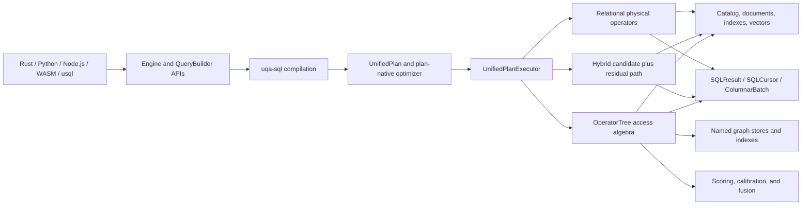
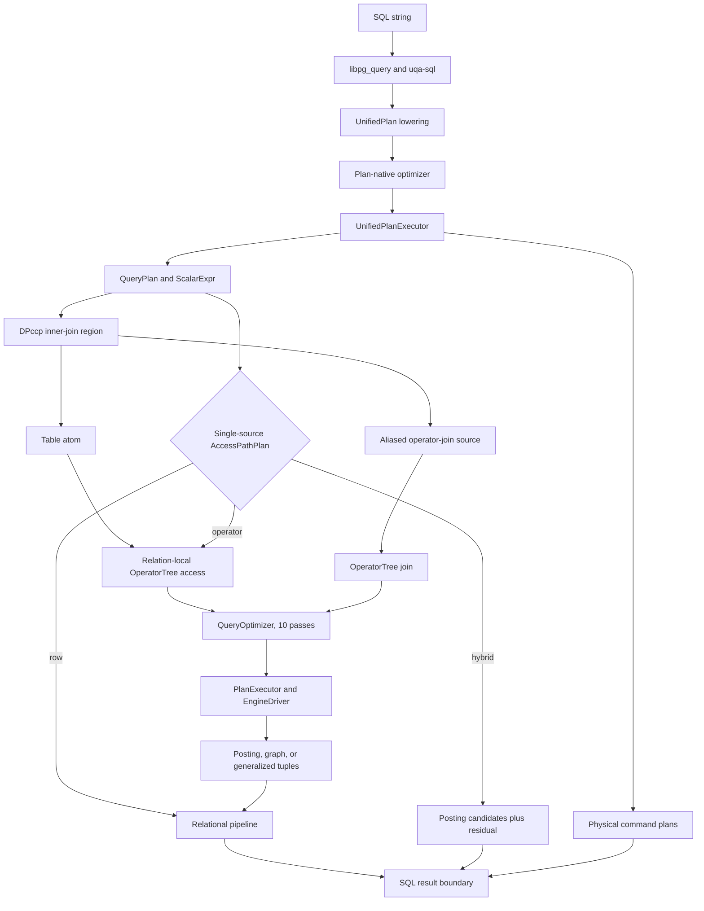

# UQA-RS system architecture

This document is the technical overview of UQA-RS. It describes the boundaries that new code must preserve, while focused contracts for state ownership, storage security, compatibility, and performance live in neighboring design documents.

## Design goals

- Give relational SQL, text retrieval, vector search, graph operations, scoring, and fusion one planning and execution boundary without forcing every semantic into one physical carrier.
- Keep algebraic laws attached to the representation for which they are valid, especially separating document membership, payload combination, and ranking.
- Make `uqa-engine` the composition root while keeping storage, planning, execution, scoring, graph, and runtime-extension state behind explicit subsystem boundaries.
- Preserve errors and transactional atomicity across storage, indexes, catalogs, graphs, models, and runtime caches.
- Bound blocking execution with `work_mem`, spill formats, and streaming result APIs instead of assuming every result fits in memory.
- Keep persistent storage replaceable through catalog, document, index, vector, and key/value traits.

## System context



The shared boundary is the compiled `UnifiedPlan`, not a claim that every query uses the same data structure. Relational rows, document-id postings, graph matches, and join tuples retain different carriers because their identities and combination laws differ.

## Workspace dependency layers

`uqa-sql` is a syntax frontend that depends only on `uqa-core` and stops retrieval parsing at syntax-level expressions. Concrete retrieval lowering happens at the engine/planner boundary, and `uqa-engine` wires the concrete subsystems together as the composition root.

The complete runtime edge set and direct-dependency budgets are executable policy in [`scripts/workspace-dependency-policy.json`](../../scripts/workspace-dependency-policy.json). CI runs [`scripts/check-workspace-dependencies.py`](../../scripts/check-workspace-dependencies.py), so a new runtime dependency requires an explicit architecture-policy change in the same review.

```mermaid
graph TD
    core["uqa-core"]
    analysis["uqa-analysis"]
    storage["uqa-storage"]
    storage_redb["uqa-storage-redb"]
    storage_sqlite["uqa-storage-sqlite"]
    scoring["uqa-scoring"]
    fusion["uqa-fusion"]
    operators["uqa-operators"]
    graph["uqa-graph"]
    joins["uqa-joins"]
    sql["uqa-sql"]
    fdw["uqa-fdw"]
    execution["uqa-execution"]
    planner["uqa-planner"]
    ml["uqa-ml"]
    engine["uqa-engine"]
    api["uqa-api"]
    cli["uqa-cli"]
    pgwire["uqa-pg-wire"]
    bindings["uqa-python / uqa-node / uqa-wasm"]
    analysis --> core
    storage --> core
    storage --> analysis
    storage_redb --> storage
    storage_sqlite --> storage
    scoring --> core
    scoring --> storage
    fusion --> scoring
    operators --> storage
    operators --> scoring
    operators --> fusion
    graph --> core
    graph --> analysis
    joins --> core
    joins --> graph
    joins --> sql
    sql --> core
    fdw --> core
    execution --> core
    execution --> sql
    planner --> execution
    planner --> graph
    planner --> joins
    planner --> operators
    planner --> sql
    planner --> storage
    ml --> operators
    ml --> scoring
    engine --> sql
    engine --> operators
    engine --> graph
    engine --> storage
    engine --> storage_sqlite
    engine --> execution
    engine --> planner
    engine --> joins
    engine --> ml
    engine --> fdw
    api --> engine
    cli --> engine
    bindings --> engine
```

## Crate responsibilities

| Crate | Responsibility |
| --- | --- |
| `uqa-core` | `DocSet`, `Relation<K>`, `PostingList`, `RankedView`, generalized postings, values, predicates, and shared graph value types |
| `uqa-analysis` | Tokenizers, character filters, token filters, analyzers, stemming, and highlighting primitives |
| `uqa-storage` | Document, inverted, vector, tensor, B-tree, block-max, spatial, catalog, and backend-neutral key/value abstractions |
| `uqa-storage-redb` | Pure-Rust redb implementation of the ordered `KeyValueStore` contract and session provider |
| `uqa-storage-sqlite` | Physical SQLite implementation of the backend-neutral `KeyValueStore` contract |
| `uqa-scoring` | BM25, Bayesian BM25, typed score domains, WAND/BMW, calibration, metrics, priors, and parameter learning |
| `uqa-fusion` | Exact Bayesian evidence fusion, robust positive-evidence pooling, probabilistic Boolean operations, learned fusion, and attention fusion |
| `uqa-operators` | Posting-list, Boolean, hybrid, staged, sparse, hierarchical, aggregation, fusion, and deep-fusion operators |
| `uqa-graph` | Named graph stores, Cypher, RPQ automata, graph algebra, centrality, message passing, temporal traversal, and graph indexes |
| `uqa-joins` | Relational and cross-paradigm join algorithms for text, vectors, graphs, and structured values |
| `uqa-sql` | `libpg_query` parsing, syntax ASTs, PostgreSQL-oriented statement compilation, scalar IR, and SQL function registry |
| `uqa-execution` | Volcano-style physical operators, columnar result batches, spill formats, sorting, aggregation, joins, and bounded materialization |
| `uqa-planner` | Cardinality and cost models, DPccp join enumeration, unified-plan optimization, and physical text top-K selection |
| `uqa-engine` | Composition root, SQL lifecycle, transactions, catalog restore, persistent state, graph/model integration, and public embedded API |
| `uqa-fdw` | Foreign server/table contracts and pushdown handlers for DuckDB, Arrow IPC, and in-memory data |
| `uqa-api` | Fluent `QueryBuilder` for common SQL, retrieval, graph, fusion, highlight, facet, and ML flows |
| `uqa-cli` | `usql` interactive shell, scripts, history, completion, highlighting, introspection, and database migration commands |
| `uqa-ml` | Serializable model specifications, CPU inference, analytical training, and optional Apple MLX backend integration |
| `uqa-pg-wire` | Network-independent PostgreSQL v3 frontend decoding and backend message encoding |
| `uqa-python`, `uqa-node`, `uqa-wasm` | Language and browser bindings over the engine boundary |

## Carrier boundaries

The query stack separates membership, value combination, physical storage, and ranking so that algebraic laws do not silently change when payloads are present.

| Layer | Representation | Contract |
| --- | --- | --- |
| Document membership | `DocSet` | Finite Boolean algebra relative to an explicit universe; equality compares document ids only |
| Semiring values | `Relation<K>` | Finite-support `DocId -> K`; pointwise `plus` and `times` use the laws supplied by `K` |
| Decorated storage | `PostingList` | Sorted unique `(doc_id, Payload)` entries; collision merge combines positions and scores and applies explicit field precedence |
| Ranking | `RankedView` | Descending score order and top-K selection, separate from posting storage order |
| Graph matches | `GraphPostingList` | Document support plus invariant-checked graph context and explicit overlap policies |
| Join tuples | `GeneralizedPostingList` | Tuple identity retained without inventing scalar document ids |

`PostingList::support` is a lossy projection because multiple payload-bearing lists map to the same `DocSet`. The supported round trip is `support(PostingList::from(D)) == D`; reconstructing from support assigns default payloads and cannot recover a decorated input.

Full `PostingList` values are not generally idempotent or commutative because collision policies can add scores and select one side's fields. Boolean laws and optimizer idempotence therefore apply to membership-only trees, while score-bearing and decorated branches remain distinct.

Planner cardinalities are estimates used for cost decisions. Sampling error and accuracy claims belong to estimator assumptions and reproducible benchmark evidence rather than query-correctness invariants.

## Unified SQL planning and execution

Every compiled statement follows `Statement -> UnifiedPlan -> plan-native optimizer -> UnifiedPlanExecutor`. There is no second top-level row dispatcher that bypasses the unified executor.



The relational tree owns CTEs, set operations, joins, values and function sources, subqueries, filters, arithmetic projections, aggregates, windows, ordering, distinctness, and limits. INSERT, UPDATE, DELETE, and MERGE own physical scalar, source, conflict, CTE, and returning plans rather than retaining parser statements.

`ScalarExpr` is the executable scalar IR at relational and DML expression sites. Scalar subqueries point to owned `QueryPlan` slots and run through the current physical query scope, while query blocks execute directly from `QueryBlockPlan` without reconstructing a `SelectStmt`.

Prepared statements and stored views retain optimized plans. The exact single-statement cache retains parsed and lowered plans, in-memory read-only calls can reuse optimized plans until relevant state changes, and persistent calls optimize after pinning the current storage snapshot.

The optimizer recursively visits CTEs, set-operation branches, scalar subqueries, mutations, prepared and explained bodies, and query-valued commands. Its single-source access decision chooses row, `OperatorTree`, or hybrid posting-plus-residual execution only after the complete query block is lowered. Joined blocks use the same child algebra to cost relation-local retrieval and to realize tuple-producing operator-function atoms, so relational join enumeration and cross-paradigm access are nested parts of one hierarchy rather than mutually exclusive planners.

Within query-block predicates, a direct same-relation `AND` containing both supported text and vector retrieval leaves is rewritten to canonical exact Bayesian evidence fusion before access-path selection. Raw `text_match` becomes Bayesian-calibrated only at this inferred fusion boundary, KNN becomes prior-free query-pool evidence, the resolved corpus prior enters the fused log-odds exactly once, relational conjuncts remain strict filters, cross-relation signals are excluded, and any explicit fusion function suppresses the inference. Unqualified retrieval fields are eligible only in a single-source query block; a joined block must qualify every inferred signal with the same relation alias. This automatic contract treats the text and vector modalities as conditionally independent. The logical-plan mutability classifier mirrors the detection before optimization so auto-calibration executes inside a writable statement transaction.

Once an accelerated single-table access path has consumed a retrieval predicate, its text and vector field arguments remain index dependencies but are removed from the relational row projection; `ScoredDocumentSource` fetches only columns required by SELECT, ordering, grouping, facets, and the unexecuted residual predicate. This separation prevents a hybrid text candidate set from decoding and copying stored vectors merely because the original search expression named the vector field.

For an eligible `ORDER BY _score DESC ... LIMIT` with no remaining row predicate or cardinality-changing compute, execution keeps exact retrieval and fusion exhaustive, partitions the completed scored carrier at `LIMIT + OFFSET`, retains every entry tied at the cutoff score, and sends only that prefix to `ScoredDocumentSource`. The ordinary relational sort and limit still apply all secondary keys and the final offset, so the optimization removes impossible document reads without changing tie semantics; distinct, aggregate, window, facet, residual-filter, and volatile-limit shapes do not use this cutoff.

## OperatorTree access algebra

`OperatorTree` is the specialized child algebra for posting-list, graph, scoring, fusion, and cross-paradigm access paths. Relational arithmetic, windows, subqueries, and row mutations remain in the enclosing `UnifiedPlan` instead of being distorted into document-id operators.

Every concrete tree follows `OperatorTree -> QueryOptimizer -> PlanExecutor -> EngineDriver`. The driver match is exhaustive, unknown opaque kinds fail explicitly, and filter or physical execution errors propagate instead of becoming empty results.

The first optimizer pass performs idempotence and absorption through address-independent structural equivalence. It restricts those rewrites to membership-only subtrees whose execution emits default payloads, so duplicate scored terms and decorated operands keep their observable score effects.

Ordinary, aggregation, fusion, and deep-fusion nodes produce `PostingList`; graph nodes retain `GraphPostingList` through homogeneous graph set operations; graph/document combinations insert an explicit Phi codec boundary; and join nodes preserve tuples as `GeneralizedPostingList`.

## Relational physical execution

Relational operators use pull-based batches and dynamic `Value` instances, so the execution model remains row-oriented rather than a fully vectorized typed-column engine. Rows are nevertheless positional rather than map-backed.

`RowSchema` owns the immutable mapping from logical output identities and hidden `(qualifier, column)` aliases to flattened physical slots. `PhysicalRow` carries a small vector of `Arc`-backed value fragments: scans create a fragment once, selection and renaming remap schema slots, and joins concatenate fragment handles. A composite row therefore changes metadata and shares source values instead of rebuilding `BTreeMap<String, Value>` rows or cloning payloads.

Filters can compile projected predicates once and evaluate positional values without rebuilding string-keyed row maps. Analytical aggregates use streaming accumulator state, low-cardinality adaptive grouping, compiled projected inputs, and compact partial-state spill instead of retaining and sorting every input value.

Eligible single-consumer derived-table projections remain pull pipelines into their parent operator. Blocking, repeatable, volatile, and otherwise unsafe derived-table shapes retain the materialization path, while repeatable CTE consumers continue to use `SharedSpill`.

The optimizer propagates ordering only through operations that preserve the relevant expression prefix. Primary-key document scans can therefore avoid redundant output sorts, while a projection that overwrites an ordered expression invalidates that ordering metadata.

Sort, distinct, set operations, ordered aggregates, windows, grouping output, joins, and result materialization use disk-backed structures after `work_mem` is exceeded. Unique-key inner equijoins with direct column keys hash borrowed physical slots and retain only hash-to-build-row positions; every hash candidate is verified against the original slots. If the row store or direct index exceeds its budget, the join rebuilds the canonical encoded-key index and preserves the exact disk-spill path. General and outer hash joins retain that exact encoded path, RIGHT/FULL match state remains outside unbounded memory, and output spills through the same execution layer.

`Engine::sql` returns a fully materialized `SQLResult`. `Engine::sql_cursor` and `Engine::sql_columnar` seal the result through `SharedSpill`, release the statement snapshot, and yield schema-ordered `ColumnarBatch` values; a uniquely owned in-memory cursor moves batches instead of cloning them, while shared CTE readers remain repeatable.

Duplicate schema labels remain distinct logical and physical slots throughout operator execution and at the columnar boundary. The map-backed `SQLResult` compatibility boundary still applies its established duplicate-key overwrite behavior because a `ResultRow` cannot expose two values under one string key.

## Join planning

The plan-native optimizer flattens reorderable INNER JOIN regions, reads live row and column statistics, and materializes a DPccp order without crossing outer or lateral boundaries. Moerkotte-Neumann connected-subgraph/complement enumeration is exact through 16 relation atoms and switches to the greedy fallback above 16.

Each DPccp leaf records both its output cardinality and executable access cost. A table leaf with relation-local `WHERE` text, vector, graph, fusion, or relational predicates receives the optimized `OperatorTree` estimate when lowering succeeds; literal KNN uses `min(k, table_rows)` support rather than a generic selectivity. An aliased `text_similarity_join`, `vector_similarity_join`, `graph_join`, `hybrid_join`, or `cross_paradigm_join` table-function source becomes a costed relation atom when its arguments are bound. Its first SQL argument is a dedicated catalog relation reference rather than a text-valued scalar. Those operators retain pair identity as `GeneralizedPostingList` and expose the pair as SQL rows before a larger relational join consumes it.

DPccp calls the shared physical `CostEstimator` for base access, executable hash equijoins, and cross joins between disconnected components, and retains the selected strategy in the materialized plan. Physical lowering rejects a hash plan when equality keys cannot be recovered, and an unavailable index join is never allowed to influence the selected order. Join selectivity uses analyzed distinct counts from either side when present and the configured cardinality fallback when neither side has statistics.

Clean equality predicates between left and right qualified columns select hash join; other predicates select nested-loop join. Both consume their left input as batches, use bounded storage for the right input and output, and preserve the required outer-join semantics.

## Text scoring and exact top-K

Text scoring keeps raw BM25, evidence logits, prior logits, and posterior probabilities in distinct types. The legacy composite-prior transform remains explicitly named so it cannot be confused with query-level Bayesian BM25 calibration.

For a score-ordered `LIMIT` over one field-bound text leaf, the planner creates a physical `TextTopKPlan` without pre-reading every term's metadata. Execution bulk-loads scorer-versioned bounds and uses Block-Max WAND only when every non-empty posting has bounds whose fingerprint matches the active BM25 parameters and field statistics; otherwise it falls back to exact WAND.

Duplicate query terms remain separate cursors, document lengths and statistics stay field-scoped, and Bayesian BM25 finalizes the complete raw term sum once. Exhaustive multi-term ranking advances sorted posting cursors together and reuses score buffers instead of constructing per-document maps, while WAND/BMW loads all scorer-versioned term bounds in one backend call. A write invalidates persisted block bounds atomically, and execution falls back to exact WAND if validity changes after planning.

Persistent SQLite and Key/Value indexes store each `(table, field, term)` posting stream in document-ID clusters of 65,536 documents. Score columns and positions are encoded separately; a score cursor reads the cluster directory immediately and reuses one buffer while decoding only the current 128-entry block, so exhaustive ranking and WAND/BMW carry `(doc_id, term_frequency, document_length)` without allocating positional payloads or issuing per-document length lookups. SQLite stores these values in `_posting_clusters` and `_posting_documents`; redb and `SQLiteKeyValueStore` use the same codec under independent score, position, and document-term namespaces.

Opening a SQLite catalog at schema v21 migrates `_postings` into the clustered tables in one schema transaction before table restoration. Opening an older Key/Value database performs the equivalent bounded, atomic rewrite before index handles are restored and persists a format marker after validation. Migration failures retain the legacy representation and leave no partial clustered values.

Boolean or fusion parents do not receive text top-K pushdown because truncating a child can change the parent carrier and result. `Engine::search_profiled` reports the algorithm, candidate and scored counts, skip rate, cursor advances, and latency for engine-level benchmarks.

## Fusion and vector calibration

Exact `BayesianEvidenceFusion` adds signed likelihood-ratio evidence and one explicit prior. Robust positive-evidence pooling is a separately named ranking heuristic with gating, confidence scaling, and optional adaptive weights; it does not claim exact posterior calibration.

Automatic same-relation text-and-vector SQL, `fuse_bayesian_evidence`, `fuse_log_odds`, and `Engine::hybrid_search` all select the exact node. Only `pool_positive_evidence` and `Engine::robust_hybrid_search` select the robust heuristic node.

Independent fusion inputs execute concurrently on the engine's shared parallel executor. Bayesian text parameters are cached by field after the first execution-epoch load and validation, reused for both evidence scoring and the signal prior, and invalidated on local or externally observed table/catalog changes, publication, refresh, and rollback; auto-estimation itself still follows the documented corpus-size threshold instead of running for every query.

Vector calibration models carry schema and model versions plus corpus, index, embedding model, dimensions, and candidate-K provenance. Model-based vector search validates that provenance before applying a fixed transform, while the compatibility query-pool operator remains explicitly unsupervised and query-local.

Vector fields begin with exact brute-force search and can be upgraded explicitly to IVF or HNSW. These are distinct physical implementations and catalog identities rather than aliases; their construction, approximation, persistence, and mutation contracts are specified in [`vector-indexes.md`](vector-indexes.md).

Calibration quality is evaluated on held-out labels with reliability, ECE, Brier, log-loss, deterministic bootstrap confidence intervals, threshold transfer, and candidate-K drift gates. Unlabeled percentile transforms are not described as identified probability models.

## Graph model

`uqa-graph` provides memory and SQLite graph stores, named graph workspaces, graph pattern matching, RPQ parsing, Thompson NFA construction, DFA conversion, Cypher read and mutation execution, centrality, message passing, embeddings, path indexes, temporal traversal, and versioned deltas.

`GraphPostingList` requires graph payload keys to be contained in the underlying document support. Union, intersection, difference, graph-name conflicts, and overlapping subgraphs use explicit policies instead of inheriting generic payload precedence accidentally.

Planner graph context is bound from the live graph store: vertex and edge counts, label counts, average degree, degree distribution, vertex-label distribution, label-specific degree, and temporal range feed cardinality estimation. Pattern matches over more than 10,000 vertices can draw random-walk samples from a snapshot of that same store. The graph rewrite `Filter(Traverse(...)) -> Traverse(vertex_predicate=...)` lets an eligible property predicate prune during BFS expansion and has direct optimizer and execution-oriented estimator coverage.

The Phi representation is a versioned lossless codec between `GraphPostingList` and reserved posting payload fields, not a claim that arbitrary graphs and document sets are isomorphic. Object-only representation transforms are named adapters rather than categorical functors unless identity and composition laws are implemented and tested.

RPQ is treated as regular-language recognition over an automaton-product traversal. Parser, NFA, and DFA limits bound state expansion, and weighted RPQ evaluates the stored path predicate rather than reusing a selectivity estimate as a score.

## SQL surface and extensions

The SQL compiler is PostgreSQL-oriented and currently covers schemas and `search_path`, DDL and DML, constraints and referential actions, MERGE, CTAS, recursive CTEs, subqueries, LATERAL joins, window frames, grouping sets, sequences, views, prepared statements, JSON/JSONB, arrays, temporal and numeric types, `BYTEA`, analyzer DDL, foreign server/table DDL, SQL and PL/pgSQL routines, and virtual `information_schema` and `pg_catalog` views.

Retrieval and graph functions include text and Bayesian match, KNN, exact and robust fusion, multi-field and staged retrieval, calibration, sparse thresholds, highlighting, facets, graph lifecycle and traversal, RPQ, centrality, Cypher, and deep model training and inference.

Embedding applications can register Rust scalar, table, and aggregate functions. Scalar callbacks participate in projection and filtering, table callbacks stream from `FROM`, aggregates participate in grouping and ordered aggregation, and explicit callback properties drive transaction classification and optimization safety.

`uqa-fdw` defines foreign servers, tables, predicates, projection and limit pushdown, and handler contracts. DuckDB, Arrow IPC, and in-memory handlers plug into this boundary without giving the SQL compiler concrete backend dependencies.

## Persistence and storage abstraction

`Engine::new` creates an in-memory engine. `Engine::open` uses the persistent SQLite-backed catalog, while encrypted and compressed constructors select SQLCipher or the custom compressed VFS path.

Persistent catalogs store schemas, documents, postings, inverted and vector index metadata, tensors, analyzers, named graphs and memberships, path indexes, scoring parameters, foreign definitions, models, sequences, views, catalog indexes, SQL routines, and column statistics. Reopen attaches persisted search and vector structures lazily rather than rebuilding indexes merely because a database opened.

`CatalogFacade` and `PersistentStorageBackend` are the engine-facing metadata and storage boundaries. `PersistentStorageProvider` creates both handles together for one transaction-isolated session, `Engine::from_persistent_provider` retains that factory for backend-neutral `new_session`, and `Engine::from_persistent_backends` remains the lower-level entry point for already-bound handles.

`KeyValueStore` provides point reads, ordered prefix scans, bounded key-only paging, atomic batches, and range deletion. Binary keys use unambiguous segment encoding and big-endian numeric ids so lexicographic iteration preserves identity and document order.

Statistics are invalidated by writes and schema changes and recomputed lazily when planning or introspection requires them. `ANALYZE` remains the eager refresh mechanism.

## Engine state and transactions

`Engine` is a coordinator over six ownership domains: storage context, durable catalog state, session context, runtime extensions, epoch coordination, and query runtime. The detailed sharing and lock contract is documented in [`engine-state-ownership.md`](engine-state-ownership.md).

Each logical session owns backend transaction affinity, variables, search path, prepared plans, cancellation, sequence state, statement cache, and statement gate. Sibling sessions share published generation counters and selected runtime extensions, not mutable transaction state; SQLite binds a `ManagedConnection` session and redb binds an independent read or write transaction over the shared database.

Multi-store writes enter one statement or explicit transaction. Candidate catalog, graph, model, index, and cache state is persisted before publication, and rollback restores all transaction-owned registries rather than leaving a partially visible in-memory update.

## Storage security

SQLCipher is the recommended encrypted backend for security-sensitive deployments. Its page format and integrity behavior have broader deployment and review history than the custom compressed container.

Compressed encrypted containers use authenticated format v2, reject unauthenticated v1 containers, bind chunk and commit metadata through AEAD, and chain committed states. Detecting replacement by an older but internally valid whole-file snapshot requires the external exact-state anchor API described in [`compressed-vfs-security.md`](compressed-vfs-security.md).

## ML, protocol, and bindings

`uqa-ml` owns serializable model specifications, training data, inference backends, analytical `deep_learn`, and `deep_predict`. CPU inference supports dense, convolutional, recurrent, graph, pooling, normalization, dropout, softmax, and attention layers; the optional `mlx` feature implements the same backend boundary through Apple's `mlx-c` library.

`uqa-pg-wire` only parses and encodes PostgreSQL v3 protocol messages. Socket ownership, scheduling, TLS, authentication storage, planning, and SQL execution remain responsibilities of an embedding server.

`uqa-api` provides a fluent `QueryBuilder`, while `uqa-python`, `uqa-node`, and `uqa-wasm` expose the engine to Python, Node.js, and Emscripten browser environments. Bindings reuse the engine boundary instead of maintaining independent query semantics.

## CLI boundary

`usql` is a multi-line shell over `uqa-engine`. It supports in-memory and persistent sessions, command and script execution, durable history, completion from live schema and SQL registries, syntax highlighting, output redirection, timing, introspection, database switching, and Python-catalog migration.

The CLI does not duplicate the UQA SQL function list. Completion and highlighting read the compiler registry, so a newly registered compiler function becomes visible without a parallel CLI inventory.

## Verification and benchmark contracts

Correctness is covered by unit, integration, property, differential, golden, fuzz-style, storage-reopen, transaction, compatibility, and exactness tests. Algebraic laws are tested on their declared carriers, WAND/BMW top-K is compared with exhaustive scoring, and graph codec tests preserve complete payloads.

Parity fixtures are versioned and described in [`parity.md`](parity.md). The benchmark coverage manifest enumerates every current Rust benchmark entrypoint and checks representative semantic evidence tokens so workload surfaces cannot disappear silently.

Criterion benchmarks cover storage, scoring, fusion, operators, planning, SQL, graph, retrieval, and analytical execution. `planner_dpccp_costed_access` exercises a KNN-cardinality leaf with the shared operator cost model, while `e2e_operator_join` covers tuple-producing joins, a relational join over an operator source, and relation-local KNN inside a joined SQL block. Published measurements are internal regression baselines unless independently reproduced; pull-request analytical regression uses counterbalanced base/head measurements on one runner, while cross-engine ratios remain advisory. The methodology, provenance artifacts, gates, and remaining execution-model differences are documented in [`performance.md`](performance.md).

The all-workspace benchmark command is a compile gate, not a published performance run. Focused runners define their own fixture, feature set, warmup, sample count, validation, and provenance so results from different executable hashes are not mixed.

## Architecture change checklist

- Put syntax-only concerns in `uqa-sql`; concrete storage, scoring, graph, or operator decisions belong at the engine/planner boundary.
- Choose the correct carrier before adding a rewrite and state which equality and merge laws the rewrite assumes.
- Add runtime dependencies only with a matching update to the executable workspace dependency policy.
- Keep new mutable state in one documented ownership domain and define its transaction, session-sharing, invalidation, and publication rules.
- Give blocking structures a `work_mem` accounting model and a tested spill or explicit bounded-input contract.
- Persist candidate state before publishing caches and propagate failures instead of returning empty results.
- Add property or differential tests for algebraic, optimizer, top-K, codec, or storage invariants.
- Record performance claims as reproducible benchmark evidence with provenance and limitations.

## Where to read next

| Topic | Document or implementation |
| --- | --- |
| Design document index | [`README.md`](README.md) |
| State ownership and locking | [`engine-state-ownership.md`](engine-state-ownership.md) |
| Compressed encrypted storage | [`compressed-vfs-security.md`](compressed-vfs-security.md) |
| Key/Value storage backends | [`kv-storage-backends.md`](kv-storage-backends.md) |
| Parity fixtures | [`parity.md`](parity.md) |
| Performance evidence | [`performance.md`](performance.md) |
| Staged implementation plan | [`../plans/0001-uqa-rs-implementation-plan.md`](../plans/0001-uqa-rs-implementation-plan.md) |
| Document-set algebra tests | [`../../crates/uqa-core/tests/algebra.rs`](../../crates/uqa-core/tests/algebra.rs) |
| Query optimizer | [`../../crates/uqa-planner/src/query_optimizer.rs`](../../crates/uqa-planner/src/query_optimizer.rs) |
| SQL compiler | [`../../crates/uqa-sql/src/compiler.rs`](../../crates/uqa-sql/src/compiler.rs) |
| Engine entry point | [`../../crates/uqa-engine/src/lib.rs`](../../crates/uqa-engine/src/lib.rs) |
