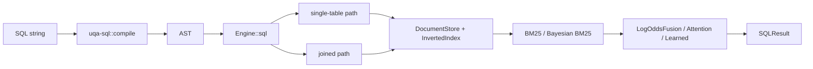

# UQA-RS Architecture

This is a high-level pointer for newcomers; the formal contract lives in
[`docs/plans/0001-uqa-python-to-rust-port.md`](../plans/0001-uqa-python-to-rust-port.md).

## Crate dependency layers

```mermaid
graph TD
    core["uqa-core"]
    analysis["uqa-analysis"]
    storage["uqa-storage"]
    scoring["uqa-scoring"]
    fusion["uqa-fusion"]
    operators["uqa-operators"]
    graph["uqa-graph"]
    joins["uqa-joins"]
    sql["uqa-sql"]
    fdw["uqa-fdw"]
    engine["uqa-engine"]
    api["uqa-api"]
    cli["uqa-cli"]
    analysis --> core
    storage --> core
    storage --> analysis
    scoring --> core
    scoring --> storage
    fusion --> core
    fusion --> scoring
    operators --> storage
    operators --> scoring
    operators --> fusion
    graph --> core
    graph --> analysis
    joins --> core
    joins --> analysis
    joins --> graph
    sql --> core
    fdw --> core
    engine --> sql
    engine --> operators
    engine --> graph
    engine --> storage
    api --> engine
    cli --> engine
```

## What lives where

* `uqa-core` — `PostingList`, `GeneralizedPostingList`, `Value`, `Vertex`,
  `Edge`, `IndexStats`, `Predicate`. The Boolean algebra over posting lists
  is property-tested against the 11 axioms from Paper 1.
* `uqa-analysis` — porter stemmer, character filters, token filters,
  analyzer pipelines, language presets.
* `uqa-storage` — `DocumentStore`, `InvertedIndex`, `VectorIndex`,
  `BTreeIndex`, `BlockMaxIndex`, `SpatialIndex` (R-tree), `Catalog` with
  schema migrations. Both in-memory and SQLite-backed implementations.
* `uqa-scoring` — `BM25Scorer`, `BayesianBM25Scorer`, three-term posterior
  transform, `WANDScorer`, `BlockMaxWANDScorer`, calibration metrics,
  `MultiFieldBayesianScorer`, `ParameterLearner`.
* `uqa-fusion` — `LogOddsFusion`, `AdaptiveLogOddsFusion`,
  `ProbabilisticBoolean`, `LearnedFusion`, `AttentionFusion`,
  `MultiHeadAttentionFusion`, query feature extractor.
* `uqa-operators` — `Operator` trait + `ExecutionContext`, primitive
  (TermOperator, FilterOperator, ScoreOperator, FacetOperator), boolean
  (Union/Intersect/Complement), hybrid (HybridTextVector, LogOddsFusion),
  vector (Cosine/KNN/VectorSimilarity), multi-stage, sparse,
  progressive-fusion, hierarchical (PathFilter/Project/Aggregate /
  UnifiedFilter), deep-fusion (Embed/Signal/Dense/Flatten/GlobalPool/
  Softmax/BatchNorm/Dropout/CNN1D/CNN2D/RNN/LSTM/Propagate/Conv/Pool/
  Attention). The deep-fusion
  graph layers depend only on a `GraphNeighborLookup` trait so they remain
  decoupled from `uqa-graph`.
* `uqa-graph` — `MemoryGraphStore` with named graphs, `GraphPostingList`
  with the Phi homomorphism (Theorem 1.1.6, Paper 2), pattern matching
  (`GMatch` with arc consistency + MRV + negated-edge post-filter), RPQ
  parser/NFA/DFA + `RegularPathQuery` operator, full openCypher front-end
  (lexer, AST, recursive-descent parser), read-only and mutating
  executors, centrality (PageRank, HITS, betweenness), message passing,
  embedding, indexes, incremental matcher, deltas + versioned store with
  rollback, temporal filtering, cross-paradigm operators.
* `uqa-joins` — text-similarity (Jaccard), vector-similarity (cosine),
  hybrid (structured + cosine), graph-driven, cross-paradigm vertex/document
  bridging.
* `uqa-sql` — `libpg_query` Postgres parser → internal AST → compiled
  statement; SQL function registry covers `text_match`, `knn_match`,
  `fuse_log_odds`, `multi_field_match`, `staged_retrieval`, `graph_*`,
  `deep_predict`.
* `uqa-fdw` — `ForeignServer`, `ForeignTable`, `FDWPredicate`, `FDWHandler`
  trait, `MemoryHandler` reference implementation with predicate pushdown,
  projection, limit, and `LIKE` matching.
* `uqa-engine` — top-level `Engine` with table state, catalog restore,
  `search` / `knn_search` / `hybrid_search` / `sql` entry points, named
  graph storage, deep-model save/load/predict, parameter persistence.
* `uqa-api` — fluent `QueryBuilder` over the SQL surface; ships every SQL
  function as a typed method.
* `uqa-cli` — `usql` REPL (multi-line SQL, meta commands, in-memory or
  persistent engines). The TTY path uses `rustyline` for editing,
  persistent prompt history, history hints, completion, and ANSI
  highlighting; completion combines static SQL keywords, live engine schema
  names, and `uqa-sql` registry names for UQA functions.

## Data flow at a glance



Graph and deep-fusion paths slot in via the SQL function registry: the
engine builds an `ExecutionContext`, dispatches to the corresponding
operator, and re-emits the resulting `(doc_id, score)` pairs as standard
SQL rows.

INNER JOIN takes a hash-join fast path when the `ON` predicate is a
clean equality between qualified columns from the two sides; the engine
buckets the right side by join key once and probes per left row in
`O(left + right)`. Anything else falls back to the nested-loop
`cross_filter`. See `try_hash_inner_join` in
[`crates/uqa-engine/src/sql.rs`](../../crates/uqa-engine/src/sql.rs).

## Inference and persistence

* `uqa-engine` owns named in-memory graphs (`MemoryGraphStore` keyed by
  string). The SQL function family `graph_pagerank`, `graph_traverse`,
  `graph_neighbors` reads them directly; the Cypher executors run
  through the same `Engine::graph_with` / `graph_with_mut` accessors.
* `uqa-ml` exposes serializable `DeepModel` specs, deep-fusion inference
  backends for dense, CNN, RNN, LSTM, graph, pooling, and attention layers,
  analytical `deep_learn`, and optional Apple MLX support
  through the official `mlx-c` system library when MLX development files are
  available. `uqa-engine` persists those models through the catalog's
  `_models` table and exposes the SQL adapters
  `deep_learn('model_name', 'training_table')` and
  `deep_predict('model_name')`.
* `uqa-scoring::ParameterLearner` wraps `BayesianProbabilityTransform`
  with an SGD update on the logistic loss, so `(alpha, beta, base_rate)`
  can be tuned online without breaking the calibrated path's contract.

## Parity, IR quality, and benchmarks

* SQL golden harness — `crates/uqa-engine/tests/sql_golden.rs`,
  fixture at `tests/parity/sql_golden_fixture.json`.
* BEIR-style relevance gate — `crates/uqa-engine/tests/beir_fixture.rs`,
  fixture at `tests/parity/beir_fixture.json`. Reads the corpus,
  graded judgments, and the `min_ndcg` / `min_map` floors directly
  from JSON so swapping in a real BEIR dataset is a file replacement.
  Format spec: [`docs/design/parity.md`](parity.md).
* IR metrics — `dcg_at_k`, `ndcg_at_k`, `average_precision_at_k`,
  `mean_average_precision_at_k` in `uqa-scoring::metrics`.
* Calibration metrics — `CalibrationMetrics::log_loss` and
  `CalibrationMetrics::brier`.
* Criterion benches:
  * `cargo bench -p uqa-core    --bench posting_list`
  * `cargo bench -p uqa-scoring --bench bm25`
  * `cargo bench -p uqa-scoring --bench calibration`
  * `cargo bench -p uqa-engine  --bench sql_e2e`
  * `cargo bench -p uqa-engine  --bench sql_1m`
  * `cargo bench -p uqa-engine  --bench knn`
  * `cargo bench -p uqa-engine  --bench join`
  * `cargo bench -p uqa-graph   --bench rpq`

## CLI

`usql` (built from `uqa-cli`) is a multi-line REPL with a Python-compatible
entrypoint shape: `--db <path>` opens persistent storage, `-c <sql>` executes
and exits, and positional script files run before the REPL when stdin is
interactive. Statement history persists to `$UQA_HISTORY` or the Python
default `$HOME/.cognica/uqa/.usql_history`; `\history` dumps the buffer and
`\history clear` deletes it. Interactive sessions add readline editing,
history suggestions, backslash-command completion, table / foreign table /
column completion from the live engine, and syntax highlighting. UQA function
names are not duplicated in the CLI; the completer and highlighter ask
`uqa_sql::registry` for registered SQL functions, so adding a function to the
compiler registry makes it visible to the shell. Meta commands include the
Python surface (`\?`, `\dt`, `\d`, `\di`, `\dF`, `\dS`, `\dg`, `\ds`, `\x`,
`\o`, `\timing`, `\reset`, `\q`) plus Rust migration and engine-switching
helpers (`\open`, `\new`, `\where`, `\run`, `\migrate-python-db`).

## Where to read next

* Operator algebra invariants — `crates/uqa-core/tests/algebra.rs`
* Phi homomorphism — `crates/uqa-graph/tests/algebra.rs`
* Cypher parsing — `crates/uqa-graph/src/cypher/parser.rs`
* SQL compilation — `crates/uqa-sql/src/compiler.rs`
* Hash join — `try_hash_inner_join` in `crates/uqa-engine/src/sql.rs`
* Engine entry — `crates/uqa-engine/src/lib.rs`
* Parity fixtures — [`docs/design/parity.md`](parity.md)
* Master plan — `docs/plans/0001-uqa-python-to-rust-port.md`
