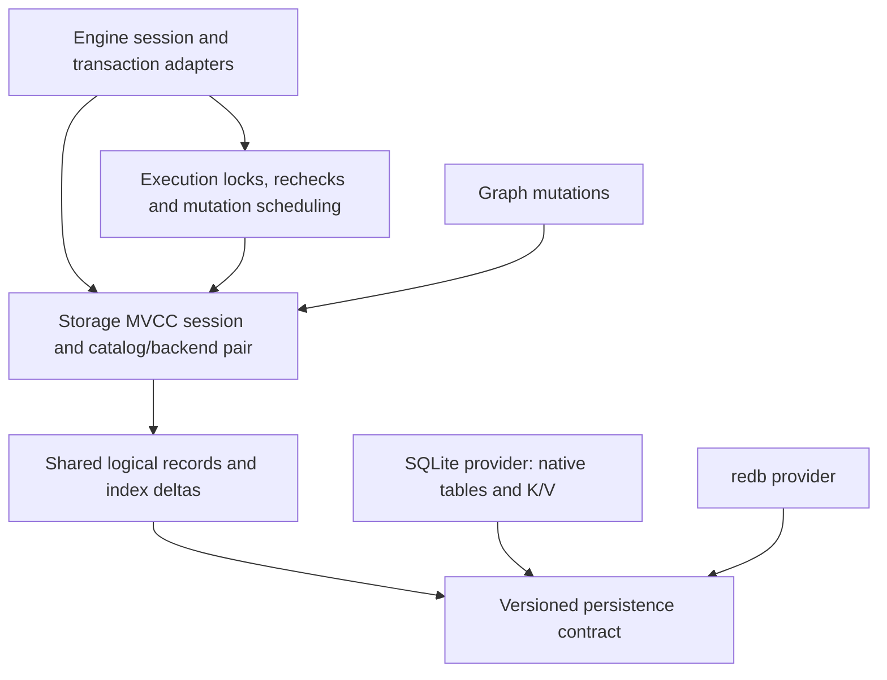

# Concurrent storage transactions

Status: Implementation in progress. This design was checked against UQA 0.3.6 at `24e464f7709cd5d942df8d0aeef5d522716b1bfb` on 2026-09-16. Direct SQLite Key/Value and redb sessions now use common MVCC, but native relational SQLite and the complete concurrent SQL capability described here remain unfinished. The [implementation plan](../plans/0008-concurrent-storage-transactions.md) tracks the work and acceptance evidence; the [storage manual](../manual/internals/03-storage.md) distinguishes released behavior from development changes.

## Required outcome

SQLite and redb remain durable storage providers. UQA owns multiversion concurrency control (MVCC), private transaction changes, logical conflict detection and publication above their physical transactions. If transaction A has changed row 1 and remains open, transaction B must be able to change independent row 2 and commit before A finishes. Both committed changes must survive reopen; rolling A back must preserve B. This applies to the default relational SQLite provider, SQLite Key/Value storage and redb, including writes whose rows share physical index records.

The same-file physical commit remains serialized: standard [SQLite permits one writer](https://www.sqlite.org/isolation.html), and [redb permits one write transaction](https://docs.rs/redb/latest/redb/struct.Database.html#method.begin_write). The design moves ownership of that writer from the entire SQL transaction to validation and atomic persistence of its prepared changes. It does not promise parallel file writes or a particular throughput improvement. Large commits still do work proportional to their changes.

PostgreSQL 18 behavior is the acceptance target for SQL snapshots, conflicting writes, constraints, locking and transaction errors. A difference discovered during this work is a bug to fix and track in the [PG18 compatibility plan](../plans/0003-postgresql-18-compatibility.md), not a waiver. Completing this storage change does not establish parity for unrelated PostgreSQL features or the entire upstream regression corpus.

## Existing implementation and dependency audit

| Current boundary | Verified source | Consequence |
| --- | --- | --- |
| Provider creates a catalog/backend pair bound to one session | [`backend.rs`](../../crates/uqa-storage/src/backend.rs), `PersistentStorageProvider` and `PersistentStorageSession` | Preserve this atomicity boundary; both handles must use the same logical transaction too. |
| Native relational SQLite begins with `BEGIN IMMEDIATE`; development Key/Value sessions use common private changes | [`connection.rs`](../../crates/uqa-storage-sqlite/src/connection.rs), `begin_transaction`, and [`key_value.rs`](../../crates/uqa-storage-sqlite/src/key_value.rs) | Native relational writes still retain a physical writer until outer commit/rollback. Key/Value sessions now use short physical commits. |
| The redb provider shipped in UQA 0.3.6 retained `WriteState.transaction`; development sessions now use common private changes | [`logical sessions`](../../crates/uqa-storage/src/mvcc/session/mod.rs) and [`record persistence`](../../crates/uqa-storage-redb/src/mvcc/mod.rs) | Independent Key/Value writes now overlap; Engine's writer gate and shared-index/SQL integration still prevent a complete concurrent SQL capability. |
| Engine promotion and eager transactions acquire the backend writer relation | [`transactions/backend.rs`](../../crates/uqa-engine/src/transactions/backend.rs) and [`coordinator.rs`](../../crates/uqa-engine/src/transactions/coordinator.rs) | A new provider alone cannot remove the serialization. The writer also participates in deadlock detection and savepoint cleanup. |
| Logical row/relation locks, change tracking and cross-process waits already exist | [`uqa-execution::row_locks`](../../crates/uqa-execution/src/row_locks/mod.rs); Engine only [reexports them](../../crates/uqa-engine/src/row_locks.rs) | Extend the existing execution owner; do not build a second SQL lock manager in Engine or storage. |
| Shared K/V algorithms store clustered postings and index generations | [`key_value`](../../crates/uqa-storage/src/key_value.rs), [occurrence format](occurrence-posting-format.md), [vector design](vector-indexes.md) | Distinct rows can replace the same physical value. Buffering opaque `put` operations alone loses updates or creates false conflicts. |
| Engine registries and durable handles are private to a session | [Engine state ownership](engine-state-ownership.md), [`transactions/snapshots.rs`](../../crates/uqa-engine/src/transactions/snapshots.rs) | Refresh and rollback must preserve another writer's committed state and this session's own changes together. |

The reviewed manifests are [`uqa-storage`](../../crates/uqa-storage/Cargo.toml), [`uqa-storage-sqlite`](../../crates/uqa-storage-sqlite/Cargo.toml), [`uqa-storage-redb`](../../crates/uqa-storage-redb/Cargo.toml), [`uqa-execution`](../../crates/uqa-execution/Cargo.toml) and [`uqa-engine`](../../crates/uqa-engine/Cargo.toml). [`Cargo.lock`](../../Cargo.lock) resolves rusqlite 0.39.0, libsqlite3-sys 0.37.0 and redb 4.1.0. Native SQLite enables `bundled-sqlcipher-vendored-openssl`, `blob`, `cache` and runtime `functions` with default rusqlite features disabled; Emscripten uses plain bundled SQLite with `blob`, `cache` and runtime `functions`. Compressed SQLite uses rollback journaling, while ordinary file connections enable WAL. None of these configurations supplies the proposed logical transaction layer. `supports_concurrent_pinned_read_and_write` describes reader/writer coexistence, not multiple writers.

The [dependency policy](../../scripts/workspace-dependency-policy.json) permits common storage to depend on `uqa-core` and `uqa-analysis`, SQLite storage on common storage/core/analysis/graph, and redb storage on common storage. Common storage cannot import either provider or driver, even for tests. Execution cannot import either concrete provider. Engine has SQLite as a runtime dependency and redb as a development dependency; applications already compose a redb provider through the common interface. This design needs no new provider dependency in Engine and no relaxation of those boundaries.

### Runtime access paths

The following inventory identifies existing entry points that must join the new contract. It is an integration checklist, not evidence that those paths already use concurrent transactions. The SQLite Key/Value and redb paths now use common record histories and private overlays; the remaining entries still require the integration described below.

| Access path | Existing owner/entry point | Required integration |
| --- | --- | --- |
| Initial open and catalog restore | [`open/lifecycle.rs`](../../crates/uqa-engine/src/open/lifecycle.rs), `open_initial_session` and `initialize_storage` | Establish format/model identity before restore; prepare migrations under exclusive admission. |
| New sessions and manually paired handles | [`open/lifecycle.rs`](../../crates/uqa-engine/src/open/lifecycle.rs), `new_session` and `from_persistent_backends` | Bind one logical transaction to catalog/backend and validate affinity. |
| Eager begin, deferred promotion and commit | [`transactions/coordinator.rs`](../../crates/uqa-engine/src/transactions/coordinator.rs), [`backend.rs`](../../crates/uqa-engine/src/transactions/backend.rs), [`frame_finish.rs`](../../crates/uqa-engine/src/transactions/frame_finish.rs) | Replace lifetime writer ownership and unwritten-native-transaction replacement for concurrent sessions. |
| Statement and command boundaries | [`transactions/implicit.rs`](../../crates/uqa-engine/src/transactions/implicit.rs), [`command_scope.rs`](../../crates/uqa-engine/src/transactions/command_scope.rs), [`mutation`](../../crates/uqa-execution/src/mutation/mod.rs) | Preserve command-visible writes, source snapshots and implicit transaction ownership. |
| Savepoints and failure cleanup | [`transactions/savepoints.rs`](../../crates/uqa-engine/src/transactions/savepoints.rs), [`failure.rs`](../../crates/uqa-engine/src/transactions/failure.rs) | Restore only this transaction's overlay, event positions and eligible lock marks. |
| SQL locks and target rechecks | [`row_locks`](../../crates/uqa-execution/src/row_locks/mod.rs), [`query scope`](../../crates/uqa-execution/src/query/scope/row_locks.rs) | Preserve logical conflict waits; remove the obsolete backend-writer edge and add snapshot observations. |
| Native SQLite direct stores/catalog | [`backend.rs`](../../crates/uqa-storage-sqlite/src/backend.rs), [`catalog.rs`](../../crates/uqa-storage-sqlite/src/catalog.rs), [`document_store.rs`](../../crates/uqa-storage-sqlite/src/document_store.rs), [`btree_index.rs`](../../crates/uqa-storage-sqlite/src/btree_index.rs) | Route native reads and writes through versioned records; protect materializations from uncoordinated old writers. |
| SQLite K/V and redb | [`SQLite key_value.rs`](../../crates/uqa-storage-sqlite/src/key_value.rs), [`common sessions`](../../crates/uqa-storage/src/mvcc/session/mod.rs), [`redb records`](../../crates/uqa-storage-redb/src/mvcc/mod.rs) | Both providers now use common logical sessions and short durable operations; complete typed shared mutations and Engine transaction-model integration. |
| Common K/V catalog and documents | [`key_value/catalog.rs`](../../crates/uqa-storage/src/key_value/catalog.rs), [`document_store.rs`](../../crates/uqa-storage/src/key_value/document_store.rs) | Carry object generations, typed writes and the same catalog/data snapshot. |
| Full-text/occurrence and counter updates | [`common inverted index`](../../crates/uqa-storage/src/key_value/inverted_index.rs), [`SQLite inverted index`](../../crates/uqa-storage-sqlite/src/inverted_index.rs) | Merge per-document deltas into shared clusters and totals, preserving old reader versions. |
| IVF/HNSW persistence | [`common IVF`](../../crates/uqa-storage/src/key_value/ivf_persistence.rs), [`common HNSW`](../../crates/uqa-storage/src/key_value/hnsw_persistence.rs), [`SQLite vector stores`](../../crates/uqa-storage-sqlite/src/vector_index) | Prepare from immutable canonical values, validate physical bases and atomically publish matching roots. |
| Graph data and retained resources | [`PersistentGraphStore`](../../crates/uqa-graph/src/persistent_store.rs), [`graph snapshots`](../../crates/uqa-engine/src/graphs/snapshots.rs) | Bind graph mutations to the same catalog/backend session and retain version leases across cloned handles. |
| Cache, routine, analyzer and model publication | [`catalog synchronization`](../../crates/uqa-engine/src/open/catalog_sync.rs), [`registry synchronization`](../../crates/uqa-engine/src/open/registries.rs), [`epoch publication`](../../crates/uqa-engine/src/transactions/publication.rs) | Refresh committed revisions without discarding private changes; recover durable commits before republishing epochs. |
| Sequences and identifiers | [`sequence lifecycle`](../../crates/uqa-execution/src/schema/sequences/lifecycle.rs), [`sequence adapter`](../../crates/uqa-engine/src/capabilities/sequence_values.rs), [`backend promotion`](../../crates/uqa-engine/src/transactions/backend.rs) | Native sequence catalog/value APIs now join the selected session. Integrate transactional definitions versus autonomous allocation into the SQL model; replace session-local document-ID reservations with coordinated non-reuse. |
| LISTEN/NOTIFY | [`notification hub`](../../crates/uqa-engine/src/notifications/hub.rs), [`cross-process delivery`](../../crates/uqa-engine/src/notifications/cross_process.rs) | Couple publishable notifications to a durable commit receipt and preserve rollback/delivery order. |
| Statistics and physical maintenance | [`statistics.rs`](../../crates/uqa-engine/src/statistics.rs), [`maintenance.rs`](../../crates/uqa-execution/src/maintenance.rs), [`maintenance adapter`](../../crates/uqa-engine/src/capabilities/maintenance.rs) | Make background sessions, rewrites, index rebuilds and compaction explicit protocol participants. |
| Cursors, temporary objects and callbacks | [`portals`](../../crates/uqa-engine/src/session/portals), [`transaction snapshots`](../../crates/uqa-engine/src/transactions/snapshots.rs), [`transaction scopes`](../../crates/uqa-engine/src/transactions/scope.rs) | Retain snapshots and session-local rollback; never replay callback/external effects during persistence. |

## Ownership and proposed interfaces



| Owner | Responsibility |
| --- | --- |
| `uqa-storage::mvcc` | Transaction IDs, snapshot leases, version visibility, ordered overlays, undo positions, record/range observations, serialization dependencies, commit validation, version reclamation and reusable conformance tests. |
| Existing `uqa-storage` document, catalog, posting and vector owners | Stable record identities, typed mutations, merge rules and versioned physical-index roots. Reuse existing codecs and algorithms. |
| `uqa-storage-sqlite` | Native-table and K/V record mapping, short SQLite read/commit transactions, schema migration, physical atomicity, encrypted/compressed storage and secure temporary storage. |
| `uqa-storage-redb` | redb record mapping, short native read/commit transactions, file-format migration and durability. |
| `uqa-execution` | Existing tuple/relation/key locks, waits, deadlocks, SQL mutation rechecks, deferred constraint execution and emission of logical read/write observations. |
| `uqa-sql` and `uqa-graph` | SQL binding/constraint semantics and graph algorithms respectively. Graph persistence emits transaction-bound records through storage contracts. |
| `uqa-engine` | Session attachment, SQL transaction characteristics, command/savepoint lifetimes, retained handles, cache/epoch publication, notifications and error translation. No version-chain or index-merge algorithms. |

Extend the provider contract with an explicit transaction model, initially `ProviderSerialized` for existing third-party implementations and `VersionedConcurrent` only for a fully conforming implementation. Also report the coordination scope, logical snapshot support and format identity. This is a database/provider property, not a session switch: sessions over one file must not mix transaction models. At completion all three built-in persistent paths use the concurrent model. Existing third-party stores retain their correct serialized contract until they implement the extension.

The proposed common interface separates a `TransactionSession` from `VersionedPersistence`. A session owns a snapshot lease, command visibility, logical observations, prepared mutations and savepoints. Persistence supplies bounded consistent read windows, ordered head/history access, one atomic commit handle, durable commit receipts, identity allocation and version deletion. The common layer determines visibility and conflicts; providers map records to bytes and guarantee physical atomicity. A provider must not implement a second version-visibility algorithm.

Use typed outcomes for committed receipts, logical conflicts, physical candidate re-preparation, cancellation/resource failure and indeterminate commit outcome. Engine translates those outcomes to SQL diagnostics without parsing provider error strings. A physical preparation retry is internal storage work, a serialization failure aborts the SQL transaction, and an indeterminate outcome cannot be reported as a known abort.

The current common sessions retain an uncertain transaction identity across subsequent failures, validate receipt identity/fingerprint and expose typed committed, aborted and indeterminate `CommitErrorOutcome` through storage error wrappers. Verified terminal outcomes remain locally retained until the session completes or discards the attempt. Engine keeps a distinct pending-commit frame: it blocks ordinary SQL, preserves statement/callback cleanup state, and resolves COMMIT without repeating SQL preparation. A matching committed receipt follows normal session publication, including when discovered by a ROLLBACK that must report it could not undo the commit. This resolves retained live-session attempts; durable publication recovery after process loss, cross-process notification recovery and the complete concurrent transaction-model contract remain implementation requirements.

`PersistentStorageSession` continues to bind catalog and data together and gains a shared logical transaction handle. `KeyValueStore` remains a low-level ordered-byte contract; extend it or introduce a narrow companion interface for versioned records and typed logical mutations. Do not claim concurrent SQL support by wrapping its existing `put`/`delete` calls alone. Internal bypasses, public direct-storage APIs, maintenance and migration must either join this transaction handle or enter an explicit exclusive maintenance boundary.

`StorageSessionAffinity` now identifies the native or common logical transaction context shared by a built-in catalog/backend pair. `PersistentStorageSession` validates these identities, and Engine applies that check before initial restoration and sibling attachment, including manually supplied handles. Different sessions over one file are rejected. Legacy custom pairs that both omit identity retain their existing caller-managed contract; wrappers around a reporting implementation must forward its identity. The concurrent model must additionally validate format/model identity and require a reported shared context before enablement. Public Rust construction changes require migration notes and actual downstream compilation with development dependencies excluded.

The common [`VersionedPersistence`](../../crates/uqa-storage/src/mvcc/persistence.rs) interface now defines durable transaction allocation, retained snapshots, conditional commit, receipt lookup and abort. `CommitFailure` separates known rejection from indeterminate native commit outcomes, and `CommitStatus::Unknown` is not treated as proof of rollback. `PreparedRecordCommit` fingerprints its ordered evaluated records with SHA-256 before commit admission; receipt retries accept only the same prepared batch. The [redb record adapter](../../crates/uqa-storage-redb/src/mvcc/mod.rs) and [SQLite record adapter](../../crates/uqa-storage-sqlite/src/mvcc/mod.rs) implement this contract with short physical transactions, using Immediate durability and FULL synchronization respectively. Existing SQLite Key/Value and redb catalog/backend sessions now use common logical sessions and migrate legacy files. SQLite connection clones share the same logical transaction, and independent sessions retain private changes without a physical connection. Both record adapters retain all versions/receipts; native catalog/backend routing and complete restore integration, bounded reclamation, shared-index merging and full SQL capability remain required.

Common storage moves its existing `sha2` development dependency into runtime dependencies, retaining the workspace configuration with default features disabled. redb adds the workspace `getrandom` dependency for durable database incarnation identities. These are provider/common-owner requirements and do not change workspace crate edges, introduce a driver into common storage, or add a redb runtime dependency to Engine. Other interface names in this proposal remain provisional; the ownership, visibility and atomicity contracts are required.

## Logical identities and durable versions

Use a durable database identity, a non-reused internal transaction ID, a monotonic commit sequence and stable object generations. Internal IDs are distinct from PostgreSQL-visible transaction IDs. A record key identifies its family, owning object generation and record identity; table names, reused OIDs, document IDs from another table generation and encoded SQL strings are insufficient identities. Rename changes name mappings without changing object identity; drop/recreate allocates another generation.

Every version records its logical key, commit sequence, codec version and value or tombstone. The durable format also includes object/name mappings, index-root generations, per-domain cache revisions, allocation watermarks and commit receipts. The latest committed sequence and every record changed by that commit become visible in the same physical transaction. Sequence exhaustion must fail explicitly before reuse or wraparound.

Native catalog cache generations combine committed revision rows with a metadata-only projection of the retained private journal. Private batch identities are unique across transactions and rollback branches, restore with savepoints and cannot alias durable SQLite generations. Source-to-scope mapping remains in the provider; the common journal exposes only bounded changed-key pages and opaque private identities. Table rename/removal checks both committed and private owner bindings, graph changes use visible memberships, and path-cache payload/validity changes do not invalidate SQL registries. Cache collections and temporary owner projections obey the session allowance. Native conversion/reopen validates canonical cache triggers; the known metadata text-slicing triggers upgrade atomically to preserve embedded-zero names without changing durable rows or history.

Keep native SQLite relational tables as current-state materializations and add provider-owned head metadata and history tables. The versioned record adapter is the only runtime access path to those tables once the format is enabled. It translates their existing row/catalog/index encodings into the common record contract. Historical reads consult version metadata and history; they must not read current native tables without visibility checks. This avoids requiring users of `Engine::open` to switch to a different K/V database, and does not introduce separate transactional semantics for native SQLite.

The provider now has a fixed inventory of the 43 native physical families plus table-owner and graph-lookup families. Object-scoped table data separates its stable object/storage generation from names retained in the physical row payload. Table and sequence definitions reject mismatched persisted owner identities. Native payloads preserve SQLite storage classes, including the distinct TEXT/BLOB B-tree namespaces, and borrow decoded fields from their charged record owner. Integer keys retain signed order, variable-length keys escape embedded zero bytes, and absent tombstones require a complete canonical key.

Native graph lookup records contain only identities selected by vertex/edge label, edge source/target or graph membership. Their separate keys avoid shared adjacency containers, permit selective historical reads without entity properties, and participate in the source transaction's private changes and commit checks. One projection definition supplies physical maintenance triggers and history conversion; commit admission rejects omitted lookup effects and lookup changes unsupported by final source rows. Mapping format 1 upgrades atomically to format 2 by deriving lookup additions/tombstones at the original source commit sequences, without allocating a new logical commit or rewriting source history and receipts. Catalog version 49 remains unchanged. Native graph reads now use these lookup records; graph mutations and shared path-index invalidation still require implementation.

Bound native catalog graph entity and membership reads retain one common snapshot for selectors, secondary predicates and payload hydration. The provider pages over lookup identities and releases physical I/O before probing another key; tombstone-only pages advance the cursor. Point entities, graph names, memberships, counts, maximum IDs and explicit full loaders use that boundary. Named-graph restoration reads registration, label registry and selected entities from the same view and preserves corruption checks. Common storage owns selector priority, which the native and Key/Value catalog implementations reuse. Native catalog graph writes and path-index operations now use the same session as described below; cache generations now use the same retained boundary; complete cache restoration and default Engine integration remain pending.

`SQLiteRecordStore::for_native` now converts an initialized schema 48 catalog atomically into a schema 49 current-state materialization and complete baseline history. The owner registry maps exact native names; canonical catalog names use persisted table identities, while distinct standalone names receive distinct owners. Conversion allocates missing table/sequence identities, removes cache triggers from internal persistence tables, installs materialization guards and validates the complete fixed table layouts. Populated raw histories cannot be merged into the baseline. Reopen validates the durable format and guards; raw record handles opened before conversion also reject subsequent access. The released 0.3.6 catalog and direct document writer reject the converted format in all four native file modes.

Native commit admission checks the original revision and physical row, records the expected final physical keys, and applies the evaluated batch in dependency order. SQL capture triggers collect every key changed by cascades or existing native triggers. An unprepared non-cache effect rejects the entire commit, so logical owners must supply evaluated B-tree removals and graph invalidations explicitly. Native cache increments are provider-derived effects and acquire history at the same commit sequence. Every owner-generation retirement must include all old rows; a new record cannot claim a physical key held by another generation. Current rows, prepared and cache histories, sequence and receipt publish in one transaction, and retained receipt resolution precedes materialization on retry. Size probes and reads share that physical transaction; SQL work queues retain no rows after commit or rollback. Complete native catalog, posting/vector and graph consumer routing is still required before this adapter can become the default Engine path. Shared-index deltas, admission leases, reclamation and full SQL semantics remain separate implementation requirements.

Native document routing now binds `ManagedConnection` to a mapping-checked common session. A compound read retains the common committed/private view, including its table-owner mapping; body, selected BLOBs, bulk reads and immutable document snapshots cannot mix revisions. A mutation holds the session gate across read/evaluate/stage and begins its logical transaction before reading metadata or old fields. The completed native document/BLOB/B-tree batch then joins the existing transaction or commits its owned autocommit transaction. Evaluation errors and unwinds leave no partial batch; failed publication retains the evaluated attempt. This gate belongs to one logical session and never serializes independent sessions. The native document implementation reuses the existing typed-value and BLOB validation codecs. Native B-tree APIs now share this session for definitions, repair markers and per-document postings; read operations pin markers and entries together, while independent row updates leave their common definition marker unchanged. Replacement validates duplicate IDs and backing document existence before staging. Native document deletion delegates its B-tree cascade to that owner. Complete catalog/posting/vector/graph routing, index-definition generation fencing, Engine restore integration and SQL command snapshot selection remain pending.

The native catalog registry subset now routes metadata, schema ACLs, model/scoring parameters and named/field analyzer records through the same managed session. Catalog attachment to an already bound native session skips legacy migration dispatch; unbound opening keeps its existing format checks. Named reads retain one snapshot, and field-binding replacement or legacy descriptor invalidation stages an atomic batch. Native format metadata cannot be changed through catalog setters. Registry/document failure and retry tests verify one publication boundary. Native views and foreign servers/tables also use the managed session: relation claims, definition rows and ACLs are staged together, rename preserves the full payload, and failed evaluation leaves neither partial definitions nor orphan claims. Legacy and native paths share catalog name/kind validation. Ordinary table definitions and catalog indexes now also use this session. Definition-only drop preserves data ownership, full drop clears fixed table-owned families, and purge retains field analyzers. Generation replacement transfers every fixed table-owned row; late inserts and old-generation writers are rejected at publication. Rename retains the catalog object identity, preserves exact standalone names and unaffected data, and updates index references atomically; changed name bindings are released before installing replacements so name reuse is independent of lexical order. Cache-revision restoration, index-definition fencing and SQL lock/visibility semantics remain required before default Engine opening can enable the format. Column field storage, ordinary catalog index-key rewrites and persisted statistics now share the same evaluated batch and read boundary. Field keys select relevant payloads before materialization, and B-tree ownership supplies parent/posting/repair semantics while preserving the named-expression namespace. Statistics replacement validates the complete input and retains no partial batch on failure. Dynamic FTS skip/block-max accelerators still need explicit record mappings with their posting consumers; native conversion rejects unmapped tables.

Native sequence catalog and value APIs now use the selected managed session. Creation/removal and rename stage relation claims with the sequence definition; replacement retires a changed definition generation, and nullable ACLs and owner dependencies use the same decoder as legacy SQLite. Reservation and set-value operations seek the sequence incarnation without scanning other sequence payloads and reuse the common reservation algorithm. Commit admission checks both the prepared definitions and current record heads so concurrent aliases or multiple live generations cannot share one incarnation; conversion rejects preexisting aliases without leaving a partial native format. Public storage tests cover independent writers, explicit autonomous sibling sessions, rollback/savepoints, retained generations and exact publication retry. These are provider/session operations: the new SQL model must still select autonomous operations for already committed sequences and preserve creation/restart/drop and session-cache semantics.

SQLite K/V and redb use equivalent head/history namespaces over their ordered stores. Physical namespace encoding remains provider-owned; logical record identity, tombstone rules and visibility remain common. The initial migration establishes a complete baseline, including catalogs and index generations, before allowing concurrent sessions. No lazily missing history may be interpreted as an empty record.

Reads choose the newest committed version no later than their snapshot, then apply eligible private changes. Prefix/range scans merge committed versions, inserts and tombstones in key order without duplicates. Paging retains the same logical snapshot and command boundary across all pages. Empty scans and absent-key reads are observations too; limits, reverse scans and early termination must describe the actual scanned predicate rather than just returned rows.

Native mapping format 3 extends the existing selector family with graph-to-path ownership. Format 2 upgrades only path-state projections; format 1 additionally creates entity/membership selectors. Backfill validates current sources and histories, streams each source revision, and preserves original commit sequences without rewriting preexisting selector histories. Native source rows precede their derived directory entries during physical projection. Catalog graph replacement/removal stages selected sources, memberships, orphan cleanup and path deletion atomically, with final duplicate input identities resolved before selector staging. The standalone graph table format is distinct from this catalog mapping and still needs its own transaction integration.

## Transaction and command lifecycle

```mermaid
sequenceDiagram
    participant A as Session A
    participant S as Shared MVCC
    participant B as Session B
    participant P as SQLite or redb
    A->>S: Begin; stage row 1 change
    B->>S: Begin; stage independent row 2 change
    B->>S: Commit prepared changes
    S->>P: Validate and atomically persist B
    P-->>S: Commit receipt
    S-->>B: Commit complete
    Note over A,S: A still owns its private changes
    A->>S: Commit or rollback
```

`BEGIN` creates logical transaction state without acquiring a native writer. Snapshot acquisition follows the SQL isolation and first-snapshot rules. Each command has an identity and a view of prior commands' writes. The session's own modifications are visible where SQL requires them, while a statement's source scans retain their command snapshot. Data-modifying CTEs, triggers, routines, cursors and subtransactions must use execution's command boundaries rather than treating every overlay entry as immediately visible to every scan.

An updating statement takes existing SQL relation/key/row locks, resolves the target version and performs any PostgreSQL-required recheck before staging the final row image and derived mutations. It evaluates SQL expressions, defaults, analyzers, callbacks and triggers at their normal execution point. A private mutation is not an unevaluated SQL command to run again at commit. The ordinary row/constraint locks survive to transaction end or their applicable savepoint rollback.

The first write marks the logical session written. `transaction_has_written` must recognize catalog, graph and index writes as well as row writes even though no physical transaction is open. Read-only enforcement must not infer writability from the existence of a native writer. Autocommit statements use the same logical machinery with one outer transaction.

Savepoints store ordered positions in the mutation/undo log, command state, lock acquisition marks, pending events and session-owned registries. Rollback restores the previous overlay and releases only eligible later locks; duplicate names and `RELEASE` retain the existing [PostgreSQL savepoint semantics](https://www.postgresql.org/docs/18/sql-savepoint.html). Read-dependency evidence needed for serialization safety can outlive a rolled-back subtransaction. Neither statement failure nor `ROLLBACK TO` opens, commits or partially persists a native writer.

## Conflict handling and isolation

| SQL mode | Required snapshot and conflict behavior |
| --- | --- |
| `READ UNCOMMITTED` | Use the same behavior as `READ COMMITTED`. |
| `READ COMMITTED` | Refresh the committed snapshot at each command while retaining the private write set. After a conflicting target writer ends, recheck the latest target tuple using execution's existing logic; keep unrelated statement source reads pinned. |
| `REPEATABLE READ` | Retain the first applicable transaction snapshot plus own writes. A committed conflicting target change after that snapshot causes `40001`. |
| `SERIALIZABLE` | Add nonblocking read/write dependency tracking to the fixed snapshot, including absent keys and ranges, and reject serialization anomalies with `40001`. Support the safe-snapshot wait for `READ ONLY DEFERRABLE`. |

These SQL requirements follow the [PostgreSQL 18 isolation contract](https://www.postgresql.org/docs/18/transaction-iso.html). A changed global database generation is not, by itself, a transaction conflict. Unrelated commits must not abort an otherwise independent writer. Uniqueness and foreign-key failures retain their constraint-specific errors; storage errors must not be indiscriminately translated into serialization failures.

Use serializable snapshot isolation with explicit read/write dependency edges and transaction overlap/commit-order tracking. Register read footprints before they can race with a writer, and check both existing writer intents when a read registers and existing reads when a write registers. Committed transactions retain necessary dependency summaries while overlapping transactions remain live. Detect dangerous dependency structures with commit-order and read-only rules, following PostgreSQL's [SSI algorithm description](https://raw.githubusercontent.com/postgres/postgres/REL_18_STABLE/src/backend/storage/lmgr/README-SSI); point write/write validation alone does not prevent write skew. SQL expression evaluation and predicate selection stay in execution, while the storage owner receives typed point/range/object observations. Indexless predicates may require relation-level observations, never a database-wide abort-on-any-write shortcut.

Before enabling the capability, verify write skew, phantoms, read-only anomalies, pivot transactions, overlapping committed readers and deferrable safe snapshots against controlled PostgreSQL schedules. Serializable implementations can choose different victims and access plans; compare valid outcome sets, required SQLSTATEs and serial histories rather than one arbitrary winner. False dependency conflicts caused by UQA's physical posting clusters or shared counters are not SQL predicate conflicts.

Unique, exclusion and foreign-key checks use logical key/range locks with SQL equality and collation semantics supplied by execution/SQL. Immediate constraints retain statement-time errors; deferred constraints and deferred triggers run before commit preparation is sealed. Key changes, parent deletion, partition movement, `ON CONFLICT`, `MERGE`, `UPDATE FROM` and cascading actions retain the existing target-version recheck path. Keep `NOWAIT`, `SKIP LOCKED`, lock timeouts, cancellation and cross-process wait edges in the existing execution lock manager. PostgreSQL [explicit locking](https://www.postgresql.org/docs/18/explicit-locking.html) defines the relevant conflict and savepoint behavior.

## Mutations that share physical records

Logical conflict keys and physical replacement keys are different. The write set records final logical changes and enough original-version information to validate them. Shared physical representations consume typed deltas against the latest committed representation inside the atomic commit boundary, preserving other transactions' disjoint contributions. Arbitrary serialized values are never merged heuristically.

| Data | Required mutation/publication rule |
| --- | --- |
| Rows and tuple metadata | Replace/delete one stable tuple identity after validating its target version; retain SQL command visibility and row-change chains. |
| B-tree, expression and unique indexes | Add/remove evaluated keys for the affected tuple. Reserve logical unique keys; never re-evaluate a user expression during persistence. |
| Full-text scores, occurrences and reverse terms | Apply per-document changes to the latest affected clusters. Merge independent documents even in the same `(field, term, cluster)` record. Version score and occurrence state together. |
| Counts, lengths and maintenance counters | Apply checked deltas to current committed totals, with transaction-local reads observing their own deltas. A stale absolute counter assignment is invalid. |
| Canonical vectors, IVF and HNSW | Prepare immutable candidates in the index owner; validate their physical base generations and recompute only internal index deltas if another commit changed shared structure. Publish canonical values and a complete matching index generation atomically. Readers pin roots; incomplete indexes cannot silently become brute-force indexes. |
| Graph vertices, edges, memberships, path indexes and deltas | Use stable graph/element generations and logical mutations. Preserve endpoint dependencies and version the resulting adjacency/path state with the owning transaction. |
| Catalogs, routines, analyzers, models, permissions and statistics | Version individual object records and name/dependency mappings. Drop/recreate and replacement use object/name locks; unrelated catalog changes cannot replace an entire stale registry. |

Internal index re-preparation must never rerun SQL, triggers, analyzers or host callbacks. It operates only on already evaluated canonical values and immutable descriptors. If a candidate's base generation changed, release the physical commit handle, re-prepare against the new base and validate again; permit no partial commit. Bound retained memory and poll cancellation. Repeated physical rebasing needs a fair commit reservation so independent writers cannot starve each other. The reservation covers internal preparation and persistence, not the outer SQL transaction or an application wait. Tests must force competing HNSW-node, posting-cluster and counter changes; a plain unindexed two-row test cannot establish this contract.

Prefix deletion must have a defined logical target. DDL/TRUNCATE acquire their required relation/object locks and stage generation changes or bounded tombstones; ordinary deletes act on the selected tuple identities. Replaying `delete_prefix` against whatever exists at commit would incorrectly delete another transaction's later inserts.

The implemented Key/Value graph path-cache subset uses typed source invalidation and completed-build effects in common storage. Provider layouts supply only key and row codecs. Private invalidation previews serve transaction reads but are discarded during commit preparation; current graph membership, directory entries and exact path ownership determine the durable invalidations. Explicit cache replacement/clear intent remains distinct from both previews and canonical writes. Completed builds validate definition bytes plus graph registration, label registry and membership/source revisions against their retained transaction boundary; stale builds remain invalid. Canonical records preserve their original compare-and-swap preconditions. Effect journals participate in atomic batches, savepoints, memory accounting and cancellation. The native catalog now supplies its own key/row codecs and routes graph source, membership and path-index operations through this resolver. Endpoint constraints, coordinated graph allocation, complete cache restoration and fair preparation admission remain unfinished.

Graph effect preparation currently uses a fresh committed sequence guard. The sealed fingerprint includes the original evaluated writes, cache-write kinds and ordered effects; the materialized replacements preserve that fingerprint. SQLite and redb resolve matching durable receipts before checking this guard or record heads. Only a changed guard with a proven pending receipt permits another pure preparation attempt after releasing the physical writer. This retry retains the original transaction allocation and does not replay SQL, graph algorithms, analyzers or callbacks. Ordinary batches retain their existing fingerprint format. The global guard favors correctness; the complete coordinator must still provide the fair admission required above.

Operation-specific visibility stays part of SQL execution. In particular, PostgreSQL documents [TRUNCATE as not MVCC-safe](https://www.postgresql.org/docs/18/sql-truncate.html); treating it as ordinary historical row deletes can produce the wrong result for an older snapshot that had not accessed that relation. Cover TRUNCATE and table-rewrite visibility, lock ordering, transactional rollback and `RESTART IDENTITY` separately from row-version tests.

## Commit protocol and publication

All writers, independent allocation operations, snapshot admission and reclamation participate in one database-scoped coordination protocol. Native SQLite coordination covers separately opened providers and OS processes; redb coordination covers sessions sharing its open database owner. Do not use a coordinator keyed only by an `Arc` address.

1. Finish SQL deferred checks/events while ordinary logical locks are held. Seal the command-visible write set, charge its memory/spill reservations and prepare immutable index/cached candidates outside the physical writer. No application callback runs after sealing.
2. Acquire cancellable commit admission through the database coordinator. Finish all logical lock waits before this point; retain no native read transaction while acquiring a native writer. The coordinator orders snapshot admission, commit publication and reclamation, and exposes relevant waits to execution without depending on it.
3. Open one fresh physical write transaction. Read current durable commit metadata and validate logical target versions, object generations, constraint reservations and serializable dependencies. Validate index preparation generations. A retry of internal physical preparation discards this entire handle before releasing admission.
4. Allocate the next commit sequence and write new versions, current materializations, derived indexes, catalog/name changes, commit receipt, cache revisions and transactional notification publication records atomically. Persist no user-visible part before this transaction commits.
5. Commit the physical transaction using the provider's declared durability. The durable receipt is the authority for outcome. Complete dependency/publication bookkeeping before another snapshot is admitted; after a crash, reconcile bookkeeping against the durable receipt before resuming admission.
6. Publish session-local cache observations and wake logical waiters. Release transaction locks and snapshot leases, deliver eligible notifications and clean up private spill. A cache refresh failure after durable commit invalidates the cache; it must not report that the transaction rolled back.

The current backend writer relation is removed from the lifetime of concurrent logical transactions. Engine branches on the explicit transaction model for begin/promotion/fencing/commit and keeps the existing conservative path for legacy providers. Do not simply delete `acquire_backend_writer_lock`: audit eager transactions, writer promotion, catalog miss fencing, savepoint restoration, row rechecks, schema operations, maintenance and error cleanup together. The existing test that forces a backend-writer/row-lock cycle must be replaced by a test proving that obsolete dependency is gone, while genuine row/relation deadlock tests remain.

Database coordination and physical persistence use a documented lock order. A participant must never wait for a SQL row/key/relation lock while holding commit admission or a native writer. Bounded physical read windows release their handles before calling user code, waiting for logical locks or publishing state. Cancellation and every unwind path release only the resources they own. Native busy conditions from external file access have an explicit timeout/error path; they must not cause a hidden replay of a SQL transaction.

An I/O failure can make a commit outcome uncertain. Retain a receipt keyed by internal transaction ID and resolve it by reopening/recovering the provider before returning a definite rollback or replaying physical work. If recovery cannot determine the result, fail the session with an explicit indeterminate-outcome error. Do not promise exactly-once client acknowledgement after process or connection loss.

## Snapshots, caches and retained resources

Long SQL snapshots retain logical version leases, not SQLite read transactions. Each storage call opens a bounded physical read window and uses the retained commit sequence. This is necessary for compressed rollback-journal files, where a long native reader would block the supposedly short writer. The same protocol works for WAL and redb; native snapshots can be an internal optimization only when they preserve lease/reclamation and resource contracts.

Snapshot capture and lease registration are atomic with respect to commit admission and garbage collection. Otherwise a reader can capture a sequence after the collector has decided that its required version is dead. Provider-owned coordination adapters implement cross-process lease/liveness transport; storage owns the horizon algorithm. Reuse execution's existing OS-lock practices where appropriate through narrow lower-level abstractions, without importing execution into storage or opening an existing POSIX coordination file through independent owners. Do not retire a live lease solely because a heartbeat timed out.

Catalog, graph and index caches are identified by object generation and logical snapshot/revision. On a `READ COMMITTED` command boundary, refresh committed state and reapply the session overlay. Rollback discards this transaction's state and rebinds the correct surviving snapshot; it must not restore an old whole-database image over another commit. Prepared statements, held table handles, cursors, graph snapshots, analyzers and index roots participate in retention and invalidation. A latest committed epoch is a cache invalidation signal, not permission to advance a fixed SQL snapshot.

Temporary relations remain session-local and retain their existing transaction/savepoint behavior. Memory-only engines remain covered by regression tests; their existing copy-on-write snapshots are not evidence that persistent multiwriter MVCC is implemented. Callback code and arbitrary external FDW side effects cannot be undone by a storage overlay; retain the existing explicit extension boundaries and never invoke them in an automatic retry.

Sequence definitions and ownership are transactional catalog state. Allocation and `setval` on already committed sequences follow the separate nontransactional [PostgreSQL sequence contract](https://www.postgresql.org/docs/18/functions-sequence.html), using brief coordinated durable operations even when a SQL transaction has private row writes. Preserve creation/restart/drop/rollback distinctions and session-local `currval`/`lastval`. Internal document/object IDs also need an atomic allocator, with non-reuse across concurrently open sessions and reopen; a session-local `next_id` or `max(id)+1` is insufficient. Allocating an ID does not publish its row.

LISTEN/NOTIFY effects remain transaction-bound. Notification order and delivery cannot precede durable commit, and a rollback must discard its pending publication. Sequence allocation, notifications, automatic statistics, model persistence, initial restore and background maintenance are mandatory participants in the access-path audit.

## Provider and platform requirements

| Path | Required integration |
| --- | --- |
| Default relational SQLite | Add versioned native-record adapters and route `Engine::open` plus public direct-storage paths through them. Preserve catalog/index formats by explicit migrations and atomic current-state materializations. |
| SQLite Key/Value | Implement the same versioned persistence contract over managed connections; reuse common catalog/index algorithms and the common mutation contract. |
| SQLCipher | Keep history, receipts and canonical values inside encrypted storage. New spill/coordination payloads must not expose plaintext values, index keys or credentials. |
| Compressed SQLite | Retain rollback-journal/VFS locking and authenticated-container invariants. Release physical readers between bounded calls; test process death and read-only opens. |
| redb | Keep `RedbStorage` as database owner. Replace session-long `WriteTransaction` state with common logical sessions and one write transaction per durable operation. Retain redb's exclusive file-owner boundary; this design does not add a broker allowing multiple processes to open the same redb file concurrently. |
| Browser WASM | Use the same logical transaction/overlay rules through Emscripten SQLite, preserving IndexedDB persistence. Interleaved sessions in one supported runtime must pass; do not imply that shared browser-tab file locking or redb browser persistence already exists. |
| Rust, Python, Node.js and server sessions | Preserve existing Engine/provider construction and SQL commands. Test actual concurrent/interleaved sessions through supported bindings rather than inferring behavior from compilation. |

No SQLite fork, `BEGIN CONCURRENT` build, new database dependency or local JVM is required. PostgreSQL reference execution uses Docker; any JVM-dependent regression tools also run only in Docker.

## Memory, reclamation and recovery

Account for private values, undo records, observations, index candidates and retained decoded data. Introduce explicit transaction-level retention limits alongside existing statement read/execution allowances. Spill through a provider-supplied temporary-storage capability when supported; common storage owns the ordered overlay and accounting. Encrypted configurations require authenticated encrypted spill and coordination payloads, or a documented bounded in-memory mode that reports resource exhaustion without writing plaintext. Limit checks and cancellation must leave committed state intact; no unbounded transaction-sized clone is permitted.

For a minimum retained snapshot sequence `h`, preserve each key's newest version at or before `h` and every newer version; with no retained snapshots, the current committed sequence supplies the horizon. Preserve additional versions/evidence required by candidates, serialization dependencies and retained index roots. Keep tombstone/object-generation evidence until references cannot mistake a deleted object for a reused one. Reclamation uses bounded batches under the same admission protocol and includes read-only snapshots and cursors. Receipts, dependency summaries and notification publication records need explicit retention horizons too, covering unresolved outcomes and recovery/publication consumers. Physical compaction/checkpointing is separate from logical history deletion. Storage pressure may backpressure new work or fail a bounded allocation; it must never reclaim a live reader's versions.

Process leases use OS-observable liveness and incarnation identity. On process death, roll back uncommitted physical work, discard private overlays/spill and retire only dead participants. If a writer died after persistence but before publication, recover the durable receipt and revisions before admitting new snapshots; other processes must observe the committed rows and catalogs without relying on the dead process's in-memory epoch. Coordination metadata cannot be the only durable copy of committed data. A database replacement or restored backup changes incarnation so stale sidecars/receipts cannot attach to an unrelated history.

SQLite's current `synchronous=NORMAL` WAL configuration does not by itself promise persistence of every acknowledged transaction after power loss, as specified by SQLite's [synchronous contract](https://www.sqlite.org/pragma.html#pragma_synchronous). Implementation must make the advertised durability explicit and use the required synchronization for a durable-commit mode; compressed storage and redb must be tested against their corresponding guarantees. Process-crash tests, fault injection and any power-loss durability claim are separate evidence. This work must not silently weaken existing durability settings to improve apparent concurrency.

## Migration and compatibility

Enable the format only under exclusive database maintenance admission with no live old-format sessions. Migrate existing SQLite relational/K/V and redb catalogs, rows, postings, index roots, graphs, sequences and allocation metadata in bounded pages. Publish the complete baseline, format version and capability together; an interrupted migration must recover either the old valid database or the complete new one. Reopen must be idempotent. Do not mix legacy catalog handles with versioned data handles or maintain two authoritative live formats.

SQLite relational migration extends the existing [migration registry](../../crates/uqa-storage-sqlite/src/catalog/migration/registry.rs), whose schema-version check rejects newer formats. That guard alone does not protect old standalone SQLite K/V writers. The K/V upgrade must move writable heads behind a versioned namespace and make the legacy write surface reject writes. For redb, a new metadata key is insufficient because 0.3.6 initializes the old tables without checking such a key. Migrate data to the versioned tables and retain an incompatible typed guard at the legacy writable table name so the old open path fails before writing. Test these guards with the actual old library/binary, not a new reader pretending to be old.

Standalone native SQLite stores also bypass catalog open. Protect writes to retained native materializations with persistent triggers that require a private provider-installed connection function and an active physical commit/maintenance permit. An old connection lacks that function and must fail before changing a row. The function only validates provider state; it performs no SQL, I/O or user callback. rusqlite's `functions` feature is now declared in the SQLite provider's native and Emscripten runtime dependencies, and the new record tables have these guards; protection of legacy writable surfaces remains required. Test insert/update/delete, format initialization, maintenance and packaged builds without development-feature unification. This is an accidental old-writer guard, not protection against a user deliberately editing the SQLite schema outside UQA.

All current Engine open variants and supported lower-level storage constructors need an explicit mode/format check. A newer binary may open an old database only through the migration boundary; an old binary must not silently mutate the new format. Preserve SQLCipher keys, compressed-container integrity and backup/restore behavior. Document the upgrade and recovery procedure with implemented evidence before enabling the new provider capability by default.

## Acceptance and rejected shortcuts

The [implementation plan](../plans/0008-concurrent-storage-transactions.md#acceptance-matrix) defines executable evidence for progress, isolation, all shared storage objects, failure recovery and delivery. Correctness is established with barriers and forced schedules, bounded fixtures and exact state/error assertions. A timeout is a deadlock guard, not a performance result. No uncontrolled timing campaign is part of implementation acceptance.

Increasing pool size, enabling WAL, adding a busy timeout, swapping SQLite for the current redb adapter, queueing entire SQL transactions, replaying SQL at commit, cloning/restoring the whole database, dropping the global writer lock without a replacement protocol, or rejecting every transaction after any global epoch change does not satisfy this design. A K/V-only implementation that leaves the default SQLite path serialized is also incomplete. Both providers must pass the full logical contract before the feature is declared complete.
