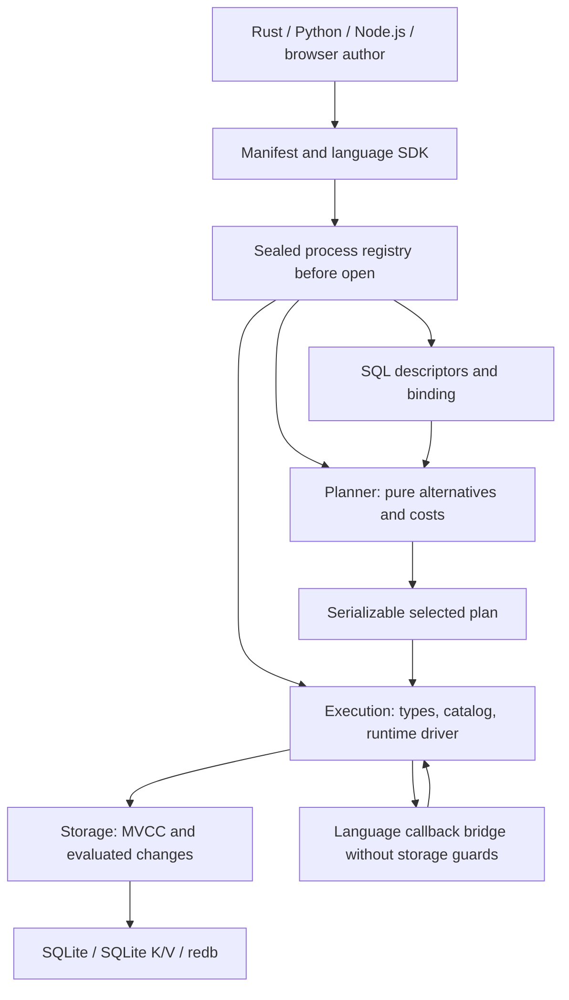

# Extension packages, data models, and SQL types

Status: Design proposal; the APIs, catalog additions, SQL support, and extension mechanisms described here are not implemented by this document. Public behavior remains defined by the [manual](../manual/README.md). All examples in this document are pseudocode, including examples using PostgreSQL syntax. Acceptance requires implementation, owner tests, PostgreSQL 18 differential evidence, and actual language-binding artifacts.

Design baseline: main commit `ae51060754813b716bea1cd5438214dfde9c9830`, inspected on 2026-09-25. Source proposal: `data-model-extension.md` (named `data-model-extention.md` in the request), SHA-256 `3065b2e916c1bfde693aac09f891355d8cb960dd0574eafc8047d9ae001500aa`. This proposal preserves its data-model, optimizer, transaction, and recovery requirements while adding extension packages, genuine SQL types, and extension authoring in Python, Node.js, and browser JavaScript. The source proposal's exclusions of new scalar types and non-Rust implementations no longer apply.

## Scope and terminology

An extension is a versioned package of definitions and implementations. A database installation activates its SQL objects and dependencies transactionally. A data model owns transactional entities and exposes typed relational or explicitly declared document projections. A SQL type supplies a value domain and the operations explicitly defined for that domain. A language binding can implement these contracts directly; it is not limited to using extensions compiled into a Rust binary.

| Term | Identity and responsibility |
| --- | --- |
| Package | Globally qualified package key, immutable versioned manifest, deployment artifacts, and available implementations |
| SQL extension | Database-local PostgreSQL extension name, owner, version, namespace, members, configuration relations, and dependencies |
| Model definition | Package-local stable identifier, operations, formats, optimizer hooks, and carrier contracts |
| Model instance | Database-incarnation-qualified, non-reused identity; schema name, owner, configuration, entity records, and indexes |
| Type definition | Package-local semantic contract; installed catalog type identity, I/O, operations, and storage formats |
| Implementation | Rust, Python, Node.js, or browser code implementing one exact contract revision; distinct from stored data |
| Semantic revision | Meaning of operations, comparisons, codecs, and optimizer laws; distinct from a package's display version |

Required outcomes are persistent user-defined models; transactional package installation, update, and removal; user-defined base, enum, composite, and range types and their dependent arrays/domains; user-defined functions, casts, operators, operator families, and optimizer contributions; and direct extension authoring through all four language surfaces. Ordinary SQL and model operations must compose in the same query and logical transaction. A second independently authored model or type must not require another core enum branch or an Engine algorithm.

This design preserves PostgreSQL 18 behavior wherever PostgreSQL defines the construct. A difference in coercion, comparison, error, catalog identity, privilege, transaction behavior, or DDL lifecycle is a bug. UQA-specific model APIs have explicit contracts and must not silently redefine ordinary PostgreSQL SQL. Existing UQA carrier, scoring, graph, vector, and transaction semantics remain binding. The [AI contribution policy](../../AI_POLICY.md) requires written mathematical justification for new features; passing examples or property tests alone cannot establish the required laws.

Native PostgreSQL shared-library binaries are not an interchangeable UQA binary ABI. Loading arbitrary native libraries, executing untrusted code in a sandbox, and fetching code from a database are separate deployment mechanisms, not prerequisites for Python or JavaScript authoring. No such mechanism is claimed here. An extension implemented in a host language is real executable application code with that process's authority.

## Baseline and ownership

The current repository already supplies process-local scalar, table, streaming-table, and aggregate callbacks, plus logical MVCC, evaluated shared-index mutations, automatic serializable participation, retained commit outcomes, and provider recovery. The [concurrent transaction implementation plan](../plans/0008-concurrent-storage-transactions.md) records completed implementation and source-scoped acceptance in its closure ledger.

The missing abstraction is a durable, versioned extension contract spanning catalog binding, typed values, optimizer alternatives, runtime execution, and restoration. Current `Value` and `ColumnType` have closed built-in representations; `ColumnType::Named` is an unresolved name, not a stored user-defined type. `SourcePlan` has no generic owned-model source. `SourceStatistics::source_access_estimate` does not provide a general extension rule registry. Existing callback registration after Engine construction cannot supply codecs needed while opening a database. These are owner-level changes, not reasons to place another implementation in Engine.

The relevant Cargo manifests and [workspace dependency policy](../../scripts/workspace-dependency-policy.json) were inspected at the baseline. SQL has two internal dependencies, Planner three, and Engine fourteen; this design preserves those budgets and directions. Core, SQL, Storage, and the providers gain no dependency on an interpreter, a binding crate, or the proposed author SDK. Engine has no default analyzer features; Python, Node.js, and WASM enable Nori and Kuromoji by default. Extension availability must be independent of those analyzer features, with no feature switch per external package.

| Owner | Required behavior | Boundary |
| --- | --- | --- |
| `uqa-core` | Stable identities, neutral extension-value envelopes, bounded owned data, semantic operation references, and serialization framing | No SQL catalog, interpreter, package loader, or global registry |
| `uqa-sql` | Serializable descriptors and bound type references; extension/type DDL lowering; overload resolution; generic model source/command nodes and dependencies | Keep only Core and `pg-query` runtime dependencies; no runtime callbacks in plans |
| `uqa-planner` | Pure extension optimizer interfaces, property validation, access alternatives, costs, join enumeration, and EXPLAIN | Keep Core, SQL, and Operators dependencies; no mutable storage or execution context |
| `uqa-execution` | Catalog/type/operator resolution, installation execution, typed semantic operations, model runtime drivers, authorization, observations, and lifecycle validation | No concrete provider dependency; no dependency on Planner or a language interpreter |
| `uqa-operators` | Generic document-access operator and checked adapters into existing carriers | No package-specific operator variant or invented Payload algebra |
| `uqa-storage` | Namespaced versioned records, generic indexes, logical reservations, evaluated mutation recipes, retention, and receipts | No SQL or binding dependency; opaque semantics supplied through neutral requests |
| `uqa-storage-sqlite`, `uqa-storage-redb` | Physical mapping, short atomic publication, encryption, format negotiation, and recovery | No model algorithm or foreign callback under provider guards |
| `uqa-engine` | Pre-open registration/options, shared immutable registries, session/transaction adapters, and retained-resource ownership | No codecs, type coercion, optimizer, model, or index algorithm |
| `uqa-python`, `uqa-node`, `uqa-wasm` | Host-language SDK, interpreter-affine callback transport, typed conversion, and lifetime management | Each implements owner interfaces; no interpreter dependency is pushed into lower crates |
| `uqa-pg-server`, `uqa-pg-wire` | Server type resolution and extension text/binary I/O; wire framing remains independent | `pg-wire` does not learn SQL catalogs or execute codecs |
| Proposed `uqa-extensions` facade | Author-facing builders, manifest tooling, and reexports of Core, SQL, Storage, Planner, and Execution contracts | Owners never depend on the facade; Engine consumes owner types, not the facade |

The facade is an ergonomic SDK, not a new algorithm owner. Adding it requires an explicit dependency-policy entry and reviewed binding edges. The public `uqa` facade's existing dependency budget need not expand: applications may use the SDK alongside it. Tests live with their owning algorithms; each crate retains its single integration-test executable. Proposed module names in this document do not authorize moving existing algorithms into Engine.



Arrows in the diagram show data/control flow, not additional Cargo dependencies. Registry construction returns separately typed descriptor, optimizer, and execution registries. No lower owner obtains an Engine reference or uses a global singleton to reach another owner.

## Package identity, deployment, and registration

A manifest contains a globally qualified ASCII package key, exported SQL extension names, opaque SQL version strings, SDK protocol version, canonical descriptor digest, semantic revision, storage-format compatibility, deployment implementation identities, required packages, and resource limits. Exported local IDs for models, types, functions, access paths, and rules are stable and never reused for a different meaning. SQL identifiers retain PostgreSQL quoting and namespace rules; a package key is not a SQL identifier.

Each implementation has its own artifact digest and declared host/runtime requirements. The logical contract digest is independent of whether Rust, Python, or JavaScript implements it. Two implementations are interchangeable only when an explicit compatibility declaration and the contract's conformance evidence establish the same formats and semantics. A matching version label alone is insufficient. Binding a registry pins the selected implementation for the Engine lifetime and any retained sessions, plans, or cursors. Live replacement beneath an installed implementation is forbidden.

Descriptors use a bounded, versioned canonical encoding. Their digest does not depend on JSON object order, whitespace, Python object identity, or a function address. Validation rejects duplicate IDs, reserved namespaces, unresolved signatures, illegal dependency cycles, inconsistent capability claims, oversized metadata, and missing hooks before activation. Cyclic type declarations use explicit shell/completion dependencies; they are not excused by disabling graph validation. Digest validation establishes identity and integrity, not the correctness or safety of arbitrary executable code.

| Manifest component | Required contents |
| --- | --- |
| SQL package | Control metadata, installation scripts, directed update-script edges, dependencies, schema policy, membership, and configuration-dump declarations |
| Type | Value-domain specification; codecs and readable/writable formats; text/binary I/O; typmod/collation policy; functions, casts, operators, and operator-family contracts |
| Model | Entity/key schema; configuration schema; operations and effects; output slots/types; multiplicity/order; storage sections and shared-record recipes |
| Optimizer | Stable rule/access IDs; predicates, residual obligations, required outer bindings, cost/statistics schemas, bounded payload formats, and written proofs |
| Runtime | Concrete implementation identity, required host ABI/protocol, thread-affinity mode, cancellation/yield contract, and callback resource bounds |
| Lifecycle | Migration graph, dependency changes, validation, rollback, old-format retention, and explicit removal requirements |

Registration makes a package available to a process. `CREATE EXTENSION` installs it into a database. Model creation creates one instance of an installed model definition. Registering a package must not implicitly install SQL objects or open storage; installing a package must not download or import executable code. These are separate operations with separate errors and authorization.

Every constructor that can open or restore storage accepts an extension registry before catalog decoding: memory construction, persistent open, encrypted open, custom provider pairing, backup restore, and language-binding equivalents. Existing constructors remain usable for databases without extensions. A database that requires an unavailable or incompatible implementation fails to open before invoking its decoder; hiding unknown objects and opening a partial database is forbidden. New sessions share immutable implementations and acquire independent execution contexts and leases.

Host applications explicitly load their packages, then build and seal the registry. Python modules and JavaScript packages may be installed through their normal package managers; Rust crates use their normal dependency graph. No database record stores a pickle, closure, interpreter pointer, dynamically imported module path to execute, or JavaScript source. Persistent packages require stable manifests and reproducible implementation identity even when their functions were written in Python or JavaScript. Ephemeral registrations can omit persistence capability and must fail if asked to create durable dependent objects.

Remote clients can activate packages already deployed on the server and exchange typed values. A Python client of an unrelated Rust server does not automatically transfer Python execution capability. A Python-hosted server can register Python implementations before opening its databases. Cross-language reopening requires an explicitly compatible implementation in the destination host; otherwise it fails before decoding, without silently substituting a built-in implementation.

## SQL extension lifecycle

The SQL surface implements PostgreSQL 18 `CREATE EXTENSION`, `ALTER EXTENSION`, and `DROP EXTENSION`, backed by UQA's registered package artifacts. Installation names are database-wide, not schema-qualified; control metadata determines schema handling and dependency installation. `IF NOT EXISTS` retains PostgreSQL's notice behavior and does not become a version/digest equality assertion. Implementation compatibility is checked independently when opening or executing installed objects. See [PostgreSQL 18 CREATE EXTENSION](https://www.postgresql.org/docs/18/sql-createextension.html).

Control metadata and scripts retain PostgreSQL meanings: default version, required extensions, fixed/relocatable schema, trusted/superuser flags, script substitutions, dependency search path, membership, initial privileges, and configuration-table dump declarations. SQL versions are opaque strings; update selection follows the directed script graph, not semantic-version arithmetic. Installation/update scripts execute atomically and cannot control their own transaction. Secure name resolution and script execution must be implemented in SQL/Execution, not approximated by string replacement in bindings. See [PostgreSQL extension packaging](https://www.postgresql.org/docs/18/extend-extensions.html).

UQA deployment approval and SQL privileges are distinct. A manifest's `trusted` flag does not sandbox Python or JavaScript or authorize loading code. Once code is registered by the host, SQL installation and member ownership follow the target PostgreSQL privilege rules, including trusted-extension behavior. The PostgreSQL surface must not invent `GRANT USAGE ON EXTENSION`. Optional UQA model/package capabilities use explicitly separate UQA APIs and durable role identities.

`ALTER EXTENSION UPDATE`, `SET SCHEMA`, and member `ADD`/`DROP` use the real dependency graph and PostgreSQL ownership checks. Removing membership is distinct from deleting the member object. Updates install new SQL definitions and perform any required type/model migration as one logical transaction; no earlier visible catalog switch is allowed. See [PostgreSQL 18 ALTER EXTENSION](https://www.postgresql.org/docs/18/sql-alterextension.html).

`DROP EXTENSION` removes its members and applies PostgreSQL `RESTRICT`/`CASCADE` dependency semantics. A table column, model instance, view, routine, index, cast, or operator referring to an extension type must participate in dependency traversal. Individual member removal and extension removal must not leave callable orphan definitions. UQA-specific model dependencies extend this graph without pretending that every model is a PostgreSQL table. See [PostgreSQL 18 DROP EXTENSION](https://www.postgresql.org/docs/18/sql-dropextension.html).

Required catalog integration includes `pg_extension`, extension membership/dependencies, initial privileges and configuration-dump metadata, alongside the type/function/operator catalogs below. Available-extension metadata comes from registered artifacts; installed-extension metadata comes from the selected catalog snapshot. Logical dump/restore must preserve extension configuration data and user objects without replaying member creation twice. Physical backups include consistent package requirements and data formats, but no executable host objects.

The following illustrates the distinction between SQL installation and UQA-owned model creation:

```text
-- Proposed API; timeseries_demo must already be registered by the host.
CREATE EXTENSION timeseries_demo VERSION '1.0';
CALL uqa_data_model.create_instance(
  'public.samples', 'timeseries_demo.series', '{"value_type":"float8"}'::jsonb
);
BEGIN;
INSERT INTO devices(id, label) VALUES (7, 'outdoor');
CALL uqa_data_model.apply('public.samples', 'append',
  '[{"series_id":7,"timestamp_ns":100,"sequence":0,"value":21.5}]'::jsonb);
COMMIT;
```

## Extensible SQL values and types

### Representation and catalog identity

Introduce one generic extension-value envelope in Core, rather than one `Value` variant per package. Introduce one bound catalog-type reference in SQL, rather than treating `ColumnType::Named` or `JSONB` as a user-defined scalar type. Exact Rust names remain implementation choices; the semantic contents are fixed:

```text
ExtensionValue {
    type_identity: DatabaseIncarnation + NonReusedTypeId,
    format: StorageFormatId,
    payload: ImmutableBudgetedBytes,
}

BoundTypeRef {
    type_identity,
    catalog_oid,
    definition_generation,
    semantic_revision,
    typmod,
    collation,
}
```

An OID is a database-local catalog identifier, not a global type identifier or an encoded value. A semantic package/type key identifies a portable contract; a non-reused installed type identity distinguishes drop/recreate and database incarnations. Logical import resolves and validates the destination identity rather than copying source OIDs. Plans and stored envelopes contain stable references, not trait objects or closures. Arrays, domains, composite fields, range endpoints, routine signatures, and model outputs can recursively refer to installed types.

Core's envelope framing validates bounds and tags before dispatch. The registered storage codec validates the value domain and produces owned values under the caller's allowance. Unknown formats, invalid lengths, invalid domain values, or incompatible identities are typed failures, never `NULL` or opaque values that later compare as bytes. Existing value tags remain readable; adding a tag requires explicit reader/writer format negotiation and rejection by incompatible older writers. Representation-preserving backup and spill are separate from SQL comparison semantics.

The existing `Value::Ord`, `Eq`, and hashing conveniences cannot invoke fallible language callbacks. They must not silently define SQL order or equality for opaque payloads. The generic envelope has a stable representation identity for internal bookkeeping, while SQL consumers bind fallible semantic operations explicitly. An audit must move sorting, grouping, DISTINCT, hash/merge joins, array/row comparison, aggregates, uniqueness, indexes, statistics, caches, and spill consumers onto the appropriate typed contract wherever extension values can reach them. Existing built-in behavior must remain unchanged through that refactor.

In particular, Core's `has_same_representation` remains distinct from SQL equality: signed zero, decimal scale, temporal representation, and array bounds must not be collapsed merely because some selected operator regards two values as equal. Caches requiring exact representation cannot substitute an equality key. SQL operators need not share one universal equivalence relation across unrelated type families.

### Type forms and SQL binding

The target covers PostgreSQL base, shell, composite, enum, and range declarations, plus their generated array/multirange types and domain composition. Required I/O, optional hooks, typmod, collation, storage declarations, ownership, and signatures must be validated with PostgreSQL 18 rules; declarations cannot simply be accepted and ignored. Automatically generated array identity is obtained from the catalog rather than guessed from a leading underscore. A base type without binary hooks does not acquire an invented binary protocol. See [PostgreSQL 18 CREATE TYPE](https://www.postgresql.org/docs/18/sql-createtype.html).

| Type form | Design requirement |
| --- | --- |
| Shell/base | Transactional shell completion; validated input/output and optional receive/send, typmod, analysis, and subscripting hooks; no pointer-based durable layout |
| Enum | Catalog label identity and declared sort position; distinct enum types remain distinct; insertion/rename and transaction visibility verified against PostgreSQL |
| Composite | Ordered attributes with catalog identity, nested types, dropped-field handling, typed record I/O, and dependency-aware alteration |
| Range/multirange | Bound subtype, collation and operator class; canonicalization, empty/unbounded/inclusive semantics, and associated multirange identity |
| Array | Element type identity, dimensions/lower bounds, null elements, text/binary I/O, and recursive comparison without lossy host conversion |
| Domain | Base type plus constraints/typmod/null rules; checks at the same PostgreSQL coercion boundaries, including nested containers |

Enum ordering follows declaration/catalog order, not lexical label order. Different enum types are not implicitly comparable merely because their labels match. The oracle fixtures cover adding values to an existing enum versus creating and populating a new enum in the same transaction; transaction restrictions must not be generalized incorrectly. See [PostgreSQL enum types](https://www.postgresql.org/docs/18/datatype-enum.html) and [ALTER TYPE](https://www.postgresql.org/docs/18/sql-altertype.html).

Binding resolves functions, casts, and operators using installed catalog identities and the selected search path. Unknown literals and parameters, type categories/preferred types, polymorphic signatures, domains, collation, strictness, volatility, and overload ambiguity follow PostgreSQL. Explicit, assignment, and implicit cast contexts remain distinct; casts are directional. Binary-coercible casts require a validated representation contract, not identical Python classes or equal payload lengths. See [CREATE CAST](https://www.postgresql.org/docs/18/sql-createcast.html) and [operator type resolution](https://www.postgresql.org/docs/18/typeconv-oper.html).

The binder records resolved function/operator/cast IDs and generations in plans. Constant folding uses an immutable, per-registry semantic context and only eligible pure operations; the current Planner function-pointer evaluator must be extended without a global mutable callback registry. A folded expression retains its dependencies, typed error behavior, and resource accounting. UQA-specific optimizer hooks cannot add casts, change literal typing, or substitute a different operator after binding.

`pg_type`, `pg_attribute`, `pg_enum`, `pg_range`, `pg_proc`, `pg_cast`, `pg_operator`, `pg_opclass`, `pg_opfamily`, `pg_amop`, and `pg_amproc` must reflect actual implemented objects and their dependencies. OID allocation, relation row types, renaming, visibility, and introspection are catalog behavior, not fabricated metadata for clients. See [PostgreSQL type catalog](https://www.postgresql.org/docs/18/catalog-pg-type.html).

### Semantic operations, equality, and indexing

A type can be a valid scalar without defining equality, ordering, hashing, or arithmetic. Those capabilities come from its registered functions and operator families. An unsupported SQL operation produces the PostgreSQL diagnostic; it does not compare the envelope bytes. A bound semantic operation includes operand/result types, family and collation identity, implementation revision, null policy, and resource/error contract. Strict operators do not receive SQL nulls; non-strict functions receive an explicit SQL-null marker.

For a B-tree family, equality must be an equivalence relation and order must satisfy trichotomy and transitivity across every supported type combination. Casts within the family must preserve the relevant order. Hash operations must agree with the selected equality relation. Cross-type floating-point coercion can invalidate a purported family even when each single-type comparator looks correct. These are proof obligations for the family, not assumptions granted by registration. See [PostgreSQL B-tree operator-family laws](https://www.postgresql.org/docs/18/btree.html).

The design supplies two implementations of one typed-index contract. A proven order-preserving byte key permits direct ordered-key storage and precise encoded SSI ranges. A comparison-based index accepts a valid comparator without requiring a new byte-key hook absent from PostgreSQL. Both implement the same selected operator family, null ordering, collation, uniqueness, and range semantics. Missing byte encoding must not disable a valid PostgreSQL B-tree type or silently make a query use different comparisons.

The comparison-based path is a Storage-owned persistent ordered-tree algorithm represented as a resumable state machine. It owns page traversal, structural edits, and version checks; when it needs a comparison, it yields a bounded neutral comparison request. Execution resolves the bound semantic operation and invokes its Rust or language implementation outside provider guards, then supplies the result. SQL types and language runtimes do not become Storage dependencies. Tree entries retain the full typed value plus row identity; representation bytes are not used as semantic separators.

Publication uses evaluated row/index-entry changes and versioned structural recipes. Before a physical writer is acquired, the driver computes comparisons and a structural edit certificate against selected page generations. The short physical transaction validates those generations and publishes the recipe with the row changes and receipt. A changed page invalidates the structural certificate, not the evaluated logical mutation. The driver can rebuild the structural recipe outside provider guards from the same captured old/new values. It cannot rerun model mutations, SQL expressions, analyzers, triggers, or optimizer hooks.

Pure type comparisons may be called again while building or validating a structural recipe; their API promises deterministic semantics, not exactly-once invocation. This is an explicit addition to the source proposal for extensible scalar semantics. The source's exactly-once business-mutation rule and its prohibition on callbacks inside physical preparation/publication remain intact: a provider returns a stale-certificate result to the driver and never invokes a callback itself. Once publication may have occurred, receipt resolution takes precedence and no structural retry is attempted until the outcome is known.

Unique-key reservations use the selected semantic equality, not serialized-value identity. With a proven equality key, reservations are keyed directly. Otherwise, a versioned reservation set is sampled under a short guard, compared outside the guard, and conditionally updated only if its generation is unchanged. Equivalent claims wait on the owning transaction outside guards; different claims coexist. The same protocol works through the provider's shared coordinator across processes. This avoids a transaction-lifetime index or instance writer lock. Multi-column keys, null-distinctness policy, collation, key changes, and transaction/savepoint release are part of the reservation identity and PostgreSQL conflict protocol.

A comparison-only index without an order-preserving logical key uses conservative whole-index SSI read coverage, registered before exposing data. Writes still identify changed logical entries. This can cause additional valid serialization failures, but cannot omit a dependency or impose a lifetime writer permit. More precise comparison-aware predicates may be added only with an overlap proof. Physical page splits and root changes are not logical row conflicts. Retry work and page retention are bounded and cancellable; exceeding a resource limit is not permission to publish a partial index.

The current in-memory `BTreeMap<Value, ...>` index and typed index-comparison validation need a coordinated owner refactor. Adding `Value::Extension` first and leaving old consumers to use `Ord` is not an acceptable intermediate public feature. Sequential/indexed predicates, sorting, DISTINCT, grouping, hash/merge joins, uniqueness, and spill/reload must all agree before the custom-type capability is exposed.

### Codecs, bindings, and the wire protocol

Storage encoding, SQL text I/O, PostgreSQL binary I/O, host-language conversion, equality/hash keys, and order keys are separate interfaces. None is inferred from another without a proof. Binary protocol output uses the registered send function and catalog type OID; parameter input resolves its declared OID before invoking receive. Describe/result metadata, COPY, arrays/composites, prepared statements, nulls, and format negotiation all need owner and protocol tests. `uqa-pg-server` resolves semantics; `uqa-pg-wire` only frames the resulting fields.

Python can map a type to a Python class or return an immutable `ExtensionValue` wrapper. Node.js and browser SDKs provide the equivalent tagged wrapper and optional user conversion. Conversion of a parameter includes an explicit installed type reference; arbitrary objects are never implicitly pickled or stringified. Unknown client-side types remain lossless typed bytes/text with metadata when the server can produce that format. Unsupported server-side codecs fail explicitly. JavaScript transport uses tagged integers/decimals, byte buffers, nulls, temporal values, and nested shapes so that JSON numbers cannot round a 64-bit key or rational numerator.

## Owned data models and their SQL surface

A model definition describes its configuration, canonical entity key, value codec, storage sections, operations, output schemas, document projection if any, and optimizer capabilities. An operation declares typed arguments, null handling, cardinality/multiplicity, ordering, effects, access-path IDs, required outer bindings, and bounded state. Configuration and binding-time selectors determine output types without executing a model callback to discover the schema. Runtime data arguments remain parameterizable.

Each model instance receives a non-reused 128-bit identity within a database incarnation, separate schema/index generations, durable role ownership, and a schema-qualified name. Plans and stored dependencies bind identities rather than names. Renaming cannot retarget an existing cursor, and recreating the same name cannot satisfy an old dependency. Private catalog generations belong to the logical transaction and follow savepoint undo; committed generations are never overwritten with an entire stale process registry.

The reserved `uqa_data_model` API is recognized by SQL binding and lowered to generic model nodes. Ordinary functions with similar names cannot spoof its privileges or planning behavior. Selectors expressed as text use the SQL identifier parser, including quoting and schema qualification. When a selector determines the result schema, it must be known at binding time or supplied through an equivalent typed direct API. LATERAL references and prepared parameters are allowed for data arguments whose types are already fixed.

| Proposed operation | Contract |
| --- | --- |
| `create_instance(name, definition, configuration)` | Resolve an installed model definition; validate configuration, namespace, ownership, and transactional creation |
| `scan(instance, operation, arguments...)` | Typed relational source; usable with joins, filters, aggregation, LATERAL, views, routines, and prepared plans |
| `apply(instance, operation, payload)` | One atomic command, including a JSONB batch; validate the complete batch and undo all writes on failure |
| Rename/move | Preserve identity while updating namespace/dependencies and normal authorization |
| `upgrade_instance(...)` | Explicit format/configuration migration through a declared edge; no migration while opening |
| Drop with `RESTRICT`/`CASCADE` | Resolve dependencies, retire logical state, and reclaim only after readers release it |
| Instance/operation metadata | Snapshot-correct descriptor, owner, format, capability, and dependency information |
| Grant/revoke helpers | UQA instance/operation permissions bound to durable role IDs, with grantor identity and dependency checks |
| `analyze_instance(...)` | Explicit Execution-owned sampling and transactional statistics publication |

Package activation and removal use `CREATE EXTENSION` and `DROP EXTENSION`; a second independent `enable`/`disable` state machine is unnecessary. An installed package cannot be removed while dependencies remain except through the authorized dependency cascade. Direct APIs lower to the same command and authorization paths as SQL. A mutation can return an affected count and private visibility token through the direct API; this is not a durable commit receipt. `CALL` follows ordinary command completion instead of inventing result rows.

Read permission and permission to execute a particular mutating operation are distinct. Permission to install or use a package for creation does not grant read access to all instances. Model helpers must not implicitly execute as a privileged owner. Instance owners and grants use stable role IDs so that renaming a role or reusing its old name does not transfer authority. Dependency handling must cover role deletion and ownership transfer.

An instance is a catalog object in its schema namespace, but not automatically an ordinary relation in `pg_class`. A model that does not declare and implement a complete relation contract does not acquire arbitrary `INSERT`/`UPDATE`/`DELETE`, foreign keys, row locks, or writable views by pretending its scan is a table. Such model operations use the explicit API above. Ordinary PostgreSQL tables and declared relation adapters must retain their full PostgreSQL semantics; this distinction is not permission to waive a SQL compatibility bug.

### Runtime contracts

The runtime supplies configuration validation, creation, selected-access execution, evaluated mutation production, stored-state validation, and explicit migration. Immutable implementations are shared; mutable cursor and command state belong to one invocation. The host provides the selected catalog/data snapshot, private command overlay, original serializable participant, dependency readers, cancellation, and row/byte/scratch allowances. It never provides an Engine reference, a raw provider connection, transaction control, an arbitrary filesystem path, or a new independent transaction participant.

```text
ModelRuntime {
    validate_configuration(descriptor, configuration) -> CheckedConfiguration
    begin_scan(selected_access, typed_arguments, invocation) -> InvocationState
    begin_mutation(operation, typed_arguments, invocation) -> InvocationState
    resume(state, host_response, allowance) -> RuntimeStep
    validate_stored_page(format, owned_page, allowance) -> ValidationResult
    begin_migration(edge, invocation) -> InvocationState
}

RuntimeStep = ReadRequest | StageEvaluatedChanges | YieldRows
            | YieldDocumentBatch | Complete | Failure
```

This is an ownership protocol, not permission for an arbitrary runtime to impersonate storage effects. Requests name only declared sections, logical keys, recipe kinds, and operation capabilities. Execution validates each request against the active invocation and drives it through Storage. A scan consumes the access path selected by Planner; it cannot silently choose an unrelated index or approximate algorithm. If the selected path is invalid, dependency validation causes rebind or a typed error.

Rows and document batches are fallible and bounded by both rows and bytes. An oversized single entity must fail before an unbounded allocation. Late cursor errors, cancellation, or conversion errors release partially produced output and definition/snapshot leases. Empty results still carry stable output metadata. No physical read guard survives across a callback, a yield to the consumer, or a lock wait. Cursor drop, Engine close, and session cancellation must each have one terminal cleanup path.

## Optimizer integration

Extension planning is required functionality. A model source is not merely a table callback followed by opaque filtering. Planner owns a pure, bounded interface for derived properties, rewrite proposals, access enumeration, and estimates; model authors implement these hooks in Rust or a language SDK. The input contains immutable descriptors, index/catalog generations, statistics, known or unknown typed parameters, required output properties, cost coefficients, and a planning allowance. It contains no mutable store, runtime cursor, transaction handle, or query sampler.

```text
ModelOptimizer {
    derive_properties(source, immutable_context) -> CheckedProperties
    propose_rewrites(region, immutable_context) -> BoundedRewriteProposals
    enumerate_access_paths(source, requirements, immutable_context) -> Candidates
    estimate(candidate, statistics, cost_units) -> CheckedEstimate
}

SelectedModelAccess {
    instance_and_definition_ids,
    access_id_and_revision,
    typed_arguments_and_outer_bindings,
    predicates_and_residuals,
    required_properties,
    bounded_versioned_payload,
    dependency_generations,
}
```

A complete baseline scan remains a candidate. An empty proposal or explicit `NotApplicable` is normal; malformed properties, a missing selected implementation, an exception, invalid estimates, or an invalid rewrite are errors. They must not be hidden by quietly choosing the baseline. Candidate enumeration and rule application have limits on visits, memory, depth, and equivalent fingerprints, with deterministic tie-breaking. Existing Planner is not assumed to have a general memo or plug-in rule engine; those bounded interfaces must be implemented in Planner.

| Property | Required precision |
| --- | --- |
| Rows | Bound slot identities/types, SQL bag multiplicity, nullability, and output cardinality bounds |
| Keys/dependencies | Proven uniqueness and functional dependencies, distinct from sampled estimates |
| Predicates | Exact predicates, candidate-only predicates, residual filters, and null/error/volatility conditions |
| Ordering | Selected operator family/collation, null placement, tie keys, and whether order survives projection or rescan |
| Parameters | Required outer bindings, known versus unknown values, and legal rescan/materialization behavior |
| Retrieval | Complete versus approximate membership, score domain, calibration, and provenance |
| Cost | Startup and total work, rows, bytes decoded, CPU work, memory, spill, residual evaluation, and rescan cost |
| Validity | Definition, schema, index, statistics, implementation, and semantic revision dependencies |

Costs use host-comparable units and documented coefficients. A package cannot win by returning arbitrary dimensionless zeros. Statistics can affect estimates, never prove uniqueness or change the meaning of a predicate. ANALYZE runs separately through Execution with authorized observations and transactional publication. Planning must not read live model data or emit SSI observations. EXPLAIN identifies the package, access/rule IDs, estimated properties, cost components, residual predicates, and estimate provenance.

Typed rewrite proposals operate only on a bounded region and declared placeholders; they do not mutate arbitrary plans. Planner checks scope, type compatibility, dependencies, effect/volatility boundaries, security barriers, required bindings, and resource limits. Package proofs establish the remaining semantic conditions. Valid examples include range intersection after bound validation; projection that retains hidden identity and residual columns; indexed candidate filtering with an explicit residual; ordered LIMIT after all required filters and tie/offset handling; and model-local fusion that preserves evaluation semantics.

Partial aggregation requires a proven decomposition with the actual accumulator semantics. Floating-point addition is not associative, and an unspecified aggregate order is not a license to change required PostgreSQL behavior. Parameterized lookup is legal only when its outer bindings are available. Join reduction must preserve SQL bag multiplicity and null behavior. Error-producing argument validation cannot disappear merely because an optimizer proves that a result would be empty.

`SourceStatistics` must expose checked model alternatives to normal optimization. Model sources participate as atoms in join reordering; property-sensitive DPccp choices retain nondominated cost/order/binding alternatives instead of selecting one access path before join enumeration. Costs include required sorts, residuals, materialization, rescans, and binding transport. Generic prepared plans use unknown-parameter estimates; custom plans use bound typed parameters. The selected generic source and access payload flow into Execution without a second independent optimizer.

Execution caches may depend on snapshot and private command generations. Plan caches depend on definitions, implementations, types/operator families, schema/index/statistics generations, collations, parameter mode, and result shape. No cached plan captures a transaction handle. Schema changes that alter a prepared result type follow the existing PostgreSQL-compatible diagnostic. Statistics invalidation changes estimates only; execution cannot use an old schema or index definition merely because the data cache remains warm.

The deterministic optimizer fixture contains 1,000,000 rows, a time-window estimate of 10,000 rows, and a value-index estimate of 100 candidates. Fixture changes must select a full scan, time access, and value access in their appropriate cases and must change a legal mixed SQL/model join order. Costs include each path's residual and rescan work. The fixture is a planner experiment with specified statistics, not a noisy timing benchmark.

Required optimizer gates are: an external model with no per-model core branch; baseline plus multiple real accesses; checked typed rewrites; properties that affect consumers; comparable costs; mixed join-order changes; known/unknown parameter behavior; selected-access execution; correct observations for the executed path; and a second model with different rules and operators. Registering hooks that normal planning never consults does not pass.

## Carrier and algebra boundaries

The public relational projection has a fixed typed row schema and explicit bag multiplicity. A private model carrier stays private until an adapter establishes a contract with an existing UQA carrier. The [architecture contract](architecture.md), [manual carrier table](../manual/internals/01-architecture.md), and [foundational implementation plan](../plans/0001-uqa-engine-implementation-plan.md) remain authoritative.

| Carrier boundary | Required contract |
| --- | --- |
| Private state to rows | Deterministic projection under the selected snapshot, row identity, fixed slot types, and declared multiplicities |
| Entity to document | Explicit total mapping for the declared population into valid `DocId` values; no hash or timestamp masquerading as global identity |
| Document batch to PostingList | Sorted unique IDs, or host normalization with a specified duplicate/payload collision rule |
| PostingList to support | Deliberately lossy projection; score, positions, fields, graph information, and provenance are not preserved automatically |
| Ranking | Separate `RankedView` ordering and tie contract; storage order by `DocId` is not ranking |
| Tuples | Tuple identity and bag multiplicity, not an arbitrary single document identity |
| Graph | Complete graph carrier/codec contract; emitting vertex IDs alone does not produce `GraphPostingList` semantics |
| Complement | Exact declared universe and membership interpretation |
| Scoring | Distinguish raw distance, probability, and log evidence; preserve calibration, provenance, and single-prior application |

Many entities may map to one document only with an explicit membership and payload/scoring combination rule. Set intersection does not generally commute with such a projection; the proof below states the additional condition. A package cannot call Payload a semiring merely because `Relation<K>` has a semiring instance for some other $K$. An approximate vector access remains explicitly approximate and cannot replace an exact predicate. A private new carrier does not automatically create cross-package algebraic operations.

## Durable catalog, namespaces, and transactions

Package installations, type definitions, model instances, names, dependencies, statistics, and migration state are individual versioned records. Their logical identities include the database incarnation and object incarnation. Updates compare the affected records, never a process-wide registry blob. Shared catalog publication merges unrelated changes rather than replacing a sibling transaction's definitions with an older snapshot.

Model records use host-framed namespaces containing instance identity, definition/storage generation, section ID, and a bounded canonical key. The package cannot escape its instance namespace or allocate global provider tags. Canonical entities, secondary entries, configuration, and shared metadata all participate in common MVCC; no model-only SQLite connection or unversioned redb side store is allowed. Logical entity/index/catalog identities are distinct from physical pages and map cleanly to the common observation model.

| Provider/open mode | Required integration |
| --- | --- |
| Memory | Preserve current copy-on-write, snapshot, and rollback behavior; do not advertise a new persistent or cross-process guarantee |
| Native SQLite | Use the bound logical session, common versioned record mapping, existing encryption mode, and receipt authority |
| SQLite Key/Value | Use the common `VersionedStore` session and the same database/coordinator incarnation |
| redb | Use the supported shared database owner and logical sessions; do not imply independent simultaneous file owners |
| Custom/legacy wrappers | Declare capabilities and affinity honestly; serialized providers remain serialized until they implement the contract |

Opening, enabling a capability, creating another session, manual provider pairing, and wrapper construction must all validate the same transaction model and affinity. Required extension capabilities are checked before records are exposed. Unsupported storage capability is an explicit error; it does not select a different, weaker transaction path.

### Evaluated mutations and independent writers

A model operation evaluates its arguments, canonical target keys, old/new values, expected versions, derived logical index keys, and shared-record changes exactly once in its command context. Execution stages the resulting data-only intent and a private-operation checkpoint atomically. Failure during validation, encoding, secondary-index construction, or staging undoes all command writes while preserving required serializable reads. The whole JSONB mutation batch is one command, not a sequence of separately committed items.

Storage supplies generic recipes for conditional record replacement, ordered membership changes, checked counter deltas, existing index resolvers, and the typed ordered-index protocol above. Model authors choose and prove suitable recipes; they do not add package-specific variants to Storage. Arbitrary shared blobs cannot claim independent-writer support without a generic merge law. Per-entity and per-index-entry records are preferred to whole-instance serialized state.

Two transactions that mutate different entities of the same instance must remain independently admissible and may commit in either order. A shared count, index root, or physical page is resolved from evaluated changes and the current physical base; it is not a logical whole-instance conflict. A transaction-lifetime instance writer permit, whole-registry compare condition, or hidden global counter lock is forbidden. The existing provider's short physical writer remains necessary and must not cover callback work or lock waits.

Repreparation preserves captured business inputs and effects. It may apply host recipes to a newer physical base and rebuild a typed index's structural certificate under the narrowly defined pure-comparison protocol. It may not rerun a model mutation, SQL expression, trigger, analyzer, or planner. A lost commit reply cannot cause another append, another generated key, or another external side effect.

### Visibility and serializable observations

READ COMMITTED refresh preserves the transaction's private writes and applies PostgreSQL target-recheck behavior to the affected operation. REPEATABLE READ retains the selected snapshot plus private state. SERIALIZABLE uses the original automatically admitted participant, including nested callbacks, views, model access, LATERAL rescans, and cached results. Savepoint rollback restores private records, reservations, definitions, and operation state while retaining read dependencies required by the common SSI protocol.

Planning, costing, rejected alternatives, and EXPLAIN without execution emit no data observations. An executed access registers observations before exposing data. Tests cover absent entities, empty ranges, gaps, index-only reads, limit/top-k early exit, cached membership, nested views, and outer-parameter changes. A LIMIT 0 path that performs no read must not manufacture a read; argument validation and PostgreSQL expression-error behavior remain separately correct.

An access recipe names its logical object incarnation and the exact covered key domain when an order-preserving codec is available. Candidate indexes cover all possible qualifying entities before residual evaluation. Deleting a range expands actual changed points under a bound or uses a correctly declared whole-object write; the existing point/object write interface must not be misrepresented as an implemented arbitrary range-write predicate. Equivalent access plans may conservatively observe different supersets and select different serialization victims, but every committed history must remain serializable.

### Publication, receipts, and retention

Data, secondary indexes, relevant catalog changes, definition transitions, and the commit receipt publish as one logical atomic outcome through the existing provider. Cache publication follows confirmed durable state. A late cache failure invalidates or reconstructs the cache; it cannot relabel a committed transaction as rolled back or overwrite newer sibling state. An unresolved outcome blocks ordinary work until authoritative receipt reconciliation completes.

Completion distinguishes confirmed commit, confirmed abort, and unknown outcome. ROLLBACK that discovers an already committed receipt reports the correct completion and cannot undo it. Publication uncertainty retains evaluated inputs and all required leases without replay. Failures before publication can release ordinary private state; failures after a possible publication use receipt precedence even if cancellation, conversion failure, or an interpreter shutdown is also pending.

Receipt identity, fingerprint, status, and reconciliation are host-owned formats. Determining an already durable outcome must not require importing a package, decoding an extension value, or calling back into a dying interpreter. Package availability is required to execute or decode dependent user data, but it cannot convert a known commit into an unknown outcome or block the provider's authoritative recovery bookkeeping.

Version reclamation respects data snapshots, schema/type/implementation leases, index readers, unresolved receipts, and overlapping SSI participants. All retained pages and metadata have bounded ownership. Old type decoders and model definitions cannot be unloaded while a live reader or retained format requires them. Forced retirement, quota pressure, or cancellation is not permission to reclaim a value still reachable by an older snapshot.

## Opening, migration, and removal

Opening first validates provider capability/incarnation and selects a consistent catalog/data view, then validates generic envelopes and resolves all required implementations before type/model decoding. Existing initial restoration and provider migration remain one failure-atomic operation. An extension format upgrade is never an implicit side effect of opening; a missing implementation or unreadable format fails the whole open without publishing a partly restored schema.

A package update declares SQL update scripts and explicit type/model format edges. Execution takes the relevant definition/lifecycle coordination, waits with timeout/cancellation outside provider guards, and preserves ordinary independent DML where the definition permits it. A migration writes a shadow generation through the same logical transaction, validates values, indexes, dependencies, and output schema, then switches the visible definition atomically. Bounded pages control memory; they do not justify intermediate commits while advertising an atomic migration.

Writers pin the definition generation used to evaluate their changes. An incompatible migration or drop waits for the required writer/lifecycle locks, and publication validates that no stale writer can append old-format state after the definition switch. Retaining a decoder for an old reader does not authorize new writes under that old definition. Compatible online changes require an explicit compatibility proof; ordinary instance writes still do not acquire a lifetime instance-wide writer permit.

The old generation remains accessible to existing snapshots until their leases end. Invalid data, an unavailable decoder, resource exhaustion, callback failure, or cancellation before publication leaves the old generation visible. After uncertain publication, receipt resolution decides which generation won. A very large migration that cannot satisfy atomic resource limits must fail before switching; a separate explicitly specified online migration protocol would require its own correctness design.

Type semantic changes require more than re-encoding bytes. Changing equality, order, collation, hashing, casts, or canonicalization requires dependency analysis, revalidation of uniqueness/constraints, index rebuild or a proven compatible transition, statistics invalidation, and plan invalidation in the same publication boundary. Old readers retain the previous operations as well as old bytes. A format version bump alone cannot make an incompatible semantic change safe.

Downgrade requires an explicit reverse migration or restoration of a compatible backup; ordering version strings is insufficient. Backup/restore captures package requirements, catalog identities, model data, type formats, and their common snapshot. Physical restore requires a compatible deployment; logical restore rebinds identities with dependency checks. Both must fail before accepting partial extension data when the destination implementation is missing.

Dropping an instance or extension applies dependency and authorization checks, publishes logical tombstones, and reclaims physical state only after the retention horizon permits it. Code removal is a deployment step after durable references and live leases are gone. Renaming, moving, upgrading, dropping, closing the final session, and unloading an interpreter all have explicit generation/lifetime tests. No live cursor is retargeted to a new implementation because its old package name still exists.

## Errors, authorization, and resource limits

All standard PostgreSQL operations require differential checks of SQLSTATE, primary message, detail/hint where applicable, error precedence, statement atomicity, and transaction state. UQA-specific failures distinguish missing/incompatible implementations, invalid descriptors or values, permission failures, unsupported capability, resource/cancellation failure, callback failure, and unknown transaction outcome. A bridge transports structured errors; it does not collapse every exception into a generic message or return `NULL`, an empty relation, or partial success.

Descriptors identify which callbacks are pure, volatile, mutating, security-sensitive, and allowed in planning. Metadata checks do not prove that arbitrary host code follows its declaration. Applications trust registered implementations; conformance, written proofs, and review are required before accepting their stronger claims. Extension SQL functions retain PostgreSQL volatility and security semantics, while model/planner/type-internal hooks receive only the narrower capabilities their contracts permit.

Core and Execution reserve encoded inputs, decoded values, output rows, index work, callback transport, and retained state before host-controlled allocation. Batches have byte and item bounds, including a maximum single value and nesting depth. An invocation cannot mint another memory budget. Python/JavaScript interpreters and arbitrary native extensions can allocate outside host accounting, so this in-process design promises cooperative extension quotas and bounded host-owned buffers, not complete interpreter heap containment.

Long operations yield at bounded work intervals and check cancellation. A callback that never returns cannot be safely preempted by this in-process API; hostile-code isolation requires a separate process or sandbox protocol. Host-approved spill follows the existing authenticated temporary-storage policy, including encrypted database modes. Extensions do not receive temporary filenames or bypass encryption by writing their own spill. External irreversible I/O is not part of a transactional model mutation or migration contract.

An unwinding panic or language exception before publication fails and cleans up the command. A process abort is recovered through the normal provider/receipt protocol. If a durable outcome may already exist, that outcome has precedence over a callback error. Error formatting, output conversion, and cleanup cannot replay the mutation or abandon a retained receipt.

## Direct extension authoring in language bindings

Python, Node.js, and browser JavaScript must each be able to define a persistent model, a new SQL base type, its codecs and operators, and optimizer hooks without modifying or rebuilding UQA's Rust sources. The SDK also supports declarative enum/composite/range definitions backed by those types. The installed SQL objects are normal catalog objects with the same dependencies and privileges as the Rust implementation. A language-specific class wrapper alone does not count as SQL type support.

Each binding exposes package builders, typed descriptors, pure function adapters, a resumable model/migration API, optimizer proposal builders, registry construction, and pre-open options. The SDK can generate an installation script from declarative builders, but generated DDL passes through the normal SQL/Execution validation path. Host function exports are bound by stable IDs and checked signatures through a documented UQA host-function mechanism; they are not misrepresented as PostgreSQL C-library symbols. Authoring a package requires no private Engine fields or unsafe foreign handle access.

| Capability | Rust | Python | Node.js | Browser JavaScript |
| --- | --- | --- | --- | --- |
| Define model, type, operators, casts, and optimizer hooks | Native traits/builders | Python functions/classes/generators | JavaScript functions/generators | JavaScript functions/generators |
| Register before create/open/restore | Owner registry/options | `ExtensionRegistry` and Engine options | Registry and Engine options | Registry after module initialization, before database open |
| Persist definitions/data | Portable manifests and bytes | Same contract; no pickle | Same contract; no serialized closure | Same contract; no function in IndexedDB |
| Reopen without native recompilation | Compatible crate artifact | Import and register compatible Python package | Import and register compatible JS package | Load and register compatible JS module |
| Custom parameter/result value | Typed Rust value/envelope | Explicit class adapter or typed envelope | Explicit class adapter or typed envelope | Explicit class adapter or typed envelope |
| Pure planner/type operations | Bound synchronous calls | Interpreter-affine synchronous calls | Owner-thread dispatch | Module-instance-affine synchronous calls |
| Stateful model work | Resumable driver | Generator/equivalent continuation | Generator/equivalent continuation | Generator/equivalent continuation |

### Resumable host effects

A foreign callback must not block on `Engine.execute()` or a synchronous `context.read()` while the Engine worker is waiting for that callback. Instead it returns or yields an effect request. The callback frame returns to the host; Execution performs the authorized storage work through the original invocation, then resumes the continuation with a bounded response. The complete command remains active across these steps. No response advances the selected snapshot or creates an independent transaction.

```text
Host -> callback: Begin(selected plan, typed arguments, allowance, invocation token)
callback -> Host: Read(section, logical bounds, page limit, continuation token)
Host: validate capability; observe; read owned page; release provider guard
Host -> callback: Resume(page, remaining allowance)
callback -> Host: Stage(evaluated entity/index changes, declared recipes)
Host: validate and checkpoint the entire command's private change set
Host -> callback: Resume(staged acknowledgement)
callback -> Host: YieldRows(batch) or Complete(affected count)
Host: validate output; transfer reservation; finish or retain cursor
```

Continuation and invocation tokens are generation-tagged, invocation-scoped capabilities. They cannot be reused after cancellation, sent to another Engine, retained as a general storage handle, or used to issue effects not declared by the operation. Read requests include their observation recipe; Execution checks and attaches the original participant before producing a response. Staging requests are evaluated data, never closures to run during commit. A malicious or malformed token is rejected before any effect.

Pure type codecs/comparators and optimizer hooks use bounded synchronous calls with no effect channel. They cannot request data reads or yield a mutating continuation. Existing UDF callbacks retain their existing defaults and public behavior; they do not silently acquire extension privileges. Promises and Python coroutines returned to a synchronous hook are explicit contract errors, not values to stringify or implicitly run in a nested event loop. An application's asynchronous SQL API can still await the host command around these synchronous steps.

### Interpreter, thread, and lifetime contracts

Python implementations retain strong references to callables and invocation state until the last dependent session/cursor finishes. Engine work releases the GIL where the current binding permits it and reacquires the correct interpreter for callbacks. Registry affinity prevents a callable from being used in an unrelated interpreter or after shutdown. Mutable generator state is not shared between concurrent commands; a package must declare and honor whether its immutable implementation is reentrant or requires callback dispatch serialization.

Node.js dispatch extends the existing owner-thread/ThreadSafeFunction bridge: calls on the owning event loop can execute directly; workers dispatch through a bounded queue and wait only outside storage, registry, and transaction-coordinator guards. Strong references survive session sharing and queued work. Pending callbacks, close, cancellation, and environment cleanup have a single terminal result with stale-generation rejection. A generator's yield returns control to the worker before another storage effect; the callback never reenters Engine to service itself.

Browser authoring uses the actual Emscripten/WASM artifact and module-local callback IDs. Typed envelopes cross the JavaScript/WASM boundary without JSON numeric loss. Initialization and persistence may be asynchronous while callbacks remain explicitly synchronous/resumable. IndexedDB stores catalog/data bytes and deployment requirements, not executable closures. Worker transfer requires explicit compatible registration in the destination module; callback IDs and interpreter handles are never transferable durable identities.

All bridges bound queued requests and transport bytes, propagate cancellation and typed errors, and release references after the final in-flight invocation. Engine/session close is idempotent but cannot discard unresolved receipts or a callback still owning a live continuation. Process termination uses ordinary durable recovery after the application registers the compatible package on restart. In-process native or foreign failures must have the same data/receipt outcome for an equivalent invocation trace.

### Rust authoring example

This example specifies the proposed Rust SDK and pre-open Engine options; these APIs are not available at the current baseline. It uses the same rational type, time-series model, installation manifest, and optimizer hooks as the Python and JavaScript examples. The proposed SDK reexports owner contracts; the package supplies its codecs, model algorithms, and pure planner functions. Helper implementations such as `evaluate_sample_change` are package code, not Engine methods.

```rust
use std::{cmp::Ordering, path::Path};

use num_bigint::BigInt;
use uqa_engine::{Engine, EngineOptions};
use uqa_extensions::{
    Effects, ExtensionError, ExtensionRegistry, ExtensionResult, HostResponse, Invocation,
    ModelCall, ModelImplementation, OptimizerImplementation, Package, TypeCall, TypeImplementation,
};

struct Rational {
    numerator: BigInt,
    denominator: BigInt,
}

fn compare_rational(
    left: &Rational,
    right: &Rational,
    call: &TypeCall,
) -> ExtensionResult<Ordering> {
    let lhs = call.integer_product(&left.numerator, &right.denominator)?;
    let rhs = call.integer_product(&right.numerator, &left.denominator)?;
    Ok(lhs.cmp(&rhs))
}

fn begin_append(call: &ModelCall) -> ExtensionResult<Invocation> {
    let samples = validate_complete_batch(call.arguments(), call.allowance())?;
    let definition = call.definition().clone();
    let mut next = 0;

    Ok(Invocation::new(move |response, control| {
        control.check_cancelled()?;
        match response {
            HostResponse::Begin | HostResponse::Staged => {
                if matches!(response, HostResponse::Staged) {
                    next += 1;
                }
                match samples.get(next) {
                    Some(sample) => Ok(Effects::read_entity("entities", sample_key(sample)?)),
                    None => Ok(Effects::complete(samples.len())),
                }
            }
            HostResponse::Entity(previous) => {
                let sample = samples
                    .get(next)
                    .ok_or(ExtensionError::InvalidContinuation)?;
                let changes = evaluate_sample_change(previous, sample, &definition, control)?;
                Ok(Effects::stage(changes))
            }
            _ => Err(ExtensionError::InvalidContinuation),
        }
    }))
}

fn begin_range(call: &ModelCall) -> ExtensionResult<Invocation> {
    let mut cursor = selected_access_cursor(call.selected_access(), call.arguments())?;

    Ok(Invocation::new(move |response, control| {
        control.check_cancelled()?;
        match response {
            HostResponse::Begin | HostResponse::RowsAccepted => {
                if cursor.is_done() {
                    Ok(Effects::complete_rows())
                } else {
                    Ok(Effects::read_page(cursor.next_request(control)?))
                }
            }
            HostResponse::Page(page) => {
                let rows = cursor.decode_project_and_advance(page, control)?;
                Ok(Effects::rows(rows))
            }
            _ => Err(ExtensionError::InvalidContinuation),
        }
    }))
}

fn register_package() -> ExtensionResult<ExtensionRegistry> {
    let mut package = Package::new(load_verified_local_manifest()?)?;
    package.bind_type(
        "rational",
        TypeImplementation::<Rational>::new()
            .text_io(parse_rational_text, print_rational)
            .storage_codec(encode_rational, decode_rational)
            .compare(compare_rational)
            .hash(hash_rational),
    )?;
    package.bind_model(
        "series",
        ModelImplementation::new()
            .mutation("append", begin_append)
            .scan("range", begin_range)
            .migration(begin_series_migration),
    )?;
    package.bind_optimizer(
        "series",
        OptimizerImplementation::new()
            .properties(series_properties)
            .rewrites(series_rewrites)
            .accesses(series_accesses)
            .estimate(series_cost),
    )?;

    let mut registry = ExtensionRegistry::new();
    registry.register(package)?;
    registry.seal()
}

fn main() -> Result<(), Box<dyn std::error::Error>> {
    let registry = register_package()?;
    let options = EngineOptions::default()
        .extension_descriptors(registry.descriptors().clone())
        .extension_optimizers(registry.optimizers().clone())
        .extension_runtimes(registry.runtimes().clone());
    let engine = Engine::open_with_options(Path::new("samples.db"), options)?;
    engine.sql("CREATE EXTENSION rational_series VERSION '1.0'")?;
    engine.sql("CREATE TABLE weights (id bigint PRIMARY KEY, w rational)")?;
    engine.sql("INSERT INTO weights VALUES (7, '1/3'::rational)")?;
    engine.sql("SELECT w FROM weights ORDER BY w")?;
    drop(engine);

    let options = EngineOptions::default()
        .extension_descriptors(registry.descriptors().clone())
        .extension_optimizers(registry.optimizers().clone())
        .extension_runtimes(registry.runtimes().clone());
    let reopened = Engine::open_with_options(Path::new("samples.db"), options)?;
    reopened.sql("SELECT w = '2/6'::rational FROM weights WHERE id = 7")?;
    Ok(())
}
```

`TypeCall::integer_product` denotes a cancellation-aware, budgeted arbitrary-precision primitive supplied through the owner interface. The text and storage helpers validate canonical rational values and return structured errors. The manifest connects these exports to SQL functions, casts, operators, and operator families; registration alone does not install them. The read after reopening uses the persisted catalog and codec without reinstalling the extension. A new process builds the compatible registry again before opening.

Rust passes the descriptor, optimizer, and runtime registries separately because their types belong to the existing owners. Engine does not depend on the SDK facade. Python and JavaScript's single `extensions` option performs this same split inside the binding adapter.

`Invocation::new` holds a command-local continuation. Its closure, checked samples, cursor, and definition lease are never serialized into a plan, mutation recipe, or database record. The host validates the response sequence and terminal state, performs yielded effects through the original transaction, and drops the continuation on completion, failure, or cancellation. `evaluate_sample_change` produces the entity replacement, both index-entry changes, and count delta once; `begin_range` honors the already selected access path. Rust receives the same restricted effect protocol as other languages.

### Python authoring example

This example is an API shape, not an existing importable module. `manifest` includes the SQL installation script, signatures, storage formats, model/index descriptors, and proofs; `encode_sample`, key builders, and access implementations are package code. `Fraction` demonstrates that the type is implemented in Python, not forwarded to a Rust-only extension.

```text
from fractions import Fraction
from uqa.extensions import Package, ExtensionRegistry, Effects

def rational_input(text):
    # The package specifies accepted text, canonical form, and SQL errors.
    return parse_rational_text(text)

def rational_compare(left, right):
    a = left.numerator * right.denominator
    b = right.numerator * left.denominator
    return (a > b) - (a < b)

def append_samples(call):
    checked = validate_complete_batch(call.arguments)
    for sample in checked:
        key = sample_key(sample)
        previous = yield Effects.read_entity("entities", key)
        changes = evaluate_sample_change(previous, sample, call.definition)
        yield Effects.stage(changes)  # Entity, both index entries, count delta.
    return Effects.complete(affected=len(checked))

def scan_samples(call):
    cursor = selected_access_cursor(call.selected_access, call.arguments)
    while not cursor.done:
        page = yield Effects.read_page(cursor.request(call.allowance))
        rows = cursor.decode_project_and_advance(page)
        yield Effects.rows(rows)
    return Effects.complete()

package = Package(manifest=load_verified_local_manifest())
package.bind_type("rational", python_type=Fraction,
    input=rational_input, output=rational_output,
    encode=encode_rational, decode=decode_rational,
    compare=rational_compare, hash=rational_hash)
package.bind_model("series", mutations={"append": append_samples},
    scans={"range": scan_samples}, migrate=migrate_series)
package.bind_optimizer("series", properties=series_properties,
    rewrites=series_rewrites, accesses=series_accesses, estimate=series_cost)

registry = ExtensionRegistry().register(package).seal()
engine = Engine.open("samples.db", extensions=registry)
engine.execute("CREATE EXTENSION rational_series VERSION '1.0'")
engine.execute("CREATE TABLE weights (id bigint PRIMARY KEY, w rational)")
engine.execute("INSERT INTO weights VALUES ($1, $2)",
    [7, package.typed_value("rational", Fraction(1, 3))])
```

The manifest maps comparison/hash functions to actual SQL operators and operator families through installation DDL; `bind_type` does not invent an implicit family or cast. A reopened process registers the same or explicitly compatible package before `Engine.open`. A deliberately missing registration must fail before the first `decode_rational` call. Model writes and the ordinary `weights` table can participate in one transaction with ordinary rollback and savepoint behavior.

### Node.js and browser authoring example

This illustrates the same contracts implemented in JavaScript. Node.js uses its native binding; the browser uses the initialized WASM module's SDK. The package's BigInt rational codec and comparison operate without conversion through JavaScript `Number`.

```text
function compareRational(a, b) {
  const left = a.n * b.d;
  const right = b.n * a.d;
  return left < right ? -1 : left > right ? 1 : 0;
}

function* appendSamples(call) {
  const samples = validateCompleteBatch(call.arguments);
  for (const sample of samples) {
    const old = yield Effects.readEntity("entities", sampleKey(sample));
    yield Effects.stage(evaluateSampleChange(old, sample, call.definition));
  }
  return Effects.complete({affected: samples.length});
}

const extension = new Package({manifest});
extension.bindType("rational", {
  input: parseRational, output: printRational,
  encode: encodeRational, decode: decodeRational,
  compare: compareRational, hash: hashRational
});
extension.bindModel("series", {
  mutations: {append: appendSamples}, scans: {range: scanSamples},
  migrate: migrateSeries
});
extension.bindOptimizer("series", seriesOptimizer);
const extensions = new ExtensionRegistry().register(extension).seal();

// Node.js: open using the installed native artifact.
const engine = await Engine.open("samples.db", {extensions});

// Browser: construct a module-local registry after initialization.
const module = await initializeUQA();
const browserExtensions = makeBrowserRegistry(module, manifest);
const browserEngine = await module.Engine.open("samples", {
  persistence: "indexeddb", extensions: browserExtensions
});
```

The browser helper constructs and binds the same JavaScript implementations in the browser module; it is not a hidden Rust build step. Acceptance must run these authoring operations against actual Python, Node.js, and browser artifacts, then close and reopen persistent data. Rust-only tests or examples that merely call a precompiled model do not satisfy this requirement.

## Worked model and type

The reference package combines a time-series model and an exact rational base type so that storage, planning, SQL typing, and language bridges are exercised together. The initial time-series fixture retains the source proposal's finite binary64 values for comparability; a separate instance configuration uses the rational type. Changing a stored instance's value type is an explicit migration, never a reinterpretation of old bytes.

The entity key is `(series_id: int64, timestamp_ns: int64, sequence: int64)`, with $\mathrm{sequence} \ge 0$. The binary64 configuration accepts only finite values and uses the declared SQL family consistently for signed zero. The canonical key is a framed 24-byte tuple using sign-bit-flipped big-endian signed components. Timestamp alone is neither an entity identity nor a `DocId`. Required secondary indexes cover time and value; a shared count uses an evaluated counter-delta recipe.

`range(series_id, start, end)` uses a half-open interval after validating arguments. Reversed bounds are an error and equal bounds are empty. With samples $(7, 100, 0, 21.5)$ and $(7, 200, 0, 22.0)$, $[100, 200)$ returns only the first sample. A value-index candidate path retains a time residual unless it proves both predicates exact. Appending and deleting update canonical entities, both indexes, and count in the same logical command.

The fixture joins model rows with an ordinary `devices` table; uses LATERAL ranges and prepared generic/custom plans; mixes SQL/model writes; injects secondary-index failure; rolls back a savepoint; retains an old reader; forces same-key and disjoint-key races; closes and reopens without rebuilding indexes; and rejects missing/mismatched packages before decoding. An upgrade adds optional `quality`, with success, malformed input, quota, cancellation, uncertain receipt, and rollback schedules. Rename, privilege change, definition update, and drop are exercised while plans and cursors remain live.

The rational type represents $n/d$ with arbitrary-precision integers, positive $d$, coprime numerator/denominator, and canonical zero $0/1$. The storage codec frames signed numerator and positive denominator independently of wire/text I/O. Division by zero is a typed error. Explicit resource limits can reject oversized operations; no fixed-width overflow or floating-point conversion changes a rational value. Its comparator works through the general comparison-based index; an order-preserving byte codec is optional and requires a separate proof.

The reference text grammar is an optional sign followed by decimal integer digits, optionally followed by `/` and a signed decimal integer denominator; only surrounding ASCII whitespace is accepted. An omitted denominator means one, zero denominators fail, and output is canonical `n/d`. The JSONB model API carries rational values as these strings, while typed direct parameters can use the host adapter. Storage encoding is separately canonical and rejects malformed or noncanonical encodings. The PostgreSQL reference package uses this same explicit grammar and error specification.

The rational family supplies exact equality, order, congruent hashing, and exact arithmetic. It has an exact integer embedding, but no implicit conversion through floating point and no automatic membership in an unrelated built-in numeric operator family. An authored cast is exposed only with its declared PostgreSQL coercion context. A PostgreSQL test extension implements the same specified rational operations for differential testing; it is distinct from treating UQA's own output as the oracle.

## Mathematical obligations and proofs

These arguments define the reusable host contract and prove the reference constructions under stated hypotheses. They do not prove that arbitrary extension code satisfies its declarations. Each package submits a written proof tied to its semantic revision, algorithms, codecs, and enabled rules. Review checks that code implements those hypotheses; counterexample/property tests supplement that review. A manifest checkbox, finite randomized run, or timing result is not a proof.

Mathematical notation follows [A Typed Carrier Algebra for Unified Query Execution](../papers/A%20Typed%20Carrier%20Algebra%20for%20Unified%20Query%20Execution.md): inline mathematics uses LaTeX dollar delimiters, and displayed derivations use double-dollar blocks. Code identifiers and literal SQL remain in code spans or fences.

### Conservative extension of existing UQA semantics

Let $V$ be existing values, $T$ the installed extension-type identities, and $E_t$ the values of type $t \in T$. The new carrier is a tagged disjoint union; tags include non-reused installed type identity. Define the embedding $\iota$ by preserving the old tag and payload:

$$
V^{\mathrm{ext}} = V \sqcup \bigsqcup_{t \in T} E_t,
\qquad
\iota : V \hookrightarrow V^{\mathrm{ext}}.
$$

For every existing bound primitive $f$, require the following value law together with the same errors and observable effects. This is an implementation obligation for every refactored consumer, not an inference from the new enum shape:

$$
f^{\mathrm{ext}}\bigl(\iota(x_1),\ldots,\iota(x_n)\bigr)
= \iota\bigl(f(x_1,\ldots,x_n)\bigr).
$$

Under an unchanged binding environment, structural induction on a typed old query proves conservative behavior. Constants and inputs are preserved by $\iota$; each scalar node follows the primitive condition; relational nodes preserve their existing row multiplicity, carrier operations, and transaction observations; composition preserves the equality. Thus an old query's values, errors, and effects remain unchanged. Installing a new overload or implicit cast may intentionally change the binding environment according to PostgreSQL; the theorem does not incorrectly claim invariance after such a catalog change.

### Canonical rational values and semantic consistency

The canonical rational carrier is

$$
\mathcal R
= \left\{(n,d) \in \mathbb Z \times \mathbb Z_{>0}
\;\middle|\; \gcd(|n|,d)=1\right\},
\qquad 0_{\mathcal R}=(0,1).
$$

Normalize any pair with nonzero denominator by moving its sign to the numerator and dividing by the positive greatest common divisor. The result lies in $\mathcal R$. If two normalized pairs represent the same rational, cross multiplication gives $n_1d_2=n_2d_1$; coprimality implies equal denominators and numerators. Therefore normalization is unique and idempotent. The canonical framed codec must preserve that identity in both directions; for $r \in \mathcal R$ and a valid canonical encoding $b$, the required laws are

$$
\begin{aligned}
\operatorname{norm}(\operatorname{norm}(n,d))
  &= \operatorname{norm}(n,d), \\
\operatorname{decode}(\operatorname{encode}(r)) &= r, \\
\operatorname{encode}(\operatorname{decode}(b)) &= b.
\end{aligned}
$$

Define order by cross multiplication:

$$
a < b \quad\Longleftrightarrow\quad n_a d_b < n_b d_a.
$$

Positive denominators allow multiplication without reversing inequalities. If $a<b$ and $b<c$, multiply the first inequality by $d_c$ and the second by $d_a$, then eliminate the shared positive $d_b$:

$$
n_a d_b d_c < n_b d_a d_c < n_c d_b d_a
\quad\Longrightarrow\quad n_a d_c < n_c d_a
\quad\Longrightarrow\quad a<c.
$$

Integer trichotomy supplies exactly one of less, equal, or greater. Equality is reflexive, symmetric, and transitive. Hashing the canonical pair is congruent with equality because equal rationals have identical canonical pairs; collisions are still resolved by equality. Addition and multiplication normalize their exact integer constructions:

$$
\begin{aligned}
a+b &= \operatorname{norm}(n_a d_b+n_b d_a,\;d_a d_b), \\
a\cdot b &= \operatorname{norm}(n_a n_b,\;d_a d_b).
\end{aligned}
$$

The denominator stays positive and normalization preserves the rational value. The rational field laws follow from the integer construction; division is defined only for a nonzero divisor. Arbitrary-precision operations avoid machine-overflow counterexamples. Bounded execution may return a resource error, but cannot replace the exact result with a rounded one. The integer embedding $\eta : \mathbb Z \hookrightarrow \mathcal R$, $\eta(k)=(k,1)$, preserves equality and order and therefore supplies a valid cross-type family when implemented exactly.

For any other indexed type, let $\sim$ be its declared equality and $<$ its declared order. A hash function $h$ must be congruent with equality; an equality key $e$ needs the stronger biconditional; and an ordered key $k$ must embed the semantic order into lexicographic byte order:

$$
\begin{aligned}
a\sim b &\;\Longrightarrow\; h(a)=h(b), \\
a\sim b &\;\Longleftrightarrow\; e(a)=e(b), \\
a<b &\;\Longleftrightarrow\; k(a)<_{\mathrm{lex}}k(b).
\end{aligned}
$$

Equality-class and collation conditions must be stated explicitly. These properties establish that replacing semantic comparisons with those keys preserves index membership and order. Without the corresponding proof, the comparator/equality implementation remains authoritative.

### Relational bags and document projections

Model row output is a finite bag $B \in \mathbb N^{(\mathrm{Row}_\Gamma)}$, where $\Gamma$ is its bound row schema. A declared projection $p : \mathrm{Row}_\Gamma \to \mathrm{Row}_\Delta$ induces

$$
(p_*B)(y)=\sum_{x:\,p(x)=y} B(x).
$$

Finite sums give the bag-union law:

$$
\begin{aligned}
\bigl(p_*(B+C)\bigr)(y)
  &= \sum_{x:\,p(x)=y}\bigl(B(x)+C(x)\bigr) \\
  &= (p_*B)(y)+(p_*C)(y).
\end{aligned}
$$

Thus $p_*(B+C)=p_*B+p_*C$, preserving bag union and multiplicities. This does not establish uniqueness: distinct entities can project to the same row. A rewrite dropping an identity slot must preserve those multiplicities and retain any identity needed for joins or residual checks.

For entity sets, let $f:U\to D$ map the declared entity universe to valid document identities. For $A,B\subseteq U$, direct images preserve union:

$$
f(A\cup B)=f(A)\cup f(B).
$$

Intersection is not preserved in general. If $x\ne y$ but $f(x)=f(y)=d$, choosing $A=\{x\}$ and $B=\{y\}$ gives

$$
f(A\cap B)=\varnothing
\quad\ne\quad
\{d\}=f(A)\cap f(B).
$$

Injectivity suffices for intersection preservation. Alternatively, restricting sets to unions of complete fibers of $f$ also suffices; membership of a document then means its entire fiber is included. Complement additionally requires the declared document universe $f(U)$ and the same restriction. Under those conditions, the required Boolean laws are

$$
\begin{aligned}
f(A\cap B)&=f(A)\cap f(B), \\
f(U\setminus A)&=f(U)\setminus f(A).
\end{aligned}
$$

None of these set proofs preserves PostingList payload, scores, positions, graph annotations, or Bayesian provenance. A payload-preserving rewrite needs an additional homomorphism for its exact combination law. `Relation<K>` inherits semiring laws only when $K$ is proved to be a semiring; existing Payload collision rules are not such a proof. Ranked output remains a separate view, and calibration/single-prior requirements remain outside support-only equivalence.

### Safe optimizer transformations

For validated half-open intervals, checking the two lower and two upper inequalities proves

$$
\begin{aligned}
x\in[a,b)\cap[c,d)
&\;\Longleftrightarrow\;
x\ge a\land x\ge c\land x<b\land x<d \\
&\;\Longleftrightarrow\;
x\ge\max(a,c)\land x<\min(b,d).
\end{aligned}
$$

If $\max(a,c)\ge\min(b,d)$, the valid intersection is empty. This does not permit a reversed input interval to skip its specified error, nor permit null, volatile, security-sensitive, or error-producing argument evaluation to be removed. Those side conditions are checked before applying the rule.

For partial aggregation, the state space must form a monoid $(M,\oplus,e)$. With $A\mathbin{+\!+}B$ denoting sequence concatenation, the row-to-state fold must satisfy

$$
\begin{aligned}
\operatorname{fold}(\varepsilon)&=e, \\
\operatorname{fold}(A\mathbin{+\!+}B)
&=\operatorname{fold}(A)\oplus\operatorname{fold}(B).
\end{aligned}
$$

These laws must hold under the required result/error/effect semantics. Repeated partitioning then follows by induction. Exact rational sums satisfy the value law through rational addition, subject to the declared resource/error protocol. IEEE binary64 addition fails associativity, so it cannot receive this rule merely because the SQL function is named SUM. ORDER BY, DISTINCT, null filtering, overflow, finalization, and observable evaluation conditions require their own proof obligations.

### Transaction refinement and independent publication

Map each model/type catalog or entity operation to the common MVCC records, intents, reservations, and observations it produces. Require complete read coverage before values become observable and atomic staging of each logical command. The host then sees one participant and one publication boundary for both ordinary SQL and extension work. Projecting an accepted mixed history onto those records yields a history governed by the existing isolation algorithm; there is no hidden second store or participant through which a dependency can escape. This is a refinement argument conditional on complete mapping, which the access-path audit must establish.

For disjoint logical entity changes $D_a$ and $D_b$, per-entity record replacement commutes. A shared membership set uses the declared non-conflicting additions/removals, and a count uses captured checked deltas. If both publication orders are valid, their results agree:

$$
(c+d_a)+d_b=(c+d_b)+d_a=c+d_a+d_b.
$$

Checked overflow/underflow remains an error and must be validated for the selected publication order. Structural tree edits may not commute as physical bytes, but applying both evaluated logical deltas to either admissible base must produce an observationally equivalent index. Structural certificate invalidation therefore retries representation work, not business evaluation.

Semantic uniqueness reservations prevent two equivalent keys from independently publishing a violation. Sampling and conditionally updating the reservation generation linearizes claim installation; a generation change invalidates comparisons made against an older claim set. Comparisons run without guards, so waiting on a foreign runtime cannot block a provider writer holding that same guard. Completion records decide whether the evaluated intent committed; retaining it across unknown outcomes and forbidding replay prevents duplicate logical effects.

### Language-bridge simulation

Let a native invocation trace consist of authorized reads, staged evaluated writes, emitted batches, and one terminal outcome. Map each foreign `RuntimeStep` to the corresponding host action with the same invocation identity, snapshot, allowance, and serializable participant. Initially these contexts agree. A validated read returns the same owned logical data; a stage action adds the same evaluated changes; a yield transfers the same typed output; and a terminal action uses the same cleanup or receipt resolution. Induction over steps establishes an equivalent trace for a conforming foreign implementation.

No step imports an Engine handle, changes participant, or stores a callback in durable state, so the bridge adds no alternate transactional authority. Exceptions and cancellation map to the same permitted terminal transitions. This proof assumes the foreign codec and semantic functions implement the declared contract and have no undeclared external effects; it cannot turn arbitrary Python or JavaScript into trusted mathematics. Cross-language conformance fixtures test those assumptions against independent reference implementations.

## Verification and completion criteria

The feature is complete only when the same public contracts work through native Rust, Python, Node.js, and the actual browser WASM artifact. Compilation, manifest parsing, a registered callback, or one successful query is insufficient. Required behavior differences from PostgreSQL are fixed in their owners; a failing oracle expectation cannot be changed merely to agree with UQA. Package-specific semantics are independently specified and tested, not assumed to be PostgreSQL built-ins.

| Area and owner | Required evidence |
| --- | --- |
| Core representation | Bounded framing; format negotiation; malformed/unknown tags; recursive values; exact representation preservation; no global registry or interpreter dependency |
| SQL extension/type binding | All specified DDL forms, name resolution, shell completion, casts/operators, privilege and error precedence, catalog identity, membership, and dependency lifecycle |
| Execution semantics | Same typed results/errors for scalar comparison, sort, DISTINCT, grouping, hash/merge joins, aggregates, arrays/rows, spill, and prepared parameters |
| Storage indexes | Equality/hash/order consistency; encoded and comparator paths; semantic uniqueness; multi-column/null/collation cases; corruption and quota handling; structural retry without mutation replay |
| Planner | All ten optimizer gates, bounded rewrite search, proof side conditions, deterministic cost/access/join changes, generic/custom plans, and EXPLAIN provenance |
| Model runtime | Selected path honored; lazy batches and late errors; typed empty results; identity/multiplicity; atomic batches; no Engine reentry or unbounded callbacks |
| MVCC and providers | Same-instance independent writers, conflicting keys, snapshot/private visibility, savepoints, observations, publication/recovery, and retained-resource release |
| Lifecycle | Pre-open registration, fail-before-decode incompatibility, atomic upgrades, semantic index migration, rename/drop/dependencies, dump/backup/restore, and old-reader retention |
| Bindings | Each language authors a model, type, and optimizer; actual artifact persistence/reopen; thread-affinity, lossless values, error/cancel/close/shutdown behavior |
| PostgreSQL server | Custom OID metadata, text/binary parameters/results, missing binary hooks, arrays/composites, COPY, prepared descriptions, and client round trips |
| Algebra/review | Written proofs tied to the semantic revision; independent counterexample/property tests; carrier and dependency review; maintainer acceptance of design and code |

### PostgreSQL and value conformance

Use a pinned PostgreSQL 18 Docker image and record the image digest, server version, SQL fixture revision, locale, time zone, collation configuration, and extension reference implementation. Compare results, types, nulls, ordering only where specified, SQLSTATE/messages, and transaction outcomes. Test expected errors as carefully as successful values. JVM reference work, if introduced for analyzer integration, also uses Docker. This design change itself requires neither a PostgreSQL process nor a JVM run.

The baseline corpus includes `1.0 > 0`, mixed numeric comparisons near precision boundaries, signed zero, NaN/infinities for built-ins that permit them, and TIMETZ values with equivalent and differing offsets. Expected results come from PostgreSQL 18, not from existing tests that might encode the wrong rule. Transitivity is asserted within a valid operator family; it must not be asserted for an invalid universal family assembled from every implicit cross-type comparison. Run sequential/indexed predicates and sort/hash consumers against the same typed corpus to expose disagreements.

For user-defined types, compare against a PostgreSQL test extension with the same documented semantics. Include rational normalization, equality/hash congruence, cross-type integer comparisons, scalar-to-array/domain/composite nesting, enum ordering and transaction rules, range canonicalization, casts in all contexts, custom collations where relevant, shell completion, invalid signatures, and missing hooks. Invalidate prepared plans and indexes after applicable definition changes. Wire/storage/host round trips are separate checks, including values beyond JavaScript's safe integer range.

### Deterministic concurrency and recovery

Provider schedules use explicit barriers and fault injection rather than sleeps or timing thresholds. Cover native SQLite file/encryption modes, SQLite Key/Value, and redb through their supported ownership configuration. Memory and declared serialized providers retain their respective contracts; they do not stand in for persistent multiwriter evidence.

1. Start two writers against different entities of the same instance, including the same series and shared count; commit in both orders and reopen to verify canonical data and both indexes.
2. Race equivalent and distinct custom-type unique keys, including different byte representations when allowed, then exercise key changes, null policy, collation, wait cancellation, and savepoint release.
3. Force a structural index-page conflict after callback evaluation; verify rebuilt physical recipes preserve the captured logical changes and do not rerun business callbacks.
4. Retain old data/type/model generations while another session updates, migrates, renames, or drops the object; verify old readers and new readers each use their selected definitions.
5. Exercise READ COMMITTED refresh and target rechecks, REPEATABLE READ visibility, empty/gap/index-only/top-k reads, write skew, phantoms, and nested/LATERAL/cached access under SERIALIZABLE.
6. Roll back a failed command and a savepoint after partial private staging; writes and reservations follow the required scope while SSI reads retain the required lifetime.
7. Inject failure before publication, during publication, after durable commit before reply, and during cache publication; resolve receipts after process restart without replay or duplicate append.
8. Close sessions and release snapshots; show that retained pages, callback references, old definitions, and resolved receipts retire at the correct horizon under bounded resources.

Reference histories compare the model's canonical records and both secondary indexes with an ordinary relational compound-key specification after every committed operation. Randomized histories supplement these forced schedules. Callback counters can detect forbidden reevaluation of mutations; semantic comparison counts are not treated as exactly-once behavior. Correct serializable outcomes matter, not identical serialization-victim counts across different safe access plans.

### Binding acceptance

A standalone Rust test crate supplies its own codecs, rational operators, model continuations, and planner hooks through the public SDK and pre-open options. The Python test package supplies its own Python implementations, and the Node.js package supplies JavaScript implementations. Browser tests load the built WASM artifact and JavaScript module, install and query the extension, persist, close, reload the module, register again, and reopen. Tests prove the respective package's callbacks were used; invoking a hidden Rust implementation does not establish Python or JavaScript authoring. Each runs mutation/query/migration and type/index operations, including empty output and late failure.

Cross-language tests write with one compatible implementation and reopen with another, using independently generated fixtures and a declared compatibility manifest. Verify byte/text/wire semantics and query results while distinguishing logical compatibility from artifact identity. Repeat with a deliberately incompatible digest, semantic revision, missing implementation, wrong storage format, and malformed payload; fail at the specified boundary without invoking an unsafe decoder or partially opening.

Bridge schedules cover Python GIL/interpreter lifetime, Node.js main-thread and worker dispatch, browser module IDs, queued cancellation, nested Engine-call rejection, accidental Promise/coroutine returns, callback exceptions, dropped generators, repeated close, environment shutdown, and unresolved receipt recovery. Test actual built wheels, native Node.js modules, and browser assets; Rust binding compilation alone proves none of those behaviors.

### Efficient repository validation

Add owner unit tests and integration submodules to existing test harnesses, never another top-level integration-test target. Run affected owner checks and required dependency/capability/harness policies for implementation changes, then the necessary integration and artifact gates. Reuse valid evidence for unchanged owners; do not repeatedly build or rerun the complete suite after a documentation edit. Keep workload fixtures, expected values, limits, and compact provenance in Git; keep generated reports and diagnostic traces in ignored directories or CI artifacts.

For this design-only change, verify Markdown structure, links, one-line prose paragraphs, repository hygiene, and `git diff --check`. Applicable implementation checks include `python3 scripts/check-workspace-dependencies.py`, `python3 scripts/check-engine-capabilities.py`, `python3 scripts/check-integration-test-harnesses.py`, `bash scripts/check-rust-file-lines.sh`, and formatting. The actual file-line checker is a shell script, correcting the source proposal's Python filename. No runtime test result is implied by documenting these future gates.

Performance acceptance requires a controlled host and an independently established noise bound. Deterministic cost fixtures, bounded-resource checks, and algorithm review can proceed without timing measurements. Uncontrolled repeated measurements, large historical JSON reports, or waiting for noisy timings must not delay correctness review. The comparison-based type path and language bridges need measured costs before optimization claims, not before their semantics can be specified.

## Implementation units and review boundaries

This document does not start implementation or a release. The following units define dependencies and concrete completion evidence for subsequent work. Keep changes reviewable and commit logical units; do not build a large stack of unfinished PRs. Internal prerequisites may merge without advertising a usable extension feature. A public capability becomes available only with its stated end-to-end contract and evidence; unfinished PostgreSQL behavior remains a bug to fix, not a documented waiver.

| Unit | Owners and prerequisites | Exit condition |
| --- | --- | --- |
| Contract and carrier definitions | Core, SQL, owner manifests/policy; no Engine algorithms | Stable identities, bounded descriptors/envelopes, written laws, serialization compatibility, and owner tests |
| Typed semantic dispatch | Core, SQL, Execution, Storage; contract definitions | Existing built-ins preserved; fallible custom operations used by every relevant value consumer |
| Catalog packages and types | SQL and Execution; identities and typed dispatch | PostgreSQL extension/type lifecycle, privileges, dependencies, catalogs, and oracle diagnostics |
| Storage and typed indexes | Storage, Execution, providers; evaluated changes and semantic dispatch | Both index paths, semantic reservations, observations, independent writers, and receipt-safe recovery |
| Generic model execution | SQL, Execution, Operators; catalog and namespaced storage | Typed scan/command nodes, bounded resumable runtime, existing carrier adapters, and atomic operations |
| Optimizer extensibility | Planner and SQL; stable model/type descriptors | Actual access and mixed-join changes, checked rewrites, pure language hooks, and selected-access execution |
| SDK and host bridges | Proposed SDK and all bindings; owner interfaces | Python/Node.js/browser-authored types, models, and optimizer hooks; pre-open registries and actual artifact tests |
| Migration, wire, and restoration | Execution, Storage, Engine adapters, server/bindings; preceding contracts | Compatible cross-language reopen, atomic semantic upgrades, wire metadata/I/O, backup/restore, and lifetime tests |
| Public acceptance and documentation | Owning maintainers; all relevant evidence | Independent reference package, second model/type, final policy checks, and manual examples matching implemented behavior |

Each unit starts by checking the actual target branch's crate manifests, enabled features, dependency policy, existing owner interfaces, and tests. This baseline is not a permanent substitute for that inspection. Changes to capability boundaries or dependencies are reviewed explicitly; algorithms do not move to Engine because it already has a convenient handle.

## Requirements carried forward from the source

| Source requirement or new request | Treatment in this design |
| --- | --- |
| External owned model without core forks | Generic descriptors/source/command/runtime/access nodes; SDK owns only author ergonomics |
| Typed SQL and composable queries | Binding-time schema, parameterized data/LATERAL, prepared shape, joins/aggregates, and explicit instance APIs |
| User-defined optimizer | Pure rules/properties/cost/access contributions consumed by normal join planning; ten gates retained |
| UQA algebra and document identity | Explicit carrier adapters, projection conditions, scoring boundaries, and written proofs |
| Namespaces and atomic mutations | Per-object MVCC records, declared host recipes, same-instance independent writers, and no mutation replay |
| Isolation and SSI | Current completed MVCC baseline; original participant, complete actual-read coverage, deterministic histories |
| Receipts and resource retention | Atomic publication, unknown-outcome precedence, bounded leases, and encrypted host spill |
| Restore, upgrades, removal | Before-open registration, fail-before-decode validation, atomic shadow generations, dependency-safe retirement |
| Original time-series fixture | Compound identity, finite values, half-open ranges, both indexes, count deltas, migration, and reopen |
| New package lifecycle | PostgreSQL extension SQL, control/update graph, members, catalogs, privileges, dump, and deployment separation |
| New SQL types | Real value domains, casts/operators/families, all typed consumers, comparator indexes, wire, and durable formats |
| Python and other language authoring | Direct Python/JavaScript implementations, resumable effects, before-open registries, and actual artifact acceptance |
| Efficient verification | Deterministic correctness/cost fixtures; scoped owner checks; no uncontrolled performance or giant report dependency |

## Rejected approaches

Per-package `Value`/`OperatorTree` variants, parser forks, or Engine implementations make extensions compile-time engine changes and violate ownership. A JSONB-only callback hides type semantics and cannot satisfy casts, indexes, catalogs, or wire identity. A foreign-data wrapper is useful for external data but is not a substitute for an owned model participating in UQA's local MVCC. A Python class adapter without SQL operators is not a new SQL base type.

Serializing callbacks or resolving them through an unversioned global registry makes reopening and retained plans unsafe. Holding provider locks while invoking an interpreter or allowing callbacks to reenter Engine creates deadlocks and bypasses transaction ownership. Requiring a special byte-order codec for every PostgreSQL-valid B-tree comparator unnecessarily narrows semantics; using raw payload order instead is incorrect. A transaction-lifetime instance/index writer permit would discard the concurrency guarantees this extension must preserve.

Opaque callback costs, arbitrary plan mutation, runtime reoptimization, model-specific optimizer enums, and proofs based only on support equality do not establish valid unified planning. Automatic migration on open, arbitrary shared-blob merges, silent fallback after a callback failure, and retrying an unknown commit by reexecuting a mutation are excluded by the transaction and recovery contracts. Trusted code registration does not justify claiming an untrusted-code sandbox or complete interpreter memory accounting.

## Repository references

The baseline inspection used the files below together with the relevant crate manifests, the [dependency policy](../../scripts/workspace-dependency-policy.json), the [manual](../manual/README.md), and the [AI policy](../../AI_POLICY.md). They are implementation evidence and ownership anchors, not declarations that this proposal is already supported.

- [Core values](../../crates/uqa-core/src/types/value.rs) and [representation identity](../../crates/uqa-core/src/types/value/identity.rs).
- [SQL types](../../crates/uqa-sql/src/ast/types.rs), [type binding](../../crates/uqa-sql/src/compiler/types.rs), and [source plans](../../crates/uqa-sql/src/plan/model.rs).
- [Planner API](../../crates/uqa-planner/src/optimizer/api.rs) and [Execution callbacks](../../crates/uqa-execution/src/functions.rs).
- [Storage B-tree index](../../crates/uqa-storage/src/btree_index.rs), [typed index comparison](../../crates/uqa-execution/src/catalog/index/physical/comparison.rs), and [serializable predicates](../../crates/uqa-storage/src/mvcc/serializable/predicates.rs).
- [Engine open lifecycle](../../crates/uqa-engine/src/open/lifecycle.rs) and [callback adapters](../../crates/uqa-engine/src/functions.rs).
- [Python callbacks](../../crates/uqa-python/src/callbacks.rs), [Node.js callbacks](../../crates/uqa-node/src/callbacks.rs), and [WASM callbacks](../../crates/uqa-wasm/src/callbacks.rs).
- [Bindings and extensions manual](../manual/reference/08-bindings-and-extensions.md), [storage manual](../manual/internals/03-storage.md), [transaction design](concurrent-storage-transactions.md), and [completed transaction plan](../plans/0008-concurrent-storage-transactions.md).
