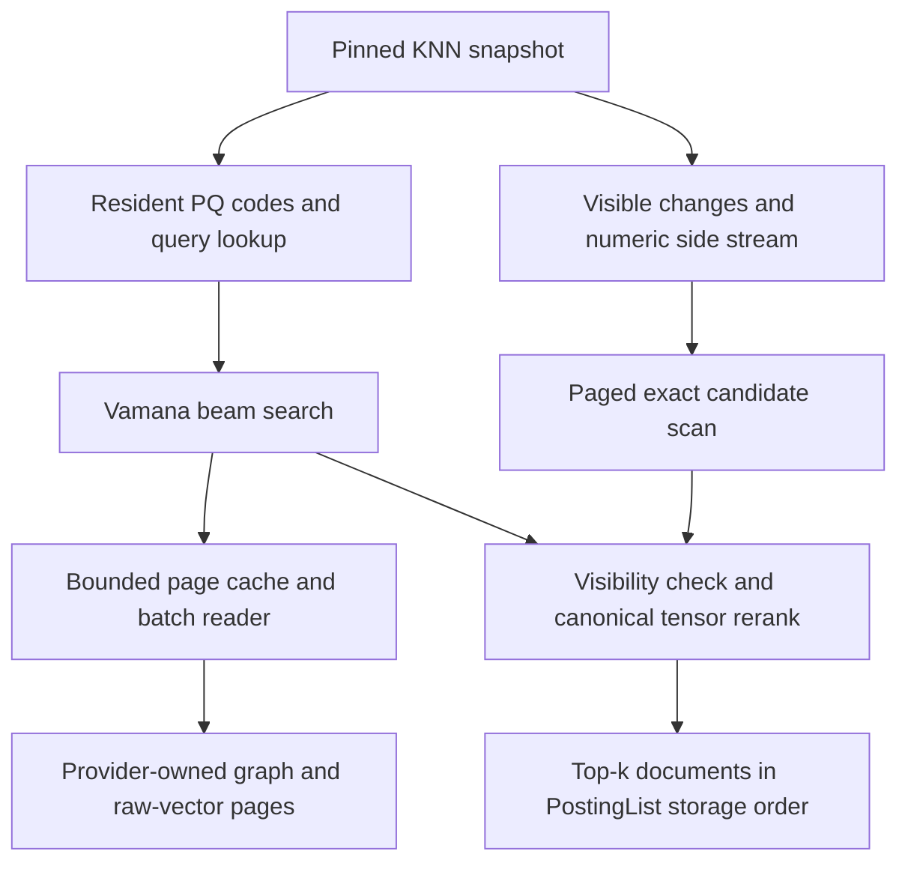

# Native DiskANN vector index

Status: Implementation in progress, tracked in the [implementation plan](../plans/0014-diskann-vector-index.md). The original design baseline is main `ae51060754813b716bea1cd5438214dfde9c9830`, inspected on 2026-09-25. Configuration, numerical primitives and physical formats/readers are internal foundations; the complete DiskANN runtime and SQL access method are not enabled. Later API and SQL examples remain proposed contracts. This document specifies a direct Rust implementation and its integration; it contains algorithm definitions and validation criteria, not mathematical proofs or performance claims.

Primary reference: Subramanya et al., [DiskANN: Fast Accurate Billion-point Nearest Neighbor Search on a Single Node, NeurIPS 2019](https://proceedings.neurips.cc/paper_files/paper/2019/file/09853c7fb1d3f8ee67a61b6bf4a7f8e6-Paper.pdf), especially Algorithms 1-3 and Section 3. The paper combines a Vamana graph with memory-resident product-quantized vectors, disk-resident full vectors and adjacency, batched frontier reads, and caching. Its overlapping build partitions are combined into a graph rather than independently searched at query time. The paper evaluates Euclidean distance; UQA's public vector score is cosine similarity. Its reported hardware results are not UQA acceptance thresholds.

The [official project](https://github.com/microsoft/DiskANN) now includes newer algorithms and a Rust implementation. UQA will implement its own algorithms, just as it implements HNSW and IVF; it will not wrap that library, link its C++ implementation, or call it as a service. Legacy reference code is pinned to `78256bbab4685e1774e78d331e081a153be26823` for supplemental algorithm/codec checks. A newer implementation is not assumed to reproduce the 2019 paper exactly. Transactional updates, SQL integration, and the storage decisions below are UQA design choices.

## Objective and boundaries

Add `CREATE INDEX ... USING diskann` as a third approximate physical vector index beside IVF and HNSW. Its distinguishing contract is a graph and full-vector corpus that need not fit in memory. The resident compressed codes, bounded graph-page cache, and query/build workspaces have explicit budgets. Persisting a graph and then loading all its nodes and raw vectors into RAM does not satisfy this objective.

DiskANN implements the existing `VectorIndex` boundary and serves existing KNN, tensor, vector-threshold, and hybrid-retrieval consumers. It has a distinct catalog identity and stored format. There is no dependency on the separate extension-package/type proposal, no new user-defined SQL type, and no new retrieval operator algebra. Existing PostgreSQL-shaped DDL, privileges, errors, isolation, and UQA scoring behavior remain binding.

Required delivery includes native SQLite, SQLite Key/Value, redb through its supported shared database owner, memory execution, and Rust/Python/Node.js/browser artifacts. A memory backend runs the same algorithm over memory pages, without claiming SSD behavior. Browser storage uses its actual supported persistence path and reports its I/O capabilities; a browser result cannot establish native SSD throughput.

Direct in-place dynamic graph repair, FreshDiskANN/IP-DiskANN update algorithms, label-specific Filtered-DiskANN, distributed serving, OPQ, GPU/MLX acceleration, and a raw-file sidecar backend are separate additions. Ordinary SQL inserts, replacements, deletes, transactions, and restart are required here through an immutable base plus a versioned change set. They are not postponed until a dynamic-graph paper is implemented.

## Existing implementation and ownership

The [vector-index design](vector-indexes.md) and [retrieval manual](../manual/sql/06-retrieval.md) define the current behavior: no index means exact cosine search; IVF/HNSW can approximate KNN; threshold search remains exact; physical vector identity is `(DocId, ordinal)`; a tensor row uses its best element score; postings are stored by document ID and ranking is a separate boundary. A later relational filter acts on the KNN support rather than silently increasing its pool.

The baseline has an explicit `VectorIndexSpec::{BruteForce, IVF, HNSW}`, controlled snapshots/searches, Storage-owned HNSW and IVF algorithms, and common MVCC integration. Common Key/Value HNSW reconstruction currently materializes a graph, so its persistence/cache wrapper cannot simply be renamed for DiskANN. IVF's k-means uses cosine assignments and renormalized centroids; that implementation is not a drop-in product-quantization trainer.

Relevant crate manifests, features, and [dependency policy](../../scripts/workspace-dependency-policy.json) were inspected. Storage depends internally on Core and Analysis; ML already depends on Storage. Adding Storage-to-ML for PQ or k-means would reverse that direction. SQL, Planner, and Engine keep their existing internal dependency budgets of two, three, and fourteen. No external ANN runtime, BLAS library, C++ toolchain, or per-analyzer feature is required by this design.

| Owner | Implementation responsibility |
| --- | --- |
| `uqa-storage` | Vamana construction/pruning, PQ training/encoding, beam search, node/page format, common page-reader contract, bounded caches, change-set merge, rebuild/reclamation, and owner tests |
| `uqa-storage-sqlite` | Native SQLite physical page records, canonical-vector mapping, encryption, provider batch reads, publication and recovery adapters |
| `uqa-storage` Key/Value layer | Shared ordered namespaces, controlled page access, canonical/change records, and common provider integration |
| `uqa-storage-redb` | redb physical read/write adapter and supported database ownership; no second DiskANN algorithm |
| `uqa-core` | Reuse budgeted buffers, queues, identities, cancellation-related primitives, and PostingList; add only broadly applicable primitives when necessary |
| `uqa-sql` | Access-method recognition, option parsing, target validation, catalog descriptors, dependency identities, and SQL diagnostics |
| `uqa-execution` | DDL/build scheduling, read/write observations, model calibration dependencies, maintenance coordination, and restore/lifecycle validation |
| `uqa-planner`, `uqa-operators` | Preserve KNN/threshold/filter/fusion semantics; expose physical cost/properties and EXPLAIN without implementing graph search |
| `uqa-scoring`, `uqa-fusion` | Existing distance-to-probability transforms, model provenance and calibration metrics; typed prior-free evidence and single-prior fusion |
| `uqa-engine` | Existing state/session/transaction/provider adapters and retained handles; no graph, PQ, layout, or rebuild algorithm |
| Rust/Python/Node.js/WASM APIs | Expose the same SQL and provider capabilities; verify actual artifacts and persistence |

Proposed Storage modules are `diskann_index/{build,prune,pq,search,format,pages,changes,rebuild}.rs` and owning test submodules. Shared vector training helpers, if justified, belong under `vector_index`; preserve the existing IVF objective and deterministic output while adding a separate Euclidean objective. Do not move numerical training into Engine or import the ML crate into Storage. A single crate test executable remains the rule.

## Public behavior and configuration

Only one of IVF, HNSW, or DiskANN may own a vector field at a time. Creation backfills the selected canonical snapshot and publishes complete physical metadata. Drop removes auxiliary state and returns the field to exact search without deleting raw vectors. Rename, truncate, rollback, restore, and schema dependencies follow the existing index lifecycle. Unsupported/duplicate/cross-algorithm options are errors, not aliases for another algorithm.

| Proposed option | Initial default | Validation and meaning |
| --- | --- | --- |
| `max_degree` | 64 | Integer at least 2; final outgoing degree bound, including UQA connectivity edges |
| `build_list_size` | 128 | Integer at least `max_degree`; construction candidate-list capacity |
| `search_list_size` | 64 | Positive integer; initial query candidate capacity, raised to at least requested document count |
| `alpha` | 1.2 | Finite real at least 1 with a finite squared factor; pruning factor in Euclidean units |
| `beam_width` | 4 | Positive integer no greater than configured `search_list_size`; nodes selected per expansion batch, not a promise of parallel physical I/O |
| `pq_bytes` | `min(32, dimensions)` | One byte per nonempty coordinate chunk; between 1 and dimension count |
| `seed` | 42 | Unsigned 64-bit seed; persisted with build algorithm and training revisions |

These are explicit starting defaults, not benchmark-derived optimal settings. Search capacity grows under the query allowance when deletions or tensor collapse leave too few distinct live documents. Resource exhaustion returns the existing quota/cancellation errors instead of silently reducing degree, PQ width, or requested result count. Allocation products and offsets use checked arithmetic before conversion to platform sizes. Store `alpha` in a validated canonical representation compatible with existing configuration equality; do not add an unchecked floating-point field to an `Eq` configuration enum.

SQL owns raw option parsing; Execution resolves the target dimension before finalizing dimension-dependent defaults through Storage's configuration validator. Persist the resolved PQ width and all effective algorithm defaults. Reopen must not reinterpret an omitted option using a later binary's defaults.

Build memory, resident-code memory, page-cache bytes, maximum in-flight read bytes, temporary storage, and maintenance limits are host/session resource settings. They are not unbounded SQL tuning parameters and cannot increase the caller's allowance. Rebuild scheduling has a soft byte/count threshold for outstanding changes and an observable progress state. An exact streamed change scan remains correct when maintenance is delayed; no RAM-sized change-set assumption is allowed.

```text
-- Proposed SQL; not accepted by the current baseline.
CREATE INDEX documents_embedding_diskann
ON documents USING diskann (embedding)
WITH (
    max_degree = 64,
    build_list_size = 128,
    search_list_size = 96,
    alpha = 1.2,
    beam_width = 4,
    pq_bytes = 24,
    seed = 42
);

SELECT id, _score
FROM documents
WHERE knn_match(embedding, $1, 100)
ORDER BY _score DESC, id ASC
LIMIT 20;
```

`pq_bytes = 24` requires at least 24 dimensions. The example's KNN leaf supplies a pool of 100 documents; the outer LIMIT returns at most 20. An ordinary WHERE filter still filters that pool. DiskANN cannot turn this into filtered ANN or change Bayesian calibration merely to improve recall. `search_threshold` uses the complete visible canonical corpus, including unmerged changes, and never substitutes approximate PQ distances for a complete similarity predicate.

## Distance and score contracts

Navigation distance, PQ estimate, and public score are distinct. For nonzero finite vectors, use a numerically controlled normalization and nonnegative squared Euclidean navigation distance:

$$
u(x)=\frac{x}{\lVert x\rVert_2},
\qquad
\delta(x,y)=\lVert u(x)-u(y)\rVert_2^2.
$$

The exact-real identity $\delta(x,y)=2-2\cos(x,y)$ motivates navigation; it is not a license to replace UQA's existing `f32` cosine output with that expression. Final scores call the canonical raw-vector scorer with the same arithmetic and tensor reduction rules as existing exact search. Raw vectors are retained bit-for-bit. Stable ordering uses the existing score order and `DocId` tie key. PQ error changes candidate selection, never the meaning of a returned score.

Do not reuse HNSW's negative-dot navigation value as the distance in Vamana pruning: it is not a nonnegative Euclidean distance. Internal normalization/distance accumulation may use `f64` to keep finite input extremes usable, but its results are internal. Zero-norm vectors and vectors for which the existing norm is nonfinite are retained in an exact side stream; they must not be dropped by normalization or sent through an invalid PQ codec. A zero-norm query uses the existing zero-score semantics, and numerically exceptional queries use an explicitly reported exact canonical path. Overflow, underflow, signed zero, nonfinite derived scores, and error propagation must be compared with the existing scorer rather than redefined by DiskANN.

An exact side stream's scores are merged with graph and changed-vector candidates. For a nonzero query, a zero-score vector can outrank a negative cosine result. The empty index, all-side-stream index, one-vector index, empty tensor, and fewer-than-$k$ live documents are explicit states. None is a reason to hide a missing or corrupt graph behind brute force.

### Typed carrier boundaries

[A Typed Carrier Algebra for Unified Query Execution](../papers/A%20Typed%20Carrier%20Algebra%20for%20Unified%20Query%20Execution.md), Sections 3, 4.3-4.4, 6.4, and 8.2, supplies the semantic boundary. A generation-local vector identity, a document candidate, a decorated posting, and its ranked view have different observations. Navigation and PQ distances are physical selection values; neither is a decorated payload score, prior-free evidence, or posterior probability. Their Rust types have no implicit conversion to those carriers.

The explicit path is generation-local `(DocId, ordinal)` candidates, snapshot/version validation, projection to distinct document candidates, complete canonical tensor scoring, decorated posting construction, and ranked document selection. Projection loses ordinal identity deliberately; reranking must fetch every visible ordinal of a selected document rather than mistake the best visited ordinal for its canonical tensor maximum. Base, exact-side, and changed-vector candidates share one visibility and document-scoring boundary, so a document encountered more than once is not combined with the additive `Payload` collision policy.

The final posting obeys ascending `DocId` storage order; rank and top-$k$ use the existing score order and `DocId` tie key through the ranked-view contract. ANN candidate selection does not preserve the exact search's support, and therefore is not an equality-preserving replacement under the paper's contextual-rewrite theorem. Approximate recall, exact scores on selected documents, deterministic rank order, and probability calibration remain separate validation obligations. No support-only Boolean law authorizes deduplicating scored operands, merging threshold predicates, pushing relational filters into ANN, or truncating beneath a score-combining parent.

## Vamana graph construction

The native graph builder retains visited construction candidates, performs pruning, inserts reverse candidates, and reapplies degree control. It uses a seeded initial graph and stable tie-breaking. Construction uses full navigation vectors rather than PQ estimates. The two construction passes use pruning factors 1 and the configured value. These core operations are checked against the paper and the pinned [reference graph implementation](https://github.com/microsoft/DiskANN/blob/78256bbab4685e1774e78d331e081a153be26823/src/index.cpp); later reference options are not implicitly enabled.

The pruning condition must be translated consistently when the implementation stores squared distances. Removing candidate $v$ after selecting $p^*$ uses

$$
\alpha^2\,\delta(p^*,v)\le\delta(p,v).
$$

Using $\alpha$ instead of $\alpha^2$ here changes the configured algorithm. The implementation may instead compare unsquared distances with $\alpha$, but must not mix units. A small geometry fixture must distinguish these alternatives independently of recall measurements.

```text
build_generation(snapshot, configuration, allowance):
    stream and validate canonical vector identities
    separate numeric side-stream entries
    choose deterministic build partitions and navigation vectors
    for each bounded partition:
        initialize seeded directed graph without self/duplicate edges
        refine with visited search candidates at alpha = 1
        refine the retained graph at configured alpha
        write bounded adjacency runs with global vector identities
    merge adjacency runs; prune against full navigation vectors
    add the specified UQA connectivity edges within the final degree bound
    train/encode PQ from the same canonical build snapshot
    pack, validate, and seal immutable generation pages
    return a publication candidate, not a committed index
```

Logical vector keys are sorted before assigning dense generation-local node IDs. Iteration order, PRNG, seed derivation, sample selection, tie keys, and parallel merge order are versioned. The same seed alone does not guarantee reproducibility if worker completion order changes graph mutations. The deterministic reference build uses fixed work order; parallel construction merges candidate runs in a specified order and is separately checked for reproducibility.

The entry node is a deterministic sample-based medoid approximation, with the sampling rule and tie-breaking stored in provenance. It is not advertised as the exact quadratic-cost medoid. Empty/non-navigable corpora have no entry node. Small corpora clamp initial neighbor count to the available other nodes while preserving the persisted configured degree limit.

UQA adds one explicit connectivity rule for duplicate/degenerate data: for more than one navigable node, reserve one outgoing slot for a directed cycle over stable node IDs. Vamana supplies at most the remaining slots; duplicate edges are removed. This gives the stored graph a traversal route through every node without copying HNSW's reciprocal/layered topology contract. It is a UQA adaptation, not a claim about the paper's pseudocode. Test the unaugmented algorithm against small reference fixtures and the complete stored graph against degree, reachability, and recall fixtures. DiskANN edges are directed and need not all be reciprocal.

### Building beyond RAM

The builder streams a bounded training sample and assigns points to overlapping coarse partitions. It builds one bounded partition at a time and externally merges adjacency runs. Partition membership, temporary vectors, adjacency runs, and validation state use the host's encrypted temporary-storage policy. No partition helper calls `load_all_from` on the full corpus.

A union of overlapping partition edges can exceed the final degree bound. The UQA merge explicitly performs a final bounded pruning pass before adding its reserved connectivity edge; it must not truncate IDs or assume union preserves degree. This differs from an unpruned edge union and therefore has its own recall acceptance. Partition overlap and local-to-global identity maps are deterministic and persisted in build provenance.

Estimate each partition's vector, edge, and working memory before loading it. Split oversized partitions deterministically, retaining overlap/representative links; identical-centroid populations use capacity-based splitting and the global connectivity rule. Bound recursion and temporary bytes. If the allowance still cannot admit a partition, fail the build before publication. The old index remains usable; the implementation must not claim an out-of-core build while collecting the whole dataset to handle skew.

### Product quantization

Implement deterministic byte-code PQ in Storage. The pinned [PQ implementation](https://github.com/microsoft/DiskANN/blob/78256bbab4685e1774e78d331e081a153be26823/src/pq.cpp) is a secondary reference for chunk codebooks and lookup distances; its file format and optional rotations are not adopted. Split all coordinates into $m$ nonempty contiguous chunks, train Euclidean centroids for each, and assign one byte per chunk. Remainder coordinates must be included when the dimension count is not divisible by $m$.

For query chunk $u(q)_j$, centroid $c_{j,t}$, and node code $z_{p,j}$, the query lookup and navigation estimate are

$$
D_{j,t}=\lVert u(q)_j-c_{j,t}\rVert_2^2,
\qquad
\widehat\delta(q,p)=\sum_{j=1}^{m} D_{j,z_{p,j}}.
$$

Use up to 256 centroids per chunk, with the actual count recorded for small training sets. Code validation rejects out-of-range labels. Empty-cluster handling, seed, sample selection, training iterations, chunk offsets, scalar dtype, and codec revision are deterministic. Euclidean centroids are not renormalized after each update. Reuse IVF's cancellation/budget infrastructure only where its behavior is unchanged; its cosine assignment and spherical centroid update require a distinct implementation path.

Training revision 1 uses `f64` navigation coordinates and codebooks, an ordered reservoir capped at 65,536 navigable vectors by default, and at most 20 Lloyd iterations by default. Training options permit positive `u32` sample limits and 1-256 iterations/centroids. The actual centroid count is the lesser of the requested count and admitted sample count. An empty sample is an explicit state for the build owner; it cannot produce a fake codebook. Coordinate chunks receive $\lfloor D/m\rfloor$ dimensions each, with the first $D\bmod m$ chunks receiving one extra coordinate.

The input order is ascending `(DocId, ordinal)` from one canonical snapshot. Reservoir selection uses SplitMix64 seeded with the stored seed and rejection sampling of unsigned 64-bit values for unbiased bounded draws; the first sample-capacity observations fill slots in input order. A separate SplitMix64 stream starts at `seed XOR 0xd1b54a32d192ed03` for centroid initialization. For each chunk in order, reset sample indices to ascending order and select the actual centroid count with partial Fisher-Yates sampling without replacement. Lloyd assignment chooses the smallest centroid label on an exact distance tie, processes samples and coordinates in their stored order, retains the prior centroid for an empty cluster, and stops on unchanged assignments or the iteration limit. Codec revision 1 uses one unsigned byte per chunk; generation metadata must retain these revisions and effective training settings rather than adopting restore-time defaults.

The base code array is resident and immutable; full raw vectors and adjacency are paged. Codebooks and codes belong to the same generation as node IDs. Approximate code distances never appear as `_score` or Bayesian evidence. A changed vector is evaluated exactly from the versioned change set until incorporated into a new base, so codebook drift does not make recent writes invisible.

## Search execution

The query pins one manifest, code array, page reader, and canonical/change visibility view. A bounded beam chooses several unexpanded candidates, batches their page requests, expands their outgoing edges, and scores newly discovered codes. Nodes already in the cache still count as expanded nodes; cache hits cannot change tie order or omit neighbor processing. Full coordinates read during expansion supply final reranking input. The pinned [disk-search reference](https://github.com/microsoft/DiskANN/blob/78256bbab4685e1774e78d331e081a153be26823/src/pq_flash_index.cpp) is a secondary check for beam/read/rerank mechanics, not a provider implementation to import.



```text
search(snapshot, query, k, control):
    validate query and register the logical vector read
    select ordinary navigation or the declared numeric-edge exact path
    create PQ lookup table and a bounded candidate frontier
    while the retained frontier contains unexpanded nodes:
        select up to beam_width nodes in deterministic priority order
        deduplicate their required page IDs; reserve buffers before reads
        read missing pages under the pinned generation lease
        validate pages and expand nodes in the selected priority order
        record full-vector candidates; insert neighbors using PQ estimates
        retain the best active search_list_size navigation candidates
    suppress base candidates replaced/deleted in the selected visibility view
    merge exact changed-vector and numeric-side-stream candidates
    rerank candidate documents from their visible canonical tensor elements
    widen and resume if necessary for distinct-document completeness
    return top-k scores as a document-ID-sorted PostingList
```

The visited set is separate from the bounded frontier; its size can exceed the configured list size and must be charged. Batched I/O completion order cannot affect search order. Invalid page data, checksum failure, missing nodes, cancellation, or exhausted memory fails the query and releases its buffers; it is not interpreted as a missing neighbor. Never treat a failed read as an empty adjacency list.

Tensor identity is preserved through `(DocId, ordinal)` until document reduction. After selecting candidate documents, read all their visible ordinals under the same snapshot and compute each document's actual maximum using the canonical reduction contract. This extra work is explicit in cost and I/O metrics. It avoids returning the score of an arbitrary encountered tensor element. Deleted or superseded base vectors can remain navigation vertices, but cannot contribute stale output.

Start with at least the requested number of document candidates and grow the search list when tensor duplication or masked nodes leave fewer than $k$ live documents. Retain valid visited work across growth. Return fewer than $k$ only when the visible corpus has fewer eligible vector-bearing documents; otherwise continue within the allowance or return a resource error. The declared connectivity route supports this completeness traversal. Approximate membership does not authorize silent truncation after an arbitrary I/O budget.

An ordinary relational filter is not a graph-traversal filter. ACL/RLS and security-barrier handling use the existing Execution contract: graph navigation may use internal routing nodes only where allowed by that contract, final rows must be authorized, and EXPLAIN/telemetry must not leak unauthorized payloads. Predicate pushdown or tenant-separated graphs require a separately specified semantic and security contract. They cannot be inferred from the 2019 algorithm.

## Page storage and bounded reads

Use provider-owned immutable page records in the same database and encryption domain as the canonical vectors. Native SQLite stores page BLOBs; the common Key/Value implementation stores page values under ordered generation namespaces; redb uses that common layout. There are no unmanaged files beside the database whose rename or deletion can escape transaction/backup ownership.

The manifest identifies database/table/index incarnations, format and algorithm revisions, dimensions, score/navigation contracts, build configuration, dense node count, entry node, codebook/chunk layout, canonical build-coverage token, page-layout constants, checksums, and published generation. Names are catalog properties, not physical identities. `DocId` reuse after drop/recreate cannot make an old page valid for a new table incarnation.

| Record family | Contents and lifetime |
| --- | --- |
| Manifest | Atomically selected generation and its complete compatibility/coverage metadata |
| Graph pages | Dense node slots containing logical vector identity, origin-version token, raw `f32` vector, raw norm metadata, degree, and neighbor IDs |
| PQ metadata/pages | Codebooks, chunk offsets, actual centroid counts, code bytes, and matching node/format identity |
| Numeric side stream | Canonical identities requiring exact treatment; versioned with the base and read under the selected snapshot |
| Change records | Per-document evaluated replacement/tombstone and logical version identity; no per-write graph rebuild |
| Build ownership | Unpublished generation, staging owner/lease, bounded progress, checksums, and cleanup state |

Page envelopes validate their length, generation, dimensions, graph bounds, fragment shape, format, and checksum without allocation. A complete node decoder checks the slot length, node ID, degree, and origin-token shape before reserving vector or adjacency buffers; it then validates raw coordinates, canonical norm, and neighbor invariants. Ordinal membership and origin visibility require the canonical snapshot and are checked by the candidate owner, not inferred from well-formed bytes. Codes and node pages cannot be mixed across generations. Use explicitly versioned little-endian encodings and checked offsets. Initial node IDs are 64-bit generation-local integers; a compact 32-bit representation would require a declared format discriminator and overflow rejection.

For dimension $D$, final degree $R$, and fixed node metadata size $H$, a simple fixed-width slot has size

$$
S=H+4D+8R.
$$

A logical page has an initial 4 KiB target with header/checksum overhead excluded from its payload $P$. If $S\le P$, pack $\lfloor P/S\rfloor$ slots and pad unused neighbor positions. Larger slots occupy $\lceil S/P\rceil$ validated fragments. The reader gathers every fragment before decoding a node. High-dimensional vectors must not be truncated or assumed to fit in one page. Record all layout constants in the manifest rather than recalculating them from a new binary's defaults.

These are logical pages. A SQLite/redb lookup may perform multiple B-tree, encrypted-page, compressed-page, or operating-system reads; the design does not equate one BLOB lookup with one aligned SSD read. Physical read amplification and overlap must be measured on the actual provider. Page packing improves locality without inventing a raw-device guarantee.

### Node and page encoding

The revision-1 codec in `uqa-storage::diskann_index::format` fixes $H=64$, page size 4,096 bytes, page header size 144 bytes, and $P=3,952$. Integers and floating-point bit patterns are little-endian; structure padding is never serialized. Layout construction checks addressable slot size, fragment count, and total page-count arithmetic before accepting the layout. A zero-node generation has no legal node or page address.

`DiskANNGeneration` contains a nonzero 16-byte persistent data incarnation and nonzero 64-bit table incarnation, index incarnation, and generation. These identities are issued and retained by the storage owner; filesystem paths, names, and reusable SQL OIDs are unsuitable substitutes. The data incarnation is distinct from MVCC's transaction-history `DatabaseId`, which can change on backup restoration. A restored data generation retains its stored identity, while subsequent vector writes use their actual writer history. The codec checks identity equality; provider affinity, allocation, restore remapping, and generation leases remain owner responsibilities.

Each node contains a `DiskANNVectorVersion`: the original `StorageTransactionId` (16-byte history identity and nonzero 64-bit writer allocation) plus a nonzero 64-bit mutation revision. The vector mutation owner assigns and persists the revision with the canonical value and change record, distinguishing replacements within the same transaction; it retains this origin after writer receipts are reclaimed. A build copies the selected origin rather than substituting the builder's transaction. An origin token is not a snapshot-coverage token, and neither may be inferred from a maximum transaction ID or commit timestamp. This codec defines their representation without claiming that mutation or publication integration is complete.

| Node byte offsets | Field |
| --- | --- |
| 0–8, 8–16 | Generation-local node ID, `DocId` (`u64` each) |
| 16–20, 20–24 | Tensor ordinal (`u32`), canonical raw norm (`f32` bits) |
| 24–32 | Actual neighbor count (`u64`) |
| 32–48, 48–56, 56–64 | Origin writer history, writer allocation, mutation revision |
| 64–$(64+4D)$ | Original $D$ raw `f32` bit patterns |
| $(64+4D)$–$S$ | $R$ neighbor slots (`u64` each); unused slots are zero |

Graph nodes require finite coordinates and a finite positive canonical raw norm. Zero, underflowed, or nonfinite-derived norms belong in the separately encoded exact side stream. Recomputing the stored norm uses the canonical sequential `f32` arithmetic; neither normalization nor serialization rewrites the raw vector, including signed zero. Neighbors are strictly increasing, unique, below the node count, and different from the node itself. A zero neighbor is a valid node ID within the declared degree; only unused slots are padding. Decode reserves buffers under the supplied memory allowance and releases partial results on any failure.

| Page byte offsets | Field |
| --- | --- |
| 0–8, 8–12 | Magic `UQADNPG\0`, page revision (`u32`, initially 1) |
| 12–16 | Reserved zero bytes |
| 16–32, 32–40, 40–48, 48–56 | Data, table, index, and generation identities |
| 56–64, 64–72, 72–80 | Page ID, node count, maximum degree (`u64` each) |
| 80–84, 84–88 | Dimensions (`u32`), reserved zero bytes |
| 88–96 | First node ID (`u64`) |
| 96–100, 100–104, 104–108, 108–112 | Slot count, fragment index, fragment count, payload bytes (`u32` each) |
| 112–144 | SHA-256 of bytes 0–112 followed by bytes 144–4,096 |
| 144–4,096 | Payload followed by zero padding |

Every page's shape is recomputed from its expected layout and address. Packed pages contain complete slots with fragment index zero and count one; fragmented pages contain one consecutive part of one node. A page with another dimension/degree layout is rejected even if its slot size happens to match. Unknown revisions, unexpected addresses, nonzero reserved bytes, mismatched checksums, and trailing padding errors fail explicitly. SHA-256 detects damaged bytes; it is not authentication or a replacement for the provider's encryption domain.

`decode_page` returns a borrowed, allocation-free checked envelope. A valid checksum does not establish node validity or visibility: the reader must gather the full slot under one generation and call `decode_node`, then the candidate owner checks its canonical origin and ordinal. `encode_page` similarly accepts only a correctly sized payload and seals the envelope; graph sealing must separately validate complete nodes. The independent [byte fixture](../../crates/uqa-storage/tests/fixtures/diskann/README.md#node-and-page-bytes) fixes header bytes, raw signed-zero bits, packed nodes, and a two-fragment 1,024-dimensional node without storing full page dumps.

### Reader contract

The implemented [generation metadata format](diskann-generation-format.md) specifies manifests, codebooks, independently addressed code/side batches and canonical-input fingerprints. Its codecs validate representation and generation identity; sealing, complete-stream verification and MVCC visibility remain reader/build/publication responsibilities.

The implemented [controlled reader contract](diskann-page-readers.md) separates `DiskANNPageSource`, which supplies bounded encoded records and page completions, from `DiskANNReader`, which owns resident state, validates complete requests and returns `DiskANNPageLease` values. Controlled memory and [Key/Value generation sources](diskann-key-value-generations.md) are available; native SQLite mapping, canonical visibility and public publication remain separate implementation units.

The source is bound to one immutable generation and its retained physical owner; callers cannot request arbitrary namespaces or change snapshots. Returned pages carry IDs and owned reservations. The reader checks completeness and duplicates, and drops the whole failed request. Persistent adapters must also enforce their existing database affinity. No provider page guard or transaction-coordinator guard is held while processing candidates, waiting for another read, or returning control to a caller.

Batching and concurrent reads are separate capabilities. The default provider can issue a bounded batch sequentially. Native providers may use read workers for immutable published pages with the same generation lease and database/encryption identity. This does not let canonical-vector or change reads bypass their logical snapshot. redb workers use the supported shared owner; SQLite workers must not open an unrelated unencrypted connection. Browser adapters report their real concurrency, often one. Search records requested beam width and effective I/O parallelism separately.

### Memory and cache ownership

Charge immutable PQ buffers once to a bounded index-resident owner and retain them through generation leases. Each query owns its normalization buffer, distance lookup, frontier, visited set, candidate scores, tensor rerank pages, in-flight reads, and cancellation signal. Sharing codes or cached pages must not share a prior query's cancellation or grant another query an unlimited allowance. Old and new generations can coexist only while their combined resident and retained budgets permit it.

An initial sizing model for $N$ navigable vectors, $m$ PQ bytes, $C\le256$ centroids per chunk, dimension $D$, and $Q$ concurrent queries is

$$
M_{\mathrm{resident}}
\approx Nm+8CD+M_{\mathrm{page\ cache}}+M_{\mathrm{metadata}}
+\sum_{i=1}^{Q}M_{\mathrm{query},i}.
$$

The codebook term uses the declared `f64` scalar width; each query lookup additionally needs $8Cm$ bytes before buffer/header overhead. The query allowance includes the actual visited-set size, not merely $O(L)$. Build sampling, partition buffers, overlap mappings, sorting, staging, and connectivity validation have separate accounted budgets. No dense global `NodeId -> DocId` map is loaded: logical identities are in node pages. If the resident code array cannot fit, creation/open fails with the appropriate resource error before allocating it; it does not silently load raw vectors or switch to another ANN implementation.

Cache keys include database/index incarnation, generation, format, and page ID. Use an explicit byte limit; pin or reserve only a bounded entry neighborhood, and admit later pages with deterministic byte accounting. Warm-up from historical query frequency is optional and separately versioned. A cache limit never affects correctness: evicted pages are read again under the same generation. Normal open validates the manifest and compressed-code metadata without reading every graph page or reconstructing the full graph. A full integrity scan remains a separate controlled operation; each accessed page is always checked.

`snapshot_with_control` retains the paged reader and immutable code lease instead of cloning all raw vectors or converting the index to `RetainedVectorIndex` exact search. Audit copied-table, nested query, view, cursor, backup, and provider-wrapper consumers for that assumption. A writable memory snapshot uses copy-on-write pages and change records. Old snapshots stay valid after source mutation/closure and release their retained pages at the final reader.

## MVCC, mutations, and rebuilding

The immutable base contains the corpus selected by its Storage-issued build-coverage token. A snapshot overlays the canonical changes not included in that token, including its own private writes. The token identifies actual visible versions; it is not a guessed wall clock, maximum transaction ID, or timestamp comparison that incorrectly includes a transaction committed after the build snapshot.

Each document replacement records its validated raw vectors and a versioned change record in the same evaluated command as the row and other indexes. A deletion masks the base document; a tensor replacement masks all its previous ordinals, including removal to an empty tensor. Query-time change scans are paged and exact. Base candidate validation checks the selected origin version and suppresses superseded values before document scoring. No write patches an immutable base node or overwrites its PQ code in place.

Two transactions changing different documents write distinct logical records and may commit in either order. Shared byte/count maintenance uses the existing evaluated merge mechanism, not a whole-index expected-version condition. There is no transaction-lifetime DiskANN writer permit. Same-document conflicts, READ COMMITTED target rechecks, REPEATABLE READ snapshots, savepoints, statement failure, and SERIALIZABLE participation follow common MVCC.

Record the vector-index logical read before any candidate, exact change, side-stream, or threshold value becomes visible. The first implementation uses conservative object-level read coverage for ANN searches because an unvisited changed vector can affect top-k membership. Writes retain document/key identities. Physical page reads and cache hits do not replace logical observations. Planning and EXPLAIN without execution create no vector-data observations. A maintenance build uses its own explicitly admitted snapshot/participant according to the existing maintenance contract.

### Publication protocol

1. Select a canonical snapshot and coverage token; allocate an unpublished generation and retain the required source versions. An initial transactional CREATE INDEX includes its transaction's private values under the same publication contract.
2. Build and write immutable pages in bounded batches. Staged records are unreachable through any public manifest, encrypted under the provider policy, and owned by a recoverable build lease. Physical staging batches are not partial user-visible index commits.
3. Validate node references, degree/reachability, logical identities, coverage, PQ compatibility, page checksums, and resource ownership. Compute a compact sealed manifest.
4. Under the short lifecycle/publication boundary, verify the expected index incarnation and current generation, publish the new manifest atomically, and retain every change not included in its coverage token. Writers that started earlier but commit later remain represented in the change set.
5. Publish caches only after confirmed commit. Retire old manifests, pages, codes, and covered change versions only when all data/definition/generation leases permit it.

A competing rebuild cannot replace a newer definition using an old process cache. If its expected generation changed, discard or explicitly rebase the build candidate under the owner protocol. Rebuilding representation may reuse already captured canonical inputs; commit retry never reruns SQL expressions, analyzers, application callbacks, or an INSERT. Ordinary writers remain independent while a maintenance generation is being constructed; DDL locks still preserve their PostgreSQL-defined scope.

Build failure, cancellation, quota failure, or a failed definition check before publication leaves the old index visible. Staged orphan pages are reclaimed through bounded recovery, including process loss before a manifest exists. After a possibly durable publication, the existing receipt mechanism decides committed/aborted/unknown before retry or cleanup. A lost reply cannot publish a duplicate generation, remove a live one, or replay user mutations. Cache failure after commit invalidates the cache rather than claiming rollback.

An exact streamed change path preserves correctness when a rebuild is delayed; it is observable in cost, EXPLAIN, and counters. The maintenance scheduler coalesces rebuild requests and bounds concurrent builders and temporary bytes. A hard storage quota can fail a write before partial staging, but a small in-memory change cache cannot become an arbitrary whole-index writer lock. Sustained-write performance must be measured separately from static-corpus search.

### Restore, upgrade, and removal

Restore validates the access-method identity, parameters, format/capability version, manifest, coverage, codebook, and record bounds before exposing a handle. Missing/corrupt state fails closed. It does not rebuild from raw vectors or quietly choose HNSW/brute force. Readable/writable format compatibility is explicit; introducing DiskANN state requires rejecting an older active writer that cannot maintain its change records, including already-open sessions. Use existing provider format/permit negotiation rather than relying only on the new parser knowing the name.

Rename preserves stable identities. Truncate/drop publishes the appropriate empty or retired state and respects retained readers. Backup/restore captures a manifest and all reachable base/change records at one logical snapshot; it cannot combine new codes with old pages. Encrypted modes encrypt persistent and temporary data. Reopen, cross-session refresh, interrupted rebuild, failed restore, and downgrade rejection are acceptance cases for each provider. Old generation reclamation honors unresolved receipts and snapshot horizons, not just reference counts inside one process.

## Planning, calibration, and observability

Keep ordinary query syntax unchanged. Planner selects the field's actual physical index, retains approximate KNN versus exact-threshold properties, and accounts for PQ computation, expected page reads, effective read concurrency, exact change/side scans, tensor reranking, and requested candidate pool. A DiskANN cost cannot reuse a generic logarithmic HNSW estimate without representing storage work. Estimates come from stored statistics and declared provider capabilities; planning does not sample the live graph or train PQ.

EXPLAIN identifies `diskann`, graph/PQ generation, navigation metric, public score domain, initial/adaptive search capacity, requested/effective beam settings, base and outstanding-change counts, exact side paths, cache limits, and residual relational filters. Execution counters include expanded nodes, discovered/visited nodes, logical pages, physical reads where the provider can report them, bytes, cache hits, I/O rounds, tensor rerank reads, exact changed vectors, and candidate/document counts. Unknown physical I/O counts remain unknown; logical reads are not relabeled SSD operations.

PQ estimates are never probabilities. Probability conversion consumes the final canonical raw cosine scores after base/change visibility, exact side-stream merging, and document-level tensor reranking. It does not recompute cosine using a different arithmetic helper or use PQ distance, normalized navigation distance, or the internal visited frontier as the calibration input.

### Score-to-probability contract

DiskANN returns the same raw score domain as the existing vector indexes. The consuming retrieval operation selects the existing conversion contract; merely installing DiskANN does not change `knn_match` into a probability-returning operation.

| Consumer | Conversion and interpretation |
| --- | --- |
| Ordinary KNN and vector-threshold search | Preserve the canonical raw cosine score, including the document's maximum tensor score. |
| Direct low-level `CosineProbabilityOperator` | Preserve its explicit uncalibrated mapping $(1+s)/2$; this range conversion alone does not establish relevance probabilities. |
| `calibrated_vector_match` and automatic hybrid KNN evidence | Reuse the query-local pool transform on the final requested document pool; this is an unsupervised estimate, not held-out calibration. |
| `calibrated_vector_search_with_model` | Apply the supplied persisted `VectorCalibrationModel` after compatibility validation, without fitting parameters from the current query. Saving a model does not automatically select it for SQL's pool-based path. |

For canonical cosine score $s$, the existing [Scoring transform](../../crates/uqa-scoring/src/calibration.rs) uses cosine distance $d=1-s$ and Gaussian relevant/background distance models with means $\mu_R,\mu_G$ and shared standard deviation $\sigma_d>0$:

$$
\ell_v(d)=\log\frac{f_R(d)}{f_G(d)}
=\frac{(d-\mu_G)^2-(d-\mu_R)^2}{2\sigma_d^2},
\qquad
p_v=\operatorname{sigmoid}\!\left(\operatorname{logit}(\pi_v)+\ell_v(d)\right).
$$

The [pool implementation](../../crates/uqa-operators/src/fusion_wrappers.rs) estimates the two means from the selected distance pool's head/tail and a shared spread using its configured split. Preserve that implementation's validation, numerical bounds, and degenerate behavior: an empty pool remains empty; an uninformative pool yields the configured prior, subject to the existing probability bounds. Use the final document pool of the requested candidate count, before outer LIMIT or residual relational filters, rather than all expanded nodes or all visited tensor elements. Internal adaptive expansion does not redefine `candidate_k`.

For a reusable model, fit and validate the transform separately on data representative of the intended retrieval surface. Raw score equality alone does not justify reusing an HNSW/IVF calibrator for DiskANN: candidate selection can change the observed distance and relevance distributions. Preserve the [model contract](../../crates/uqa-scoring/src/vector_calibration.rs) for corpus/index/embedding identity and version, index kind, dimensions, candidate K, model version, and fit sample count. A model trained for another index kind or target must fail compatibility validation; do not silently relabel it or fall back to a freshly fitted query-pool transform.

The current fixed-model API compares the model with a caller-supplied target and checks actual table/field, index kind, and dimensions; corpus/index version strings are caller-controlled. That is not automatic verification of the current DiskANN generation. The DiskANN integration must obtain a bounded, trustworthy runtime identity from the selected corpus/change view and immutable index generation/configuration through Storage metadata and Execution validation. Bind existing version fields to a documented fingerprint covering the graph/PQ generation, algorithm revisions, and candidate-selection settings such as search list and beam width. Include private mutations in compatibility decisions; matching an old committed corpus label cannot authorize a changed private view. Where the actual target cannot be verified, reject fixed-model reuse. Embedding-model identity remains an explicit caller contract for externally supplied vectors. This adds no per-document global writer permit or full-corpus scan.

Rebuilds, corpus changes, or changed candidate-selection settings invalidate incompatible fixed-model/cache targets and require an explicitly fitted and validated matching model. They do not trigger model training inside a query or graph rebuild. Cache eviction and physical read completion order must not alter scores or calibration. For a fixed transform, identical canonical scores produce identical probabilities; query-pool probabilities can legitimately differ between indexes when their selected pools differ.

Hybrid fusion retains signed prior-free evidence. Remove a signal-local prior before combining signals, then apply one corpus prior using the existing typed Scoring/Fusion boundary:

$$
P(R\mid q,x)=\operatorname{sigmoid}\!\left(\operatorname{logit}(\pi)+\ell_{\mathrm{text}}+\ell_v\right).
$$

The automatic vector pool uses a neutral prior for this conversion. Preserve existing probability bounds and prior-conflict diagnostics. Exact log-odds composition under the conditional-independence contract does not make the unsupervised pool estimate an empirically calibrated posterior. Numerical transforms and model validation belong in Scoring, pool construction in Operators, runtime metadata checks/routing in Execution with Engine adapters, and evidence combination in Fusion. Storage returns raw scores and metadata; it must not depend on Scoring, which already depends on Storage.

Acceptance separates four questions: exact raw scores, ANN recall, correct probability/evidence conversion, and empirical calibration quality. Add fixed-transform probability fixtures, empty/constant-pool behavior, candidate-K and search-setting drift, stale-model rejection after writes/rebuilds, persistent model/generation identity, and single-prior hybrid regressions. Use held-out labels for Brier score, log loss, expected calibration error, and reliability bins when claiming calibrated probabilities; record the fitted retrieval target and split. A recall improvement or a value in $[0,1]$ alone does not close that gate.

## Rust and language-binding examples

These are design examples for the proposed access method, not currently runnable feature examples. They use ordinary Engine SQL calls; no external DiskANN runtime or extension registration is involved. This small three-dimensional fixture checks installation, query routing, score handling, and reopen, not approximate-search quality or SSD performance.

```rust
use std::path::Path;

use uqa_engine::Engine;

fn main() -> Result<(), Box<dyn std::error::Error>> {
    let engine = Engine::open(Path::new("vectors.db"))?;
    engine.sql("CREATE TABLE items (id BIGINT PRIMARY KEY, embedding VECTOR(3))")?;
    engine.sql(
        "INSERT INTO items VALUES \
         (1, ARRAY[1.0, 0.0, 0.0]), \
         (2, ARRAY[0.0, 1.0, 0.0]), \
         (3, ARRAY[0.8, 0.6, 0.0])",
    )?;
    engine.sql(
        "CREATE INDEX items_embedding_diskann ON items USING diskann (embedding) \
         WITH (max_degree = 8, build_list_size = 16, search_list_size = 8, \
               alpha = 1.2, beam_width = 2, pq_bytes = 3, seed = 42)",
    )?;
    let query = "SELECT id, _score FROM items \
                 WHERE knn_match(embedding, ARRAY[1.0, 0.0, 0.0], 2) \
                 ORDER BY _score DESC, id ASC";
    let _before_close = engine.sql(query)?;
    drop(engine);

    let reopened = Engine::open(Path::new("vectors.db"))?;
    let _after_reopen = reopened.sql(query)?;
    Ok(())
}
```

For this fixture, both queries must return document IDs 1 and 3 in that order, with scores from the canonical cosine helper. The actual artifact test compares rows and score representations across close/reopen and asserts that the physical access method remains `diskann`. It must not pass by rebuilding or selecting brute force at reopen.

Python, Node.js, and browser JavaScript use the same DDL and query through their existing SQL entry points. Given the shared fixture SQL and an Engine constructed through each binding's supported persistent-open API, the call shape is:

```text
# Python
engine.sql(create_diskann_sql)
before = engine.sql(knn_sql)
# Close and reopen through the binding's persistent lifecycle, then compare.
after = reopened.sql(knn_sql)

// Node.js
engine.sql(diskannDDL);
const before = engine.sql(knnSQL);
const after = reopened.sql(knnSQL);

// Browser JavaScript, after WASM initialization and supported persistence setup
engine.sql(diskannDDL);
const before = engine.sql(knnSQL);
// Persist/close/reload through the browser binding's actual lifecycle.
const after = reopened.sql(knnSQL);
```

Binding tests run the published wheel, native Node.js module, and real browser WASM assets. Browser reopen tests must reload the runtime and persistence, not merely keep an in-memory Engine reachable. Native and browser results have the same SQL/scoring contract even when their page readers have different physical concurrency. Missing capabilities produce explicit errors; a binding cannot claim DiskANN support by mapping its name to HNSW.

## Verification and acceptance

Correctness and resource acceptance use deterministic inputs, barriers, fault injection, and counters. No latency threshold is a correctness oracle. Reference graph/PQ fixtures are generated independently from the pinned paper/code interpretation and reviewed for declared UQA differences. Exact KNN ground truth comes from the canonical brute-force path; public SQL behavior and diagnostics retain the project's PostgreSQL 18 baseline where applicable.

| Owner/test area | Required cases |
| --- | --- |
| Pruning and construction | Full visited candidate set, squared-distance alpha units, two passes, stable seeds/ties, no self/duplicate edges, final degree bound, reverse-candidate pruning, disconnected and repeated-vector inputs |
| Out-of-core build | Corpus larger than the build allowance, bounded peak retained bytes, overlapping/skewed partitions, identical vectors, final merged degree, external validation, cancellation and temporary cleanup |
| PQ | Non-divisible dimensions, small training sets, empty clusters, reproducible encoding, codebook/version mismatch, invalid codes, independent lookup distances, and no change to existing IVF output |
| Query semantics | Document-level top-k, full tensor maxima, adaptive capacity, ties, all-deleted/empty/singleton indexes, zero/extreme vectors, exact side paths, exact threshold, and ordinary filter/fusion behavior |
| Page I/O | Cold reads through real storage, bounded cache/in-flight bytes, multi-fragment nodes, reordered completions, short/missing/corrupt pages, cache eviction, and no full-graph reconstruction |
| MVCC | Independent and conflicting writers, private changes, tensor replacement, snapshot visibility, savepoints, READ COMMITTED refresh, SERIALIZABLE observations, and no lost changes at generation switch |
| Lifecycle/recovery | Failed CREATE INDEX, rename/drop/truncate, controlled snapshots, source closure, receipts, process loss during staging/publication, backup/restore, old-writer rejection, and final-reader reclamation |
| SQL/API/artifacts | Option validation/catalog identity, EXPLAIN, Rust/actual Python/Node.js/browser execution and reopen, default/analyzer feature configurations |

Tests for result completeness apply to the KNN leaf before subsequent relational filters. Compare returned scores independently from recall: correct candidate membership does not excuse using PQ distance as a score, and exact scores on a few returned rows do not establish good recall. Add tensor fixtures in which several nearest vectors belong to one document, and in which an unexpanded ordinal supplies the selected document's best score.

Deterministic transaction schedules include: two disjoint documents committing in both orders; an update/delete racing a retained query; private tensor replacement followed by savepoint rollback; a writer starting before a rebuild snapshot but committing after it; a writer committing immediately before/after manifest publication; a stale competing rebuild; and failure before commit, after durable commit before reply, and during cache publication. Reopen verifies both raw vectors and the selected base/change view without replay. Run these through native SQLite modes, SQLite Key/Value, and redb's supported owner configuration.

### Recall and resource evidence

Extend the existing [vector-search workload](../../benchmarks/vector-search/README.md) and its `retrieval_workloads` executable. Keep one harness rather than adding a standalone benchmark binary. Fixed synthetic fixtures cover clusters, duplicates, tensors, skew, masks, and numeric edges; independent real embedding fixtures supply broader recall evidence. Version expected exact neighbors and compact provenance. Do not select only the random seed or parameter run that passes.

Report recall at the requested document count, top-1 accuracy, result completeness, shared-result score error, tensor maxima, and variation across fixed seeds. Specify whether ties use the canonical tie key or a declared tie-aware recall calculation; they are not interchangeable metrics. Recall floors belong to reviewed fixture manifests established independently of the candidate implementation, not arbitrary numbers copied from the paper's hardware results.

Verify the intended memory behavior operationally: a cold restored index can query a base graph/raw-vector corpus larger than its page-cache allowance, with resident code memory and all query buffers accounted. A mock page reader alone is insufficient. Track loaded page bytes and retained generations to detect an accidental `load_all` route. For build acceptance, separately show that total raw data exceeds the build allowance and no individual stage materializes it all. These are bounded-resource checks, not uncontrolled timing retries.

Performance measurements require a controlled host and an independently established noise bound. Compare brute force, IVF, HNSW, and DiskANN at comparable recall using the same data, query set, score semantics, provider/encryption mode, concurrency, and cache conditions. Record build time, reopen time, peak memory, disk size, recall, p50/p95/p99 latency, throughput, logical/physical read amplification, cache hit rate, and sustained-write/rebuild behavior. Separate cold and warm cache runs. No specific billion-vector scale or speedup is claimed until measured under those conditions.

Full reports, raw traces, reference binaries, and temporary databases stay in ignored output directories or CI artifacts. Commit only fixtures, expected results, limits, and compact source/artifact references. Independent code review, deterministic correctness, and resource tests continue without waiting for noisy performance measurements.

## Implementation units

The [implementation plan](../plans/0014-diskann-vector-index.md) expands these contracts into ordered, owner-scoped work units with prerequisites, exit evidence, and a progress ledger. Its source-scoped evidence distinguishes implemented foundations from pending runtime delivery.

Implementation is split by the owning contracts below, with logical commits and small reviewed PRs. Internal prerequisites do not expose `USING diskann` until the required storage and public behavior work together.

| Unit | Owners and deliverable | Completion evidence |
| --- | --- | --- |
| Distance/configuration and PQ | Storage plus SQL option descriptors; separate Euclidean/PQ objective from IVF's spherical objective | Numeric, option, codec, quota, and unchanged-IVF regressions |
| Vamana and bounded build | Storage graph construction, deterministic merge, connectivity rule, and external build workspace | Independent graph/pruning fixtures, degree/reachability, skew, and larger-than-build-memory cases |
| Pages, snapshots, and providers | Storage reader/format/cache with native SQLite and common Key/Value/redb adapters | Actual cold page reads, bounded retained memory, malformed data, and snapshot/lifetime cases |
| Beam search and existing operators | Storage search/rerank plus Execution/Planner integration | KNN/tensor/threshold/filter/fusion semantics, metrics, and deterministic recall |
| Changes, generation publication, and recovery | Storage MVCC algorithms, Execution lifecycle scheduling, provider/Engine adapters | Independent writers, rebuild races, savepoints, SSI, receipts, backup/restore, and old-writer rejection |
| Public surface and final acceptance | SQL catalog/DDL, Rust and all binding artifacts, manual/examples | Actual persistent install/query/reopen, policy checks, fixture recall/resource gates, and controlled performance evidence before performance claims |

Recheck manifests/features, owner interfaces, and dependency policy before each implementation unit. Keep existing tests in their owners and add integration submodules to the existing single crate harness. Run the relevant dependency/capability/harness checks before committing implementation. No new feature may be implemented in Engine simply because it can reach both a table and a provider.

For this document-only change, validate Markdown links, code/math fences, one-line prose paragraphs, Rust example syntax/format, LaTeX notation, repository hygiene, and `git diff --check`. It requires no Rust workspace rebuild, external reference compilation, database migration, or performance workload. Mathematical proof work is outside this document's requested scope.

## Source and implementation references

The [NeurIPS publication page](https://proceedings.neurips.cc/paper_files/paper/2019/hash/09853c7fb1d3f8ee67a61b6bf4a7f8e6-Abstract.html) identifies the paper and authors; the linked PDF is the algorithm baseline. The pinned official code links above are secondary checks, not UQA dependencies. The following local files establish the inspected ownership and existing behavior:

- [VectorIndex and cosine helpers](../../crates/uqa-storage/src/vector_index.rs), [physical index selection](../../crates/uqa-storage/src/vector_index/config/types.rs), and [controlled vector query workspace](../../crates/uqa-storage/src/vector_index/query.rs).
- [HNSW metric](../../crates/uqa-storage/src/hnsw_index/metric.rs), [HNSW query behavior](../../crates/uqa-storage/src/hnsw_index/query.rs), and [IVF training objective](../../crates/uqa-storage/src/ivf_index/math.rs).
- [Key/Value HNSW lifecycle](../../crates/uqa-storage/src/key_value/hnsw_index.rs) and [common MVCC graph layout](../../crates/uqa-storage/src/mvcc/hnsw.rs); these are boundaries to reuse, not full-graph loaders to copy into DiskANN.
- [SQL option handling](../../crates/uqa-sql/src/schema/indexes/options.rs), [Execution index creation](../../crates/uqa-execution/src/schema/indexes/creation.rs), and [vector operators](../../crates/uqa-operators/src/vector.rs).
- [Storage manual](../manual/internals/03-storage.md), [DDL manual](../manual/sql/02-ddl.md), [vector architecture](vector-indexes.md), and [concurrent storage contract](concurrent-storage-transactions.md).
