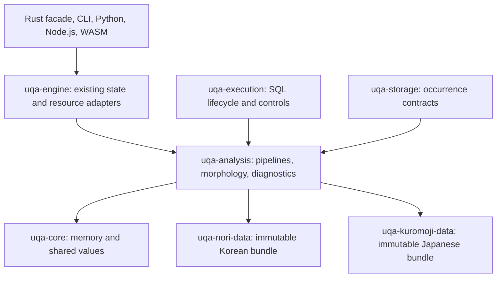

# Native Kuromoji analysis and shared morphology

Status: Implementation in progress against UQA 0.3.0 and Lucene 10.5.1. Nori and Kuromoji use private shared dictionary I/O, section framing, surface ranges, connection costs, string codecs, Unicode intervals, provenance primitives and offline reconstruction in `uqa-analysis::morphology`; the common CJK width character filter is implemented and verified against Lucene. The complete Japanese source rebuild and neutral model export are verified in Docker. The native Japanese bundle, checked loader, exhaustive model verifier and immutable data crate are implemented. Japanese user-rule compilation and lookup match the pinned reference. Typed resource caches and the combined resource builder are implemented. Native NORMAL/SEARCH/EXTENDED tokenization now uses the shared rolling traversal and matches all 209 pinned tokenizer cases, including six morphology attributes and compound graph output. The common rich-token/source bridge and native N-best cost/example selection are implemented; 98 additional Docker cases verify alternative graphs, costs and errors. The standalone default analyzer, its five filters and separate ordinary normalization now match 127 additional Docker cases. Optional filters, durable common-pipeline integration and binding delivery remain to be implemented. The independent 0.3.0 release is complete.

The [implementation plan](../plans/0007-kuromoji-analyzer.md) tracks ordered work units, dependencies, verified results and remaining acceptance gates. Update it with each logical implementation unit.

## Objective

Implement Lucene Kuromoji in Rust, including its Japanese tokenizer, default analyzer, optional analysis components, normalization, and completion analysis. Integrate it with the existing durable analyzer revisions, occurrence graphs, phrase matching, highlighting, SQL diagnostics, and Rust/Python/Node.js/WASM surfaces. Extract the mechanisms already implemented for Nori into their existing owning crate before adding a second language. Preserve Nori outputs, serialized descriptors, dictionary identities, resource ownership, and provider behavior throughout that extraction.

The target is the pinned Lucene behavior, including token order, UTF-16 attributes, stream-end state, configuration errors, and dictionary interpretation. `standard_cjk` keeps its existing character n-gram behavior. A Japanese tokenizer with flattened terms alone does not complete this work.

## Reference and input provenance

Use Lucene commit `64ce863a2bea79c69c19c4d56268c26710ff0ff9`, the same reference as [Nori](../../tests/parity/nori/manifest.json). During design inspection, the following official Maven artifacts were downloaded and hashed; these are artifact identities, not evidence of Rust parity.

| Artifact | Bytes | SHA-256 |
| --- | ---: | --- |
| `lucene-analysis-kuromoji-10.5.1.jar` | 4,720,127 | `bbe9a6d52d89d88c68e1c6db8cc2c829774ae5fcee8be1a1fdc3c6bec2ab9503` |
| `lucene-analysis-kuromoji-10.5.1-sources.jar` | 112,848 | `36994f68d0691f972bc3b8911ecd8a345da24d195bbfb4d2b8b31a2d83e6ecff` |
| `lucene-analysis-common-10.5.1-sources.jar` | 1,401,302 | `e3fef65eabb8c8c23d82ce8c8a73b1cff34e595fbfa97cb5fbfc14997a1ff9d0` |
| `lucene-analysis-nori-10.5.1-sources.jar` | 73,498 | `4909e8d78cfb239a14cf97a1df22cda7eb44a6af6cf0b7acb8be1f149936b70c` |

Artifact URLs follow the [official Kuromoji directory](https://repo.maven.apache.org/maven2/org/apache/lucene/lucene-analysis-kuromoji/10.5.1/) and the corresponding `lucene-analysis-common` and `lucene-analysis-nori` directories. The existing Nori manifest supplies the core/common binary hashes and Docker image digest. Pin those inputs in a separate `tests/parity/kuromoji/manifest.json` when implementing the oracle; do not make Japanese fixtures depend on a mutable Korean fixture file.

Every JVM operation, including compilation, dictionary regeneration, model export, and fixture generation, runs in Docker. Reuse the pinned Temurin image after validating it against the Japanese oracle. Record runtime, image, architecture, jar hashes, fixture generator revision, and original input hashes. Production builds and execution require neither Java nor dictionary downloads.

The distributed dictionary identifies `mecab-ipadic-2.7.0-20070801`. The [reference tools](../../tests/parity/kuromoji/README.md) now pin its source archive, original EUC-JP patch, generation task and disabled entry normalization, and reproduce all nine compiled dictionary resources exactly. They also export every public dictionary-model value, default stop set and completion mapping, with an independent read-only Docker comparison. The jar also contains nine dictionary `.dat` resources, stopword and stop-tag files, and a completion romanization map. Inventory and hash each resource rather than treating the jar hash as a substitute for model verification. Preserve the actual IPADIC/NAIST/ICOT notices, Lucene LICENSE/NOTICE, and notices for any exported JDK tables; the Korean dictionary's license files do not stand in for the Japanese dictionary's notices. See the notices inside the [binary artifact](https://repo.maven.apache.org/maven2/org/apache/lucene/lucene-analysis-kuromoji/10.5.1/lucene-analysis-kuromoji-10.5.1.jar).

## Exact compatibility surface

| Surface | Required behavior and reference |
| --- | --- |
| Tokenizer | `NORMAL`, `SEARCH`, and `EXTENDED`; explicit punctuation and compound retention; user dictionary; known/unknown/user candidate ordering; exact graph positions and UTF-16 offsets. [JapaneseTokenizer](https://github.com/apache/lucene/blob/64ce863a2bea79c69c19c4d56268c26710ff0ff9/lucene/analysis/kuromoji/src/java/org/apache/lucene/analysis/ja/JapaneseTokenizer.java) |
| Search segmentation | Japanese length penalties, alternate segmentation, unknown grouping, and extended unknown unigrams. These are Japanese policies, not translations of Nori's `none`/`discard`/`mixed` modes. [Japanese ViterbiNBest](https://github.com/apache/lucene/blob/64ce863a2bea79c69c19c4d56268c26710ff0ff9/lucene/analysis/kuromoji/src/java/org/apache/lucene/analysis/ja/ViterbiNBest.java) |
| N-best | Cost-bounded path output, pending-token ordering and deduplication, position fixups, and example-derived cost selection. Implement `nBestCost` and `nBestExamples`, including their combined maximum, instead of treating SEARCH as equivalent. [Tokenizer factory](https://github.com/apache/lucene/blob/64ce863a2bea79c69c19c4d56268c26710ff0ff9/lucene/analysis/kuromoji/src/java/org/apache/lucene/analysis/ja/JapaneseTokenizerFactory.java) |
| Morphology | Base form, Japanese POS, reading, pronunciation, inflection type, and inflection form, with the reference's absent-value behavior. Retain dictionary origin internally for lookup and emission. [JaMorphData](https://github.com/apache/lucene/blob/64ce863a2bea79c69c19c4d56268c26710ff0ff9/lucene/analysis/kuromoji/src/java/org/apache/lucene/analysis/ja/dict/JaMorphData.java) |
| User rules | Japanese CSV parsing, phrase segmentation, readings, POS, whitespace/comment handling, duplicate behavior, word IDs, and error cases. Do not route them through the Korean user-rule parser. [UserDictionary](https://github.com/apache/lucene/blob/64ce863a2bea79c69c19c4d56268c26710ff0ff9/lucene/analysis/kuromoji/src/java/org/apache/lucene/analysis/ja/dict/UserDictionary.java) |
| Optional stages | Base-form replacement, POS stop filtering, reading/kana and romaji output, Katakana stemming, Japanese number composition, iteration-mark character filtering, and Katakana/Hiragana small-kana expansion. Port each stage's keyword, graph, source-span, and end-state rules. [Kuromoji component inventory](https://github.com/apache/lucene/tree/64ce863a2bea79c69c19c4d56268c26710ff0ff9/lucene/analysis/kuromoji/src/java/org/apache/lucene/analysis/ja) |
| Completion | The separate completion analyzer and INDEX/QUERY filter modes, including the dedicated romanization map and emitted alternatives. This adds analysis tokens; it does not introduce a new completion index or query operator. [JapaneseCompletionAnalyzer](https://github.com/apache/lucene/blob/64ce863a2bea79c69c19c4d56268c26710ff0ff9/lucene/analysis/kuromoji/src/java/org/apache/lucene/analysis/ja/JapaneseCompletionAnalyzer.java) |

The 10.5.1 default `JapaneseAnalyzer` applies `CJKWidthCharFilter` before tokenization, then Japanese tokenization in SEARCH mode with punctuation and compound tokens discarded, followed by base form, POS stops, Japanese stopwords, Katakana stemming, and Java simple lowercase. Its normalization path applies CJK width conversion and simple lowercase only. Reading conversion, number composition, and iteration-mark expansion are optional and do not belong in this default chain. The tokenizer factory also defaults both discard flags to true; specify every option in reference fixtures rather than relying on older examples. [Default analyzer source](https://github.com/apache/lucene/blob/64ce863a2bea79c69c19c4d56268c26710ff0ff9/lucene/analysis/kuromoji/src/java/org/apache/lucene/analysis/ja/JapaneseAnalyzer.java)

The completion analyzer uses width conversion, NORMAL tokenization with both discard flags, the completion filter, and lowercase. Its normalization reader performs width conversion, while it does not override the token normalization method with lowercase. Test this separately from ordinary Japanese normalization. A standalone Japanese tokenizer performs no implicit width character filtering. [Completion analyzer source](https://github.com/apache/lucene/blob/64ce863a2bea79c69c19c4d56268c26710ff0ff9/lucene/analysis/kuromoji/src/java/org/apache/lucene/analysis/ja/JapaneseCompletionAnalyzer.java)

## Existing UQA implementation and required extraction

The [analyzer ownership contract](../manual/internals/04-analyzer-pipeline.md), relevant Cargo manifests, and [dependency policy](../../scripts/workspace-dependency-policy.json) were inspected before choosing these owners. Lucene itself shares `Viterbi`, `ViterbiNBest`, connection costs, dictionary infrastructure, and token abstractions in `analysis.morph`; its Japanese subclass retains language-specific decisions. UQA should share equivalent mechanisms without copying Java inheritance or routing algorithms through Engine. [Lucene morphology package](https://github.com/apache/lucene/tree/64ce863a2bea79c69c19c4d56268c26710ff0ff9/lucene/analysis/common/src/java/org/apache/lucene/analysis/morph)

| Current UQA implementation | Decision | Target and invariant |
| --- | --- | --- |
| `uqa-core::memory`; analysis `source.rs`, `term.rs`, `token.rs`, `cache.rs` | Reuse | Keep allowances, lossless terms, source-edit maps, token/end-state contracts, and bounded caches in their existing owners. |
| Former Nori I/O, frame, surface, matrix and string codecs | Shared mechanisms extracted | Reader/writer, bounded frame verification, lexicon, surface ranges, matrix and string pools now live in private `uqa_analysis::morphology`. Language wrappers retain the exact schema, hash domain, typed identity and entry interpretation. Nori's existing bundle remains byte-for-byte readable and reproducible. |
| `morphology/unicode.rs`, `resources/hash.rs` | Unicode codec extracted; resource identity work remains | Shared immutable, content-identified Unicode profiles and hashes. Korean and Japanese character-class tables remain separate. Identical JDK tables may share one allocation only after their identities match. |
| `morphology/resources.rs`, language resource wrappers | Shared resource ownership implemented | Both languages use shared artifact/hash validation, serialized immutable publication, bounded dictionary/user caches and retention statistics. Each retains typed requests, resolvers, resolved handles and public errors. The common analyzer builder installs both owners independently. |
| `morphology/lattice.rs`, `morphology/viterbi.rs` | Bounded storage and forward traversal extracted | Nori uses common rolling positions, ordered candidates, frontier commits, strict least-cost forced backtraces, EOS connection-cost choice, pruning/rebasing and reserved frontier release. Language configuration supplies existing limits/errors, matching, pending emission and EOS costs. Japanese resegmentation and N-best storage remain separate consumers. |
| `kuromoji/tokenizer/nbest` | Native alternatives and example preparation implemented | Independently bounded ordered left/right costs, stable span deduplication, graph fixups and signed example probes; lazy attributes preserve reference error timing. Shared forward traversal supplies narrow no-op-by-default hooks, and Nori/non-positive-cost Japanese execution allocates no alternative arrays. |
| Nori `word.rs`, `emission.rs`, POS, spaces and unknown rules | Keep Korean policy | Japanese policies live under `kuromoji/tokenizer`; do not add Japanese branches throughout the Korean tokenizer or make Japanese modules import `nori`. |
| `token.rs`, `token/native.rs`, language token adapters | Shared bridge implemented | One private tagged morphology value; native/common source projection, graph validation and allocation transfer shared by Korean and Japanese tokens. Existing `korean_morphology()` and serialized Korean output are preserved. |
| `morphology/filter.rs`, `token/filter.rs` | Generic filter operations extracted | Shared term/span contracts, reserved streams, source projection, polling and Java simple lowercase; Nori preserves its attribute policy, selected profile, diagnostics, mutations and terminal state. Japanese filters extend the same stream owner. |
| `resources.rs`, `descriptor.rs`, `analyzer/compiled.rs` | Generalize compiled resource and normalization selection | Replace the Nori-only resolved resource/normalizer slots with analysis-owned typed preparation and normalization plans. Preserve legacy descriptor bytes and fingerprints. |
| `Analyzer::uses_korean_stages` and its capability/length-policy callers | Separate language identity from requirements | Analysis supplies language-neutral feature/resource requirements and declared length policy; keep the existing Korean predicate for source compatibility, without making it the Japanese preflight switch. |
| `kuromoji/filters`, `kuromoji/analyzer.rs` | Default Japanese analysis implemented | Shared native/common mutation and terminal ownership; Japanese base form, exact POS stops, prepared case-aware word stops, Katakana stemming, width edits and selected-profile simple lowercase. Normalization bypasses tokenizer and removal stages. |
| `nori/number/decimal.rs` and `number/stream.rs` | Share arithmetic and proven stream mechanics | Extract budgeted exact-decimal storage/formatting and reusable lookahead ownership. Keep language numerals, grammar, eligibility, and attribute propagation as explicit policies. |
| Storage occurrences, scoring, graph phrase matcher and highlighting | Reuse existing interfaces | No Japanese posting namespace, morphology-aware storage dependency, duplicated scorer, or Engine-side phrase implementation. |

Do not extract a new general-purpose morphology crate now: both implementations belong to `uqa-analysis`, and no independent runtime consumer requires a crate boundary. Use private modules and narrow typed interfaces. Share the forward-search mechanisms after recording a correspondence between both pinned algorithms; keep Japanese resegmentation and N-best traversal distinct where their state requirements differ. Nori's single-best lattice must not acquire N-best arrays or allocate Japanese scratch.

The pinned common `Viterbi.forward` supplies the same ordered position traversal, single-node frontier commit, least-cost forced backtrace at a 1,024-unit gap, and EOS connection-cost choice to both languages. Its `Position`/`WrappedPositionArray` correspond to UQA's shared rolling lattice: candidate insertion order decides exact cost ties, pruning keeps the chosen candidate at index zero, and rebasing preserves the selected right context. The extraction changes neither candidate layout nor the reservation and polling order; its language adapter supplies only limits and existing diagnostics.

| Forward-search decision | Korean policy | Japanese policy |
| --- | --- | --- |
| User matches | Longest entry with the per-forward maximum bound | Every matching prefix, suppressing system matches at that start |
| Space treatment | One space-separator prefix and POS-dependent transition penalty | No implicit prefix skip or Korean space penalty |
| Unknown grouping | Script/category/digit compatibility | Exact character class and punctuation compatibility; NORMAL suppresses overlaps within the previous unknown span |
| Backtrace emission | Korean decompound modes and morphology | Search penalties, alternate segmentation, optional compounds and EXTENDED unigrams |
| Alternative paths | No N-best state | Independently bounded Japanese N-best traversal and graph fixups when requested |

## Crate and feature design

The implemented `kuromoji` feature of `uqa-analysis` enables the Japanese data dependency and required codec, while `kuromoji-tools` adds offline tooling. Analysis, `uqa`, and `uqa-engine` defaults remain free of dictionary features. Engine, facade, CLI, and binding forwarding is still to be implemented; those owners only forward the feature. Official Python, Node.js, and WASM distributions should include both language features when this work ships; feature-disabled builds must continue to work and exclude the corresponding data crate from their normal dependency graph.

The new `uqa-kuromoji-data` crate contains the converted immutable bundle and provenance/notices, with no runtime dependency on analysis, storage, execution, or Engine. Update the workspace dependency allowlist and affected transitive closures with that exact leaf, preserving every forbidden dependency direction. Update package ordering, legal-file synchronization, archive inventory, and feature-disabled binding checks when adding the crate; these are delivery requirements, not reasons to place the data in Engine.

Verify four configurations explicitly: neither language, Nori only, Kuromoji only, and both. A `cfg(feature = "nori")` guard around shared source projections, normalization, or diagnostics must become an appropriate common capability guard, not an implicit dependency of Kuromoji on Nori. Check `cargo tree --edges normal` as well as compilation: existing Nori data dev-dependencies are not proof of a production feature leak.

## Dictionary representation and resources

Export a complete language-neutral transport model from the pinned Japanese dictionaries: surfaces and homograph order, source/word identities, left/right context IDs, signed costs and every matrix cell, unknown classes and group/invoke behavior, base forms, POS, readings, pronunciation, inflection data, and user-rule semantics. Include Java character properties needed by actual algorithms, exact stop sets, and completion mappings. Stream exhaustive export and verification; commit compact manifests and deterministic test cases, not a complete multi-million-line JSON model dump.

The implemented [Japanese bundle](kuromoji-bundle-format.md) uses shared validated section codecs, decompression bounds, ordered lexicon lookup and matrix access. Its eight-section `UQAKURO\0` version 1 schema and Japanese semantic hash domain are distinct from Nori's `UQANORI\0`. Nori's seven-section format, version 1 identity domain, packed bytes and dictionary hash remain unchanged. The Japanese loader validates its own six-attribute word records, character classes and analyzer resources before publishing `Arc<KuromojiDictionary>`. Exhaustive reconstruction verifies all six neutral model streams, and the data crate's actual archive passes source/resource/license inventory checks.

The implemented `kuromoji::UserDictionary::compile` retains the selected model identity and original CSV source. It uses shared preparation limits and lexicon traversal, with independent Japanese CSV/comment/segmentation rules and duplicate rejection. Ordered prefix and longest-overlapping lookup, UTF-16 segment lengths, nullable morphology and delayed malformed-feature errors match 62 pinned Docker cases. POS is retained once per phrase to avoid multiplication by its segment count. `KuromojiResources::compile_user` interns the exact source against the model identity, including empty/comment-only snapshots; the standalone tokenizer consumes these exact immutable rules.

Distinguish encoded artifact hash, decoded semantic model identity, Unicode/filter profile identity, and original user-source hash. Namespace cache keys by language/schema as well as content. Untrusted resolver bytes must pass declared-hash, section, count, string, table, and reference validation before cache publication. Dictionary decode/preparation has explicit independent limits; query work uses the caller's `MemoryBudget`. Cache eviction releases cache ownership without invalidating compiled revisions, and stricter resource owners must not inherit an unchecked model from another owner's cache.

The implemented `KuromojiResources` uses the shared resource owner while retaining independently typed Japanese requests, hashes, errors and validated handles. Exact hashes reuse retained content; names consult the host resolver each time, and a changed alias cannot mutate an existing handle. Incorrect declared/requested hashes, wrong-language bundles, missing resources and failed user compilation publish no entry. `AnalyzerResources::builder` installs both language owners, and the legacy `with_nori_resources` constructor retains its existing meaning. Resolver execution has no implicit file or network fallback. Durable Japanese compilation remains to be implemented: rules compiled from files must become snapshots, and reopening must use exact retained resources rather than rereading an original path.

## Tokens, filters, and normalization

The implemented `JapaneseMorphology` carries the reference base form, POS, reading, pronunciation, inflection attributes and origin. Private user-field failure flags distinguish invalid lazy attributes from optional absence; filtering checks only requested fields, and public materialization validates all emitted attributes. Opaque terminal attributes retain this state through later stream operations without exposing it in serialized output. A private tagged morphology representation prevents one token from carrying both languages' dictionary attributes. The existing Korean accessor and `korean_morphology` diagnostic field are unchanged; `japanese_morphology()` and a separate optional Japanese diagnostic field expose Japanese attributes. Absent and empty values remain distinct, and raw UTF-16 token units remain lossless. Dictionary word records stay language-specific; generic filters use common term, keyword, graph, and source operations.

The implemented retained `SourceProjection` is available with either morphology feature, and both languages use `TokenBatch`'s existing terminal token. `token/native.rs` shares native/common conversion and transfers term, attribute, terminal, source-map and output reservations through narrow language adapters. `KuromojiOutput::into_analyzed` converts an existing stream; `JapaneseTokenizer::tokenize_mapped_budgeted` prepares private coordinate caches and carries one supplied allowance through tokenization and conversion. Filtering/remapping must preserve graph increments and lengths, final skipped positions, and terminal attribute mutations. Language filters acting on ordinary or another language's tokens follow explicit, tested attribute-absence behavior rather than casting foreign morphology.

Implement CJK width conversion in the common character-filter owner with exact source correction, including halfwidth kana plus voiced marks becoming one character. It is a restricted mapping, not general Unicode NFKC. Reuse the existing character-edit mapping and budgeted output builder. Iteration-mark expansion keeps Japanese classification and boundary policy in its own stage. Generic full lowercase retains its current Rust behavior; the Japanese default uses the pinned Java simple-lowercase profile already needed by Nori. [CJKWidthCharFilter](https://github.com/apache/lucene/blob/64ce863a2bea79c69c19c4d56268c26710ff0ff9/lucene/analysis/common/src/java/org/apache/lucene/analysis/cjk/CJKWidthCharFilter.java)

Replace the Nori-dictionary pointer used as `CompiledAnalyzer`'s normalizer with an explicit analysis-owned normalization plan. Distinguish legacy Nori simple lowercase, Japanese width-plus-simple-lowercase, Japanese completion width-only, and unavailable normalization. Normalization never runs segmentation, stop filters, stemming, or number composition. Its exact stages and profiles participate in the Japanese descriptor identity; reconstructing it from an analyzer's display name is forbidden.

Add `normalization: Option<NormalizationConfig>` to analyzer-level configuration, with a default of `None` and omission when serializing `None`. Keep existing constructors and add a builder for explicit normalization. Existing Rust struct literals need the new field or a constructor; document this source migration in the implementation release. `None` retains legacy Nori normalization inference and unavailable normalization for generic pipelines. Japanese built-ins explicitly select their respective plans; custom Japanese pipelines select a plan when they require normalization. The tokenizer's mode never selects analyzer normalization.

Omitted legacy definitions must retain their existing canonical serialization, descriptor version, runtime profile, and fingerprint. The descriptor decoder must retain its legacy canonicalization path, including strict unknown-property validation. Encode explicit normalization only in the new definition form and include it in that form's fingerprint; do not inject a null/default field into previously hashed JSON. Native Japanese analyzer constructors select the same plans as their corresponding built-ins.

## Public configuration and durable identity

Reserve the built-in analyzer names `kuromoji` and `kuromoji_completion` only when their feature is available. Proposed component tags are `kuromoji_tokenizer`, `kuromoji_baseform`, `kuromoji_part_of_speech`, `kuromoji_stop`, `kuromoji_readingform`, `kuromoji_stemmer`, `kuromoji_number`, `kuromoji_iteration_mark`, `kuromoji_katakana_uppercase`, `kuromoji_hiragana_uppercase`, and `kuromoji_completion`; common width and pinned simple-lowercase stages have language-independent names. These are UQA JSON names, not a promise to accept Elasticsearch or Solr configuration files.

The Japanese tokenizer configuration exposes mode, dictionary identity, user rules, punctuation/compound options, and N-best cost/examples. Resolve reference defaults explicitly during compilation. Keep tokenizer-only configuration distinct from the built-in analyzer's complete stage chain. Stop sets, kana-stem minimum length, reading output mode, iteration-mark options, and completion mode remain stage-specific configuration. Unknown properties, unavailable features/resources, and invalid configurations fail before publishing a catalog entry.

Expand stop defaults to canonical resolved sets with their exact case policy; the generic English stop defaults must not enter the Japanese analyzer. Compile user rules against the selected model, retain their original source identity, and resolve N-best examples under preparation limits. Persist the effective cost with the defining model/profile and canonical configuration so reopening does not rerun example estimation against another dictionary. Match reference handling of non-positive costs, malformed examples, empty inputs, and duplicate user surfaces through differential fixtures rather than inventing normalization rules.

Extend the existing descriptor validation and compiled-resource restoration in `uqa-analysis`. Japanese dictionary, user source, normalization, width, stop, and romanization identities must participate when the corresponding stage uses them. Preserve the fingerprints and restoration behavior of all existing generic/Nori descriptors in each feature configuration. A profile change that affects terms, graphs, offsets, normalization, or scoring lengths creates a new revision and requires an explicit rebind/rebuild.

## Storage, SQL, and bindings

Use the existing `TokenTermKey`, complete occurrence payload, `IndexedFieldRevision`, independent normalization lengths, and original-source end metadata. Store graph geometry and terms, not Japanese dictionary objects or POS-specific posting schemas. Select `DiscountOverlaps` explicitly for the Japanese built-ins, retaining the current emitted-token policy for existing generic pipelines. Check actual length and frequency behavior with compound alternatives, N-best output, stopped terms, and completion expansions.

No positional-format or SQLite schema bump is planned merely to add Japanese morphology: the [current occurrence format](occurrence-posting-format.md) already retains the required graph and offset data. Prove that using Japanese round-trip tests on Memory, SQLite, and redb before accepting this decision. If a necessary attribute cannot be represented, change its owning representation and version the incompatible data honestly; never flatten paths to avoid a migration.

Reuse `uqa-operators` graph matching, `uqa-scoring` lexical scoring/bounds, and `uqa-analysis` source highlighting. Compare complete document support and scores across exhaustive, WAND, cursor/block-max, and SQL paths, with retained independent index/search revisions. Test graph alternatives without allowing new cross-path matches through an accidental position-length rewrite. Width/iteration changes, base-form replacement, reading output, and composed numbers must highlight original text safely.

Engine remains responsible for existing state, sessions, transactions, and retained-resource adapters. SQL argument/capability analysis stays in `uqa-sql`; lifecycle, result ownership, and control/error propagation stay in `uqa-execution`. Extend the existing analyzer registration, analysis diagnostics, normalization, field binding, and highlighting interfaces rather than adding Japanese command handlers to Engine. New low-level resource resolution is supplied through the existing analysis revision boundary.

Run the same Japanese SQL contract through Rust, Python, Node.js, and real browser WASM. Cover built-ins and custom pipelines, user rules, independent index/search assignments, prepared statements, replacement/rename/drop, transaction/savepoint rollback, sibling-session refresh, reopen, and recovery from missing resources. Restore actual SQLite/redb backups after removing the original database directory; browser cases close and reopen IndexedDB-backed state. Feature-disabled processes must reject unavailable retained Japanese definitions without rewriting their catalogs or postings.

## Runtime control and failure atomicity

Use the existing memory owner through input encoding, source mapping, candidate traversal, resegmentation, N-best lattice construction, graph fixups, token/filter output, diagnostics, and highlighting. Reserve capacity before allocation and retain both buffers during replacements. Shared immutable dictionaries and preparation caches have separate, explicit accounting; do not present the query allowance as a total process-memory bound.

Keep language-neutral work limits for source units, live lattice positions/candidates, emitted terms/attributes, and output size. Japanese N-best uses explicit limits for fragment nodes, additional graph/probe work and nonempty examples; the existing token limit counts emission candidates before deduplication, and byte/output-unit limits bound retained terms and attributes. Example preparation shares its work allowance across all probes and bounds the entire examples input. Poll inside every potentially long loop, including matrix/lexicon traversal, sorting and deduplication, unknown grouping, backtraces, number parsing, romaji expansion, and encoding. Hitting a limit returns an error instead of truncating a graph or changing the selected path. Nori never allocates the N-best sidecar; Japanese single-path execution does not allocate it when disabled.

Cancellation remains SQLSTATE `57014` and query allocation failure remains `53200`. Preserve the existing source/index revision and committed postings when registration, analysis, or rebuilding fails. Dropping partial work releases only that work's reservations; unrelated held results and snapshots retain theirs. Verify complete recovery on the next operation and after reopening. Ordinary filter eligibility failures follow their reference behavior, while cancellation and resource failures must not be caught as successful fallback text.

Korean and Japanese number filters may share exact-decimal coefficients and formatting, but their character tables and composition rules remain separate. Preserve graph/keyword exclusions and the reference's lookahead-derived attribute behavior, even when a later POS/reading filter makes it observable. Likewise, reading-form romaji and completion romanization use distinct upstream algorithms/maps. [JapaneseNumberFilter](https://github.com/apache/lucene/blob/64ce863a2bea79c69c19c4d56268c26710ff0ff9/lucene/analysis/kuromoji/src/java/org/apache/lucene/analysis/ja/JapaneseNumberFilter.java), [JapaneseReadingFormFilter](https://github.com/apache/lucene/blob/64ce863a2bea79c69c19c4d56268c26710ff0ff9/lucene/analysis/kuromoji/src/java/org/apache/lucene/analysis/ja/JapaneseReadingFormFilter.java), [JapaneseCompletionFilter](https://github.com/apache/lucene/blob/64ce863a2bea79c69c19c4d56268c26710ff0ff9/lucene/analysis/kuromoji/src/java/org/apache/lucene/analysis/ja/JapaneseCompletionFilter.java)

## Implementation order and acceptance

| Work unit | Dependency and owner | Reviewable completion evidence |
| --- | --- | --- |
| Pin Japanese reference and complete model | Docker tools under `tests/parity/kuromoji` | Complete resource inventory, source-generation recipe, bounded streaming model export, full attribute/error fixtures, and repeated artifact identity. No Rust parity claim yet. |
| Extract shared mechanics from Nori | `uqa-analysis`; existing Nori implementation | Original Nori/generic fixtures, packed dictionary bytes, descriptor fingerprints, controls, and provider results unchanged; tests move with code into the same owning crate. |
| Add Japanese bundle and loader | Shared codec plus new data crate | Exhaustive equality of every model value; corrupted/truncated/oversized bundle rejection; bounded immutable resource sharing; exact attribution inventory. |
| Implement tokenizer and morphology bridge | Japanese model plus shared lattice/source contracts | NORMAL/SEARCH/EXTENDED, all discard options, user/unknown rules, resegmentation, N-best, complete token/end attributes, and native/common stream equality. |
| Implement filters, normalization and completion | Rich Japanese tokens and shared stage machinery | Default analyzer and every optional component match their separate oracles; generic/Nori filters still preserve metadata and resource ownership. |
| Compile and restore Japanese revisions | Components plus typed resource owners | Canonical defaults, exact resource identities, normalization profiles, cache failures, feature isolation, and legacy fingerprint stability. |
| Integrate retrieval and public surfaces | Existing storage/execution interfaces | Memory/SQLite/redb graph, score, phrase/highlight, transaction/session, backup, prepared query, diagnostics, and binding parity. |
| Package and release | All preceding functional work | Four-feature matrix, supported Rust/MSRV and platform builds, real browser behavior, complete source/wheel/npm archives, notices, and dependency/ownership checks. |

Keep these as logical commits or small reviewable PRs. Do not combine mechanical extraction with Japanese semantic changes. Add the shared module and migrate Nori users before making Kuromoji depend on it; temporary wrappers preserve public compatibility but must not leave duplicate algorithms behind. Update this design with actual interfaces and evidence when implementation choices change. Do not mark units complete because a constructor compiles or a narrow example tokenizes.

## Verification plan and bounded evidence

The Docker oracle records ordered tokens, raw UTF-16 terms, offsets, increments/lengths, keyword and morphology attributes, final offsets/increments, normalization output, and exact success/error outcomes. Test character filters, tokenizer, individual filters, complete analyzer chains, and completion separately. Compare the complete exported model independently from example outputs; include original dictionary ordering and default resource contents.

Use fixed cases for Japanese compounds and inflections, names and homographs, long ambiguous paths across the forced-backtrace boundary, unknown group/invoke classes, surrogate pairs and isolated units, punctuation and spaces, voiced halfwidth kana, iteration marks, small kana, stop holes, user CSV quoting/duplicates/invalid segmentation, all N-best settings, numbers and trailing lookahead, and both completion modes. Add seeded differential/fuzz inputs and retain minimized regressions. Nori and generic golden outputs remain unchanged; never regenerate expectations from the candidate Rust implementation.

| Layer | Required verification |
| --- | --- |
| Analysis and data | Existing single integration target plus unit modules, exhaustive model verifier, malformed input/fuzz tests, strict Clippy, and all four language feature configurations. |
| Ownership and dependencies | `check-workspace-dependencies.py`, `check-engine-capabilities.py`, `check-integration-test-harnesses.py`, Rust file/header policies, and normal dependency trees per feature. Keep exactly one test executable per crate. |
| Storage and retrieval | Existing provider/operator/scoring targets; exact graph and score round trips, original-source highlight spans, snapshot independence, failure atomicity, and persisted revision restoration. |
| SQL and bindings | Existing manual SQL harness when public examples land; one shared language binding fixture executed by each actual host, with enabled/disabled resources and persistence/backup coverage. |
| Packaging | Source and archive license checkers, crate publishing order, Python source/wheels, Node root/native packages, WASM assets, embedded Japanese bytes, and no dictionary downloads during build or runtime. |

Routine CI should gate deterministic semantics, counts, allocation limits, cleanup, and bounded cancellation work. Shared-runner wall-clock samples are observations, not evidence of a throughput regression or performance acceptance. Any controlled timing study must declare the question, fixed corpus, target, host/noise qualification, sample/run budget, stopping condition, and compact result schema before running. If the environment fails qualification, stop; do not repeatedly collect until a threshold passes or postpone implementation/release indefinitely for uncontrolled measurements.

Track small fixed fixtures, manifests, hashes, and concise conclusions in Git. Stream exhaustive model comparisons and keep their large intermediates in temporary storage or expiring CI artifacts; keep performance reports outside source control and delete them under an explicit retention policy. A large raw JSON archive is not a substitute for a reproducible verifier. Follow the [existing report-storage policy](../../benchmarks/nori/README.md#report-storage-and-timing-interpretation).

## Decisions still requiring implementation evidence

The architecture and reference behavior above are design decisions. Japanese source generation, full model hashes, bundle sections/identity/size and dictionary input bounds are established in the reference manifests and bundle specification. The exact shared Viterbi interface, exhaustive tokenizer/filter oracle inventory, resource/cache and query limits, and native/WASM behavior require further implementation evidence. Establish them in their owning work units; do not invent performance targets or claim they have already passed. The public Rust source change from normalization configuration belongs in the implementation release's upgrade notes, while Nori's durable descriptor and data compatibility remain mandatory.
