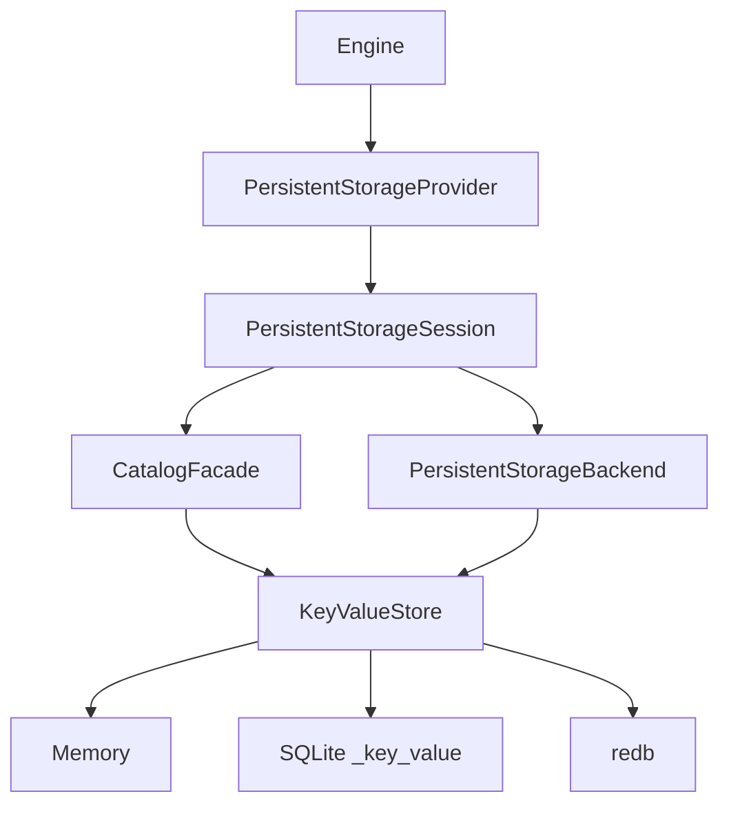

# Key/Value Storage Backends

This document defines the implemented Key/Value storage boundary, session ownership contract, redb behavior, and remaining compatibility limits. SQLite remains the default engine format, while applications can compose `uqa-engine` with `uqa-storage-redb` or another provider without changing query execution.

## Architecture



`PersistentStorageProvider` owns a durable database and creates independent `PersistentStorageSession` values. Each session contains a `CatalogFacade` and `PersistentStorageBackend` bound to the same transaction context, which prevents catalog mutations and document/index mutations from committing through different physical sessions. `Engine::from_persistent_provider` retains the provider so `Engine::new_session` works for every backend; `Engine::from_persistent_backends` remains available for already-bound handles but intentionally cannot manufacture another session.

## Physical store contract

`KeyValueStore` provides byte-exact point reads and writes, lexicographically ordered prefix scans, bounded key cursors, atomic batches, prefix deletion, read/write and read-first transaction boundaries, savepoints, and transaction-state observation. `KeyValueStorageBackend` and `KeyValueCatalog` implement UQA documents, text postings, B-tree postings, brute-force vectors, IVF centroid assignments, HNSW graph generations, graph data, and durable registries once above this byte-key boundary.

Every physical implementation must provide independent transaction state per session even when sessions share one database. `in_transaction` and `transaction_has_written` are correctness hooks used by the engine to preserve pinned snapshots and reject unclassified writes in read-only statements. `change_version` is an optional committed generation used to notice writes made by separately opened engines or processes; implementations that return `None` still receive in-process epoch synchronization for sessions derived from the same engine.

Third-party implementations should run `uqa_storage::key_value::conformance::verify_store` on a fresh disposable store and `verify_session_isolation` on two stores sharing one physical database. These checks cover byte ordering, cursors, atomic batches, outer commit and rollback, SAVEPOINT after prior writes, read-first write observation, and MVCC visibility.

## Implementations

| Implementation | Crate | Durable | Session model | Notes |
| --- | --- | --- | --- | --- |
| Relational SQLite | `uqa-storage` | yes | one `ManagedConnection` session per engine session | Default engine backend; supports persisted B-tree, IVF, and HNSW indexes plus SQLCipher and compressed-container variants |
| `SQLiteKeyValueStore` | `uqa-storage-sqlite` | yes | independent SQLite session over a shared pool | Stores all logical Key/Value data in `_key_value (key BLOB PRIMARY KEY, value BLOB NOT NULL) WITHOUT ROWID` |
| `RedbKeyValueStore` | `uqa-storage-redb` | yes | one redb read or write transaction per store session | Pure Rust, single file, MVCC readers, one concurrent writer, committed generation tracking, durable B-tree/IVF/HNSW through the shared logical layer |
| `MemoryKeyValueStore` | `uqa-storage` | no | one in-process test state | Reference implementation for logical tests, not a durable engine provider |

## redb transaction mapping

An autocommit mutation or `KeyValueBatch` opens one redb `WriteTransaction`, applies all operations, increments the metadata generation in the same transaction, and commits once. An explicit engine transaction keeps one redb transaction in that engine session until COMMIT or ROLLBACK. A read-only engine statement uses a redb `ReadTransaction`, so readers do not acquire the single-writer slot and retain a stable MVCC snapshot.

redb native savepoints cannot be created after a transaction has opened a table, while SQL permits `SAVEPOINT` after arbitrary earlier writes. `RedbKeyValueStore` therefore keeps a transaction-local undo journal from the earliest active SQL savepoint. Each changed key records its previous value, prefix deletion records every removed pair, `ROLLBACK TO` replays inverse operations in reverse order, and `RELEASE` discards the named savepoint and its descendants. The outer redb transaction remains atomic throughout; no SAVEPOINT operation commits or splits it.

The engine stores savepoints in creation order rather than a name set. Duplicate names shadow older savepoints, `ROLLBACK TO` retains the selected savepoint while invalidating later ones, and `RELEASE` removes the selected savepoint and all descendants, matching the physical backends and avoiding stale engine-side snapshots.

## Logical key layout

Logical keys begin with a one-byte namespace tag, encode user-controlled string segments with explicit lengths, and encode numeric identifiers in big-endian order. This makes prefix boundaries unambiguous and preserves document ordering under bytewise iteration. Values use versioned JSON or compact binary encodings owned by the logical catalog, document, posting, and vector adapters rather than by redb or SQLite.

Representative namespaces include metadata, schemas, relations, tables, views, analyzers, foreign definitions, catalog indexes, graph vertices and edges, graph membership, path indexes, documents, text postings, reverse postings, B-tree definitions and entries, document lengths, field statistics, canonical vectors, IVF metadata/centroids/assignments, HNSW metadata/nodes, models, scoring parameters, and sequences. The exact tag and codec definitions in `uqa-storage::key_value` are the storage-format source of truth.

## Capability boundary

The Key/Value logical backend provides document storage, full-text postings, graph and catalog persistence, durable B-tree postings, exact brute-force vector search, and distinct physical IVF and HNSW indexes. B-tree definitions and `(table, field, DocId) -> Value` entries are maintained incrementally. IVF persists versioned parameters, state, centroids, and per-vector assignments; HNSW persists a versioned graph header and dirty-node deltas. Canonical vectors and physical metadata change in one `KeyValueBatch`, and restore rejects missing metadata, parameter or dimension mismatches, malformed state, canonical-vector drift, and stale revisions rather than downgrading an index to brute force.

The same physical-index logic is inherited by redb, `SQLiteKeyValueStore`, and conforming third-party stores because it lives above `KeyValueStore`. Engine rollback and savepoint recovery rebind session-local index generations from the rolled-back K/V snapshot, while `change_version` refreshes sibling sessions after committed writes. The relational SQLite backend retains its native relational index tables, but B-tree, IVF, and HNSW capability is no longer a reason to require it.

redb is not an encrypted storage format and does not provide SQLCipher-equivalent confidentiality. Applications that require encrypted-at-rest storage should continue to use `Engine::open_encrypted` until a separately reviewed encryption layer exists. redb compaction is an explicit maintenance operation rather than an automatic action on every commit, and the current provider does not run compaction implicitly.

The redb crate is suitable for native Rust targets supported by redb. This implementation does not claim durable browser IndexedDB integration; the existing Emscripten SQLite path remains the supported browser persistence route.

## Opening an engine

```rust
use std::sync::Arc;
use uqa_engine::Engine;
use uqa_storage::PersistentStorageProvider;
use uqa_storage_redb::RedbStorage;

let provider: Arc<dyn PersistentStorageProvider> =
    Arc::new(RedbStorage::open("catalog.redb")?);
let engine = Engine::from_persistent_provider(provider)?;
let second_session = engine.new_session()?;
# Ok::<(), Box<dyn std::error::Error>>(())
```

Opening a redb file does not import an existing relational SQLite or `_key_value` SQLite database. Those are different physical formats, and automatic cross-format migration is not implemented; data transfer must use an explicit logical export/import path when one becomes available.

## Adding another backend

Implement `KeyValueStore` with ordered prefix iteration, atomic batches, real read/write transactions, correct savepoint behavior, and isolated session state. Implement `PersistentStorageProvider::open_session` by constructing a new store session, wrapping the same store in both `KeyValueCatalog` and `KeyValueStorageBackend`, and returning them as one `PersistentStorageSession`. Preserve backend errors with `StorageBackendError::backend`, expose a stable committed `change_version` when the physical database supports it, run both reusable conformance checks, and add an engine integration test covering reopen, full-text search, B-tree/IVF/HNSW mutation, session visibility, savepoints, and catalog/data rollback.
