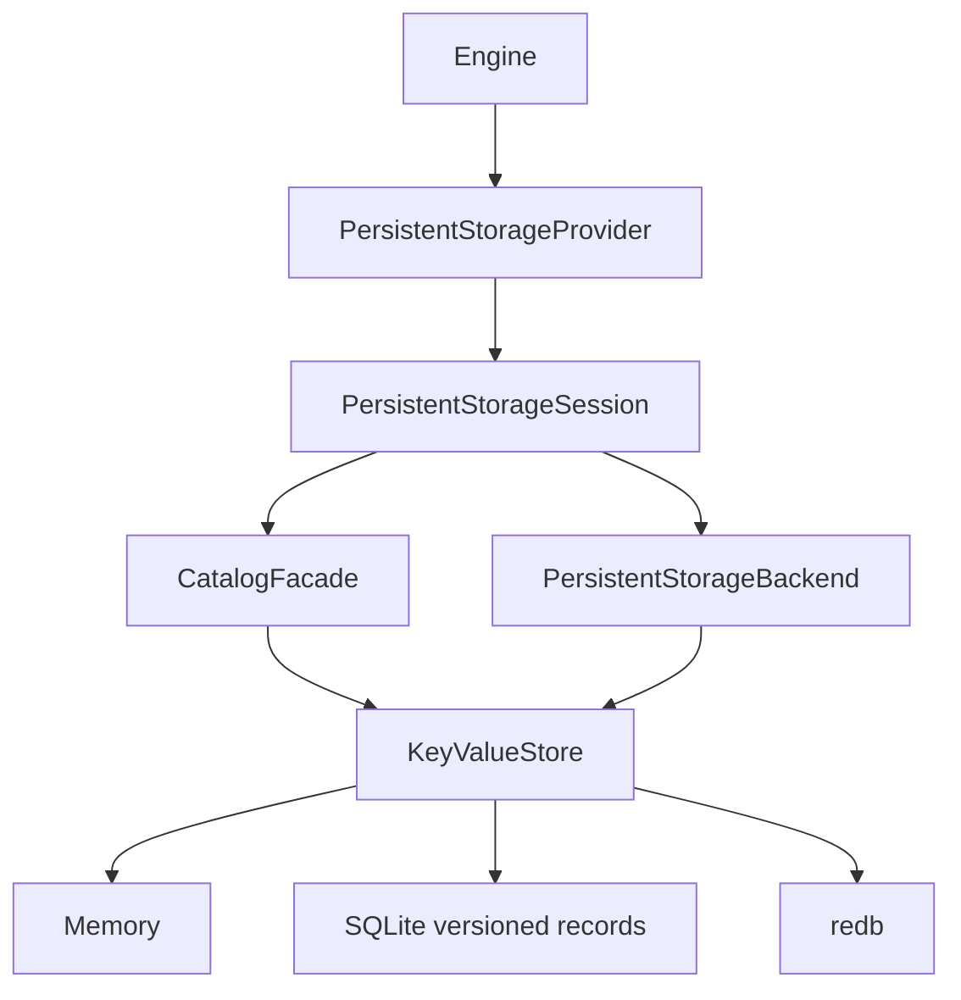

# Key/Value Storage Backends

This document defines the implemented Key/Value storage boundary, session ownership contract, redb behavior, and remaining compatibility limits. SQLite remains the default engine format, while applications can compose `uqa-engine` with `uqa-storage-redb` or another provider without changing query execution.

The [concurrent storage transaction design](concurrent-storage-transactions.md) and [implementation plan](../plans/0008-concurrent-storage-transactions.md) track shared MVCC for native SQLite, SQLite Key/Value and redb. The development SQLite Key/Value and redb providers use common logical sessions; native relational SQLite and complete concurrent SQL transaction integration remain in progress.

## Architecture



`PersistentStorageProvider` owns a durable database and creates independent `PersistentStorageSession` values. Each session contains a `CatalogFacade` and `PersistentStorageBackend` bound to the same transaction context, which prevents catalog mutations and document/index mutations from committing through different physical sessions. `Engine::from_persistent_provider` retains the provider so `Engine::new_session` works for every backend; `Engine::from_persistent_backends` remains available for already-bound handles and delegates independent session creation to the backend's `open_session` implementation.

Common logical stores report one `StorageSessionAffinity`, which both Key/Value facades forward. Native SQLite derives the same contract from its managed session. Engine rejects mismatched reported contexts before restoration or sibling attachment. An independently opened store over the same file is a different context; sharing a database identity is not enough to make catalog/data writes atomic. The [Rust upgrade notes](../manual/reference/10-upgrading.md#unreleased-rust-session-affinity) describe wrapper forwarding and legacy custom providers.

## Physical store contract

`KeyValueStore` provides byte-exact point reads and writes, lexicographically ordered prefix scans, bounded key and key/value cursors, atomic batches, prefix deletion, read/write and read-first transaction boundaries, savepoints, and transaction-state observation. `KeyValueStorageBackend` and `KeyValueCatalog` implement UQA documents, text postings, B-tree postings, brute-force vectors, IVF centroid assignments, HNSW graph generations, graph data, and durable registries once above this byte-key boundary.

`with_read_view` supplies a `KeyValueRead` for successive point and prefix reads against one fixed view. `with_mutation` supplies that reader and a staging-only batch, evaluates the callback once, and uses the original view for write preconditions. Staging does not advance the reader. Errors, cancellation and unwinds discard the operation; an unsuccessful commit retains its evaluated attempt. Callbacks must use the supplied reader and must not reenter their own session or control its transaction. `KeyValueRead::revision` supplies an opaque identity covering the requested prefixes, including canonical data and deletions. Independent views and undo branches must not reuse an identity for different visible data; third-party implementations can retain and clone `KeyValueReadRevision::fresh()` tokens and rotate them after writes or undo. Built-in record stores combine their database, committed boundary and relevant private identities. Exact vectors require compound reads; IVF, HNSW and occurrence indexes additionally require evaluated mutations; default trait methods explicitly reject them. Occurrence queries use the same reader for format checks, forward/reverse postings, source metadata and field counters, including bulk reads. Its controlled point/paged-prefix methods and key-only existence probe retain this boundary while charging provider buffers to the supplied query allowance. `KeyValueRead::retain` preserves the selected prefixes after the callback returns; common versioned sessions retain committed/private owners without loading their values, while the default implementation copies selected bytes under the reader allowance.

Every physical implementation must provide independent transaction state per session even when sessions share one database. `in_transaction` and `transaction_has_written` are correctness hooks used by the engine to preserve pinned snapshots and reject unclassified writes in read-only statements. `change_version` is an optional committed generation used to notice writes made by separately opened engines or processes; implementations that return `None` still receive in-process epoch synchronization for sessions derived from the same engine.

Third-party implementations should run `uqa_storage::key_value::conformance::verify_store` on a fresh disposable store and `verify_session_isolation` on two stores sharing one physical database. These checks cover byte ordering, cursors, atomic batches, outer commit and rollback, SAVEPOINT after prior writes, read-first write observation, and MVCC visibility. Compound providers additionally run `verify_compound_mutations`, `verify_compound_concurrency`, `verify_hnsw_undo`, `verify_hnsw_concurrency`, the corresponding `verify_ivf_undo`/`verify_ivf_concurrency` functions, `verify_vector_snapshots`, `verify_exact_snapshot_concurrency`, `verify_occurrence_snapshots`, `verify_occurrence_concurrency`, `verify_ivf_document_merges` and `verify_ivf_merge_conflicts`. After closing all handles, run `verify_hnsw_reopen`, `verify_ivf_reopen`, `verify_ivf_merge_reopen` and `verify_occurrence_reopen` for their respective fixtures. These schedules verify discarded error/unwind/cancelled batches, fixed reads during another commit, original write preconditions without callback replay, IVF/HNSW rollback branches, independent fields, persisted physical-state restoration, retained tensor snapshots and read-only snapshot enforcement; the IVF merge schedules additionally compare complete generations with serial execution across training, ordered replacements and savepoint branches. Native IVF, HNSW merging and complete concurrent Engine SQL remain separate requirements.

## Implementations

| Implementation | Crate | Durable | Session model | Notes |
| --- | --- | --- | --- | --- |
| Relational SQLite | `uqa-storage-sqlite` | yes | one `ManagedConnection` session per engine session | Default engine backend; supports persisted B-tree, IVF, and HNSW indexes plus SQLCipher and compressed-container variants |
| `SQLiteKeyValueStore` | `uqa-storage-sqlite` | yes | common logical session bound to managed connection clones | Stores versioned records with short physical transactions; migrates the legacy `_key_value` table atomically |
| `RedbKeyValueStore` | `uqa-storage-redb` | yes | common logical session over one shared redb file owner | Private changes, pinned record snapshots and conditional commits; physical writes remain serialized, and Engine SQL still retains its writer gate |
| `MemoryKeyValueStore` | `uqa-storage` | no | one in-process test state | Reference implementation for logical tests, not a durable engine provider |

## SQLite Key/Value transaction mapping

`SQLiteKeyValueStore` binds its `ManagedConnection` and all existing connection clones to one common logical session. `new_session` creates an independent logical session over the same pool. The paired catalog/backend share that store, and transaction control through a connection clone operates on the same private changes. Binding rejects an active native transaction before changing the format. An in-memory pool with one physical connection can host independent logical sessions because snapshots and private changes retain no physical transaction.

The common session implements pinned reads, ordered private changes, savepoints and retained commit attempts as described for redb below. SQLite key-only reads inspect record metadata without materializing values, including private tombstones. Independent direct Key/Value writers can commit across separately opened providers and native processes while another session retains private writes; plain, SQLCipher, compressed and encrypted compressed files use the same logical contract. Physical allocation, commit, abort and migration use short guarded transactions with `synchronous=FULL`.

Initial open copies legacy `_key_value` bytes into versioned histories in one bounded physical transaction and replaces the old writable table with a guard view. A separate catalog guard rejects the released native catalog initializer. Durable metadata identifies the Key/Value mapping, and reopen rejects missing or changed guards instead of recreating them. Resource exhaustion or a record collision rolls back the conversion, preserving the old format. [`verify-sqlite-legacy-writer.py`](../../scripts/verify-sqlite-legacy-writer.py) verifies migration, old-writer rejection and reopen with the actual crates.io 0.3.6 provider in all four native file modes. Native relational databases require their own mapping and are rejected by this conversion.

`SQLiteKeyValueStorage::open_with_options` and `from_connection_with_options` accept `VersionedSessionOptions { retained_bytes }`, with the same default 64 MiB allowance and no spill as redb. Sibling sessions inherit the configured limit. `ManagedConnection::with` and `with_mut` reject a bound logical session; `with_physical` provides explicit diagnostics or physical maintenance outside that session's transaction and does not expose private records. Record-table write guards remain active. See the [unreleased upgrade contract](../manual/reference/10-upgrading.md#unreleased-sqlite-keyvalue-record-format) for the Rust API and one-way file-format boundary. Full concurrent Engine SQL, shared-index merges and provider history reclamation remain unfinished.

## redb transaction mapping

`RedbKeyValueStore` reexports `uqa_storage::mvcc::VersionedKeyValueStore`. Each session retains a committed sequence and private evaluated records. Reads merge that fixed boundary with the session's changes; provider read transactions close at the end of each operation. Independent Key/Value writers can commit while another session retains uncommitted changes. Native write transactions exist only for allocation, conditional publication, abort and format maintenance. The commit validates every original revision, including tombstones, and atomically publishes record versions, the change sequence and its receipt. Conflicting attempts publish no partial records. Engine SQL retains its transaction-wide writer gate until shared-index, SQL-lock and publication integration is complete.

Common storage owns savepoints, ordered batches and undo. Prefix deletion freezes the currently visible keys before staging tombstones; it is not replayed over a newer database at commit. Failed batches restore only their own changes. Commit seals one immutable fingerprinted batch; a failed commit retains the attempt, including an autocommit attempt, so `commit_transaction` can resolve the same receipt without reevaluating operations. Mutations are rejected while sealed. `rollback_transaction` cannot report success if persistence returns a committed receipt; it retains that attempt for resolution.

`RedbStorage::open_with_options` accepts `VersionedSessionOptions { retained_bytes }`. The default per-session retention allowance is 64 MiB, separate from SQL statement allowances; private values, undo history, savepoints, batch buffers and retained view metadata share it. Exhaustion returns a typed memory error and rollback remains available. This implementation does not spill and retains intermediate private history until its owners are dropped. Provider history and receipt reclamation remain implementation work. Controlled visitors borrow encoded values without consuming the caller's decode allowance and still poll cancellation.

The development file format atomically migrates `uqa_key_value` records into head/history tables, preserves the committed change counter and replaces the legacy table name with an incompatible `Table<u8, u8>` guard. Reopen validates the format and guard. The actual crates.io 0.3.6 initializer rejects that table before writing, as exercised by [`verify-redb-legacy-writer.py`](../../scripts/verify-redb-legacy-writer.py). This upgrade is one-way; retain an old-file backup if an older binary must remain usable. The [upgrade guide](../manual/reference/10-upgrading.md#unreleased-redb-record-format) describes this boundary.

The engine stores savepoints in creation order rather than a name set. Duplicate names shadow older savepoints, `ROLLBACK TO` retains the selected savepoint while invalidating later ones, and `RELEASE` removes the selected savepoint and all descendants, matching the physical backends and avoiding stale engine-side snapshots.

## Logical key layout

Logical keys begin with a one-byte namespace tag, encode user-controlled string segments with explicit lengths, and encode numeric identifiers in big-endian order. This makes prefix boundaries unambiguous and preserves document ordering under bytewise iteration. Values use versioned JSON or compact binary encodings owned by the logical catalog, document, posting, and vector adapters rather than by redb or SQLite.

Representative namespaces include metadata, schemas, relations, tables, views, analyzers, foreign definitions, catalog indexes, graph vertices and edges, graph membership, path indexes, documents, clustered posting scores, clustered posting positions, per-document term dictionaries, B-tree definitions and entries, document lengths, field statistics, canonical vectors, IVF metadata/centroids/assignments, HNSW metadata/nodes, models, scoring parameters, and sequences. The exact tag and codec definitions in `uqa-storage::key_value` are the storage-format source of truth.

## Clustered full-text postings

The shared logical format partitions each term by `cluster_id = doc_id / 65,536`, matching the bounded clustered-search layout used by Cognica Server. A score value contains a small directory followed by independent delta-doc, term-frequency, and document-length streams in 128-entry blocks; a parallel occurrence value contains complete graph edges, multiplicity, and original UTF-8/UTF-16 source spans under canonical binary term keys. WAND, Block-Max WAND, exhaustive ranking, and block-max maintenance read score values through the same backend-neutral cursor, which reuses its block decode buffer, while statistics use stored counts or score headers. Ranking therefore neither materializes `PostingList` payloads nor fetches a document-length row for every candidate, while exact occurrence methods return the complete graph and `get_posting_list` exposes unique start positions for compatibility.

| Logical data | Key shape | Purpose |
| --- | --- | --- |
| Score cluster | `(table, field, term, cluster_id)` | Ordered document offsets, term frequencies, document lengths, and lazy 128-entry block directory |
| Position cluster | `(table, field, term, cluster_id)` | Complete occurrence payload loaded only by consumers that need graph edges or positions |
| Document terms | `(table, doc_id, field)` | Sorted term dictionary used to replace or remove one document without scanning the vocabulary |

The occurrence namespace also stores field revision/statistics, document lengths, and original stream-end metadata. Point and batch writes publish these with score/occurrence clusters and binary reverse terms atomically. Table and column lifecycle operations move or remove the complete namespace; field revision guards survive reopen, including fields that emitted no tokens. See the [occurrence format](occurrence-posting-format.md#keyvalue-publication-and-migration) for exact key and metadata layouts.

On initial Engine open, the oldest per-document format is validated and converted in bounded 1,024-row pages inside the owning catalog transaction. After every analyzer descriptor and binding is restored, any remaining old positional format is rebuilt from original source into the occurrence namespace, retiring the old keys atomically. Descriptor, analysis, or storage failure rolls back the earlier conversion too. Successful reopens do not rebuild again. A standalone `KeyValueInvertedIndex` reports `source_rebuild_required` and rejects old-format reads or point writes until supplied an explicit source rebuild. This applies equally to redb and `SQLiteKeyValueStore` because migration lives above `KeyValueStore`.

## Capability boundary

The Key/Value logical backend provides document storage, full-text postings, graph and catalog persistence, durable B-tree postings, exact brute-force vector search, and distinct physical IVF and HNSW indexes. B-tree definitions and `(table, field, DocId) -> Value` entries are maintained incrementally. IVF persists versioned parameters, state, centroids, and per-vector assignments; HNSW persists a versioned graph header and dirty-node deltas. Canonical vectors and physical metadata change in one `KeyValueBatch`, and restore rejects missing metadata, parameter or dimension mismatches, malformed state, canonical-vector drift, and stale revisions rather than downgrading an index to brute force.

The same physical-index logic is inherited by redb, `SQLiteKeyValueStore`, and conforming third-party stores because it lives above `KeyValueStore`. Common IVF and HNSW handles refresh their shared view-based cache after rollback, savepoint branching and independent commits. Exact snapshots retain selected canonical tensors with their read allowance instead of cloning the live store handle. All three retained snapshot kinds reject mutation after their live handles close. Canonical reads, candidate evaluation and atomic staging share the original boundary. Engine rollback and savepoint recovery additionally rebind session-local index generations, while `change_version` refreshes sibling sessions after committed writes. The relational SQLite backend retains its native relational index tables, but B-tree, IVF, and HNSW capability is no longer a reason to require it.

redb is not an encrypted storage format and does not provide SQLCipher-equivalent confidentiality. Applications that require encrypted-at-rest storage should continue to use `Engine::open_encrypted` until a separately reviewed encryption layer exists. redb compaction is an explicit maintenance operation rather than an automatic action on every commit, and the current provider does not run compaction implicitly.

The redb crate is suitable for native Rust targets supported by redb. This implementation does not claim durable browser IndexedDB integration; the existing Emscripten SQLite path remains the supported browser persistence route.

## Opening an engine

```rust
use std::sync::Arc;
use uqa_engine::Engine;
use uqa_storage::PersistentStorageProvider;
use uqa_storage_redb::RedbStorage;

let provider: Arc<dyn PersistentStorageProvider> =
    Arc::new(RedbStorage::open("catalog.redb")?);
let engine = Engine::from_persistent_provider(provider)?;
let second_session = engine.new_session()?;
# Ok::<(), Box<dyn std::error::Error>>(())
```

Opening a redb file does not import an existing relational SQLite or `_key_value` SQLite database. Those are different physical formats, and automatic cross-format migration is not implemented; data transfer must use an explicit logical export/import path when one becomes available.

## Adding another backend

Implement `KeyValueStore` with ordered prefix iteration, atomic batches, real read/write transactions, correct savepoint behavior, and isolated session state. Implement `PersistentStorageProvider::open_session` by constructing a new store session, wrapping the same store in both `KeyValueCatalog` and `KeyValueStorageBackend`, and returning them as one `PersistentStorageSession`. Preserve backend errors with `StorageBackendError::backend`, expose a stable committed `change_version` when the physical database supports it, implement the compound read/mutation and opaque revision contracts above, run their reusable conformance checks, and add an engine integration test covering reopen, full-text search, B-tree/IVF/HNSW mutation, session visibility, savepoints, and catalog/data rollback.
