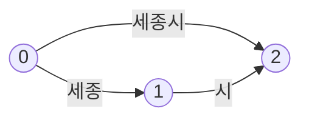

# Lucene-compatible Nori analyzer

Status: active design, prepared on 2026-09-12 against UQA commit `bbeb1026cba9001cc5f084d24ac68ec197bd1925`. Generic source mapping and structured token APIs are now implemented and described in the [Rust analyzer reference](../manual/reference/06-text-analyzers.md#structured-tokens). The standalone native Nori tokenizer, user-rule compiler, default analyzer, POS/readings/simple-lowercase filters, and separate normalization are also implemented and described in the [Korean tokenization reference](../manual/reference/06-text-analyzers.md#standalone-korean-tokenization). Korean number composition, generic analyzer integration, new SQL functions, and graph storage contracts below remain proposals; the [SQL manual](../manual/sql/05-analyzers.md) continues to describe available behavior.

Development follows the active [Nori implementation plan](../plans/0006-nori-analyzer.md), which records the current implementation boundary, dependencies, and verification evidence.

Implement Nori as a native Rust analysis subsystem in `uqa-analysis`, with a versioned dictionary bundle and a token representation that preserves positions, offsets, and Korean morphology. Use Lucene 10.5.1 as the executable reference. Run every JVM tool through a digest-pinned Docker image, including dictionary export and fixture generation. Production indexing and querying use Rust on native and WASM targets without a JVM.

## Compatibility target and evidence

The target is Apache Lucene's `KoreanAnalyzer` and its constituent Nori components at [`releases/lucene/10.5.1`, commit `64ce863a2bea79c69c19c4d56268c26710ff0ff9`](https://github.com/apache/lucene/tree/64ce863a2bea79c69c19c4d56268c26710ff0ff9/lucene/analysis/nori). Freeze the dictionary resources and Java character behavior with that implementation. An unspecified MeCab model or a newer dictionary with the same language name is not an interchangeable reference.

Compatibility covers the ordered term stream, token offsets, position increments and lengths, POS types and tags, readings, morpheme lists, end-of-stream attributes, user dictionary interpretation, and accepted tokenizer options for valid UTF-8 input. Compare tokenizer output and each filter independently as well as the complete analyzer. UQA keeps its own SQL interfaces, storage format, and ranking models; those require integration tests rather than a claim of Lucene binary-index or score equality.

The design includes the three decompound modes, system and unknown dictionaries, user dictionaries, POS filtering, reading conversion, lowercase normalization, and the optional Korean number filter. It also includes the indexing, query, persistence, and binding changes needed to consume their output correctly. `standard_cjk` retains its documented character n-gram behavior.

The checked-in [reference harness](../../tests/parity/nori/README.md) executed 31 cases using the real Lucene classes in Docker. Its [manifest](../../tests/parity/nori/manifest.json) pins all inputs, and its [expected output](../../tests/parity/nori/expected.jsonl) contains complete token attributes. The expanded reference additionally compares 38 user-dictionary cases, 238 standalone tokenizer cases, and 423 filter/analyzer/normalization cases to native Rust, including complete token/end-state hashes for long streams. The default native analyzer and its constituent filters match the recorded cases, and simple lowercase matches a complete Unicode traversal. Optional Korean number composition, storage behavior, actual WASM execution, and performance remain unverified.

| Reference input | Pinned value |
| --- | --- |
| Lucene artifacts | `lucene-core`, `lucene-analysis-common`, and `lucene-analysis-nori`, all `10.5.1`; SHA-256 values in the manifest |
| JVM | Eclipse Adoptium Temurin `21.0.10+7-LTS`, executed on Docker `linux/arm64` and `linux/amd64` |
| Docker image index | `eclipse-temurin@sha256:3b0a98dfbdf1067c20a7854cec159551777d2ee1381bc76cd4bd0719f543b148` |
| Dictionary source | `mecab-ko-dic-2.1.1-20180720`, archive SHA-256 `fd62d3d6d8fa85145528065fabad4d7cb20f6b2201e71be4081a4e9701a5b330` |
| Dictionary normalization during Lucene generation | `normalizeEntries = false` |
| Reference command | `python3 tests/parity/nori/run_reference.py` |

The original 31 cases, expanded user/tokenizer/filter/analyzer corpora, and complete neutral model export have been reproduced on both Docker platforms with identical output. Native differential checks are recorded separately in the implementation plan; they do not establish number-filter or end-to-end retrieval parity, actual WASM execution, or platform performance. Changing the Docker digest, JVM, Lucene jars, dictionary, or generated Unicode tables requires an explicit fixture diff and a new compatibility fingerprint.

## Current UQA constraints

The baseline inspection identified the following changes needed at the subsystem boundaries. The first two are implemented by the generic analysis foundation; their downstream consumers remain active work in the implementation plan. Some manual ownership tables predate the crate extraction; use the linked source locations for implementation placement.

| Existing owner | Observed behavior | Required change |
| --- | --- | --- |
| [`Analyzer`](../../crates/uqa-analysis/src/analyzer.rs), [`Tokenizer`](../../crates/uqa-analysis/src/tokenizer.rs), and [`TokenFilter`](../../crates/uqa-analysis/src/token_filter.rs) | Pass `Vec<String>` between stages | Add a structured token stream and migrate stages without changing the existing term-only API's output order |
| [`CharFilter`](../../crates/uqa-analysis/src/char_filter.rs) | Produces a replacement string without an offset correction map | Carry source mappings through every edit |
| [Memory index](../../crates/uqa-storage/src/inverted_index.rs), [Key/Value index](../../crates/uqa-storage/src/key_value/inverted_index.rs), and [SQLite index](../../crates/uqa-storage-sqlite/src/inverted_index/maintenance.rs) | Enumerate strings as consecutive positions and use `tokens.len()` as field length | Consume explicit positions, occurrences, and a declared length policy |
| [`Payload`](../../crates/uqa-core/src/types/posting.rs) | Stores sorted, unique `Vec<u32>` positions | Add an occurrence contract that retains graph edges and multiplicity |
| [`TermOperator`](../../crates/uqa-operators/src/primitive.rs) | Unions the postings of all analyzed terms in one leaf | Preserve this documented term-search behavior and separate positional query execution |
| [FTS query lowering](../../crates/uqa-sql/src/retrieval/calls/fts.rs) | Splits quoted phrases on whitespace and lowers multiple terms to an intersection | Retain phrase text until field analysis and execute an actual positional graph match |
| [Analyzer catalog](../../crates/uqa-engine/src/analyzers.rs) | Persists named JSON and one assignment record per field | Persist immutable resolved revisions and independent index/search bindings |
| [Highlighter](../../crates/uqa-analysis/src/highlight.rs) | Scans regex words and re-analyzes each word | Analyze the complete source and highlight its corrected source spans |

Adding a tokenizer that returns Korean strings would lose the information needed by compound alternatives and inflected forms. The structured stream and its consumers are prerequisites for advertising Nori support.

## Observable Nori behavior

### Analyzer composition

The default pipeline is `KoreanTokenizer → KoreanPartOfSpeechStopFilter → KoreanReadingFormFilter → LowerCaseFilter`. The tokenizer defaults are `DISCARD`, `outputUnknownUnigrams = false`, `discardPunctuation = true`, and no user dictionary. `KoreanAnalyzer.normalize` applies lowercase only; it does not run morphological analysis or replace Hanja readings. These are separate entry points. See the pinned [analyzer](https://github.com/apache/lucene/blob/64ce863a2bea79c69c19c4d56268c26710ff0ff9/lucene/analysis/nori/src/java/org/apache/lucene/analysis/ko/KoreanAnalyzer.java) and [tokenizer factory](https://github.com/apache/lucene/blob/64ce863a2bea79c69c19c4d56268c26710ff0ff9/lucene/analysis/nori/src/java/org/apache/lucene/analysis/ko/KoreanTokenizerFactory.java).

| UQA component proposed below | Required behavior |
| --- | --- |
| `nori_tokenizer` | Rolling Viterbi morphology, decompounding, punctuation option, and optional unknown unigrams |
| `nori_part_of_speech` | Remove tokens whose left POS belongs to the configured set; preserve accumulated position gaps |
| `nori_readingform` | Replace term text with its non-null dictionary reading; retain original source offsets |
| `unicode_simple_lowercase` | Match the pinned JVM's per-code-point lowercase mapping |
| `nori_number` | Optional number composition; excluded from the default `nori` analyzer |

The default POS stop set is `EP, EF, EC, ETN, ETM, IC, JKS, JKC, JKG, JKO, JKB, JKV, JKQ, JX, JC, MAG, MAJ, MM, SP, SSC, SSO, SC, SE, XPN, XSA, XSN, XSV, UNA, NA, VSV`. A custom set replaces this set; an empty set removes nothing. The predicate uses the left POS, including on undecomposed inflections. Null POS passes through. See the [stop filter](https://github.com/apache/lucene/blob/64ce863a2bea79c69c19c4d56268c26710ff0ff9/lucene/analysis/nori/src/java/org/apache/lucene/analysis/ko/KoreanPartOfSpeechStopFilter.java).

### Compound and inflection graphs

`NONE` retains a dictionary token. `DISCARD` emits its decomposition when available. `MIXED` emits the original token and the decomposition as alternative paths: the original spans the decomposition's position count, and the first component has position increment zero. This applies to `COMPOUND`, `INFLECT`, and `PREANALYSIS`; a missing decomposition is not an instruction to invent one. See [token emission](https://github.com/apache/lucene/blob/64ce863a2bea79c69c19c4d56268c26710ff0ff9/lucene/analysis/nori/src/java/org/apache/lucene/analysis/ko/Viterbi.java).

The `user_compound` fixture analyzes `세종시` with user entry `세종시 세종 시` and mode `mixed`:

| Term | Absolute position | Increment | Length in positions | UTF-16 source span | UTF-8 source span |
| --- | --- | --- | --- | --- | --- |
| `세종시` | 0 | 1 | 2 | `[0, 3)` | `[0, 9)` |
| `세종` | 0 | 0 | 1 | `[0, 2)` | `[0, 6)` |
| `시` | 1 | 1 | 1 | `[2, 3)` | `[6, 9)` |



Compound components usually cover consecutive substrings. Inflection and preanalysis components can have rewritten text and share the whole original span. In the executed `inflection_DISCARD` fixture, `감싸여` yields `감싸이` and `어`, both with UTF-16 span `[0, 3)`. Searching rewritten text in the input cannot reconstruct these offsets.

The default analyzer's output for `가락지나물은 한국, 중국, 일본` is `가락지, 나물, 한국, 중국, 일본`, with position increments `1, 1, 2, 1, 1`. Removing `은` preserves its position gap. For `나물은`, the stream emits `나물` and retains an end-of-stream position increment of one. Both observations are recorded by the harness, including the final source offset.

### Unicode and punctuation

The expanded tokenizer oracle proves that valid UTF-8 input can produce non-scalar UTF-16 terms: the accepted user rule `🙂a 가 나` splits a surrogate pair, and unknown grouping limits can split pairs as well. The standalone runtime therefore retains raw UTF-16 term and morpheme units. The common token representation and persisted term keys must carry these units losslessly; diagnostics must expose them explicitly when no Unicode string exists. Exact UTF-16 offsets can land inside a pair, so highlighting needs UTF-8 scalar-covering source spans alongside the exact reference coordinates. Rejecting such accepted rules, replacing their units, or silently rounding away the UTF-16 coordinates does not satisfy the target. This bridge and storage contract remains an integration requirement.

Lucene performs morphology over UTF-16 input units and consults Java character properties at specific points. Generate and version the character-class, script, digit, punctuation, and simple-case tables needed by those operations. Preserve the distinction between code-unit and code-point calls; replacing every call with Rust `char` classification can change unknown-word grouping. The pinned [Korean character definition](https://github.com/apache/lucene/blob/64ce863a2bea79c69c19c4d56268c26710ff0ff9/lucene/analysis/nori/src/java/org/apache/lucene/analysis/ko/dict/CharacterDefinition.java) and [Java character utilities](https://github.com/apache/lucene/blob/64ce863a2bea79c69c19c4d56268c26710ff0ff9/lucene/core/src/java/org/apache/lucene/analysis/CharacterUtils.java) are the reference.

Existing UQA `lowercase` uses Rust's full lowercase conversion. The Docker fixture maps `İ ΟΣ UQA` to `i οσ uqa` with Lucene's simple lowercase filter. Preserve existing `lowercase` behavior and add the explicitly named `unicode_simple_lowercase` stage for Nori; do not silently change the vocabulary of existing English indexes. Its Unicode profile is part of the compiled analyzer fingerprint.

Do not add NFC, NFKC, ASCII folding, stemming, or syllable normalization to the default Nori pipeline. The `decomposed_hangul` fixture retains decomposed Jamo in its output. Such transformations remain explicitly configured character or token filters.

Punctuation removal is tokenizer behavior and is distinct from POS stop filtering. With `discard_punctuation = false`, the reference emits spaces between terms as tokens too. Unknown unigram emission has its own emission branch: the executed supplementary-character fixture emits an emoji even with punctuation discarding enabled. Preserve the branch behavior instead of applying a new blanket punctuation pass after tokenization.

## Ownership and public API

Keep the morphology implementation under `crates/uqa-analysis/src/nori/`, divided by enduring responsibility: configuration, Unicode input, lattice, dictionary access, user dictionary compilation, token emission, and filters. Generic tokens, character-offset mapping, compilation, and stream contracts remain outside the Korean-specific module. `uqa-core` owns only the language-independent positional occurrence values shared by storage and operators.

| Owner | Responsibility |
| --- | --- |
| `uqa-analysis` | Generic rich analysis, Nori algorithms, validation, dictionary decoding, offset maps, immutable compiled analyzers |
| `uqa-nori-data` data crate | Generated default bundle bytes and provenance; no SQL, storage, registry, or runtime morphology logic |
| `uqa-storage` | Provider-independent occurrence and analyzer-binding contracts, Memory and Key/Value implementations, common posting codecs |
| `uqa-storage-sqlite` | SQLite persistence and migration of the common contracts |
| `uqa-sql` | Configuration-call argument rules, typed phrase expressions, and diagnostic result schemas |
| `uqa-execution` and `uqa-operators` | Analyzer lifecycle scheduling, phrase execution, retrieval consumption, and diagnostics |
| `uqa-engine` | Session/catalog state, resource injection, transaction guards, epochs, and composition of native owners |
| Language bindings | Pass the same JSON and typed results through existing engine entry points |

The data crate separates a sizeable optional asset from ordinary `uqa-analysis` users and gives package-size checks a clear owner. Follow workspace versioning, dependency-direction, publication-order, and legal-file rules when introducing it. Its bundle has its own semantic identity independent of the Cargo package version.

Introduce these additive API concepts; the signatures are design pseudocode:

```text
Analyzer                         // serializable pipeline configuration
Analyzer::compile(resources) -> Result<Arc<CompiledAnalyzer>>
CompiledAnalyzer::analyze_tokens(text) -> Result<AnalyzedText>
CompiledAnalyzer::normalize(text) -> Result<String>
Analyzer::analyze(text) -> Result<Vec<String>>
```

`Analyzer::analyze` remains the ordered term projection for callers that need strings. The rich API is canonical for indexing, positional queries, and highlighting. Maintain existing term-only results while migrating every stage to explicit metadata. Keep compilation state outside the public serializable `Analyzer` struct so configuration serialization and existing construction remain understandable.

Compile dictionaries, user entries, regular expressions, and fixed filter state once per resolved revision. An `Arc<CompiledAnalyzer>` is immutable and shareable; lattice buffers and token queues belong to an individual analysis call or an exclusively borrowed reusable worker. Cache dictionary bundles by content hash, not analyzer name. Cloning an analyzer must not clone its dictionary, and a session must not mutate another session's worker state.

### Structured tokens

| Value | Contract |
| --- | --- |
| `term` | Owned or arena-backed text that may differ from the source |
| `position_increment` | Nonnegative increment from the previous emitted token; first emitted position is computed from an initial position of `-1` |
| `position_length` | Positive edge length; one for ordinary tokens |
| Source offsets | Half-open UTF-16 coordinates for reference parity and corrected UTF-8 coordinates for Rust source access |
| Korean morphology | Optional POS type, left/right POS, reading, and ordered morpheme surface/POS pairs |
| Token flags | Keyword state needed by number normalization and other attribute-preserving filters |
| Stream end state | Final source offsets and final position increment, including trailing removed tokens |

Keep dictionary provenance (`known`, `unknown`, or `user`) available for internal diagnostics without conflating it with `MORPHEME`, `COMPOUND`, `INFLECT`, or `PREANALYSIS`. Public POS spellings follow the complete pinned [`POS`](https://github.com/apache/lucene/blob/64ce863a2bea79c69c19c4d56268c26710ff0ff9/lucene/analysis/nori/src/java/org/apache/lucene/analysis/ko/POS.java) vocabulary. Missing reading or morphology is distinct from an empty string or list.

Position and offset arithmetic is checked before publishing results or postings. Zero-length terms, multiple tokens at the same position, shared offsets, and a token whose rewritten term differs from its source span must be handled according to the reference rather than removed by generic cleanup. A malformed configuration, corrupt bundle, allocation limit, or unrepresentable source span remains an error; it cannot become an empty successful analysis.

### Character filters and offsets

Each character filter returns transformed text plus ordered edit segments mapping output ranges back to its input. Unchanged regions map exactly; replacement text maps to the full replaced source range, and a zero-width insertion anchors at its input boundary. This covering-span rule also handles regex replacements that reorder captures without pretending that their output has a one-to-one source mapping. Compose the maps in filter order. `html_strip` must map removed tags and decoded entities to their original ranges. Preserve existing text transformation semantics while adding maps.

The tokenizer operates in filtered-input coordinates. Convert its coordinates through the composed maps exactly once to produce original-source offsets. Maintain an explicit UTF-16 boundary to UTF-8 byte-boundary map; a Hangul syllable usually consumes one UTF-16 unit and three UTF-8 bytes, while a supplementary character consumes two UTF-16 units and four bytes. Token filters retain source spans when rewriting text, and composed tokens cover their contributing spans.

The Rust input domain is valid UTF-8. Preserve exact UTF-16 coordinates in diagnostics even for a reference corner case that cannot be projected to a Unicode scalar boundary. A span consumer must return a typed projection error instead of slicing through UTF-8 or silently moving the boundary. Java strings containing isolated surrogates have no direct `&str` input equivalent and must be rejected at a binding's string-conversion boundary.

## Morphological analysis algorithm

Port the pinned rolling Viterbi implementation, including its bounded backtrace policy, instead of substituting a generic longest-match segmenter. The recurrence for a candidate node `n` is:

```text
cost(n) = word_cost(n)
        + min over predecessors p [cost(p)
          + connection_cost(right_id(p), left_id(n))
          + space_penalty(n)]
```

Retain both the predecessor boundary and the word's start after any consumed space. Initialize the BOS state with the reference context IDs and add the EOS transition before choosing the final path. Match integer arithmetic, candidate insertion order, and strict-less-than tie selection; avoid hash iteration in any path that can break a tie.

The shared [morphology Viterbi implementation](https://github.com/apache/lucene/blob/64ce863a2bea79c69c19c4d56268c26710ff0ff9/lucene/analysis/common/src/java/org/apache/lucene/analysis/morph/Viterbi.java) uses a 1,024-unit unknown-word limit and a 1,024-unit backtrace gap. A unique frontier permits early commitment; reaching the gap forces a least-cost partial path and prunes competitors. Consequently, the reference is a bounded rolling algorithm, not a guarantee of the global optimum for arbitrarily long input. Reproduce its pruning, cost rebasing, and resumption boundaries.

Candidate construction must preserve these rules:

1. Traverse the user lexicon first. Follow Nori's longest-user-entry and prior covered-end rules. A user match suppresses system lookup at that position; it does not justify replacing the entire lattice with greedy segmentation.
2. Otherwise traverse the system lexicon, emitting every matched surface and every corresponding word entry in the reference order.
3. Generate unknown candidates when no entry matched or the character class requests invocation. Group using the reference class flags, script transitions, digit boundaries, punctuation classification, and combining-mark behavior.
4. Apply Nori's POS-dependent space penalty and exact space-separator handling. Do not pre-split on whitespace, collapse repeated spaces, or apply one penalty per byte.
5. Backtrace the selected dictionary nodes, then perform decompounding and optional unknown-unigram emission. Unknown unigrams preserve surrogate pairs in the branch that handles them.

The Korean [Viterbi specialization](https://github.com/apache/lucene/blob/64ce863a2bea79c69c19c4d56268c26710ff0ff9/lucene/analysis/nori/src/java/org/apache/lucene/analysis/ko/Viterbi.java) and the [user morphology model](https://github.com/apache/lucene/blob/64ce863a2bea79c69c19c4d56268c26710ff0ff9/lucene/analysis/nori/src/java/org/apache/lucene/analysis/ko/dict/UserMorphData.java) supply the Korean policies and costs. Keep these values generated or explicitly versioned with the reference. A change advertised as an optimization must preserve the full fixture output, including tie cases.

Use compact arrays for lattice node costs, context IDs, backpointers, word IDs, and origins. A candidate references shared dictionary metadata; allocate rewritten term strings only when needed during emission. A bounded backtrace gap does not make total analysis memory constant: input/offset maps, dictionary lookahead, active candidates, output tokens, and staged posting updates all consume memory. Apply the engine's cancellation and resource policy at bounded work intervals, and fail the entire statement if limits are exceeded.

## Dictionary construction and distribution

### Canonical input and exporter

Use the dictionary resources inside the pinned official Nori jar as the initial canonical runtime model. An offline Java exporter, executed only in Docker, enumerates the Lucene lexicon and decodes its public morphology interfaces into an ordered neutral representation. A deterministic Rust packer creates the UQA bundle. This preserves Lucene's compiled interpretation while avoiding a second implementation of Lucene's binary FST codec in the production runtime.

Retain the original MeCab-ko-dic source archive and its checksum as regeneration provenance. Lucene's [generation task](https://github.com/apache/lucene/blob/64ce863a2bea79c69c19c4d56268c26710ff0ff9/gradle/generation/nori.gradle) selects `2.1.1-20180720`, UTF-8, and no entry normalization. Its [dictionary builder](https://github.com/apache/lucene/blob/64ce863a2bea79c69c19c4d56268c26710ff0ff9/lucene/analysis/nori/src/java/org/apache/lucene/analysis/ko/dict/TokenInfoDictionaryBuilder.java) sorts input files and stably orders entries by surface. Preserve each surface's entry order; sorting homographs by a new field can change Viterbi ties.

The exporter must cover the system lexicon, all word IDs and costs, both context IDs, POS and reading metadata, morpheme decompositions, unknown-class mappings and entries, character flags, and the full connection matrix with its orientation. Where the public API does not expose dimensions or class inventories, read the pinned resource header through Lucene's Java `DataInput`/codec utilities and cross-check values through the runtime model; do not depend on reflective access to private JVM fields. Enumerate and compare every exported value against the Lucene model, then compare analysis using that bundle against the oracle. Source CSV regeneration is a separate reproducibility check and must not silently replace the canonical jar model when results differ.

The implemented [neutral exporter](../../tests/parity/nori/MODEL.md) now covers the complete jar model and pinned Java Unicode profile. It checks every enumerated surface against runtime FST lookup, every ordered word mapping, all morphology fields, the full matrix, and character definitions, then reopens its output for exhaustive comparison. Independent arm64 and amd64 Docker runs reproduce the five hashes in its [manifest](../../tests/parity/nori/model_manifest.json). The neutral files total 82,581,342 bytes. The implemented [Rust bundle codec](nori-bundle-format.md) packs this model into 9,829,534 bytes and reconstructs every neutral hash after loading; native tokenizer parity and downstream analysis integration remain pending.

### Bundle format

Use an explicitly versioned, endian-defined format with a header, section directory, lengths, counts, checksums, and a provenance manifest. Reject unsupported versions, invalid ranges, truncated sections, context IDs outside the matrix, invalid POS values, cyclic lexicon structures, and malformed UTF-16 or UTF-8 data before publishing the bundle.

| Section | Representation decision |
| --- | --- |
| Surface lexicon | Immutable minimized acyclic transducer over ordered UTF-16 labels, mapping a surface to an ordered word-ID list |
| Word entries | Fixed-width context IDs and signed costs plus offsets into variable metadata tables |
| Morphology | POS type/tags, optional readings, and ordered decomposition records; preserve absent versus empty values |
| Connection matrix | Explicit dimensions and reference row/column orientation; expand once for constant-time cost lookup |
| Unknown model | Character-class flags, ordered class-to-word-ID lists, and unknown entry metadata |
| Unicode profile | Generated Java classification and simple lowercase tables used by the pinned algorithm |
| Provenance | Lucene commit and resource hashes, exporter/packer versions, Unicode profile hash, and semantic bundle ID |

The lexicon encoding is a UQA format, not a claim of compatibility with Lucene's `.dat` files. Start with a portable byte-slice reader and one immutable decoded model shared through `Arc`. Native memory mapping is an optional measured optimization using the same format and validation; the WASM decoder must produce identical logical data. No ordinary Cargo build, package installation, database open, or text query may download a dictionary.

The measured Nori jar is 7,824,879 bytes; its nine serialized dictionary resources total 25,039,384 uncompressed bytes. Those figures describe the upstream artifact, not Rust bundle size or runtime memory. The UQA packer's compression ratio, connection-matrix expansion, startup cost, and WASM peak memory must be measured before setting package defaults.

### Runtime resources and packaging

Expose a provider-neutral analysis resource resolver accepting immutable bytes by content identity. The default `nori` feature uses the bundled data crate. Native hosts may explicitly register another validated bundle; browser hosts may supply bytes before opening a catalog that requires them. The resolver has no implicit filesystem or network fallback. Custom system models use the same validated bundle format and carry their own identity and compatibility evidence.

Keep Nori optional for direct `uqa-analysis` consumers. Official Rust facade/CLI, Python, Node.js, and browser packages intended to advertise Nori must enable the feature and ship the pinned bundle, with archive-size and memory checks for each artifact. A custom build without Nori must reject the component explicitly; it must not resolve it to `standard_cjk` or advertise it as an available built-in.

Lucene source headers and the inspected dictionary archive's `COPYING` identify Apache-2.0. Retain the applicable [Lucene notices](https://github.com/apache/lucene/blob/64ce863a2bea79c69c19c4d56268c26710ff0ff9/NOTICE.txt), the dictionary's license and attribution, and modification/provenance notices with ported code and generated assets. Extend the repository's package-license checks to the new data crate and each redistributed binding artifact. Unicode tables exported or derived from another data source must include that source's applicable notices as well.

## User dictionary contract

Accept the Lucene line-oriented format as UTF-8 text: one surface followed by optional whitespace-separated segmentation labels, with `#` comments. Store the supplied text in the analyzer definition and compile it at registration. SQL does not persist a host file path or reread mutable user dictionary files during a query. A host file import reads bytes once and registers that content through the same API.

For exact behavior, port [`UserDictionary`](https://github.com/apache/lucene/blob/64ce863a2bea79c69c19c4d56268c26710ff0ff9/lucene/analysis/nori/src/java/org/apache/lucene/analysis/ko/dict/UserDictionary.java) parsing and ordering, including its handling of comments, whitespace, duplicate surfaces, and UTF-16 lengths. Do not add a requirement that segmentation labels concatenate to the surface: the reference records their lengths and obtains morpheme text from the matched surface. Its right-context selection also depends on the parsed source line's final character, so trimming or rewriting accepted lines can change behavior.

| Executed user entry | Reference result for `세종시` in `discard` mode |
| --- | --- |
| `세종시 세종 시` | `세종`, `시` |
| `세종시 가나 다` | `세종`, `시`; labels supply lengths |
| `세종시 세종` | `세종` with UTF-16 span `[1, 3)`; shorter segmentation is accepted |
| `세종시 세종시 시` | Registration/construction error because total segmentation length exceeds the surface |
| Two entries for `세종시` | First entry in the stable duplicate group wins |

Ordinary user entries are nouns, with NNG tags, the pinned negative word cost, and coda-sensitive right contexts. They do not expose arbitrary custom POS tags or trained transition costs. Those belong to a complete custom system bundle. The `user_longest` fixture additionally verifies longest user-surface preference for overlapping entries.

Preserve accepted reference corner cases in the compatibility importer and its diagnostics. A future authoring helper may validate a stricter, clearly separate structured format, but it must not silently rewrite an imported Lucene dictionary. Resource-size limits reject oversized input before compilation, and failed registration leaves no named definition, compiled cache entry, binding, or posting update visible.

## Filter composition

All generic filters need an explicit metadata policy. Lowercase, ASCII folding, and stemming rewrite term text while retaining source spans and positions. Removal filters accumulate position increments, including final skipped increments. Synonym expansions carry alternative edges with their source spans; n-gram and edge-ngram filters define component spans when the source mapping is exact and retain the original span for rewritten terms. Existing term-only output order remains a regression constraint, while richer positional semantics require the index migration below.

`nori_part_of_speech` consumes Korean metadata and preserves it on retained tokens. `nori_readingform` changes only term text when a reading exists. Decomposed-token metadata follows the reference token classes rather than inheriting all metadata from the parent indiscriminately. Optional morphology remains optional through non-Korean stages. See [reading conversion](https://github.com/apache/lucene/blob/64ce863a2bea79c69c19c4d56268c26710ff0ff9/lucene/analysis/nori/src/java/org/apache/lucene/analysis/ko/KoreanReadingFormFilter.java) and [decompound tokens](https://github.com/apache/lucene/blob/64ce863a2bea79c69c19c4d56268c26710ff0ff9/lucene/analysis/nori/src/java/org/apache/lucene/analysis/ko/DecompoundToken.java).

Port `KoreanNumberFilter` as an optional compositional filter, including keyword protection, stacked-token handling, offsets, and decimal arithmetic. Use exact decimal representation with reference-compatible scale and formatting, never binary floating-point. It must see punctuation before any removal filter. The executed `numbers` case turns `３．２천` into `3200` when punctuation is retained; the same reference chain with punctuation discarded produces `32000`. The `number_comma` case turns `15,7` into `157`. These demonstrate why the default analyzer excludes number normalization and why examples must name the complete chain. See the pinned [number filter](https://github.com/apache/lucene/blob/64ce863a2bea79c69c19c4d56268c26710ff0ff9/lucene/analysis/nori/src/java/org/apache/lucene/analysis/ko/KoreanNumberFilter.java).

Adding POS filtering before a number-composition stage can remove required input. An explicit user chain remains explicit; validation checks supported configuration and resource integrity, while documented number-analysis recipes place `nori_number` immediately after a punctuation-retaining tokenizer. Reproduce the reference's behavior for other accepted combinations instead of inventing a different result.

## SQL and binding surface

Add built-in name `nori` when the feature is available. It uses the complete default pipeline above, no user dictionary, and the release-pinned default bundle. Reserve the name consistently across the process registry and engine catalog. Upgrade preflight must detect an existing custom analyzer named `nori` and require an explicit name migration before enabling the built-in; it must never shadow that definition or change an existing field's analysis.

The proposed custom configuration is:

```json
{
  "char_filters": [],
  "tokenizer": {
    "type": "nori_tokenizer",
    "dictionary": "lucene-10.5.1",
    "decompound_mode": "mixed",
    "output_unknown_unigrams": false,
    "discard_punctuation": true,
    "user_dictionary": "세종시 세종 시\nc++\n"
  },
  "token_filters": [
    {"type": "nori_part_of_speech"},
    {"type": "nori_readingform"},
    {"type": "unicode_simple_lowercase", "unicode_profile": "jdk21"}
  ]
}
```

`dictionary` omission selects the release default at registration and persists its resolved content identity. `decompound_mode` accepts exactly `none`, `discard`, or `mixed` and defaults to `discard`. Both booleans use the Lucene defaults. `user_dictionary` omission means no user entries; empty or comment-only content follows the reference. `nori_part_of_speech.stop_tags` is an optional array of exact POS names. Unknown tags, modes, resources, and new component properties are errors before publication. Serialized defaults must become explicit in the resolved descriptor.

Use the existing `create_analyzer`, GIN ownership, and `set_table_analyzer` workflow. The following is proposed SQL, deliberately fenced as text because Nori registration cannot execute in the current engine:

```text
CREATE TABLE korean_articles (id BIGINT PRIMARY KEY, body TEXT);
CREATE INDEX korean_articles_body_gin ON korean_articles USING gin (body)
WITH (analyzer = 'nori');

INSERT INTO korean_articles VALUES (1, '가락지나물은 한국에서 자란다');
SELECT id, _score FROM korean_articles
WHERE text_match(body, '나물') ORDER BY _score DESC, id;
```

For custom pipelines, pass the proposed JSON to `create_analyzer` before the index creation and use that catalog name. A field-assignment-managed index is created without an `analyzer` option and then assigned with `both`; retain one ownership path for each field.

Add a read-only row-producing diagnostic `analyze_text(name TEXT, input TEXT)` returning one `analysis JSONB` column. The object contains tokens, both offset coordinate systems, positions, morphology, stream end state, and the resolved analyzer fingerprint. One object preserves end state even when there are no tokens. Invalid argument types, a missing analyzer/resource, or an analysis failure returns a normal SQL error without catalog effects. Rust exposes the same information through `analyze_tokens`; Python, Node.js, and WASM can consume the SQL result without separate tokenizer implementations.

Extend `uqa_highlight` with an explicit analyzer-name argument after its existing six arguments. Keep the existing call shape's behavior, and route the new overload through full-source rich analysis and the selected analyzer revision. The typed highlighter's explicit-analyzer path uses the same source spans. Do not infer a field analyzer from a bare text value; a later field-aware API must carry a real table/field identity.

## Persistent revisions and transactions

Persist a resolved analyzer descriptor, not just a mutable name. Its fingerprint covers the canonical pipeline and defaults, algorithm revision, bundle hash, Unicode profile, exact user dictionary content, character-filter mapping semantics, and index length policy. Names remain catalog lookup keys; compiled handles and index generations refer to immutable descriptors.

Persist the index and search descriptors independently for each field, including whether GIN DDL or an assignment owns the binding. A `both` change publishes both sides with one revision; an `index` or `search` change updates its selected side while preserving the other durable descriptor. This fixes the current one-record restoration problem instead of requiring applications to avoid it. A GIN-owned field rejects competing assignment ownership through the existing ownership contract.

Replacing a named definition creates a new revision and does not mutate installed index or search handles. Rebinding `index` or `both` builds replacement postings and field statistics with the candidate revision before publication. Search-only rebinding changes the search descriptor without claiming that two vocabularies are equivalent. Other sessions observe the new catalog epoch only after the descriptor, postings, statistics, and catalog binding commit together.

On reopen, verify that every bound fingerprint can be resolved exactly. Never substitute the package's newer default dictionary. Preserve the required bundle bytes in supported package/resource deployments and record their identity in backups. Missing or corrupt resources make open fail explicitly before publishing partial catalog state; recovery supplies the exact bundle or performs an explicit migration using retained source text.

Document writes, index backfill, named registration, field rebinding, rollback, and savepoints use the existing transaction boundary. Cancellation, user dictionary errors, resource limits, or storage failures roll back rows and postings together. Immutable compiled bundles may be shared after rollback, but an aborted descriptor or binding must not remain visible in a registry. Invalidate analyzer-dependent prepared/runtime caches by resolved revision and epoch.

## Indexing, scoring, phrases, and highlighting

### Occurrences and field length

Add a provider-independent `TokenOccurrence` containing start position, position length, and corrected source offsets. Retain occurrence multiplicity and term frequency separately from the existing unique-position projection. The occurrence list is keyed by field, term, and document; generic posting unions cannot erase term identity before positional execution. `Payload.positions` can remain a compatibility projection for consumers needing starts only, but graph consumers use the occurrence API.

Memory, Key/Value, and SQLite staging must accumulate the token increments instead of calling `enumerate()`. Store graph edges without flattening mixed compounds. Extend the clustered positional payload and its version; preserve the score-only cursor path so ordinary BM25 lookup need not decode offsets or graph edges. All provider conformance tests must exercise the same occurrence contract.

Declare the length-normalization policy in index metadata. For Nori, use the emitted token count excluding zero-increment overlaps, matching Lucene's default overlap-discount policy; removed-position gaps do not count as additional terms. The term frequency still counts occurrences. Keep legacy length policy explicit when migrating existing indexes, and never derive frequency from a deduplicated position vector or clamp a stored field length upward to the term frequency. Audit score cursors, block bounds, calibration, and statistics around that assumption. See Lucene's [BM25 defaults](https://github.com/apache/lucene/blob/64ce863a2bea79c69c19c4d56268c26710ff0ff9/lucene/core/src/java/org/apache/lucene/search/similarities/BM25Similarity.java).

An old positional format cannot recover discarded gaps or graph edges from its bytes. Rebuild affected fields from stored source text as an atomic migration before enabling the new positional contract; a header rewrite is insufficient. Persist the positional-format version and analyzer fingerprint together. Rebuild both positional and score metadata whenever the term stream or length policy changes. Providers that cannot support the contract must report that capability failure rather than silently index a flattened approximation.

### Query semantics

Preserve documented `text_match` support: one analyzed query leaf unions its emitted terms. Existing BM25 paths continue to use their declared query-term accounting; repeated lexical terms are not casually deduplicated. Adding morphological alternatives must not silently change every ordinary search into a phrase or conjunction.

For quoted `fts_match` phrases, retain a typed phrase expression through SQL lowering and analyze the complete phrase once with the field's search descriptor. Build a query graph from increments and position lengths, preserving holes from removed tokens. Match connected paths against indexed occurrence edges with the requested adjacency, including compound alternatives and inflection spans. The existing whitespace split plus term intersection is insufficient and must be replaced before Nori phrase support is declared.

Use graph traversal with memoized states and posting-cursor intersections rather than enumerating all paths into an exponential Boolean query. Bound graph work through the normal query memory and cancellation policy; exceeding a limit returns an error. An optimizer must preserve the phrase expression and its analyzer revision instead of converting it back to bag-of-terms support.

### Source highlighting

Analyze the whole source with the selected revision and select original-source spans for matching terms or matched graph paths. Merge overlapping spans only at presentation time. Reading conversion highlights the Hanja source; inflection decomposition highlights the shared original inflection; user-defined punctuation-bearing nouns such as `c++` retain their exact span. Character-filter maps must make HTML and replacement examples highlight the original string safely. Regex rescanning of isolated words is not a morphology-aware offset solution.

## Validation and acceptance

### Differential reference

Expand the checked-in examples into a deterministic JSONL oracle that accepts explicit configurations and exports every token and stream-end attribute. JVM execution, source compilation, dictionary export, and reference generation always use Docker with pinned images. Ordinary Rust tests consume checked-in fixtures and require neither a local JVM nor Docker. A dedicated regeneration/compatibility job verifies that Docker reproduces those fixtures.

Compare native Rust and WASM output to the same oracle after the declared UTF-16/UTF-8 conversion. Compare nullability, order, duplicate tokens, morphology, final offsets, final skipped increments, and error categories. Keep tokenizer-only fixtures separate from analyzer and filter fixtures so a downstream filter cannot hide a segmentation mismatch. Every discovered discrepancy becomes a minimized regression fixture; changing expected output to match a divergent port is not a fix.

| Test family | Required coverage |
| --- | --- |
| Dictionary equivalence | Every exported surface/word entry, homograph order, context pair, reading, decomposition, class rule, and connection cost |
| Morphology | All modes; compounds, inflections, preanalysis, particles, endings, proper nouns, Hanja, mixed scripts, spaces, punctuation, and empty input |
| User dictionary | Overlaps, duplicates, comments, trailing/leading whitespace, empty input, segmentation lengths, nonmatching labels, coda contexts, and invalid entries |
| Unicode | Supplementary characters, combining marks, decomposed Jamo, simple/full lowercase differences, Java classification boundaries, and offset-map edits |
| Lattice boundaries | Inputs around and beyond 1,024 UTF-16 units, forced backtrace, long dictionary entries, many candidates, equal costs, cancellation, and repeated worker reuse |
| Filters | Custom/empty POS stops, trailing removed positions, reading nullability, number decimals and composition, keyword protection, stacked tokens, and generic-filter combinations |
| Robustness | Truncated/corrupt bundles, incorrect hashes and dimensions, fuzzed UTF-8 input, invalid configurations, integer limits, and bounded memory failures |

Add fixture-driven modules to the existing single `uqa-analysis` integration target, with unit tests beside the owning algorithms when useful. Storage, SQL, operator, engine, and binding tests likewise belong to each crate's existing single integration executable. A new data crate gets exactly one integration target if it needs one.

### Integration and persistence

Require GIN backfill, insert/update/delete, field reassignment, independent index/search persistence, named-revision replacement, concurrent sessions, prepared-plan invalidation, rollback, savepoints, cancellation during rebuild, backup/restore, and reopen across Memory, Key/Value/redb, and SQLite as applicable. Test same terms at different positions, same-position duplicates, alternate compound paths, stop gaps, phrase false positives, Hanja highlighting, and normalization statistics. Confirm failure atomicity through actual storage failures, not only configuration parsing.

Execute equivalent SQL scenarios through Rust, Python, Node.js, and browser WASM artifacts, including a supplied user dictionary, diagnostics, search, failed registration, and reopen for persistent targets. Test a custom build without Nori and a missing pinned bundle. Convert the proposed SQL examples into the manual's normal compile/execute fixtures only when the behavior exists, then run the manual SQL harness and update the binding scenario matrix.

### Performance and operational gates

Measure dictionary transfer/package size, cold decode/open latency, peak allocation, shared steady-state memory, warmed throughput, allocation count, long-input latency, indexing throughput, and phrase-query cost. Use fixed corpora of Korean prose, short queries, Hanja, mixed-script text, unknown strings, and ambiguous long inputs; record hashes, compiler flags, CPU, thread count, and container/JVM limits. Separate tokenizer-only work from filters, storage, and scoring.

Establish baselines before selecting compression and lookup optimizations. Initial release gates are exact fixture agreement, deterministic bundle regeneration, bounded failure on adversarial inputs, one shared dictionary allocation per bundle identity, and artifact-size compliance for every distribution. Performance thresholds must be recorded from those measurements and enforced by the existing benchmark policy; no throughput or memory target in this document is presented as an achieved result. Use native and WASM measurements, since the serialized Java resource size does not predict either runtime's peak memory.

## Implementation work packages

| Work package | Deliverable and completion evidence |
| --- | --- |
| Reference and model export | Docker oracle, pinned provenance, complete model exporter, Unicode tables, and round-trip comparison of every dictionary value |
| Rich analysis | Structured tokens, stream end state, compiled handles, character-filter mappings, and regression preservation of existing term-only APIs |
| Dictionary runtime and lattice | Portable validated bundle, shared resources, user compiler, rolling Viterbi, modes, and exact tokenizer differential results |
| Analyzer filters | POS, reading, simple lowercase, normalization entry point, and optional numbers with full attribute parity |
| Positional storage and retrieval | Versioned occurrence persistence, correct frequencies/lengths, migration, graph phrases, and source-span highlighting across providers |
| Catalog and bindings | Immutable revisions, durable index/search bindings, atomic rebuilds, diagnostics, feature packaging, and executed binding parity |
| Documentation and release evidence | Authoritative manual contracts, licenses, reproducible artifacts, benchmarks, and all acceptance checks attached to the implementation PR |

The work packages may be implemented in separate logical commits and PRs, but the public feature is complete only when its analysis, persistence, retrieval, and binding contracts are all verified. Do not advertise Nori after tokenizer compilation alone.

## Alternatives and remaining engineering decisions

| Alternative | Decision and reason |
| --- | --- |
| Call Lucene through JNI or a JVM service during queries | Use Docker only for build/reference tools; a runtime JVM would prevent the same native/WASM analysis implementation |
| Bind native MeCab or adopt another Korean tokenizer unchanged | Share dictionary research where useful, but require the pinned Nori differential contract before using any implementation; generic MeCab behavior does not establish Nori emission semantics |
| Return terms only and flatten mixed compounds | Preserve a graph in the common contract because offsets, stop gaps, and alternate phrase paths are observable |
| Reimplement Lucene binary codecs in Rust | Export once through the pinned Java model and use a documented portable UQA bundle |
| Refresh dictionaries by analyzer name at startup | Resolve immutable content identities and require explicit rebind/reindex for changed behavior |

Compression layout, transducer packing details, native mapping, and acceptable benchmark thresholds remain measurement-driven choices within the fixed contracts above. The first exporter must establish model counts and a complete round-trip comparison before the bundle format is frozen. A different choice needs measured evidence and unchanged differential results; it is not permission to reduce morphology coverage or omit graph-aware consumers.
