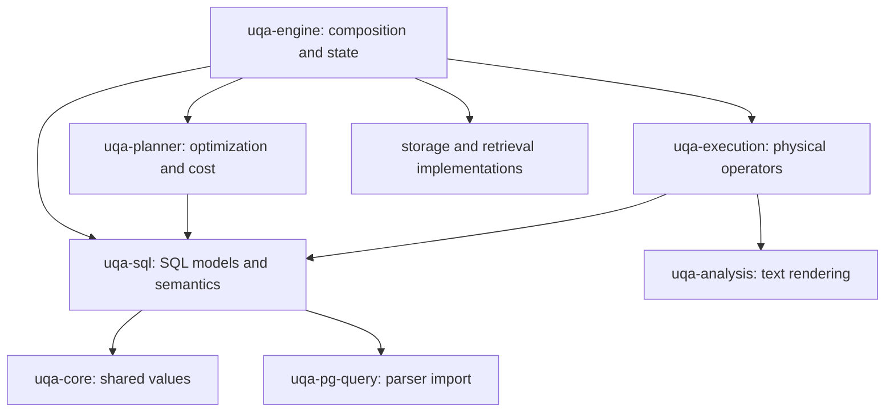

# SQL crate boundaries

`uqa-sql` owns statement and scalar IR, lowering, static schemas, type resolution, catalog definitions, routine descriptors, query binding, and preparation-time parameter inference. The engine constructs statement inputs and coordinates execution; the planner optimizes SQL-owned plans, and execution owns physical rows and buffers. This keeps SQL analysis independent of runtime and storage implementations.

`uqa-engine` must not own a SQL interpreter module or a SQL implementation tree. SQL statement semantics belong in `uqa-sql`, plan transformations in `uqa-planner`, and statement and operator execution in `uqa-execution`. Engine adapters supply catalog, storage, session, transaction, and extension services through contracts owned by their consumers. Moving the same interpreter under another engine directory or exposing the entire engine through a replacement interface does not satisfy this boundary.

## Dependency direction

Arrows mean a crate imports another crate. `uqa-sql` may depend on `uqa-core` and the parser import `uqa-pg-query`; it must not reach the planner, executor, storage implementations, or engine, even through an intermediate crate.

The diagram shows ownership dependencies relevant to SQL extraction. The complete current graph, including planner access to retrieval statistics and algorithms, remains checked in `scripts/workspace-dependency-policy.json`; this document does not claim those existing runtime dependencies have already been removed.

## Owners

| Owner | Responsibilities | Excluded state |
| --- | --- | --- |
| `uqa-sql` | SQL AST, scalar and statement IR, lowering, SQL argument validation, name/type analysis, and SQL validation rules | `Engine`, transactions, physical row buffers, storage handles, and physical operator instances |
| `uqa-planner` | Cardinality, costs, join order, plan rewrites, and access decisions over SQL-owned IR | Session mutation and statement publication |
| `uqa-execution` | Statement execution, physical rows and batches, operators, spill, materialization, and runtime expression evaluation | SQL parsing and catalog ownership rules |
| `uqa-engine` | Construct statement snapshots and capabilities, own sessions and transactions, and expose the application API | Generic SQL analysis or operator algorithms that can consume narrower contracts |

SQL analysis consumes immutable catalog descriptions and explicit name/routine-resolution contracts. Implementations of those contracts remain beside their state owners. An interface that merely republishes the complete `Engine` surface is not an acceptable boundary. Physical buffers and storage connections cannot be hidden inside an analysis context to evade the dependency rule.

The SQL statement and scalar models are shared data, not a reason for `uqa-sql` to import a planner or executor. Their canonical owners are `uqa_sql::plan` and `uqa_sql::ir`. Existing public planner/executor type exports can remain aliases to the same definitions for API continuity; duplicate definitions, conversion trees, and a second dispatcher are forbidden.

Static schema identity must be distinguished from row ownership and materialization. SQL analysis needs names, ambiguity, declared types, and scope; runtime execution additionally owns buffers, row locks, spill offsets, and value movement. Extraction must preserve duplicate column positions, hidden attributes, correlation, domain identity, and empty-result schemas without evaluating a query to infer its types.

Prepared declaration placeholders, parameter-number holes, result descriptor identity, EXECUTE argument shape and assignment compatibility, and immutable-argument classification belong to SQL. Execution orders argument binding: definition and arity checks precede scope capture; static analysis and constant input conversion precede immutable evaluation; volatile evaluation and domain checks retain argument order. Engine supplies the active routine scope, scoped function hook, and assignment services. The planner owns custom/generic selection and parameter specialization, preserving bound types and parameter provenance; Engine retains the session registry, existing publication guards, and counters.

Prepared definitions, cached variants and catalog metadata share one SQL-owned representation. Declaration types resolve before parameter inference; inference and result-descriptor analysis retain separate current-routine scopes. Execution acquires the original registry write guard before constructing the logical-plan Arc, source text and registration timestamp, and publishes only after analysis succeeds. The planner owns first-generic cost rechecking, custom parameter specialization, descriptor validation and usage selection. Engine retains the live session map and checks the captured logical-plan Arc identity under a fresh write guard before updating cache fields or counters. A replaced or deallocated definition never receives an older invocation’s statistics. Execution reaches the planner through a SQL-owned provider contract.

View creation namespaces, replacement row types, and ownership rules belong to SQL. Persisted view source qualification and legacy scalar dispatch restoration also belong to SQL and consume explicit catalog identities. Their ambiguity, quoting and CTE tests live with the implementation; actual sequence-registry refresh remains an Engine integration test. Execution owns regular and materialized view registration and refresh, including source binding order, existing identity and ACL preservation, source optimization and execution, and durable publication. Engine supplies the active transaction, fresh query binding scopes, role and membership guards, and view registry guards. Regular view publication retains the registry write guard across persistence; materialized publication persists before taking that guard. Both publish the catalog generation only after successful insertion and guard release. Refresh restores the caller's role before validating and publishing the new row snapshot.

Durable view decoding, object identity uniqueness, owner and ACL validation, and public column-name projection belong to SQL. Execution restores and migrates stored definitions through the caller's catalog transaction. It preserves temporary views, installs the complete provisional registry before binding nested views, publishes each bound definition before analyzing the next, and restores the previous registry when migration fails. Engine retains live table, foreign-table, graph, role and view registry guards and captures fresh binding and schema scopes only when requested. The Engine view restoration implementation file is removed.

SQL owns view DROP authorization and dependency diagnostics, temporary-view dependency layers, and relation-reference rewrite candidates. Execution owns deletion preflight, cascading routine/rule/view removal, ordered temporary-view deletion, and reference publication. Direct view deletion retains the original nested transaction entry; durable deletion retains its registry write guard through storage removal and publishes the generation after releasing the guard. Relation renames retain the read guard while preparing candidates and insert only changed views after persistence. Column renames retain the separate registry snapshot, fresh catalog analysis per affected view, temporary-view persistence exclusion, complete registry replacement and generation publication. Engine supplies live state and existing event/transaction services; its column-reference publication file and unused SQL forwarding functions are removed.

SQL owns the explicit-transaction-block requirements and command-specific diagnostics. Execution owns read-only plan validation, snapshot marking, explicit transaction abort and implicit rollback error handling. Validation errors precede snapshot marking, and a rollback failure retains the original statement error. Engine binds these operations to its existing transaction state and rollback entry point. The exhaustive statement dispatcher, simple-query batch scheduling and single-query spill scheduling belong to execution. SQL retains parsing and lowering; the native driver requests them at their original boundaries.

Mutation entry and CTE command dispatch belong to execution. Target resolution and the original statement-specific checks run before the command transaction; Engine supplies fresh execution inputs inside its existing transaction boundary. SQL owns inherited privilege-subject binding and RETURNING analysis, while execution owns MERGE scope construction and RETURNING row execution. Cursor schema analysis consumes separate read contracts. Engine has no DML implementation module or DML re-export tree; constraint, index, and transaction consumers call their owning crates through current-state adapters.

DROP INDEX name diagnostics, constraint ownership checks, foreign-key dependency selection, and stored GIN/vector field validation belong to SQL. Execution retains the bound index rows through dependency checks, relation locking, and the command transaction, then removes dependent constraints and physical fields before publishing catalog removal. GIN metadata decoding remains lazy across candidate indexes, so unrelated definitions do not change validation order. Engine binds these consumers to catalog reads, locks, and provider operations through separate contracts.

SQL also binds DROP TABLE, FOREIGN TABLE, VIEW, MATERIALIZED VIEW, and SEQUENCE targets, checks AGE label protection, and discovers the declared view, rule, and owned-sequence dependencies of foreign tables. Execution owns pre-transaction hierarchy locks, authority and dependency check ordering, pending-event checks, and removal scheduling. Its transaction callback receives fresh catalog inputs from Engine, whose adapters retain the existing registry and publication boundaries. Namespace and domain lifecycle entry remains separate from relation removal.

SQL validates ALTER TABLE transaction restrictions, binds relation targets, and maps compatible table syntax to native sequence, view, and foreign-table actions or validated event actions. Rename-source diagnostics preserve the distinction between missing schemas and missing relations. Execution checks transaction restrictions before resolving the target, locks ordinary tables before transaction entry, and dispatches each bound action through its native execution path. Engine supplies the transaction-block flag and fresh table or event inputs inside the existing implicit transaction. ALTER SEQUENCE entry likewise belongs to execution, with its missing-target notice emitted only after the transaction callback returns.

Native ALTER VIEW, ALTER MATERIALIZED VIEW, and ALTER FOREIGN TABLE execution belongs to execution. SQL binds their targets, validates rename destinations, applies view options, and checks table-shaped ACL invariants. Execution orders owner checks, relation locks, dependency rewrites, durable writes, and registry publication; Engine supplies fresh inputs inside the existing implicit transaction. Role validation retains the roles-then-memberships read order and releases both guards before schema checks. Foreign-table owner transfer persists owned-sequence candidates before validating and publishing the parent ACL. Registry adapters return the actual write guards, preserving lock lifetimes through rename and owner publication.

CREATE TABLE, CREATE TABLE AS, and sequence statement entry also belong to execution. CREATE TABLE opens a transaction frame for every command, including nested calls. CREATE TABLE AS reuses an active transaction and opens a frame only when none is active; Engine captures its routine-aware analysis scope after that choice. Sequence creation constructs allocation state inside the implicit transaction and emits any existing-target notice after the callback returns. Engine binds these consumers to distinct transaction contracts, and the unified dispatcher calls index creation directly in execution. The former Engine DDL creation and alteration modules are removed.

Role declarations, attribute authority, membership candidates, requested-role binding, dependency diagnostics and restored catalog validation belong to SQL. Execution owns CREATE, ALTER, DROP, GRANT and SET ROLE ordering through retained role and membership guards. Role and membership candidates persist before either live map is replaced, and the catalog epoch changes only after both guards are released. DROP checks grantor dependencies before object registries and visits requested roles in input order within each registry; missing-role notices remain immediate. Table security is read lazily while retaining the actual table registry, preserving the first dependency diagnostic. Engine supplies current identities, live guards, typed persistence and final session/cache mutation. Role metadata keys, JSON formats and restoration error variants remain unchanged.

Trigger and rewrite-rule declarations belong to SQL, including relation and function identity binding, creation authority, OLD/NEW scope rules, WHEN and rule-condition types, RETURNING shapes, stored routine references and partition-name conflicts. Catalog routine binding captures a fresh restored catalog scope at each original bind point; it does not reuse the current routine's transition-row overlay. Execution owns event registration, DROP, rename and enable-mode publication through the actual registry guards. Rule replacement preserves enable mode and trigger replacement preserves object identity. Persistence precedes registry publication; rule rename and enable-mode changes retain their write guards through the epoch update, while trigger rename and DROP release their guards before updating pending constraint events and the epoch. Engine supplies live metadata, transaction guards, typed persistence and pending-event state. SQL also owns rule and trigger selection: definition checks borrow the statement-pinned catalog when present, while executable rules and triggers use live registries and the current replication role. Row-trigger lookup preserves local-name precedence before enable-mode and event filtering, then canonicalizes inherited relation names without mutating stored definitions. SQL also discovers bound event dependencies and rebinds routine and column references. Execution persists and publishes their candidates in the original order: relation-event deletion retains both catalog write guards through both writes and releases them before forgetting pending constraints; routine renaming publishes trigger changes before reading and rebinding rules. Column-drop preparation precedes the physical metadata change and surviving rules rebind afterward. SQL owns durable event envelopes, rule format checks and persistence filtering. Execution owns serialization and metadata writes, bound restoration, legacy trigger-identity migration and post-publication migration persistence. Initial-open migration retains its outer storage transaction, while load-only restoration refuses repairs and preserves session-temporary events. Engine lends the existing snapshots, live relation persistence metadata and guards; its event definition, lookup, dependency, registry and persistence implementation files and redundant binding relays are removed.

Schema ACL models, privilege traversal, grant and revoke rules, and owner rewrites belong to SQL. Provider-independent schema row and ACL values belong to Core and remain re-exported by storage; SQL does not depend on storage to interpret them. Execution owns namespace registration and CREATE SCHEMA and ALTER SCHEMA OWNER ordering. Registration keeps the actual schema write guard across graph-name collision checks and persistence, then releases it before publishing the catalog epoch. Owner transfer preserves its existing implicit transaction, same-owner short circuit, role and membership guard order, authority checks, and persistence-before-registry publication. Schema GRANT and REVOKE target and role validation, privilege candidates, and warning text are SQL-owned; execution retains role, membership, and schema registry guards while persisting all candidates and publishes notices only after releasing those guards. Engine supplies these consumers with current state and provider operations.

Domain creation target binding and collisions, DROP DOMAIN type and namespace binding, owner diagnostics, and type/AST dependency analysis belong to SQL. Execution owns creation scheduling, identity allocation, ordered DROP target collection, dependent index/table/view collection and removal, and durable domain registry publication. Domain declaration inputs are captured only after target checks, and CREATE retains the type-before-table collision check. Dependency collection reads index rows first, then retains each table's actual column and CHECK guards during SQL analysis; foreign-table and view snapshots remain at their original read points. Registry removal preserves candidate capture, dependent-object removal, stored-expression rewrites, persistence, and publication order. Engine supplies the catalog, authorization, and state adapters.

Schema DROP target binding, owner diagnostics, virtual namespace protection, and RESTRICT checks belong to SQL. Execution removes contained relations and graphs, retaining the original order of ordinary-table, foreign-table, view, and remaining-sequence catalog reads. It locks graph label relations before graph deletion and invokes joint type/routine removal before relation removal. The direct empty-schema API enters its existing storage transaction and delegates validation and publication to execution, retaining the live schema write guard through the provider deletion and registry update. Engine supplies narrow registry, relation lifecycle, and provider adapters. DROP statement dispatch lives in execution: schema and domain callbacks bind current state inside the existing implicit transaction, while relation callbacks bind inputs before the established pre-transaction locking path. Engine no longer has a DDL implementation module or directory; declared-value conversion imports refer to SQL directly.

Routine DROP identities, namespace/search-path lookup, overload binding, ownership checks, stored AST dependency analysis, cascade notices, and registry removal candidates belong to SQL. Execution owns joint routine/domain/relation/column closure, dependency collection, and removal/publication order. Ordinary-table column and CHECK reads retain the original table generation and actual guards; foreign-table analysis retains its registry read guard. Routine DROP snapshots retain the canonical SQL-owned definitions and compiled bodies through their original Arc entries. Registry publication revalidates every target against the latest candidate under the actual write guard, persists that candidate, publishes it, releases the guard, and then advances the catalog epoch. Engine supplies the existing implicit transaction, live metadata and authorization guards, and dependent-object services. Engine no longer contains the routine DROP planning or joint cascade implementation files.

Routine declarations, `%TYPE` references, parameter and return-type validation, SQL/PLpgSQL body analysis, and stored MERGE target identities belong to SQL. Stored statement column binding also belongs to SQL: it derives dependencies, expands stored projections, preserves aliases through column renames and deletion, and handles CTE, join, and MERGE scopes from explicit relation metadata. Routine removal and body rewrites call this common binder directly. Engine supplies current column names, type descriptions, parser catalog inputs, and query-binding scopes; it does not implement these AST traversals.

Execution owns stored routine recompilation and body publication. It restores the recorded creation search path before compiling SQL-standard bodies and restores the caller's path after both success and error. Column and sequence dependency expansion precedes alias candidate selection. Body publication takes its registry snapshot after dependent catalog changes, matches each candidate by object identity, routine kind, and signature, recompiles it, persists the complete registry, publishes it, and then advances the catalog epoch. MERGE normalization affects the executable copy; the durable body retains removed-target expressions for dependency analysis.

Stored query and statement relation binding belongs to SQL, including virtual catalog spellings, AGE label references, transition relations, temporary relation tracking, relation-kind diagnostics, and literal sequence names. Bound identities and catalog-restoration lookup retain separate entry paths so restoration does not recursively synchronize registries. SQL also collects rule relation and routine dependencies through query plans, mutation CTEs, and table-function sources. Engine captures temporary and transition namespace inputs at the original boundary, supplies catalog resolution, and retains the sequence registry read guard while SQL selects among loaded candidates.

Routine compilation and dependency analysis take SQL-owned binding snapshots, namespace metadata, and narrow catalog lookup contracts. SQL binds stored query relations, source columns, default expressions, routine identities, and regclass literals directly. Execution owns creation-path capture, scoped namespace restoration, and recompilation; Engine no longer supplies callbacks that accept routine query plans for semantic binding.

Routine registration, ALTER, owner changes, and EXECUTE grants retain live role and registry guards in execution until the durable registry is published. SQL owns replacement compatibility, attribute validation, ACL reachability, and privilege diagnostics. Configuration normalization runs under the original session restoration guard, including the caller statement cache. Catalog identity allocation belongs to execution.

Routine lookup and durable-name validation belong to SQL. Lookup consumes the existing query snapshot or live registry guard without replacing it with a detached registry copy; named-argument candidates remain unshadowed until matching. Execution installs restore placeholders before body compilation and rolls the registry back on any failed compilation, disallowed migration, or persistence operation. Successful restoration does not advance the epoch. Routine rename analysis, destination collisions, registry movement, and routine-owned AST rewrites belong to SQL; execution publishes names before recompilation and preserves dependent-object rewrite and persistence order. Engine no longer contains the routine lifecycle file or directory.

Routine signature matching, named/variadic invocation mapping, declared return types, and combined built-in/user candidate ranking belong to SQL. Overload resolution receives the original shared domain-map allocation captured at the existing catalog boundary, plus current namespace and registered-function metadata. Engine implements SQL resolver contracts through narrow adapters and contains no user-routine lookup, overload, registration, restore, or rename algorithm.

Index expression and predicate routine matching and identity rewrites belong to SQL. Execution decodes each stored index under the existing live read guard, releases it after collecting rewrites, and persists each row before publishing it. Stored-view relation, sequence, and routine dependency selection also belongs to SQL; execution retains catalog synchronization before selection and each cascading lookup, and persists changed nontemporary view rows before replacing the registry and advancing its epoch. Engine supplies registry guards and provider access; its index routine implementation file and view dependency algorithms are removed.

## Enforcement

Run `bash scripts/install-git-hooks.sh` in a checkout to install the repository's versioned pre-commit hook. The hook runs `python3 scripts/check-workspace-dependencies.py --staged` on every commit. It builds Cargo metadata from the index's manifests, lockfile, and target paths, so an unstaged manifest or policy edit cannot change what is checked. Runtime, build, and platform-specific dependencies are checked; development-only dependencies are excluded from the runtime graph. The common storage and graph crates additionally forbid provider dependencies in all dependency kinds, including test and benchmark dependencies. SQLite graph conformance tests and the vector persistence benchmark live in `uqa-storage-sqlite`, so provider publication does not introduce a dependency cycle through those consumers.

The same checker runs in CI against the checked-out commit. It compares the explicit edge inventory, enforces dependency budgets, and checks transitive ownership boundaries. Changing the edge inventory alone cannot waive a forbidden dependency. Cargo also rejects cyclic package dependencies. The installer refuses to replace an existing custom hook configuration silently.

## Verification and completion

Each extraction keeps the existing executable path and moves its tests with the owning implementation. The crate dependency check, formatting, strict Clippy, workspace tests, PostgreSQL reference fixtures, manual SQL checks, and binding CI must pass before the change is merged. New top-level integration-test executables are not added.

The engine binding facade translates statement CTE schemas into `BindingContext` and implements `AnalysisCatalog` over its immutable catalog snapshot. That contract returns table, view, sequence-presence, virtual-schema, and routine definitions; it cannot execute a query. SQL-only tests bind a complete query and operator-join sources through a minimal catalog fixture. JOIN output layout is shared SQL data, while `JoinOutput` computes runtime values in execution. File counts and line limits do not substitute for these ownership checks.

The planner receives a constant-evaluation function through `OptimizerConfig::new`. The engine supplies `uqa_execution::scalar::eval_constant_scalar`, so constant errors and SQL types use the canonical evaluator without making the planner import physical execution. Operator-tree execution, execution statistics, and parallel workers are owned by `uqa-execution`; the planner has no runtime dependency on that crate.

The operator-tree optimizer consumes immutable `IndexScanCandidate` values for access selection. Index discovery and scan-cost collection belong to the caller that owns the catalog snapshot; the optimizer does not retain `IndexManager` or import `uqa-storage` directly. The remaining retrieval-IR dependency through `uqa-operators` and the RPQ parser dependency through `uqa-graph` remain explicit in the dependency policy.

INSERT, UPDATE, DELETE, and MERGE command execution now belongs to `uqa-execution`, including table/view path selection, source reads, conflict and action selection, snapshot rebinding, lock rechecks, staging, publication, and trigger scheduling. View target and column analysis, MERGE clause visibility, mutation row schemas, and RETURNING type analysis belong to `uqa-sql`; source-output pruning remains in `uqa-planner`. Engine adapters bind the active session and transaction to these consumers.

SQL owns complete CREATE TABLE declaration analysis, CREATE and ALTER inheritance rules, CHECK merging, CREATE TABLE AS column declarations, foreign-key definition binding and REFERENCES checks, index-key analysis, index naming, and static unique-index restrictions. Table expression binding captures fresh catalog inputs at each original validation point. Durable constraint names, legacy key promotion, and inherited identity normalization also belong to SQL; a supplied allocator provides new object identities without coupling SQL to Engine or a storage provider. Execution owns stored-row CHECK, NOT NULL, and foreign-key validation, along with column type rewrites and their physical vector updates. CREATE TABLE execution, including deferred IF NOT EXISTS preflight, physical relation creation, implicit sequence owners, and individual schema-write transaction boundaries, belongs to execution. CREATE TABLE AS execution, including source analysis ordering, locking reads before writer promotion, target revalidation, and materialization, also belongs to execution; its session adapter captures fresh query inputs at each actual source execution. SQL also owns vector-index option aliases, supplied option values, vector target analysis, and the bound index definition. Storage retains canonical physical parameter defaults and validation. Execution owns the complete CREATE INDEX build and publication sequence and validates visible index keys with its bounded `ExactRowSet`, using catalog, row-reading, expression, and memory services. Engine no longer constructs a separate SQLite database for that check. SQL also normalizes sequence definitions, validates ALTER option combinations, chooses implicit sequence names, and binds stable owner-column identities. Execution applies these declarations to allocation state and owns CREATE SEQUENCE ordering, implicit sequence materialization, and publication of bound owner identities; Engine supplies namespace lookup, transaction binding, and atomic catalog/registry publication. The serialized sequence state retains its existing fields and format. ALTER inheritance and partition attachment/detachment also run in execution: it acquires secondary relation locks, scans existing rows, validates default-partition exclusions, and publishes complete schema candidates through a retained table handle. SQL owns local versus inherited NOT NULL and CHECK origin rules. ADD COLUMN declaration binding and added-key declaration checks live in SQL; execution schedules field creation, schema registration, stable or volatile default backfill, generated-row rewrites, primary-key identity remapping, and validation of existing key values. These paths reuse mutation reads, expression contexts, and physical publication without exposing unrelated transaction state to SQL analysis. Constraint lookup, temporal type compatibility, foreign-key identity, and ALTER enforcement metadata belong to SQL. Constraint creation, validation, inherited CHECK recursion, and key-dependent deletion belong to execution, which publishes schema through the existing transaction boundary and then reconciles the active constraint modes.

Stored schema expression rewrites, literal sequence references, REGCLASS binding, and durable routine-identity binding are SQL-owned. Their catalog contract exposes only loaded relation names, bound or visible relation OIDs, and sequence-name lookup. Binding keeps the existing distinction between restored catalog names and the current namespace and captures fresh routine-binding inputs at each original binding point. Engine compatibility facades preserve storage-facing error types. Column registration and complete constraint replacement execute through `uqa-execution::schema::publication`; their consumer-owned table handle retains the original table generation across binding, persistence, and publication. Engine implements the metadata reads, durable candidate write, field publication, and statistics/index updates without interpreting SQL expressions.

Effective constraint views, persisted foreign-key target resolution, primary-key column requirements, and ALTER COLUMN default, generated-expression, and type analysis belong to SQL. Execution schedules added-key publication and column changes through the existing schema transactions. A retained column write guard spans candidate construction, statistics invalidation, durable persistence, and publication, preserving the original lock lifetime. Key and constraint publication leaves unrelated declaration, hierarchy, and lifecycle flags untouched. Type changes detach vector indexes before scalar conversion, publish the new type, rebuild applicable indexes, and validate affected rows in the original order.

Table action sequencing and inheritance recursion live in `uqa-execution::schema::table_alteration`. SQL normalizes inherited declarations, allocates recursive constraint names through the supplied allocator, and discovers foreign keys referencing deleted columns. Execution preserves ADD COLUMN IF NOT EXISTS notices, declaration binding order, independent column-CHECK propagation, and the existing child NOT NULL validation state. Column removal schedules routine, event, view, generated-column, and key dependencies before physical publication. Physical column deletion is scheduled in execution through one retained relation generation. SQL checks metadata dependencies and removes local declarations; execution retains the original schema and vector-index write guards, removes catalog indexes, rewrites stored rows, persists the drop, and then completes rule/sequence dependencies and statistics updates. Stored index reference analysis preserves key, included-column, and predicate inspection order. Relation and event lifecycle services bind the remaining catalog operations.

COPY envelope and relation-column validation belong to SQL. Execution owns byte-stream I/O, privilege checks, complete input staging, and invocation of the ordinary INSERT or SELECT path. The relation metadata handle is retained through column validation and the partitioned-output check. Engine keeps the public stream methods, statement gate, catalog synchronization, and transaction error handling.

VACUUM option interpretation, validation precedence, and target-column binding belong to SQL. Execution owns hierarchy expansion, relation locks, full row/index rewrites, provider compaction, and ANALYZE scheduling. Full rewrites retain the original relation generation and document-store read guard while collecting rows and vectors; statistics are restored only after row and index rebuilding. Engine binds session-lock release, the maintenance transaction boundary, provider operations, and retained state publication. Its statistics checkpoint exposes restore and persistence operations to execution without exporting planner-owned selectivity types.

SQL binds sequence targets, role references, name lifecycle rules, and stored table/view/event reference rewrites. Complete ALTER SEQUENCE dispatch runs in execution, including definition generations, role-owner ACL publication, rename/schema moves, and legacy owner cleanup. Role and membership read guards remain held until owner persistence and publication finish. Sequence rename persists all table and foreign-table candidates before publishing those references, rewrites views next, renames the sequence registry, and finally rewrites events. Event catalog publication retains the trigger and rule write guards through durable persistence; SQL owns the candidate relation rewrites and rendered rule text. Engine supplies retained generations, lock guards, and catalog/registry writes. The shared relation-resolution result is SQL-owned and remains re-exported by execution.

Retrieval argument binding and multi-field weight rules belong to SQL. Execution combines per-field scores, sparse evidence and corpus priors, applies document priors, and filters and orders calibrated vector candidates. These consumers receive text-index metadata, leaf search, candidate-document access and scalar evaluation separately. Engine binds the public API transaction before supplying leaf searches from the active statement. `ScoringMode` is defined once in `uqa-scoring` and re-exported through the existing Engine API. The physical driver no longer calls Engine SQL row-function implementations for these operations.

The exhaustive retrieval driver belongs to `uqa-execution::operator_tree::driver`, including posting-set composition, graph traversal and temporal queries, tuple joins, parallel signal execution, staged fusion, query-feature extraction, physical index validation, and model inference. Its context composes relation reads, snapshots, index handles, text/vector leaves, graphs, models and scalar evaluation. Index handles retain their table generation and return the original read guards, so attention features and vector validation keep their index lock lifetimes. Engine’s public `EngineDriver` binds the statement gate, calibration transaction and graph snapshot before entering this driver; it contains no physical variant dispatcher. SQL owns the physical text-field rules, while Engine supplies the retained table metadata.

Retrieval-tree scheduling and cross-relation operator joins also belong to execution. Each join side is optimized and executed in the original left-to-right order with its own relation binding; nested tuple carriers remain errors. The runtime checks calibration transaction state and physical text top-k placement before entering the executor. Engine supplies the existing optimizer binding and transaction depth through separate contracts, while the public API retains statement locking, rollback and graph-snapshot entry.

Statement statistics, hierarchy row counts, parameter-independent index costs, rewrite-rule input pruning, and volatility-sensitive optimizer configuration belong to `uqa-planner::statement_planning`. Consumer-owned catalog contracts expose metadata reads; retrieval cost services and the constant evaluator are composed by Engine. First-error capture and rewrite validation retain their original ordering. Durable index catalog rows are shared through `uqa-core` and re-exported by storage, so planning does not gain a storage dependency.

Routine invocation is split between SQL metadata and execution state. SQL compiles anonymous blocks and owns concrete signatures, output columns, carrier type classification, and record assignment rules. Execution resolves and materializes arguments, enforces strictness and stack limits, enters routine and trigger interpreters, and shapes physical results. Volatility, security-definer nesting, and the success-dependent restoration of caller identity use one execution-owned scope stack. Engine retains the actual session-state guard and binds metadata, authorization, expression, and runtime services through narrow adapters; no PL/pgSQL invocation implementation remains in its SQL tree.

Shared agtype values, ordering, and text rendering belong to core, with the graph crate preserving its public module re-export. Cypher call shapes, parameter maps, and declared SQL result-column conversions belong to SQL; graph invocation, transaction-read-only checks, and physical row projection belong to execution. Engine supplies live graph access and its existing public API transaction boundary. SQL does not acquire a graph dependency, and the original graph-existence-before-parameter-conversion order remains intact.

Table-function stream scheduling and result materialization belong to execution. The consumer composes live registry and cancellation handles with separate session introspection, analyzer, graph-name, Cypher, routine, and retrieval inputs. SQL validates analyzer and graph argument shapes before state access. Extension registrations retain their original lookup and release points; cancellation and ordinality remain lazy. Built-ins handled by the streaming path have no duplicate materialized dispatch. Provider-independent full-text inspection rows live in storage and retain their public Engine re-export.

Procedure CALL argument and result-schema analysis is SQL-owned. Named and variadic markers share the SQL IR decoder, while expression evaluation remains in execution. Separate validation and analysis entry points preserve the different catalog-scope capture order used by result description and actual invocation. Engine supplies scope and type-binding adapters.

Scalar score and highlight argument rules belong to SQL. Execution interprets score provenance and calls the canonical analysis highlighter directly; NULL short circuits and optional-argument order are unchanged. No Engine callback substitutes for the rendering algorithm.

SQL graph-command arity, text and boolean argument rules live in `uqa-sql::semantics::graph_commands`. Execution owns native and AGE graph/label command scheduling, namespace and dependency checks, and result shaping. It preserves graph catalog reads between argument evaluations, canonical graph-name validation, and the public graph APIs’ existing transaction entry points; Engine supplies only narrow graph and namespace operations.

Sequence introspection argument and owner-column binding belong to SQL. Execution resolves live sequence metadata, checks visibility and privileges, and constructs parameter and data records. It retains the sequence object-id read guard through state, security, and persistence reads, preserves NULL and missing-object diagnostics, and applies the existing temporary-session and uncalled-sequence rules. Engine supplies registry guards and catalog resolution through the sequence inspection context.

Role privilege inquiry belongs to SQL, including strict NULL handling, current-user selection, role name/OID binding, privilege parsing, and membership evaluation. Shared role and membership read-guard contracts also live in SQL and remain re-exported through execution. The inquiry retains role guards while resolving arguments, acquires membership guards only after successful binding, and releases both after computing the result.

Schema privilege inquiry and default security rules for virtual, temporary and graph namespaces belong to SQL. Schema and graph name readers retain the original registry guards through lookup and iteration. Subject binding releases its role guard before namespace refresh; privilege evaluation then reacquires role and membership guards in the original order. Engine supplies only namespace registry, session and persistence adapters.

Database ACL values, pure grant and revocation rules, privilege inquiry and access diagnostics belong to SQL. Execution re-exports the existing database security model paths. Inquiry keeps catalog refresh after NULL handling and before arity validation, releases subject-binding role guards before target lookup, and reacquires roles and memberships before security reads. Direct access checks retain database security, role and membership guards through evaluation. Execution owns database GRANT and REVOKE scheduling, unchanged-candidate suppression, persistence-before-registry publication, epoch updates, warnings after authorization guards are released, and metadata restoration after SQL validates stored role references. Engine supplies live catalog readers, writers and persistence adapters; its database-security implementation module is removed.

Sequence ACL values shared with storage live in core, and the canonical security state, grant candidates, name and namespace binding, and privilege inquiries live in SQL. Execution retains role, membership and sequence-security guards through ACL persistence, publishes registry changes only after every changed row is saved, releases the guards before notices, and advances the catalog epoch last. Sequence catalog-row conversion also lives in execution. Engine supplies narrow readers, writers and namespace adapters; its sequence-security implementation module is removed. Existing storage ACL and execution security import paths remain available, with serialized fields unchanged.

Table and column privilege inquiry belongs to SQL, including role and target binding, column names and attribute numbers, system-column rules, and sequence-shaped privilege checks. Execution resolves live relation metadata and OIDs while retaining registry read guards during iteration and a selected table generation during column/security reads. Engine supplies direct registry readers and retained table handles; its table-privilege inquiry implementation is removed.

Scalar catalog, session, graph and model dispatch runs in execution through typed catalog, privilege, graph, notification and training inputs. SQL owns deep-learning arguments, notification text conversion, arity and MERGE action context rules. Catalog arguments are evaluated before a missing execution context is reported; graph and model calls require that context before argument evaluation. Engine composes current-state services and retains its public graph, notification and model transaction boundaries; its scalar interception implementation and unused catalog forwarding methods are removed.

Scalar-subquery cache dispatch, spill materialization, membership promotion, correlated lateral execution and prepared EXISTS probes belong to execution. SQL retains correlation and decorrelation analysis. A cached consumer does not construct query contexts or recapture metadata; misses capture catalog and name resolution in their existing order. Engine provides borrowed native query contexts and scoped callbacks through separate adapters. Prepared predicates retain their own CTE scope and borrow stack-allocated hooks for each row, without a per-row callback allocation. Engine’s scalar-subquery implementation and correlation forwarding files are removed. Pure ordering tests live beside execution ordering, while the Engine runtime-view integration test lives beside its query-operator adapter; their fixtures and assertions are unchanged.

SQL owns executable statement schema and mutation parameter analysis. The planner schedules that analysis before optimizer input capture and constant evaluation, then performs optimization; execution does not depend on the planner. Each EXPLAIN recursion captures its original fresh scope before analyzing the body, and mutation parameters are checked before result-schema analysis. Scalar-subquery type binding checks the arena slot before borrowing catalog metadata, preserving outer qualifiers and parameter declarations. Engine’s scoped query callbacks move to capability adapters and call their native catalog and routine owners; the SQL evaluation directory is removed. Engine retains actual session cache lookup and deferred metadata capture; native execution owns batch and nested statement scheduling.

SQL owns TRUNCATE target expansion and foreign-key dependency ordering. Execution owns privilege and pending-trigger check order, RESTRICT validation scheduling, transaction entry and statement-trigger scheduling. All BEFORE triggers finish before dependency order is read again; physical clearing follows that fresh order and AFTER triggers retain statement order. Engine supplies its existing physical table-state API and transaction scope. The root Engine truncate module and unused SQL trigger forwarding function are removed; physical state operations live beside table storage.

Execution owns the exhaustive UnifiedPlan and CommandPlan dispatcher, shared cancellation/CTE/transaction validation, query scope and lock ordering, mutation privilege inheritance, EXPLAIN recursion, prepared execution, and CALL argument scheduling. It directly invokes native schema, privilege, routine and physical query executors. Engine composes deferred subsystem context factories, retained catalog transaction callbacks and typed session operations; top-level runtime access is limited to cancellation and notices. Query inputs expose no mutation entry. EXPLAIN measurements live in SQL and the planner renderer is supplied as a pure typed function, retaining the acyclic dependency graph and the existing public planner re-export. The former Engine plan executor, CTE-validation forwarding file and unused command wrappers are removed.

Execution schedules whole-message parsing before the first command, per-statement compilation and lowering, cache selection, snapshot acquisition, writer promotion, rollback and ordered result delivery. The session retains exact-SQL cache storage and catalog-epoch validation. Cached AST and plan values are owned; the adapter moves them without releasing a live catalog guard. Each row-lock frame remains retained through its loop iteration, including error cleanup and early continuation. Cursor execution seals its bounded spill before commit. Engine lends deferred statement contexts and actual transaction operations; executable optimization uses the SQL-owned plan contract with planner metadata captured at the original call. The former Engine batch driver, cursor scheduler and completion forwarder are removed.

Execution owns SQL and PL/pgSQL portal declaration, descriptor analysis and directional row streaming. SQL owns declaration restrictions and command-cursor diagnostics. Engine supplies the pending registry and deferred query/RETURNING contexts; its child worker retains the delegated statement gate from before the first request through completion. SQL also binds cursor relation and sequence references and collects table, hierarchy, view, routine and graph dependencies before snapshot registration. CTE visibility and per-reference transition lookups remain intact; dynamic graph inputs retain all graph dependencies without evaluating expressions. Engine lends current catalog lookups and retains actual snapshots and catalog guards.

The Engine SQL implementation tree is removed. The path policy forbids both `src/sql` and `src/sql.rs`; the existing public `uqa_engine::sql` namespace is an alias to execution-owned result types and SQL formatting/type metadata. Compiled statements lower with the registered aggregate classifier, retain catalog-bound identities before planning, and capture execution inputs only after successful analysis. Engine keeps query API gates and clocks, table-storage read guards and count caches, and scoped catalog, expression and CTE adapters. Its original query API tests retain all fixtures and assertions under the API owner. Role, event and foreign-relation catalog entry paths still require ownership cleanup through narrow contracts.

The borrowed `QueryContext` contains query sources, read-generation selection, directional execution, and CTE planning only. `MutationStatementContext` composes those read services with mutation command services. Query output factories bind a physical sink to an opaque read generation before row delivery; INSERT SELECT retains that generation through its session adapter. Query execution never receives a writable mutation context, and row consumers do not borrow the complete statement context.

SQL retrieval binding and logical expressions belong to `uqa-sql::retrieval`. The logical IR contains no scorer or fuser objects, closures, physical indexes, or top-k strategies. Execution evaluates runtime arguments through its scalar evaluator and constructs physical attention and learned models from declarative options. Shared direction, gating, prior, cutoff, and temporal configurations belong to core; operators retains its public re-exports. Predicate, FTS, graph, fusion, and operator-join lowering files are removed from Engine, while its public lowering API remains available through an execution re-export. Retrieval optimizer configuration, index and graph statistics, access classification and local/join costs belong to planner. Engine supplies live index read guards and one graph snapshot through the planner’s catalog interface; text and vector reads retain the same table generation and their original release order.

Retrieval row-function registry dispatch, predicate execution, bounded vector-pool interpretation and final ranked row limits belong to execution. Planner owns post-optimization access selection and eligible root text top-k plans. An unsupported or failed value-index probe stops before later probes, and preplanned or nested text operators do not trigger another planning snapshot. Engine supplies raw analyzed-term and indexed-document counts under one retained text-index guard, preserving the original storage-error conversion, and forwards typed planning requests to planner. Its SQL row-function implementation directory is removed; public retrieval entry points keep the existing statement, calibration-transaction and graph-snapshot boundaries.
