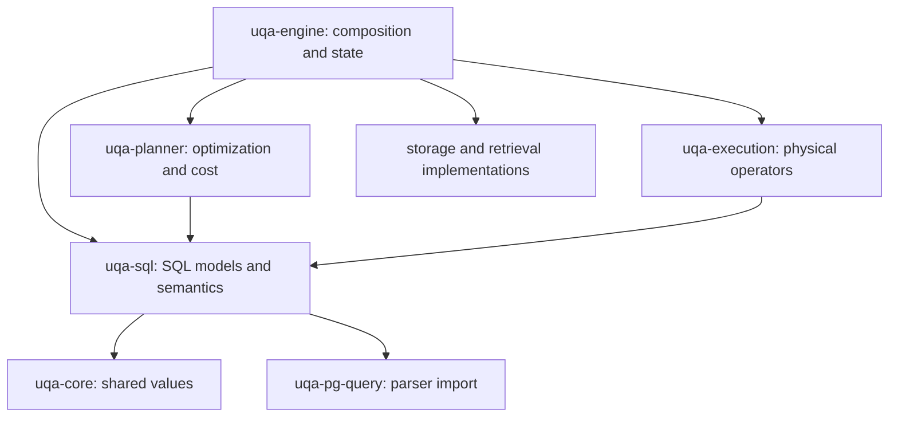

# SQL crate boundaries

`uqa-sql` owns statement and scalar IR, lowering, static schemas, type resolution, catalog definitions, routine descriptors, query binding, and preparation-time parameter inference. The engine constructs statement inputs and coordinates execution; the planner optimizes SQL-owned plans, and execution owns physical rows and buffers. This keeps SQL analysis independent of runtime and storage implementations.

`uqa-engine` must not own a SQL interpreter module or a SQL implementation tree. SQL statement semantics belong in `uqa-sql`, plan transformations in `uqa-planner`, and statement and operator execution in `uqa-execution`. Engine adapters supply catalog, storage, session, transaction, and extension services through contracts owned by their consumers. Moving the same interpreter under another engine directory or exposing the entire engine through a replacement interface does not satisfy this boundary.

## Dependency direction

Arrows mean a crate imports another crate. `uqa-sql` may depend on `uqa-core` and the parser import `uqa-pg-query`; it must not reach the planner, executor, storage implementations, or engine, even through an intermediate crate.

The diagram shows ownership dependencies relevant to SQL extraction. The complete current graph, including planner access to retrieval statistics and algorithms, remains checked in `scripts/workspace-dependency-policy.json`; this document does not claim those existing runtime dependencies have already been removed.

## Owners

| Owner | Responsibilities | Excluded state |
| --- | --- | --- |
| `uqa-sql` | SQL AST, scalar and statement IR, lowering, SQL argument validation, name/type analysis, and SQL validation rules | `Engine`, transactions, physical row buffers, storage handles, and physical operator instances |
| `uqa-planner` | Cardinality, costs, join order, plan rewrites, and access decisions over SQL-owned IR | Session mutation and statement publication |
| `uqa-execution` | Statement execution, physical rows and batches, operators, spill, materialization, and runtime expression evaluation | SQL parsing and catalog ownership rules |
| `uqa-engine` | Construct statement snapshots and capabilities, own sessions and transactions, and expose the application API | Generic SQL analysis or operator algorithms that can consume narrower contracts |

SQL analysis consumes immutable catalog descriptions and explicit name/routine-resolution contracts. Implementations of those contracts remain beside their state owners. An interface that merely republishes the complete `Engine` surface is not an acceptable boundary. Physical buffers and storage connections cannot be hidden inside an analysis context to evade the dependency rule.

The SQL statement and scalar models are shared data, not a reason for `uqa-sql` to import a planner or executor. Their canonical owners are `uqa_sql::plan` and `uqa_sql::ir`. Existing public planner/executor type exports can remain aliases to the same definitions for API continuity; duplicate definitions, conversion trees, and a second dispatcher are forbidden.

Static schema identity must be distinguished from row ownership and materialization. SQL analysis needs names, ambiguity, declared types, and scope; runtime execution additionally owns buffers, row locks, spill offsets, and value movement. Extraction must preserve duplicate column positions, hidden attributes, correlation, domain identity, and empty-result schemas without evaluating a query to infer its types.

Mutation entry and CTE command dispatch belong to execution. Target resolution and the original statement-specific checks run before the command transaction; Engine supplies fresh execution inputs inside its existing transaction boundary. SQL owns inherited privilege-subject binding and RETURNING analysis, while execution owns MERGE scope construction and RETURNING row execution. Cursor schema analysis consumes separate read contracts. Engine has no DML implementation module or DML re-export tree; constraint, index, and transaction consumers call their owning crates through current-state adapters.

DROP INDEX name diagnostics, constraint ownership checks, foreign-key dependency selection, and stored GIN/vector field validation belong to SQL. Execution retains the bound index rows through dependency checks, relation locking, and the command transaction, then removes dependent constraints and physical fields before publishing catalog removal. GIN metadata decoding remains lazy across candidate indexes, so unrelated definitions do not change validation order. Engine binds these consumers to catalog reads, locks, and provider operations through separate contracts.

SQL also binds DROP TABLE, FOREIGN TABLE, VIEW, MATERIALIZED VIEW, and SEQUENCE targets, checks AGE label protection, and discovers the declared view, rule, and owned-sequence dependencies of foreign tables. Execution owns pre-transaction hierarchy locks, authority and dependency check ordering, pending-event checks, and removal scheduling. Its transaction callback receives fresh catalog inputs from Engine, whose adapters retain the existing registry and publication boundaries. Namespace and domain lifecycle entry remains separate from relation removal.

SQL validates ALTER TABLE transaction restrictions, binds relation targets, and maps compatible table syntax to native sequence, view, and foreign-table actions or validated event actions. Rename-source diagnostics preserve the distinction between missing schemas and missing relations. Execution checks transaction restrictions before resolving the target, locks ordinary tables before transaction entry, and dispatches each bound action through its native execution path. Engine supplies the transaction-block flag and fresh table or event inputs inside the existing implicit transaction. ALTER SEQUENCE entry likewise belongs to execution, with its missing-target notice emitted only after the transaction callback returns.

Native ALTER VIEW, ALTER MATERIALIZED VIEW, and ALTER FOREIGN TABLE execution belongs to execution. SQL binds their targets, validates rename destinations, applies view options, and checks table-shaped ACL invariants. Execution orders owner checks, relation locks, dependency rewrites, durable writes, and registry publication; Engine supplies fresh inputs inside the existing implicit transaction. Role validation retains the roles-then-memberships read order and releases both guards before schema checks. Foreign-table owner transfer persists owned-sequence candidates before validating and publishing the parent ACL. Registry adapters return the actual write guards, preserving lock lifetimes through rename and owner publication.

CREATE TABLE, CREATE TABLE AS, and sequence statement entry also belong to execution. CREATE TABLE opens a transaction frame for every command, including nested calls. CREATE TABLE AS reuses an active transaction and opens a frame only when none is active; Engine captures its routine-aware analysis scope after that choice. Sequence creation constructs allocation state inside the implicit transaction and emits any existing-target notice after the callback returns. Engine binds these consumers to distinct transaction contracts, and the unified dispatcher calls index creation directly in execution. The former Engine DDL creation and alteration modules are removed.

Schema ACL models, privilege traversal, grant and revoke rules, and owner rewrites belong to SQL. Provider-independent schema row and ACL values belong to Core and remain re-exported by storage; SQL does not depend on storage to interpret them. Execution owns namespace registration and CREATE SCHEMA and ALTER SCHEMA OWNER ordering. Registration keeps the actual schema write guard across graph-name collision checks and persistence, then releases it before publishing the catalog epoch. Owner transfer preserves its existing implicit transaction, same-owner short circuit, role and membership guard order, authority checks, and persistence-before-registry publication. Schema GRANT and REVOKE target and role validation, privilege candidates, and warning text are SQL-owned; execution retains role, membership, and schema registry guards while persisting all candidates and publishes notices only after releasing those guards. Engine supplies these consumers with current state and provider operations.

## Enforcement

Run `bash scripts/install-git-hooks.sh` in a checkout to install the repository's versioned pre-commit hook. The hook runs `python3 scripts/check-workspace-dependencies.py --staged` on every commit. It builds Cargo metadata from the index's manifests, lockfile, and target paths, so an unstaged manifest or policy edit cannot change what is checked. Runtime, build, and platform-specific dependencies are checked; development-only dependencies are excluded from the runtime graph. The common storage and graph crates additionally forbid provider dependencies in all dependency kinds, including test and benchmark dependencies. SQLite graph conformance tests and the vector persistence benchmark live in `uqa-storage-sqlite`, so provider publication does not introduce a dependency cycle through those consumers.

The same checker runs in CI against the checked-out commit. It compares the explicit edge inventory, enforces dependency budgets, and checks transitive ownership boundaries. Changing the edge inventory alone cannot waive a forbidden dependency. Cargo also rejects cyclic package dependencies. The installer refuses to replace an existing custom hook configuration silently.

## Verification and completion

Each extraction keeps the existing executable path and moves its tests with the owning implementation. The crate dependency check, formatting, strict Clippy, workspace tests, PostgreSQL reference fixtures, manual SQL checks, and binding CI must pass before the change is merged. New top-level integration-test executables are not added.

The engine binding facade translates statement CTE schemas into `BindingContext` and implements `AnalysisCatalog` over its immutable catalog snapshot. That contract returns table, view, sequence-presence, virtual-schema, and routine definitions; it cannot execute a query. SQL-only tests bind a complete query and operator-join sources through a minimal catalog fixture. JOIN output layout is shared SQL data, while `JoinOutput` computes runtime values in execution. File counts and line limits do not substitute for these ownership checks.

The planner receives a constant-evaluation function through `OptimizerConfig::new`. The engine supplies `uqa_execution::scalar::eval_constant_scalar`, so constant errors and SQL types use the canonical evaluator without making the planner import physical execution. Operator-tree execution, execution statistics, and parallel workers are owned by `uqa-execution`; the planner has no runtime dependency on that crate.

The operator-tree optimizer consumes immutable `IndexScanCandidate` values for access selection. Index discovery and scan-cost collection belong to the caller that owns the catalog snapshot; the optimizer does not retain `IndexManager` or import `uqa-storage` directly. The remaining retrieval-IR dependency through `uqa-operators` and the RPQ parser dependency through `uqa-graph` remain explicit in the dependency policy.

INSERT, UPDATE, DELETE, and MERGE command execution now belongs to `uqa-execution`, including table/view path selection, source reads, conflict and action selection, snapshot rebinding, lock rechecks, staging, publication, and trigger scheduling. View target and column analysis, MERGE clause visibility, mutation row schemas, and RETURNING type analysis belong to `uqa-sql`; source-output pruning remains in `uqa-planner`. Engine adapters bind the active session and transaction to these consumers.

SQL owns complete CREATE TABLE declaration analysis, CREATE and ALTER inheritance rules, CHECK merging, CREATE TABLE AS column declarations, foreign-key definition binding and REFERENCES checks, index-key analysis, index naming, and static unique-index restrictions. Table expression binding captures fresh catalog inputs at each original validation point. Durable constraint names, legacy key promotion, and inherited identity normalization also belong to SQL; a supplied allocator provides new object identities without coupling SQL to Engine or a storage provider. Execution owns stored-row CHECK, NOT NULL, and foreign-key validation, along with column type rewrites and their physical vector updates. CREATE TABLE execution, including deferred IF NOT EXISTS preflight, physical relation creation, implicit sequence owners, and individual schema-write transaction boundaries, belongs to execution. CREATE TABLE AS execution, including source analysis ordering, locking reads before writer promotion, target revalidation, and materialization, also belongs to execution; its session adapter captures fresh query inputs at each actual source execution. SQL also owns vector-index option aliases, supplied option values, vector target analysis, and the bound index definition. Storage retains canonical physical parameter defaults and validation. Execution owns the complete CREATE INDEX build and publication sequence and validates visible index keys with its bounded `ExactRowSet`, using catalog, row-reading, expression, and memory services. Engine no longer constructs a separate SQLite database for that check. SQL also normalizes sequence definitions, validates ALTER option combinations, chooses implicit sequence names, and binds stable owner-column identities. Execution applies these declarations to allocation state and owns CREATE SEQUENCE ordering, implicit sequence materialization, and publication of bound owner identities; Engine supplies namespace lookup, transaction binding, and atomic catalog/registry publication. The serialized sequence state retains its existing fields and format. ALTER inheritance and partition attachment/detachment also run in execution: it acquires secondary relation locks, scans existing rows, validates default-partition exclusions, and publishes complete schema candidates through a retained table handle. SQL owns local versus inherited NOT NULL and CHECK origin rules. ADD COLUMN declaration binding and added-key declaration checks live in SQL; execution schedules field creation, schema registration, stable or volatile default backfill, generated-row rewrites, primary-key identity remapping, and validation of existing key values. These paths reuse mutation reads, expression contexts, and physical publication without exposing unrelated transaction state to SQL analysis. Constraint lookup, temporal type compatibility, foreign-key identity, and ALTER enforcement metadata belong to SQL. Constraint creation, validation, inherited CHECK recursion, and key-dependent deletion belong to execution, which publishes schema through the existing transaction boundary and then reconciles the active constraint modes.

Stored schema expression rewrites, literal sequence references, REGCLASS binding, and durable routine-identity binding are SQL-owned. Their catalog contract exposes only loaded relation names, bound or visible relation OIDs, and sequence-name lookup. Binding keeps the existing distinction between restored catalog names and the current namespace and captures fresh routine-binding inputs at each original binding point. Engine compatibility facades preserve storage-facing error types. Column registration and complete constraint replacement execute through `uqa-execution::schema::publication`; their consumer-owned table handle retains the original table generation across binding, persistence, and publication. Engine implements the metadata reads, durable candidate write, field publication, and statistics/index updates without interpreting SQL expressions.

Effective constraint views, persisted foreign-key target resolution, primary-key column requirements, and ALTER COLUMN default, generated-expression, and type analysis belong to SQL. Execution schedules added-key publication and column changes through the existing schema transactions. A retained column write guard spans candidate construction, statistics invalidation, durable persistence, and publication, preserving the original lock lifetime. Key and constraint publication leaves unrelated declaration, hierarchy, and lifecycle flags untouched. Type changes detach vector indexes before scalar conversion, publish the new type, rebuild applicable indexes, and validate affected rows in the original order.

Table action sequencing and inheritance recursion live in `uqa-execution::schema::table_alteration`. SQL normalizes inherited declarations, allocates recursive constraint names through the supplied allocator, and discovers foreign keys referencing deleted columns. Execution preserves ADD COLUMN IF NOT EXISTS notices, declaration binding order, independent column-CHECK propagation, and the existing child NOT NULL validation state. Column removal schedules routine, event, view, generated-column, and key dependencies before physical publication. Physical column deletion is scheduled in execution through one retained relation generation. SQL checks metadata dependencies and removes local declarations; execution retains the original schema and vector-index write guards, removes catalog indexes, rewrites stored rows, persists the drop, and then completes rule/sequence dependencies and statistics updates. Stored index reference analysis preserves key, included-column, and predicate inspection order. Relation and event lifecycle services bind the remaining catalog operations.

COPY envelope and relation-column validation belong to SQL. Execution owns byte-stream I/O, privilege checks, complete input staging, and invocation of the ordinary INSERT or SELECT path. The relation metadata handle is retained through column validation and the partitioned-output check. Engine keeps the public stream methods, statement gate, catalog synchronization, and transaction error handling.

VACUUM option interpretation, validation precedence, and target-column binding belong to SQL. Execution owns hierarchy expansion, relation locks, full row/index rewrites, provider compaction, and ANALYZE scheduling. Full rewrites retain the original relation generation and document-store read guard while collecting rows and vectors; statistics are restored only after row and index rebuilding. Engine binds session-lock release, the maintenance transaction boundary, provider operations, and retained state publication. Its statistics checkpoint exposes restore and persistence operations to execution without exporting planner-owned selectivity types.

SQL binds sequence targets, role references, name lifecycle rules, and stored table/view/event reference rewrites. Complete ALTER SEQUENCE dispatch runs in execution, including definition generations, role-owner ACL publication, rename/schema moves, and legacy owner cleanup. Role and membership read guards remain held until owner persistence and publication finish. Sequence rename persists all table and foreign-table candidates before publishing those references, rewrites views next, renames the sequence registry, and finally rewrites events. Event catalog publication retains the trigger and rule write guards through durable persistence; SQL owns the candidate relation rewrites and rendered rule text. Engine supplies retained generations, lock guards, and catalog/registry writes. The shared relation-resolution result is SQL-owned and remains re-exported by execution.

Retrieval argument binding and multi-field weight rules belong to SQL. Execution combines per-field scores, sparse evidence and corpus priors, applies document priors, and filters and orders calibrated vector candidates. These consumers receive text-index metadata, leaf search, candidate-document access and scalar evaluation separately. Engine binds the public API transaction before supplying leaf searches from the active statement. `ScoringMode` is defined once in `uqa-scoring` and re-exported through the existing Engine API. The physical driver no longer calls Engine SQL row-function implementations for these operations.

The exhaustive retrieval driver belongs to `uqa-execution::operator_tree::driver`, including posting-set composition, graph traversal and temporal queries, tuple joins, parallel signal execution, staged fusion, query-feature extraction, physical index validation, and model inference. Its context composes relation reads, snapshots, index handles, text/vector leaves, graphs, models and scalar evaluation. Index handles retain their table generation and return the original read guards, so attention features and vector validation keep their index lock lifetimes. Engine’s public `EngineDriver` binds the statement gate, calibration transaction and graph snapshot before entering this driver; it contains no physical variant dispatcher. SQL owns the physical text-field rules, while Engine supplies the retained table metadata.

Retrieval-tree scheduling and cross-relation operator joins also belong to execution. Each join side is optimized and executed in the original left-to-right order with its own relation binding; nested tuple carriers remain errors. The runtime checks calibration transaction state and physical text top-k placement before entering the executor. Engine supplies the existing optimizer binding and transaction depth through separate contracts, while the public API retains statement locking, rollback and graph-snapshot entry.

The Engine still contains the unified statement dispatcher, remaining DDL command execution, table-function execution, and operator-tree integration code. These remaining implementations must move to their owning crates through narrow contracts before the Engine SQL tree can be removed. The current policy protects the completed extractions and SQLite provider boundary; it does not yet assert that the Engine SQL tree is absent.

The borrowed `QueryContext` contains query sources, read-generation selection, directional execution, and CTE planning only. `MutationStatementContext` composes those read services with mutation command services. Query output factories bind a physical sink to an opaque read generation before row delivery; INSERT SELECT retains that generation through its session adapter. Query execution never receives a writable mutation context, and row consumers do not borrow the complete statement context.
