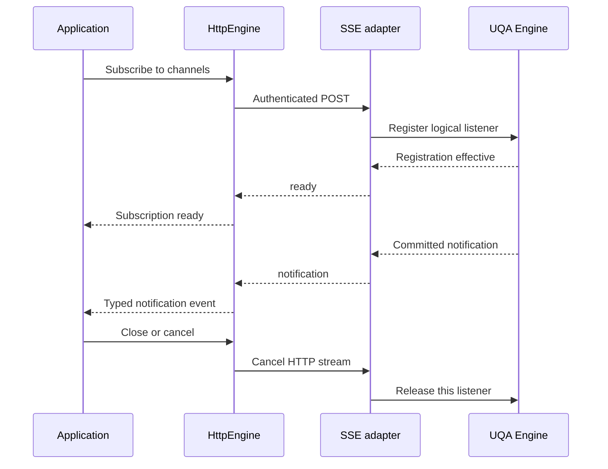

# SQL notifications and SSE

Status: implementation in progress under the [implementation plan](../plans/0015-sql-notifications-and-sse.md). The complete protocol and subscription APIs are not yet runtime-qualified; the plan records each required implementation and acceptance boundary.

Source baseline: UQA Engine `main` at [`badada6b94446cf7c1ba0903fb94b1b600286456`](https://github.com/cognica-io/uqa-engine/tree/badada6b94446cf7c1ba0903fb94b1b600286456), whose workspace version is `0.4.0`. The baseline was checked against the remote `main` branch on September 27, 2026. All statements about existing APIs below refer to that revision, not an earlier release or unmerged work.

## 1. Purpose and scope

Define a notification subscription contract for UQA Engine, with direct delivery for embedded `Engine` and authenticated SSE delivery for `HttpEngine`. The application selects channels and consumes events. Its selected Engine interface determines the transport: an embedded database does not start an HTTP server or connect to loopback to receive notifications. `HttpEngine` owns the HTTP connection, authentication, framing, cancellation and bounded reconnection. Applications do not construct an `EventSource`, choose a transport, or manage an SSE socket themselves.

The contract covers subscription requests, events, readiness, ordering, authorization, connection loss and language bindings. It adds an owned notification handle to embedded APIs without redesigning ordinary Engine sessions. It does not introduce general remote SQL sessions, cross-request transactions, durable event delivery or event acknowledgements.

The inspected Engine already executes `LISTEN`, `UNLISTEN`, `NOTIFY` and `pg_notify`, and exposes `poll_sql_notifications`, `wait_for_sql_notifications` and `take_sql_notifications` to Rust. The inspected Rust, Python, Node.js and browser `HttpEngine` APIs have SQL execution, atomic batches and NDJSON result streaming, but no notification subscription API. Existing `sql_stream`/`sqlStream` streams query rows; it is not this SSE protocol.

The embedded Python, Node.js and browser APIs do not expose the Rust notification receive methods either. Executing `LISTEN` through those bindings does not provide a notification iterator by itself. Both the embedded binding surface and the HTTP client surface therefore need implementation in this repository; adding an SSE wire specification alone does not complete the feature.

## 2. Responsibility and session semantics

| Participant | Responsibility |
| --- | --- |
| Application | Select channels, consume notifications, refresh application state after a delivery gap, and close subscriptions. |
| `HttpEngine` | Open the subscription lazily, authenticate every attempt, parse and validate SSE, manage connection loss, expose gaps, and release resources. |
| SSE adapter | Authorize the subscription, maintain its logical listener, forward committed notifications, enforce resource limits, and terminate invalid authority. |
| UQA Engine | Preserve notification publication, transaction, ordering and listener semantics. |

An SSE stream owns one logical subscription with an immutable channel set. It does not share the SQL session used by an unrelated `HttpEngine.sql` request. Its identifier is neither a SQL session handle nor a credential. Sending later SQL requests over the same HTTP connection does not attach them to the subscription's transaction, variables, prepared statements or temporary objects.

Physical listener sharing is an internal implementation choice. Every logical subscription must retain its own start boundary, delivery cursor and cancellation state. A single destructive `take_sql_notifications()` queue shared among readers does not meet the contract: one reader must never consume another reader's notification. A shared dispatcher must also prevent a new subscriber from receiving buffered notifications that predate its registration boundary. If those properties cannot be demonstrated, physical sharing must not be enabled.

Multiple channels belong in one subscription when the application wants one ordered event stream. Separate subscription handles remain independent even when their channel sets overlap. Changing a channel set closes the old handle and creates a new one in protocol version 1; that transition is not an uninterrupted subscription.



### Direct embedded databases

The common subscription API has two delivery adapters:

| Entry point | Delivery and ownership |
| --- | --- |
| Embedded `Engine` opened on a local database file | A retained logical listener over the same database identity, provider and notification hub; no HTTP, bearer token or SSE framing. |
| Embedded memory-only `Engine` | A retained logical listener over that Engine's existing notification hub; no second, unrelated database. |
| `HttpEngine` | One authenticated SSE response carrying the logical listener's events. The database endpoint's physical location does not change this contract. |

Rust applications can already receive notifications directly by creating a persistent sibling session, executing `LISTEN`, then using `poll_sql_notifications`, `wait_for_sql_notifications` and `take_sql_notifications`. Those low-level methods and ordinary transactional `LISTEN` remain supported. Polling, waiting and draining on a session with an open transaction expose no notifications until the transaction ends. A receive-wait timeout means that no notification became available in that wait; it is not a subscription lifetime or an unsubscribe operation.

The proposed high-level embedded handle owns a separate idle listener. It must not execute `LISTEN` on the application's query session, borrow its open transaction or drain its existing notification queue. Registration of the complete channel set becomes effective before creation returns. Subsequent reads reuse the listener rather than creating a session per notification. A subscription created while the caller has uncommitted changes does not see the caller's uncommitted notifications, commit or roll back its transaction, or inherit its temporary objects.

For a persistent database, the implementation may use an independent session from the existing provider, retaining database identity, encryption context and applicable authorization. Calling `new_session()` alone is not evidence that the caller's selected SQL role has been preserved; inspect and retain that identity explicitly instead of accidentally adopting a default privileged role. For a memory-only `Engine::new()`, current `new_session()` fails because it requires a `PersistentStorageProvider`. Supporting memory-only subscriptions therefore requires a notification-only listener over the original hub; constructing another `Engine::new()` or silently opening a file is invalid. This is required new Engine work, not a claim about the baseline API.

An embedded subscription owns its listener independently after readiness. Closing it releases only that listener and its buffers, not the caller's Engine or another subscription. Callers must close retained subscriptions before replacing or removing a database file. A source failure returns a typed error; the adapter must not reopen a file by its old path, change a key or bind to a replacement database automatically. Reopening a database and subscribing again is an explicit new subscription with a possible delivery gap.

Persistent notification coordination retains the existing provider and platform scope. Same-database native processes may communicate through the Engine's supported coordination mechanism; this does not provide durable replay. A browser subscription is confined to its actual Engine/runtime identity. Separate tabs, workers or database-file copies do not become one notification domain merely because their filenames match.

Local delivery uses the same payload, readiness, ordering, cancellation and visible-overflow semantics as the HTTP path. It has no HTTP request identifier, heartbeat, reconnect loop or bearer reauthentication. SDK events carry a subscription epoch and sequence; HTTP metadata is optional and is absent for embedded delivery. The SSE `stream_id` maps to that epoch on the HTTP path. Do not fabricate HTTP request IDs for local events.

## 3. Client API

The proposed public names on both `Engine` and `HttpEngine` are `subscribe_notifications` in Rust and Python, and `subscribeNotifications` in JavaScript. The name distinguishes an independent subscription from transactional SQL `LISTEN`. These names are proposals, not existing methods. The channel selection, notification value and lifecycle semantics are shared; synchronous and asynchronous waiting follow each interface's runtime.

| Embedded binding | Required direct interface |
| --- | --- |
| Rust `uqa_engine::Engine` | Synchronous registration and an owned handle with nonblocking poll, bounded receive-wait and close/drop cleanup. Async integration must not block an I/O worker or add an HTTP/runtime dependency to Engine. Existing session-level poll/wait/take methods remain available. |
| Python `uqa.Engine` | Synchronous context manager and iterator with GIL release during waits; `subscribe_notifications_async` with an async context manager and iterator. Cancellation must stop owned work, not merely abandon a Python future around an indefinite native wait. |
| Node.js `Engine` | Promise-based registration and async iteration through the native binding; waits must not block the JavaScript event loop. `AbortSignal`, iterator `return()` and close release the listener. |
| Browser WASM `Engine` | Async registration and iteration through the existing worker/runtime bridge; no native blocking condition-variable wait on the browser event loop. Cancellation releases the runtime listener. |

The HTTP interfaces retain the same consumption model with transport-specific setup:

| Binding | Proposed interface |
| --- | --- |
| Rust `uqa_client::HttpEngine` | Async subscription creation; a typed stream or `next_event().await`; explicit async close and cancellation on drop. |
| Python `uqa.HttpEngine` | `subscribe_notifications` returns a synchronous context manager and iterator; blocking waits release the GIL. `subscribe_notifications_async` supports an async context manager and iterator without blocking the event loop. |
| Node.js `HttpEngine` | Promise-based creation; async iterator; `AbortSignal`, explicit close and iterator `return()` release ownership. The HTTP-only package continues to work without a native addon. |
| Browser `HttpEngine` | Promise-based creation and async iterator using authenticated `fetch`; `AbortSignal` and iterator cancellation close the response. |

HTTP creation completes only after a valid `ready` event has been consumed; embedded creation completes after its effective local registration. The returned handle exposes its subscription epoch and, for HTTP only, initial request identifier. Notification polling or iteration does not execute SQL again, open a new Engine session for each message, or create additional SSE streams.

The public event model contains `Notification`, `ResyncRequired` and `Reconnected`. Authentication, protocol and resource failures are typed errors. Python exceptions retain the same stable error category as Rust and JavaScript. Returning only payload strings or invoking a payload-only callback is insufficient because that would hide delivery gaps.

`Notification` contains the unchanged Engine `process_id`, `channel` and `payload`, plus the handle's epoch and contiguous sequence. Rust uses `u64` and Python uses an exact integer for the sequence; JavaScript uses `bigint`, never a lossy `number`. HTTP JSON encodes that value as the decimal string defined below. Local delivery never emits `Reconnected` unless an explicit future recovery policy actually establishes a new listener; the initial direct API returns a terminal source error instead of pretending to recover continuity.

`HttpEngine` must not infer subscription intent by scanning arbitrary SQL text. A stateless HTTP SQL interface must reject `LISTEN` and `UNLISTEN` with `NOTIFICATION_REQUIRES_SUBSCRIPTION` instead of returning success and immediately discarding the session. The guard belongs at the actual Engine statement execution boundary, including nested execution; substring matching is insufficient. Direct batch admission should reject known unsupported statements before execution, and an execution-time rejection must retain normal rollback behavior. `NOTIFY` and `pg_notify` remain ordinary transactional SQL operations and must not be rejected by this guard.

## 4. Subscription request

The endpoint is `POST /v1/notifications/subscribe`. It accepts one bounded JSON object:

```json
{
  "protocol_version": 1,
  "channels": ["jobs", "invoices"]
}
```

Required headers are `Authorization: Bearer <credential>`, `Content-Type: application/json` and `Accept: text/event-stream`. The existing `HttpEngine` origin, HTTPS, credential-redaction and redirect-rejection rules apply. Plain HTTP is permitted only for the existing explicit loopback case. Reconnection never changes the origin or weakens authentication.

The request body is at most 64 KiB. Unknown fields, unsupported protocol versions, an empty channel list, duplicate channels and invalid channel names fail before registration. Channels are exact UTF-8 strings under the Engine's existing validator: nonempty, at most 63 bytes, with no silent truncation, case folding or Unicode normalization. They are data, not SQL fragments; adapters must use a typed Engine boundary or exact identifier quoting, never string concatenation into executable SQL.

A request either registers every requested channel or registers none. A configured channel-count or subscription-count limit may reject the whole request; the server must not silently accept a subset. Channel names identify notification topics, not an additional authorization mechanism.

There is no resume cursor in version 1. A nonempty `Last-Event-ID` header is rejected with `409 NOTIFICATION_RESUME_UNSUPPORTED`. Unknown resume fields are invalid input. A client must never silently downgrade a request for durable replay to a live subscription.

Before response streaming starts, errors use the existing bounded JSON error convention, a stable code and `X-Request-ID`:

| HTTP status | Category |
| --- | --- |
| `400` | Invalid request, channel or protocol version. |
| `401` / `403` | Invalid credential or unauthorized subscription. |
| `409` | Requested resume semantics are unavailable. |
| `413` | Request body exceeds the protocol bound. |
| `429` | Subscription or admission capacity is exhausted; include bounded retry guidance when a retry can succeed. |
| `503` | Subscription initialization is temporarily unavailable. |

An endpoint that is absent on an older server is reported as unsupported. The client must not emulate it by submitting `LISTEN` through a stateless SQL route or silently switch to polling SQL.

## 5. Response and event format

A successful response uses `200`, `Content-Type: text/event-stream; charset=utf-8`, `Cache-Control: no-store, no-transform` and `X-Request-ID`. The response is incremental and has no materialized whole-body size requirement. Version 1 uses identity content encoding so that compression buffering and decompression expansion do not alter its bounded framing contract.

The adapter emits UTF-8 SSE events with `event:` and JSON `data:` fields, terminated by a blank line. Clients follow SSE line framing, including CRLF and joined `data:` lines, across arbitrary HTTP chunk boundaries. The wire bytes of one complete event, including field prefixes and delimiters, are limited to 64 KiB before JSON unescaping. Line assembly and unfinished-frame buffering obey the same bound; parsers reject nesting beyond the defined envelope. The event limit contains the worst-case JSON escaping of the Engine's 7,999-byte notification payload and 63-byte channel with room for the fixed envelope. The complete stream has no cumulative 64 KiB limit.

Every control or notification event carries `request_id` and `stream_id`. `request_id` is 1 to 128 ASCII letters, digits, hyphens or underscores and must match the HTTP response header exactly. `stream_id` is a fresh canonical UUIDv4 for this response and remains constant until closure. It identifies a delivery epoch; it does not authorize another request.

The first event is exactly one `ready` event. Its JSON object has these required fields:

| Field | Contract |
| --- | --- |
| `protocol_version` | Integer `1`. |
| `request_id`, `stream_id` | The response identities defined above. |
| `accepted_channel_count` | Integer equal to the number of requested unique channels. |
| `delivery` | String `"live"`. |
| `resume_supported` | Boolean `false`. |
| `max_event_bytes` | Integer `65536`. |
| `heartbeat_interval_ms` | Positive canonical decimal string containing the server heartbeat interval. |
| `idle_timeout_ms` | Positive canonical decimal string containing the client-side silence detection budget. |
| `timing_margin_ms` | Positive canonical decimal string containing the qualified scheduling and transport margin. |

Duration strings must fit unsigned 64-bit milliseconds and the receiving runtime's supported timer range. The timing relationship in section 9 is validated before the SDK reports readiness. Values come from the implementation's verified policy, not an implicit protocol default.

Readiness requires successful authorization, an effective registration for every channel, an established subscription start boundary and reserved bounded output capacity. Header receipt alone is not readiness. Notifications committed during registration are governed by the Engine's registration ordering; notifications admitted after the effective boundary must not fall into a gap between registration and `ready`. The adapter queues such events within its bound and emits them after `ready`.

Subsequent notification events have this shape:

```text
event: notification
data: {"request_id":"790fe993-267e-4bd5-8ef5-14f48bdd01d9","stream_id":"7fb52b7f-bdca-4db2-9ee0-490f99857201","sequence":"1","process_id":42,"channel":"jobs","payload":"ready"}

```

`sequence` is a canonical positive decimal string, starting at `1` and increasing by one for each notification in this stream. A string preserves the full unsigned 64-bit range in every binding. It is a transport sequence, not a database revision, durable cursor or application acknowledgement. The sender starts a new epoch before sequence exhaustion. `process_id` is the Engine's signed 32-bit sending-session identifier, not a promise about an operating-system PID. `channel` must belong to the accepted set. Payload remains opaque text; the SDK must not interpret it as JSON or executable content.

The adapter sends heartbeat comments, such as `: keepalive`, at the advertised interval when no other data is being sent; they consume no notification sequence. Version 1 emits no SSE `id:` field and no `retry:` instruction: replay is unsupported and the SDK owns retry policy. Version 1 JSON objects accept only their defined fields. Unexpected event types or fields, duplicate JSON fields, malformed UTF-8 or JSON, changed identities, an unknown channel, repeated readiness, or a skipped/repeated notification sequence terminate the client stream with a protocol error.

After readiness, a known failure is an `error` event containing only the two identities, a stable `code` and a Boolean `retryable`, followed by closure. Codes contain 1 to 64 uppercase ASCII letters, digits or underscores. Examples include `NOTIFICATION_AUTHORITY_REVOKED`, `NOTIFICATION_BACKPRESSURE` and `NOTIFICATION_SOURCE_UNAVAILABLE`. A planned server shutdown may emit `closed` containing only the two identities and `reason: "server_draining"`. Neither terminal frame proves receipt of earlier events. If the connection is already unusable, recording and returning the original local failure takes precedence over attempting another diagnostic write.

### JSON nesting envelope

Protocol version 1 permits at most two levels of JSON object/array nesting. The root object has depth one; entering any child object or array increases depth by one. Scalars and delimiters inside escaped JSON strings do not increase depth. The request's `channels` array is at depth two; its elements must be strings. Every defined SSE event is a flat object at depth one, so schema validation still rejects a container where a scalar field is required even when the depth is within the shared envelope. Enforce the depth bound while scanning bounded input, before recursive materialization; an object or array at depth three is a protocol error. Conformance fixtures must accept a valid two-level subscription request, reject a three-level request, and distinguish escaped braces/brackets in opaque payload strings from structural nesting.

## 6. Delivery and transaction contract

Delivery is live and ordered within an intact subscription. It is not exactly-once application processing or a durable message queue. Existing Engine semantics remain authoritative: outgoing notifications become visible after successful outer commit, rollback discards the corresponding notifications, and duplicate channel/payload pairs collapse within the same transaction. The SSE adapter forwards committed notifications and never republishes them to recover a transport failure.

The logical listener remains idle between reads; it must not keep an application transaction open for the life of the SSE connection. Existing same-session transactional `LISTEN` behavior is not transferred to separate HTTP SQL requests. The adapter preserves the Engine's observed committed order and does not invent a cross-stream ordering guarantee.

A process restart, uncertain transport termination or buffer overflow can lose notifications. Internal Engine publication recovery does not turn an SSE stream into a durable subscriber. Sequence numbers reset with a new stream identity, and no old sequence is accepted as proof that a new connection has replayed missing data.

Applications using notifications to refresh a view should subscribe and wait for readiness, read the current database state, then process buffered notifications as invalidations. A reconnect repeats that reconciliation. The subscription buffer must remain bounded while the snapshot is read; overflow invalidates that synchronization attempt. Notifications and a later query do not form a common database snapshot, so consumers must tolerate duplicate refresh work and must not treat every notification as a unique durable job.

## 7. Reconnection and cancellation

By default, the SDK manages bounded reconnection after retryable transport loss or a retryable server close. Before it exposes any notifications from a replacement stream, it emits the local SDK event `ResyncRequired` with the original request/stream identifiers and a closed failure category. After the replacement `ready`, it emits the local SDK event `Reconnected` with the new identities. These are SDK lifecycle events, not additional SSE event types. Applications cannot mistake the replacement for uninterrupted delivery. A failed initial attempt that never became ready grants no earlier subscription boundary.

Reconnection authenticates and registers the same channel set anew. It does not replay SQL, `NOTIFY`, transactions or an old server-side listener identity. Only one connection attempt is owned by a handle at a time; cancel the old attempt before starting another. Each attempt and the total reconnect episode have distinct limits, randomized backoff and cancellation. Respect bounded server retry guidance without extending the application's reconnect deadline. After exhaustion, return a terminal error and leave the original failure available to the caller.

Authentication rejection, invalid input, protocol corruption and unsupported versions are terminal by default. A configured credential-refresh callback may supply a replacement credential under an explicit application policy; the SDK must not start an interactive login. Buffer overflow is also terminal by default so that an unchanged slow consumer does not enter an endless reconnect loop.

Explicit close, iterator cancellation, Rust drop or a cancellation signal stops reads and pending retries. Close completes local cleanup and cancellation of the transport; it is not an acknowledgement that a remote cleanup transaction has committed. The adapter must detect cancellation or abandoned transport within its configured liveness bound and release the logical listener, output queue and admission capacity. No detached task may retain subscription authority after cancellation.

## 8. Authentication and resource ownership

This section's HTTP credential and CORS rules apply to the SSE adapter. Embedded delivery retains its existing database/provider capability and selected SQL authorization; it neither acquires a bearer token nor makes an HTTP authorization request. Shared limits and listener ownership apply to both adapters.

Each stream is bound to the authenticated database, principal, credential generation and effective permission set. Cross-origin policy and credentials are independent: CORS approval is not authentication. Browser clients use `fetch` with the bearer header and credentials omitted; native `EventSource` does not expose the required custom-header interface. Credentials, payloads and channel names must never be placed in URLs or telemetry.

The adapter retains a typed authorization result rather than only an initial Boolean success. Credential revocation, expiry, database access removal or an incompatible authorization change must close affected streams. Recheck authority before delivering queued data and react to authorization invalidation while idle. Once invalidation is observed, stop new notification writes and discard unsent payloads; bytes already written to the transport cannot be recalled. The implementation must document and verify the authorization-change propagation bound. Revalidation uses retained verified identity and current policy, rather than repeating an expensive password hash for every message. Heartbeats and reconnects never extend expired authority.

The implementation must bound active subscriptions, channels per subscription, admission waiters, per-subscriber queued event count and bytes, parser memory, and transport output buffering. Notification subscriptions use their own resource admission, not a SQL execution permit held for the entire stream. Concurrent SQL execution and idle subscription counts are different capacities.

For a shared dispatcher, a slow receiver must not block Engine draining or another receiver. Exceeding either the count or byte bound closes that subscriber with `NOTIFICATION_BACKPRESSURE`, when delivery of that error is still possible. Silently discarding the oldest or newest event is prohibited. The Engine's own queue-full and transaction-failure semantics remain intact; this adapter cannot weaken them to keep an SSE socket open.

Capacity defaults require measurements of idle subscriptions, notification bursts, maximum escaped payloads and slow consumers. The memory budget must include shared Engine state plus each listener's state, queued bytes, parser and transport buffers. `work_mem` and a SQL concurrency count do not establish an SSE capacity limit. Numeric deployment defaults are outside this wire contract; an implementation must publish and validate its complete resource profile before enabling the endpoint.

## 9. Timing contract

Keep five budgets distinct: connection establishment, registration-to-readiness, stream liveness, a blocked output write, and a reconnect episode. A normal SQL query timeout must not become the total lifetime of a subscription. An idle healthy subscription remains active until explicit close, authority loss or an independently documented lifetime policy.

The `ready` fields define heartbeat interval `H`, client silence budget `I` and measured timing margin `M`. Require `I > 3 * H + M` with checked arithmetic. Every forwarding idle budget must also exceed `3 * H + M`; the implementation must validate the complete serving path against the advertised policy. The client must reject an unsupported timer range or an incompatible local deadline before reporting readiness, rather than repeatedly reconnect at a shorter hidden timeout. This contract specifies the relationship and fields without inventing a universal second-scale timeout.

Registration budgets include authorization, admission and the actual listener registration operation. Client response-head/readiness budgets must contain the server registration budget with a documented margin. A receive timeout chosen by an application means that its wait ended; it does not cancel an otherwise authorized subscription. Waiting APIs must make timeout distinguishable from end-of-stream.

Heartbeat bytes must pass through incrementally. Prove that buffering, compression, a whole-body limit or a total-request timeout does not cut off an otherwise healthy stream. A successful heartbeat write proves neither application processing nor continued authorization. Failure detection must cover silent peer loss and bounded write backpressure, not only graceful TCP closure.

## 10. Compatibility and acceptance

The protocol is advertised only when a complete subscription can become ready and deliver events. Existing SQL, batch and NDJSON endpoints retain their current contracts. `AsyncSQLEngine` remains the SQL-and-batch abstraction; notification capability is explicit rather than a new required method for every SQL implementation.

The Rust client, Python binding, Node.js JavaScript client and browser client must implement the same readiness, event, gap, cancellation and error semantics. Reusing a Rust transport for Python does not establish Python iterator, GIL or asyncio correctness. Node.js HTTP-only delivery must be tested without its optional native addon, and browser delivery must be exercised with the actual `fetch` and CORS behavior.

Required acceptance cases are:

1. A real Engine publisher and an actual HTTP subscription receive committed notifications; rollback and per-transaction duplicate suppression remain correct.
2. A notification racing registration is assigned to the correct side of the effective readiness boundary; shared physical listeners do not leak older events or steal messages between subscribers.
3. Multiple channels and overlapping independent subscribers retain their specified ordering and isolation. Closing one leaves the others usable.
4. SSE parsing survives every split position in UTF-8, CRLF, JSON and frame delimiters, rejects malformed or oversized input, and permits a long stream whose cumulative bytes exceed the per-event bound.
5. Credential revocation, idle expiry and permission changes stop delivery, including data already queued. Reconnect never reuses obsolete authority.
6. Slow consumers and burst traffic stay within the declared memory envelope; overflow is visible and does not block healthy subscribers or SQL execution.
7. Connection loss, lost readiness, process restart and planned shutdown expose a gap before replacement events. No test describes resubscription as replay.
8. Cancellation interrupts connection, registration, receive, blocked write and reconnect waits; all owned resources are eventually released within the declared cleanup bound.
9. Healthy idle streams outlive ordinary SQL request deadlines. Delayed heartbeats and silent network loss exercise the actual client/server budget relationship.
10. The actual Rust, Python, Node.js and browser artifacts pass the same protocol fixtures, including Python GIL release and asyncio cancellation, JavaScript iterator cancellation and browser bearer-header preflight.
11. HTTP `LISTEN`/`UNLISTEN` rejection exercises real execution, batches and nested statement paths; ordinary `NOTIFY` and transaction rollback continue to work.
12. TRACE and error-path logs contain only bounded request/stream identities, counts, timing and closed error categories, with no credential, channel or payload content.
13. Direct Rust, Python, Node.js and browser subscriptions receive the same committed notification values without creating an HTTP connection. Their waits do not block unrelated Python or JavaScript execution, and cancellation stops actual native/runtime work.
14. A direct subscription does not alter the caller's transaction or steal notifications from a low-level listener. Closing one handle leaves the query Engine and other handles usable; file replacement requires release of all retained listeners.
15. Persistent, encrypted and memory-only direct subscriptions preserve the original database and authorization identity. Memory-only admission never invokes the unsupported persistent-session factory or creates an unrelated Engine. Cross-process and browser-isolation tests exercise each supported provider/target explicitly.

Completion requires the implemented protocol, language binding artifacts, conformance evidence and version-matched API documentation. This proposal alone does not establish any of those outcomes.

## 11. Implementation ownership

| Owner | Required change |
| --- | --- |
| `uqa-engine` | Retained direct listener, atomic registration, selected authorization, independent cancellation, bounded draining and memory-only hub support. Preserve existing SQL and session-level notification APIs. |
| `uqa-storage` and concrete providers | Retain ownership of durable notification publication and recovery; expose only any additional bounded read capability proven necessary by the listener. Do not move storage algorithms into Engine. |
| `uqa-core` | Own a shared dependency-neutral notification value/event type if both Engine and the HTTP client need one; preserve existing public Engine imports through re-exports. Keep HTTP framing and listener state out of this crate. |
| `uqa-client` | SSE request, incremental parser, readiness validation, transport errors, explicit gaps and bounded reconnect. Do not add a dependency on embedded Engine. |
| `uqa-python` | Bind the direct handle and HTTP handle with matching Python values, context managers, sync/async iterators and actual GIL/cancellation behavior. |
| `uqa-node` | Bind the embedded handle and implement HTTP subscriptions in the existing HTTP-only JavaScript path, with matching declarations and cancellation. Only embedded use requires the native addon. |
| `uqa-wasm` and browser JavaScript | Connect embedded listeners to the existing runtime bridge and implement authenticated HTTP subscriptions through `fetch`, preserving the distinction between the two paths. |

These boundaries follow the inspected workspace dependency policy: `uqa-client` can depend on `uqa-core` and `uqa-sql`, but not `uqa-engine`; Engine does not acquire a dependency on the HTTP client. No new query algebra, transport-through-loopback shortcut or duplicate notification publication queue is required.

## 12. Preservation argument

Let `H` be the ordered notification history admitted by the existing Engine publication rules after outer commit and transaction-local duplicate suppression. A logical listener `s` has a channel set `C`, an effective registration boundary `b` and a closing boundary `e`. Define `P_s(H)` as the order-preserving projection of `H` onto channels in `C` between those boundaries. Readiness establishes `b`; neither HTTP headers nor an uncommitted `LISTEN` may substitute for it.

For fixed listener boundaries, projection preserves the empty history and concatenation: `P_s([]) = []` and `P_s(x ++ y) = P_s(x) ++ P_s(y)`. The local adapter returns prefixes of that projection. The SSE adapter adds only identity/sequence metadata and an encoding `E`; its decoder `D` satisfies `D(E(n)) = n` for every admitted notification because UTF-8 strings are preserved exactly, JSON escaping is reversible, and process identifiers and sequences are represented without numeric rounding. Removing transport metadata therefore yields the same prefix as direct delivery. This is an order-preservation claim, not commutativity or exactly-once application processing.

Listener independence requires separate cursors: advancing `s` does not change any other listener's projection or cursor. During an intact epoch, bounded draining advances that cursor only while ownership of the event transfers to the bounded output path. If the next value cannot be retained, the adapter terminates visibly instead of skipping a value and presenting the later suffix as continuous delivery. On transport uncertainty, a replacement epoch is preceded by `ResyncRequired`; the contract makes no claim that the concatenation of two epochs equals the uninterrupted projection.

The adapters neither evaluate SQL on the caller's session nor republish notifications. Rollback still contributes no outgoing messages to `H`; the existing per-transaction duplicate rule is applied once by Engine, not again by either adapter. Registration and cleanup affect only listener state. Existing resource exhaustion and SQL queue-full behavior remain observable rather than being waived as part of this argument. The acceptance cases above must establish these preconditions at the real Engine, provider, HTTP and binding boundaries; this protocol proof is not implementation or runtime evidence.

### Shared value representation

Core's `notifications::SQLNotification` is the exact type re-exported as `uqa_engine::SQLNotification`, with the same public fields and derived equality/clone/debug behavior. Let $\mathcal{N}=\mathbb{Z}_{32}\times\mathcal{U}^{*}\times\mathcal{U}^{*}$ denote its process identifier and two UTF-8 string values. The relocation map $I:\mathcal{N}\to\mathcal{N}$ is the identity: no conversion, normalization, truncation or second representation exists. Consequently, for any existing history $H\in\mathcal{N}^{*}$, $I^{*}(H)=H$, and $I^{*}$ preserves the empty history, concatenation, order and every existing field observation. The Engine publication, deduplication, transaction and receive code continues to consume that same type; this relocation adds no state transition.

An event decorates a value $n$ with an epoch $e$, optional request identity $r$ and exact integer $q\in\{1,\ldots,2^{64}-1\}$. Erasure $\pi(e,r,q,n)=n$ is a left inverse of decoration for fixed metadata. Thus decoration preserves the observed payload sequence on the selected support. The representation uses Rust `u64` without a floating-point conversion; proving positive contiguous issuance and JavaScript `bigint` conversion remains the responsibility of the emitting listener and binding. `ResyncRequired` and `Reconnected` are disjoint enum variants, so metadata erasure cannot silently turn them into a notification. No new query operator, ranked carrier or optimizer rewrite is introduced.

`NotificationEpoch` admits exactly the version/variant bit pattern of UUIDv4 and a single lowercase hexadecimal spelling with fixed separators. For each byte $b=16h+l$, formatting writes the unique hexadecimal digits of $h$ and $l$, and parsing reconstructs $16h+l$; fixed separators contribute no data. Therefore parsing and formatting are inverses on accepted values. The [RFC 9562 UUIDv4 reference vector](https://www.rfc-editor.org/rfc/rfc9562.html#appendix-A.3) supplies independent codec evidence. Freshness requires the adapter's random generation and is not established by parsing. Request identities are checked for the specified ASCII alphabet and 128-byte bound before allocation. Identity errors retain no rejected input, and event `Debug` emits only bounded identities and the exact counter or closed failure category; it does not inspect channel or payload strings. These statements establish representation preservation and diagnostic bounds, not listener, network or runtime acceptance.

### Borrowed registry scan preservation

Let $Q=((s_0,n_0),\ldots,(s_{m-1},n_{m-1}))$ be the registry rows selected at a transaction's fixed read state, ordered by their unique nonnegative SQLite sequence, with $s_i\ge c$ for requested boundary $c$. `visit_entries_from` inspects at most the caller's positive limit $k$. Its callback accepts a row with `Continue` or declines the current row with `Break`; an error returns no successful progress. After accepting a prefix of length $a$, the returned boundary is $c$ when $a=0$ and $s_{a-1}+1$ otherwise. The initial boundary satisfies this rule. Each accepted row assigns its successor, preserving the rule by induction; a declined row makes no assignment. A subsequent visit therefore cannot skip that declined row, and accepting all rows in successive finite visits yields $Q$ in its original order. Sequence addition cannot overflow `u64` because each source sequence first passes the nonnegative signed-64-bit SQLite check.

The scan changes neither registry contents nor a persisted listener cursor. Its `exhausted` flag is true only after the underlying ordered query reports no row; consuming the exact inspection limit leaves exhaustion unproven. Cancellation is checked before query work, before each step, before confirming exhaustion and before and after each successful callback. A callback's original error is returned before a later cancellation conversion, and no additional row is inspected after observed cancellation. This is cooperative cancellation at these boundaries; it does not prove interruption of an outstanding native database call or registration wait.

Channel and payload references borrow the current SQLite row and cannot escape the visitor without a caller-owned copy. The scan creates no result vector or owned payload strings. A bounded listener must reserve that copy before retention and must publish its prepared deliveries only after its cursor transaction succeeds. The legacy `entries_from` method collects through the same visitor in the same order, preserving the old materialized result for admitted queue histories; its deliberately materialized output is not a bounded subscription queue. Zero-byte caller-allowance tests establish that the borrowed path needs no caller-owned payload reservation. They do not establish zero process allocation, bounded SQLite cache memory, complete listener admission or transport capacity; those remaining owners are included in the final resource profile.

## References

- [UQA Engine main: notification implementation](https://github.com/cognica-io/uqa-engine/blob/badada6b94446cf7c1ba0903fb94b1b600286456/crates/uqa-engine/src/notifications.rs).
- [UQA Engine main: session construction and persistent-provider requirement](https://github.com/cognica-io/uqa-engine/blob/badada6b94446cf7c1ba0903fb94b1b600286456/crates/uqa-engine/src/open/lifecycle.rs).
- [UQA Engine main: public notification semantics](https://github.com/cognica-io/uqa-engine/blob/badada6b94446cf7c1ba0903fb94b1b600286456/docs/manual/reference/02-rust-engine-api.md#receive-sql-notifications).
- [UQA Engine main: HTTP API and binding behavior](https://github.com/cognica-io/uqa-engine/blob/badada6b94446cf7c1ba0903fb94b1b600286456/docs/manual/reference/09-http-engine.md).
- [WHATWG server-sent events](https://html.spec.whatwg.org/multipage/server-sent-events.html): framing, event fields and native `EventSource` behavior. This contract deliberately uses authenticated POST plus an SDK parser rather than the native constructor.
- [WHATWG Fetch](https://fetch.spec.whatwg.org/): request headers, CORS and response-body consumption.
