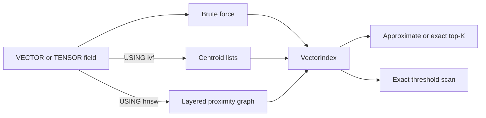

# Vector index architecture

This document defines the physical vector-index contract shared by the memory engine, SQLite storage, SQL DDL, catalog restore, and calibration checks. A vector field starts with exact brute-force search; `CREATE INDEX ... USING ivf` and `CREATE INDEX ... USING hnsw` install different algorithms and retain different catalog identities.

## Selection and SQL surface

IVF accepts `lists`/`nlist`, `probes`/`nprobe`, and `train_threshold`. HNSW accepts `m`, `ef_construction`, `ef_search`, `rebuild_threshold`, and `seed`; `m` must be at least two and `ef_construction` must be at least `m`. SQL rejects cross-algorithm and unknown parameters instead of translating one access method into the other.

Only one physical IVF or HNSW index may target a field at a time. `DROP INDEX` returns the field to brute-force search and removes the corresponding auxiliary metadata without deleting the canonical raw vectors.

## Shared identity and tensor behavior

Raw vectors are keyed by `(DocId, ordinal)`, so every element of a `TENSOR(N)` has a stable physical identity even though query results collapse all matching elements to one row. Top-K and threshold results keep the maximum cosine similarity per document and return posting storage in document-ID order; ranking is applied by the ranked-view boundary.

All mutation paths validate dimensions and finite components before replacing existing vectors. `search_threshold` remains exact for every backend because its public contract is a complete similarity predicate, while top-K may use IVF or HNSW approximation.

## IVF

IVF normalizes vectors, trains deterministic k-means centroids, and stores one inverted list per centroid. Below `train_threshold` it scans all vectors exactly; after training it probes the nearest `nprobe` centroids. Deletions move a sufficiently changed in-memory generation to `STALE`; a persistent backend may retrain at the mutation boundary, while a detached memory generation retrains before its next top-K query, and either path returns to `UNTRAINED` when the remaining corpus is below the threshold.

Each stored vector retains its raw norm beside the raw and normalized representations. Search normalizes the query and computes its raw norm once, uses normalized vectors for centroid selection, and computes raw cosine scores with the cached norms; this removes per-candidate norm reductions and square roots without changing the public score bits. Tensor candidates are sorted and compacted in one vector so document collapse does not allocate a tree node for every candidate.

The memory implementation is divided into state, math, training, mutation, search, restore, and trait-adapter modules. Relational SQLite uses separate lifecycle, loading, metadata, training, mutation, math, and search modules. The logical Key/Value implementation stores versioned metadata, centroid vectors, and assignments under independent ordered namespaces; a mutation updates canonical vectors and the affected physical entries in one atomic batch, while retraining replaces the complete centroid/assignment generation.

## HNSW

HNSW follows the layered navigable-small-world construction described by Malkov and Yashunin: deterministic seeded level selection, greedy descent through upper layers, bounded `ef_construction` search at insertion, heuristic neighbor selection, reciprocal edges, and degree pruning. Layer zero also reserves up to two of its `2m` slots for a deterministic insertion-order backbone. Those protected reciprocal edges keep the graph connected when many vectors are identical and ordinary distance/tie pruning would otherwise remove every route to a newer node. Upper layers permit `m` neighbors; graph validation checks these bounds, edge reciprocity, layer-zero reachability, node levels, entry-point metadata, counters, and references before a restored graph is published.

Updates use logical tombstones because changing a vector in place would invalidate graph neighborhoods. When tombstones reach `rebuild_threshold`, the graph compacts from live `(DocId, ordinal)` vectors. Top-K begins with `max(k, ef_search)` candidates and expands its beam when tensor collapse or tombstones leave fewer than `k` documents.

Graph traversal borrows adjacency slices from their nodes and tracks visited node IDs in a query-local hash set; it does not clone an adjacency vector for each expansion. Final scores reuse the query norm and each node's cached raw norm, while persisted snapshots continue to store canonical raw vectors and reconstruct derived norms during checked restore.

The implementation is deterministic for a fixed insertion order and seed, which makes persistence and differential tests reproducible. It is still an approximate nearest-neighbor algorithm: recall is measured against exhaustive search rather than claimed as an exact law. The primary algorithm reference is [Efficient and robust approximate nearest neighbor search using Hierarchical Navigable Small World graphs](https://arxiv.org/abs/1603.09320).

## Persistence and transactions

SQLite stores canonical raw vectors in `_vectors`, graph headers in `_hnsw_indexes`, nodes in `_hnsw_nodes`, and directed adjacency rows in `_hnsw_edges`. Initial index creation backfills raw vectors first and builds the graph once during `initialize`; restore validates the persisted header and loads nodes and edges lazily without rebuilding. A lazy load uses one SQLite read savepoint so metadata, nodes, edges, and canonical vectors come from one database snapshot, and every live graph vector must match its canonical `(DocId, ordinal)` value bit-for-bit.

Each graph header carries a monotonically increasing revision. A session cache is reused only while the persisted revision matches, so another session's commit and an outer transaction rollback invalidate stale cached generations. Mutations clone the immutable generation, update raw vectors and graph rows in one savepoint, compare the expected revision inside that savepoint, and publish the new generation only after persistence succeeds.

The logical Key/Value backend applies the same generation contract with separate namespaces for canonical vectors, the versioned HNSW header, and node payloads containing adjacency layers. Full rebuilds replace all nodes, ordinary mutations write only dirty nodes, and both paths share one atomic `KeyValueBatch` with canonical-vector changes. redb therefore restores a real HNSW graph and real IVF centroid lists rather than aliases or brute-force fallbacks; transaction rollback, savepoint rollback, reopen, and sibling-session generation refresh are covered at the engine boundary.

Table and column rename, drop, truncate, and migration helpers treat every backend's HNSW namespaces as owned index state. Missing metadata, mismatched dimensions or parameters, invalid counters, malformed vectors, canonical-vector drift, dangling edges, non-reciprocal edges, disconnected layer-zero graphs, and revision conflicts fail closed. Node and edge levels are bounded before adjacency allocation so corrupt metadata cannot request an unbounded layer vector.

## Verification and benchmarks

Unit tests cover graph invariants, large repeated-vector connectivity, tensor collapse, replacement, tombstone compaction, persistence round trips, malformed metadata, atomic write failure, cache refresh after commit and rollback, a default-parameter recall floor, and high-`ef_search` recall against brute force. Engine tests cover SQL DDL, catalog identity, physical state creation, vector and tensor query execution, redb and SQLite reopen, incremental changes, outer rollback, savepoint rollback, and sibling-session refresh. The existing `uqa-storage` `storage` executable retains focused physical-index microbenchmarks for brute-force, trained IVF, HNSW, training, and build operations. The checked [vector-search benchmark](../../benchmarks/vector-search/README.md) instead lives in the existing `uqa-engine` `retrieval_workloads` executable and measures a persistent SQLite database entirely through SQL load, SQL index DDL, reopen, and `Engine::sql` KNN queries; it compares IVF and HNSW SQL rows with exact SQL ground truth and emits recall@10, top-1 accuracy, MRR@10, exact-set rate, result completeness, similarity loss, shared-score error, per-query latency, queries per second, and SQL construction throughput. The former standalone `uqa-engine` KNN binary was removed, so these end-to-end SQL cases share the retrieval executable without conflating them with the storage module.
