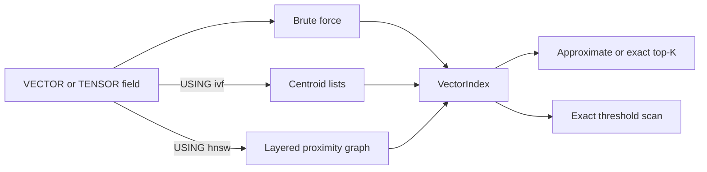

# Vector index architecture

This document defines the physical vector-index contract shared by the memory engine, SQLite storage, SQL DDL, catalog restore, and calibration checks. A vector field starts with exact brute-force search; `CREATE INDEX ... USING ivf` and `CREATE INDEX ... USING hnsw` install different algorithms and retain different catalog identities.

## Selection and SQL surface

IVF accepts `lists`/`nlist`, `probes`/`nprobe`, and `train_threshold`. HNSW accepts `m`, `ef_construction`, `ef_search`, `rebuild_threshold`, and `seed`; `m` must be at least two and `ef_construction` must be at least `m`. SQL rejects cross-algorithm and unknown parameters instead of translating one access method into the other.

Only one physical IVF or HNSW index may target a field at a time. `DROP INDEX` returns the field to brute-force search and removes the corresponding auxiliary metadata without deleting the canonical raw vectors.

## Shared identity and tensor behavior

Raw vectors are keyed by `(DocId, ordinal)`, so every element of a `TENSOR(N)` has a stable physical identity even though query results collapse all matching elements to one row. Top-K and threshold results keep the maximum cosine similarity per document and return posting storage in document-ID order; ranking is applied by the ranked-view boundary.

All mutation paths validate dimensions and finite components before replacing existing vectors. `search_threshold` remains exact for every backend because its public contract is a complete similarity predicate, while top-K may use IVF or HNSW approximation.

## IVF

IVF normalizes vectors, trains deterministic k-means centroids, and stores one inverted list per centroid. Below `train_threshold` it scans all vectors exactly; after training it probes the nearest `nprobe` centroids. Deletions move a sufficiently changed index to `STALE`, and the next query retrains or returns it to `UNTRAINED` when the remaining corpus is below the threshold.

The memory implementation is divided into state, math, training, mutation, search, and trait-adapter modules. SQLite uses separate lifecycle, loading, metadata, training, mutation, math, and search modules; vector replacement and its complete centroid/assignment snapshot commit in one savepoint.

## HNSW

HNSW follows the layered navigable-small-world construction described by Malkov and Yashunin: deterministic seeded level selection, greedy descent through upper layers, bounded `ef_construction` search at insertion, heuristic neighbor selection, reciprocal edges, and degree pruning. Layer zero also reserves up to two of its `2m` slots for a deterministic insertion-order backbone. Those protected reciprocal edges keep the graph connected when many vectors are identical and ordinary distance/tie pruning would otherwise remove every route to a newer node. Upper layers permit `m` neighbors; graph validation checks these bounds, edge reciprocity, layer-zero reachability, node levels, entry-point metadata, counters, and references before a restored graph is published.

Updates use logical tombstones because changing a vector in place would invalidate graph neighborhoods. When tombstones reach `rebuild_threshold`, the graph compacts from live `(DocId, ordinal)` vectors. Top-K begins with `max(k, ef_search)` candidates and expands its beam when tensor collapse or tombstones leave fewer than `k` documents.

The implementation is deterministic for a fixed insertion order and seed, which makes persistence and differential tests reproducible. It is still an approximate nearest-neighbor algorithm: recall is measured against exhaustive search rather than claimed as an exact law. The primary algorithm reference is [Efficient and robust approximate nearest neighbor search using Hierarchical Navigable Small World graphs](https://arxiv.org/abs/1603.09320).

## SQLite persistence and transactions

SQLite stores canonical raw vectors in `_vectors`, graph headers in `_hnsw_indexes`, nodes in `_hnsw_nodes`, and directed adjacency rows in `_hnsw_edges`. Initial index creation backfills raw vectors first and builds the graph once during `initialize`; restore validates the persisted header and loads nodes and edges lazily without rebuilding. A lazy load uses one SQLite read savepoint so metadata, nodes, edges, and canonical vectors come from one database snapshot, and every live graph vector must match its canonical `(DocId, ordinal)` value bit-for-bit.

Each graph header carries a monotonically increasing revision. A session cache is reused only while the persisted revision matches, so another session's commit and an outer transaction rollback invalidate stale cached generations. Mutations clone the immutable generation, update raw vectors and graph rows in one savepoint, compare the expected revision inside that savepoint, and publish the new generation only after persistence succeeds.

Table and column rename, drop, truncate, and migration helpers treat all three HNSW tables as owned index state. Missing metadata, mismatched dimensions or parameters, invalid counters, malformed vectors, canonical-vector drift, dangling edges, non-reciprocal edges, disconnected layer-zero graphs, and revision conflicts fail closed. Node and edge levels are bounded before adjacency allocation so corrupt metadata cannot request an unbounded layer vector.

## Verification and benchmarks

Unit tests cover graph invariants, large repeated-vector connectivity, tensor collapse, replacement, tombstone compaction, persistence round trips, malformed metadata, atomic write failure, cache refresh after commit and rollback, a default-parameter recall floor, and high-`ef_search` recall against brute force. Engine tests cover SQL DDL, catalog identity, physical table creation, vector and tensor query execution, and reopen. Criterion benchmarks report brute-force, trained IVF, and HNSW top-K separately, plus IVF training and HNSW build cost; benchmark names must not be merged because their construction and accuracy tradeoffs differ.
