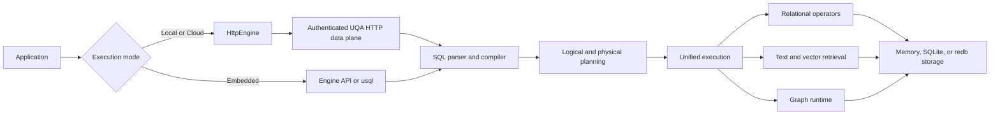

# UQA-RS Manual

This manual documents the behavior implemented by the current UQA-RS workspace. UQA-RS is an embedded database that combines PostgreSQL-oriented SQL, full-text retrieval, vector retrieval, graph queries, and ranked fusion in one Rust runtime, and its Rust HTTP client connects applications directly to local and Cloud UQA nodes.

The manual is divided by reader intent:

| Section | Use it for |
| --- | --- |
| [Reference manual](reference/README.md) | Engine APIs, the CLI, storage, search, graphs, and language bindings |
| [Tutorials](tutorials/README.md) | Complete, ordered exercises that build working databases |
| [Supported SQL](sql/README.md) | SQL statements, types, expressions, functions, retrieval, and compatibility |
| [Internals](internals/README.md) | Crate ownership, planning, execution, persistence, state, and extension contracts |

## LLM and agent entry points

Use the repository-root [llms.txt](../../llms.txt) as a compact discovery map, then follow its links into this manual for the complete contract. The map intentionally does not duplicate detailed syntax or behavior.

Codex and Claude Code can also discover the shared [UQA-RS skill](../../.agents/skills/uqa-rs/SKILL.md). The skill supplies the query-authoring and verification workflow; this manual remains authoritative for product behavior.

## File naming

Each section keeps `README.md` as its landing page and names every chapter `NN-topic.md` with a two-digit prefix. The numeric order matches the chapter order in that section's index; adding or moving a chapter requires updating its filename, displayed chapter number where applicable, and every inbound link in the same change.

## System at a glance

## Reading paths

New users should read the [quick start](reference/01-quick-start.md), then work through [Your first database](tutorials/01-first-database.md). Search users should pair [Search and ranking](reference/05-search-and-ranking.md) with [Text analyzer pipelines](reference/06-text-analyzers.md). SQL users can start at [Supported SQL](sql/README.md). Contributors should begin with [Internal architecture](internals/01-architecture.md) and then follow the owning subsystem.

## Conventions

- SQL keywords are shown in uppercase, but the parser accepts normal SQL case variations.
- Rust names such as `Engine::sql` identify public APIs.
- Examples use positional SQL parameters such as `$1` when values should not be interpolated into SQL text.
- A result score is available as the virtual `_score` column in ranked SQL queries.
- Mathematical definitions use LaTeX in display blocks and define every symbol close to the formula.
- Mermaid diagrams describe structure and flow. They are explanatory and do not replace the contracts stated in prose.
- SQL code fences are verified in CI. An unqualified `sql` fence must compile, `sql execute` runs in source order against one engine per file, and `sql compile-fail` must be intentionally rejected by the compiler.

## Version and compatibility scope

This manual targets UQA-RS 0.1.4 and Rust 1.90 or newer. UQA-RS implements a large PostgreSQL-oriented surface, but it is an embedded engine rather than a PostgreSQL server clone. The [compatibility guide](sql/09-compatibility.md) states important differences and unsupported behavior.

The implementation and tests are authoritative when behavior changes. Source paths are included throughout the internal documentation to make each claim traceable.
