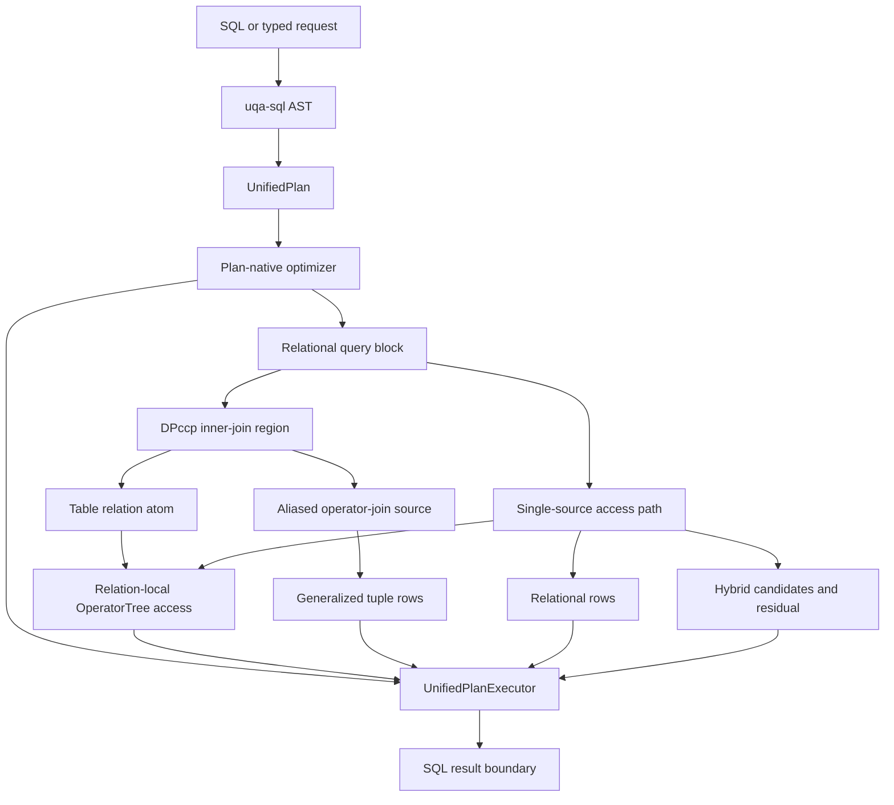

# Internal Architecture

UQA Engine unifies planning and execution without forcing SQL rows, document postings, graph contexts, and join tuples into one physical type. `uqa-engine` is the composition root; lower crates retain narrow ownership.

## Design goals

- One compiled planning boundary for relational SQL, retrieval, fusion, and graph operations
- Explicit carrier laws rather than implicit conversions between incompatible representations
- Replaceable persistence behind catalog and storage traits
- Transactional publication across rows, indexes, graphs, models, and caches
- Bounded blocking work through `work_mem`, spill structures, cursors, and columnar batches
- Errors propagated across every layer instead of converted to empty support

## Workspace layers

```mermaid
graph TD
    core[uqa-core]
    analysis[uqa-analysis]
    storage[uqa-storage]
    sqlite[uqa-storage-sqlite]
    redb[uqa-storage-redb]
    scoring[uqa-scoring]
    fusion[uqa-fusion]
    operators[uqa-operators]
    graph[uqa-graph]
    joins[uqa-joins]
    parser[uqa-pg-query]
    sql[uqa-sql]
    execution[uqa-execution]
    planner[uqa-planner]
    ml[uqa-ml]
    fdw[uqa-fdw]
    engine[uqa-engine]
    api[uqa-api]
    adapters[uqa-cli, uqa-pg-wire, Python, Node.js, WASM]
    analysis --> core
    storage --> core
    storage --> analysis
    sqlite --> storage
    sqlite --> graph
    sqlite --> analysis
    sqlite --> core
    redb --> storage
    scoring --> core
    scoring --> storage
    fusion --> scoring
    operators --> storage
    operators --> scoring
    operators --> fusion
    graph --> core
    graph --> analysis
    graph --> operators
    graph --> storage
    joins --> core
    joins --> graph
    joins --> sql
    sql --> core
    sql --> parser
    execution --> core
    execution --> analysis
    execution --> sql
    execution --> graph
    execution --> operators
    planner --> sql
    planner --> operators
    planner --> graph
    ml --> operators
    engine --> sql
    engine --> planner
    engine --> execution
    engine --> storage
    engine --> sqlite
    engine --> graph
    engine --> scoring
    engine --> fusion
    engine --> ml
    engine --> fdw
    api --> engine
    adapters --> engine
```

The executable dependency policy is stored in [`scripts/workspace-dependency-policy.json`](../../../scripts/workspace-dependency-policy.json) and checked by [`scripts/check-workspace-dependencies.py`](../../../scripts/check-workspace-dependencies.py). The policy checks exact runtime edges, dependency budgets, transitive workspace boundaries, forbidden provider packages, and source ownership paths, including build and platform-specific declarations. The engine directly depends on the SQLite provider because it composes the default persistent implementation; common storage, graph algorithms, SQL analysis, planning, and execution have no runtime dependency on that provider. Execution's SQLite spill implementation is separate from durable database ownership. Install `bash scripts/install-git-hooks.sh` to run the same check against the Git index on every commit. See [SQL crate boundaries](../../design/sql-crate-boundaries.md) for the ownership contracts.

## Crate responsibilities

| Crate | Ownership |
| --- | --- |
| `uqa-core` | Canonical relation identities, index catalog rows, values, exact decimal representation and operations, document sets, relations, posting lists, ranked views, generalized postings, predicates, and shared graph value types including agtype envelopes, ordering, and rendering |
| `uqa-analysis` | Character filters, tokenizers, token filters, analyzers, stemming, and highlighting primitives |
| `uqa-storage` | Backend-neutral document, inverted, vector, tensor, B-tree, block-max, spatial, catalog, ordered catalog-version migration, and Key/Value contracts |
| `uqa-storage-sqlite` | SQLite connections, catalog migrations, document and retrieval indexes, transactions, graph persistence, Key/Value storage, encryption, and compressed VFS |
| `uqa-storage-redb` | redb implementation and persistent session provider |
| `uqa-scoring` | BM25, Bayesian BM25, score domains, calibration, learning, WAND, and Block-Max WAND |
| `uqa-fusion` | Exact Bayesian evidence, positive-evidence pooling, probabilistic Boolean, learned, and attention fusion |
| `uqa-operators` | Retrieval, Boolean, staged, sparse, aggregation, fusion, and model operator trees |
| `uqa-graph` | Named graph stores, Cypher, RPQ automata, graph algebra, centrality, temporal traversal, and graph indexes |
| `uqa-joins` | Relational and cross-paradigm join algorithms |
| `uqa-pg-query` | Imported PostgreSQL 18 `libpg_query` pin used through the `pg_query` library name |
| `uqa-sql` | Parser frontend, AST, scalar and statement IR, lowering, catalog definitions, name and type binding, routine signature and stored-definition binding, overload ranking, replacement and privilege rules, prepared parameter inference, Cypher call and result-column rules, SQL validation, and value expressions |
| `uqa-execution` | Physical rows and buffers, runtime scalar evaluation, batches, materialization, spill structures, distinctness, sorting, grouping, windows, joins, routine definition, invocation, scoped caller-state restoration, privilege execution, table-function streams and result rows, and SQL Cypher invocation |
| `uqa-planner` | Cardinality, cost, statement statistics, prepared-plan estimates, rewrite-rule input pruning, DPccp join ordering, unified-plan optimization, and physical access selection |
| `uqa-engine` | Composition, SQL lifecycle, sessions, transactions, restore, publication, and public API |
| `uqa` | Application facade over `uqa-engine` with the core `Value` type re-exported |
| `uqa-fdw` | Foreign server and table contracts plus DuckDB, Arrow, and memory handlers |
| `uqa-ml` | Serializable model specifications, CPU inference, analytical training, and an experimental direct-crate MLX probe |
| `uqa-api` | Fluent `QueryBuilder` and result adapters |
| `uqa-pg-wire` | PostgreSQL v3 message decoding and encoding without server socket ownership |
| `uqa-cli`, `uqa-python`, `uqa-node`, `uqa-wasm` | User-facing adapters over the engine contract |

SQL binding receives immutable `BindingContext` inputs, `AnalysisCatalog` relation definitions, and `RoutineResolution` signature lookup. These contracts expose no physical operators, row buffers, transaction mutation, or engine recovery. Engine adapters preserve namespace privileges and statement snapshots while returning SQL-owned definitions. `uqa-sql` can reach only `uqa-core` and `uqa-pg-query`; importing the engine, planner, execution, or storage through another crate also violates the dependency policy.

## Carrier boundaries

| Representation | Identity and combination contract |
| --- | --- |
| `DocSet` | Document membership only; finite Boolean algebra relative to an explicit universe |
| `Relation<K>` | Finite-support mapping from document identity to a value in `K`; combination follows `K` |
| `PostingList` | Sorted unique document identities with payload collision rules for positions, scores, and fields |
| `RankedView` | Score order and top-K selection, separate from posting storage order |
| `GraphPostingList` | Document support plus invariant-checked graph context and explicit overlap policy |
| `GeneralizedPostingList` | Join tuple identity without inventing one scalar document identity |
| `PhysicalRow` and `RowSchema` | Positional SQL row values and qualified logical slot identity |

The support projection

$$
\mathrm{support}: \mathrm{PostingList} \rightarrow \mathrm{DocSet}
$$

is lossy because payload is removed. The supported round trip is

$$
\mathrm{support}(\mathrm{PostingList::from}(D)) = D.
$$

The reverse direction cannot reconstruct positions, scores, or fields. Optimizer laws that rely on idempotence therefore apply only to membership-only trees unless a payload-specific proof exists.

## Composition boundary



`uqa_sql::plan::UnifiedPlan` is the shared statement model; `uqa_sql::ir::ScalarExpr` is its scalar expression model. Planner and execution re-export the same types, without duplicate representations. The statement plan owns query blocks, command plans, CTEs, mutations, prepared bodies, and explained bodies. `OperatorTree` remains a specialized child algebra for posting, graph, scoring, fusion, model access, and tuple-producing operator joins; it does not absorb arbitrary SQL row semantics. A joined query can use an optimized `OperatorTree` as a table relation's local access path or use an aliased operator join as a costed relation source, so these are nested planning domains rather than mutually exclusive top-level planners.

All INSERT, UPDATE, DELETE, and MERGE entry points use one mutation-command boundary for implicit transaction selection and one scoped command overlay for statement-visible staged rows. The shared DML protocol owns typed candidates, physical identities, lock outcomes, row images, deferred checks, prepared insert/rewrite/delete actions, trigger and referential event state, and publication batches; command modules retain SQL-specific selection and policy, while spill codecs are versioned at the command boundary and reject malformed or unknown layouts.

Responsibility roots remain facades over semantic children rather than line-count fragments. SELECT execution, filter-pushdown subqueries, row-lock leaf validation, constraint rewriting and referencing, MERGE action execution, trigger transition tables, and indexed spill storage each have a dedicated owner. The repository rejects every hand-maintained Rust file at or above 1,000 physical lines and grants no root or module descendant-wide structural lint allowance; these guards preserve the implemented ownership map but do not replace its capability checks and behavior tests.

## Source entry points

| Area | Entry point |
| --- | --- |
| Core carriers | [`crates/uqa-core/src/lib.rs`](../../../crates/uqa-core/src/lib.rs) |
| Shared graph values | [`crates/uqa-core/src/agtype.rs`](../../../crates/uqa-core/src/agtype.rs) |
| Exact decimal value | [`crates/uqa-core/src/types/decimal`](../../../crates/uqa-core/src/types/decimal) |
| SQL compiler | [`crates/uqa-sql/src/compiler.rs`](../../../crates/uqa-sql/src/compiler.rs) |
| SQL value expressions and casting | [`crates/uqa-sql/src/expr`](../../../crates/uqa-sql/src/expr) |
| Planner | [`crates/uqa-planner/src/lib.rs`](../../../crates/uqa-planner/src/lib.rs) |
| Query optimizer | [`crates/uqa-planner/src/query_optimizer.rs`](../../../crates/uqa-planner/src/query_optimizer.rs) |
| Execution | [`crates/uqa-execution/src/lib.rs`](../../../crates/uqa-execution/src/lib.rs) |
| Physical scalar evaluation | [`crates/uqa-execution/src/scalar`](../../../crates/uqa-execution/src/scalar) |
| SQL scalar IR and traversal | [`crates/uqa-sql/src/ir`](../../../crates/uqa-sql/src/ir) |
| Routine signature resolution | [`crates/uqa-sql/src/type_resolution/routine_signature`](../../../crates/uqa-sql/src/type_resolution/routine_signature) |
| Catalog routine overloads | [`crates/uqa-sql/src/routines/resolution.rs`](../../../crates/uqa-sql/src/routines/resolution.rs) |
| Routine definition and privilege execution | [`crates/uqa-execution/src/routines`](../../../crates/uqa-execution/src/routines) |
| DISTINCT execution | [`crates/uqa-execution/src/distinct`](../../../crates/uqa-execution/src/distinct) |
| Hash-join execution | [`crates/uqa-execution/src/join`](../../../crates/uqa-execution/src/join) |
| Engine composition | [`crates/uqa-engine/src/lib.rs`](../../../crates/uqa-engine/src/lib.rs) |
| Engine capability adapters | [`crates/uqa-engine/src/capabilities.rs`](../../../crates/uqa-engine/src/capabilities.rs) |
| Statement catalog adapter | [`crates/uqa-engine/src/capabilities/catalog_execution.rs`](../../../crates/uqa-engine/src/capabilities/catalog_execution.rs) |
| Schema declaration binding adapter | [`crates/uqa-engine/src/capabilities/schema_analysis.rs`](../../../crates/uqa-engine/src/capabilities/schema_analysis.rs) |
| Unified plan dispatcher | [`crates/uqa-engine/src/sql/plan_executor.rs`](../../../crates/uqa-engine/src/sql/plan_executor.rs) |
| Mutation command entry | [`crates/uqa-execution/src/mutation/entry.rs`](../../../crates/uqa-execution/src/mutation/entry.rs) |
| Shared mutation state and snapshots | [`crates/uqa-execution/src/mutation/command_scope.rs`](../../../crates/uqa-execution/src/mutation/command_scope.rs) |
| Session portal workflow | [`crates/uqa-engine/src/sql/session_portal_worker.rs`](../../../crates/uqa-engine/src/sql/session_portal_worker.rs) |
| Catalog projection | [`crates/uqa-execution/src/catalog/projection.rs`](../../../crates/uqa-execution/src/catalog/projection.rs) |
| Catalog relation families | [`crates/uqa-execution/src/catalog/projection/pg_catalog.rs`](../../../crates/uqa-execution/src/catalog/projection/pg_catalog.rs) |
| Catalog projection policy | [`crates/uqa-execution/src/catalog/projection/helpers.rs`](../../../crates/uqa-execution/src/catalog/projection/helpers.rs) |
| SQL schema and parameter binding | [`crates/uqa-sql/src/binding`](../../../crates/uqa-sql/src/binding) |
| Statement binding context | [`crates/uqa-execution/src/query/binding/context.rs`](../../../crates/uqa-execution/src/query/binding/context.rs) |
| Query evaluation scopes | [`crates/uqa-engine/src/sql/select/evaluation.rs`](../../../crates/uqa-engine/src/sql/select/evaluation.rs) |
| SELECT command execution | [`crates/uqa-execution/src/query/statement/execution.rs`](../../../crates/uqa-execution/src/query/statement/execution.rs) |
| Filter-pushdown subqueries | [`crates/uqa-planner/src/filter_pushdown/subqueries.rs`](../../../crates/uqa-planner/src/filter_pushdown/subqueries.rs) |
| Row-lock leaf validation | [`crates/uqa-execution/src/query/locking/leaf_validation.rs`](../../../crates/uqa-execution/src/query/locking/leaf_validation.rs) |
| Physical query construction | [`crates/uqa-engine/src/sql/select/physical_plan.rs`](../../../crates/uqa-engine/src/sql/select/physical_plan.rs) |
| Constraint rewrite and referencing policy | [`crates/uqa-execution/src/mutation/constraints/`](../../../crates/uqa-execution/src/mutation/constraints) |
| Dependent constraint and column removal | [`schema/constraints/drop.rs`](../../../crates/uqa-execution/src/schema/constraints/drop.rs), [`schema/columns/removal.rs`](../../../crates/uqa-execution/src/schema/columns/removal.rs) |
| MERGE action execution | [`crates/uqa-execution/src/mutation/merge/actions.rs`](../../../crates/uqa-execution/src/mutation/merge/actions.rs) |
| Trigger transition tables | [`crates/uqa-execution/src/mutation/triggers/transitions.rs`](../../../crates/uqa-execution/src/mutation/triggers/transitions.rs) |
| Indexed spill storage | [`crates/uqa-execution/src/spill/indexed/`](../../../crates/uqa-execution/src/spill/indexed) |
| Storage contracts | [`crates/uqa-storage/src/lib.rs`](../../../crates/uqa-storage/src/lib.rs) |
| SQLite provider | [`crates/uqa-storage-sqlite/src/lib.rs`](../../../crates/uqa-storage-sqlite/src/lib.rs) |
| SQLite catalog migrations | [`crates/uqa-storage-sqlite/src/catalog/migration`](../../../crates/uqa-storage-sqlite/src/catalog/migration) |
| Exact WAND and Block-Max WAND | [`crates/uqa-scoring/src/wand`](../../../crates/uqa-scoring/src/wand) |
| Graph runtime | [`crates/uqa-graph/src/lib.rs`](../../../crates/uqa-graph/src/lib.rs) |

The longer [system architecture design](../../design/architecture.md) records detailed performance paths and design rationale.
