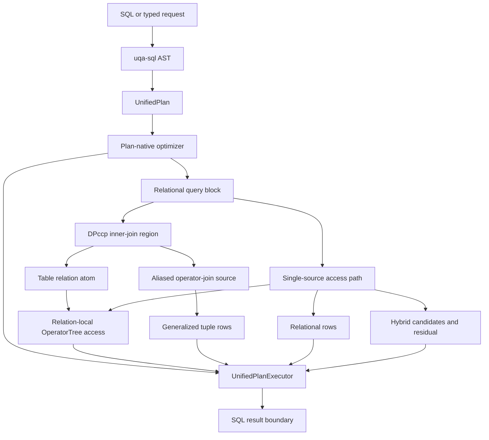

# Internal Architecture

UQA Engine unifies planning and execution without forcing SQL rows, document postings, graph contexts, and join tuples into one physical type. `uqa-engine` is the composition root; lower crates retain narrow ownership.

## Design goals

- One compiled planning boundary for relational SQL, retrieval, fusion, and graph operations
- Explicit carrier laws rather than implicit conversions between incompatible representations
- Replaceable persistence behind catalog and storage traits
- Transactional publication across rows, indexes, graphs, models, and caches
- Bounded blocking work through `work_mem`, spill structures, cursors, and columnar batches
- Errors propagated across every layer instead of converted to empty support

## Workspace layers

```mermaid
graph TD
    core[uqa-core]
    analysis[uqa-analysis]
    storage[uqa-storage]
    sqlite[uqa-storage-sqlite]
    redb[uqa-storage-redb]
    scoring[uqa-scoring]
    fusion[uqa-fusion]
    operators[uqa-operators]
    graph[uqa-graph]
    joins[uqa-joins]
    sql[uqa-sql]
    execution[uqa-execution]
    planner[uqa-planner]
    ml[uqa-ml]
    fdw[uqa-fdw]
    engine[uqa-engine]
    api[uqa-api]
    adapters[uqa-cli, uqa-pg-wire, Python, Node.js, WASM]
    analysis --> core
    storage --> core
    storage --> analysis
    sqlite --> storage
    redb --> storage
    scoring --> core
    scoring --> storage
    fusion --> scoring
    operators --> storage
    operators --> scoring
    operators --> fusion
    graph --> core
    joins --> core
    joins --> graph
    joins --> sql
    sql --> core
    execution --> core
    execution --> sql
    planner --> execution
    planner --> joins
    planner --> operators
    planner --> graph
    ml --> operators
    engine --> planner
    engine --> execution
    engine --> storage
    engine --> sqlite
    engine --> graph
    engine --> scoring
    engine --> fusion
    engine --> ml
    engine --> fdw
    api --> engine
    adapters --> engine
```

The executable dependency policy is stored in [`scripts/workspace-dependency-policy.json`](../../../scripts/workspace-dependency-policy.json) and checked by [`scripts/check-workspace-dependencies.py`](../../../scripts/check-workspace-dependencies.py). A new runtime dependency is an architecture change, not an incidental Cargo edit.

## Crate responsibilities

| Crate | Ownership |
| --- | --- |
| `uqa-core` | Values, exact decimal representation and operations, document sets, relations, posting lists, ranked views, generalized postings, predicates, and shared graph value types |
| `uqa-analysis` | Character filters, tokenizers, token filters, analyzers, stemming, and highlighting primitives |
| `uqa-storage` | Backend-neutral document, inverted, vector, tensor, B-tree, block-max, spatial, catalog, ordered catalog-version migration, and Key/Value contracts |
| `uqa-storage-sqlite` | SQLite implementation of the ordered Key/Value contract |
| `uqa-storage-redb` | redb implementation and persistent session provider |
| `uqa-scoring` | BM25, Bayesian BM25, score domains, calibration, learning, WAND, and Block-Max WAND |
| `uqa-fusion` | Exact Bayesian evidence, positive-evidence pooling, probabilistic Boolean, learned, and attention fusion |
| `uqa-operators` | Retrieval, Boolean, staged, sparse, aggregation, fusion, and model operator trees |
| `uqa-graph` | Named graph stores, Cypher, RPQ automata, graph algebra, centrality, temporal traversal, and graph indexes |
| `uqa-joins` | Relational and cross-paradigm join algorithms |
| `uqa-pg-query` | Imported PostgreSQL 18 `libpg_query` pin used through the `pg_query` library name |
| `uqa-sql` | `uqa-pg-query` frontend, SQL AST, statement compiler, syntax registry, value-expression dispatch, and PostgreSQL-compatible value casting |
| `uqa-execution` | Pull-based physical rows, physical scalar IR and evaluation, routine type resolution, batches, spill structures, distinctness, sorting, grouping, windows, and joins |
| `uqa-planner` | Cardinality, cost, DPccp join ordering, unified-plan optimization, and physical access selection |
| `uqa-engine` | Composition, SQL lifecycle, sessions, transactions, restore, publication, and public API |
| `uqa` | Application facade over `uqa-engine` with the core `Value` type re-exported |
| `uqa-fdw` | Foreign server and table contracts plus DuckDB, Arrow, and memory handlers |
| `uqa-ml` | Serializable model specifications, CPU inference, analytical training, and an experimental direct-crate MLX probe |
| `uqa-api` | Fluent `QueryBuilder` and result adapters |
| `uqa-pg-wire` | PostgreSQL v3 message decoding and encoding without server socket ownership |
| `uqa-cli`, `uqa-python`, `uqa-node`, `uqa-wasm` | User-facing adapters over the engine contract |

## Carrier boundaries

| Representation | Identity and combination contract |
| --- | --- |
| `DocSet` | Document membership only; finite Boolean algebra relative to an explicit universe |
| `Relation<K>` | Finite-support mapping from document identity to a value in `K`; combination follows `K` |
| `PostingList` | Sorted unique document identities with payload collision rules for positions, scores, and fields |
| `RankedView` | Score order and top-K selection, separate from posting storage order |
| `GraphPostingList` | Document support plus invariant-checked graph context and explicit overlap policy |
| `GeneralizedPostingList` | Join tuple identity without inventing one scalar document identity |
| `PhysicalRow` and `RowSchema` | Positional SQL row values and qualified logical slot identity |

The support projection

$$
\mathrm{support}: \mathrm{PostingList} \rightarrow \mathrm{DocSet}
$$

is lossy because payload is removed. The supported round trip is

$$
\mathrm{support}(\mathrm{PostingList::from}(D)) = D.
$$

The reverse direction cannot reconstruct positions, scores, or fields. Optimizer laws that rely on idempotence therefore apply only to membership-only trees unless a payload-specific proof exists.

## Composition boundary



`UnifiedPlan` is the shared executable boundary. It can own query blocks, command plans, CTEs, mutations, prepared bodies, and explained bodies. `OperatorTree` remains a specialized child algebra for posting, graph, scoring, fusion, model access, and tuple-producing operator joins; it does not absorb arbitrary SQL row semantics. A joined query can use an optimized `OperatorTree` as a table relation's local access path or use an aliased operator join as a costed relation source, so these are nested planning domains rather than mutually exclusive top-level planners.

All INSERT, UPDATE, DELETE, and MERGE entry points use one mutation-command boundary for implicit transaction selection and one scoped command overlay for statement-visible staged rows. The shared DML protocol owns typed candidates, physical identities, lock outcomes, row images, deferred checks, prepared insert/rewrite/delete actions, trigger and referential event state, and publication batches; command modules retain SQL-specific selection and policy, while spill codecs are versioned at the command boundary and reject malformed or unknown layouts.

Responsibility roots remain facades over semantic children rather than line-count fragments. SELECT execution, filter-pushdown subqueries, row-lock leaf validation, constraint rewriting and referencing, MERGE action execution, trigger transition tables, and indexed spill storage each have a dedicated owner. The repository rejects every hand-maintained Rust file at or above 1,000 physical lines and grants no root or module descendant-wide structural lint allowance; these guards preserve the implemented ownership map but do not replace its capability checks and behavior tests.

## Source entry points

| Area | Entry point |
| --- | --- |
| Core carriers | [`crates/uqa-core/src/lib.rs`](../../../crates/uqa-core/src/lib.rs) |
| Exact decimal value | [`crates/uqa-core/src/types/decimal`](../../../crates/uqa-core/src/types/decimal) |
| SQL compiler | [`crates/uqa-sql/src/compiler.rs`](../../../crates/uqa-sql/src/compiler.rs) |
| SQL value expressions and casting | [`crates/uqa-sql/src/expr`](../../../crates/uqa-sql/src/expr) |
| Planner | [`crates/uqa-planner/src/lib.rs`](../../../crates/uqa-planner/src/lib.rs) |
| Query optimizer | [`crates/uqa-planner/src/query_optimizer.rs`](../../../crates/uqa-planner/src/query_optimizer.rs) |
| Execution | [`crates/uqa-execution/src/lib.rs`](../../../crates/uqa-execution/src/lib.rs) |
| Physical scalar evaluation | [`crates/uqa-execution/src/scalar`](../../../crates/uqa-execution/src/scalar) |
| Physical scalar traversal | [`crates/uqa-execution/src/scalar/traversal.rs`](../../../crates/uqa-execution/src/scalar/traversal.rs) |
| Routine signature resolution | [`crates/uqa-execution/src/type_resolution/routine_signature`](../../../crates/uqa-execution/src/type_resolution/routine_signature) |
| DISTINCT execution | [`crates/uqa-execution/src/distinct`](../../../crates/uqa-execution/src/distinct) |
| Hash-join execution | [`crates/uqa-execution/src/join`](../../../crates/uqa-execution/src/join) |
| Engine composition | [`crates/uqa-engine/src/lib.rs`](../../../crates/uqa-engine/src/lib.rs) |
| Engine capability adapters | [`crates/uqa-engine/src/engine_capabilities.rs`](../../../crates/uqa-engine/src/engine_capabilities.rs) |
| Statement catalog snapshot | [`crates/uqa-engine/src/engine_capabilities/catalog.rs`](../../../crates/uqa-engine/src/engine_capabilities/catalog.rs) |
| Unified plan dispatcher | [`crates/uqa-engine/src/sql/plan_executor.rs`](../../../crates/uqa-engine/src/sql/plan_executor.rs) |
| Shared mutation protocol | [`crates/uqa-engine/src/sql/dml/protocol.rs`](../../../crates/uqa-engine/src/sql/dml/protocol.rs) |
| Session portal workflow | [`crates/uqa-engine/src/sql/session_portal_worker.rs`](../../../crates/uqa-engine/src/sql/session_portal_worker.rs) |
| Catalog projection | [`crates/uqa-engine/src/sql/catalog.rs`](../../../crates/uqa-engine/src/sql/catalog.rs) |
| Catalog relation families | [`crates/uqa-engine/src/sql/catalog/pg_catalog.rs`](../../../crates/uqa-engine/src/sql/catalog/pg_catalog.rs) |
| Catalog projection policy | [`crates/uqa-engine/src/sql/catalog/helpers.rs`](../../../crates/uqa-engine/src/sql/catalog/helpers.rs) |
| Schema binding | [`crates/uqa-engine/src/sql/select/schema_binding.rs`](../../../crates/uqa-engine/src/sql/select/schema_binding.rs) |
| Query evaluation scopes | [`crates/uqa-engine/src/sql/select/evaluation.rs`](../../../crates/uqa-engine/src/sql/select/evaluation.rs) |
| SELECT command execution | [`crates/uqa-engine/src/sql/select/execution.rs`](../../../crates/uqa-engine/src/sql/select/execution.rs) |
| Filter-pushdown subqueries | [`crates/uqa-engine/src/sql/select/filter_pushdown/subqueries.rs`](../../../crates/uqa-engine/src/sql/select/filter_pushdown/subqueries.rs) |
| Row-lock leaf validation | [`crates/uqa-engine/src/sql/select/row_locking/leaf_validation.rs`](../../../crates/uqa-engine/src/sql/select/row_locking/leaf_validation.rs) |
| Physical query construction | [`crates/uqa-engine/src/sql/select/physical_plan.rs`](../../../crates/uqa-engine/src/sql/select/physical_plan.rs) |
| Constraint rewrite and referencing policy | [`crates/uqa-engine/src/sql/dml/constraints/`](../../../crates/uqa-engine/src/sql/dml/constraints) |
| MERGE action execution | [`crates/uqa-engine/src/sql/dml/merge/execution.rs`](../../../crates/uqa-engine/src/sql/dml/merge/execution.rs) |
| Trigger transition tables | [`crates/uqa-engine/src/sql/triggers/transitions.rs`](../../../crates/uqa-engine/src/sql/triggers/transitions.rs) |
| Indexed spill storage | [`crates/uqa-execution/src/spill/indexed/`](../../../crates/uqa-execution/src/spill/indexed) |
| Storage contracts | [`crates/uqa-storage/src/lib.rs`](../../../crates/uqa-storage/src/lib.rs) |
| SQLite catalog migrations | [`crates/uqa-storage/src/sqlite/catalog/migration`](../../../crates/uqa-storage/src/sqlite/catalog/migration) |
| Exact WAND and Block-Max WAND | [`crates/uqa-scoring/src/wand`](../../../crates/uqa-scoring/src/wand) |
| Graph runtime | [`crates/uqa-graph/src/lib.rs`](../../../crates/uqa-graph/src/lib.rs) |

The longer [system architecture design](../../design/architecture.md) records detailed performance paths and design rationale.
