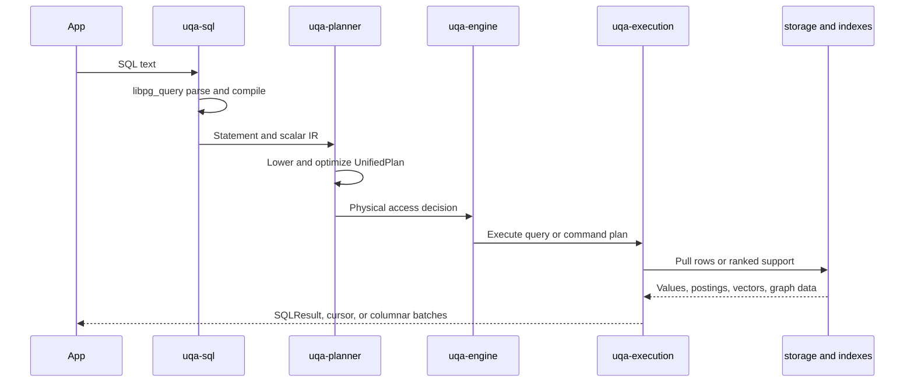

# Planning and Execution

Every compiled statement follows one top-level path: SQL statement, unified lowering, plan-native optimization, and `UnifiedPlanExecutor`. There is no separate top-level row dispatcher that bypasses the unified executor.

## End-to-end pipeline

## SQL frontend

`uqa-sql` translates `libpg_query` protobuf nodes into owned UQA-RS statements and expressions. It owns syntax validation and rejects unsupported clauses before the engine can lose their meaning. It does not depend on concrete storage, scoring, or graph implementations.

Retrieval function calls remain syntax expressions until the engine and planner can resolve table fields, indexes, parameters, and execution capabilities.

## UnifiedPlan

The plan owns read queries and physical command bodies. Relational query blocks cover CTEs, set operations, joins, values and function sources, subqueries, filters, scalar projection, aggregation, windows, ordering, distinctness, offset, and limit. Mutation plans own sources, scalar assignments, conflict behavior, conditions, CTEs, and `RETURNING` expressions.

`ScalarExpr` is the executable scalar IR. Scalar subqueries point to owned query-plan slots and execute inside the current physical scope; the executor does not reconstruct a parser statement at runtime.

## Access path selection

The optimizer chooses among three broad query access shapes:

| Shape | Use |
| --- | --- |
| Relational row path | Scans, joins, aggregates, windows, row predicates, and ordinary SQL |
| Hybrid posting plus residual path | Retrieval creates candidate support, then relational predicates or projections consume rows |
| `OperatorTree` path | Posting-list, graph, scoring, fusion, staged, sparse, and model operators |

An accelerated retrieval leaf consumes its search expression. Field names remain index dependencies, but the physical row projection fetches only columns needed by output, ordering, grouping, facets, and unexecuted residual predicates. This avoids decoding a stored vector merely because it appeared as the KNN argument.

## Plan-native optimization

Optimization recursively visits query blocks, CTEs, set-operation branches, scalar subqueries, mutations, prepared bodies, and explained bodies. Important passes include predicate handling, access selection, join order, ordering propagation, score top-K selection, and specialized `OperatorTree` rewrites.

`OperatorTree` runs through `QueryOptimizer`, then `PlanExecutor`, then the engine driver. The driver match is exhaustive; an unknown opaque operator fails explicitly.

Membership idempotence and absorption use address-independent structural equivalence only when every affected subtree produces membership with default payload. Scored or decorated duplicate leaves are not eliminated because doing so could change their score or payload collision result.

## Join planning

The unified optimizer flattens reorderable inner-join regions without crossing outer or lateral boundaries. DPccp reads current row and column statistics and selects a join order using the physical algorithms actually available.

Clean equality predicates between qualified columns select hash join. Other predicates select nested-loop join. A physical hash plan is rejected if equality keys cannot be recovered; an unavailable index join cannot influence plan cost.

## Physical rows

`RowSchema` maps logical output identities and hidden qualified aliases to flattened slots. `PhysicalRow` stores a small vector of shared value fragments. Selection and renaming usually remap schema slots, while joins concatenate fragment handles instead of rebuilding string-keyed maps and cloning every value.

Duplicate projected labels remain separate slots through execution and the columnar boundary. The compatibility `SQLResult` converts a row to `BTreeMap<String, Value>`, so repeated labels overwrite under the established map behavior. Consumers that need positional duplicates should use a cursor or columnar batches.

## Pull execution and blocking operators

Physical relational operators are pull-based and exchange batches of dynamic `Value` instances. Filters can compile projected predicates once and evaluate positions directly. Aggregates use streaming state and adaptive grouping where possible.

Sort, distinct, set operations, ordered aggregates, windows, grouping output, joins, and result materialization account against `work_mem`. When a blocking structure exceeds its budget, it uses the execution spill layer instead of retaining unbounded process memory.

Single-consumer derived-table projections can remain pull pipelines. Repeatable, volatile, blocking, or otherwise unsafe derived tables retain materialization, and repeatable CTE readers use `SharedSpill`.

## Hash joins and spill

Eligible unique-key inner joins hash borrowed physical slots and retain positions into the build row store. Hash matches are verified against original slots. If the direct structure exceeds its budget, execution rebuilds the canonical encoded-key index and uses the disk-spill path. General and outer hash joins use the exact encoded path, with right and full match state kept within bounded storage.

## Score cutoff optimization

For an eligible `ORDER BY _score DESC ... LIMIT` with no residual predicate or cardinality-changing computation, execution can partition the completed exact score carrier at `LIMIT + OFFSET`. It retains every entry tied at the cutoff score before document fetch. The ordinary relational sort, secondary keys, limit, and offset still produce the final rows.

Distinct, aggregate, window, facet, volatile-limit, and residual-filter shapes do not use this cutoff because early truncation could change semantics.

## Statement and prepared caches

The exact SQL statement cache retains parsed and lowered plans. In-memory read-only calls can reuse optimized plans while relevant epochs remain unchanged. Persistent execution pins the current storage snapshot before using or optimizing a plan.

Prepared statements and stored views retain plans but are rebound or invalidated after relevant catalog and function registry changes. A cache hit is never authority to ignore a changed schema, index, routine, model, or analyzer.

## Result boundaries

| API | Boundary behavior |
| --- | --- |
| `Engine::sql` | Fully materializes `SQLResult` rows as maps |
| `Engine::sql_cursor` | Seals one read result through bounded spill, commits the snapshot, and returns row iteration |
| `Engine::sql_columnar` | Seals the result and supplies schema-ordered `ColumnarBatch` values to a callback |

A uniquely owned in-memory cursor can move batches without cloning. Shared CTE readers remain repeatable.

## Failure invariant

Parsing, lowering, planning, storage, filter, callback, spill, and physical execution errors must propagate. Returning empty support for an internal failure is a semantic corruption because it makes an error indistinguishable from a correct no-match result.
