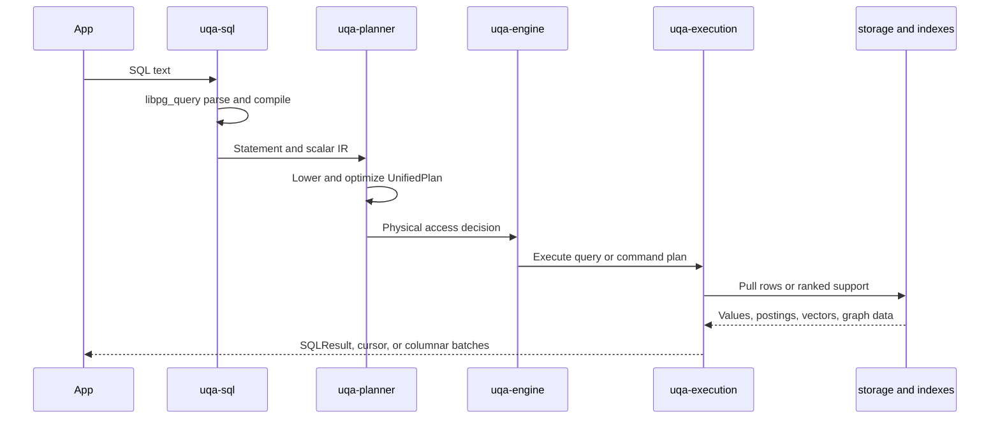

# Planning and Execution

Every compiled statement follows one top-level path: SQL statement, unified lowering, plan-native optimization, and `UnifiedPlanExecutor`. There is no separate top-level row dispatcher that bypasses the unified executor.

## End-to-end pipeline

## SQL frontend

`uqa-sql` translates `libpg_query` protobuf nodes into owned UQA Engine statements and expressions. It owns syntax validation and rejects unsupported clauses before the engine can lose their meaning. It does not depend on concrete storage, scoring, or graph implementations.

Retrieval function calls remain syntax expressions until the engine and planner can resolve table fields, indexes, parameters, and execution capabilities.

## UnifiedPlan

The plan owns read queries and physical command bodies. Relational query blocks cover CTEs, set operations, joins, values and function sources, subqueries, filters, scalar projection, aggregation, windows, ordering, distinctness, offset, and limit. Mutation plans own sources, scalar assignments, conflict behavior, conditions, CTEs, and `RETURNING` expressions.

`ScalarExpr` is the executable scalar IR. Scalar subqueries point to owned query-plan slots and execute inside the current physical scope; the executor does not reconstruct a parser statement at runtime.

## Access path selection

The optimizer chooses among three broad query access shapes inside one `UnifiedPlan` hierarchy:

| Shape | Use |
| --- | --- |
| Relational row path | Scans, joins, aggregates, windows, row predicates, and ordinary SQL |
| Hybrid posting plus residual path | Retrieval creates candidate support, then relational predicates or projections consume rows |
| `OperatorTree` path | Posting-list, graph, scoring, fusion, staged, sparse, and model operators |

An accelerated retrieval leaf consumes its search expression. Field names remain index dependencies, but the physical row projection fetches only columns needed by output, ordering, grouping, facets, and unexecuted residual predicates. This avoids decoding a stored vector merely because it appeared as the KNN argument.

In a join block, each table keeps its relation identity while its relation-local `WHERE` predicates are lowered through the same `OperatorTree`, `QueryOptimizer`, cardinality estimator, and cost model used by execution. For example, literal `knn_match(embedding, query, 3)` contributes an estimated support of three rows, clamped by the table cardinality, rather than a generic percentage. Text document frequencies, analyzed column distinct counts, vector dimensions, graph statistics, and executable access costs remain attached to that relation when DPccp compares join orders.

Tuple-producing operator joins are SQL table-function sources. `text_similarity_join`, `vector_similarity_join`, `graph_join`, `hybrid_join`, and `cross_paradigm_join` lower to `OperatorTree` join nodes, execute as `GeneralizedPostingList`, expose `left_doc_id`, `right_doc_id`, and `_score`, and can participate in a larger relational join when given an alias. Their first SQL argument is compiled into a dedicated relation reference rather than a scalar expression, so catalog binding, `search_path`, stored-view dependencies, and optimizer statistics use the same relation identity as an ordinary table source.

## Plan-native optimization

Optimization recursively visits query blocks, CTEs, set-operation branches, scalar subqueries, mutations, prepared bodies, and explained bodies. Important passes include predicate handling, access selection, join order, ordering propagation, score top-K selection, and specialized `OperatorTree` rewrites.

`OperatorTree` runs through `QueryOptimizer`, then `PlanExecutor`, then the engine driver. The driver match is exhaustive; an unknown opaque operator fails explicitly.

Membership idempotence and absorption use address-independent structural equivalence only when every affected subtree produces membership with default payload. Scored or decorated duplicate leaves are not eliminated because doing so could change their score or payload collision result.

## Join planning

The unified optimizer flattens reorderable inner-join regions without crossing outer or lateral boundaries. A region can contain ordinary tables and aliased, fully bound operator-join table-function sources. DPccp performs exact connected-subgraph/complement enumeration through 16 relations and uses its greedy fallback above that threshold.

Every DPccp leaf carries the executable local access cost, including an optimized `OperatorTree` access when one was selected. Candidate equijoins use `CostEstimator` with the executable hash-join operator, disconnected components use its cross-join operator, and the chosen physical kind is retained in the materialized plan. Only clean equality predicates between qualified columns become join-graph edges; other predicates remain semantic guards on the reconstructed join tree. A physical hash plan is rejected if equality keys cannot be recovered, and an unavailable index join cannot influence plan cost.

For an equijoin candidate with subplans `P_1` and `P_2`, DPccp accumulates executable child access cost and the shared physical hash-join cost rather than substituting `|P_1| + |P_2|` as the complete plan cost.

$$
C(P_1 \bowtie P_2)
=
C(P_1)+C(P_2)+C_{\mathrm{hash}}\!\left(\widehat{|P_1|},\widehat{|P_2|}\right)
$$

Vector threshold selectivity is a continuous, dimension-aware normal approximation to the spherical-cap tail. Here `Phi` is the standard-normal cumulative distribution function and `d` is the bound vector dimension.

$$
\widehat{s}_{\mathrm{vec}}(\tau,d)
=
\begin{cases}
1, & \tau\le -1,\\
1-\Phi\!\left(\tau\sqrt{\max(d,1)}\right), & -1<\tau<1,\\
0, & \tau\ge 1.
\end{cases}
$$

Let `L` and `R` be estimated operand cardinalities, `N` the table cardinality, `V` the graph vertex count, `d_bar` the average out-degree, and `s_label` the edge-label selectivity. Typed operator joins use the following cardinality models; no four-tier vector threshold table is involved.

$$
\begin{aligned}
\widehat{J}_{\mathrm{vec}}
&=LR\,\widehat{s}_{\mathrm{vec}}(\tau,d),\\
\widehat{J}_{\mathrm{graph}}
&=LR\min\!\left(\frac{\bar d\,s_{\mathrm{label}}}{\max(V,1)},1\right),\\
\widehat{J}_{\mathrm{hybrid}}
&=\frac{LR}{\max(N,1)}\,\widehat{s}_{\mathrm{vec}}(0.5,d),\\
\widehat{J}_{\mathrm{cross}}
&=\frac{LR}{\max(N,1)}.
\end{aligned}
$$

The cross-paradigm physical cost is recursive child work plus the shared hash-join model, not a constant multiple of table cardinality. Vector similarity uses nested-loop pair comparison scaled by dimension; hybrid join pays a hash equality phase followed by vector comparison only for equality candidates.

$$
\begin{aligned}
C_{\mathrm{cross}}
&=C(L)+C(R)+C_{\mathrm{hash}}(L,R),\\
C_{\mathrm{vec}}
&=C(L)+C(R)+d\,C_{\mathrm{nested}}(L,R),\\
Q
&=\frac{LR}{\max(N,1)},\\
C_{\mathrm{hybrid}}
&=C(L)+C(R)+C_{\mathrm{hash}}(L,R)+d\,C_{\mathrm{nested}}(Q,1).
\end{aligned}
$$

Graph estimates bind live graph size, edge count, label distribution, average degree, degree distribution, vertex-label counts, label-specific degree, and temporal range. Pattern estimates over graphs larger than 10,000 vertices may also use random-walk samples from the bound graph store. The `Filter(Traverse(...))` rewrite moves an eligible graph-property predicate into the traversal vertex predicate so BFS can prune during expansion; an ordinary SQL table filter remains a relational filter unless it was explicitly lowered as a graph-property predicate.

## Physical rows

`RowSchema` maps logical output identities and hidden qualified aliases to flattened slots. `PhysicalRow` stores a small vector of shared value fragments. Selection and renaming usually remap schema slots, while joins concatenate fragment handles instead of rebuilding string-keyed maps and cloning every value.

Correlated subqueries use a positional `ScopeOverlay`: current-query columns remain visible, one shared outer-row fragment is addressable only through hidden lookup aliases, current names shadow outer names, and ambiguity remains scoped without rebuilding a merged map for every inner row.

Duplicate projected labels remain separate slots through execution and the columnar boundary. `SQLResult` retains its named `BTreeMap<String, Value>` rows for existing callers and, only when labels repeat, also preserves the final positional row values; `SQLResult::value_at`, cursors, columnar batches, the CLI, and wire consumers distinguish those values without materializing maps between operators.

## Pull execution and blocking operators

Physical relational operators are pull-based and exchange batches of dynamic `Value` instances. Filters can compile projected predicates once and evaluate positions directly. Aggregates use streaming state and adaptive grouping where possible.

Sort, distinct, set operations, ordered aggregates, windows, grouping output, joins, and result materialization account against `work_mem`. When a blocking structure exceeds its budget, it uses the execution spill layer instead of retaining unbounded process memory.

Spill format version 1 keeps rows positional: each batch records its exact physical width and logical-column and hidden `(qualifier, column)` alias-to-slot layout once, followed by physical values, while indexed random-access spill retains that exact layout in its owner and writes only row values plus offsets. Spill paths do not construct or serialize `ResultRow` maps, and temporary spill files have no cross-version compatibility contract.

Single-consumer derived-table projections can remain pull pipelines. Repeatable, volatile, blocking, or otherwise unsafe derived tables retain materialization, and repeatable CTE readers use `SharedSpill`.

## Hash joins and spill

Eligible unique-key inner joins hash borrowed physical slots and retain positions into the build row store. Hash matches are verified against original slots. If the direct structure exceeds its budget, execution rebuilds the canonical encoded-key index and uses the disk-spill path. General and outer hash joins use the exact encoded path, with right and full match state kept within bounded storage.

## Score cutoff optimization

For an eligible `ORDER BY _score DESC ... LIMIT` with no residual predicate or cardinality-changing computation, execution can partition the completed exact score carrier at `LIMIT + OFFSET`. It retains every entry tied at the cutoff score before document fetch. The ordinary relational sort, secondary keys, limit, and offset still produce the final rows.

Distinct, aggregate, window, facet, volatile-limit, and residual-filter shapes do not use this cutoff because early truncation could change semantics.

## Statement and prepared caches

The exact SQL statement cache retains parsed and lowered plans. In-memory read-only calls can reuse optimized plans while relevant epochs remain unchanged. Persistent execution pins the current storage snapshot before using or optimizing a plan.

Prepared statements and stored views retain plans but are rebound or invalidated after relevant catalog and function registry changes. A cache hit is never authority to ignore a changed schema, index, routine, model, or analyzer.

## Result boundaries

| API | Boundary behavior |
| --- | --- |
| `Engine::sql` | Fully materializes `SQLResult` rows as maps |
| `Engine::sql_cursor` | Seals one read result through bounded spill, commits the snapshot, and returns row iteration |
| `Engine::sql_columnar` | Seals the result and supplies schema-ordered `ColumnarBatch` values to a callback |

A uniquely owned in-memory cursor can move batches without cloning. Shared CTE readers remain repeatable.

## Failure invariant

Parsing, lowering, planning, storage, filter, callback, spill, and physical execution errors must propagate. Returning empty support for an internal failure is a semantic corruption because it makes an error indistinguishable from a correct no-match result.
