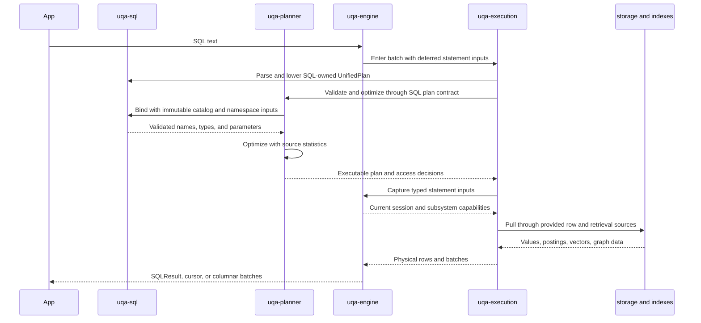
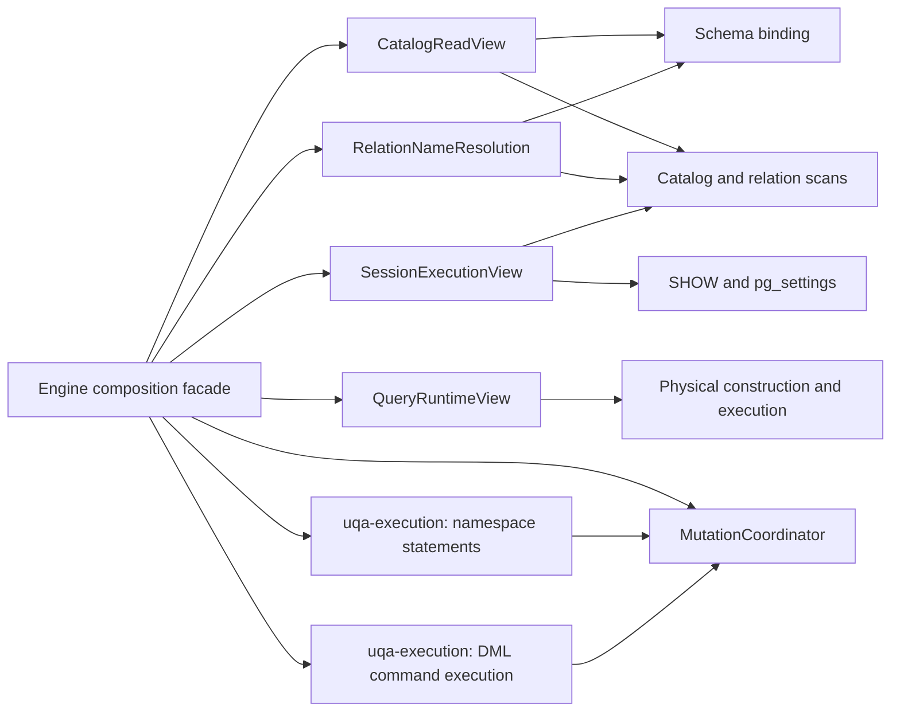

# Planning and Execution

Every compiled statement follows one top-level path: SQL statement, unified lowering, semantic analysis, plan-native optimization, and `UnifiedPlanExecutor`. There is no separate top-level row dispatcher that bypasses the unified executor.

[Statement planning](../../../crates/uqa-planner/src/statement_planning/executable.rs) schedules [SQL statement analysis](../../../crates/uqa-sql/src/binding/statements.rs) before capturing optimizer inputs or evaluating constants. Each recursive EXPLAIN analysis captures a fresh statement scope; query-bearing commands analyze their query schema, while mutation commands validate parameters before their result schema. Engine supplies scope capture and the existing planner metadata through typed adapters. Scoped Engine function callbacks live under [`capabilities/query_expressions.rs`](../../../crates/uqa-engine/src/capabilities/query_expressions.rs); scalar-subquery result types bind through execution after checking the query-arena slot and retain the original outer schema and declared parameter types.

[The unified dispatcher](../../../crates/uqa-execution/src/statement/plan_executor.rs) lives in execution and exhaustively handles query and command plans. [Entry validation](../../../crates/uqa-execution/src/statement/validation.rs) checks cancellation, captures namespace inputs for SQL CTE validation, and validates transaction access before observing failed-transaction state or dispatching a command. Queries acquire relation locks before capturing their statement scope; mutations fill only missing privilege subjects. EXPLAIN ANALYZE enters the same nested executor with the caller’s privilege subject, and EXECUTE binds arguments before selecting and running its plan. CALL validates markers and argument types before borrowing expression hooks, evaluates arguments, then captures invocation inputs. Engine supplies [typed subsystem adapters](../../../crates/uqa-engine/src/capabilities/statements.rs); top-level runtime inputs contain only cancellation and notices. EXPLAIN measurements are SQL-owned values consumed by the planner renderer, so execution gains no planner dependency.

[Compiled-statement execution](../../../crates/uqa-execution/src/statement/compiled.rs) lowers routine and rule statements, retains catalog-bound relation identities before planning, and captures execution inputs only after analysis and optimization succeed. Engine owns the [query API gate and statement clock](../../../crates/uqa-engine/src/queries.rs), including nested calls and error restoration, while [document reads](../../../crates/uqa-engine/src/table_storage/reads.rs) retain the current command overlay and count cache. The public `uqa_engine::sql` namespace re-exports [native result definitions](../../../crates/uqa-execution/src/result.rs); there is no Engine SQL implementation tree.

[Prepared definition analysis](../../../crates/uqa-sql/src/prepared/definition.rs) resolves declarations before separately retaining parameter-inference and result-descriptor scopes. [Native registration](../../../crates/uqa-execution/src/statement/prepared.rs) takes the session registry write guard before constructing cached metadata and sampling the registration clock. [Prepared selection](../../../crates/uqa-planner/src/statement_planning/prepared/selection.rs) validates changed result descriptors, rechecks the first generic plan’s cost and specializes custom parameters before recording usage. Engine preserves the original read-clone and write-publication boundaries, including the logical-plan Arc identity check when a definition was replaced or deallocated.

## End-to-end pipeline

## SQL frontend

`uqa-sql` translates `libpg_query` protobuf nodes into owned UQA Engine statements and expressions. It owns syntax validation and rejects unsupported clauses before the engine can lose their meaning. It does not depend on concrete storage, scoring, or graph implementations.

Retrieval function calls remain syntax expressions until the engine and planner can resolve table fields, indexes, parameters, and execution capabilities.

## UnifiedPlan

The plan owns read queries and physical command bodies. Relational query blocks cover CTEs, set operations, joins, values and function sources, subqueries, filters, scalar projection, aggregation, windows, ordering, distinctness, offset, and limit. Mutation plans own sources, scalar assignments, conflict behavior, conditions, CTEs, and `RETURNING` expressions.

Each AST CTE owns a `CteBody` and each lowered CTE owns a `CtePlanBody`, so visitors must handle both query and mutation bodies. Command CTEs materialize their typed `RETURNING` outputs once. Their read snapshot contains frozen table and catalog handles; the evaluation scope holds no `Engine`, session, or transaction capability. The execution boundary constructs the read view and keeps mutation effects on the live command path.

[`uqa-execution/src/mutation/entry.rs`](../../../crates/uqa-execution/src/mutation/entry.rs) owns INSERT, UPDATE, DELETE, MERGE, and command-CTE entry. Target resolution precedes the command transaction, and Engine binds fresh statement inputs after entering its existing transaction boundary. The same boundary reuses an active transaction without adding another frame. SQL analysis supplies inherited privilege subjects and declared RETURNING types; cursor schema analysis uses separate read contracts.

`uqa_sql::ir::ScalarExpr` is the shared scalar IR. Scalar subqueries point to owned query-plan slots and execute inside the current physical scope; the executor does not reconstruct a parser statement at runtime.

[Subquery execution](../../../crates/uqa-execution/src/query/subqueries.rs) owns cache-consumer checks, scalar and membership materialization, correlated lateral invocation, and prepared EXISTS key probes. Cache hits precede catalog capture; uncached correlation analysis captures the catalog before name resolution and delegates the semantic decision to SQL. Membership promotion reads the live memory limit and publishes its replacement only after a successful probe. Engine lends native query contexts only when execution is needed and creates scoped function callbacks on the stack for each prepared predicate row. The cache remains shared by clones of the same CTE arena, and uncached scalar execution disables row-lock identity output and clears inherited outer-row state.

DROP INDEX name and dependency analysis is implemented in [`uqa-sql/src/schema/indexes/removal.rs`](../../../crates/uqa-sql/src/schema/indexes/removal.rs). [`uqa-execution/src/schema/indexes/removal.rs`](../../../crates/uqa-execution/src/schema/indexes/removal.rs) retains bound index rows, acquires relation locks, removes dependent constraints, and publishes physical field and catalog changes inside the original transaction boundaries. SQL checks remaining GIN references before execution removes a shared text field, and validates vector column metadata before physical index removal.

[`uqa-sql/src/schema/removal.rs`](../../../crates/uqa-sql/src/schema/removal.rs) binds DROP relation targets and analyzes AGE label protection and foreign-table dependencies. [`uqa-execution/src/schema/removal.rs`](../../../crates/uqa-execution/src/schema/removal.rs) orders hierarchy locks, transaction entry, authority and pending-event checks, and dependent-object removal. Engine supplies fresh catalog inputs at the transaction boundary and binds the existing registry publication services. Schema and domain lifecycle entry uses its separate namespace path.

ALTER TABLE transaction restrictions and table-syntax binding for sequences, views, and foreign tables are implemented in [`schema/table_alteration/syntax.rs`](../../../crates/uqa-sql/src/schema/table_alteration/syntax.rs). Rename-source diagnostics use [`catalog/resolution.rs`](../../../crates/uqa-sql/src/catalog/resolution.rs). Both consume statement or catalog data without holding session or storage state.

[`uqa-sql/src/schema/table_alteration/targets.rs`](../../../crates/uqa-sql/src/schema/table_alteration/targets.rs) binds the resolved relation into an ordinary-table, native relation, or validated event action. [`uqa-execution/src/schema/table_alteration/entry.rs`](../../../crates/uqa-execution/src/schema/table_alteration/entry.rs) checks transaction restrictions before name resolution and locks ordinary tables before entering the implicit transaction. Engine constructs fresh table or event contexts inside that boundary. Native sequence dispatch enters through [`schema/sequences/entry.rs`](../../../crates/uqa-execution/src/schema/sequences/entry.rs), which emits the missing-target notice after its transaction callback; the direct Rust API and owned-sequence restart retain their separate transaction callers.

Native view and foreign-table ALTER target binding, rename destinations, and view options belong to [`uqa-sql/src/schema/relation_alteration.rs`](../../../crates/uqa-sql/src/schema/relation_alteration.rs); shared ACL invariants belong to [`catalog/security/table/invariants.rs`](../../../crates/uqa-sql/src/catalog/security/table/invariants.rs). [`uqa-execution/src/schema/view_alteration.rs`](../../../crates/uqa-execution/src/schema/view_alteration.rs) and [`foreign_table_alteration.rs`](../../../crates/uqa-execution/src/schema/foreign_table_alteration.rs) execute authority checks, dependency rewrites, persistence, and registry publication inside the caller's implicit transaction. Owned-sequence owner candidates are collected by [`schema/sequences/role_ownership.rs`](../../../crates/uqa-execution/src/schema/sequences/role_ownership.rs). Engine supplies current catalog inputs and actual registry guards, retaining the existing lock and publication order.

CREATE TABLE entry uses [`schema/table_creation/entry.rs`](../../../crates/uqa-execution/src/schema/table_creation/entry.rs) and opens a new transaction frame for each command. CREATE TABLE AS uses [`schema/ctas/entry.rs`](../../../crates/uqa-execution/src/schema/ctas/entry.rs), reusing an active transaction and opening one only when necessary; Engine captures the analysis scope inside the chosen boundary. Sequence creation uses [`schema/sequences/entry.rs`](../../../crates/uqa-execution/src/schema/sequences/entry.rs), constructing allocation state inside the implicit transaction and emitting the existing-target notice afterward. These entry paths preserve their distinct transaction policies through typed context callbacks.

[SQL role definitions](../../../crates/uqa-sql/src/catalog/roles/definition.rs) own role authority, declaration candidates and live reference binding; [dependency analysis](../../../crates/uqa-sql/src/catalog/roles/dependencies.rs) retains registry readers and checks requested roles before ordered objects. [Native role execution](../../../crates/uqa-execution/src/catalog/security/role_lifecycle.rs) preserves writer preparation, roles-before-memberships locking, persistence-before-publication and guard release before epoch changes. DROP emits missing-role notices at the original validation point and checks membership grantors before object ownership and ACLs. SET ROLE releases authorization guards before Engine changes the current identity and clears its statement cache. [Restoration validation](../../../crates/uqa-sql/src/catalog/roles/restoration.rs) preserves role-key, reference, OID and membership-identity error order; Engine retains the original metadata reads, JSON format and storage error variants.

Schema name validation and ACL grant, revoke, and owner-rewrite rules belong to [`uqa-sql/src/catalog/security/schema.rs`](../../../crates/uqa-sql/src/catalog/security/schema.rs) and [`schema/namespaces.rs`](../../../crates/uqa-sql/src/schema/namespaces.rs). [`uqa-execution/src/schema/namespaces.rs`](../../../crates/uqa-execution/src/schema/namespaces.rs) owns schema registration, CREATE SCHEMA, and ALTER SCHEMA OWNER sequencing. Registration retains the live schema write guard through collision checks and durable persistence. Owner transfer preserves the caller's transaction, authorization order, and durable-write-before-publication order. Schema GRANT and REVOKE run in [`schema/namespaces/privileges.rs`](../../../crates/uqa-execution/src/schema/namespaces/privileges.rs), retaining role, membership, and schema registry guards through all candidate writes, then releasing them before notices and catalog epoch publication. Engine supplies current role guards and catalog operations. Schema row and ACL values are shared in `uqa-core`, with the existing storage exports and serialized format preserved.

Domain declaration and DROP target analysis live under [`uqa-sql/src/schema/domains.rs`](../../../crates/uqa-sql/src/schema/domains.rs). [`schema/domains/dependencies.rs`](../../../crates/uqa-sql/src/schema/domains/dependencies.rs) owns domain references in types, stored routines, generated/default/CHECK expressions, views, and indexes. [`uqa-execution/src/schema/domains.rs`](../../../crates/uqa-execution/src/schema/domains.rs) schedules creation; its [dependency executor](../../../crates/uqa-execution/src/schema/domains/dependencies.rs) retains live table-definition guards, collects dependent objects, and orders removal and domain registry publication. Its [DROP entry](../../../crates/uqa-execution/src/schema/domains/removal.rs) binds targets in source order before invoking joint routine/domain removal in execution. Engine supplies current state and captures fresh declaration-binding inputs after collision checks. The domain OID derivation is SQL-owned and remains available through the existing execution export.

[`uqa-sql/src/schema/namespaces/removal.rs`](../../../crates/uqa-sql/src/schema/namespaces/removal.rs) binds schema DROP targets and validates ownership, protected namespaces, RESTRICT, and empty-schema deletion. [`uqa-execution/src/schema/namespaces/removal.rs`](../../../crates/uqa-execution/src/schema/namespaces/removal.rs) owns relation and graph removal order, fresh catalog reads after dependent deletions, and empty-schema registry publication. Engine retains the API transaction entry and supplies actual catalog guards and provider operations. [`schema/removal/entry.rs`](../../../crates/uqa-execution/src/schema/removal/entry.rs) dispatches DROP statements through typed context callbacks, preserving namespace/domain transaction entry and relation pre-transaction locking without preparing unrelated catalog inputs.

[`uqa-sql/src/routines/lifecycle.rs`](../../../crates/uqa-sql/src/routines/lifecycle.rs) owns routine DROP identities, name/overload binding, ownership validation, stored relation/column/routine dependency analysis, and removal diagnostics. [`uqa-execution/src/routines/removal.rs`](../../../crates/uqa-execution/src/routines/removal.rs) expands joint routine/domain/relation/column dependencies and applies the ordered removals. Table and foreign-table metadata reads preserve their actual guards, and routine snapshots retain the canonical SQL definitions through their original Arc entries. Publication revalidates all targets against the latest routine registry while holding its write guard through persistence and registry replacement, then releases that guard before changing the catalog epoch. Engine supplies the transaction boundary, state adapters, and dependent-object operations; its routine DROP planning and joint cascade implementation files are removed.

Routine declaration types and `%TYPE` references are analyzed in [`uqa-sql/src/routines/declaration.rs`](../../../crates/uqa-sql/src/routines/declaration.rs); SQL and PL/pgSQL body analysis and lowering live in [`routines/compilation.rs`](../../../crates/uqa-sql/src/routines/compilation.rs). [`binding/stored_columns.rs`](../../../crates/uqa-sql/src/binding/stored_columns.rs) owns stored statement and rule column dependencies, source aliases, and CTE, join, projection, and MERGE binding. Routine removal and body rewrites use this binder directly with relation metadata. [`routines/merge_columns.rs`](../../../crates/uqa-sql/src/routines/merge_columns.rs) retains persistent write-target identities and normalizes only executable copies after column removal, leaving durable expressions available for dependency analysis.

[`uqa-execution/src/routines/compilation.rs`](../../../crates/uqa-execution/src/routines/compilation.rs) recompiles SQL-standard bodies in their recorded creation namespace and restores the caller's search path on success and error. Its [rewrite executor](../../../crates/uqa-execution/src/routines/rewrites.rs) takes the publication registry snapshot after dependent catalog changes, matches exact routine identities and signatures, compiles replacement bodies, persists the complete registry, publishes it, and advances the catalog epoch. Column and sequence dependency expansion occurs before alias candidates are selected. Engine provides current metadata and session-state adapters; the former declaration, stored compilation, MERGE binding, and rule-column analysis implementation files are removed.

Routine dependency binding in [`uqa-sql/src/routines/dependencies.rs`](../../../crates/uqa-sql/src/routines/dependencies.rs) consumes fresh binding snapshots and resolves relations, source columns, defaults, and stored routine calls directly in SQL. Its [regclass binder](../../../crates/uqa-sql/src/routines/regclass.rs) records creation-time relation identities. [`uqa-execution/src/routines/definition.rs`](../../../crates/uqa-execution/src/routines/definition.rs) captures creation namespaces, restores each temporary search path on success and error, and recompiles after stored identities change. SQL receives catalog and namespace metadata rather than callbacks that send AST analysis back into Engine.

Routine replacement compatibility and ALTER attributes live in [`uqa-sql/src/routines/registration.rs`](../../../crates/uqa-sql/src/routines/registration.rs); [routine security](../../../crates/uqa-sql/src/routines/security.rs) owns execution authorization, ACL owner rewriting, grantor selection, and cascading privilege revocation. Execution owns [registration and ALTER publication](../../../crates/uqa-execution/src/routines/registration.rs), [owner and privilege publication](../../../crates/uqa-execution/src/routines/privileges.rs), and [configuration normalization](../../../crates/uqa-execution/src/routines/configuration.rs). It retains role, membership, and routine registry guards through persistence and registry replacement, then releases them before publishing notices and changing the catalog epoch. Configuration evaluation retains the original caller-state guard, including statement-cache restoration. The shared nonzero catalog identity allocator lives in [execution](../../../crates/uqa-execution/src/catalog/identity.rs). Engine supplies state adapters; its routine dependency, regclass, registration, ALTER, and privilege algorithms are removed.

Static routine signatures, named and variadic arguments, invocation bindings, return types, and function/procedure diagnostics are resolved in [`uqa-sql/src/routines/resolution.rs`](../../../crates/uqa-sql/src/routines/resolution.rs). Its [combined overload resolver](../../../crates/uqa-sql/src/routines/resolution/combined_overloads.rs) ranks user routines with built-ins and applies search-path precedence. Domain matching retains the original immutable domain-map allocation from the captured catalog, with no copied registry or per-candidate catalog refresh. Engine implements the existing resolver interfaces as metadata adapters; its former signature and combined-overload implementation files are removed.

[`uqa-sql/src/routines/lifecycle/lookup.rs`](../../../crates/uqa-sql/src/routines/lifecycle/lookup.rs) selects bound identities, visible signatures, and unshadowed named-argument candidates. Engine supplies its existing query snapshot or retains the actual live registry read guard for the lookup. SQL [restore analysis](../../../crates/uqa-sql/src/routines/lifecycle/restoration.rs) validates stored names, identities, signatures, and legacy dispatches. Execution [catalog persistence](../../../crates/uqa-execution/src/routines/catalog.rs) preserves the existing metadata format and skips serialization when no catalog provider exists. Its [restore executor](../../../crates/uqa-execution/src/routines/restoration.rs) installs all definition-only placeholders before compiling bodies, restores the previous registry on compilation or migration or persistence failure, and leaves the catalog epoch unchanged after successful restoration.

Routine [rename analysis](../../../crates/uqa-sql/src/routines/lifecycle/rename.rs) owns destination collision checks, registry movement, and routine-owned AST identity rewrites. The [rename executor](../../../crates/uqa-execution/src/routines/rename.rs) retains the original transaction and authorization order, publishes the new name before recompiling dependent routine bodies, then updates schema, view, and event dependencies before persisting the routine registry and advancing its epoch. Engine supplies state and existing dependent-object services; its routine lifecycle implementation file and directory are removed.

[`uqa-sql/src/binding/stored_relations.rs`](../../../crates/uqa-sql/src/binding/stored_relations.rs) binds stored query and statement relations through separate current, loaded-catalog, and bound-identity lookups. Its [query binder](../../../crates/uqa-sql/src/binding/stored_relations/query.rs) preserves virtual catalog, AGE label, and transition-relation precedence, temporary relation tracking, and sequence diagnostics. [`catalog/events/dependencies.rs`](../../../crates/uqa-sql/src/catalog/events/dependencies.rs) collects rule dependencies through query plans, mutation CTEs, and table-function sources. Engine supplies namespace inputs and current catalog services, retaining the loaded sequence registry read guard across candidate lookup; stored AST traversal and relation-kind validation are SQL-owned.

[`uqa-sql/src/schema/indexes/routines.rs`](../../../crates/uqa-sql/src/schema/indexes/routines.rs) inspects and rewrites routine identities in index keys followed by the partial-index predicate. [Execution](../../../crates/uqa-execution/src/schema/indexes/routines.rs) decodes definitions and keys under the retained live index-registry guard, releases it before writes, then saves and publishes each changed row in order. SQL [stored-view dependencies](../../../crates/uqa-sql/src/catalog/stored_view/dependencies.rs) select relation, sequence, and exact routine references and rewrite bound routine identities. [View dependency execution](../../../crates/uqa-execution/src/schema/view_dependencies.rs) synchronizes catalogs before dependency reads and each cascade traversal step, preserves temporary-view persistence rules, and saves all changed rows before publishing the replacement registry and its epoch. Engine supplies metadata and persistence adapters; its former index routine file and view dependency algorithms are removed.

[TRUNCATE target binding](../../../crates/uqa-sql/src/schema/truncate.rs) owns hierarchy expansion, partition-only restrictions, cascading target discovery and foreign-key dependency order. [Execution](../../../crates/uqa-execution/src/schema/truncate.rs) checks privileges and pending trigger events before RESTRICT references, retains the existing transaction boundary, runs every BEFORE trigger, reads dependency order again, clears storage, and runs AFTER triggers in statement order. An existing transaction remains owned by its caller. Engine supplies catalog and trigger adapters, while its physical table-state operations live under [`table_storage/truncate.rs`](../../../crates/uqa-engine/src/table_storage/truncate.rs). The public table API and its storage generation, index, identity and statistics updates are unchanged.

## Statement capability boundaries

The engine facade constructs narrow capability values at execution boundaries instead of passing its full state surface into migrated leaves. `CatalogReadView` owns an immutable statement snapshot, `RelationNameResolution` owns the matching search path and temporary namespace, and the remaining views borrow only their existing state owners; none contains an `Engine` reference or recovery mechanism. Execution’s `UnifiedPlanExecutor` composes separate query, mutation, schema, routine and session inputs and remains the only exhaustive `UnifiedPlan` and `CommandPlan` dispatcher.

`CteScope` captures the catalog and name-resolution pair once and passes it through schema binding, filter pushdown, virtual catalog scans, table access, row-lock planning, evaluation, and physical construction. Static catalog metadata and pure row builders are engine-free leaves; live builders consume only the snapshot and the session values they require. The `CREATE SCHEMA` command arm enters execution-owned namespace creation, and `MutationCoordinator` supplies live registry guards and provider writes to the registration executor. INSERT, UPDATE, DELETE, and MERGE share the same implicit-or-existing transaction entry, command overlay, candidate and lock carriers, prepared action family, row-image and event state, and publication pipeline across base tables, automatic views, trigger-backed views, rules, conflicts, referential actions, and partition movement. The [mutation command dispatcher](../../../crates/uqa-execution/src/mutation/dispatch.rs), command loops, physical carriers, and spill codecs belong to execution. Engine supplies session state and transaction entry through consumer-owned contracts.

SQL owns automatic-view rewriting, mutation column and privilege rules, MERGE clause visibility, and RETURNING schemas. Execution owns INSERT SELECT consumption, MERGE row pairing and action execution, row-lock rechecks, conflict handling, mutation publication, and statement/row trigger order. Planner owns positional source-output pruning. Statement snapshots are selected through scoped session adapters; writes retain the live command services while source reads use the selected generation. The query executor borrows `QueryContext`, which has no mutation services. Mutation commands compose it with their writable services in `MutationStatementContext`. INSERT SELECT binds its physical output sink to the selected source generation before consuming rows, so query execution does not need access to writable services.

CREATE TABLE declaration analysis, CREATE and ALTER inheritance rules, CHECK merging, CTAS column declarations, foreign-key definition binding, index-key analysis, and index naming are implemented under [`uqa-sql/src/schema/`](../../../crates/uqa-sql/src/schema). Constraint metadata normalization uses a caller-supplied object-identity allocator and preserves durable names and legacy key metadata. CREATE INDEX analysis also binds its final catalog definition and validates SQL vector options and target columns. Execution assembles physical parameters using storage-owned defaults, builds the index, and publishes its definition. Unique-index creation validates visible rows through [`uqa-execution/src/schema/indexes.rs`](../../../crates/uqa-execution/src/schema/indexes.rs), reusing the bounded exact-key set and the session memory limit. Its inputs expose catalog reads and expression evaluation without mutation transaction services. CREATE TABLE AS source scheduling, writer promotion and target revalidation, and row materialization live in [`schema/ctas.rs`](../../../crates/uqa-execution/src/schema/ctas.rs). Its analysis scope is captured before target checks; actual source execution constructs fresh query inputs at the original execution boundaries. Existing-row CHECK, NOT NULL, and foreign-key validation and stored column type rewrites live beside it; Engine adapters supply the active catalog, row generation, and publication services. Sequence definitions, implicit names, and owner binding live in SQL; sequence creation and implicit materialization run in execution against narrow namespace and publication contracts. Allocation state remains in execution, with the persisted state format unchanged.

Stored schema expression rewrites and relation, sequence, and routine binding live under [`uqa-sql/src/schema/dependencies/`](../../../crates/uqa-sql/src/schema/dependencies). Engine provides four catalog lookup operations; SQL retains literal binding rules, loaded-catalog restoration behavior, and fresh binding scopes for each stored expression. Column registration and complete constraint replacement are scheduled by [`uqa-execution/src/schema/publication.rs`](../../../crates/uqa-execution/src/schema/publication.rs). A retained table handle preserves relation identity and the original order of schema persistence, in-memory publication, statistics invalidation, and index refresh. Complete CREATE TABLE scheduling lives in [`schema/table_creation.rs`](../../../crates/uqa-execution/src/schema/table_creation.rs), including deferred target checks and implicit sequence-owner attachment. Its schema writes use a transaction binding callback so read-only checks, statement locking, and writer promotion still occur at each original storage boundary. [`schema/hierarchy.rs`](../../../crates/uqa-execution/src/schema/hierarchy.rs) owns ALTER inheritance and partition attachment/detachment, including secondary locks, row validation, and inherited constraint publication. SQL computes constraint origin changes; the retained table state handle publishes hierarchy only after its complete schema candidate has been persisted. ADD COLUMN scheduling and default/generated-value rewrites live under [`schema/columns/`](../../../crates/uqa-execution/src/schema/columns); declaration binding remains in SQL. Stable defaults keep their single missing-value evaluation, volatile defaults are evaluated per existing row, and generated primary-key changes preserve identity remapping before catalog-wide constraint validation. Constraint lifecycle and recursive CHECK execution live under [`schema/constraints/`](../../../crates/uqa-execution/src/schema/constraints); SQL owns definition changes and identity analysis. Publication preserves the original schema-write transaction boundary, then reconciles deferred modes; relation locks, pending trigger checks, and descendant validation retain their original order.

## Read-path ownership

ALTER COLUMN default, generated-expression, and type analysis lives in [`uqa-sql/src/schema/columns/alteration.rs`](../../../crates/uqa-sql/src/schema/columns/alteration.rs), while [`schema/columns/alteration.rs`](../../../crates/uqa-execution/src/schema/columns/alteration.rs) schedules schema transactions, row conversion, index changes, and validation. Column publication retains its write guard until the persisted candidate replaces the in-memory columns. SQL also assembles effective constraints from stored column and table declarations and resolves persisted foreign-key targets without using the session search path. Added-key publication preserves the existing declaration and hierarchy state.

[`schema/table_alteration.rs`](../../../crates/uqa-execution/src/schema/table_alteration.rs) executes table actions and inheritance recursion after Engine enters the statement transaction. SQL binds inherited declaration flags and durable names; execution preserves the independent inheritance lifecycle of a column CHECK even when the column itself merges into an existing child. Column removal orders routine, event, view, generated-column, and foreign-key dependencies through separate inputs. [`schema/publication/removal.rs`](../../../crates/uqa-execution/src/schema/publication/removal.rs) owns physical column deletion through a retained table generation and its original schema/index guards. SQL validates dependencies and edits declarations; execution preserves catalog-index deletion, row rewrites, durable publication, dependent rule/sequence completion, and statistics updates in that order.

COPY envelope and relation-column rules live in [`uqa-sql/src/copy/stream.rs`](../../../crates/uqa-sql/src/copy/stream.rs). [`uqa-execution/src/copy.rs`](../../../crates/uqa-execution/src/copy.rs) stages input, checks privileges, and invokes the ordinary INSERT/SELECT paths before encoding or writing the result. Engine retains its public COPY API, statement gate, catalog synchronization, and transaction error handling.

VACUUM analysis is owned by [`uqa-sql/src/maintenance.rs`](../../../crates/uqa-sql/src/maintenance.rs). [`uqa-execution/src/maintenance.rs`](../../../crates/uqa-execution/src/maintenance.rs) owns target locks, VACUUM FULL row and index rebuilding, provider compaction, and ANALYZE scheduling. A full rewrite retains its relation generation and document-store read guard during row/vector collection. Engine retains a statistics checkpoint; execution restores it after rebuilding and chooses whether to persist it. This keeps selectivity types inside their existing owner. Session locks are released on the same success and error paths as before.

Sequence analysis and loaded-registry name resolution live in [`uqa-sql/src/schema/sequences/`](../../../crates/uqa-sql/src/schema/sequences). Complete ALTER SEQUENCE execution lives in [`schema/sequences/`](../../../crates/uqa-execution/src/schema/sequences): definition changes publish allocation generations; role-owner changes retain authorization guards; rename and schema moves update stored table, view, and event references in order. Event rewrite candidates and rule text are SQL-owned, while [`schema/events.rs`](../../../crates/uqa-execution/src/schema/events.rs) persists them under retained trigger and rule write guards. These changes preserve serialized sequence state and existing cache invalidation boundaries.

Catalog projection is split by virtual-relation family under [`uqa-execution/src/catalog/projection/pg_catalog/`](../../../crates/uqa-execution/src/catalog/projection/pg_catalog), with shared row, OID, type, index, constraint, and dependency projection under [`projection/helpers/`](../../../crates/uqa-execution/src/catalog/projection/helpers).

Schema binding, prepared parameter inference, and stored routine binding live under [`uqa-sql/src/binding/`](../../../crates/uqa-sql/src/binding). SQL-only fixtures bind complete queries using `AnalysisCatalog`, `RelationNameResolution`, and `RoutineResolution`. The execution [binding adapter](../../../crates/uqa-execution/src/query/binding/context.rs) translates CTE metadata into immutable `BindingContext` inputs. Execution retains CTE lifetime, subquery caches, callbacks, physical rows, and operators under [`uqa-execution/src/query/`](../../../crates/uqa-execution/src/query).

Top-level SELECT execution is owned by [`query/statement/`](../../../crates/uqa-execution/src/query/statement), correlated filter-pushdown lowering by [`uqa-planner/src/filter_pushdown/subqueries.rs`](../../../crates/uqa-planner/src/filter_pushdown/subqueries.rs), and physical row-lock leaf validation by [`query/locking/leaf_validation.rs`](../../../crates/uqa-execution/src/query/locking/leaf_validation.rs). Engine implements the state and extension contracts consumed by these owners.

Reusable scalar IR traversal is owned by [`uqa-sql/src/ir/traversal.rs`](../../../crates/uqa-sql/src/ir/traversal.rs), with call-argument validation beside it. The execution [`scalar`](../../../crates/uqa-execution/src/scalar) owner retains the subquery execution protocol, evaluation context, argument evaluation, and runtime operations. SELECT expression-shape and volatility checks use the shared traversal instead of maintaining incomplete recursive copies. The planner [statement-planning owner](../../../crates/uqa-planner/src/statement_planning.rs) assembles hierarchy statistics, estimates prepared-plan costs, prunes unused rewrite-rule inputs, and selects optimizer configuration through catalog and retrieval contracts. It retains each loaded table generation through dependent metadata reads and preserves the first callback failure and the original validation and evaluation order. Canonical index catalog rows live in `uqa-core` and retain their storage re-export. Engine supplies live metadata, retrieval access estimates, and the shared scalar constant evaluator; the planner has no runtime dependency on physical execution.

## Access path selection

The optimizer chooses among three broad query access shapes inside one `UnifiedPlan` hierarchy:

| Shape | Use |
| --- | --- |
| Relational row path | Scans, joins, aggregates, windows, row predicates, and ordinary SQL |
| Hybrid posting plus residual path | Retrieval creates candidate support, then relational predicates or projections consume rows |
| `OperatorTree` path | Posting-list, graph, scoring, fusion, staged, sparse, and model operators |

An accelerated retrieval leaf consumes its search expression. Field names remain index dependencies, but the physical row projection fetches only columns needed by output, ordering, grouping, facets, and unexecuted residual predicates. This avoids decoding a stored vector merely because it appeared as the KNN argument.

A single GIN definition can register multiple text columns, for example `CREATE INDEX articles_text_gin ON articles USING gin (title, body)`. Creation, catalog persistence, reopen, and drop lifecycle operate on every declared field, while query validation and access dependencies remain field-specific so a search can use any indexed subset.

In a join block, each table keeps its relation identity while its relation-local `WHERE` predicates are lowered through the same `OperatorTree`, `QueryOptimizer`, cardinality estimator, and cost model used by execution. For example, literal `knn_match(embedding, query, 3)` contributes an estimated support of three rows, clamped by the table cardinality, rather than a generic percentage. Text document frequencies, analyzed column distinct counts, vector dimensions, graph statistics, and executable access costs remain attached to that relation when DPccp compares join orders.

Tuple-producing operator joins are SQL table-function sources. `text_similarity_join`, `vector_similarity_join`, `graph_join`, `hybrid_join`, and `cross_paradigm_join` lower to `OperatorTree` join nodes, execute as `GeneralizedPostingList`, expose `left_doc_id`, `right_doc_id`, and `_score`, and can participate in a larger relational join when given an alias. Their first and third SQL arguments are compiled into independent relation references rather than scalar expressions. Each adjacent operand therefore uses its own schema, catalog binding, `search_path` resolution, stored-view dependency, row lock, statement snapshot, optimizer statistics, and physical driver.

The shared agtype value envelopes, ordering, and canonical text rendering live in [`uqa-core/src/agtype.rs`](../../../crates/uqa-core/src/agtype.rs); `uqa_graph::agtype` re-exports the same module. SQL owns [`semantics/age_cypher.rs`](../../../crates/uqa-sql/src/semantics/age_cypher.rs), which validates Cypher argument shapes, converts parameter maps, and applies declared result-column types. Execution owns [`query/cypher.rs`](../../../crates/uqa-execution/src/query/cypher.rs), which checks the active transaction, resolves the graph, invokes it, and constructs physical result rows. The graph catalog check still precedes parameter conversion. Engine supplies live graph access through a narrow adapter that enters its existing public graph transaction boundary.

[`uqa-execution/src/query/table_functions`](../../../crates/uqa-execution/src/query/table_functions) owns lazy table-function streams, cancellation, ordinality, extension and routine dispatch, catalog record rows, graph queries, and analyzer command results. Its context composes existing runtime registry handles with separate routine, session, graph catalog, analyzer, and retrieval services. Built-in stream selection precedes extension lookup, operator joins bind both relations before ordinary argument evaluation, and late callback errors remain fallible stream items. Analyzer and graph argument rules live in SQL; index inspection counts live in storage with the existing `uqa_engine::FtsIndexStat` export preserved. Engine supplies catalog and public command adapters; SQL binds retrieval arguments and execution instantiates the physical operator models.

Procedure CALL syntax markers, subquery rejection, unknown-literal type inference, overload selection, and result-schema analysis live in [`uqa-sql/src/routines/call.rs`](../../../crates/uqa-sql/src/routines/call.rs). Shared expression-plan argument decoding lives in SQL IR and retains its existing execution re-export. Engine captures the live catalog scope at the original boundary: result description decodes names before scope capture, while execution captures scope before marker decoding. Physical argument evaluation and procedure invocation remain execution-owned.

Score projection argument rules and highlight field/options evaluation live in [`uqa-sql/src/semantics/scalar_projection.rs`](../../../crates/uqa-sql/src/semantics/scalar_projection.rs). SQL preserves NULL short circuits and the evaluation order of optional arguments. [`uqa-execution/src/query/scalar_projection.rs`](../../../crates/uqa-execution/src/query/scalar_projection.rs) reads explicit score provenance and renders highlights through `uqa-analysis`. This direct dependency reflects ownership of text rendering without adding an analysis or physical-execution dependency to SQL.

Sequence introspection argument and owner-column binding belong to SQL. Execution resolves live sequence metadata, checks visibility and privileges, and constructs parameter and data records. It retains the sequence object-id read guard through state, security, and persistence reads, preserves NULL and missing-object diagnostics, and applies the existing temporary-session and uncalled-sequence rules. Engine supplies registry guards and catalog resolution through the sequence inspection context.

Role privilege inquiry belongs to SQL, including strict NULL handling, current-user selection, role name/OID binding, privilege parsing, and membership evaluation. Shared role and membership read-guard contracts also live in SQL and remain re-exported through execution. The inquiry retains role guards while resolving arguments, acquires membership guards only after successful binding, and releases both after computing the result.

Schema privilege inquiry and default security rules for virtual, temporary and graph namespaces belong to SQL. Schema and graph name readers retain the original registry guards through lookup and iteration. Subject binding releases its role guard before namespace refresh; privilege evaluation then reacquires role and membership guards in the original order. Engine supplies only namespace registry, session and persistence adapters.

Database ACL values, pure grant and revocation rules, privilege inquiry and access diagnostics belong to SQL. Execution re-exports the existing database security model paths. Inquiry keeps catalog refresh after NULL handling and before arity validation, releases subject-binding role guards before target lookup, and reacquires roles and memberships before security reads. Direct access checks retain database security, role and membership guards through evaluation. Execution owns database GRANT and REVOKE scheduling, unchanged-candidate suppression, persistence-before-registry publication, epoch updates, warnings after authorization guards are released, and metadata restoration after SQL validates stored role references. Engine supplies live catalog readers, writers and persistence adapters; its database-security implementation module is removed.

Sequence ACL values shared with storage live in core, and the canonical security state, grant candidates, name and namespace binding, and privilege inquiries live in SQL. Execution retains role, membership and sequence-security guards through ACL persistence, publishes registry changes only after every changed row is saved, releases the guards before notices, and advances the catalog epoch last. Sequence catalog-row conversion also lives in execution. Engine supplies narrow readers, writers and namespace adapters; its sequence-security implementation module is removed. Existing storage ACL and execution security import paths remain available, with serialized fields unchanged.

Table and column privilege inquiry belongs to SQL, including role and target binding, column names and attribute numbers, system-column rules, and sequence-shaped privilege checks. Execution resolves live relation metadata and OIDs while retaining registry read guards during iteration and a selected table generation during column/security reads. Engine supplies direct registry readers and retained table handles; its table-privilege inquiry implementation is removed.

Scalar catalog, session, graph and model dispatch runs in execution through typed catalog, privilege, graph, notification and training inputs. SQL owns deep-learning arguments, notification text conversion, arity and MERGE action context rules. Catalog arguments are evaluated before a missing execution context is reported; graph and model calls require that context before argument evaluation. Engine composes current-state services and retains its public graph, notification and model transaction boundaries; its scalar interception implementation and unused catalog forwarding methods are removed.

SQL graph-command arity, text and boolean argument rules live in [`uqa-sql/src/semantics/graph_commands.rs`](../../../crates/uqa-sql/src/semantics/graph_commands.rs). [`uqa-execution/src/query/graph_lifecycle.rs`](../../../crates/uqa-execution/src/query/graph_lifecycle.rs) owns native and AGE graph/label command scheduling, namespace and dependency checks, and result shaping. It preserves graph catalog reads between argument evaluations, canonical graph-name validation, and the public graph APIs’ existing transaction entry points; Engine supplies only narrow graph and namespace operations.

## Plan-native optimization

SQL owns view namespace and replacement row-type rules and authorization policy. Restoration binds persisted source names and repairs legacy scalar dispatch identities through SQL-owned visitors using the supplied catalog namespace. Execution schedules view creation and materialized refresh, source execution, and durable publication. Engine supplies live transaction, role, binding and registry scopes. Replacement preserves the view identity and ACL state; publication changes the catalog generation only after persistence and registry insertion succeed. Materialized refresh evaluates under the view owner and restores the caller before validating the resulting snapshot.

[SQL view restoration analysis](../../../crates/uqa-sql/src/catalog/stored_view/restoration.rs) decodes current and legacy definitions and validates object identities, owners, ACLs and public column metadata. [Execution view restoration](../../../crates/uqa-execution/src/catalog/view/restoration.rs) loads definitions through the catalog supplied by the open transaction, retains temporary views, and schedules metadata migration. Nested view analysis sees the complete provisional registry and each preceding bound definition. Binding, schema derivation or persistence failure during migration restores the previous registry. Load-only refresh rejects definitions requiring migration before publishing registry or storage changes. Engine supplies the live registry guards and captures binding and schema scopes at their existing call boundaries.

[View deletion](../../../crates/uqa-execution/src/schema/view_removal.rs) completes owner and dependency checks before removing view state. SQL validates dependency layers and diagnostics; execution removes cascading dependents and deletes temporary views from the outermost layer inward. Durable deletion holds the registry write guard through the storage operation and advances the catalog generation after releasing it. A storage failure or missing durable row leaves the loaded definition unchanged. [Reference publication](../../../crates/uqa-execution/src/schema/view_references.rs) persists relation and column rewrites before updating the registry. Column rewrites preserve public view names and metadata and capture fresh catalog analysis for each affected definition.

Execution also owns statement read-only validation, snapshot marking and error rollback; SQL supplies transaction-block requirements and diagnostics. The Engine transaction capability supplies the active depth, access mode, snapshot marker and existing abort and rollback operations.

Optimization recursively visits executable query blocks, CTEs, set-operation branches, scalar subqueries, mutations, and explained bodies. PREPARE and stored view or routine definitions retain logical plans until execution; CTAS and materialized-view creation optimize the populated query after their target checks. Important passes include predicate handling, access selection, join order, ordering propagation, score top-K selection, and specialized `OperatorTree` rewrites.

Constant folding preserves declared SQL types and propagates arithmetic and conversion errors through `OptimizerError::Expression`; join-graph errors use `OptimizerError::JoinGraph`. CASE, Boolean expressions, and COALESCE retain their type-analysis requirements while respecting value-evaluation order. Runtime COALESCE evaluates arguments only until the first non-NULL value.

Before constant planning, rule-input analysis follows automatic-view column mappings and retains only NEW inputs needed by surviving actions. Commands suppressed by unconditional INSTEAD NOTHING can discard their unused source, predicates, and CTEs; scalar-subquery arenas are compacted with surviving references remapped. Command completion uses the original command's row count when it survives, otherwise the last unconditional INSTEAD action of the same command kind.

Schema analysis distinguishes declared zero-column SQL tables from document sources and registered native table functions whose fields become available at execution. Open descriptor metadata defers only names in those source namespaces; closed sources still reject missing or ambiguous columns before evaluation. The declared-column distinction survives transaction rollback, catalog refresh, and durable reopen.

`OperatorTree` runs through `QueryOptimizer`, then `PlanExecutor`, then the engine driver. The driver match is exhaustive; an unknown opaque operator fails explicitly.

Membership idempotence and absorption use address-independent structural equivalence only when every affected subtree produces membership with default payload. Scored or decorated duplicate leaves are not eliminated because doing so could change their score or payload collision result.

## Join planning

The unified optimizer flattens reorderable inner-join regions without crossing outer or lateral boundaries. A region can contain ordinary tables and aliased, fully bound operator-join table-function sources. DPccp performs exact connected-subgraph/complement enumeration through 16 relations and uses its greedy fallback above that threshold.

Every DPccp leaf carries the executable local access cost, including an optimized `OperatorTree` access when one was selected. Candidate equijoins use `CostEstimator` with the executable hash-join operator, disconnected components use its cross-join operator, and the chosen physical kind is retained in the materialized plan. Only clean equality predicates between qualified columns become join-graph edges; other predicates remain semantic guards on the reconstructed join tree. A physical hash plan is rejected if equality keys cannot be recovered, and an unavailable index join cannot influence plan cost.

For an equijoin candidate with subplans `P_1` and `P_2`, DPccp accumulates executable child access cost and the shared physical hash-join cost rather than substituting `|P_1| + |P_2|` as the complete plan cost.

$$
C(P_1 \bowtie P_2)
=
C(P_1)+C(P_2)+C_{\mathrm{hash}}\!\left(\widehat{|P_1|},\widehat{|P_2|}\right)
$$

Vector threshold selectivity is a continuous, dimension-aware normal approximation to the spherical-cap tail. Here `Phi` is the standard-normal cumulative distribution function and `d` is the bound vector dimension.

$$
\widehat{s}_{\mathrm{vec}}(\tau,d)
=
\begin{cases}
1, & \tau\le -1,\\
1-\Phi\!\left(\tau\sqrt{\max(d,1)}\right), & -1<\tau<1,\\
0, & \tau\ge 1.
\end{cases}
$$

Let `L` and `R` be the independently estimated operand cardinalities, let `N=max(N_L,N_R)` be the larger relation cardinality used as the equality-domain estimate, let `V` be the graph vertex count, let `d_bar` be the average out-degree, and let `s_label` be the edge-label selectivity. Typed operator joins use the following cardinality models; no four-tier vector threshold table is involved.

$$
\begin{aligned}
\widehat{J}_{\mathrm{vec}}
&=LR\,\widehat{s}_{\mathrm{vec}}(\tau,d),\\
\widehat{J}_{\mathrm{graph}}
&=LR\min\!\left(\frac{\bar d\,s_{\mathrm{label}}}{\max(V,1)},1\right),\\
\widehat{J}_{\mathrm{hybrid}}
&=\frac{LR}{\max(N,1)}\,\widehat{s}_{\mathrm{vec}}(0.5,d),\\
\widehat{J}_{\mathrm{cross}}
&=\frac{LR}{\max(N,1)}.
\end{aligned}
$$

The cross-paradigm physical cost is recursive child work plus the shared hash-join model, not a constant multiple of table cardinality. Vector similarity uses nested-loop pair comparison scaled by dimension; hybrid join pays a hash equality phase followed by vector comparison only for equality candidates.

$$
\begin{aligned}
C_{\mathrm{cross}}
&=C(L)+C(R)+C_{\mathrm{hash}}(L,R),\\
C_{\mathrm{vec}}
&=C(L)+C(R)+d\,C_{\mathrm{nested}}(L,R),\\
Q
&=\frac{LR}{\max(N,1)},\\
C_{\mathrm{hybrid}}
&=C(L)+C(R)+C_{\mathrm{hash}}(L,R)+d\,C_{\mathrm{nested}}(Q,1).
\end{aligned}
$$

Graph estimates bind live graph size, edge count, label distribution, average degree, degree distribution, vertex-label counts, label-specific degree, and temporal range. Pattern estimates over graphs larger than 10,000 vertices may also use random-walk samples from the bound graph store. The `Filter(Traverse(...))` rewrite moves an eligible graph-property predicate into the traversal vertex predicate so BFS can prune during expansion; an ordinary SQL table filter remains a relational filter unless it was explicitly lowered as a graph-property predicate.

## Physical rows

`uqa_sql::schema::RowSchema` owns logical output identities, declared types, ambiguity, and slot layouts. Execution imports the same type and implements `RowSchemaExecution` for physical row views and relayout; materialization and buffer ownership remain in `uqa-execution`. `PhysicalRow` stores a small vector of shared value fragments. Selection and renaming usually remap schema slots, while joins concatenate fragment handles instead of rebuilding string-keyed maps and cloning every value.

Executor-only attributes are addressed by `InternalRelationId` and `InternalColumnRef`; wildcard visibility and retrieval-score provenance are likewise structural metadata. The public binding-only `_meta.score` and `_meta.doc_id` identities alias those physical metadata slots without copying values or occupying wildcard positions. This follows PostgreSQL 18's `resjunk`, `resno`, `Var`, and tuple-slot model: the planner does not fabricate SQL-visible labels that can collide with user columns such as `_score`, `_doc_id`, or `_merge_action`, or with the former `__uqa_*` namespace. Catalog restore upgrades version 0.1.6 compiler dispatch markers to structural dispatch values while preserving bound user routines with the same spelling.

Correlated subqueries use a positional `ScopeOverlay`: current-query columns remain visible, one shared outer-row fragment is addressable only through hidden lookup aliases, current names shadow outer names, and ambiguity remains scoped without rebuilding a merged map for every inner row.

Duplicate projected labels remain separate slots through execution and the columnar boundary. `SQLResult` retains its named `BTreeMap<String, Value>` rows for existing callers and, only when labels repeat, also preserves the final positional row values; `SQLResult::value_at`, cursors, columnar batches, the CLI, and wire consumers distinguish those values without materializing maps between operators.

## Pull execution and blocking operators

Physical relational operators are pull-based and exchange batches of dynamic `Value` instances. Filters can compile projected predicates once and evaluate positions directly. Aggregates use streaming state and adaptive grouping where possible.

Sort, distinct, set operations, ordered aggregates, windows, grouping output, joins, and result materialization account against `work_mem`. When a blocking structure exceeds its budget, it uses the execution spill layer instead of retaining unbounded process memory.

[`distinct`](../../../crates/uqa-execution/src/distinct) keeps canonical row encoding, the in-memory seen set, the spill-backed set, and the operator wrapper as separate owners. [`join`](../../../crates/uqa-execution/src/join) likewise separates the row store, direct in-memory index, canonical disk-capable index, and hash-join driver; these modules share the spill layer without hiding spill transitions inside key policy.

Spill format version 1 keeps rows positional: each batch records its exact physical width, logical-column and hidden `(qualifier, column)` alias-to-slot layout, internal-attribute layout, wildcard-hidden positions, and structural score sources once, followed by physical values, while indexed random-access spill retains that exact layout in its owner and writes only row values plus offsets. Spill paths do not construct or serialize `ResultRow` maps, and temporary spill files have no cross-version compatibility contract.

The indexed random-access implementation is split into the [`spill/indexed`](../../../crates/uqa-execution/src/spill/indexed) owner for format, offsets, reads, writes, and focused tests; the facade selects that owner without duplicating its codec or lifecycle.

Single-consumer derived-table projections can remain pull pipelines. Repeatable, volatile, blocking, or otherwise unsafe derived tables retain materialization, and repeatable CTE readers use `SharedSpill`.

## Hash joins and spill

Eligible unique-key inner joins hash borrowed physical slots and retain positions into the build row store. Hash matches are verified against original slots. If the direct structure exceeds its budget, execution rebuilds the canonical encoded-key index and uses the disk-spill path. General and outer hash joins use the exact encoded path, with right and full match state kept within bounded storage.

Routine invocation metadata and anonymous-block compilation live under [`uqa-sql/src/routines/`](../../../crates/uqa-sql/src/routines). SQL owns concrete signature specialization, CALL output columns, anonymous-record assignment rules, and language and datum analysis. The execution [invocation owner](../../../crates/uqa-execution/src/routines/invocation) resolves runtime arguments, materializes defaults and casts, enforces strict NULL handling, enters the interpreter, and shapes scalar, table, procedure, and trigger results. It also owns native stack and nesting limits, volatility and security-definer scopes, routine transaction entry, and ordered caller-state restoration. Engine provides live catalog and expression services plus a retained session-state guard; its former `sql/plpgsql_exec` implementation tree is removed.

Routine call mapping, polymorphic substitution, variadic planning, coercion targets, and ranked matches live under [`uqa-sql/src/type_resolution/routine_signature`](../../../crates/uqa-sql/src/type_resolution/routine_signature). The complete common-type and overload-ranking policy moved with the scalar IR and static schema model; SQL analysis has no dependency on execution or the planner. Runtime routine lookup implements the SQL-owned `RoutineResolution` contract.

## Score cutoff optimization

For an eligible `ORDER BY _score DESC ... LIMIT` with no residual predicate or cardinality-changing computation, execution can partition the completed exact score carrier at `LIMIT + OFFSET`. It retains every entry tied at the cutoff score before document fetch. The ordinary relational sort, secondary keys, limit, and offset still produce the final rows.

Distinct, aggregate, window, facet, volatile-limit, and residual-filter shapes do not use this cutoff because early truncation could change semantics.

## Statement and prepared caches

The [batch scheduler](../../../crates/uqa-execution/src/statement/batch.rs) parses an uncached message completely before its first command runs, then compiles and lowers each statement only when its turn arrives. Earlier DDL, settings and routine changes therefore affect later lowering. The session supplies an epoch-validated, owned cache entry; it retains cache storage and invalidation. Persistent execution re-lowers after pinning the provider snapshot and after a required writer promotion. The [SQL-plan optimization contract](../../../crates/uqa-sql/src/plan/optimization.rs) permits planner composition without an execution-to-planner dependency, and its Engine adapter captures fresh planner inputs at the original planning call.

Execution owns implicit-segment selection, BEGIN promotion, explicit-block diagnostics, COMMIT/ROLLBACK notices and ordered result delivery. Each row-lock frame remains retained through the corresponding statement's cleanup. A successful implicit segment commits before its final result callback; an earlier callback failure rolls back an open segment. Native [cursor scheduling](../../../crates/uqa-execution/src/statement/cursor.rs) validates its single-query input, executes through the same unified dispatcher and seals the bounded spill before committing its snapshot. Engine retains API entry gates, statement clocks, live transaction frames and the original row-lock scope destructor.

Native [portal declaration](../../../crates/uqa-execution/src/statement/portal/declaration.rs) checks transaction and name availability before query restrictions, locks relations before capturing the routine scope, analyzes the descriptor and validates row locks before pending registration. SQL and PL/pgSQL retain their distinct duplicate-name and SCROLL diagnostics. CALL descriptors reject invalid arguments before scope capture; SHOW reads the current setting before returning its descriptor. The [streaming worker](../../../crates/uqa-execution/src/statement/portal/worker.rs) waits for its first step before capturing query inputs, preserves positional metadata for duplicate labels, and processes reverse steps, rewind, close and disconnect through native physical execution. SQL [portal binding](../../../crates/uqa-sql/src/binding/portals.rs) resolves relations before sequences and then collects table, view, routine and graph dependencies. It preserves sequential and recursive CTE visibility, observes transition relations at each original lookup, and records dynamic graph inputs without evaluating them. These operations precede the row-change snapshot gate. Engine retains the child session and delegated statement gate for the whole worker lifetime; its pending registry pins the original table, view, routine and catalog snapshots and rechecks the portal name before publication.

Prepared definition analysis and result descriptor checks live in [SQL](../../../crates/uqa-sql/src/prepared.rs), with [argument validation](../../../crates/uqa-sql/src/prepared/arguments.rs) beside them. [Execution](../../../crates/uqa-execution/src/query/prepared.rs) validates definition and arity before capturing routine scope, completes static analysis and constant input conversion before immutable evaluation, then evaluates volatile arguments and domain constraints in argument order. Engine supplies scoped evaluation and catalog adapters. [Planner selection](../../../crates/uqa-planner/src/statement_planning/prepared.rs) owns custom/generic decisions and parameter specialization; the session registry and publication guards remain in Engine.

The exact SQL statement cache retains parsed and lowered plans. In-memory read-only calls can reuse optimized plans while relevant epochs remain unchanged. Persistent execution pins the current storage snapshot before using or optimizing a plan.

Prepared statements retain the analyzed definition, a reusable generic plan, accumulated custom-plan costs, and usage counters. Custom planning substitutes already-coerced parameters while retaining resolved domain identities and bare-parameter provenance. The first five parameterized executions use custom plans in auto mode; subsequent selections compare generic execution cost with average custom execution plus planning cost. Relational costing uses shared operator coefficients, live row counts, MCV statistics, and eligible index access. A newly built generic plan is costed before deciding whether to execute it. Catalog invalidation discards executable plans while retaining cost history and counters; replanning checks the original result descriptor. Stored views remain logical until invocation. A cache hit is never authority to ignore a changed schema, index, routine, model, or analyzer.

## Result boundaries

| API | Boundary behavior |
| --- | --- |
| `Engine::sql` | Fully materializes `SQLResult` rows as maps |
| `Engine::sql_cursor` | Seals one read result through bounded spill, commits the snapshot, and returns row iteration |
| `Engine::sql_columnar` | Seals the result and supplies schema-ordered `ColumnarBatch` values to a callback |

A uniquely owned in-memory cursor can move batches without cloning. Shared CTE readers remain repeatable.

## Failure invariant

Parsing, lowering, planning, storage, filter, callback, spill, and physical execution errors must propagate. Returning empty support for an internal failure is a semantic corruption because it makes an error indistinguishable from a correct no-match result.

Retrieval argument binding and multi-field weight normalization live in `uqa-sql`; `uqa-execution::query::retrieval` owns multi-field score composition, sparse padding, corpus and document prior combination, and calibrated-vector result filtering and ordering. Its contracts expose only text search, candidate documents, vector candidate pools, metadata and scalar evaluation. Engine adapters preserve the distinction between public API transactions and already-active statements. `uqa_scoring::ScoringMode` is the canonical configuration and remains available as `uqa_engine::ScoringMode`.

[`uqa-sql/src/retrieval`](../../../crates/uqa-sql/src/retrieval) owns SQL predicate lowering, FTS syntax conversion, checked text and vector argument validation, probability-signal rules, default graph selection, fusion options, and operator-join operands. Its `RetrievalExpr` contains values, children, and declarative configuration, without runtime scorers, fusers, closures, index selections, or physical top-k strategies. Execution supplies separate constant and runtime scalar evaluators, then [`operator_tree/instantiate.rs`](../../../crates/uqa-execution/src/operator_tree/instantiate.rs) constructs physical attention and learned models. Dynamic arguments are evaluated once before checked retrieval validation; arity and probability-signal validation still precede those evaluations. Direction, gating, prior, cutoff, and temporal options are shared through core with their existing operators imports preserved. Engine’s public `lower_where` is an execution re-export; its SQL lowering implementation files are removed.

[`uqa-planner/src/retrieval_planning.rs`](../../../crates/uqa-planner/src/retrieval_planning.rs) owns retrieval optimizer configuration, B-tree candidate costs, text/document frequencies, vector dimension statistics, graph population and sampler construction, access-domain classification, and independent relation and operator-join cost estimates. Its catalog interface returns retained table objects whose text and vector readers hold the actual index guards. Text analysis and frequency reads complete under one text guard before the vector registry is read; the first error releases those readers and stops later catalog work. Graph vertices, edges, degree distribution and label counts come from one snapshot before planner calculations. Engine supplies these reads through [`capabilities/retrieval_planning.rs`](../../../crates/uqa-engine/src/capabilities/retrieval_planning.rs). The former optimizer-binding and join-cost implementation files are removed from Engine. Graph-reference traversal lives with the operator tree and retains its execution re-export.

[`uqa-execution/src/operator_tree/query.rs`](../../../crates/uqa-execution/src/operator_tree/query.rs) owns retrieval row-function dispatch, predicate execution and final ranked limits. SQL binding still precedes physical execution, graph commands keep their existing lifecycle calls, and direct vector-pool interpretation applies only to a complete root predicate. [`retrieval_planning/access.rs`](../../../crates/uqa-planner/src/retrieval_planning/access.rs) chooses accelerated access after optimization and stops at the first unsupported or failed value-index probe. [`retrieval_planning/top_k.rs`](../../../crates/uqa-planner/src/retrieval_planning/top_k.rs) plans only eligible root text terms; nested and already planned terms retain their existing shape without another statistics read. Engine supplies raw analyzer and indexed-document counts under the original retained text-index guard, including the original storage-error conversion. Its SQL row-function directory is removed, while public retrieval calls retain their statement gate, calibration transaction and graph snapshot.

The exhaustive retrieval driver is `uqa-execution::operator_tree::driver::PhysicalRetrievalDriver`. It executes document, graph and tuple carriers, physical joins, attention and staged fusion, and model inference using consumer-owned input contracts. Engine’s public `EngineDriver` preserves its API and enters the original statement gate, calibration transaction and graph snapshot before invoking execution. Table-index handles retain the selected table generation and hold the underlying index read guards through validation and query-feature extraction.

Retrieval-tree scheduling and cross-relation operator joins also belong to execution. Each join side is optimized and executed in the original left-to-right order with its own relation binding; nested tuple carriers remain errors. The runtime checks calibration transaction state and physical text top-k placement before entering the executor. Engine supplies the existing optimizer binding and transaction depth through separate contracts, while the public API retains statement locking, rollback and graph-snapshot entry.
