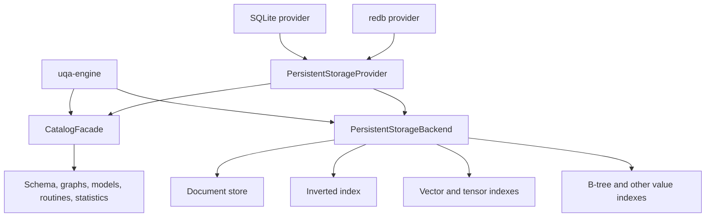
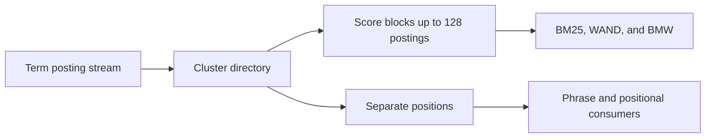
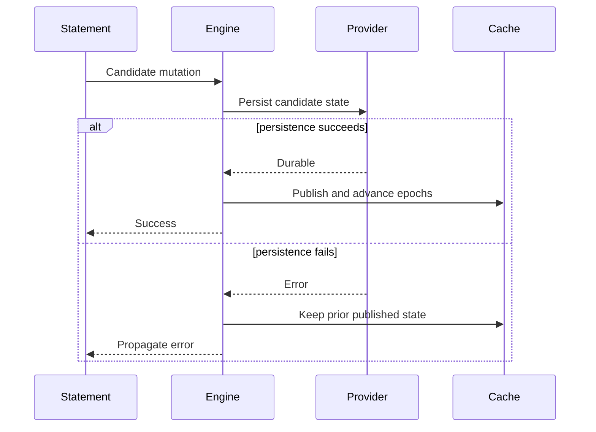

# Storage Internals

The engine separates logical table and index behavior from provider mechanics. Persistent providers bind catalog and data handles to one session transaction context, while in-memory implementations satisfy the same high-level contracts without file durability.

Memory document stores and inverted indexes share immutable corpus state when creating read or writable snapshots. Their owning storage implementations copy shared state only when it is mutated; clearing or rebuilding a snapshot replaces the state without copying discarded data. Documents retain their layout IDs and tuple metadata, while inverted indexes retain postings, occurrences, field metadata, and corpus counters together. Analyzer bindings remain independent across snapshots. The concrete stores' `Clone` implementations retain their independently owned maps, so preparing a cloned index does not defer that preparation cost into its first mutation. This keeps read snapshots independent of corpus size and preserves writable rollback snapshots without placing snapshot algorithms in Engine.

## Storage boundary

`PersistentStorageProvider` creates catalog and backend handles together for a new session. `Engine::from_persistent_provider` retains that factory and can create sibling sessions. `Engine::from_persistent_backends` accepts already-bound handles and retains the backend's session factory; independent sessions require that backend to implement `open_session`.

Public sibling sessions register as automatic-statistics clients. Internal fixed snapshots, current-catalog readers and committed retrieval rechecks use the same storage-session construction without acquiring a maintenance client lease. Opening or querying one of these internal readers cannot restart the background worker after the application clients release it. Engine owns this session and retained-resource lifecycle; statistics collection and storage publication keep their existing owners.

`PersistentStorageSession::validate_transaction_affinity` checks both the transaction model and `StorageSessionAffinity` before Engine restoration or sibling attachment. `StorageTransactionModel::VersionedConcurrent { database }` requires matching database incarnations and a matching reported session affinity; equal file paths alone do not establish atomicity. Connection/store clones share affinity, while independent sessions receive different identities. Custom providers default to `ProviderSerialized`, preserving Engine writer admission; serialized pairs may both omit affinity. Wrappers must forward both contracts from their underlying session.

Versioned backends additionally expose their session's `write_cancellation` token. Engine retains that token for query execution; autonomous sequence mutation opens a separate session through `open_session_with_cancellation`, while ordinary SQL siblings receive independent tokens. Common storage supplies the same retention budget with that token only to identifier reservations and publication, including identifiers observed by an evaluated batch. Its retained reads and rollback cleanup keep their internal control. SQLite owns typed BUSY waits at connection checkout, permit preparation and BEGIN IMMEDIATE, and retries a busy COMMIT on the retained physical transaction without rematerializing its records. Other publication failures preserve uncertain receipts. Cancellation never converts a successful commit into a rejection. See the [Rust migration contract](../reference/10-upgrading.md#unreleased-storage-write-cancellation).

## Logical storage contracts

Statistics-maintenance state and its evaluated counter merge belong to `uqa-storage::statistics_maintenance`. `CatalogFacade::save_statistics_maintenance` retains typed changes in versioned sessions; command refresh and publication preserve concurrent row-change increments when an analysis clears its observed baseline. Ordinary metadata replacements and explicit revision requirements remain conditional, and an older transaction cannot recreate maintenance state deleted or replaced by another object. Native SQLite supplies its metadata-row codec; Key/Value providers share the common codec. Engine supplies relation identity, collected row count, time and pending transaction-frame state. The persisted maintenance JSON fields and key remain unchanged.

`uqa-storage` defines backend-neutral traits for document rows, inverted postings, vector and tensor values, B-tree values, block-max metadata, spatial data, catalog records, and ordered Key/Value operations.

`uqa-storage-sqlite` implements those contracts and the graph persistence contract from `uqa-graph`. It owns managed connections, catalog migrations, physical indexes, transactions, SQLCipher integration, and the compressed VFS. Neither common storage nor graph algorithms depend on the SQLite provider or driver, including their tests and benchmarks. Cross-provider graph conformance tests and SQLite persistence benchmarks live in `uqa-storage-sqlite`. Concrete Rust imports and provider error handling are described in the [Rust migration notes](../reference/10-upgrading.md#sqlite-provider-ownership).

Common Key/Value vector consumers use `KeyValueStore::with_read_view` to select one fixed committed/private boundary. IVF reads centroids, assignments and canonical tensors together; HNSW reads its header, graph nodes and canonical tensors together. `with_mutation` evaluates once against the boundary supplying original write preconditions, then applies staged canonical values and the IVF metadata/assignment changes or HNSW graph delta atomically. Errors, cancellation and unwinds discard that operation while preserving earlier private writes; publication failures retain the evaluated attempt for resolution. Neither callback may reenter its own store session or perform transaction control. Common logical sessions own this behavior; SQLite forwards the calls and redb uses the common implementation.

IVF and HNSW share the same immutable cache and exactly-once evaluation adapter. Cache identities include the database, committed sequence and relevant non-reused private record identities; the memory reference store rotates retained identity tokens on writes and undo. Live handles refresh after rollback, savepoint branching, definition recreation and independent commits. Creation retains its requested parameters across unrelated writes. HNSW restoration validates graph/canonical agreement; IVF restoration validates vector counts, ordinals and assignment references while retaining the stored centroids and assignments. Common Key/Value mutations and native SQLite mutations use the common `IVFIndex::prepare_metadata` owner to produce immutable IVF candidates from evaluated replacement/delete/reset/training inputs. Preparation reserves a conservative bound for candidate state and numerical scratch before cloning, polls cancellation, and retains the resulting metadata allowance; reset discards the generation without cloning its corpus. Empty vector replacement and document deletion preserve their distinct deletion-counter behavior. Native SQLite and common Key/Value IVF/HNSW now merge independent document mutations through the shared vector input journal and resolver described below; general definition fencing remains required. Full IVF/HNSW cache and search workspace accounting remains required.

Common `HNSWIndex::prepare_delta` and `prepare_canonical` now own evaluated graph mutation and explicit reconstruction for native SQLite and Key/Value callers. They reserve candidate state, graph layers, construction/search/pruning scratch and compaction copies before cloning or inserting vectors; immutable output deltas retain their separate allowance through staging. The layer bound follows existing graph levels and deterministic allocation before/after compaction. Replacement/deletion order, dirty-node deltas, node allocation and threshold-triggered compaction match serial HNSW mutation. Preparation checks cancellation during hierarchy traversal, neighbor selection/pruning, replacement and compaction. Failure preserves the source graph and dirty state; clear returns an empty full rewrite without cloning the old corpus. Explicit reconstruction rejects incomplete or unordered canonical tensor ordinals. HNSW input journaling and conflict-aware generation merging now share the common resolver for native SQLite and Key/Value callers; full retained-cache/restoration/query workspace accounting remains required.

Exact vector snapshots own the canonical tensors selected by one read view instead of retaining a live store handle. Their payloads share the session read allowance across nested snapshots; loading failures return their reservations, and scoring checks cancellation and charges temporary score/posting buffers. Exact, IVF and HNSW snapshots retain their original data after subsequent writes, rollback and closing the live handle, and reject mutation even when the caller holds the only reference. Third-party stores must implement compound reads for vector consumers and evaluated mutations for IVF/HNSW; unsupported capabilities return explicit errors.

B-tree backend methods use `ValueIndexKey::Column` for ordinary field indexes and `ValueIndexKey::Index` for a named catalog index. These are separate physical namespaces even when their strings are identical: the SQLite provider encodes them as TEXT and BLOB keys, and key-value providers use distinct binary tags. Expression indexes store a composite `Value::Row` key under the named index identity. SQL binding and execution layers own expression binding, dependency traversal, and key evaluation; storage providers preserve expression catalog payloads without depending on SQL AST types.

Expression key preparation finishes before the document-store write lock is acquired. The in-memory index retains each document's stored key so updates and deletes remove the original posting even after an immutable routine is replaced. Rollback recovery hydrates caches directly from restored durable postings without invoking SQL callbacks or reentering the transaction coordinator; a missing durable index remains cold until ordinary statement execution can rebuild it. Named memory and temporary indexes retain evaluated keys in transaction snapshots and are preserved when column accelerators are invalidated. VACUUM FULL rebuilds the physical indexes after rewriting their table.

`KeyValueStore` supports point reads, ordered prefix scans, bounded key-only paging, atomic batches, and range deletion. Binary keys encode segments unambiguously and use big-endian numeric identities so lexical order preserves document order.

Development Key/Value graph catalogs record typed path-cache effects with their private source changes. Common storage resolves graph memberships and path ownership against a fresh committed view, so independent graph writers can both invalidate a shared cache and an older writer also invalidates indexes or memberships created after its snapshot. Private invalidation previews do not clear a cache subsequently reassigned to another graph. A completed path build validates the graph registration, label registry, membership/source revisions and index definition before publishing its validity marker; a build with stale inputs is not published as current. Savepoints restore both records and effect order. Canonical source records retain their original conflict checks.

The prepared fingerprint seals original records, cache-write kinds and ordered graph effects. SQLite Key/Value and redb check the durable receipt first, then validate the snapshot used to prepare derived effects under physical write admission. An intervening commit permits only those effects to be prepared again, with the same transaction identity and fingerprint; SQL, graph evaluation and callbacks are not repeated. A lost commit reply resolves through its receipt before applying any cache effect again. Typed cache state and dependency discovery remain bounded by the session allowance and cancellation. The bound native catalog uses the same resolver through native key/row codecs. Fair admission for repeated preparation remains pending.

Common Key/Value document mutations select their exact storage-name owner, tuple metadata and target row through one evaluated batch. The private `O` key family records nonzero object/generation bindings, reverse object claims and immutable data markers. Catalog registration, definition-only removal, full removal, purge and rename update these bindings with their table definitions and data; independent row writers merge marker touches, while an intervening structural change rejects the stale commit. Canonical catalog names and raw standalone names remain distinct. Ownership adoption inherits durable ID reservations, including IDs whose rows were deleted or rolled back. A new storage generation of the same object seeds its visible rows without inheriting retired reservations; Engine removes old rows before rotating the generation, then supplies the continued floor or the explicit restart floor. Legacy seeding walks document keys without loading document bodies and retires the old per-name floor atomically with the binding. Existing bindings must agree with their reverse claims and table definitions.

Document bulk reads, projections, selectors and cursors use a supplied fixed view. Snapshots retain their committed/private view and remain read-only after later writes, undo or closing the live handle. `KeyValueRead::visit_keys_after` pages live keys without loading values; bounded key pages are copied before code performs further reads through the same view, so borrowed provider visitors are never reentered. Table rename rejects collisions with existing destination data. Native SQLite owner transfers use the same queued identifier inheritance as Key/Value providers. The remaining compound consumers, definition/constraint coordination and complete SQL acceptance are tracked in the implementation plan.

Common Key/Value sequence creation, replacement, rename, removal, reservation and set-value operations now evaluate through one fixed catalog view and stage their changes atomically. Name claims and sequence values retain the original write preconditions, and creation/rename require the destination schema revision. The store's mutation boundary replaces the former catalog-local sequence mutex, so independently constructed catalogs cannot publish an allocation derived from an intervening writer's old position. Compound sequence reads use the same supplied-view contract. Conflicts and uncertain commits retain the original attempt for explicit completion or rollback; they do not replay value allocation. These APIs obey their selected session, including savepoints and transaction undo. Execution selects an autonomous session for committed SQL sequence values, including calls made while the caller retains unrelated private writes. `CatalogFacade::sequence_has_private_changes` identifies creation, rename and definition replacement in the caller's private view; those values remain in that transaction. Savepoint undo restores that provenance. Versioned catalog wrappers must forward this method. Complete sequence-definition coordination remains required.

Sequence value updates carry the expected allocation generation, as reservations already do. Both native SQLite paths and the common Key/Value consumer check it before changing the row and return a typed definition-change result. Execution resolves that result again before validating `setval` bounds, publishes session caches/history only after success, and uses cancellable retries only for a known rejected operation in an idle independent session. The retry owner validates catalog/backend affinity, rolls back that failed autonomous attempt and never replays a bound transaction, an uncertain commit or SQL expressions. Cancellation and memory exhaustion preserve their SQL error categories. This does not replace sequence-definition locking.

Sequence value execution selects current committed definitions and values while preserving transaction-private creation, rename, deletion and replacement. This refresh is independent of the ordinary row snapshot. A changed allocation generation forces value resolution and bounds validation against the refreshed definition; it cannot loop on an older transaction registry. Engine supplies catalog sessions and publishes the selected rows; execution owns selection and autonomous value mutation.

`refresh_transaction_snapshot` explicitly advances an active common session to a newly retained committed boundary. Before publication of the new private view, the existing storage resolvers merge evaluated occurrence, vector, graph and marker effects against that boundary, retaining their effect kinds for later commands and final commit. Canonical revisions and definition requirements still reject conflicting changes; no SQL expression, analyzer callback or external operation is reevaluated. Savepoints retain the matching committed base and private owner so rollback restores both without allocating replacement payloads. Earlier compound reads and cursors retain their original view. Errors preserve the prior active state, and sealed commits cannot advance. Native SQLite, SQLite Key/Value and redb forward this primitive through their paired backend. Engine refreshes the command catalog/write view while retaining a separate fixed data view for REPEATABLE READ and SERIALIZABLE. Target refresh after a logical lock wait preserves the command's original row-change baseline and retained source snapshots. Commit preparation refreshes derived maintenance state under the publication gate so independent writers do not overwrite shared counters. Full serializable-history acceptance remains open.

Common storage’s `SnapshotRegistry` admits sequence capture and lease registration under the same gate as history reclamation. A retained committed view keeps its lease through clones, command refresh, savepoint undo and closing the live store. Reclamation keeps each key’s newest revision at or before the oldest live sequence and every newer revision; with no live views, the current committed sequence is the horizon. Head tombstones, identifier watermarks and all pending, committed and aborted receipts remain intact, so collection cannot erase conflict evidence or replay a completed commit. Providers delete obsolete revisions atomically without changing visibility or transaction allocation, and `VersionedPersistence` wrappers must forward `reclaim_versions` with its resource and cancellation controls.

Native SQLite stores snapshot sequences and process-lived byte leases in a separate `.uqa-snapshots` coordination file. It contains no document bytes, keys or credentials. One shared process descriptor prevents closing an unrelated handle from releasing POSIX locks; lease release never waits for snapshot admission or a physical writer. Live processes never expire by elapsed time, and process death releases their locks. Compressed rollback-journal snapshots still release each physical read between operations. Browser file handles share one process registry, in-memory handles share their physical pool, and redb adapters share their exclusive database owner’s registry. Current record format 41 rejects predecessors whose snapshots do not register leases before any historical read or write can proceed. Native mapping 8 and catalog version 49 are unchanged.

The development SSI transport is separate from snapshot leases. Common storage owns the serializable graph and its budgeted streaming checkpoint; `SQLiteRecordStore::serializable_admission` owns process-shared auxiliary writer admission and atomic checkpoint replacement. Its `.uqa-serializable` SQLite file contains logical predicate keys and therefore inherits the main database's encryption credential, including for compressed encrypted containers. It uses FULL synchronization and DELETE journaling; malformed retained schemas and checkpoints are rejected. In-memory sessions share a retained auxiliary pool.

`SQLiteRecordStore::admit_serializable` reconciles physical receipts and abandoned participants before capturing a caller-supplied data view under that admission. Its cloneable `SerializableParticipant` must remain retained by the original transaction and its nested/pinned views. Native file owners use `.uqa-serializable-leases`, containing only database/coordinator identities and participant allocation tags; snapshot and participant leases reuse the same byte-lock transport with distinct files and formats. Memory and browser owners use a shared local registry. Final handle release takes no admission or physical writer, and process death releases native leases. `recover_serializable` retires only lease-bound dead participants; an unknown prepared receipt blocks recovery, while confirmed committed data keeps its outcome. Earlier confirmed resolutions persist even if a later recovery step or snapshot capture fails. Checkpoint version 2 records the lease binding and reads version 1 actors as manually owned. Public SQL SSI still requires coordinated publication and main-writer fencing, redb coordination, logical observations and original-transaction lifecycle integration, as tracked in the [implementation plan](../../plans/0008-concurrent-storage-transactions.md#serializable-participant-lifetime-and-recovery).

SQLite also coalesces current records at or before the reclamation horizon into bounded `_uqa_mvcc_runs`. Each run preserves up to 128 exact keys sharing a prefix and consecutive eight-byte big-endian suffixes, their original revision, and either NULL, one constant value, or a small value template whose suffix is reversibly derived from the key. Keys exceed neither 1,024 bytes nor value templates 128 bytes; other records retain the ordinary representation. Point, metadata, prefix and key visitors merge runs with ordinary heads in byte order, including interleaved key lengths. Metadata probes do not load value templates. Replacing a run member restores its exact predecessor in history and splits the remaining range within the same physical transaction, preserving old snapshots, absent-key conflicts and receipt retries. Compaction changes representation without changing the count of obsolete revisions reclaimed; physical native projections, logical byte records and conflict evidence remain intact.

`KeyValueStore::vacuum` forwards version reclamation outside the invoking session’s transaction; versioned wrappers must forward maintenance rather than accept the serialized no-op default. Native SQLite and SQLite Key/Value reclaim obsolete logical versions before physical `VACUUM`. redb reclaims versions for reuse by its physical page allocator. Retained snapshots can delay reclamation; their visible values remain readable during and after collection.

Domain catalog format 3 uses independent `uqa.sql.domain.v1:` definition records and `uqa.sql.domain_oid.v1:` domain OID claims, with a separate durable incarnation and public constraint OID for each CHECK and NOT NULL declaration. Execution loads domain definitions before type binding, then validates and finalizes constraint addresses after ordinary/foreign relations, triggers and index-owned constraints are restored. Current records require complete valid identities; only initial legacy conversion may fill missing metadata. Publication deltas and private-domain overlays use existing atomic storage metadata operations. Common record format 41 fences writers that could omit these fields. A later catalog restoration failure rolls back domain record and marker conversion.

## Provider matrix

| Provider | Main implementation | Session transaction identity | Security notes |
| --- | --- | --- | --- |
| Memory | In-engine memory stores | Engine session state | No durability |
| SQLite | `uqa-storage-sqlite` | Managed connection bound to a common logical session in both layouts | Plain, SQLCipher, or compressed VFS open paths |
| redb | `uqa-storage-redb` | Common logical session over one shared database owner | No encryption at rest |

SQLite is the default persistent engine. redb uses the same SQL and logical storage surface through the provider contract.

The development redb provider uses common logical Key/Value sessions: private changes and savepoints retain no physical writer, reads pin a committed sequence, and short conditional commits publish versions and receipts atomically. Its catalog/backend pair shares that session. Default retention is 64 MiB per session and can be set through `RedbStorage::open_with_options`; it is separate from the query read allowance. See the [transaction and file-format contract](../../design/kv-storage-backends.md#redb-transaction-mapping) and [unreleased upgrade boundary](../reference/10-upgrading.md#unreleased-redb-record-format).

Common storage preserves an indeterminate transaction identity across later commit/abort failures and validates the receipt's transaction identity and prepared fingerprint before accepting it. `StorageBackendError::commit_outcome` exposes typed committed, aborted or indeterminate evidence through provider error wrappers. Verified terminal outcomes remain in the session so completing or discarding that attempt requires no second persistence lookup. Providers emitting these typed outcomes must retain their sealed attempt and permit receipt resolution without reevaluating application operations. Engine adapts this evidence into a retained commit-resolution state, and execution's statement cleanup preserves that state. SQL preparation runs once; successful resolution releases the retained frame and publishes its row changes, epochs and notifications through the ordinary completion path. Durable cross-process publication recovery remains part of the concurrent-storage implementation plan.

Native SQLite, SQLite Key/Value and redb occurrence writes now merge evaluated per-document cluster changes and checked field-count/length deltas against a fresh committed snapshot. Whole-document guards reject overlapping replacements even when writers choose different fields; structural guards survive drop/recreation and reject stale source writes across rebuild, purge, rename and column changes. Source commits invalidate late skip/block-max caches, while stale cache builds keep their original source preconditions. Commit admission can repeat only this storage preparation, retaining the sealed fingerprint and receipt identity; analysis and scoring are not replayed. General definition coordination and complete concurrent Engine SQL acceptance remain unfinished.

The common `encode_occurrence_cluster_controlled` codec accepts a caller-owned `StorageReadControl` and retains the output buffers' memory reservations. SQLite's physical occurrence batch and source-rebuild adapters reuse one control across clusters, avoiding a separate budget and cancellation allocation for every term. Rebuilds pass the caller's cancellation token through encoding, and provider adapters preserve typed cancellation and memory errors. Wire bytes, stored counts and transaction atomicity are unchanged.

Common versioned batches expose `require_unchanged(key)` to validate a definition's original committed revision without writing that definition, and `touch_marker(key, value)` to publish a fresh marker revision while merging concurrent touches with the same immutable payload. Data writers require the definition and touch its data marker; structural writers fence that marker with `fence_record` and replace or fence the definition. Independent data writers can both commit, while an overlapping structural change conflicts in either publication order. Requirements retain absent/tombstone revisions, participate in the sealed fingerprint, survive pure effect re-preparation and follow operation/savepoint undo. A requirement-only commit validates without advancing record visibility. Confirmed receipts resolve before checking later changes. This common primitive is verified through SQLite Key/Value and redb; automatic document-owner lifecycle and general SQL definition coordination still require consumer integration.

Native SQLite and common Key/Value IVF commits retain ordered evaluated document replacements/deletions, while canonical tensor writes keep their original preconditions. When another document changes the shared generation, common storage restores the latest validated state and prepares only the stored IVF inputs in order, including each training transition. It publishes canonical values, metadata, centroids and assignments atomically. Separate `y` byte-key tombstones fence whole documents and structural changes, including empty replacements, absent deletions, rebuilds and same-definition recreation. Savepoint rollback truncates the input journal; canonical values inconsistent with that journal fail before publication. Admission retries, lost replies and intervening commits preserve the sealed fingerprint and receipt identity. SQLite Key/Value and redb use byte-key guards; native SQLite implements the same codec contract with its existing vector/IVF rows and object/generation-scoped document/field guards. Its metadata has no stored mutation counter, so the codec reports that absence instead of adding a column or rewriting old IVF histories. Record revisions, structural guards and canonical/input agreement remain mandatory.

Native SQLite and common Key/Value HNSW commits use the same retained document inputs, sealed fingerprints, canonical validation and savepoint journal as IVF. After another document changes the shared header, common storage restores the latest graph under a retained memory allowance, checks live node values against canonical tensors and prepares the ordered HNSW inputs again. Node allocation, compaction, graph metadata and changed adjacency publish atomically with the original canonical replacements. Key/Value IVF and HNSW share document and structural tombstone fences in the `y` namespace because they own the same canonical tensor identities. Rebuild, clear, drop/recreation and table/column lifecycle preserve conflicts; empty replacement and absent deletion still fence the document. Lost replies and admission retries preserve the original receipt identity without repeating application evaluation. Native SQLite, SQLite Key/Value and redb use this implementation. Native SQLite describes its existing header, node and separate-edge rows through the common codec contract; the shared owner rebuilds the latest graph and publishes ordered changes. Complete retained-cache and query workspace accounting remain open.

Ordinary relation and attribute ACL replacements use the common [`relation_acl`](../../../crates/uqa-storage/src/catalog/relation_acl.rs) codec. Versioned catalogs keep each complete tuple value and a nonzero replacement identity in an independent `uqa.relation_acl.v1:` metadata record; equal ACL bits still identify a new tuple. A catalog read composes those records with the definition’s owner and ACL baseline from one retained committed/private view. Definition writes atomically compact the supplied security into that baseline and clear its replacement records; relation rename moves them, and deletion removes them. Empty attribute replacements remain versioned tombstones for privilege revocation and concurrent-update detection. Provider-serialized catalogs retain embedded ACLs under their existing transaction. Common record format 41 fences preceding writers that cannot compose these tuples; formats 1–40 upgrade without rewriting existing source records, identities, allocations or receipts. Native mapping 8 and catalog version 49 remain unchanged.

NOT NULL constraint identities are stored with their ordinary or foreign-table column definitions as a nonzero 128-bit incarnation and explicit public OID. SQL owns allocation and validation policy, including predecessor OID preservation; execution converts the complete catalog candidate before writing any changes in the caller-owned initial restoration transaction. `sql_not_null_constraint_identity_version=1` records completion. Current definitions with absent, invalid or duplicate identities are rejected, including duplicates between ordinary and foreign tables. Load-only restoration and table catalog reload require the completed marker and never migrate identities. Record format 41 excludes predecessors that could discard the new metadata; formats 1–40 upgrade with record identity, history, identifier state and commit receipts preserved.

Foreign-key row identities are stored in the inline or table constraint definition, separately from the logical identity shared by its partition family. Partition copies allocate independent catalog rows and retain the local identity in attachment provenance. Execution validates the complete ordinary/foreign-table candidate against both NOT NULL and foreign-key identities before initial conversion writes. `sql_foreign_key_catalog_identity_version=1` makes conversion initial-only; refresh and secondary sessions require the completed marker and reject invalid current rows without repairs. Common record format 41 prevents older writers from discarding these fields.

Key constraints retain an independent catalog identity, and inline/table CHECK constraints retain an explicit OID alongside their existing incarnation. `sql_constraint_catalog_address_version=1` records their initial conversion independently of NOT NULL and foreign-key conversion. Execution validates all ordinary and foreign definitions and provenance before writes, preserves noncolliding predecessor addresses, and changes only newly converted colliding addresses. Current malformed or missing fields remain errors on every restoration path. Runtime declaration materialization reserves public addresses through execution's shared-object locks and rechecks the current catalog after waits. Common record format 41 excludes writers that could discard the fields; native mapping 8 and catalog version 49 are unchanged.

Stored secondary indexes retain an independent catalog incarnation/OID, their indexed table incarnation and an immutable physical namespace in the SQL-owned definition. Execution validates the complete stored index set before initial conversion writes and records `sql_index_catalog_identity_version=1`. Conversion preserves noncolliding predecessor OIDs and existing physical keys without rebuilding postings or evaluating stored expressions. Current missing, duplicate or malformed identities fail restoration, and load-only refresh never migrates. Fresh physical keys derive from the new incarnation, so deleting and recreating an index name cannot reuse the old namespace. Runtime OID reservations inspect current relation-class metadata before and after waits. Common record format 41 fences preceding writers, including the updated index key-reservation encoding; native mapping 8 and catalog version 49 remain unchanged.

PRIMARY KEY, UNIQUE and derived partition indexes are durable registry rows with independent index identities. `IndexDefinition.relationships` binds an owned index to its constraint incarnation and a partition index to its immediate parent index incarnation. Foreign keys retain the chosen index incarnation independently of its SQL name. Execution prepares complete descendant key/index candidates, reserves addresses and rechecks affected definitions before publication; Engine supplies retained catalog, table and transaction adapters. Local physical probes use the stored child identity and follow index ancestry only when binding a parent conflict arbiter. A physical namespace is scoped to its indexed table, including predecessor expression namespaces reused in different partitions.

A key constraint's structural declaration retains its incarnation, kind and columns; its current name is stored only in the owned index row. `KeyConstraintNames` restores names from the same command snapshot and refreshes cached table keys when only the index registry changed. Name-only publication changes the index row without a table-definition write or data fence, allowing independent owned-index renames and document writes to commit together. Index relation locks use immutable index incarnations across sessions and processes; table/constraint removal follows those incarnations after waits.

Initial conversion validates ownership, names, complete ancestry and foreign-key targets before writes, retaining compatible predecessor index names/OIDs and existing expression postings. `sql_index_registry_version=2` records the complete conversion alongside the earlier address marker. Previously virtual GIN/vector partition indexes receive actual physical builds inside that same initial transaction. Existing physical indexes retain strict restoration; missing current metadata is never rebuilt as a repair. Any later hydration failure rolls back the entire conversion and both markers. Temporary table/index definitions stay in the session and are excluded from durable conversion. Common record format 41 fences writers that do not preserve these relationships.

Constraint renaming retains its owned index's OID, incarnation and physical namespace. Detachment retains every local index and severs only the external parent edge; reattachment can reuse a compatible free index. Owned parents require a distinct same-kind owned child for each parent index; independent parents may reuse independent or owned children. Removing an independent parent that owns no constraint requires CASCADE when a child index belongs to a constraint. Shared GIN fields are removed only when no surviving index references them, including a DROP command that removes several names together.

Schema security format 2 adds a stored namespace OID, a nonzero 128-bit incarnation and a nonzero tuple replacement revision. Key/Value schema records retain these fields in their versioned JSON envelope. Native SQLite keeps its existing columns: its schema-specific owner BLOB version 2 contains the role OID/incarnation followed by the namespace OID/incarnation/revision (57 bytes); other catalog owner encodings are unchanged. Initial execution restoration validates the complete schema set and assigns identities to legacy and bound-role-only schema rows while preserving their previously exposed OIDs. Duplicate OIDs or incarnations and malformed current identities fail before migration writes. Secondary sessions require completed conversion. Common record format 41 fences writers that lack namespace tuple and lifetime coordination; native mapping 8 and catalog version 49 are unchanged.

The development SQLite `SQLiteRecordStore` implements the common record-persistence contract. Its provider-owned `_uqa_mvcc_metadata` table stores record format version 41, database identity, transaction allocation counter, committed sequence and record mapping. `_uqa_mvcc_heads` identifies ordinary keys' latest revisions and marks compacted tombstones, `_uqa_mvcc_runs` retains bounded lossless groups of current records, `_uqa_mvcc_versions` retains historical values and tombstones, and `_uqa_mvcc_transactions` retains transaction outcomes and prepared-batch fingerprints. Collection removes a redundant latest tombstone row only after its head marks that same deleted revision; a later write restores the deleted revision into history before replacing the head, preserving retained readers and write conflicts. These objects belong to the physical SQLite format; applications do not manage them through UQA SQL. Historical values remain retained until reclamation can remove revisions older than each live snapshot’s predecessor; head tombstones and all receipts remain retained. Common Key/Value document/structure guards occupy the separate `z` byte-key namespace; clearing occurrence data does not remove them. See the [development record-format upgrade boundary](../reference/10-upgrading.md#unreleased-rust-keyvalue-compound-operations).

`VersionedPersistence::allocate_identifiers` reserves an inclusive range or observes an externally supplied identifier under the same physical write admission as record commits. Common storage owns checked range arithmetic, minimum/maximum bounds, exhaustion and monotonic watermark rules. Namespace keys must encode the allocation domain and the owning object's non-reused generation. SQLite stores these watermarks in its provider-owned `_uqa_mvcc_identifiers` table; redb uses `uqa_mvcc_identifiers`. Reservations publish no private records, advance neither the committed sequence nor transaction-allocation counter, and survive transaction/savepoint rollback and reopen. Physical errors may consume a complete range, but no range is returned before its durable commit. Both providers enforce request memory and cancellation controls. `VersionedKeyValueStore::allocate_identifiers` additionally rejects read-only sessions and sealed commit attempts. The Engine document-allocation adapter, native SQLite document writes and common Key/Value document writes consume this primitive. Persistent graph handles and raw graph catalog writes also consume these reservations as described below; autonomous SQL sequences remain required.

`KeyValueBatch::observe_identifier` buffers a durable watermark observation alongside evaluated records. Common sessions check writability and stage all records before applying observations directly through persistence, without reentering the session. Discarded batches and failed or unwound evaluation consume nothing. An observation failure discards this operation's private records while preserving earlier private writes; any earlier successful observations in the same batch remain durable. Successful observations survive savepoint/transaction rollback, and a sealed record-publication retry does not replay them. Stores without this capability reject the operation explicitly; SQLite Key/Value and redb implement it through the common session, and capable batch wrappers must forward it. Bound native SQLite document replacements and patches use the storage-owned `observe_document_id` helper with their selected table object/generation, including standalone native table owners. Deletes and clear do not lower the watermark.

`VersionedPersistence::identifier_watermark` and the session-bound `IdentifierAllocator::identifier_watermark` read the latest durable reservation without acquiring physical write admission. They return `None` for an absent namespace and preserve the distinction between absence, zero and the full-width exhausted value. Reads validate the database incarnation and retain cancellation and memory controls. They neither create a namespace nor advance any counter, publish private records, or change the logical transaction. Read-only sessions and sessions retaining a sealed commit may inspect watermarks; their pinned record snapshots remain unchanged while autonomous reservations are immediately visible. This read capability is required before graph label sequences can be separated from transactional label definitions.

`PersistentGraphStore` reserves plain entity IDs, AGE entity sequences and label IDs through the session allocator. Graph owns allocation rules; common storage owns fixed-size namespace encoding and the projection of current reservation floors into explicit graph exports. Entity reservations cover the physical entity kind and numeric ID prefix shared by all named graphs; separate standalone SQLite families have separate namespaces. Graph identities survive rename, new graphs receive new identities, and transactional clear selects a new allocation generation. Existing rows and legacy registry floors seed first allocations. Counter-only progress does not rewrite the transactional label registry. Graph data mutations retain definition/generation requirements and mergeable revision markers; registry changes, graph removal and clear fence those markers. Native cache projection and physical metadata triggers exclude internal allocation/guard rows from user-definition revisions; both known predecessor trigger encodings upgrade without rewriting history. The raw catalog mutation/restore audit, complete endpoint coordination and concurrent Engine SQL remain implementation requirements.

`PersistentStorageBackend::identifier_allocator` and `KeyValueStore::identifier_allocator` expose the session-bound capability through `mvcc::IdentifierAllocator`. The storage-owned `document_store::identifiers::DocumentIdAllocator` binds document reservations to a nonzero table object identity and storage generation. Engine supplies its retained table state and local floor, and observes explicit document IDs before publishing their rows. Initial restoration seeds existing maximum IDs and legacy reservations, including the full-width exhaustion sentinel, before retiring the legacy name-bound metadata in the catalog transaction. Renames preserve the allocator namespace; TRUNCATE transfers the current floor to the new generation or seeds its restarted floor. Reservations survive SQL rollback/savepoints and deleted rows on reopen. Temporary and memory tables retain their local contract. Serialized custom backends without a durable allocator use execution-owned candidate reservations and a committed occupancy read after each grant; Engine supplies retained stores and lock adapters. Their transaction-scoped reservations preserve concurrent INSERT rows without adopting durable non-reuse semantics. A missing allocator does not establish concurrent-writer capability; wrappers must forward the capability of their underlying provider. `KeyValueStorageBackend::begin_read_transaction` follows the backend read-first contract through the byte-store upgradeable entry point, matching native SQLite; `KeyValueStore::begin_read_transaction` remains strictly read-only on versioned stores.

The provider's `mvcc::native` module maps the 43 current catalog tables, table-owner bindings, graph lookup entries, two normalized occurrence accelerator tables and occurrence/vector guard tables into 49 fixed record families; seven additional scoped families hold standalone graphs. Table-owned data uses its object identity and storage generation instead of its current table name in record keys; table and sequence definitions validate their persisted identity fields against that owner. Rows preserve SQLite storage classes, including binary document fields, tuple metadata and the distinct TEXT/BLOB B-tree namespaces. Decoded payloads borrow their retained record buffers. The codecs enforce layout types, ordered key encoding, allocation limits and cancellation, including complete validation of absent tombstone keys.

Native mapping format 2 adds `_uqa_mvcc_native_graph_lookup`, a provider-owned SQLite table containing only graph entity identities indexed by label, edge source/target and graph membership. Its entries have the same committed/private visibility mechanism as source records, so retained snapshots can select IDs without consulting current-only SQLite indexes or loading entity properties. Prepared graph mutations must include changed lookup entries; physical projection triggers and commit validation reject missing effects or independent lookup changes that disagree with their source. Property-only changes leave lookup revisions unchanged. Opening mapping format 1 atomically derives lookup history from source revisions at their original commit sequences, preserving the database identity, allocation counter, source histories and receipts. Conversion streams one source key and revision at a time under the read allowance, checks current sources against history in both directions, rejects revisions missing their head index, and rolls back schema and history together on failure. The catalog version remains 49. Mapping format 3 additionally versions the graph-to-path directory, as described below.

Bound native catalog graph entity and membership reads now use one retained committed/private view. Point entities, names, memberships, filtered identity pages, counts and maximum IDs observe that view; named-graph hydration uses the same boundary for registration, label registry, memberships and entity payloads. Common storage chooses the primary selector in source, target, label, graph, then full-scan order; native SQLite and Key/Value catalogs consume that choice. Native filtered reads page through identity keys under the session allowance and apply the remaining predicates before the result limit, without loading entity properties. They advance through tombstone-only pages and release physical I/O before checking other keys or hydrating selected entities. Whole-graph and full catalog loaders still return their explicitly requested payload collections. Missing referenced entities, unregistered graphs with memberships and unknown membership types remain errors. Complete concurrent Engine SQL acceptance and cache restoration coverage remain pending; catalog mutation routing is described below.

Native mapping format 3 adds path-index ownership entries to the existing graph lookup family. An atomic upgrade from format 2 derives only those missing entries from path-state history; format 1 also derives the earlier entity/membership selectors. Original source revisions, unaffected lookup revisions, allocations and receipts retain their identities and commit boundaries. Property/validity-only updates do not rewrite the directory. Missing history heads, source/history disagreement and incomplete prepared lookup changes remain errors. Source path state is applied before its lookup entries so SQLite trigger conflict handling cannot collide with an already installed new directory entry.

Native mapping format 8 adds database-owned standalone graph records with a leading namespace component. `SQLiteGraphStore` handles opened before or after binding share the connection's logical transaction, savepoints and retained read boundary. Suffixes retain SQLite's ASCII case-insensitive identity; the unqualified namespace remains separate from catalog graphs. Conversion copies recognized legacy table families and their property-format markers without rewriting JSON, bootstraps a missing catalog in the same transaction, and then captures their MVCC baseline. Read-only compatibility views occupy retired qualified table names; unqualified entity names become the guarded catalog tables. Newly created namespaces publish the same protective views atomically with their first committed records. Upgrading mapping formats 1–7 creates the new empty families without rewriting existing histories or receipts. Namespace bindings are immutable, and selectors share the existing source-projection, preparation-validation and bounded identity-scan machinery. Unchanged entity observations no longer rewrite graph counters or label registries. Common read-only record sessions permit savepoint creation, rollback and release without enabling data writes; sealed commit attempts still reject checkpoint changes. Persistent allocation, graph definition guards and entity/membership lifetime coordination are implemented; SQL integration remains required.

Bound native catalog vertex/edge writes, named-graph registration/removal, memberships, snapshot replacement and orphan cleanup now stage canonical rows, selector changes and shared graph-cache effects together. Path definitions, bounded pair writes/paging, clearing, build completion and validity checks use the same retained boundary. Definition invalidation discovers a cache completed after the definition writer took its snapshot. Explicit private cache replacements survive later invalidation previews, while source-only previews follow current ownership at commit. Replacement preserves shared entities and the final occurrence of a repeated input identity, and failures publish no partial source or selector changes. These catalog APIs now retain graph definition guards and coordinated reservations; endpoint constraints, complete cache restoration and full concurrent SQL acceptance remain required. Standalone graph namespaces use the separate scoped families described above.

`SQLiteRecordStore::for_native` atomically initializes or upgrades a native catalog, converts it to schema 49 and captures its complete baseline record history. `_uqa_mvcc_native_owners` assigns exact native table names to stable object/generation pairs; canonical catalog names use their persisted identities, while standalone API names retain distinct owners. Missing legacy table/sequence identities are allocated during conversion. Reopen validates the native-format marker, empty transactional work queues, layouts and write/capture guards. Populated raw record histories cannot be mixed with a native baseline. Default `SQLiteStorageProvider` initial sessions restore legacy catalog semantics and import the native baseline in one physical transaction. Failed restoration or baseline import preserves the predecessor schema and rows. Successful COMMIT attaches the logical session to existing catalog/store handles; an initial opener rechecks whether a peer already converted the file under physical admission. Unbound direct handles are rejected after conversion.

`ManagedConnection::bind_native_records` attaches a new or existing native catalog or a recognized standalone graph file to this common logical session. Existing connection clones and `SQLiteDocumentStore` handles join it; `new_session` creates an independent context. Native document reads, bulk projections and retained snapshots keep the body and selected BLOBs on one committed/private boundary. Puts preserve tuple metadata atomically, patches leave unrequested BLOBs untouched, and deletes include the native B-tree cascades in the same evaluated batch. Autocommit evaluates reads inside its logical transaction, evaluation errors/unwinds roll back only an owned transaction, and publication failures retain the sealed attempt for explicit commit/rollback resolution. The mapping cannot be rebound as Key/Value or given another retention limit. This development entry point routes documents, B-tree storage, occurrences, exact/IVF/HNSW vectors and the catalog operations described below. Default Engine opening uses the provider's bound session, and siblings inherit its retention options. Direct callers must bind before opening a catalog on an already converted file. Complete concurrent SQL acceptance remains unfinished. Standalone graph handles now join the same session while retaining their distinct scoped row format.

`SQLiteBTreeIndexStore` uses the same native session for definitions, repair markers, loaded entries, per-document writes, replacement, sparse repair and deletion. TEXT column keys and BLOB named-index keys retain distinct namespaces, and existing tagged value serialization preserves composite expression values and floating-point bits. Existing index definitions are not rewritten by independent row updates, allowing two document/index batches to commit without conflicting on their common marker. Replacement validates duplicate IDs and backing documents before staging the batch. Reads pin definitions and postings together; document deletion reuses the B-tree owner's namespace seek to stage its cascaded removals. This establishes native per-document B-tree routing; index-definition generation fencing, other shared index algorithms and SQL lock/isolation integration remain in the implementation plan.

Native catalog metadata, schema ACLs, model/scoring parameters, named analyzer revisions and per-field analyzer bindings now use this session too. Existing catalog handles join the bound connection, and `Catalog::open` can attach to an already bound native session without running legacy physical migrations. Ordered registry reads use one retained boundary; analyzer replacement, legacy binding invalidation and field deletion stage atomic batches. Schema removal checks its visible relation ownership, and mapped format metadata is immutable. `CatalogFacade::schema_has_private_changes` reports exact-name private creation, replacement and deletion from the retained session, including savepoint undo; both SQLite layouts and redb use their existing record provenance. This does not change schema row encodings. Views and foreign servers/tables also use this session. Creation, replacement, rename and removal stage relation claims and definition rows together; foreign-table security updates preserve their server, columns and options. Rename preserves nullable view ACLs, and ordered reads remain on one retained boundary. Catalog and document changes commit or roll back together. Graph catalog reads and mutations and cache-revision reads use that retained boundary. Default Engine factories select the common model; complete concurrent SQL acceptance remains pending.

Initial restoration validates the native catalog on one retained committed/private view. Schema membership, relation kinds, unique definition names, the two-way relation/definition mapping and catalog-index table references must agree. B-tree entry keys must have live parent definitions in their corresponding TEXT column or BLOB named-index namespace. The validator pages through keys and metadata without loading B-tree values or unrelated model/document payloads, and its temporary collections share the read allowance and cancellation. It does not bypass the logical session to run physical SQLite foreign-key queries.

Ordinary table definitions and catalog indexes now share this session. Table identities and storage generations bind their fixed table-owned families; rename preserves the table identity, while generation replacement transfers evaluated rows and rejects late or stale-generation writes. Definition-only deletion retains standalone data, purge preserves field analyzer configuration, and full deletion removes all fixed table-owned families and index claims. Exact standalone API names remain separate from canonical catalog names; rename moves only the explicitly named data and rejects colliding destination keys. Catalog table names and index references change together, including rename followed by reuse of the old name in the same transaction. Native conversion normalizes recognized dynamic FTS skip/block-max tables into fixed table-owned families; unknown tables and ambiguous populated accelerator names remain errors.

Column lifecycle and column statistics also use the native logical session. The caller stages document-body and schema rewrites in the same transaction; catalog column operations then move or remove field-owned records and update ordinary catalog index keys together. Field selection reads ordered keys without hydrating unrelated BLOBs. Existing destination records are preserved, and B-tree parent replacement discards superseded source postings while retaining the separate named-expression namespace. B-tree destination preservation does not depend on SQLite foreign-key cascades being enabled. Repair markers follow the surviving field; a same-name rename leaves data unchanged in legacy and bound-native catalogs. Statistics reads retain one boundary, preserve nullable values and exact standalone names, and return columns in name order. Replacement rejects duplicate columns, mismatched table names and oversized batches without publishing a partial replacement. SQL definition locking, maintenance coordination and complete retrieval routing remain separate requirements.

Native sequence definitions, relation claims, rename/drop, cached value reservation and value setting also use the selected logical session. Ordered loads share the legacy sequence decoder for object identities, owner dependencies and nullable ACLs; value mutations preserve the other definition fields and use common storage reservation arithmetic. Object-scoped value access avoids unrelated sequence payloads. A definition-generation change retires its old record, and commit admission rejects competing generations of one sequence incarnation, including aliases created by independent sessions; conversion rejects existing duplicate incarnations atomically. Definition/value batches participate in private changes, savepoints, retained views and exact commit retry. Execution chooses an autonomous session for committed sequence values and keeps private sequence definitions in the caller's transaction, as described above. Complete sequence-definition locking remains required.

Bound native `Catalog::cache_revisions` reads committed generations and private changes from one retained snapshot. Common storage assigns non-reused process-local identities to private batches; the SQLite adapter projects only affected table, registry, graph, statistics and maintenance scopes. Durable generations occupy the nonnegative `i64` domain, while private equality tokens occupy the upper half of `u64` and never enter persistent rows or conflict checks. Savepoints restore earlier tokens, later undo branches receive new identities, and commit replaces private tokens with durable generations. These values are opaque equality tokens, not clocks or mutation counts. Changed-key pages, table-owner bindings and graph membership identities avoid loading document bodies, model payloads or graph properties; generation collections are charged while being assembled. The native storage-schema token identifies its fixed catalog format; raw physical DDL is outside a bound native session.

Bound native `SQLiteVectorIndex` and `SQLiteIVFIndex` APIs also use the managed logical session. Native IVF mutations restore and validate the stored centroids, assignments and counters through common storage, preserving them until the common training threshold requires retraining. Search rejects populated indexes with missing metadata and headers that disagree with the handle or canonical count. For trained generations it also rejects missing centroids, incomplete assignment coverage and selected assignments whose canonical values are missing, instead of falling back to exact search; explicit initialization rebuilds the physical index from canonical tensors. Tensor replacement, deletion and clear stage complete canonical records; IVF training and mutation stage the matching header, centroids and assignments in the same atomic batch. Searches retain one committed/private boundary across metadata, counts, assignments and selected canonical vectors. Vector counts read keys without payloads, and vector collections charge the session read allowance while they are held. Retained exact/IVF snapshots remain read-only across later writes, savepoint rollback, table rename/drop and commit. Existing IVF assignments are read without retraining on reopen. Independent canonical documents and separate IVF fields can commit while another transaction retains private changes. Shared changes to the same IVF structure still require the common index-delta resolver; Postings, definition fencing and concurrent Engine SQL remain unfinished.

Bound native `SQLiteHNSWIndex` reads headers, nodes, edges and canonical vectors from one retained committed/private record view. Mutations reuse the common HNSW implementation and stage canonical tensors, the header and incremental graph changes in one atomic batch; clear and explicit metadata removal use the same session. Cache identities include the table owner, durable data revision and non-reusable private batch identities, so rollback branches and same-revision recreation cannot reuse discarded graphs. Retained snapshots are read-only and retain their original canonical and graph generations through rename, drop, rollback and later commits. Reopen reconstructs the stored graph without rebuilding it. Separate HNSW fields can publish while another field remains private, including compressed and encrypted files; concurrent document mutations within one HNSW structure use the shared vector journal and resolver described below. Native decoded graph collections use the session read allowance; retained HNSW cache, restoration and public query workspace accounting remain part of resource acceptance.

Native commits validate original revisions and their current materializations before applying evaluated rows in dependency order. Transactional capture triggers record every physical primary key touched by cascades or native triggers. Every final row must match the prepared batch; an omitted B-tree deletion or graph-path invalidation rejects and rolls back the whole commit. Provider-owned cache increments are captured into history at the same committed sequence, so independent row commits preserve both invalidations. An owner-generation change must retire every original row, and a new generation cannot overwrite another record's physical key. Materialized rows, history, cache revisions and receipts publish together; retrying a confirmed receipt does not apply those effects again. Size probes and payload reads share one physical transaction, and the work queues are empty at every durable boundary.

`SQLiteKeyValueStore` and its paired catalog/backend now use common logical sessions over these records. Connection clones retain one transaction context, while `new_session` creates an independent context. Legacy Key/Value bytes migrate atomically, and persistent `_key_value` and `_metadata` guard views reject old byte-store writes and native catalog initialization. Missing or changed guards cause reopen to fail. The default session allowance is 64 MiB, configurable through `SQLiteKeyValueStorage::open_with_options` or `from_connection_with_options`. Native relational files use the native record adapter described above, with catalog and backend handles bound to the same logical session. See [SQLite Key/Value transactions](../../design/kv-storage-backends.md#sqlite-keyvalue-transaction-mapping) and the [upgrade contract](../reference/10-upgrading.md#unreleased-sqlite-keyvalue-record-format).

Native mapping format 7 routes both IVF and HNSW through shared document and field-definition guards. The physical guard table retains its established `_uqa_mvcc_native_ivf_guards` name and family 49 key encoding so existing tombstone histories keep their identities. Different documents sharing one native IVF or HNSW generation can commit independently. Clear, initialize/rebuild, metadata removal, table transfer/purge/drop and column changes fence the affected definitions; an absent delete and empty replacement also retain document conflicts. Earlier mappings upgrade atomically to the current mapping format 8 without changing original row histories, object identities, allocations or receipts, and failed upgrades restore the previous format. Older native adapters reject the new marker. The upgrade leaves catalog version 49 and vector/IVF/HNSW row encodings unchanged. The current common record version is 41; independent identifier allocation and graph definition guards retain their earlier record identities.

Execution owns all eight relation-lock conflict sets. Each acquisition remains associated with its transaction/savepoint mark; combined modes retain every conflict instead of collapsing to the mode with the largest enum value. Native processes publish shared holder bytes for each acquired mode under short admission, and wait descriptors retain the complete requested conflict set. Upgrade waits exclude the requesting session itself while traversing other local and foreign holders. Record format 14 excludes older writers that do not coordinate relation, column, database, schema, sequence and routine ACL dependencies with role deletion through typed shared-object locks. Role creation reservations, persisted incarnations and versioned routine metadata with revocable owner EXECUTE remain part of that protocol; native row mappings remain unchanged. Explicit LOCK TABLE syntax and remaining SQL consumers still require integration and SQL-level verification.

Execution now owns ANALYZE target binding, identity rechecks and relation-lock selection. Named targets first take a temporary AccessShare binding lock and resolve the requested name again after a wait. The selected object then takes ShareUpdateExclusive through transaction completion or savepoint undo; subsequent waits follow its identity through rename and skip a retired object without adopting a same-name replacement. Inherited sampling retains AccessShare on descendants. Automatic analysis retains ShareUpdateExclusive from before collection through validation and publication, while row writers remain compatible. Engine supplies retained table handles, session marks, notices and transaction admission; it does not choose the lock algorithm. Cancellation and post-wait lookup/privilege failures preserve their SQLSTATE.

SQLite write guards call the connection-local `__uqa_mvcc_write_permit()` function, which returns one only while the provider holds its private physical-write permit. Dropping the permit closes it even after an error or unwind. The guard covers record tables and, after native conversion, the existing native tables and mapping metadata. `__uqa_mvcc_native_key()` only encodes touched physical keys; it performs no SQL, I/O or application callbacks. These guards prevent accidental writes outside the versioned persistence path and do not protect against deliberate external schema changes. Common storage owns private changes and conflict validation, while the provider owns these functions, physical transactions and durable record encoding. redb implements the same common persistence contract using its own tables without SQLite functions.

Default native SQLite, SQLite Key/Value and redb Engine sessions now select the versioned transaction model, so independent SQL writers retain private changes without holding the provider writer for the transaction lifetime. The PostgreSQL reference schedule verifies that B commits before A commits, rolls back or rolls back a savepoint; both sessions and reopened files preserve the expected rows. This is development behavior, with complete definition/constraint coordination, serializable histories, recovery, reclamation and binding/platform acceptance still tracked in the [implementation plan](../../plans/0008-concurrent-storage-transactions.md) and [design](../../design/concurrent-storage-transactions.md).

Bound native `SQLiteInvertedIndex` adapts canonical occurrence rows to the common `OccurrenceStorage` contract. Compound reads, scalar and bulk statistics, graph postings, controlled cursors and retained snapshots share one committed/private boundary. Mutations coalesce paired native columns and publish documents, lengths, field metadata and postings in one batch; source rebuilds retire old or discarded payloads without decoding them. Native document/skip scalars use the common big-endian value encoding, while field-statistic counters retain their existing little-endian encoding. Physical SQLite integers retain their original values.

Mapping format 4 adds `_occurrence_skips` and `_occurrence_block_max` as two fixed table-owned families. Initial conversion imports recognized dynamic accelerator tables, validates their schema and requires each populated name to resolve to one source field; ambiguity or malformed input rolls back conversion. Earlier development native formats upgrade atomically without rewriting original source histories or receipts. These are provider-owned SQLite tables. Common storage builds skips and scorer-versioned block bounds from the same occurrence view. Source writes and column lifecycle changes invalidate derived accelerators and fence late competing builds, including builds absent from the original view. Retained bounds survive later invalidation and rollback; mixed scorer fingerprints cannot return a matching prefix as a complete bound list. Shared posting/counter merging also discovers and invalidates caches built after its original source view; complete concurrent Engine SQL acceptance remains open.

## Durable catalog

The persistent catalog records:

- Schemas, tables, columns, constraints, views, and sequences
- Documents and table identities
- Full-text fields, postings, analyzer configuration, and analyzer assignment
- Vector and tensor field metadata, physical IVF and HNSW identities, and values
- Relational catalog indexes and statistics
- Named graphs, vertices, edges, memberships, deltas, and path indexes
- Scoring parameters and calibration models
- Foreign servers and foreign tables with atomically paired role ownership, relation ACLs, and column ACLs
- Serializable ML model definitions
- SQL and PL/pgSQL routines

Runtime host-language callback code is not a durable catalog object.

Analyzer JSON, field-phase assignments, GIN ownership, reopen behavior, and external synonym resources are detailed in [Analyzer pipeline internals](04-analyzer-pipeline.md).

## Full-text posting layout

Persistent postings are clustered rather than stored as one value per term and document. One cluster key represents `(table, field, term, doc_id / 65536)`. Document identities are delta encoded, and score data is separated from positional data.

A score cursor loads the directory and reuses one decode buffer for its current block. Score-only ranking carries document identity, term frequency, and document length without reading positions or making per-document length lookups.

SQLite schema 48 stores native version 2 graph clusters in `_occurrence_clusters`, binary reverse terms and source-end metadata in `_occurrence_documents`, and normalization lengths, field revisions/statistics, and format ownership in `_occurrence_lengths`, `_occurrence_fields`, and `_occurrence_formats`. Terms use canonical BLOB keys, including unpaired UTF-16 units. Key/Value providers, including redb and the SQLite Key/Value adapter, store the same values under one table-owned occurrence namespace.

The common library also provides `TokenTermKey`, `TokenOccurrence`, `analyze_index_field`, and version 2 occurrence/reverse-vocabulary codecs. These preserve raw surrogate terms, repeated same-position edges, graph lengths, and original source spans while keeping frequency independent of the declared normalization length. The [occurrence format](../../design/occurrence-posting-format.md) specifies the exact bytes and validation. Memory, Key/Value, and native SQLite indexes publish these values with exact analyzer fingerprints and source-end metadata. Persistent point/batch mutations coalesce cluster updates and commit complete graph and statistics changes atomically. Initial Engine open rebuilds legacy positional data from original documents under restored descriptors in the catalog transaction, including tokenless fields and catalogs whose analyzer bindings are already current. Populated index revisions require an atomic source rebuild; search revisions remain independent. Graph phrases run in `uqa-operators::phrase`, and source highlighting remains in `uqa-analysis`; their contracts are described in the [search](05-search-and-ranking.md) and [analysis](04-analyzer-pipeline.md) internals.

Japanese provider contract tests reuse eight existing pinned Lucene observations without generating new expected output. They verify width/base-form source spans, stopped positions, user segmentation, N-best compound lengths, repeated frequencies, supplementary text and completion alternatives in Memory, Key/Value, SQLite and redb. The same checks run after independent revision restoration; SQLite and redb also restore a closed database copy after deleting its original directory. Existing occurrence v2 and SQLite schema 48 retain these graphs and metadata without a format change. The reusable assertions live with the storage contract and each provider invokes them from its own single integration target.

Common Key/Value occurrence operations now use one fixed reader for format markers, posting scores/graphs, reverse terms, source metadata and field counters. Document replacement, removal, clear and source rebuild evaluate once and stage one atomic batch with the original write preconditions. Scalar, bulk, multi-field and controlled queries retain the same operation boundary. Controlled cursors own the retained index through every cluster page, and cross-field term-frequency totals retain one view. `OccurrenceStorage` lets native providers project existing rows into this common algorithm without implementing an unrelated general Key/Value store; typed occurrence addresses preserve the existing byte identities. Native adapters must coalesce projected changes into complete physical rows and retain original write preconditions. Retained snapshots share committed/private MVCC owners on SQLite Key/Value and redb, so creation does not copy the posting corpus; the memory reference reader makes a bounded copy of selected namespaces. Nested snapshots share their retained allowance and all snapshot mutation routes reject writes. Shared MVCC publication merges independent document changes to the same posting cluster and field counter for common Key/Value and native SQLite records. Bound native SQLite occurrence consumers use these common algorithms through typed row projections.

When the committed sequence has not advanced since occurrence evaluation, common storage validates the stored and evaluated score/occurrence streams directly from their encoded bytes and shares the evaluated cluster buffers for publication. Validation borrows large stored position streams or complete native cluster rows; separate Key/Value score streams are retained before borrowing positions, so provider read windows are never reentered. A newer committed sequence still requires document-delta merging, and physical admission still checks the selected sequence and original record conditions. Publication carries canonical preconditions unchanged to this atomic admission check; command refresh validates them before exposing its new private view. Key/Value cluster encoding uses the operation's shared allowance and cancellation control. redb point and prefix reads use the retained head revision for exact version lookup when it is visible, and search historical versions when the head is newer than the snapshot; every read window revalidates the database incarnation and format.

Within one fixed Key/Value occurrence read, document staging validates each distinct field's analyzer revision once and moves analyzed occurrence vectors into the pending clusters. Source metadata and reverse-term keys remain available until the complete batch is encoded. redb physical publication reserves one reusable payload buffer under the caller's allowance, including each record's live/tombstone tag; failed reservation publishes no records and leaves the sealed attempt retryable.

Evaluated common record batches share their charged key and value owners with private transaction history instead of copying each payload again during application. The original revision and write kind remain attached to each change. Savepoint undo releases the transaction's references while retained snapshots keep their selected bytes and reservations until their last owner drops. Direct record writes construct one prepared record without an intermediate single-record commit or fingerprint. Occurrence preparation at an unchanged committed sequence retains structural conditions without reading the same structural revision twice; a newer sequence still requires the original conflict checks.

`InvertedIndex` exposes controlled posting cursors, selected-document occurrences, and field scoring scalars through `StorageReadControl`. These methods reserve query-owned buffers before allocation and retain the reservation with the value. Controlled defaults reject unsupported provider capabilities instead of invoking an unbounded materializer. `KeyValueStore` provides borrowed value/prefix visitors and a controlled prefix-existence probe; visitor callbacks must not reenter the store. Persistent callers keep their session transaction open across related cursor, metadata, and occurrence reads. SQLite size probes and materialization share that transaction, or one temporary snapshot for a standalone read; memory/redb visitors borrow provider-owned bytes. Database caches, immutable index state, allocator bookkeeping, and fixed stack scratch retain their existing ownership.

`MemoryInvertedIndex::try_add_documents` stages the affected documents and their global field-counter context in a private projection while sharing immutable analyzer handles. Ordered point replacements validate every input, including repeated document identities, deletions, field changes, and intermediate counter overflows. Publication begins only after the complete batch succeeds. Unchanged documents retain their occurrence and position allocations, and an empty batch returns immediately. Source rebuilds still construct a complete replacement because every indexed document belongs to that operation.

Native SQLite occurrence publication implements `OccurrenceRecordLayout` with borrowed row projections and native integer bounds. The common MVCC resolver owns three-way document merging, checked field-count/length deltas, fresh cache discovery and receipt-safe retries. Mapping format 5 adds `_uqa_mvcc_native_occurrence_guards`: document guards span all fields in one table generation, and structural guards retain a versioned tombstone even when no index data exists. Clear, rebuild, purge, table transfer and column changes fence the original format revision. Guards are internal dependency records and do not count as user data during table-name transfer. Earlier formats upgrade atomically to the current mapping format 8, including the IVF guards described above, preserving existing history, database identity, allocations and receipts; earlier adapters reject the new mapping marker. The catalog stays at version 49; the common record format is 41, also fencing writers that lack role name and retained-authority coordination, role definition tuple versions, bound routine owner/ACL references, bound domain ownership, database/schema/relation/sequence owner and ACL references or independent role membership publication and its target/grantor coordination.

## Vector storage

A vector field begins with exact brute-force access. `CREATE INDEX USING ivf` or `USING hnsw` installs a distinct physical index identity and durable metadata. Reopen attaches the stored structure; it does not rebuild merely because the process restarted.

Mutation maintains the selected physical index according to its contract. Index creation, replacement, and failure must publish catalog identity only after the physical candidate is durable and validated.

On the physical SQLite path, HNSW cache identity includes its connection, rollback branch, local change count and observed database version as well as the stored graph revision. This prevents a repeated revision after rollback or index recreation from naming a different cached graph. Cache selection, canonical validation, candidate evaluation and optional persistence share one SQLite snapshot; publication uses the identity captured with the evaluated result. A stable view reuses its immutable graph, while retained graph snapshots survive later recreation. A competing commit during evaluation rejects the obsolete write without replaying graph mutation. Bound native HNSW uses the logical record identities described above.

## Graph storage

Common Key/Value graph reads and catalog mutations now use one fixed committed/private view for source rows, selectors, memberships, registry and path-cache effects. Replacements evaluate duplicate IDs once, using the final row, and stage their cleanup atomically. Raw catalog entity writes and registry imports observe supplied IDs and unused reservations through the evaluated batch; successful observations survive logical undo. Native catalog and standalone graph writes use the same autonomous namespace contract and graph definition guards. Prefix observations remain distinct from completed legacy seeding, so observing a small explicit ID cannot hide a larger existing row. Record format 9 rejects writers that omit graph lifetime requirements; predecessor formats 1–8 upgrade without rewriting histories or reservations. Concurrent Engine SQL remains pending.

Common Key/Value and native SQLite graph writes retain separate entity and membership lifetime dependencies in their evaluated batches. Creating, deleting or changing an edge’s endpoints fences its topology; property-only changes retain that topology. Adding a membership protects its entity against orphan deletion, while adding or replacing an edge protects its endpoints and their memberships in every owning graph. Reference markers merge independent edges sharing an endpoint; removal fences reject a racing reference in either commit order. Savepoint undo restores these dependencies with the records. Native catalog, native standalone and Key/Value paths use the same metadata identities, and internal lifetime state is excluded from user catalog cache generations. These requirements coordinate concurrent changes without adding unconditional foreign keys: AGE label deletion and raw restoration retain their existing dangling-edge contract.

Named graphs have explicit durable identity. Vertex, edge, property, membership, temporal delta, and path-index state is restored with the catalog. Graph and relational mutations enter the same engine transaction coordinator when they occur in one statement or explicit transaction.

## Statistics

Persistent writes retain existing column statistics and transactionally accumulate maintenance counters. One automatic worker per open database uses an independent session: it collects missing statistics, refreshes after `50 + analyzed_row_count / 10` committed changes, and refreshes smaller dirty tables after 60 seconds. The worker checks approximately once per second, coalesces commit notifications, persists successful replacements, and retries durable pending work after failures or reopen. Automatic collection uses a reservoir of at most 4,096 rows across the table hierarchy and projects scalar columns without hydrating BYTEA, vector/tensor, JSON, array, or record payloads. Existing estimates remain available during refresh; missing estimates use planner defaults. Persistent query planning never invokes synchronous ANALYZE. Memory-only engines retain lazy in-memory collection. Explicit `ANALYZE` forces full collection through the durable maintenance transaction boundary. `Engine::column_stats` reuses clean statistics, including automatic samples, and performs full collection when dirty. Column-targeted analysis projects requested fields, transfers values without copying whole column buffers, and sorts borrowed histogram values. Statistics are cost evidence and never query-correctness authority.

## Atomic publication

For a cross-store mutation, the engine prepares candidate row, catalog, index, graph, model, and cache state inside the transaction. Persistence succeeds before in-memory published registries advance. Rollback restores transaction-owned registries and discards provider changes.

## Migrations

Engine initial open calls `PersistentStorageProvider::open_initial_session` and prepares deferred catalog storage through `CatalogFacade::initialize_storage` inside the backend transaction. SQLite joins catalog schema preparation, analyzer restoration, posting conversion, and required FTS source rebuilds in that transaction. [`migration/registry.rs`](../../../crates/uqa-storage-sqlite/src/catalog/migration/registry.rs) dispatches the ordered [`migration/steps/`](../../../crates/uqa-storage-sqlite/src/catalog/migration/steps) through nested savepoints; schema versions become durable only when the owning transaction commits. A later migration, analyzer, or FTS rebuild failure restores the original schema and postings. Standalone `Catalog::open` commits its complete schema preparation atomically and preserves the durable source-rebuild requirement. It does not discard incompatible legacy FTS tables to repair their shape. Ordinary session factories still return initialized catalogs. Tracked session refresh restores committed analyzer bindings before reopening changed physical indexes, so both use the same stored revision.

An application upgrade should test open, restore, query, mutation, close, and reopen against a copy of production-shaped data. Storage compatibility is a release boundary even when the public SQL remains unchanged.

## Encryption and compression

The compressed SQLite VFS uses rollback-journal locking with separate shared, reserved, and pending file locks. A single writer may reserve a transaction while existing and new readers retain their committed view. When that writer requests exclusive access, the pending lock blocks new readers until existing readers finish. Reservation checks observe other connections and processes so readers do not mistake a live writer's journal for crash recovery. The operating system releases locks when their owning process exits. Read-only VFS opens use the existing lock sidecars with read-only file handles; they do not request write access or create lock paths, and they still participate in the same cross-process lock protocol.

Compressed sessions refresh transaction snapshots through their pinned connection instead of the independent change-version monitor. This applies to read and write transactions: a pending writer can block the monitor while waiting for the same session's existing read lock, creating a lock cycle. WAL sessions and compressed sessions without a pinned transaction can use the independent monitor.

SQLCipher is the preferred encrypted provider for security-sensitive deployments. The compressed VFS format uses authenticated encryption and commit metadata, but detecting replacement by an older valid whole-file snapshot requires an exact-state anchor stored in an independent trusted domain.

Native file-backed notification queues and listener metadata use the database-owned `.uqa-notification-state` SQLite registry. Encrypted SQLite providers propagate their credential through `PersistentStorageProvider::auxiliary_encryption_key` and `PersistentStorageBackend::auxiliary_encryption_key`; the registry uses SQLCipher even when the main file uses compressed VFS encryption. `StorageEncryptionKey` shares credential bytes without serializing them or including them in Debug output. Custom encrypted file providers must supply this capability; the default `None` explicitly permits unencrypted auxiliary storage. The common storage crate does not depend on a SQLite driver.

One managed registry pool is retained by each database-scoped notification hub. Registry transactions lease independent physical connections, preserve DELETE journaling, the existing bounded lock wait and secure deletion policy, and roll back unfinished changes before returning a connection to the pool. Concurrent first opens never try to change journal modes. Connections retain their encryption configuration, so process identifier allocation and notification polling do not repeat key derivation for every transaction. Registry database and rollback-journal pages are encrypted; filesystem names, file sizes and the existence of listener lease files are not hidden.

Opening an encrypted database with an existing plaintext registry or a registry encrypted under another key fails before registry mutation. Existing plaintext history is not converted, erased or relabeled as encrypted. Validate the complete main-file and auxiliary-file set in isolation before upgrade and update every process sharing it together; mixed encrypted and plaintext registry consumers are unsupported.

The [compressed VFS security contract](../../design/compressed-vfs-security.md) is mandatory reading before deploying compressed encryption. The [Key/Value backend design](../../design/kv-storage-backends.md) gives the full provider and redb contract.

## Source entry points

| Area | Path |
| --- | --- |
| Storage traits | [`crates/uqa-storage/src/lib.rs`](../../../crates/uqa-storage/src/lib.rs) |
| SQLite provider | [`crates/uqa-storage-sqlite/src/lib.rs`](../../../crates/uqa-storage-sqlite/src/lib.rs) |
| SQLite migration dispatcher | [`crates/uqa-storage-sqlite/src/catalog/migration/registry.rs`](../../../crates/uqa-storage-sqlite/src/catalog/migration/registry.rs) |
| SQLite catalog-version steps | [`crates/uqa-storage-sqlite/src/catalog/migration/steps`](../../../crates/uqa-storage-sqlite/src/catalog/migration/steps) |
| SQLite Key/Value store | [`crates/uqa-storage-sqlite/src/key_value.rs`](../../../crates/uqa-storage-sqlite/src/key_value.rs) |
| redb provider | [`crates/uqa-storage-redb/src/lib.rs`](../../../crates/uqa-storage-redb/src/lib.rs) |
| Engine open and restore | [`crates/uqa-engine/src/open`](../../../crates/uqa-engine/src/open) |

Numeric and JSON extraction operator syntax retains structural bindings in durable SQL expressions, including generated columns, defaults, domain checks and views. Common record format 41 fences writers that cannot preserve these bindings, including development format-40 writers without the JSON extraction variant. The provider upgrade retains existing expression records without guessing whether a legacy function call originated from operator syntax; new definitions retain the distinction explicitly. Native mapping 8, catalog version 49 and domain format 3 remain unchanged.
