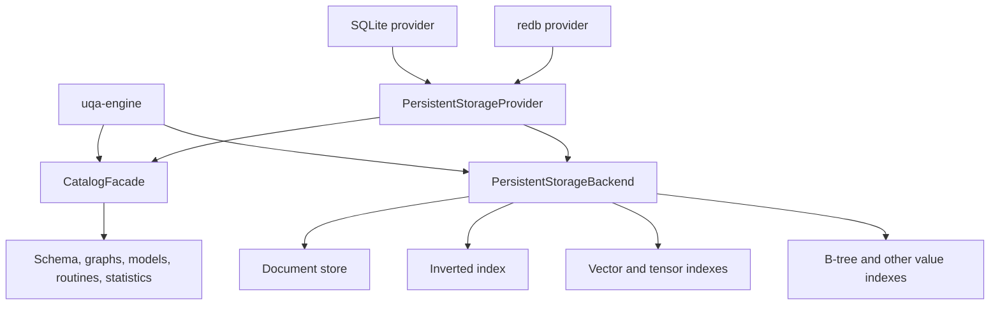
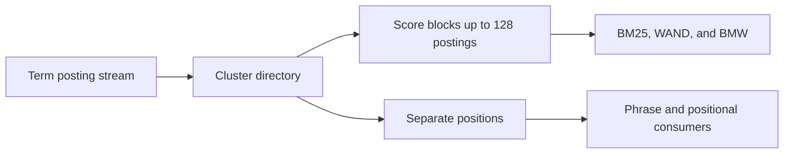
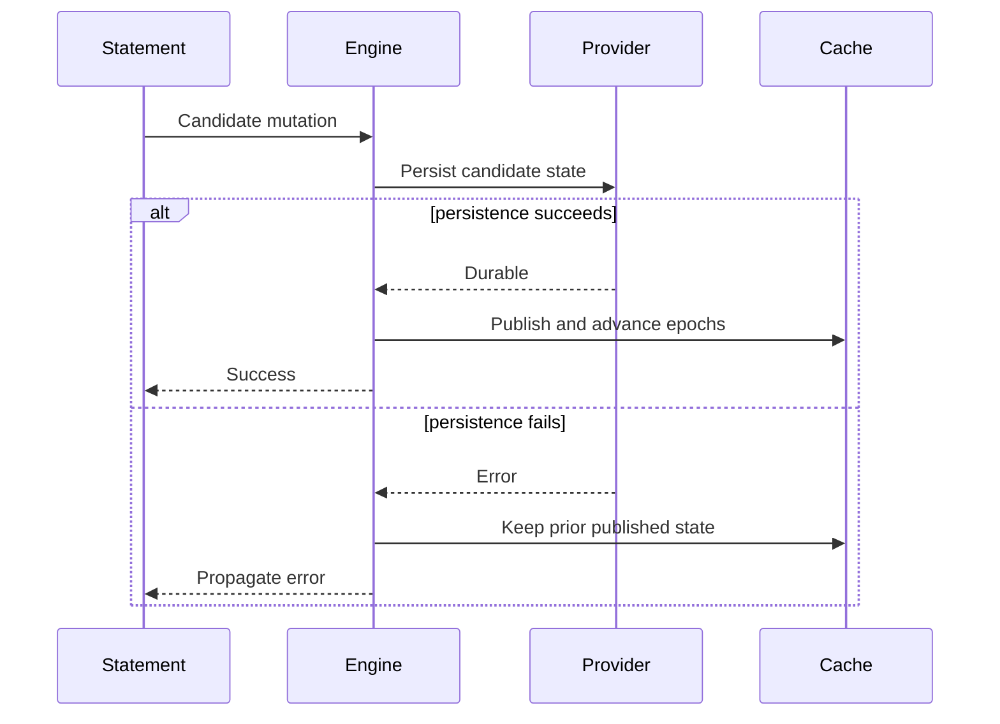

# Storage Internals

The engine separates logical table and index behavior from provider mechanics. Persistent providers bind catalog and data handles to one session transaction context, while in-memory implementations satisfy the same high-level contracts without file durability.

## Storage boundary

`PersistentStorageProvider` creates catalog and backend handles together for a new session. `Engine::from_persistent_provider` retains that factory and can create sibling sessions. `Engine::from_persistent_backends` accepts already-bound handles and therefore cannot manufacture another transaction context.

## Logical storage contracts

`uqa-storage` defines backend-neutral traits for document rows, inverted postings, vector and tensor values, B-tree values, block-max metadata, spatial data, catalog records, and ordered Key/Value operations.

B-tree backend methods use `ValueIndexKey::Column` for ordinary field indexes and `ValueIndexKey::Index` for a named catalog index. These are separate physical namespaces even when their strings are identical: SQLite encodes them as TEXT and BLOB keys, and key-value providers use distinct binary tags. Expression indexes store a composite `Value::Row` key under the named index identity. The engine owns SQL expression binding, dependency traversal, and key evaluation; storage providers preserve expression catalog payloads without depending on SQL AST types.

Expression key preparation finishes before the document-store write lock is acquired. The in-memory index retains each document's stored key so updates and deletes remove the original posting even after an immutable routine is replaced. Rollback recovery hydrates caches directly from restored durable postings without invoking SQL callbacks or reentering the transaction coordinator; a missing durable index remains cold until ordinary statement execution can rebuild it. Named memory and temporary indexes retain evaluated keys in transaction snapshots and are preserved when column accelerators are invalidated. VACUUM FULL rebuilds the physical indexes after rewriting their table.

`KeyValueStore` supports point reads, ordered prefix scans, bounded key-only paging, atomic batches, and range deletion. Binary keys encode segments unambiguously and use big-endian numeric identities so lexical order preserves document order.

## Provider matrix

| Provider | Main implementation | Session transaction identity | Security notes |
| --- | --- | --- | --- |
| Memory | In-engine memory stores | Engine session state | No durability |
| SQLite | Catalog and storage modules in `uqa-storage` plus `uqa-storage-sqlite` Key/Value implementation | Managed connection | Plain, SQLCipher, or compressed VFS open paths |
| redb | `uqa-storage-redb` | Independent read or write transaction over shared database | No encryption at rest |

SQLite is the default persistent engine. redb uses the same SQL and logical storage surface through the provider contract.

## Durable catalog

The persistent catalog records:

- Schemas, tables, columns, constraints, views, and sequences
- Documents and table identities
- Full-text fields, postings, analyzer configuration, and analyzer assignment
- Vector and tensor field metadata, physical IVF and HNSW identities, and values
- Relational catalog indexes and statistics
- Named graphs, vertices, edges, memberships, deltas, and path indexes
- Scoring parameters and calibration models
- Foreign servers and foreign tables with atomically paired role ownership, relation ACLs, and column ACLs
- Serializable ML model definitions
- SQL and PL/pgSQL routines

Runtime host-language callback code is not a durable catalog object.

Analyzer JSON, field-phase assignments, GIN ownership, reopen behavior, and external synonym resources are detailed in [Analyzer pipeline internals](04-analyzer-pipeline.md).

## Full-text posting layout

Persistent postings are clustered rather than stored as one value per term and document. One cluster key represents `(table, field, term, doc_id / 65536)`. Document identities are delta encoded, and score data is separated from positional data.

A score cursor loads the directory and reuses one decode buffer for its current block. Score-only ranking carries document identity, term frequency, and document length without reading positions or making per-document length lookups.

SQLite stores clustered values in `_posting_clusters` and `_posting_documents`. redb and the SQLite Key/Value implementation use the same codec under separate score, position, and document-term namespaces.

## Vector storage

A vector field begins with exact brute-force access. `CREATE INDEX USING ivf` or `USING hnsw` installs a distinct physical index identity and durable metadata. Reopen attaches the stored structure; it does not rebuild merely because the process restarted.

Mutation maintains the selected physical index according to its contract. Index creation, replacement, and failure must publish catalog identity only after the physical candidate is durable and validated.

## Graph storage

Named graphs have explicit durable identity. Vertex, edge, property, membership, temporal delta, and path-index state is restored with the catalog. Graph and relational mutations enter the same engine transaction coordinator when they occur in one statement or explicit transaction.

## Statistics

Persistent writes retain existing column statistics and transactionally accumulate maintenance counters. One automatic worker per open database uses an independent session: it collects missing statistics, refreshes after `50 + analyzed_row_count / 10` committed changes, and refreshes smaller dirty tables after 60 seconds. The worker checks approximately once per second, coalesces commit notifications, persists successful replacements, and retries durable pending work after failures or reopen. Automatic collection uses a reservoir of at most 4,096 rows across the table hierarchy and projects scalar columns without hydrating BYTEA, vector/tensor, JSON, array, or record payloads. Existing estimates remain available during refresh; missing estimates use planner defaults. Persistent query planning never invokes synchronous ANALYZE. Memory-only engines retain lazy in-memory collection. Explicit `ANALYZE` forces full collection through the durable maintenance transaction boundary. `Engine::column_stats` reuses clean statistics, including automatic samples, and performs full collection when dirty. Column-targeted analysis projects requested fields, transfers values without copying whole column buffers, and sorts borrowed histogram values. Statistics are cost evidence and never query-correctness authority.

## Atomic publication

For a cross-store mutation, the engine prepares candidate row, catalog, index, graph, model, and cache state inside the transaction. Persistence succeeds before in-memory published registries advance. Rollback restores transaction-owned registries and discards provider changes.

## Migrations

Provider open runs required schema and posting-format migrations before table and index handles are restored. [`migration/registry.rs`](../../../crates/uqa-storage/src/sqlite/catalog/migration/registry.rs) is the single ordered dispatcher, while [`migration/steps/`](../../../crates/uqa-storage/src/sqlite/catalog/migration/steps) gives every catalog version its own SQL or data-dependent owner and records the version only after that step commits. The clustered-posting migration is bounded, atomic, idempotent, and validates output before recording its format marker. Failure retains the legacy representation and leaves no partial new representation.

An application upgrade should test open, restore, query, mutation, close, and reopen against a copy of production-shaped data. Storage compatibility is a release boundary even when the public SQL remains unchanged.

## Encryption and compression

The compressed SQLite VFS uses rollback-journal locking with separate shared, reserved, and pending file locks. A single writer may reserve a transaction while existing and new readers retain their committed view. When that writer requests exclusive access, the pending lock blocks new readers until existing readers finish. Reservation checks observe other connections and processes so readers do not mistake a live writer's journal for crash recovery. The operating system releases locks when their owning process exits.

SQLCipher is the preferred encrypted provider for security-sensitive deployments. The compressed VFS format uses authenticated encryption and commit metadata, but detecting replacement by an older valid whole-file snapshot requires an exact-state anchor stored in an independent trusted domain.

The [compressed VFS security contract](../../design/compressed-vfs-security.md) is mandatory reading before deploying compressed encryption. The [Key/Value backend design](../../design/kv-storage-backends.md) gives the full provider and redb contract.

## Source entry points

| Area | Path |
| --- | --- |
| Storage traits | [`crates/uqa-storage/src/lib.rs`](../../../crates/uqa-storage/src/lib.rs) |
| SQLite catalog | [`crates/uqa-storage/src/sqlite`](../../../crates/uqa-storage/src/sqlite) |
| SQLite migration dispatcher | [`crates/uqa-storage/src/sqlite/catalog/migration/registry.rs`](../../../crates/uqa-storage/src/sqlite/catalog/migration/registry.rs) |
| SQLite catalog-version steps | [`crates/uqa-storage/src/sqlite/catalog/migration/steps`](../../../crates/uqa-storage/src/sqlite/catalog/migration/steps) |
| SQLite Key/Value store | [`crates/uqa-storage-sqlite/src/lib.rs`](../../../crates/uqa-storage-sqlite/src/lib.rs) |
| redb provider | [`crates/uqa-storage-redb/src/lib.rs`](../../../crates/uqa-storage-redb/src/lib.rs) |
| Engine open and restore | [`crates/uqa-engine/src/engine_open`](../../../crates/uqa-engine/src/engine_open) |
