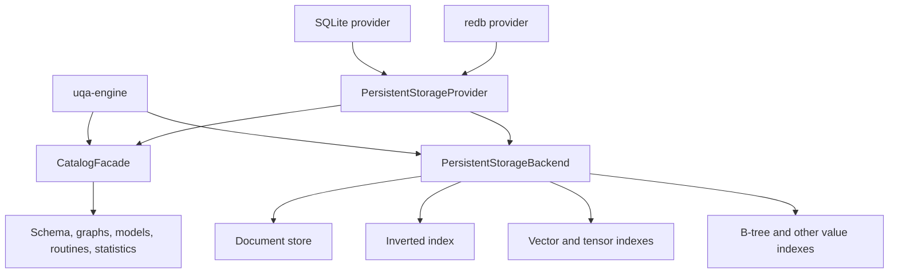
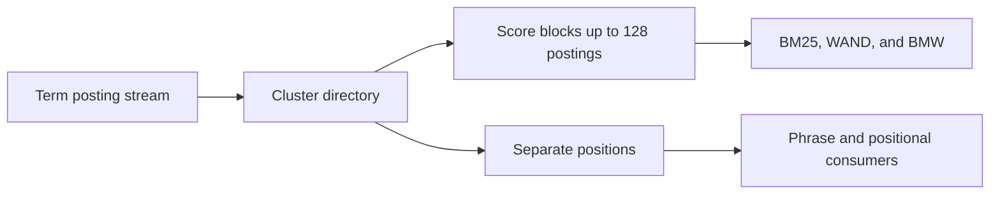
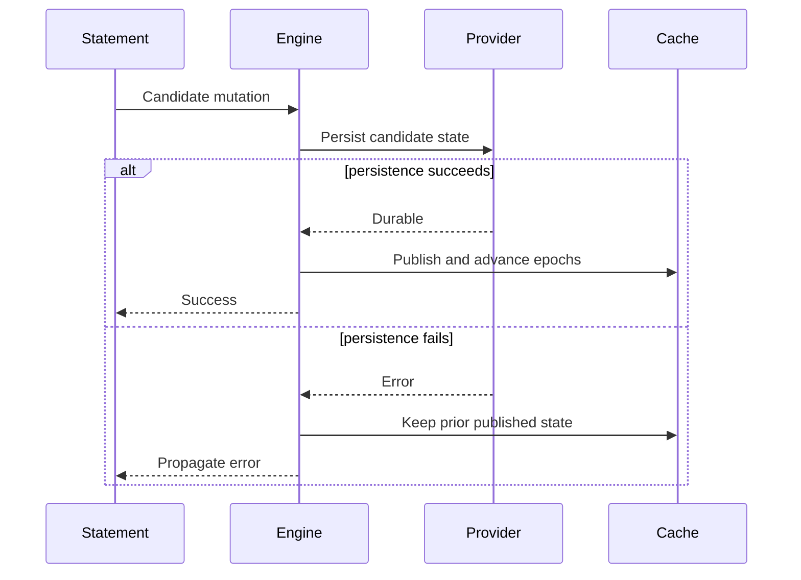

# Storage Internals

The engine separates logical table and index behavior from provider mechanics. Persistent providers bind catalog and data handles to one session transaction context, while in-memory implementations satisfy the same high-level contracts without file durability.

Memory document stores and inverted indexes share immutable corpus state when creating read or writable snapshots. Their owning storage implementations copy shared state only when it is mutated; clearing or rebuilding a snapshot replaces the state without copying discarded data. Documents retain their layout IDs and tuple metadata, while inverted indexes retain postings, occurrences, field metadata, and corpus counters together. Analyzer bindings remain independent across snapshots. The concrete stores' `Clone` implementations retain their independently owned maps, so preparing a cloned index does not defer that preparation cost into its first mutation. This keeps read snapshots independent of corpus size and preserves writable rollback snapshots without placing snapshot algorithms in Engine.

## Storage boundary

`PersistentStorageProvider` creates catalog and backend handles together for a new session. `Engine::from_persistent_provider` retains that factory and can create sibling sessions. `Engine::from_persistent_backends` accepts already-bound handles and retains the backend's session factory; independent sessions require that backend to implement `open_session`.

Built-in persistent catalog and backend handles report a common `StorageSessionAffinity`. Connection/store clones share this process-local identity, while independent sessions receive different identities even over the same database. `PersistentStorageSession::validate_transaction_affinity` rejects different identities or a known identity paired with an omitted one. Engine validates initial restoration and sibling attachment before using their storage handles. Legacy custom pairs that both omit identity retain their existing caller-managed contract; wrappers around a reporting implementation must delegate the identity. This check establishes transaction affinity, not complete concurrent SQL support.

## Logical storage contracts

`uqa-storage` defines backend-neutral traits for document rows, inverted postings, vector and tensor values, B-tree values, block-max metadata, spatial data, catalog records, and ordered Key/Value operations.

`uqa-storage-sqlite` implements those contracts and the graph persistence contract from `uqa-graph`. It owns managed connections, catalog migrations, physical indexes, transactions, SQLCipher integration, and the compressed VFS. Neither common storage nor graph algorithms depend on the SQLite provider or driver, including their tests and benchmarks. Cross-provider graph conformance tests and SQLite persistence benchmarks live in `uqa-storage-sqlite`. Concrete Rust imports and provider error handling are described in the [Rust migration notes](../reference/10-upgrading.md#sqlite-provider-ownership).

Common Key/Value vector consumers use `KeyValueStore::with_read_view` to select one fixed committed/private boundary. IVF reads centroids, assignments and canonical tensors together; HNSW reads its header, graph nodes and canonical tensors together. `with_mutation` evaluates once against the boundary supplying original write preconditions, then applies staged canonical values and the IVF metadata/assignment changes or HNSW graph delta atomically. Errors, cancellation and unwinds discard that operation while preserving earlier private writes; publication failures retain the evaluated attempt for resolution. Neither callback may reenter its own store session or perform transaction control. Common logical sessions own this behavior; SQLite forwards the calls and redb uses the common implementation.

IVF and HNSW share the same immutable cache and exactly-once evaluation adapter. Cache identities include the database, committed sequence and relevant non-reused private record identities; the memory reference store rotates retained identity tokens on writes and undo. Live handles refresh after rollback, savepoint branching, definition recreation and independent commits. Creation retains its requested parameters across unrelated writes. HNSW restoration validates graph/canonical agreement; IVF restoration validates vector counts, ordinals and assignment references while retaining the stored centroids and assignments. Common Key/Value mutations and native SQLite mutations use the common `IVFIndex::prepare_metadata` owner to produce immutable IVF candidates from evaluated replacement/delete/reset/training inputs. Preparation reserves a conservative bound for candidate state and numerical scratch before cloning, polls cancellation, and retains the resulting metadata allowance; reset discards the generation without cloning its corpus. Empty vector replacement and document deletion preserve their distinct deletion-counter behavior. These boundaries do not yet provide shared-index mutation merging or general definition fencing. Full IVF/HNSW cache and search workspace accounting remains required.

Exact vector snapshots own the canonical tensors selected by one read view instead of retaining a live store handle. Their payloads share the session read allowance across nested snapshots; loading failures return their reservations, and scoring checks cancellation and charges temporary score/posting buffers. Exact, IVF and HNSW snapshots retain their original data after subsequent writes, rollback and closing the live handle, and reject mutation even when the caller holds the only reference. Third-party stores must implement compound reads for vector consumers and evaluated mutations for IVF/HNSW; unsupported capabilities return explicit errors.

B-tree backend methods use `ValueIndexKey::Column` for ordinary field indexes and `ValueIndexKey::Index` for a named catalog index. These are separate physical namespaces even when their strings are identical: the SQLite provider encodes them as TEXT and BLOB keys, and key-value providers use distinct binary tags. Expression indexes store a composite `Value::Row` key under the named index identity. SQL binding and execution layers own expression binding, dependency traversal, and key evaluation; storage providers preserve expression catalog payloads without depending on SQL AST types.

Expression key preparation finishes before the document-store write lock is acquired. The in-memory index retains each document's stored key so updates and deletes remove the original posting even after an immutable routine is replaced. Rollback recovery hydrates caches directly from restored durable postings without invoking SQL callbacks or reentering the transaction coordinator; a missing durable index remains cold until ordinary statement execution can rebuild it. Named memory and temporary indexes retain evaluated keys in transaction snapshots and are preserved when column accelerators are invalidated. VACUUM FULL rebuilds the physical indexes after rewriting their table.

`KeyValueStore` supports point reads, ordered prefix scans, bounded key-only paging, atomic batches, and range deletion. Binary keys encode segments unambiguously and use big-endian numeric identities so lexical order preserves document order.

Development Key/Value graph catalogs record typed path-cache effects with their private source changes. Common storage resolves graph memberships and path ownership against a fresh committed view, so independent graph writers can both invalidate a shared cache and an older writer also invalidates indexes or memberships created after its snapshot. Private invalidation previews do not clear a cache subsequently reassigned to another graph. A completed path build validates the graph registration, label registry, membership/source revisions and index definition before publishing its validity marker; a build with stale inputs is not published as current. Savepoints restore both records and effect order. Canonical source records retain their original conflict checks.

The prepared fingerprint seals original records, cache-write kinds and ordered graph effects. SQLite Key/Value and redb check the durable receipt first, then validate the snapshot used to prepare derived effects under physical write admission. An intervening commit permits only those effects to be prepared again, with the same transaction identity and fingerprint; SQL, graph evaluation and callbacks are not repeated. A lost commit reply resolves through its receipt before applying any cache effect again. Typed cache state and dependency discovery remain bounded by the session allowance and cancellation. The bound native catalog uses the same resolver through native key/row codecs. Fair admission for repeated preparation remains pending.

## Provider matrix

| Provider | Main implementation | Session transaction identity | Security notes |
| --- | --- | --- | --- |
| Memory | In-engine memory stores | Engine session state | No durability |
| SQLite | `uqa-storage-sqlite` | Managed connection; Key/Value binds it to a common logical session | Plain, SQLCipher, or compressed VFS open paths |
| redb | `uqa-storage-redb` | Common logical session over one shared database owner | No encryption at rest |

SQLite is the default persistent engine. redb uses the same SQL and logical storage surface through the provider contract.

The development redb provider uses common logical Key/Value sessions: private changes and savepoints retain no physical writer, reads pin a committed sequence, and short conditional commits publish versions and receipts atomically. Its catalog/backend pair shares that session. Default retention is 64 MiB per session and can be set through `RedbStorage::open_with_options`; it is separate from the query read allowance. See the [transaction and file-format contract](../../design/kv-storage-backends.md#redb-transaction-mapping) and [unreleased upgrade boundary](../reference/10-upgrading.md#unreleased-redb-record-format).

Common storage preserves an indeterminate transaction identity across later commit/abort failures and validates the receipt's transaction identity and prepared fingerprint before accepting it. `StorageBackendError::commit_outcome` exposes typed committed, aborted or indeterminate evidence through provider error wrappers. Verified terminal outcomes remain in the session so completing or discarding that attempt requires no second persistence lookup. Providers emitting these typed outcomes must retain their sealed attempt and permit receipt resolution without reevaluating application operations. Engine adapts this evidence into a retained commit-resolution state, and execution's statement cleanup preserves that state. SQL preparation runs once; successful resolution releases the retained frame and publishes its row changes, epochs and notifications through the ordinary completion path. Durable cross-process publication recovery remains part of the concurrent-storage implementation plan.

Native SQLite, SQLite Key/Value and redb occurrence writes now merge evaluated per-document cluster changes and checked field-count/length deltas against a fresh committed snapshot. Whole-document guards reject overlapping replacements even when writers choose different fields; structural guards survive drop/recreation and reject stale source writes across rebuild, purge, rename and column changes. Source commits invalidate late skip/block-max caches, while stale cache builds keep their original source preconditions. Commit admission can repeat only this storage preparation, retaining the sealed fingerprint and receipt identity; analysis and scoring are not replayed. Vector merging and concurrent Engine SQL remain unfinished.

The development SQLite `SQLiteRecordStore` implements the common record-persistence contract. Its provider-owned `_uqa_mvcc_metadata` table stores record format version 2, database identity, transaction allocation counter, committed sequence and record mapping. `_uqa_mvcc_heads` identifies each key's latest revision, `_uqa_mvcc_versions` retains historical values and tombstones, and `_uqa_mvcc_transactions` retains transaction outcomes and prepared-batch fingerprints. These objects belong to the physical SQLite format; applications do not manage them through UQA SQL. Historical versions and receipts currently remain retained. Common Key/Value document/structure guards occupy the separate `z` byte-key namespace; clearing occurrence data does not remove them. See the [development record-format upgrade boundary](../reference/10-upgrading.md#unreleased-rust-keyvalue-compound-operations).

The provider's `mvcc::native` module maps the 43 current catalog tables, table-owner bindings, graph lookup entries and two normalized occurrence accelerator tables into 47 fixed record families. Table-owned data uses its object identity and storage generation instead of its current table name in record keys; table and sequence definitions validate their persisted identity fields against that owner. Rows preserve SQLite storage classes, including binary document fields, tuple metadata and the distinct TEXT/BLOB B-tree namespaces. Decoded payloads borrow their retained record buffers. The codecs enforce layout types, ordered key encoding, allocation limits and cancellation, including complete validation of absent tombstone keys.

Native mapping format 2 adds `_uqa_mvcc_native_graph_lookup`, a provider-owned SQLite table containing only graph entity identities indexed by label, edge source/target and graph membership. Its entries have the same committed/private visibility mechanism as source records, so retained snapshots can select IDs without consulting current-only SQLite indexes or loading entity properties. Prepared graph mutations must include changed lookup entries; physical projection triggers and commit validation reject missing effects or independent lookup changes that disagree with their source. Property-only changes leave lookup revisions unchanged. Opening mapping format 1 atomically derives lookup history from source revisions at their original commit sequences, preserving the database identity, allocation counter, source histories and receipts. Conversion streams one source key and revision at a time under the read allowance, checks current sources against history in both directions, rejects revisions missing their head index, and rolls back schema and history together on failure. The catalog version remains 49. Mapping format 3 additionally versions the graph-to-path directory, as described below.

Bound native catalog graph entity and membership reads now use one retained committed/private view. Point entities, names, memberships, filtered identity pages, counts and maximum IDs observe that view; named-graph hydration uses the same boundary for registration, label registry, memberships and entity payloads. Common storage chooses the primary selector in source, target, label, graph, then full-scan order; native SQLite and Key/Value catalogs consume that choice. Native filtered reads page through identity keys under the session allowance and apply the remaining predicates before the result limit, without loading entity properties. They advance through tombstone-only pages and release physical I/O before checking other keys or hydrating selected entities. Whole-graph and full catalog loaders still return their explicitly requested payload collections. Missing referenced entities, unregistered graphs with memberships and unknown membership types remain errors. Concurrent Engine SQL and complete cache restoration remain pending; catalog mutation routing is described below.

Native mapping format 3 adds path-index ownership entries to the existing graph lookup family. An atomic upgrade from format 2 derives only those missing entries from path-state history; format 1 also derives the earlier entity/membership selectors. Original source revisions, unaffected lookup revisions, allocations and receipts retain their identities and commit boundaries. Property/validity-only updates do not rewrite the directory. Missing history heads, source/history disagreement and incomplete prepared lookup changes remain errors. Source path state is applied before its lookup entries so SQLite trigger conflict handling cannot collide with an already installed new directory entry.

Bound native catalog vertex/edge writes, named-graph registration/removal, memberships, snapshot replacement and orphan cleanup now stage canonical rows, selector changes and shared graph-cache effects together. Path definitions, bounded pair writes/paging, clearing, build completion and validity checks use the same retained boundary. Definition invalidation discovers a cache completed after the definition writer took its snapshot. Explicit private cache replacements survive later invalidation previews, while source-only previews follow current ownership at commit. Replacement preserves shared entities and the final occurrence of a repeated input identity, and failures publish no partial source or selector changes. These catalog APIs still require graph/definition locking, endpoint constraints, coordinated allocation, complete cache restoration and complete Engine integration before concurrent SQL can be enabled. Standalone qualified graph table families retain their separate format and are not covered by this native catalog mapping.

The explicit development `SQLiteRecordStore::for_native` adapter atomically converts an initialized schema 48 catalog into a schema 49 materialization and its complete baseline record history. `_uqa_mvcc_native_owners` assigns exact native table names to stable object/generation pairs; canonical catalog names use their persisted identities, while distinct standalone API names retain distinct owners. Missing legacy table/sequence identities are allocated during conversion. A native-format marker and empty transactional work queues are validated on reopen, along with the layouts and write/capture guards. Existing populated raw record histories cannot be mixed with a native baseline. This lower persistence API is separate from default Engine opening: complete native catalog/backend session routing is still pending, and unbound direct handles are rejected after explicit conversion.

`ManagedConnection::bind_native_records` explicitly attaches an initialized native catalog to this common logical session. Existing connection clones and `SQLiteDocumentStore` handles join it; `new_session` creates an independent context. Native document reads, bulk projections and retained snapshots keep the body and selected BLOBs on one committed/private boundary. Puts preserve tuple metadata atomically, patches leave unrequested BLOBs untouched, and deletes include the native B-tree cascades in the same evaluated batch. Autocommit evaluates reads inside its logical transaction, evaluation errors/unwinds roll back only an owned transaction, and publication failures retain the sealed attempt for explicit commit/rollback resolution. The mapping cannot be rebound as Key/Value or given another retention limit. This development entry point routes documents, B-tree storage, occurrences, exact/IVF/HNSW vectors and the catalog operations described below. An explicitly constructed provider also supports Engine restoration and sibling sessions. Bind before opening a catalog on an already converted file. Default Engine opening and complete concurrent SQL integration remain unfinished; standalone graph storage retains its separate format.

`SQLiteBTreeIndexStore` uses the same native session for definitions, repair markers, loaded entries, per-document writes, replacement, sparse repair and deletion. TEXT column keys and BLOB named-index keys retain distinct namespaces, and existing tagged value serialization preserves composite expression values and floating-point bits. Existing index definitions are not rewritten by independent row updates, allowing two document/index batches to commit without conflicting on their common marker. Replacement validates duplicate IDs and backing documents before staging the batch. Reads pin definitions and postings together; document deletion reuses the B-tree owner's namespace seek to stage its cascaded removals. This establishes native per-document B-tree routing; index-definition generation fencing, other shared index algorithms and SQL lock/isolation integration remain in the implementation plan.

Native catalog metadata, schema ACLs, model/scoring parameters, named analyzer revisions and per-field analyzer bindings now use this session too. Existing catalog handles join the bound connection, and `Catalog::open` can attach to an already bound native session without running legacy physical migrations. Ordered registry reads use one retained boundary; analyzer replacement, legacy binding invalidation and field deletion stage atomic batches. Schema removal checks its visible relation ownership, and mapped format metadata is immutable. Views and foreign servers/tables also use this session. Creation, replacement, rename and removal stage relation claims and definition rows together; foreign-table security updates preserve their server, columns and options. Rename preserves nullable view ACLs, and ordered reads remain on one retained boundary. Catalog and document changes commit or roll back together. Graph catalog reads and mutations and cache-revision reads use that retained boundary. Default Engine model selection and complete concurrent SQL integration remain pending.

Initial restoration validates the native catalog on one retained committed/private view. Schema membership, relation kinds, unique definition names, the two-way relation/definition mapping and catalog-index table references must agree. B-tree entry keys must have live parent definitions in their corresponding TEXT column or BLOB named-index namespace. The validator pages through keys and metadata without loading B-tree values or unrelated model/document payloads, and its temporary collections share the read allowance and cancellation. It does not bypass the logical session to run physical SQLite foreign-key queries.

Ordinary table definitions and catalog indexes now share this session. Table identities and storage generations bind their fixed table-owned families; rename preserves the table identity, while generation replacement transfers evaluated rows and rejects late or stale-generation writes. Definition-only deletion retains standalone data, purge preserves field analyzer configuration, and full deletion removes all fixed table-owned families and index claims. Exact standalone API names remain separate from canonical catalog names; rename moves only the explicitly named data and rejects colliding destination keys. Catalog table names and index references change together, including rename followed by reuse of the old name in the same transaction. Native conversion normalizes recognized dynamic FTS skip/block-max tables into fixed table-owned families; unknown tables and ambiguous populated accelerator names remain errors.

Column lifecycle and column statistics also use the native logical session. The caller stages document-body and schema rewrites in the same transaction; catalog column operations then move or remove field-owned records and update ordinary catalog index keys together. Field selection reads ordered keys without hydrating unrelated BLOBs. Existing destination records are preserved, and B-tree parent replacement discards superseded source postings while retaining the separate named-expression namespace. B-tree destination preservation does not depend on SQLite foreign-key cascades being enabled. Repair markers follow the surviving field; a same-name rename leaves data unchanged in legacy and bound-native catalogs. Statistics reads retain one boundary, preserve nullable values and exact standalone names, and return columns in name order. Replacement rejects duplicate columns, mismatched table names and oversized batches without publishing a partial replacement. SQL definition locking, maintenance coordination and complete retrieval routing remain separate requirements.

Native sequence definitions, relation claims, rename/drop, cached value reservation and value setting also use the selected logical session. Ordered loads share the legacy sequence decoder for object identities, owner dependencies and nullable ACLs; value mutations preserve the other definition fields and use common storage reservation arithmetic. Object-scoped value access avoids unrelated sequence payloads. A definition-generation change retires its old record, and commit admission rejects competing generations of one sequence incarnation, including aliases created by independent sessions; conversion rejects existing duplicate incarnations atomically. Definition/value batches participate in private changes, savepoints, retained views and exact commit retry. Execution remains responsible for choosing an autonomous session for allocation on committed sequences; the new SQL transaction model still needs that integration and the creation/restart/drop distinctions before concurrent Engine SQL can be enabled.

Bound native `Catalog::cache_revisions` reads committed generations and private changes from one retained snapshot. Common storage assigns non-reused process-local identities to private batches; the SQLite adapter projects only affected table, registry, graph, statistics and maintenance scopes. Durable generations occupy the nonnegative `i64` domain, while private equality tokens occupy the upper half of `u64` and never enter persistent rows or conflict checks. Savepoints restore earlier tokens, later undo branches receive new identities, and commit replaces private tokens with durable generations. These values are opaque equality tokens, not clocks or mutation counts. Changed-key pages, table-owner bindings and graph membership identities avoid loading document bodies, model payloads or graph properties; generation collections are charged while being assembled. The native storage-schema token identifies its fixed catalog format; raw physical DDL is outside a bound native session.

Bound native `SQLiteVectorIndex` and `SQLiteIVFIndex` APIs also use the managed logical session. Native IVF mutations restore and validate the stored centroids, assignments and counters through common storage, preserving them until the common training threshold requires retraining. Search rejects populated indexes with missing metadata and headers that disagree with the handle or canonical count. For trained generations it also rejects missing centroids, incomplete assignment coverage and selected assignments whose canonical values are missing, instead of falling back to exact search; explicit initialization rebuilds the physical index from canonical tensors. Tensor replacement, deletion and clear stage complete canonical records; IVF training and mutation stage the matching header, centroids and assignments in the same atomic batch. Searches retain one committed/private boundary across metadata, counts, assignments and selected canonical vectors. Vector counts read keys without payloads, and vector collections charge the session read allowance while they are held. Retained exact/IVF snapshots remain read-only across later writes, savepoint rollback, table rename/drop and commit. Existing IVF assignments are read without retraining on reopen. Independent canonical documents and separate IVF fields can commit while another transaction retains private changes. Shared changes to the same IVF structure still require the common index-delta resolver; Postings, definition fencing and concurrent Engine SQL remain unfinished.

Bound native `SQLiteHNSWIndex` reads headers, nodes, edges and canonical vectors from one retained committed/private record view. Mutations reuse the common HNSW implementation and stage canonical tensors, the header and incremental graph changes in one atomic batch; clear and explicit metadata removal use the same session. Cache identities include the table owner, durable data revision and non-reusable private batch identities, so rollback branches and same-revision recreation cannot reuse discarded graphs. Retained snapshots are read-only and retain their original canonical and graph generations through rename, drop, rollback and later commits. Reopen reconstructs the stored graph without rebuilding it. Separate HNSW fields can publish while another field remains private, including compressed and encrypted files; merging concurrent mutations of one HNSW structure remains required. Native decoded graph collections use the session read allowance; common HNSW cache and algorithm workspace accounting remain part of resource acceptance.

Native commits validate original revisions and their current materializations before applying evaluated rows in dependency order. Transactional capture triggers record every physical primary key touched by cascades or native triggers. Every final row must match the prepared batch; an omitted B-tree deletion or graph-path invalidation rejects and rolls back the whole commit. Provider-owned cache increments are captured into history at the same committed sequence, so independent row commits preserve both invalidations. An owner-generation change must retire every original row, and a new generation cannot overwrite another record's physical key. Materialized rows, history, cache revisions and receipts publish together; retrying a confirmed receipt does not apply those effects again. Size probes and payload reads share one physical transaction, and the work queues are empty at every durable boundary.

`SQLiteKeyValueStore` and its paired catalog/backend now use common logical sessions over these records. Connection clones retain one transaction context, while `new_session` creates an independent context. Legacy Key/Value bytes migrate atomically, and persistent `_key_value` and `_metadata` guard views reject old byte-store writes and native catalog initialization. Missing or changed guards cause reopen to fail. The default session allowance is 64 MiB, configurable through `SQLiteKeyValueStorage::open_with_options` or `from_connection_with_options`. Native relational files use the separate native record adapter described above; complete catalog/backend routing remains pending. See [SQLite Key/Value transactions](../../design/kv-storage-backends.md#sqlite-keyvalue-transaction-mapping) and the [upgrade contract](../reference/10-upgrading.md#unreleased-sqlite-keyvalue-record-format).

SQLite write guards call the connection-local `__uqa_mvcc_write_permit()` function, which returns one only while the provider holds its private physical-write permit. Dropping the permit closes it even after an error or unwind. The guard covers record tables and, after native conversion, the existing native tables and mapping metadata. `__uqa_mvcc_native_key()` only encodes touched physical keys; it performs no SQL, I/O or application callbacks. These guards prevent accidental writes outside the versioned persistence path and do not protect against deliberate external schema changes. Common storage owns private changes and conflict validation, while the provider owns these functions, physical transactions and durable record encoding. redb implements the same common persistence contract using its own tables without SQLite functions.

The [concurrent storage transaction design](../../design/concurrent-storage-transactions.md) covers native SQLite, SQLite Key/Value and redb. Concurrent Engine SQL writers are not yet enabled: Engine retains its writer gate, while native SQLite, shared index deltas, SQL isolation and publication integration remain in progress. The [implementation plan](../../plans/0008-concurrent-storage-transactions.md) tracks these acceptance requirements separately from direct Key/Value behavior.

Bound native `SQLiteInvertedIndex` adapts canonical occurrence rows to the common `OccurrenceStorage` contract. Compound reads, scalar and bulk statistics, graph postings, controlled cursors and retained snapshots share one committed/private boundary. Mutations coalesce paired native columns and publish documents, lengths, field metadata and postings in one batch; source rebuilds retire old or discarded payloads without decoding them. Native document/skip scalars use the common big-endian value encoding, while field-statistic counters retain their existing little-endian encoding. Physical SQLite integers retain their original values.

Mapping format 4 adds `_occurrence_skips` and `_occurrence_block_max` as two fixed table-owned families. Initial conversion imports recognized dynamic accelerator tables, validates their schema and requires each populated name to resolve to one source field; ambiguity or malformed input rolls back conversion. Earlier development native formats upgrade atomically without rewriting original source histories or receipts. These are provider-owned SQLite tables. Common storage builds skips and scorer-versioned block bounds from the same occurrence view. Source writes and column lifecycle changes invalidate derived accelerators and fence late competing builds, including builds absent from the original view. Retained bounds survive later invalidation and rollback; mixed scorer fingerprints cannot return a matching prefix as a complete bound list. Shared posting/counter merging also discovers and invalidates caches built after its original source view; complete concurrent Engine SQL acceptance remains open.

## Durable catalog

The persistent catalog records:

- Schemas, tables, columns, constraints, views, and sequences
- Documents and table identities
- Full-text fields, postings, analyzer configuration, and analyzer assignment
- Vector and tensor field metadata, physical IVF and HNSW identities, and values
- Relational catalog indexes and statistics
- Named graphs, vertices, edges, memberships, deltas, and path indexes
- Scoring parameters and calibration models
- Foreign servers and foreign tables with atomically paired role ownership, relation ACLs, and column ACLs
- Serializable ML model definitions
- SQL and PL/pgSQL routines

Runtime host-language callback code is not a durable catalog object.

Analyzer JSON, field-phase assignments, GIN ownership, reopen behavior, and external synonym resources are detailed in [Analyzer pipeline internals](04-analyzer-pipeline.md).

## Full-text posting layout

Persistent postings are clustered rather than stored as one value per term and document. One cluster key represents `(table, field, term, doc_id / 65536)`. Document identities are delta encoded, and score data is separated from positional data.

A score cursor loads the directory and reuses one decode buffer for its current block. Score-only ranking carries document identity, term frequency, and document length without reading positions or making per-document length lookups.

SQLite schema 48 stores native version 2 graph clusters in `_occurrence_clusters`, binary reverse terms and source-end metadata in `_occurrence_documents`, and normalization lengths, field revisions/statistics, and format ownership in `_occurrence_lengths`, `_occurrence_fields`, and `_occurrence_formats`. Terms use canonical BLOB keys, including unpaired UTF-16 units. Key/Value providers, including redb and the SQLite Key/Value adapter, store the same values under one table-owned occurrence namespace.

The common library also provides `TokenTermKey`, `TokenOccurrence`, `analyze_index_field`, and version 2 occurrence/reverse-vocabulary codecs. These preserve raw surrogate terms, repeated same-position edges, graph lengths, and original source spans while keeping frequency independent of the declared normalization length. The [occurrence format](../../design/occurrence-posting-format.md) specifies the exact bytes and validation. Memory, Key/Value, and native SQLite indexes publish these values with exact analyzer fingerprints and source-end metadata. Persistent point/batch mutations coalesce cluster updates and commit complete graph and statistics changes atomically. Initial Engine open rebuilds legacy positional data from original documents under restored descriptors in the catalog transaction, including tokenless fields and catalogs whose analyzer bindings are already current. Populated index revisions require an atomic source rebuild; search revisions remain independent. Graph phrases run in `uqa-operators::phrase`, and source highlighting remains in `uqa-analysis`; their contracts are described in the [search](05-search-and-ranking.md) and [analysis](04-analyzer-pipeline.md) internals.

Japanese provider contract tests reuse eight existing pinned Lucene observations without generating new expected output. They verify width/base-form source spans, stopped positions, user segmentation, N-best compound lengths, repeated frequencies, supplementary text and completion alternatives in Memory, Key/Value, SQLite and redb. The same checks run after independent revision restoration; SQLite and redb also restore a closed database copy after deleting its original directory. Existing occurrence v2 and SQLite schema 48 retain these graphs and metadata without a format change. The reusable assertions live with the storage contract and each provider invokes them from its own single integration target.

Common Key/Value occurrence operations now use one fixed reader for format markers, posting scores/graphs, reverse terms, source metadata and field counters. Document replacement, removal, clear and source rebuild evaluate once and stage one atomic batch with the original write preconditions. Scalar, bulk, multi-field and controlled queries retain the same operation boundary. Controlled cursors own the retained index through every cluster page, and cross-field term-frequency totals retain one view. `OccurrenceStorage` lets native providers project existing rows into this common algorithm without implementing an unrelated general Key/Value store; typed occurrence addresses preserve the existing byte identities. Native adapters must coalesce projected changes into complete physical rows and retain original write preconditions. Retained snapshots share committed/private MVCC owners on SQLite Key/Value and redb, so creation does not copy the posting corpus; the memory reference reader makes a bounded copy of selected namespaces. Nested snapshots share their retained allowance and all snapshot mutation routes reject writes. Shared MVCC publication merges independent document changes to the same posting cluster and field counter for common Key/Value and native SQLite records. Bound native SQLite occurrence consumers use these common algorithms through typed row projections.

`InvertedIndex` exposes controlled posting cursors, selected-document occurrences, and field scoring scalars through `StorageReadControl`. These methods reserve query-owned buffers before allocation and retain the reservation with the value. Controlled defaults reject unsupported provider capabilities instead of invoking an unbounded materializer. `KeyValueStore` provides borrowed value/prefix visitors and a controlled prefix-existence probe; visitor callbacks must not reenter the store. Persistent callers keep their session transaction open across related cursor, metadata, and occurrence reads. SQLite size probes and materialization share that transaction, or one temporary snapshot for a standalone read; memory/redb visitors borrow provider-owned bytes. Database caches, immutable index state, allocator bookkeeping, and fixed stack scratch retain their existing ownership.

`MemoryInvertedIndex::try_add_documents` stages the affected documents and their global field-counter context in a private projection while sharing immutable analyzer handles. Ordered point replacements validate every input, including repeated document identities, deletions, field changes, and intermediate counter overflows. Publication begins only after the complete batch succeeds. Unchanged documents retain their occurrence and position allocations, and an empty batch returns immediately. Source rebuilds still construct a complete replacement because every indexed document belongs to that operation.

Native SQLite occurrence publication implements `OccurrenceRecordLayout` with borrowed row projections and native integer bounds. The common MVCC resolver owns three-way document merging, checked field-count/length deltas, fresh cache discovery and receipt-safe retries. Mapping format 5 adds `_uqa_mvcc_native_occurrence_guards`: document guards span all fields in one table generation, and structural guards retain a versioned tombstone even when no index data exists. Clear, rebuild, purge, table transfer and column changes fence the original format revision. Guards are internal dependency records and do not count as user data during table-name transfer. Formats 1–4 upgrade atomically, preserving existing history, database identity, allocations and receipts; earlier adapters reject the new mapping marker. The catalog stays at version 49 and the record format at version 2.

## Vector storage

A vector field begins with exact brute-force access. `CREATE INDEX USING ivf` or `USING hnsw` installs a distinct physical index identity and durable metadata. Reopen attaches the stored structure; it does not rebuild merely because the process restarted.

Mutation maintains the selected physical index according to its contract. Index creation, replacement, and failure must publish catalog identity only after the physical candidate is durable and validated.

On the physical SQLite path, HNSW cache identity includes its connection, rollback branch, local change count and observed database version as well as the stored graph revision. This prevents a repeated revision after rollback or index recreation from naming a different cached graph. Cache selection, canonical validation, candidate evaluation and optional persistence share one SQLite snapshot; publication uses the identity captured with the evaluated result. A stable view reuses its immutable graph, while retained graph snapshots survive later recreation. A competing commit during evaluation rejects the obsolete write without replaying graph mutation. Bound native HNSW uses the logical record identities described above.

## Graph storage

Named graphs have explicit durable identity. Vertex, edge, property, membership, temporal delta, and path-index state is restored with the catalog. Graph and relational mutations enter the same engine transaction coordinator when they occur in one statement or explicit transaction.

## Statistics

Persistent writes retain existing column statistics and transactionally accumulate maintenance counters. One automatic worker per open database uses an independent session: it collects missing statistics, refreshes after `50 + analyzed_row_count / 10` committed changes, and refreshes smaller dirty tables after 60 seconds. The worker checks approximately once per second, coalesces commit notifications, persists successful replacements, and retries durable pending work after failures or reopen. Automatic collection uses a reservoir of at most 4,096 rows across the table hierarchy and projects scalar columns without hydrating BYTEA, vector/tensor, JSON, array, or record payloads. Existing estimates remain available during refresh; missing estimates use planner defaults. Persistent query planning never invokes synchronous ANALYZE. Memory-only engines retain lazy in-memory collection. Explicit `ANALYZE` forces full collection through the durable maintenance transaction boundary. `Engine::column_stats` reuses clean statistics, including automatic samples, and performs full collection when dirty. Column-targeted analysis projects requested fields, transfers values without copying whole column buffers, and sorts borrowed histogram values. Statistics are cost evidence and never query-correctness authority.

## Atomic publication

For a cross-store mutation, the engine prepares candidate row, catalog, index, graph, model, and cache state inside the transaction. Persistence succeeds before in-memory published registries advance. Rollback restores transaction-owned registries and discards provider changes.

## Migrations

Engine initial open calls `PersistentStorageProvider::open_initial_session` and prepares deferred catalog storage through `CatalogFacade::initialize_storage` inside the backend transaction. SQLite joins catalog schema preparation, analyzer restoration, posting conversion, and required FTS source rebuilds in that transaction. [`migration/registry.rs`](../../../crates/uqa-storage-sqlite/src/catalog/migration/registry.rs) dispatches the ordered [`migration/steps/`](../../../crates/uqa-storage-sqlite/src/catalog/migration/steps) through nested savepoints; schema versions become durable only when the owning transaction commits. A later migration, analyzer, or FTS rebuild failure restores the original schema and postings. Standalone `Catalog::open` commits its complete schema preparation atomically and preserves the durable source-rebuild requirement. It does not discard incompatible legacy FTS tables to repair their shape. Ordinary session factories still return initialized catalogs. Tracked session refresh restores committed analyzer bindings before reopening changed physical indexes, so both use the same stored revision.

An application upgrade should test open, restore, query, mutation, close, and reopen against a copy of production-shaped data. Storage compatibility is a release boundary even when the public SQL remains unchanged.

## Encryption and compression

The compressed SQLite VFS uses rollback-journal locking with separate shared, reserved, and pending file locks. A single writer may reserve a transaction while existing and new readers retain their committed view. When that writer requests exclusive access, the pending lock blocks new readers until existing readers finish. Reservation checks observe other connections and processes so readers do not mistake a live writer's journal for crash recovery. The operating system releases locks when their owning process exits. Read-only VFS opens use the existing lock sidecars with read-only file handles; they do not request write access or create lock paths, and they still participate in the same cross-process lock protocol.

Compressed sessions refresh transaction snapshots through their pinned connection instead of the independent change-version monitor. This applies to read and write transactions: a pending writer can block the monitor while waiting for the same session's existing read lock, creating a lock cycle. WAL sessions and compressed sessions without a pinned transaction can use the independent monitor.

SQLCipher is the preferred encrypted provider for security-sensitive deployments. The compressed VFS format uses authenticated encryption and commit metadata, but detecting replacement by an older valid whole-file snapshot requires an exact-state anchor stored in an independent trusted domain.

Native file-backed notification queues and listener metadata use the database-owned `.uqa-notification-state` SQLite registry. Encrypted SQLite providers propagate their credential through `PersistentStorageProvider::auxiliary_encryption_key` and `PersistentStorageBackend::auxiliary_encryption_key`; the registry uses SQLCipher even when the main file uses compressed VFS encryption. `StorageEncryptionKey` shares credential bytes without serializing them or including them in Debug output. Custom encrypted file providers must supply this capability; the default `None` explicitly permits unencrypted auxiliary storage. The common storage crate does not depend on a SQLite driver.

One managed registry pool is retained by each database-scoped notification hub. Registry transactions lease independent physical connections, preserve DELETE journaling, the existing bounded lock wait and secure deletion policy, and roll back unfinished changes before returning a connection to the pool. Concurrent first opens never try to change journal modes. Connections retain their encryption configuration, so process identifier allocation and notification polling do not repeat key derivation for every transaction. Registry database and rollback-journal pages are encrypted; filesystem names, file sizes and the existence of listener lease files are not hidden.

Opening an encrypted database with an existing plaintext registry or a registry encrypted under another key fails before registry mutation. Existing plaintext history is not converted, erased or relabeled as encrypted. Validate the complete main-file and auxiliary-file set in isolation before upgrade and update every process sharing it together; mixed encrypted and plaintext registry consumers are unsupported.

The [compressed VFS security contract](../../design/compressed-vfs-security.md) is mandatory reading before deploying compressed encryption. The [Key/Value backend design](../../design/kv-storage-backends.md) gives the full provider and redb contract.

## Source entry points

| Area | Path |
| --- | --- |
| Storage traits | [`crates/uqa-storage/src/lib.rs`](../../../crates/uqa-storage/src/lib.rs) |
| SQLite provider | [`crates/uqa-storage-sqlite/src/lib.rs`](../../../crates/uqa-storage-sqlite/src/lib.rs) |
| SQLite migration dispatcher | [`crates/uqa-storage-sqlite/src/catalog/migration/registry.rs`](../../../crates/uqa-storage-sqlite/src/catalog/migration/registry.rs) |
| SQLite catalog-version steps | [`crates/uqa-storage-sqlite/src/catalog/migration/steps`](../../../crates/uqa-storage-sqlite/src/catalog/migration/steps) |
| SQLite Key/Value store | [`crates/uqa-storage-sqlite/src/key_value.rs`](../../../crates/uqa-storage-sqlite/src/key_value.rs) |
| redb provider | [`crates/uqa-storage-redb/src/lib.rs`](../../../crates/uqa-storage-redb/src/lib.rs) |
| Engine open and restore | [`crates/uqa-engine/src/open`](../../../crates/uqa-engine/src/open) |
