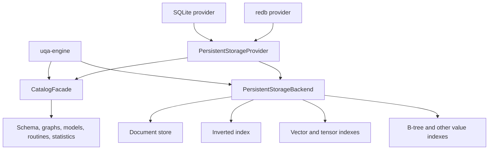
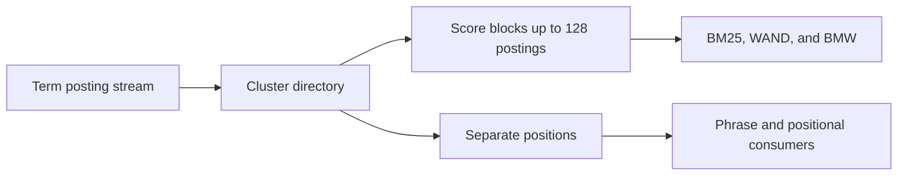
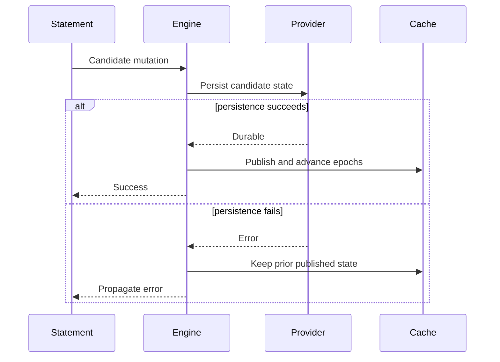

# Storage Internals

The engine separates logical table and index behavior from provider mechanics. Persistent providers bind catalog and data handles to one session transaction context, while in-memory implementations satisfy the same high-level contracts without file durability.

Memory document stores and inverted indexes share immutable corpus state when creating read or writable snapshots. Their owning storage implementations copy shared state only when it is mutated; clearing or rebuilding a snapshot replaces the state without copying discarded data. Documents retain their layout IDs and tuple metadata, while inverted indexes retain postings, occurrences, field metadata, and corpus counters together. Analyzer bindings remain independent across snapshots. The concrete stores' `Clone` implementations retain their independently owned maps, so preparing a cloned index does not defer that preparation cost into its first mutation. This keeps read snapshots independent of corpus size and preserves writable rollback snapshots without placing snapshot algorithms in Engine.

Current-source memory text captures use `InvertedIndex::snapshot_with_control`. Storage maintains the live payload size as postings, reverse terms, field metadata and counters change; independent copies recalculate their actual buffer capacities during the existing copy boundary. Shared capture reads that size without scanning or reanalyzing the corpus. It reserves the immutable generation before publishing a reader and reuses its cached reservation only for a matching allowance. Each reader retains its own cancellation signal and wrapper reservation; nested snapshots keep the original ownership through later source mutation and closure. Budgeted memory cursors and occurrence reads preserve the explicit caller's workspace allowance while also checking the captured cancellation signal. Reconstructed text captures keep their existing payload reservation through the same read-only adapter, and serializable wrappers retain the original participant when forwarding controlled capture. Engine supplies its existing session retention control at table and operator-context capture. Memory text generations use Core-owned ordered nodes whose exact layouts are included in the incrementally maintained size; capture still performs no corpus traversal or copy. Analyzer resources, allocator/reference-count bookkeeping and ordinary caller-owned mutable output retain their separate accounting boundaries.

Current statement, cursor and fixed-transaction table capture retains the selected storage handles when one table state supplies both data and metadata. `ReadOnlySnapshot` in `uqa-storage` adapts those handles to owned read-only stores without enumerating rows or rebuilding text/vector indexes; it forwards projected and borrowed reads, immutable analyzer revisions, cancellation and read-budget controls. Engine retains table/catalog state, while the storage owner retains the underlying visibility lease and physical index kind. A live source already contains its private writes, so capture does not read and clone those rows again.

For built-in versioned and memory providers, fixed-data views with additional private rows or changed schema metadata retain their immutable document source through Execution's `query/table_snapshot.rs`. Separately captured private overlays retain an immutable source and selected replacement/tombstone identities instead of decoding every private row again. Command overlays share their already evaluated field maps. Nested snapshots share those sources, selections and column definitions; extending a selection copies only changed-view metadata and retains payload references. Base rows map immutable column identities when read; private rows keep their selected names. Unindexed tables require no corpus scan at capture. Ordered ID pages merge the selected base and private rows, while projected reads preserve requested order, early termination, tuple metadata and the source's borrowed/shared capabilities where applicable. Default-field reads distinguish absent fields from explicit NULL without fetching unrelated fields. Ordinary projections, exact keys and tuple metadata read only their requested fields or metadata, including private command rows. Stored generated fields remain projected reads; absent generated values reuse Execution's existing row conversion. Serialized custom providers copy selected private rows under their guarded live handle to establish the same fixed visibility. Capture failures preserve cancellation, memory-limit and serialization diagnostics through the query-table adapter, without publishing a partial view.

Private row selection buffers, their candidate identities and replacement capacity use the original session retention allowance. Clones and nested snapshots retain one charge until the last owner or consuming iterator drops; copying a selection charges both live buffers before publication. Versioned backend and Key/Value wrappers forward `retention_control`, and retained read sessions share its memory allowance while retaining independent read cancellation. Memory and serialized Engine sessions use one shared query-retention allowance with the default versioned-session limit. Exhaustion preserves the original view and reports `53200`.

Decoded command fields and selected private-row copies retain a shared storage-owned payload reservation before entering an overlay or immutable selection. Core accounts for string and vector capacities, nested value buffers, array headers/dimensions, the decimal representation's existing charge and live map entries. Its traversal stack uses the same allowance and checks cancellation without recursive calls. Command captures share the fields and their reservation, so separate snapshots neither copy nor charge the same command payload again. Replacement failure preserves the old row and cached exact keys. Unique consuming reads move fields to the caller; shared readers keep the original payload charged until their final owner drops. These are decoded-payload bounds: opaque B-tree node slack and allocator/reference-count bookkeeping are excluded, and serialized providers still own the allocation of each returned read page before adoption. Complete bounds for provider decoding, other retained index state and all table/catalog metadata remain required; command exact-key accounting is described below.

Controlled whole-row capture uses `DocumentStore::get_stored_many_controlled` and the common `read_stored_documents` boundary. A charged positional page preserves requested order, duplicates, missing rows and tuple metadata on one selected view; both the page and each present payload must retain the invoking allowance. Unsupported defaults reject the capability without calling legacy owned materializers. Memory and retained corpus stores use Core’s cancellable, iterative value copier, which reserves destination buffers before production and preserves the original value variants, record order, decimal scale and SQL array bounds. Key/Value reads retain their compound view and reserve key/input/decode buffers under the invoking control; the first decode failure survives a provider that suppresses callback errors. Native SQLite forwards the invoking control through owner addressing, row decoding and BLOB hydration while preserving captured cancellation. Legacy SQLite holds one physical snapshot across the requested body and BLOB reads. Execution’s serialized private-row capture transfers those immutable field leases directly into its selection, retaining provider page capacity through selection construction. Copied table reconstruction consumes the same controlled pages and transfers their payload leases into its immutable corpus. Row-layout/default/generated-value construction during owned reads, opaque B-tree node slack and allocator bookkeeping retain their separate requirements.

`RetainedDocumentFields::into_budgeted` and `RetainedStoredDocument::into_budgeted` keep the original allowance when transferring an immutable row to an owned producer. Unique maps retain their value addresses and buffer capacities; shared maps copy under the same allowance while the original reader remains charged. Foreign allowances reject before copying. `RetainedDocumentStoreBuilder::add_budgeted_document` validates the incoming allowance and complete payload reservation, and `add_retained_document` combines controlled ownership transfer with that adoption. Corpus entry capacity is reserved while the input payload is still charged. These interfaces preserve tuple metadata and nested-reader lifetimes without a payload release/re-reservation gap. Caller-owned legacy inputs and outputs retain their existing APIs; Execution row adaptation and generated-value production during reads still require their own controlled producers.

Command-overlay exact caches belong to Execution's `mutation/overlay`. Table/field names, canonical key buffers and update preparation retain the original session allowance; foreign allowances are rejected. Core's `BudgetedMap` reserves the complete ordered-container node layout, including links and alignment, before allocation. Execution uses these maps for tables, staged rows, exact-key indexes and candidate identities. Prepared nodes allow every fallible row adoption, key construction and reservation to finish before publishing any row or cached key; a late quota or cancellation failure preserves every old index and tuple metadata. Balanced lookup and mutation move nodes without cloning keys or values, and removal frees a node before returning its allowance. Lookup normalizes borrowed columns, preserves the existing canonical equality format and selects the smallest unmasked identity without collecting a candidate set. Explicit-field probes reject absent fields, while conflict probes treat them as NULL. Cache leases end with their command; captured immutable fields retain their independent payload lease. General allocator/reference-count bookkeeping, decoded field-map node slack and other retained containers keep their separate accounting boundaries.

Canonical equality construction reserves its output and iterative traversal stack under the same allowance. Core owns controlled Decimal radix formatting and JSONB parsing/equality bytes; Execution owns SQL row/field encoding and scalar numeric normalization. Integer formatting uses stack storage, structured values are borrowed, and the established canonical bytes remain unchanged. Temporary normalization buffers release after construction, while cached bytes keep their reservation. Decimal conversion reserves an envelope audited against the locked num-bigint implementation before requesting its scratch allocations. These are functional resource bounds, independent of throughput or allocation-measurement acceptance.

Common Key/Value point and full-document reads decode their borrowed record bytes under the selected read control. The V2 envelope and earlier V1/legacy formats share Core's controlled JSON value construction while preserving their different array, numeric, duplicate-field and tuple-metadata rules. Parser descriptors, decoded keys, value buffers and conversion scratch reserve before allocation; removed migration fields release their payload charge. `RetainedStoredDocument` transfers the completed reservation into immutable shared fields without a second payload reservation, rejects foreign or incomplete leases, and preserves that charge through the last shared reader. Ordinary owned document APIs explicitly transfer mutable results to their callers. Borrowed projection reservation propagation is described below; owned mutable outputs and other retained consumers retain their separate accounting boundaries.

Historical JSON document decoding belongs to common Storage's `document_store::decoding`. Its controlled field-map and single-value APIs preserve the same legacy normalization, byte-array preference and tagged values for native and Key/Value callers. Field-map roots preserve all user names; tuple-metadata migration stays in the physical format owner.

Key/Value borrowed projection callbacks keep the decoder reservation through callback completion. A fixed read captures each distinct requested identity once, reserves its row descriptors and releases persistence locks before user callbacks run. Requested order, duplicate identities and fields, missing-row presence, empty projections and early stop retain their existing behavior. Callback scratch references use the same allowance; callbacks can reenter the store without changing the captured rows. Read-only snapshots forward this path. Ordinary owned projections still create caller-owned mutable outputs.

Versioned native SQLite reads decode historical document bodies through common Storage and decode selected BLOB bytes inside the native record visitor. SQLite owns the stored `kind`/`value` envelope, raw bytes, float-bit lists/tensors, marker validation and corruption diagnostics. Typed values preserve the existing serde field order, integer-width and nesting rules, including the direct versus buffered negative-zero distinction; nested decimals retain their serialized decimal envelope. Decoder frames, string/container buffers, decimal expansion, array bounds and BLOB outputs reserve under the native snapshot's allowance before construction. Hydration replaces markers without cloning ordinary body fields and transfers each replacement lease into immutable stored fields. Borrowed projections retain the snapshot and each decoded row through callback completion, release physical row access before callback reentry and hydrate only requested BLOBs. Missing rows, empty projections, tuple metadata and caller-owned mutable output remain explicit boundaries. Unbound legacy SQLite reads and serialized custom-provider fallbacks retain their separate accounting requirements.

Point and composite field lookups in retained document views traverse bounded ID pages and stop at the first matching row; maximum-ID reads retain only the current page. Missing fields and explicit NULL keep their existing distinct single-field semantics, while composite matching treats missing values as NULL. Nested views retain the capture cancellation token; cancellation stops base-page and private-tombstone traversal without returning a partial ID page. Owned row, field, metadata, presence and shared-result reads also check that token after a provider returns, including missing rows and shared-projection fallback. Cancellation stops further source reads and default production, discards partial output and preserves the selected view. An earlier typed provider failure keeps its original diagnostic when cancellation is also signalled.

Reconstructed vector indexes use common Storage's immutable `RetainedVectorIndex`. SQL's budgeted vector/tensor conversion preserves assignment rules while reserving tensor headers and float buffers before allocation. Execution transfers those buffers and reservations to the index builder under the original session allowance; a foreign or incomplete reservation is rejected. The builder charges entry capacity, preserves tensor ordinals and moves vector buffers without copying or charging their payload twice. Nested read snapshots share the same corpus reservation through the last reader, and scoring workspace uses the same allowance. Quota rejection reports `53200`, cancellation reports `57014`, and failed reconstruction publishes no partial view. Common Key/Value exact snapshots reuse this implementation while preserving their index kind. These bounds cover reconstructed exact vector buffers and their search workspace; source-provider read pages and IVF/HNSW cache state require their own accounting.

Current-source memory brute-force vector captures use `VectorIndex::snapshot_with_control` with the original query-retention allowance. Storage reserves copied float buffers, tensor headers and immutable entry capacity before publication and reuses its retained exact-vector reader. Nested snapshots retain one lease and use the same allowance for search workspace; later source mutation, source closure and quota rejection preserve earlier readers. Tensor maxima retain the ordinary memory index’s total floating-point order, including overflow from finite input values. Read-only wrappers forward capture control, while Engine supplies the allowance through table-capture and operator-context adapters. Existing provider snapshot controls and physical IVF/HNSW search behavior retain their own ownership.

Current-source memory HNSW and IVF captures also implement `VectorIndex::snapshot_with_control`. Storage reserves the existing physical-index construction allowance before cloning and retains it with the immutable captured generation through nested readers. HNSW preserves graph topology, tombstones and pending persistence state; IVF preserves centroids, assignments, probe count and training counters, including deferred retraining of a stale capture. Ordinary and controlled IVF copies use the same vectors-first lock boundary as training publication, so a capture cannot combine assignments and metadata from different training generations. Capture quota/cancellation failures leave the source and prior readers intact. The controlled search workspace is described below; opaque tree-node slack and allocator/reference-count bookkeeping require separate accounting.

Native SQLite HNSW caches and common Key/Value HNSW/IVF caches retain common Storage's controlled reconstruction allowance with each immutable generation. The read-only adapter keeps the value and its original reservation together through cache replacement, nested snapshots and source closure. HNSW reconstruction charges transferred raw-vector, adjacency-header and neighbor-buffer capacities; Key/Value graph loading reuses the existing controlled record decoder. Canonical construction and detached IVF retraining reuse their owning algorithms with the selected read control, preserving graph topology, tensor ordinals, centroids and training counters. Failed preparation leaves prior readers and stored records intact. These reservations cover the existing reconstruction/construction envelopes; opaque tree-node slack and provider read-page allocations retain separate accounting requirements.

Physical HNSW/IVF readers keep the first selected query allowance and cancellation signal through nested snapshots. Cache reuse preserves the same reader only when both identities match; independent readers share the physical generation without inheriting an earlier reader’s cancellation. Common Storage controls normalized query vectors, candidate scores, centroid/probe buffers and posting construction. HNSW uses Core’s complete-buffer priority queues and insert-only membership sets; IVF’s per-query stale-training workspace is reserved separately from the captured generation, and assignment/metadata publication follows successful preparation and cancellation checks. Native SQLite IVF delegates centroid ranking and tensor-score reduction to the same Storage helpers while retaining its selected-candidate reads and existing untrained fallback. Quota/cancellation failures release temporary buffers and preserve retained readers. Posting lists keep their existing caller-owned output boundary after construction. These bounds do not include opaque source-tree nodes, provider read pages or allocator/reference-count bookkeeping.

Reconstructed text indexes use Storage's `RetainedInvertedIndexBuilder` with the selected immutable analyzer bindings and original session allowance. Execution borrows the selected source text rather than copying it again. Analysis scratch, encoded term keys, occurrence capacities, per-document field metadata, reverse-term vector capacities, corpus counters and complete ordered-map nodes reserve before allocation. Field metadata and ordered unique reverse terms share one document node; total length and document count share one field node. Occurrences are authoritative, and legacy unique-position projections are created only when requested. The builder reuses ordinary token projection and counter validation; failed analysis, cancellation or quota reservation leaves previously appended documents unchanged. Publication moves prepared field nodes and term buffers, releases temporary term projections and discarded duplicate keys, and retains one immutable corpus reservation through the last nested read-only snapshot. Borrowed field input uses a budgeted ordered map; replacement planning merges ordered field views without a temporary set. Ordinary batches transfer existing posting nodes through Core's `OwnedMap::append` without allocating replacement nodes. `analyze_index_field_budgeted` returns `Budgeted<RetainedAnalyzedField>` with exact Core-owned term nodes, while ordinary `AnalyzedField` keeps its default B-tree carrier. Analyzer resources/binding metadata and allocator/reference-count bookkeeping retain their separate ownership boundaries. Caller-owned read output and provider read-page decoding retain their separate accounting boundaries.

When rebuilding text/vector indexes from retained query documents, Execution consumes the existing borrowed projection inside its callback. The provider keeps decoded fields and their reservation alive while controlled index builders allocate their output, so both consumers share the original live allowance. A rejected index row stops the projection immediately and keeps its first typed error even if the provider detects a later cancellation while returning. Failed reconstruction releases temporary indexes and leaves previously captured views intact. Copied custom-provider whole-row inputs use the controlled capture boundary above; generated/default read production retains its separate requirements. Controlled identity production is described below.

Retained analyzer bindings borrow diagnostic configurations directly from their compiled revisions, including after source reassignment or cache eviction. Each compiled owner retains one resolved configuration; attaching that revision to another field does not decode its descriptor again. Reconstruction also reserves its deduplicated ordered field-selection nodes and projection buffer before allocation, borrows the selected catalog names, and retains that buffer through every document/index callback. Quota failure and cancellation drop only the new workspace. Binding-map names, default-configuration capture and the remaining catalog/container payloads retain their separate allocation owners.

Execution's retained document views keep the original `StorageReadControl` through nested snapshots. Column-incarnation lookup maps, copied layout names, the shared document-view state, ID merge and selection pages, row-remapping slots and projection descriptors/reference buffers reserve through Core's existing budgeted containers. Internal ID and projection buffers remain charged through their consumer callbacks; failed admission releases temporary allocations and preserves previous views. Point, metadata, existence, count, empty-request and snapshot reads honor the captured cancellation signal. Owned result APIs transfer their output at the caller boundary. Owned field/default/generated payload construction and shared catalog definition payloads still have separate allocation owners. Controlled identity producers retain their reservation through merging and selection as described below.

Common Key/Value and bound native SQLite document ID collectors reserve their result-vector capacity under the fixed reader's original allowance before allocation. Failed collection releases temporary buffers, preserves retained row membership and reports the existing typed memory error. Native ID collection checks cancellation even for an empty request. ID-only borrowed cursors keep the page reservation through their callbacks after releasing physical read locks; reentrant mutations cannot change the selected page membership. Memory ID-only cursors enumerate ordered keys without compiling field projections. Execution uses supported borrowed cursors during retained-view ID merging and validates their bounded, strictly increasing identities and callback counts, preserving the first consumer error through provider cleanup. Returned owned ID vectors retain the public caller-owned output boundary. Serialized-provider whole rows use the controlled page contract above.

`DocumentStore::next_doc_ids_controlled(after, limit, control)` retains a `BudgetedVec<DocId>` under the invoking allowance and reads identities without loading document payloads. Memory, retained/read-only documents, common Key/Value, native and legacy SQLite, and evaluated/retained Execution documents implement this capability. Native SQLite includes table-owner key addressing and decoding in the invoking allowance. Common Key/Value cursor keys and provider scan buffers use that same allowance; a failed or malformed key callback cannot publish a partial page. `document_store::read_document_ids` checks the returned allowance, requested count, strict ordering and cancellation without copying the result. Unsupported defaults reject before invoking legacy owned materializers, while a zero-limit request still checks cancellation and needs no provider call. Both copied snapshot reconstruction and the retained-view fallback use this boundary; page reservations coexist with their selection/merge buffers. Existing borrowed cursors retain their original provider reservations. Explicit controlled calls through retained Execution views forward the invoking allowance to the provider instead of selecting a borrowed cursor that cannot accept that control. They check captured cancellation before selection and merging even when the caller supplies a different control. Custom providers that participate in controlled capture must supply a bounded identity capability, and must preserve their selected view rather than recapturing current rows.

`DocumentStore::field_presence_controlled(ids, fields, control)` returns caller-budgeted boolean metadata in document-major and then requested-field order, preserving duplicate requests. A stored NULL is present; an absent field or row is not. `document_store::read_field_presence` validates the returned allowance, count and cancellation. The default derives metadata from controlled whole-row pages and keeps their reservations until the result buffer is admitted; it never invokes legacy owned materializers. Memory and retained stores inspect existing fields without copying payloads, while SQLite metadata reads skip value BLOB hydration. Execution obtains this metadata before entering the selected immutable source's borrowed projection guard. Ordinary missing defaults and renamed fields therefore borrow original values or selected definition constants, preserving explicit NULL, undeclared target fallback and column incarnation rules. Nested logical metadata observes private replacements and tombstones and identifies declared generated fields without evaluating their expressions. Generated-value production and public caller-owned outputs retain their separate boundaries.

Custom serialized providers copy selected raw base documents through controlled whole-row pages because their handles do not promise an immutable MVCC view. Execution excludes privately replaced/deleted identities before reading bodies, and Storage adopts the remaining field maps and their original reservations without recopying uniquely owned payloads. Provider page capacity remains charged through corpus adoption. The existing retained read adapter then combines that immutable base with the original private selection and selected column definitions, preserving their allocation owners. Column-incarnation mapping, missing defaults and generated values are applied when requested; capture does not produce another default or generated value for every row. Point and projected reads evaluate only a requested missing generated column, preserving stored generated fields and PostgreSQL errors for requested failing expressions; full owned-row reads still complete the whole row. Missing generated fields borrow only the expression’s referenced stored inputs and selected missing defaults, using SQL’s fallible column-reference traversal and Execution’s existing scalar evaluator. Input names, lookup slots, presence metadata and projection references reserve under the captured allowance before allocation; neither an owned whole-row read nor unrelated default cloning is needed. This input projection also serves retained text/vector reconstruction. Expression preparation and generated result payload production retain their separate allocation requirements. Text/vector reconstruction reads only its selected index fields. `DocumentStore::retained_snapshot` explicitly shares an already immutable retained view with its original ownership and cancellation boundaries. Its default returns no capability and never invokes the legacy connection-sharing snapshot method. Owned Storage corpora, Execution retained views and their read-only wrappers support this handoff, allowing nested captures to reuse the selected source without eager row evaluation. Quota and cancellation failures publish no partial view and preserve earlier captures. Owned row/default/generated output, catalog-definition payloads, opaque map-node slack and allocator/reference-count bookkeeping retain their separate accounting requirements; complete retained-state acceptance remains open.

Owned retained-view row adaptation admits copied column names and missing-default payloads under the captured allowance before copying. Defaults use Core’s existing cancellable value copier. One reservation remains live across all defaults in a row, across completed rows in a bulk read, and through a generated-field projection callback; an earlier copy cannot release its charge while a later copy is being produced. Unchanged column names move no data. Quota failure or cancellation discards partial results without altering the selected base/private rows, and legacy owned outputs transfer responsibility at the caller boundary. This covers newly produced names, live map entries and default payloads; whole-row output, generated-expression preparation/results and opaque container slack retain their separate ownership requirements.

Storage's `read_selected_field` copies only a requested field from an already selected immutable view. The owning controlled scalar borrow distinguishes absence from stored NULL, and Core admits the owned copy before production. Memory/private/retained readers borrow an existing scalar without allocating a presence or projection page, so NULL and absent values still work when the remaining output allowance is zero. Providers using the generic adapter retain controlled presence metadata while validating the borrowed row. Execution keeps the returned reservation through individual generated-projection inputs, complete owned field batches and each consuming callback; completed rows remain charged while later rows are produced. Duplicate IDs in an owned result map reuse their first fixed-view copy. Failed copies take precedence over later provider-return cancellation and release partial outputs. `DocumentChanges::get_stored_many_controlled` preserves requested order, duplicates, missing rows and tuple metadata while forwarding controlled provider reads or sharing already retained immutable fields. Readers under the same allowance reuse the original lease; readers under another allowance admit the existing fields before creating their own wrapper. Whole-row adaptation and generated-expression preparation/results retain their separate production requirements.

SQL's `ExpressionPlan::lower_column_budgeted` lowers a borrowed validated column expression directly into admitted scalar IR through the same lowering algorithm used for ordinary owned ASTs. Strings, literal values, bindings, vector capacities and boxes acquire the selected allowance before construction; the resulting owner remains with Execution's generated expression. Original and invoking cancellation signals remain active. `ColumnTypeSchema` borrows column names and declared types instead of allocating a physical `RowSchema` for each generated read; physical schemas retain their existing alias, ambiguity and custom resolver behavior. This controls lowering and removes the temporary schema copy. Type-binding scratch, evaluated generated values and complete controlled row-page adoption remain separate production requirements.

## Storage boundary

`PersistentStorageProvider` creates catalog and backend handles together for a new session. `Engine::from_persistent_provider` retains that factory and can create sibling sessions. `Engine::from_persistent_backends` accepts already-bound handles and retains the backend's session factory; independent sessions require that backend to implement `open_session`. SQLite memory connections expose a pool-owned opaque identity through native and Key/Value providers, backend factories and retained sessions. Independently constructed Engines over the same pool therefore share relation locks and other database-level coordinators, while different memory databases remain distinct. File-backed SQLite continues to use its canonical path identity.

Public sibling sessions acquire the source statement gate before sharing committed catalog allocations and register as automatic-statistics clients. Internal fixed snapshots, current-catalog readers and committed retrieval rechecks restore their own durable or retained storage view without borrowing the source transaction state or acquiring a maintenance client lease. They can be opened by a worker while its parent statement owns the source gate and waits for parallel execution. Opening or querying one of these internal readers cannot restart the background worker after the application clients release it. Engine owns this session and retained-resource lifecycle; statistics collection and storage publication keep their existing owners.

`PersistentStorageSession::validate_transaction_affinity` checks both the transaction model and `StorageSessionAffinity` before Engine restoration or sibling attachment. `StorageTransactionModel::VersionedConcurrent { database }` requires matching database incarnations and a matching reported session affinity; equal file paths alone do not establish atomicity. Connection/store clones share affinity, while independent sessions receive different identities. Custom providers default to `ProviderSerialized`, preserving Engine writer admission; serialized pairs may both omit affinity. Wrappers must forward both contracts from their underlying session.

Versioned backends additionally expose their session's `write_cancellation` token. Engine retains that token for query execution; autonomous sequence mutation opens a separate session through `open_session_with_cancellation`, while ordinary SQL siblings receive independent tokens. Common storage supplies the same retention budget with that token only to identifier reservations and publication, including identifiers observed by an evaluated batch. Its retained reads and rollback cleanup keep their internal control. SQLite owns typed BUSY waits at connection checkout, permit preparation and BEGIN IMMEDIATE, and retries a busy COMMIT on the retained physical transaction without rematerializing its records. Other publication failures preserve uncertain receipts. Cancellation never converts a successful commit into a rejection. See the [Rust migration contract](../reference/10-upgrading.md#040-storage-write-cancellation).

## Logical storage contracts

Statistics-maintenance state and its evaluated counter merge belong to `uqa-storage::statistics_maintenance`. `CatalogFacade::save_statistics_maintenance` retains typed changes in versioned sessions; command refresh and publication preserve concurrent row-change increments when an analysis clears its observed baseline. Ordinary metadata replacements and explicit revision requirements remain conditional, and an older transaction cannot recreate maintenance state deleted or replaced by another object. Native SQLite supplies its metadata-row codec; Key/Value providers share the common codec. Engine supplies relation identity, collected row count, time and pending transaction-frame state. The persisted maintenance JSON fields and key remain unchanged.

`uqa-storage` defines backend-neutral traits for document rows, inverted postings, vector and tensor values, B-tree values, block-max metadata, spatial data, catalog records, and ordered Key/Value operations.

`uqa-storage-sqlite` implements those contracts and the graph persistence contract from `uqa-graph`. It owns managed connections, catalog migrations, physical indexes, transactions, SQLCipher integration, and the compressed VFS. Neither common storage nor graph algorithms depend on the SQLite provider or driver, including their tests and benchmarks. Cross-provider graph conformance tests and SQLite persistence benchmarks live in `uqa-storage-sqlite`. Concrete Rust imports and provider error handling are described in the [Rust migration notes](../reference/10-upgrading.md#sqlite-provider-ownership).

Common Key/Value vector consumers use `KeyValueStore::with_read_view` to select one fixed committed/private boundary. IVF reads centroids, assignments and canonical tensors together; HNSW reads its header, graph nodes and canonical tensors together. `with_mutation` evaluates once against the boundary supplying original write preconditions, then applies staged canonical values and the IVF metadata/assignment changes or HNSW graph delta atomically. Errors, cancellation and unwinds discard that operation while preserving earlier private writes; publication failures retain the evaluated attempt for resolution. Neither callback may reenter its own store session or perform transaction control. Common logical sessions own this behavior; SQLite forwards the calls and redb uses the common implementation.

IVF and HNSW share the same immutable cache and exactly-once evaluation adapter. Cache identities include the database, committed sequence and relevant non-reused private record identities; the memory reference store rotates retained identity tokens on writes and undo. Live handles refresh after rollback, savepoint branching, definition recreation and independent commits. Creation retains its requested parameters across unrelated writes. HNSW restoration validates graph/canonical agreement; IVF restoration validates vector counts, ordinals and assignment references while retaining the stored centroids and assignments. Common Key/Value mutations and native SQLite mutations use the common `IVFIndex::prepare_metadata` owner to produce immutable IVF candidates from evaluated replacement/delete/reset/training inputs. Preparation reserves a conservative bound for candidate state and numerical scratch before cloning, polls cancellation, and retains the resulting metadata allowance; reset discards the generation without cloning its corpus. Empty vector replacement and document deletion preserve their distinct deletion-counter behavior. Native SQLite and common Key/Value IVF/HNSW now merge independent document mutations through the shared vector input journal and resolver described below; general definition fencing remains required. Full IVF/HNSW cache and search workspace accounting remains required.

Common `HNSWIndex::prepare_delta` and `prepare_canonical` now own evaluated graph mutation and explicit reconstruction for native SQLite and Key/Value callers. They reserve candidate state, graph layers, construction/search/pruning scratch and compaction copies before cloning or inserting vectors; immutable output deltas retain their separate allowance through staging. The layer bound follows existing graph levels and deterministic allocation before/after compaction. Replacement/deletion order, dirty-node deltas, node allocation and threshold-triggered compaction match serial HNSW mutation. Preparation checks cancellation during hierarchy traversal, neighbor selection/pruning, replacement and compaction. Failure preserves the source graph and dirty state; clear returns an empty full rewrite without cloning the old corpus. Explicit reconstruction rejects incomplete or unordered canonical tensor ordinals. HNSW input journaling and conflict-aware generation merging now share the common resolver for native SQLite and Key/Value callers; full retained-cache/restoration/query workspace accounting remains required.

Exact vector snapshots own the canonical tensors selected by one read view instead of retaining a live store handle. Their payloads share the session read allowance across nested snapshots; loading failures return their reservations, and scoring checks cancellation and charges temporary score/posting buffers. Exact, IVF and HNSW snapshots retain their original data after subsequent writes, rollback and closing the live handle, and reject mutation even when the caller holds the only reference. Third-party stores must implement compound reads for vector consumers and evaluated mutations for IVF/HNSW; unsupported capabilities return explicit errors.

B-tree backend methods use `ValueIndexKey::Column` for ordinary field indexes and `ValueIndexKey::Index` for a named catalog index. These are separate physical namespaces even when their strings are identical: the SQLite provider encodes them as TEXT and BLOB keys, and key-value providers use distinct binary tags. Expression indexes store a composite `Value::Row` key under the named index identity. SQL binding and execution layers own expression binding, dependency traversal, and key evaluation; storage providers preserve expression catalog payloads without depending on SQL AST types.

`PersistentStorageBackend::read_btree_index_entry` reads one previously evaluated key on the caller's transaction boundary. `ValueIndexEntry` distinguishes an unbuilt index, an absent row and a present value, including SQL NULL. Native SQLite and Key/Value backends use the existing per-document record address; the legacy SQLite path selects definition and entry in one SQL statement. The read neither loads the complete posting collection nor evaluates an index expression, allowing mutation tracking to retain the actual old key even when the index cache is cold.

Expression key preparation finishes before the document-store write lock is acquired. Execution's [`ColumnValueIndex`](../../../crates/uqa-execution/src/catalog/index/value.rs) owns predicate eligibility, NULL posting selection, cardinality and evaluated-key maintenance over storage's B-tree. Engine retains cache generations and provider handles. The index retains each document's stored key so updates and deletes remove the original posting even after an immutable routine is replaced. Rollback recovery hydrates caches directly from restored durable postings without invoking SQL callbacks or reentering the transaction coordinator; a missing durable index remains cold until ordinary statement execution can rebuild it. Named memory and temporary indexes retain evaluated keys in transaction snapshots and are preserved when column accelerators are invalidated. VACUUM FULL rebuilds the physical indexes after rewriting their table.

`KeyValueStore` supports point reads, ordered prefix scans, bounded key-only paging, atomic batches, and range deletion. Binary keys encode segments unambiguously and use big-endian numeric identities so lexical order preserves document order.

Development Key/Value graph catalogs record typed path-cache effects with their private source changes. Common storage resolves graph memberships and path ownership against a fresh committed view, so independent graph writers can both invalidate a shared cache and an older writer also invalidates indexes or memberships created after its snapshot. Private invalidation previews do not clear a cache subsequently reassigned to another graph. A completed path build validates the graph registration, label registry, membership/source revisions and index definition before publishing its validity marker; a build with stale inputs is not published as current. Savepoints restore both records and effect order. Canonical source records retain their original conflict checks.

The prepared fingerprint seals original records, cache-write kinds and ordered graph effects. SQLite Key/Value and redb check the durable receipt first, then validate the snapshot used to prepare derived effects under physical write admission. An intervening commit permits only those effects to be prepared again, with the same transaction identity and fingerprint; SQL, graph evaluation and callbacks are not repeated. A lost commit reply resolves through its receipt before applying any cache effect again. Typed cache state and dependency discovery remain bounded by the session allowance and cancellation. The bound native catalog uses the same resolver through native key/row codecs. Fair admission for repeated preparation remains pending.

Common Key/Value document mutations select their exact storage-name owner, tuple metadata and target row through one evaluated batch. The private `O` key family records nonzero object/generation bindings, reverse object claims and immutable data markers. Catalog registration, definition-only removal, full removal, purge and rename update these bindings with their table definitions and data; independent row writers merge marker touches, while an intervening structural change rejects the stale commit. Canonical catalog names and raw standalone names remain distinct. Ownership adoption inherits durable ID reservations, including IDs whose rows were deleted or rolled back. A new storage generation of the same object seeds its visible rows without inheriting retired reservations; Engine removes old rows before rotating the generation, then supplies the continued floor or the explicit restart floor. Legacy seeding walks document keys without loading document bodies and retires the old per-name floor atomically with the binding. Existing bindings must agree with their reverse claims and table definitions.

Document bulk reads, projections, selectors and cursors use a supplied fixed view. Snapshots retain their committed/private view and remain read-only after later writes, undo or closing the live handle. `KeyValueRead::visit_keys_after` pages live keys without loading values; bounded key pages are copied before code performs further reads through the same view, so borrowed provider visitors are never reentered. Table rename rejects collisions with existing destination data. Native SQLite owner transfers use the same queued identifier inheritance as Key/Value providers. The remaining compound consumers, definition/constraint coordination and complete SQL acceptance are tracked in the implementation plan.

Common Key/Value sequence creation, replacement, rename, removal, reservation and set-value operations now evaluate through one fixed catalog view and stage their changes atomically. Name claims and sequence values retain the original write preconditions, and creation/rename require the destination schema revision. The store's mutation boundary replaces the former catalog-local sequence mutex, so independently constructed catalogs cannot publish an allocation derived from an intervening writer's old position. Compound sequence reads use the same supplied-view contract. Conflicts and uncertain commits retain the original attempt for explicit completion or rollback; they do not replay value allocation. These APIs obey their selected session, including savepoints and transaction undo. Execution selects an autonomous session for committed SQL sequence values, including calls made while the caller retains unrelated private writes. `CatalogFacade::sequence_has_private_changes` identifies creation, rename and definition replacement in the caller's private view; those values remain in that transaction. Savepoint undo restores that provenance. Versioned catalog wrappers must forward this method. Complete sequence-definition coordination remains required.

Sequence value updates carry the expected allocation generation, as reservations already do. Both native SQLite paths and the common Key/Value consumer check it before changing the row and return a typed definition-change result. Execution resolves that result again before validating `setval` bounds, publishes session caches/history only after success, and uses cancellable retries only for a known rejected operation in an idle independent session. The retry owner validates catalog/backend affinity, rolls back that failed autonomous attempt and never replays a bound transaction, an uncertain commit or SQL expressions. Cancellation and memory exhaustion preserve their SQL error categories. This does not replace sequence-definition locking.

Sequence value execution selects current committed definitions and values while preserving transaction-private creation, rename, deletion and replacement. This refresh is independent of the ordinary row snapshot. A changed allocation generation forces value resolution and bounds validation against the refreshed definition; it cannot loop on an older transaction registry. Engine supplies catalog sessions and publishes the selected rows; execution owns selection and autonomous value mutation.

`refresh_transaction_snapshot` explicitly advances an active common session to a newly retained committed boundary. Before publication of the new private view, the existing storage resolvers merge evaluated occurrence, vector, graph and marker effects against that boundary, retaining their effect kinds for later commands and final commit. Canonical revisions and definition requirements still reject conflicting changes; no SQL expression, analyzer callback or external operation is reevaluated. Savepoints retain the matching committed base and private owner so rollback restores both without allocating replacement payloads. Earlier compound reads and cursors retain their original view. Errors preserve the prior active state, and sealed commits cannot advance. Native SQLite, SQLite Key/Value and redb forward this primitive through their paired backend. Engine refreshes the command catalog/write view while retaining a separate fixed data view for REPEATABLE READ and SERIALIZABLE. Target refresh after a logical lock wait preserves the command's original row-change baseline and retained source snapshots. Commit preparation refreshes derived maintenance state under the publication gate so independent writers do not overwrite shared counters. Full serializable-history acceptance remains open.

Common storage’s `SnapshotRegistry` admits sequence capture and lease registration under the same gate as history reclamation. A retained committed view keeps its lease through clones, command refresh, savepoint undo and closing the live store. Reclamation keeps each key’s newest revision at or before the oldest live sequence and every newer revision; with no live views, the current committed sequence is the horizon. Head tombstones, identifier watermarks and all pending, committed and aborted receipts remain intact, so collection cannot erase conflict evidence or replay a completed commit. Providers delete obsolete revisions atomically without changing visibility or transaction allocation, and `VersionedPersistence` wrappers must forward `reclaim_versions` with its resource and cancellation controls.

Native SQLite stores snapshot sequences and process-lived byte leases in a separate `.uqa-snapshots` coordination file. It contains no document bytes, keys or credentials. One shared process descriptor prevents closing an unrelated handle from releasing POSIX locks; lease release never waits for snapshot admission or a physical writer. Live processes never expire by elapsed time, and process death releases their locks. Compressed rollback-journal snapshots still release each physical read between operations. Browser file handles share one process registry, in-memory handles share their physical pool, and redb adapters share their exclusive database owner’s registry. SQLite record format 43 and redb record format 42 reject predecessors whose snapshots do not register leases before any historical read or write can proceed. Native mapping 9 retains the independent data namespace; the catalog remains at version 49.

SQLite main record format 43 and redb main record format 42 reject earlier development binaries that lack shared SSI admission and observations. The main format is checked inside physical reads, allocations, publication, receipt access, identifier operations and reclamation, including through retained handles. SQLite and redb migrate existing main metadata atomically without changing data histories, database identities, allocation watermarks, receipts or retained SSI checkpoint records. The auxiliary checkpoint format alone cannot fence incompatible data writers.

The development SSI transport is separate from snapshot leases. `VersionedPersistence::serializable_coordinator` exposes the common `SerializableCoordinator` boundary for SQLite and redb. Common storage owns the serializable graph, budgeted streaming checkpoint, exact-receipt reconciliation and abandoned-participant recovery. Providers invoke each admitted operation once, retain its graph changes even after an operation error, and close main physical transactions between calls. A persistence failure takes precedence and cannot establish that a main transaction aborted.

Before exposing a loaded SSI checkpoint, SQLite and redb validate every retained terminal publication against its authoritative main-database receipt. Missing receipts or differences in outcome, transaction identity, commit sequence or fingerprint reject admission before snapshot capture. Prepared publications retain their existing recovery path, and a live retained completion cannot be downgraded by a later unknown lookup. The common validator borrows checkpoint entries without copying them; providers perform one receipt lookup per retained terminal publication. This detects incompatible main/checkpoint histories while publication records remain retained. redb's explicit [backup restoration](../reference/04-storage-and-security.md#backups-and-copies) additionally rotates the database incarnation and retires old receipts and SSI state in one durable transaction under exclusive file ownership; completed request retries preserve subsequent work. SQLite's restored connection constructors use a durable pending target to bridge main and auxiliary commits, as described in the [backup contract](../reference/04-storage-and-security.md#backups-and-copies); the full backup/platform acceptance matrix remains required.

Common storage tracks checkpoint changes at the owning state transitions. After decoding and validating retained state under shared admission, duplicate predicates, status checks, safe-snapshot polling and recovery without changes do not write checkpoint records. New coordinators, observations, dependency decisions, savepoint write undo, receipt resolutions, lease retirement and history reclamation still require atomic persistence, including changes preceding an operation error or cancellation. Serialization alone never acknowledges durability. Each admission still decodes retained state against its caller's allowance.

`SerializableGraph::read_checkpoint_records` validates an ordered set of independently checksummed records bound to the database and coordinator. `write_checkpoint_changes` streams only added and removed keys plus the updated header; participant changes replace their content-addressed records, while immutable observations retain their keys. A new read observation publishes the header and its own record without copying earlier predicates; any resulting dependencies or participant changes produce their own deltas. The original key inventory, graph and predicate keys share the caller's allowance until the graph is dropped. A failed record permanently rejects that admission: the first decode diagnostic survives scanner retries, suppressed callback errors and later scanner failures, and no subsequent value is read. Cancellation is checked after the final reader call and scanner return. Additional future inventory storage is reserved before emitting changes so the published state remains reloadable under that allowance. The difference calculation allocates neither a deletion journal nor another encoded graph, including during savepoint undo, terminal completion and history reclamation.

`SQLiteRecordStore::serializable_admission` owns process-shared auxiliary writer admission and atomic checkpoint record publication. Its `.uqa-serializable` SQLite file contains logical predicate keys and therefore inherits the main database's encryption credential, including for compressed encrypted containers. It uses FULL synchronization and DELETE journaling; malformed retained schemas and checkpoints are rejected. In-memory sessions share a retained auxiliary pool.

`SerializableCoordinator::admit_serializable_snapshot` and the common `admit_serializable` capture helper reconcile physical receipts and abandoned participants before admitting the original participant and its fixed data view. SQLite's existing capture/recovery methods delegate to this common implementation. Its cloneable `SerializableParticipant` must remain retained by the original transaction and its nested/pinned views. Native SQLite file owners use `.uqa-serializable-leases`, containing only database/coordinator identities and participant allocation tags; snapshot and participant leases reuse the same byte-lock transport with distinct files and formats. Memory and browser owners use a shared local registry. SQLite participant lease release takes no admission or physical writer, and process death releases native leases. Recovery retires only lease-bound dead participants; an unknown prepared receipt blocks recovery, while confirmed committed data keeps its outcome. Earlier confirmed resolutions persist even if a later recovery step or snapshot capture fails. Checkpoint version 3 records lease binding and permits physical maintenance publication by logically read-only participants without logical write observations. It reads versions 1 and 2; version 1 actors remain manually owned, and earlier formats retain their prohibition on read-only physical publication.

Completed lease-bound participants retain their logical outcome until the original handle and every clone are released. `SerializableGraph::status` distinguishes active, prepared, committed, aborted and doomed participants without allocating a physical receipt for participants without physical changes. Reclamation separately removes obsolete predicates and edges, so an old retained completion cannot delay a new safe snapshot or create new dependencies. Recovery releases terminal retention only after authoritative lease loss and never repeats physical abort for an already confirmed outcome.

redb adapters over one exclusive database owner share common `LocalSerializableState` admission. Participant payloads retain both the original gate and the physical database, so closing every adapter cannot replace a live participant's registry. Each admission separately retains the database owner; redb's final native close, which may flush allocator metadata, therefore runs only after admission is released. The `uqa_mvcc_serializable_records` ordered record table and its versioned metadata marker publish atomically through short, immediate-durability redb transactions. Borrowed value reads avoid an encoded copy; writes charge redb's temporary reserved-value allocation for one changed record and stream into its mutable page. Unchanged admission acquires no main physical writer. Missing, malformed or mismatched retained state is rejected without recreation. Reopen retains coordinator/allocation identities and reconciles dead publishers through their exact physical receipts. The graph is decoded against each admitting caller's allowance rather than permanently binding it to the first caller's limit.

SQLite auxiliary format 2 stores coordinator identity in `_uqa_serializable_state` and keyed values in `_uqa_serializable_records`. redb marker `UQARED02` identifies the equivalent record table. Both use common record format `UQASREC1`. A valid previous singleton checkpoint is migrated with its original coordinator, allocation watermark, participants and observations in the same atomic transaction as record publication; cancellation or failure preserves the previous committed format. Malformed retained state is rejected before migration. The complete checkpoint reader remains compatible with versions 1, 2 and 3. Main MVCC record formats and physical receipt identities are unchanged.

Common sessions opt into the original SSI boundary through `VersionedKeyValueStore::establish_serializable_snapshot` before private writes. Its `SerializableReadContext` survives record-view clones, command refresh and savepoint undo; it registers logical reads and checks safe-snapshot eligibility without admitting another actor. Existing savepoints inherit the first fixed boundary. Successful mutations must register logical intent through `observe_serializable_write` within the same transaction/savepoint boundary before their owning operation completes; savepoint rollback removes later intents while keeping reads and selected victims. Internal byte-record reads and shared index records never manufacture logical predicates. Execution must supply immutable logical object/row/index observations.

`SerializableSession::establish_serializable_snapshot_with` accepts logical read-only and deferrable characteristics independently of physical session permissions. Common storage selects a read-only deferrable candidate, waits for its overlapping read/write participants, and replaces only a candidate proven unsafe, before exposing it to application execution. Writers admitted after that candidate do not extend its wait. The caller scopes each capture together with its publication baseline through `SerializableSnapshotCapture`, releasing its guards before the common wait. Cancellation, a failed capture or checkpoint failure leaves the session's previous record view intact and drops the candidate lease for ordinary participant recovery. Only the accepted candidate updates existing savepoints. A proven safe context validates retained-reader lifetime without registering data predicates; nondeferrable and read/write contexts retain ordinary observation behavior. An already admitted session keeps its original participant and does not invoke capture again. Native SQLite forwards this common operation, as do SQLite Key/Value and redb sessions.

Execution admits versioned SERIALIZABLE transactions before binding or executing their first snapshot-bearing SQL statement, including implicit statements and SQL cursors using session defaults. BEGIN, transaction settings and savepoints alone do not admit a participant. Engine supplies the active characteristics, a publication-scoped row-change baseline and retained data/graph resources. After common admission returns, it retains the selected data view before refreshing the current command/catalog view: a safe read-only candidate may predate a catalog commit completed during its wait. The original participant and row-change baseline survive later command refresh and savepoint undo. Direct mutation boundaries prepare the same snapshot before acquiring mutation locks or staging records. Admission errors follow ordinary statement rollback with their original SQLSTATE; callbacks and evaluated mutations are not replayed. Complete direct-read API coverage and the full concurrent-isolation matrix remain required.

`KeyValueStore::serializable_session` and `PersistentStorageBackend::serializable_session` expose the common `SerializableSession` capability. Native SQLite and SQLite Key/Value forward through their bound logical connection, while redb uses the common session directly. Reading the capability neither admits a participant nor captures a new snapshot. An attached reader exposes its original context even after its own local completion; it cannot admit or write as that participant. `SerializableReadContext::read_control` shares the original session allowance while accepting the invoking reader's cancellation, so nested observations do not acquire fresh budgets. Capability presence alone does not enable SQL SSI.

`VersionedKeyValueStore::new_retained_read_session` attaches the exact committed/private record view to a separate read-only session. Its private replacements and tombstones remain private records, and source refresh, rollback, commit or closure cannot advance the attached view. It retains the original SSI read context without taking ownership of that participant's completion. `KeyValueStore::open_retained_read_session` and `PersistentStorageBackend::open_retained_read_session` forward this boundary through native SQLite, SQLite Key/Value and redb; catalog and data restoration consume the attached view from the start. Engine fixed data snapshots and pinned graph cursor reads use that capability. Independently current reads for referential rechecks keep their separate snapshot factory. Retained readers reject record mutations, identifier reservations and new participant admission; their local begin, savepoint, refresh and completion operations cannot publish data or complete the source transaction.

The session seals one evaluated record batch, persists its SSI publication binding in a separate admission, then acquires shared SSI admission for each physical attempt and exact outcome resolution. Derived effects use the same existing resolver outside that gate and may retry only after authoritative snapshot rejection. Sessions without physical changes finish through the graph without physical allocation. Logically read-only sessions may publish maintenance records such as ANALYZE statistics through the same durable receipt lifecycle; logical user-data writes remain forbidden. `TransactionCompletionError` retains logical completion and any stronger physical receipt evidence through later checkpoint failure. Engine keeps only session/transaction adapters: unresolved logical completion blocks ordinary work, callback and batch cleanup retain the original frame, and rollback cannot undo a confirmed commit.

Execution's `serializable` module supplies logical relation and row observations from the original participant. Demand-driven local and scored sequential sources, including shared projections and borrowed aggregates, observe their immutable relation at the first actual read, including an empty result; unconsumed scans do not add that observation. Operator execution also observes actual relation enumeration after an index path declines the query. Selected tuple reads and pinned rechecks observe row identities before reading retained or stored values. Prepared INSERT, DELETE, rewrite, primary-key/partition movement and direct point UPDATE publication record row intent before private storage mutation, under the existing statement/savepoint boundary. Engine supplies only selected relation identities, storage participants and cancellation. Index predicates require their own precise logical keys and ranges; physical index hydration and planner estimates must not manufacture query observations.

Execution's [`column_index`](../../../crates/uqa-execution/src/serializable/column_index.rs) binds selected column predicates to immutable column identities and the original participant. Eligible scans record their ranges before returning cached, cold or empty postings. Unique-key point UPDATE records its selected equality before lookup, including an absent row. Mutations record original and replacement keys before private row/index publication, reusing evaluated values and per-document provider reads; missing column postings use the same stored-column projection as query repair. Savepoint undo removes later write intents through the existing common lifecycle. Complete logical access-path and direct API coverage remains required.

Temporal column keys reuse Core's `TemporalValue::write_comparison_key`, while hash/spill equality keys use its `write_equality_key`; both share the native comparator. TIME retains its day endpoint and TIMETZ compares unwrapped adjusted time followed by its original zone. Legacy day-wrapped keys are emitted only as conflict-reservation aliases, alongside both predecessor numeric encodings. SQLite main format 48 and redb main format 47 reject incompatible physical access; typed B-tree entries rebuild their ordering from the original values. Execution binds DATE, TIME, TIMETZ, TIMESTAMP, TIMESTAMPTZ and INTERVAL families, including precision declarations and domains. Text boundaries accepted by an empty temporal index use the declared family's existing parser, retaining future matches when later data requires evaluated filtering. Parsing workspace and encoded keys share the original reader's allowance and cancellation. NULL observations and unique-key point UPDATE use the same column identities and mutation lifecycle.

Core's `LegacyVectorValue` distinguishes catalog vectors from ordinary arrays and retains the different PostgreSQL `int2vector` and `oidvector` order rules. SQL constructs and normalizes those carriers; Execution's `catalog/value_restoration.rs` schedules initial typed row conversion, unique-key validation, affected index reconstruction and statistic invalidation. Engine supplies its initial transaction, retained table/index state and existing reconstruction adapter. Document conversion reads bounded ID pages using the original backend retention control; the existing physical index reconstruction interface retains its separate admission rules. The SQL carrier marker is published only after all conversions and index work succeed. Provider fences preserve raw histories and receipts while preventing incompatible old readers or writers from using the new current values.

JSONB column keys reuse Core's `write_jsonb_comparison_key`, retaining native numeric normalization, structural order, duplicate-field resolution and object-key order without using the existing equality/hash bytes as ordered keys. Core's single parser accepts an optional shared workspace; array/object buffers, decoded strings, number digits, ordering scratch and output all belong to the original reader's allowance. SQL NULL remains separate from JSON `null`. Execution binds the JSONB domain to the same empty/cached/index-only read and original/replacement write hooks. Invalid native representations fail explicitly; cancellation and resource errors preserve their SQLSTATEs. Numeric order places zero between negative and positive values, including fractions and exponent forms; the same rule applies inside arrays and objects. Ordered keys encode separate negative, zero and positive classes, while existing canonical equality/hash bytes remain unchanged. Relational join hashes also consume Core’s semantic equality key instead of JSONB source spelling. The main provider formats fence incompatible order-key readers and writers.

Typed SQL arrays retain row-major element order, NULL elements, dimension count, dimensions and lower bounds in their logical index keys. `INT2VECTOR` and `OIDVECTOR` keys follow both native Array and List representations retained by current assignment/domain-cast paths; general representation normalization is tracked separately in [issue #123](https://github.com/cognica-io/uqa-engine/issues/123). `VECTOR` and `TENSOR` retain nested list boundaries. Core supplies the same flattened traversal used by native array comparison, with a cursor charged to the original allowance and cancellation checked while traversing empty or nested arrays. Execution projects each predicate leaf into the stored comparison domain; the first leaf without an equal stored representation defines a cut for every suffix, preserving fractional numeric bounds without rounding them into stored values. Nested temporal/text values retain native container comparison rather than scalar predicate text parsing. These domains use the existing selected-read, absent unique-update and original/replacement write observation hooks.

Execution's [`serializable::vector`](../../../crates/uqa-execution/src/serializable/vector.rs) observes the canonical candidate field when KNN, calibrated-vector or threshold search actually executes, including an empty result. Exact search examines that field's candidates; approximate selection can also change when another canonical candidate changes. The logical vector space is separate from row and ordered-value keys, IVF lists and HNSW nodes. Declared fields use immutable column identities; registered dynamic fields use distinct length-delimited names within the immutable relation. Retained vector snapshots preserve the original participant through nested snapshots. Metadata inspection, unused contexts and zero-K reads do not manufacture observations. SQL retrieval sources share an execution-owned [deferred scan](../../../crates/uqa-execution/src/query/scored_input/deferred.rs), bind their row schema and retained handles before execution, then search on the first requested row; opening and closing an unused source, including `LIMIT 0`, does not read its candidate field. Tuple rechecks keep their independently current retrieval and pinned row images. Canonical vector replacement and deletion register document intent before vector publication; `VectorIndex::contains_document` checks the selected canonical boundary so deleting an absent candidate or inserting SQL NULL does not manufacture a vector write. Membership probes do not run a search or load the corpus. Savepoint undo uses the same common observation lifecycle as row and column-index writes. SQL admission uses the transaction boundary described above.

SQL admission and deferrable waiting use the common session boundary above. Public document, document-ID and indexed-count reads now share that boundary, including session-default implicit transactions, failed-frame recovery and the original fixed view. Execution retains their identity-checked AccessShare relation locks; internal workers keep unscoped query and current-row adapters. Remaining retrieval/graph/catalog API admission, complete logical observations, main-writer fencing and full provider histories are tracked in the [implementation plan](../../plans/0008-concurrent-storage-transactions.md#common-session-serializable-lifecycle). Both providers currently load and replace the graph per admission; these interfaces do not establish final concurrent-isolation or throughput acceptance.

SQLite also coalesces current records at or before the reclamation horizon into bounded `_uqa_mvcc_runs`. Each run preserves up to 128 exact keys sharing a prefix and consecutive eight-byte big-endian suffixes, their original revision, and either NULL, one constant value, or a small value template whose suffix is reversibly derived from the key. Keys exceed neither 1,024 bytes nor value templates 128 bytes; other records retain the ordinary representation. Point, metadata, prefix and key visitors merge runs with ordinary heads in byte order, including interleaved key lengths. Metadata probes do not load value templates. Replacing a run member restores its exact predecessor in history and splits the remaining range within the same physical transaction, preserving old snapshots, absent-key conflicts and receipt retries. Compaction changes representation without changing the count of obsolete revisions reclaimed; physical native projections, logical byte records and conflict evidence remain intact.

`KeyValueStore::vacuum` forwards version reclamation outside the invoking session’s transaction; versioned wrappers must forward maintenance rather than accept the serialized no-op default. Native SQLite and SQLite Key/Value reclaim obsolete logical versions before physical `VACUUM`. redb reclaims versions for reuse by its physical page allocator. Retained snapshots can delay reclamation; their visible values remain readable during and after collection.

Domain catalog format 3 uses independent `uqa.sql.domain.v1:` definition records and `uqa.sql.domain_oid.v1:` domain OID claims, with a separate durable incarnation and public constraint OID for each CHECK and NOT NULL declaration. Execution loads domain definitions before type binding, then validates and finalizes constraint addresses after ordinary/foreign relations, triggers and index-owned constraints are restored. Current records require complete valid identities; only initial legacy conversion may fill missing metadata. Publication deltas and private-domain overlays use existing atomic storage metadata operations. SQLite record format 43 and redb record format 42 fence writers that could omit these fields. A later catalog restoration failure rolls back domain record and marker conversion.

## Provider matrix

| Provider | Main implementation | Session transaction identity | Security notes |
| --- | --- | --- | --- |
| Memory | In-engine memory stores | Engine session state | No durability |
| SQLite | `uqa-storage-sqlite` | Managed connection bound to a common logical session in both layouts | Plain, SQLCipher, or compressed VFS open paths |
| redb | `uqa-storage-redb` | Common logical session over one shared database owner | No encryption at rest |

SQLite is the default persistent engine. redb uses the same SQL and logical storage surface through the provider contract.

`KeyValueStore::visit_value_bounded(key, max_bytes, control, visitor)` preserves the selected committed/private view while enforcing a separate encoded-value size cap before materialization. Common MVCC forwards the capability through retained snapshots and keeps private replacements and tombstones ahead of committed values. SQLite checks its stored length before loading either an ordinary value or a compacted-run template; redb and memory validate their borrowed value length. Provider bindings/workspace and reader copies still share the supplied memory allowance, so the value cap does not subtract unrelated binding bytes. Unsupported providers reject the capability without calling an unbounded materializer. Empty/missing/tombstone reads and cancellation keep the ordinary point-read contract.

The development redb provider uses common logical Key/Value sessions: private changes and savepoints retain no physical writer, reads pin a committed sequence, and short conditional commits publish versions and receipts atomically. Its catalog/backend pair shares that session. Default retention is 64 MiB per session and can be set through `RedbStorage::open_with_options`; it is separate from the query read allowance. See the [transaction and file-format contract](../../design/kv-storage-backends.md#redb-transaction-mapping) and [unreleased upgrade boundary](../reference/10-upgrading.md#040-redb-record-format).

Common storage preserves an indeterminate transaction identity across later commit/abort failures and validates the receipt's transaction identity and prepared fingerprint before accepting it. `StorageBackendError::commit_outcome` exposes typed committed, aborted or indeterminate evidence through provider error wrappers. Verified terminal outcomes remain in the session so completing or discarding that attempt requires no second persistence lookup. Providers emitting these typed outcomes must retain their sealed attempt and permit receipt resolution without reevaluating application operations. Engine adapts this evidence into retained completion state and preserves whether cleanup must finish a rollback. A failed statement does not restore caches or release logical locks until its storage rollback finishes; a retained rollback cannot become a commit through a later COMMIT request. Cleanup adapters preserve the typed uncertain result when adding callback, implicit-operation or precommit-validation context. A scope whose rollback becomes uncertain retains completion ownership for the session and does not retry from its destructor. SQL preparation runs once; successful resolution releases the retained frame and publishes its row changes, epochs and notifications through the ordinary completion path. Durable cross-process publication recovery remains part of the concurrent-storage implementation plan.

Native SQLite, SQLite Key/Value and redb occurrence writes now merge evaluated per-document cluster changes and checked field-count/length deltas against a fresh committed snapshot. Whole-document guards reject overlapping replacements even when writers choose different fields; structural guards survive drop/recreation and reject stale source writes across rebuild, purge, rename and column changes. Source commits invalidate late skip/block-max caches, while stale cache builds keep their original source preconditions. Commit admission can repeat only this storage preparation, retaining the sealed fingerprint and receipt identity; analysis and scoring are not replayed. General definition coordination and complete concurrent Engine SQL acceptance remain unfinished.

The common `encode_occurrence_cluster_controlled` codec accepts a caller-owned `StorageReadControl` and retains the output buffers' memory reservations. SQLite's physical occurrence batch and source-rebuild adapters reuse one control across clusters, avoiding a separate budget and cancellation allocation for every term. Rebuilds pass the caller's cancellation token through encoding, and provider adapters preserve typed cancellation and memory errors. Wire bytes, stored counts and transaction atomicity are unchanged.

Common versioned batches expose `require_unchanged(key)` to validate a definition's original committed revision without writing that definition, and `touch_marker(key, value)` to publish a fresh marker revision while merging concurrent touches with the same immutable payload. Data writers require the definition and touch its data marker; structural writers fence that marker with `fence_record` and replace or fence the definition. Independent data writers can both commit, while an overlapping structural change conflicts in either publication order. Requirements retain absent/tombstone revisions, participate in the sealed fingerprint, survive pure effect re-preparation and follow operation/savepoint undo. A requirement-only commit validates without advancing record visibility. Confirmed receipts resolve before checking later changes. This common primitive is verified through SQLite Key/Value and redb; automatic document-owner lifecycle and general SQL definition coordination still require consumer integration.

Native SQLite and common Key/Value IVF commits retain ordered evaluated document replacements/deletions, while canonical tensor writes keep their original preconditions. When another document changes the shared generation, common storage restores the latest validated state and prepares only the stored IVF inputs in order, including each training transition. It publishes canonical values, metadata, centroids and assignments atomically. Separate `y` byte-key tombstones fence whole documents and structural changes, including empty replacements, absent deletions, rebuilds and same-definition recreation. Savepoint rollback truncates the input journal; canonical values inconsistent with that journal fail before publication. Admission retries, lost replies and intervening commits preserve the sealed fingerprint and receipt identity. SQLite Key/Value and redb use byte-key guards; native SQLite implements the same codec contract with its existing vector/IVF rows and object/generation-scoped document/field guards. Its metadata has no stored mutation counter, so the codec reports that absence instead of adding a column or rewriting old IVF histories. Record revisions, structural guards and canonical/input agreement remain mandatory.

Native SQLite and common Key/Value HNSW commits use the same retained document inputs, sealed fingerprints, canonical validation and savepoint journal as IVF. After another document changes the shared header, common storage restores the latest graph under a retained memory allowance, checks live node values against canonical tensors and prepares the ordered HNSW inputs again. Node allocation, compaction, graph metadata and changed adjacency publish atomically with the original canonical replacements. Key/Value IVF and HNSW share document and structural tombstone fences in the `y` namespace because they own the same canonical tensor identities. Rebuild, clear, drop/recreation and table/column lifecycle preserve conflicts; empty replacement and absent deletion still fence the document. Lost replies and admission retries preserve the original receipt identity without repeating application evaluation. Native SQLite, SQLite Key/Value and redb use this implementation. Native SQLite describes its existing header, node and separate-edge rows through the common codec contract; the shared owner rebuilds the latest graph and publishes ordered changes. Complete retained-cache and query workspace accounting remain open.

Ordinary relation and attribute ACL replacements use the common [`relation_acl`](../../../crates/uqa-storage/src/catalog/relation_acl.rs) codec. Versioned catalogs keep each complete tuple value and a nonzero replacement identity in an independent `uqa.relation_acl.v1:` metadata record; equal ACL bits still identify a new tuple. A catalog read composes those records with the definition’s owner and ACL baseline from one retained committed/private view. Definition writes atomically compact the supplied security into that baseline and clear its replacement records; relation rename moves them, and deletion removes them. Empty attribute replacements remain versioned tombstones for privilege revocation and concurrent-update detection. Provider-serialized catalogs retain embedded ACLs under their existing transaction. SQLite record format 43 and redb record format 42 fence preceding writers that cannot compose these tuples; formats 1–41 upgrade without rewriting existing source records, identities, allocations or receipts. Native mapping 8 and catalog version 49 remain unchanged.

NOT NULL constraint identities are stored with their ordinary or foreign-table column definitions as a nonzero 128-bit incarnation and explicit public OID. SQL owns allocation and validation policy, including predecessor OID preservation; execution converts the complete catalog candidate before writing any changes in the caller-owned initial restoration transaction. `sql_not_null_constraint_identity_version=1` records completion. Current definitions with absent, invalid or duplicate identities are rejected, including duplicates between ordinary and foreign tables. Load-only restoration and table catalog reload require the completed marker and never migrate identities. Record format 42 excludes predecessors that could discard the new metadata; formats 1–41 upgrade with record identity, history, identifier state and commit receipts preserved.

Foreign-key row identities are stored in the inline or table constraint definition, separately from the logical identity shared by its partition family. Partition copies allocate independent catalog rows and retain the local identity in attachment provenance. Execution validates the complete ordinary/foreign-table candidate against both NOT NULL and foreign-key identities before initial conversion writes. `sql_foreign_key_catalog_identity_version=1` makes conversion initial-only; refresh and secondary sessions require the completed marker and reject invalid current rows without repairs. SQLite record format 43 and redb record format 42 prevent older writers from discarding these fields.

Key constraints retain an independent catalog identity, and inline/table CHECK constraints retain an explicit OID alongside their existing incarnation. `sql_constraint_catalog_address_version=1` records their initial conversion independently of NOT NULL and foreign-key conversion. Execution validates all ordinary and foreign definitions and provenance before writes, preserves noncolliding predecessor addresses, and changes only newly converted colliding addresses. Current malformed or missing fields remain errors on every restoration path. Runtime declaration materialization reserves public addresses through execution's shared-object locks and rechecks the current catalog after waits. SQLite record format 43 and redb record format 42 exclude writers that could discard the fields; native mapping 9 retains the independent data namespace and the catalog remains at version 49.

Stored secondary indexes retain an independent catalog incarnation/OID, their indexed table incarnation and an immutable physical namespace in the SQL-owned definition. Execution validates the complete stored index set before initial conversion writes and records `sql_index_catalog_identity_version=1`. Conversion preserves noncolliding predecessor OIDs and existing physical keys without rebuilding postings or evaluating stored expressions. Current missing, duplicate or malformed identities fail restoration, and load-only refresh never migrates. Fresh physical keys derive from the new incarnation, so deleting and recreating an index name cannot reuse the old namespace. Runtime OID reservations inspect current relation-class metadata before and after waits. SQLite record format 43 and redb record format 42 fence preceding writers, including the updated index key-reservation encoding; native mapping 9 retains the independent data namespace and the catalog remains at version 49.

PRIMARY KEY, UNIQUE and derived partition indexes are durable registry rows with independent index identities. `IndexDefinition.relationships` binds an owned index to its constraint incarnation and a partition index to its immediate parent index incarnation. Foreign keys retain the chosen index incarnation independently of its SQL name. Execution prepares complete descendant key/index candidates, reserves addresses and rechecks affected definitions before publication; Engine supplies retained catalog, table and transaction adapters. Local physical probes use the stored child identity and follow index ancestry only when binding a parent conflict arbiter. A physical namespace is scoped to its indexed table, including predecessor expression namespaces reused in different partitions.

A key constraint's structural declaration retains its incarnation, kind and columns; its current name is stored only in the owned index row. `KeyConstraintNames` restores names from the same command snapshot and refreshes cached table keys when only the index registry changed. Name-only publication changes the index row without a table-definition write or data fence, allowing independent owned-index renames and document writes to commit together. Index relation locks use immutable index incarnations across sessions and processes; table/constraint removal follows those incarnations after waits.

Initial conversion validates ownership, names, complete ancestry and foreign-key targets before writes, retaining compatible predecessor index names/OIDs and existing expression postings. `sql_index_registry_version=2` records the complete conversion alongside the earlier address marker. Previously virtual GIN/vector partition indexes receive actual physical builds inside that same initial transaction. Existing physical indexes retain strict restoration; missing current metadata is never rebuilt as a repair. Any later hydration failure rolls back the entire conversion and both markers. Temporary table/index definitions stay in the session and are excluded from durable conversion. SQLite record format 43 and redb record format 42 fence writers that do not preserve these relationships.

Constraint renaming retains its owned index's OID, incarnation and physical namespace. Detachment retains every local index and severs only the external parent edge; reattachment can reuse a compatible free index. Owned parents require a distinct same-kind owned child for each parent index; independent parents may reuse independent or owned children. Removing an independent parent that owns no constraint requires CASCADE when a child index belongs to a constraint. Shared GIN fields are removed only when no surviving index references them, including a DROP command that removes several names together.

Schema security format 2 adds a stored namespace OID, a nonzero 128-bit incarnation and a nonzero tuple replacement revision. Key/Value schema records retain these fields in their versioned JSON envelope. Native SQLite keeps its existing columns: its schema-specific owner BLOB version 2 contains the role OID/incarnation followed by the namespace OID/incarnation/revision (57 bytes); other catalog owner encodings are unchanged. Initial execution restoration validates the complete schema set and assigns identities to legacy and bound-role-only schema rows while preserving their previously exposed OIDs. Duplicate OIDs or incarnations and malformed current identities fail before migration writes. Secondary sessions require completed conversion. SQLite record format 43 and redb record format 42 fence writers that lack namespace tuple and lifetime coordination; native mapping 9 retains the independent data namespace and the catalog remains at version 49.

The development SQLite `SQLiteRecordStore` implements the common record-persistence contract. Its provider-owned `_uqa_mvcc_metadata` table stores record format version 44, database identity, transaction allocation counter, committed sequence, record mapping, the nullable pending restoration target and the receipt retention limit. The pending target fences ordinary access until the exact externally retained restore request completes the auxiliary/main transition. `_uqa_mvcc_heads` identifies ordinary keys' latest revisions and marks compacted tombstones, `_uqa_mvcc_runs` retains bounded lossless groups of current records, `_uqa_mvcc_versions` retains historical values and tombstones, and `_uqa_mvcc_transactions` retains transaction outcomes and prepared-batch fingerprints. Collection removes a redundant latest tombstone row only after its head marks that same deleted revision; a later write restores the deleted revision into history before replacing the head, preserving retained readers and write conflicts. These objects belong to the physical SQLite format; applications do not manage them through UQA SQL. Historical values remain retained until reclamation can remove revisions older than each live snapshot’s predecessor; head tombstones remain retained, while receipt retirement follows the explicit ownership contract below. Common Key/Value document/structure guards occupy the separate `z` byte-key namespace; clearing occurrence data does not remove them. See the [development record-format upgrade boundary](../reference/10-upgrading.md#040-rust-keyvalue-compound-operations).

`VersionedPersistence::allocate_identifiers` reserves an inclusive range or observes an externally supplied identifier under the same physical write admission as record commits. Common storage owns checked range arithmetic, minimum/maximum bounds, exhaustion and monotonic watermark rules. Namespace keys must encode the allocation domain and the owning object's non-reused generation. SQLite stores these watermarks in its provider-owned `_uqa_mvcc_identifiers` table; redb uses `uqa_mvcc_identifiers`. Reservations publish no private records, advance neither the committed sequence nor transaction-allocation counter, and survive transaction/savepoint rollback and reopen. Physical errors may consume a complete range, but no range is returned before its durable commit. Both providers enforce request memory and cancellation controls. `VersionedKeyValueStore::allocate_identifiers` additionally rejects read-only sessions and sealed commit attempts. The Engine document-allocation adapter, native SQLite document writes and common Key/Value document writes consume this primitive. Persistent graph handles and raw graph catalog writes also consume these reservations as described below; autonomous SQL sequences remain required.

`KeyValueBatch::observe_identifier` buffers a durable watermark observation alongside evaluated records. Common sessions check writability and stage all records before applying observations directly through persistence, without reentering the session. Discarded batches and failed or unwound evaluation consume nothing. An observation failure discards this operation's private records while preserving earlier private writes; any earlier successful observations in the same batch remain durable. Successful observations survive savepoint/transaction rollback, and a sealed record-publication retry does not replay them. Stores without this capability reject the operation explicitly; SQLite Key/Value and redb implement it through the common session, and capable batch wrappers must forward it. Bound native SQLite document replacements and patches use the storage-owned `observe_document_id` helper with their selected table object/generation, including standalone native table owners. Deletes and clear do not lower the watermark.

`VersionedPersistence::identifier_watermark` and the session-bound `IdentifierAllocator::identifier_watermark` read the latest durable reservation without acquiring physical write admission. They return `None` for an absent namespace and preserve the distinction between absence, zero and the full-width exhausted value. Reads validate the database incarnation and retain cancellation and memory controls. They neither create a namespace nor advance any counter, publish private records, or change the logical transaction. Read-only sessions and sessions retaining a sealed commit may inspect watermarks; their pinned record snapshots remain unchanged while autonomous reservations are immediately visible. This read capability is required before graph label sequences can be separated from transactional label definitions.

`PersistentGraphStore` reserves plain entity IDs, AGE entity sequences and label IDs through the session allocator. Graph owns allocation rules; common storage owns fixed-size namespace encoding and the projection of current reservation floors into explicit graph exports. Entity reservations cover the physical entity kind and numeric ID prefix shared by all named graphs; separate standalone SQLite families have separate namespaces. Graph identities survive rename, new graphs receive new identities, and transactional clear selects a new allocation generation. Existing rows and legacy registry floors seed first allocations. Counter-only progress does not rewrite the transactional label registry. Graph data mutations retain definition/generation requirements and mergeable revision markers; registry changes, graph removal and clear fence those markers. Native cache projection and physical metadata triggers exclude internal allocation/guard rows from user-definition revisions; both known predecessor trigger encodings upgrade without rewriting history. The raw catalog mutation/restore audit, complete endpoint coordination and concurrent Engine SQL remain implementation requirements.

`PersistentStorageBackend::identifier_allocator` and `KeyValueStore::identifier_allocator` expose the session-bound capability through `mvcc::IdentifierAllocator`. The storage-owned `document_store::identifiers::DocumentIdAllocator` binds document reservations to a nonzero table object identity and storage generation. Engine supplies its retained table state and local floor, and observes explicit document IDs before publishing their rows. Initial restoration seeds existing maximum IDs and legacy reservations, including the full-width exhaustion sentinel, before retiring the legacy name-bound metadata in the catalog transaction. Renames preserve the allocator namespace; TRUNCATE transfers the current floor to the new generation or seeds its restarted floor. Reservations survive SQL rollback/savepoints and deleted rows on reopen. Temporary and memory tables retain their local contract. Serialized custom backends without a durable allocator use execution-owned candidate reservations and a committed occupancy read after each grant; Engine supplies retained stores and lock adapters. Their transaction-scoped reservations preserve concurrent INSERT rows without adopting durable non-reuse semantics. A missing allocator does not establish concurrent-writer capability; wrappers must forward the capability of their underlying provider. `KeyValueStorageBackend::begin_read_transaction` follows the backend read-first contract through the byte-store upgradeable entry point, matching native SQLite; `KeyValueStore::begin_read_transaction` remains strictly read-only on versioned stores.

The provider's `mvcc::native` module maps the 43 current catalog tables, table-owner bindings, graph lookup entries, two normalized occurrence accelerator tables and occurrence/vector guard tables into 49 fixed record families; seven additional scoped families hold standalone graphs. Table-owned data uses its object identity and storage generation instead of its current table name in record keys; table and sequence definitions validate their persisted identity fields against that owner. Rows preserve SQLite storage classes, including binary document fields, tuple metadata and the distinct TEXT/BLOB B-tree namespaces. Decoded payloads borrow their retained record buffers. The codecs enforce layout types, ordered key encoding, allocation limits and cancellation, including complete validation of absent tombstone keys.

Native mapping format 2 adds `_uqa_mvcc_native_graph_lookup`, a provider-owned SQLite table containing only graph entity identities indexed by label, edge source/target and graph membership. Its entries have the same committed/private visibility mechanism as source records, so retained snapshots can select IDs without consulting current-only SQLite indexes or loading entity properties. Prepared graph mutations must include changed lookup entries; physical projection triggers and commit validation reject missing effects or independent lookup changes that disagree with their source. Property-only changes leave lookup revisions unchanged. Opening mapping format 1 atomically derives lookup history from source revisions at their original commit sequences, preserving the database identity, allocation counter, source histories and receipts. Conversion streams one source key and revision at a time under the read allowance, checks current sources against history in both directions, rejects revisions missing their head index, and rolls back schema and history together on failure. The catalog version remains 49. Mapping format 3 additionally versions the graph-to-path directory, as described below.

Bound native catalog graph entity and membership reads now use one retained committed/private view. Point entities, names, memberships, filtered identity pages, counts and maximum IDs observe that view; named-graph hydration uses the same boundary for registration, label registry, memberships and entity payloads. Common storage chooses the primary selector in source, target, label, graph, then full-scan order; native SQLite and Key/Value catalogs consume that choice. Native filtered reads page through identity keys under the session allowance and apply the remaining predicates before the result limit, without loading entity properties. They advance through tombstone-only pages and release physical I/O before checking other keys or hydrating selected entities. Whole-graph and full catalog loaders still return their explicitly requested payload collections. Missing referenced entities, unregistered graphs with memberships and unknown membership types remain errors. Complete concurrent Engine SQL acceptance and cache restoration coverage remain pending; catalog mutation routing is described below.

Native mapping format 3 adds path-index ownership entries to the existing graph lookup family. An atomic upgrade from format 2 derives only those missing entries from path-state history; format 1 also derives the earlier entity/membership selectors. Original source revisions, unaffected lookup revisions, allocations and receipts retain their identities and commit boundaries. Property/validity-only updates do not rewrite the directory. Missing history heads, source/history disagreement and incomplete prepared lookup changes remain errors. Source path state is applied before its lookup entries so SQLite trigger conflict handling cannot collide with an already installed new directory entry.

Native mapping format 8 adds database-owned standalone graph records with a leading namespace component. `SQLiteGraphStore` handles opened before or after binding share the connection's logical transaction, savepoints and retained read boundary. Suffixes retain SQLite's ASCII case-insensitive identity; the unqualified namespace remains separate from catalog graphs. Conversion copies recognized legacy table families and their property-format markers without rewriting JSON, bootstraps a missing catalog in the same transaction, and then captures their MVCC baseline. Read-only compatibility views occupy retired qualified table names; unqualified entity names become the guarded catalog tables. Newly created namespaces publish the same protective views atomically with their first committed records. Upgrading mapping formats 1–7 creates the new empty families without rewriting existing histories or receipts. Namespace bindings are immutable, and selectors share the existing source-projection, preparation-validation and bounded identity-scan machinery. Unchanged entity observations no longer rewrite graph counters or label registries. Common read-only record sessions permit savepoint creation, rollback and release without enabling data writes; sealed commit attempts still reject checkpoint changes. Persistent allocation, graph definition guards and entity/membership lifetime coordination are implemented; SQL integration remains required.

Bound native catalog vertex/edge writes, named-graph registration/removal, memberships, snapshot replacement and orphan cleanup now stage canonical rows, selector changes and shared graph-cache effects together. Path definitions, bounded pair writes/paging, clearing, build completion and validity checks use the same retained boundary. Definition invalidation discovers a cache completed after the definition writer took its snapshot. Explicit private cache replacements survive later invalidation previews, while source-only previews follow current ownership at commit. Replacement preserves shared entities and the final occurrence of a repeated input identity, and failures publish no partial source or selector changes. These catalog APIs now retain graph definition guards and coordinated reservations; endpoint constraints, complete cache restoration and full concurrent SQL acceptance remain required. Standalone graph namespaces use the separate scoped families described above.

Native mapping format 9 stores a fixed 16-byte `record_namespace` in `_uqa_mvcc_native_format`. Native database-owned keys, graph commit addresses and materialization use this namespace independently of the main history identity. Formats 1–8 acquire their original history identity as the namespace in the same physical upgrade transaction, without rewriting any keys, versions, receipts or counters. `SQLiteRecordStore::native_namespace()` exposes it for low-level native encoders; `database_id()` continues to identify transaction history. Every physical native record operation checks both the mapping version and its cached namespace. Reopen and initial provider restoration bind the persisted namespace before exposing catalog or data handles. The public SQLite restore-incarnation protocol remains unfinished.

`SQLiteRecordStore::for_native` atomically initializes or upgrades a native catalog, converts it to schema 49 and captures its complete baseline record history. `_uqa_mvcc_native_owners` assigns exact native table names to stable object/generation pairs; canonical catalog names use their persisted identities, while standalone API names retain distinct owners. Missing legacy table/sequence identities are allocated during conversion. Reopen validates the native-format marker, empty transactional work queues, layouts and write/capture guards. Populated raw record histories cannot be mixed with a native baseline. Default `SQLiteStorageProvider` initial sessions restore legacy catalog semantics and import the native baseline in one physical transaction. Failed restoration or baseline import preserves the predecessor schema and rows. Successful COMMIT attaches the logical session to existing catalog/store handles; an initial opener rechecks whether a peer already converted the file under physical admission. Unbound direct handles are rejected after conversion.

`ManagedConnection::bind_native_records` attaches a new or existing native catalog or a recognized standalone graph file to this common logical session. Existing connection clones and `SQLiteDocumentStore` handles join it; `new_session` creates an independent context. Native document reads, bulk projections and retained snapshots keep the body and selected BLOBs on one committed/private boundary. Puts preserve tuple metadata atomically, patches leave unrequested BLOBs untouched, and deletes include the native B-tree cascades in the same evaluated batch. Autocommit evaluates reads inside its logical transaction, evaluation errors/unwinds roll back only an owned transaction, and publication failures retain the sealed attempt for explicit commit/rollback resolution. The mapping cannot be rebound as Key/Value or given another retention limit. This development entry point routes documents, B-tree storage, occurrences, exact/IVF/HNSW vectors and the catalog operations described below. Default Engine opening uses the provider's bound session, and siblings inherit its retention options. Direct callers must bind before opening a catalog on an already converted file. Complete concurrent SQL acceptance remains unfinished. Standalone graph handles now join the same session while retaining their distinct scoped row format.

`SQLiteBTreeIndexStore` uses the same native session for definitions, repair markers, loaded entries, per-document writes, replacement, sparse repair and deletion. TEXT column keys and BLOB named-index keys retain distinct namespaces, and existing tagged value serialization preserves composite expression values and floating-point bits. Existing index definitions are not rewritten by independent row updates, allowing two document/index batches to commit without conflicting on their common marker. Replacement validates duplicate IDs and backing documents before staging the batch. Reads pin definitions and postings together; document deletion reuses the B-tree owner's namespace seek to stage its cascaded removals. This establishes native per-document B-tree routing; index-definition generation fencing, other shared index algorithms and SQL lock/isolation integration remain in the implementation plan.

Native catalog metadata, schema ACLs, model/scoring parameters, named analyzer revisions and per-field analyzer bindings now use this session too. Existing catalog handles join the bound connection, and `Catalog::open` can attach to an already bound native session without running legacy physical migrations. Ordered registry reads use one retained boundary; analyzer replacement, legacy binding invalidation and field deletion stage atomic batches. Schema removal checks its visible relation ownership, and mapped format metadata is immutable. `CatalogFacade::schema_has_private_changes` reports exact-name private creation, replacement and deletion from the retained session, including savepoint undo; both SQLite layouts and redb use their existing record provenance. This does not change schema row encodings. Views and foreign servers/tables also use this session. Creation, replacement, rename and removal stage relation claims and definition rows together; foreign-table security updates preserve their server, columns and options. Rename preserves nullable view ACLs, and ordered reads remain on one retained boundary. Catalog and document changes commit or roll back together. Graph catalog reads and mutations and cache-revision reads use that retained boundary. Default Engine factories select the common model; complete concurrent SQL acceptance remains pending.

Initial restoration validates the native catalog on one retained committed/private view. Schema membership, relation kinds, unique definition names, the two-way relation/definition mapping and catalog-index table references must agree. B-tree entry keys must have live parent definitions in their corresponding TEXT column or BLOB named-index namespace. The validator pages through keys and metadata without loading B-tree values or unrelated model/document payloads, and its temporary collections share the read allowance and cancellation. It does not bypass the logical session to run physical SQLite foreign-key queries.

Ordinary table definitions and catalog indexes now share this session. Table identities and storage generations bind their fixed table-owned families; rename preserves the table identity, while generation replacement transfers evaluated rows and rejects late or stale-generation writes. Definition-only deletion retains standalone data, purge preserves field analyzer configuration, and full deletion removes all fixed table-owned families and index claims. Exact standalone API names remain separate from canonical catalog names; rename moves only the explicitly named data and rejects colliding destination keys. Catalog table names and index references change together, including rename followed by reuse of the old name in the same transaction. Native conversion normalizes recognized dynamic FTS skip/block-max tables into fixed table-owned families; unknown tables and ambiguous populated accelerator names remain errors.

Column lifecycle and column statistics also use the native logical session. The caller stages document-body and schema rewrites in the same transaction; catalog column operations then move or remove field-owned records and update ordinary catalog index keys together. Field selection reads ordered keys without hydrating unrelated BLOBs. Existing destination records are preserved, and B-tree parent replacement discards superseded source postings while retaining the separate named-expression namespace. B-tree destination preservation does not depend on SQLite foreign-key cascades being enabled. Repair markers follow the surviving field; a same-name rename leaves data unchanged in legacy and bound-native catalogs. Statistics reads retain one boundary, preserve nullable values and exact standalone names, and return columns in name order. Replacement rejects duplicate columns, mismatched table names and oversized batches without publishing a partial replacement. SQL definition locking, maintenance coordination and complete retrieval routing remain separate requirements.

Native sequence definitions, relation claims, rename/drop, cached value reservation and value setting also use the selected logical session. Ordered loads share the legacy sequence decoder for object identities, owner dependencies and nullable ACLs; value mutations preserve the other definition fields and use common storage reservation arithmetic. Object-scoped value access avoids unrelated sequence payloads. A definition-generation change retires its old record, and commit admission rejects competing generations of one sequence incarnation, including aliases created by independent sessions; conversion rejects existing duplicate incarnations atomically. Definition/value batches participate in private changes, savepoints, retained views and exact commit retry. Execution chooses an autonomous session for committed sequence values and keeps private sequence definitions in the caller's transaction, as described above. Complete sequence-definition locking remains required.

Bound native `Catalog::cache_revisions` reads committed generations and private changes from one retained snapshot. Common storage assigns non-reused process-local identities to private batches; the SQLite adapter projects only affected table, registry, graph, statistics and maintenance scopes. Durable generations occupy the nonnegative `i64` domain, while private equality tokens occupy the upper half of `u64` and never enter persistent rows or conflict checks. Savepoints restore earlier tokens, later undo branches receive new identities, and commit replaces private tokens with durable generations. These values are opaque equality tokens, not clocks or mutation counts. Changed-key pages, table-owner bindings and graph membership identities avoid loading document bodies, model payloads or graph properties; generation collections are charged while being assembled. The native storage-schema token identifies its fixed catalog format; raw physical DDL is outside a bound native session.

Bound native `SQLiteVectorIndex` and `SQLiteIVFIndex` APIs also use the managed logical session. Native IVF mutations restore and validate the stored centroids, assignments and counters through common storage, preserving them until the common training threshold requires retraining. Search rejects populated indexes with missing metadata and headers that disagree with the handle or canonical count. For trained generations it also rejects missing centroids, incomplete assignment coverage and selected assignments whose canonical values are missing, instead of falling back to exact search; explicit initialization rebuilds the physical index from canonical tensors. Tensor replacement, deletion and clear stage complete canonical records; IVF training and mutation stage the matching header, centroids and assignments in the same atomic batch. Searches retain one committed/private boundary across metadata, counts, assignments and selected canonical vectors. Vector counts read keys without payloads, and vector collections charge the session read allowance while they are held. Retained exact/IVF snapshots remain read-only across later writes, savepoint rollback, table rename/drop and commit. Existing IVF assignments are read without retraining on reopen. Independent canonical documents and separate IVF fields can commit while another transaction retains private changes. Shared changes to the same IVF structure still require the common index-delta resolver; Postings, definition fencing and concurrent Engine SQL remain unfinished.

Bound native `SQLiteHNSWIndex` reads headers, nodes, edges and canonical vectors from one retained committed/private record view. Mutations reuse the common HNSW implementation and stage canonical tensors, the header and incremental graph changes in one atomic batch; clear and explicit metadata removal use the same session. Cache identities include the table owner, durable data revision and non-reusable private batch identities, so rollback branches and same-revision recreation cannot reuse discarded graphs. Retained snapshots are read-only and retain their original canonical and graph generations through rename, drop, rollback and later commits. Reopen reconstructs the stored graph without rebuilding it. Separate HNSW fields can publish while another field remains private, including compressed and encrypted files; concurrent document mutations within one HNSW structure use the shared vector journal and resolver described below. Native decoded graph collections use the session read allowance; retained HNSW cache, restoration and public query workspace accounting remain part of resource acceptance.

Native commits validate original revisions and their current materializations before applying evaluated rows in dependency order. Transactional capture triggers record every physical primary key touched by cascades or native triggers. Every final row must match the prepared batch; an omitted B-tree deletion or graph-path invalidation rejects and rolls back the whole commit. Provider-owned cache increments are captured into history at the same committed sequence, so independent row commits preserve both invalidations. An owner-generation change must retire every original row, and a new generation cannot overwrite another record's physical key. Materialized rows, history, cache revisions and receipts publish together; retrying a confirmed receipt does not apply those effects again. Size probes and payload reads share one physical transaction, and the work queues are empty at every durable boundary.

`SQLiteKeyValueStore` and its paired catalog/backend now use common logical sessions over these records. Connection clones retain one transaction context, while `new_session` creates an independent context. Legacy Key/Value bytes migrate atomically, and persistent `_key_value` and `_metadata` guard views reject old byte-store writes and native catalog initialization. Missing or changed guards cause reopen to fail. The default session allowance is 64 MiB, configurable through `SQLiteKeyValueStorage::open_with_options` or `from_connection_with_options`. Native relational files use the native record adapter described above, with catalog and backend handles bound to the same logical session. See [SQLite Key/Value transactions](../../design/kv-storage-backends.md#sqlite-keyvalue-transaction-mapping) and the [upgrade contract](../reference/10-upgrading.md#040-sqlite-keyvalue-record-format).

Native mapping format 7 routes both IVF and HNSW through shared document and field-definition guards. The physical guard table retains its established `_uqa_mvcc_native_ivf_guards` name and family 49 key encoding so existing tombstone histories keep their identities. Different documents sharing one native IVF or HNSW generation can commit independently. Clear, initialize/rebuild, metadata removal, table transfer/purge/drop and column changes fence the affected definitions; an absent delete and empty replacement also retain document conflicts. Earlier mappings upgrade atomically to the current mapping format 10 without changing original row histories, object identities, allocations or receipts, and failed upgrades restore the previous format. Older native adapters reject the new marker. The upgrade leaves catalog version 49 and vector/IVF/HNSW row encodings unchanged. The current common record version is 44; independent identifier allocation and graph definition guards retain their earlier record identities.

Execution owns all eight relation-lock conflict sets. Each acquisition remains associated with its transaction/savepoint mark; combined modes retain every conflict instead of collapsing to the mode with the largest enum value. Native processes publish shared holder bytes for each acquired mode under short admission, and wait descriptors retain the complete requested conflict set. Upgrade waits exclude the requesting session itself while traversing other local and foreign holders. Record format 14 excludes older writers that do not coordinate relation, column, database, schema, sequence and routine ACL dependencies with role deletion through typed shared-object locks. Role creation reservations, persisted incarnations and versioned routine metadata with revocable owner EXECUTE remain part of that protocol; native row mappings remain unchanged. Explicit LOCK TABLE syntax and remaining SQL consumers still require integration and SQL-level verification.

Execution now owns ANALYZE target binding, identity rechecks and relation-lock selection. Named targets first take a temporary AccessShare binding lock and resolve the requested name again after a wait. The selected object then takes ShareUpdateExclusive through transaction completion or savepoint undo; subsequent waits follow its identity through rename and skip a retired object without adopting a same-name replacement. Inherited sampling retains AccessShare on descendants. Automatic analysis retains ShareUpdateExclusive from before collection through validation and publication, while row writers remain compatible. Engine supplies retained table handles, session marks, notices and transaction admission; it does not choose the lock algorithm. Cancellation and post-wait lookup/privilege failures preserve their SQLSTATE.

SQLite write guards call the connection-local `__uqa_mvcc_write_permit()` function, which returns one only while the provider holds its private physical-write permit. Dropping the permit closes it even after an error or unwind. The guard covers record tables and, after native conversion, the existing native tables and mapping metadata. `__uqa_mvcc_native_key()` only encodes touched physical keys; it performs no SQL, I/O or application callbacks. These guards prevent accidental writes outside the versioned persistence path and do not protect against deliberate external schema changes. Common storage owns private changes and conflict validation, while the provider owns these functions, physical transactions and durable record encoding. redb implements the same common persistence contract using its own tables without SQLite functions.

Default native SQLite, SQLite Key/Value and redb Engine sessions now select the versioned transaction model, so independent SQL writers retain private changes without holding the provider writer for the transaction lifetime. The PostgreSQL reference schedule verifies that B commits before A commits, rolls back or rolls back a savepoint; both sessions and reopened files preserve the expected rows. This is development behavior, with complete definition/constraint coordination, serializable histories, recovery, reclamation and binding/platform acceptance still tracked in the [implementation plan](../../plans/0008-concurrent-storage-transactions.md) and [design](../../design/concurrent-storage-transactions.md).

Bound native `SQLiteInvertedIndex` adapts canonical occurrence rows to the common `OccurrenceStorage` contract. Compound reads, scalar and bulk statistics, graph postings, controlled cursors and retained snapshots share one committed/private boundary. Mutations coalesce paired native columns and publish documents, lengths, field metadata and postings in one batch; source rebuilds retire old or discarded payloads without decoding them. Native document/skip scalars use the common big-endian value encoding, while field-statistic counters retain their existing little-endian encoding. Physical SQLite integers retain their original values.

Mapping format 4 adds `_occurrence_skips` and `_occurrence_block_max` as two fixed table-owned families. Initial conversion imports recognized dynamic accelerator tables, validates their schema and requires each populated name to resolve to one source field; ambiguity or malformed input rolls back conversion. Earlier development native formats upgrade atomically without rewriting original source histories or receipts. These are provider-owned SQLite tables. Common storage builds skips and scorer-versioned block bounds from the same occurrence view. Source writes and column lifecycle changes invalidate derived accelerators and fence late competing builds, including builds absent from the original view. Retained bounds survive later invalidation and rollback; mixed scorer fingerprints cannot return a matching prefix as a complete bound list. Shared posting/counter merging also discovers and invalidates caches built after its original source view; complete concurrent Engine SQL acceptance remains open.

## Durable catalog

The persistent catalog records:

- Schemas, tables, columns, constraints, views, and sequences
- Documents and table identities
- Full-text fields, postings, analyzer configuration, and analyzer assignment
- Vector and tensor field metadata, physical IVF and HNSW identities, and values
- Relational catalog indexes and statistics
- Named graphs, vertices, edges, memberships, deltas, and path indexes
- Scoring parameters and calibration models
- Foreign servers and foreign tables with atomically paired role ownership, relation ACLs, and column ACLs
- Serializable ML model definitions
- SQL and PL/pgSQL routines

Runtime host-language callback code is not a durable catalog object.

Analyzer JSON, field-phase assignments, GIN ownership, reopen behavior, and external synonym resources are detailed in [Analyzer pipeline internals](04-analyzer-pipeline.md).

## Full-text posting layout

Persistent postings are clustered rather than stored as one value per term and document. One cluster key represents `(table, field, term, doc_id / 65536)`. Document identities are delta encoded, and score data is separated from positional data.

A score cursor loads the directory and reuses one decode buffer for its current block. Score-only ranking carries document identity, term frequency, and document length without reading positions or making per-document length lookups.

SQLite schema 48 stores native version 2 graph clusters in `_occurrence_clusters`, binary reverse terms and source-end metadata in `_occurrence_documents`, and normalization lengths, field revisions/statistics, and format ownership in `_occurrence_lengths`, `_occurrence_fields`, and `_occurrence_formats`. Terms use canonical BLOB keys, including unpaired UTF-16 units. Key/Value providers, including redb and the SQLite Key/Value adapter, store the same values under one table-owned occurrence namespace.

The common library also provides `TokenTermKey`, `TokenOccurrence`, `analyze_index_field`, and version 2 occurrence/reverse-vocabulary codecs. These preserve raw surrogate terms, repeated same-position edges, graph lengths, and original source spans while keeping frequency independent of the declared normalization length. The [occurrence format](../../design/occurrence-posting-format.md) specifies the exact bytes and validation. Memory, Key/Value, and native SQLite indexes publish these values with exact analyzer fingerprints and source-end metadata. Persistent point/batch mutations coalesce cluster updates and commit complete graph and statistics changes atomically. Initial Engine open rebuilds legacy positional data from original documents under restored descriptors in the catalog transaction, including tokenless fields and catalogs whose analyzer bindings are already current. Populated index revisions require an atomic source rebuild; search revisions remain independent. Graph phrases run in `uqa-operators::phrase`, and source highlighting remains in `uqa-analysis`; their contracts are described in the [search](05-search-and-ranking.md) and [analysis](04-analyzer-pipeline.md) internals.

Japanese provider contract tests reuse eight existing pinned Lucene observations without generating new expected output. They verify width/base-form source spans, stopped positions, user segmentation, N-best compound lengths, repeated frequencies, supplementary text and completion alternatives in Memory, Key/Value, SQLite and redb. The same checks run after independent revision restoration; SQLite and redb also restore a closed database copy after deleting its original directory. Existing occurrence v2 and SQLite schema 48 retain these graphs and metadata without a format change. The reusable assertions live with the storage contract and each provider invokes them from its own single integration target.

Common Key/Value occurrence operations now use one fixed reader for format markers, posting scores/graphs, reverse terms, source metadata and field counters. Document replacement, removal, clear and source rebuild evaluate once and stage one atomic batch with the original write preconditions. Scalar, bulk, multi-field and controlled queries retain the same operation boundary. Controlled cursors own the retained index through every cluster page, and cross-field term-frequency totals retain one view. `OccurrenceStorage` lets native providers project existing rows into this common algorithm without implementing an unrelated general Key/Value store; typed occurrence addresses preserve the existing byte identities. Native adapters must coalesce projected changes into complete physical rows and retain original write preconditions. Retained snapshots share committed/private MVCC owners on SQLite Key/Value and redb, so creation does not copy the posting corpus; the memory reference reader makes a bounded copy of selected namespaces. Nested snapshots share their retained allowance and all snapshot mutation routes reject writes. Shared MVCC publication merges independent document changes to the same posting cluster and field counter for common Key/Value and native SQLite records. Bound native SQLite occurrence consumers use these common algorithms through typed row projections.

Unbound direct `SQLiteInvertedIndex` captures also provide a fixed view. One physical read transaction projects current occurrence rows, legacy-format presence and existing field-specific skip/block-max rows into Storage's bounded immutable key/value reader. A capture made inside a private transaction includes that transaction's writes and survives its rollback. Captured postings, graphs, metadata, statistics and analyzer revisions survive later replacement, deletion, source closure and database reopen. Nested snapshots retain the same data and original allowance; cancellation or quota failure releases incomplete capture buffers without changing source records. This physical path copies only the selected index rows, while bound native snapshots retain their existing MVCC owners.

When the committed sequence has not advanced since occurrence evaluation, common storage validates the stored and evaluated score/occurrence streams directly from their encoded bytes and shares the evaluated cluster buffers for publication. Validation borrows large stored position streams or complete native cluster rows; separate Key/Value score streams are retained before borrowing positions, so provider read windows are never reentered. A newer committed sequence still requires document-delta merging, and physical admission still checks the selected sequence and original record conditions. Publication carries canonical preconditions unchanged to this atomic admission check; command refresh validates them before exposing its new private view. Key/Value cluster encoding uses the operation's shared allowance and cancellation control. redb point and prefix reads use the retained head revision for exact version lookup when it is visible, and search historical versions when the head is newer than the snapshot; every read window revalidates the database incarnation and format.

Within one fixed Key/Value occurrence read, document staging validates each distinct field's analyzer revision once. Analysis scratch uses the existing reader allowance and observes both its cancellation and any rebuild cancellation; the token stream keeps that allowance through occurrence projection. Reverse vocabulary encoding borrows ordered term keys and allocates its exact output size, then staging moves those term keys and occurrence vectors into the pending clusters. Document metadata, reverse terms, postings and counters still publish in one atomic batch. redb physical publication reserves one reusable payload buffer under the caller's allowance, including each record's live/tombstone tag; failed reservation publishes no records and leaves the sealed attempt retryable.

`InvertedIndex::try_add_documents_observed` and `try_remove_document_observed` expose logical changes from those evaluated replacements and original reverse entries. Memory, common Key/Value, native SQLite and legacy SQLite capture the affected document/field metadata, original and replacement term postings, and changes to field membership or normalization length. Replacing a same-length field does not report a statistics change merely because a physical counter row is rewritten; an absent deletion reports no text change. Visitors borrow canonical term keys without rerunning analysis or materializing an unrelated posting cluster. A visitor must not reenter the provider, and its captures remain provisional until the mutation succeeds. The transaction owner must register successful intents before completing its statement, with the same savepoint covering private records and intents. This storage capability alone does not enable public SQL serializable execution.

Execution binds these evaluated changes to a separate logical text namespace under immutable relation and column identities; registered dynamic fields retain disjoint length-delimited names. Posting addresses preserve exact canonical term bytes and document identities, including raw UTF-16 terms. Actual posting/occurrence reads retain term ranges or selected-document points, including absence. Document metadata and semantic field statistics have distinct addresses: scoring consumes normalization statistics, while unscored term reads do not depend on unrelated statistics. Whole vocabulary/statistics consumers retain their corresponding logical ranges. Physical posting-cluster, counter and block-max cache rewrites do not define conflicts.

Live text leaves borrow their existing index guards; retained operator snapshots keep the original participant and shared observation allowance through nested snapshots. Native bulk, cursor and controlled reads are forwarded without replacing them with posting-list materialization. Construction and analyzer metadata alone do not register data reads. Execution collects provisional write keys under the original allowance, then registers them after the provider releases its mutation gate and before the enclosing statement completes. Its private data and intents share statement/savepoint rollback; already observed dependencies remain retained. Complete direct API and remaining data/definition coverage is still required.

Evaluated common record batches share their charged key and value owners with private transaction state instead of copying each payload again during application. The original revision and write kind remain attached to each change. `PrivateRecordChanges` uses Core's `BudgetedSharedMap`: commands and savepoints share immutable ordered roots. Core first compares keys and reserves the complete insertion, then reuses uniquely owned nodes and copies only shared search paths; rotations keep the admitted nodes. A single-record change uses this failure-atomic insertion directly instead of cloning its own root, while multi-record candidates publish only after the whole batch succeeds. Replaced values release as soon as no current root, savepoint, retained command view or returned record references them; an old empty view does not retain later writes. Savepoint undo restores its root without allocating, and releasing the last savepoint frees its container. Snapshots retain their selected bytes and original allowance after the transaction owner drops. This does not spill values still needed by live roots. Direct record writes construct one prepared record without an intermediate single-record commit or fingerprint. Occurrence preparation at an unchanged committed sequence retains structural conditions without reading the same structural revision twice; a newer sequence still requires the original conflict checks.

`InvertedIndex` exposes controlled posting cursors, selected-document occurrences, and field scoring scalars through `StorageReadControl`. These methods reserve query-owned buffers before allocation and retain the reservation with the value. Controlled defaults reject unsupported provider capabilities instead of invoking an unbounded materializer. `KeyValueStore` provides borrowed value/prefix visitors and a controlled prefix-existence probe; visitor callbacks must not reenter the store. Persistent callers keep their session transaction open across related cursor, metadata, and occurrence reads. SQLite size probes and materialization share that transaction, or one temporary snapshot for a standalone read; memory/redb visitors borrow provider-owned bytes. Database caches, immutable index state, allocator bookkeeping, and fixed stack scratch retain their existing ownership.

`MemoryInvertedIndex::try_add_documents` stages the affected documents and their global field-counter context in a private projection while sharing immutable analyzer handles. Ordered point replacements validate every input, including repeated document identities, deletions, field changes, and intermediate counter overflows. Publication begins only after the complete batch succeeds. Unchanged documents retain their occurrence and position allocations, and an empty batch returns immediately. Source rebuilds still construct a complete replacement because every indexed document belongs to that operation.

Native SQLite occurrence publication implements `OccurrenceRecordLayout` with borrowed row projections and native integer bounds. The common MVCC resolver owns three-way document merging, checked field-count/length deltas, fresh cache discovery and receipt-safe retries. Mapping format 5 adds `_uqa_mvcc_native_occurrence_guards`: document guards span all fields in one table generation, and structural guards retain a versioned tombstone even when no index data exists. Clear, rebuild, purge, table transfer and column changes fence the original format revision. Guards are internal dependency records and do not count as user data during table-name transfer. Earlier formats upgrade atomically to the current mapping format 10, including the IVF guards described above, preserving existing history, database identity, allocations and receipts; earlier adapters reject the new mapping marker. The catalog stays at version 49; the SQLite record format is 45 and the redb record format is 44, also fencing writers that lack role name and retained-authority coordination, role definition tuple versions, bound routine owner/ACL references, bound domain ownership, database/schema/relation/sequence owner and ACL references or independent role membership publication and its target/grantor coordination.

Native mapping format 10 adds the database-owned `_uqa_mvcc_native_diskann_records` table (family 57) with binary key/value columns. Its normal MVCC publication applies and verifies guarded materialization in the same transaction as history. Existing family identities stay unchanged. Formats 1–9 upgrade atomically; format 9 retains its stored data namespace even when transaction history has a different identity. Failed upgrades roll back the new table and marker, while missing or altered current tables/guards reject reopening. Already-open older adapters reject the new mapping marker. Catalog version 49 and common record encodings are unchanged. The private native Key/Value translation exposes the common physical generation lifecycle through an already bound `ManagedConnection::diskann_generations` owner; it does not publish a SQL index.

## Vector storage

A vector field begins with exact brute-force access. `CREATE INDEX USING ivf` or `USING hnsw` installs a distinct physical index identity and durable metadata. Reopen attaches the stored structure; it does not rebuild merely because the process restarted.

Mutation maintains the selected physical index according to its contract. Index creation, replacement, and failure must publish catalog identity only after the physical candidate is durable and validated.

Storage's internal `KeyValueDiskANNStore` persists append-only physical generations through native SQLite, SQLite Key/Value and redb's existing MVCC sessions. It reserves generation identities, freezes records before complete artifact verification, conditionally seals validated streams and removes unsealed staging records in bounded steps. A dedicated staging session preserves the caller's SQL transaction; its original evaluated attempt and typed receipt outcome survive failed commit replies. Sealed artifacts do not establish canonical coverage or publish a SQL index. Native SQLite uses its guarded binary family in the same encryption domain; public DiskANN execution remains unavailable.

Storage's internal `VamanaGraph` builds a directed graph from a caller-admitted, sorted navigation partition. It retains logical document/ordinal identities, uses full navigation vectors for two deterministic refinement passes, keeps every visited construction candidate and reserves a stable directed cycle within the degree bound. Graph and work buffers use the supplied allowance, and the output carries no posting payloads or public scores. The bounded build pipeline composes this primitive with partitioning, merging and physical sealing; query integration and SQL creation remain unavailable.

Storage's internal `DiskANNBuildInput` captures one complete canonical input stream in encrypted temporary records, separating navigable and numeric-side vectors while preserving original bits and versions. Fixed-width addressing avoids a resident global identity map. Its shared temporary allowance reserves encrypted file lengths before growth; decoded buffers and bounded PQ replay retain the original memory allowance and cancellation. Failures discard the complete private capture, including source-suppressed consumer errors. The [input contract](../../design/diskann-build-input.md) defines its accounting and snapshot preconditions.

Its internal `build_partitions` path reuses one-chunk PQ training for deterministic overlapping coarse assignments, switches skewed populations to bounded capacity windows and constructs one admitted Vamana graph at a time. Labeled membership files, charged block buffers and bounded depth limit memory, temporary bytes and file owners. Output preserves global vector IDs and compact construction provenance as [global edge candidates](../../design/diskann-build-partitions.md).

The internal `merge_partitions` owner checks that candidates share the capture's coverage and resource controls, externally orders full-distance candidates, reuses Vamana's pruning selection and reserves the global successor within the degree limit. Its [encrypted global adjacency](../../design/diskann-build-merge.md) supports bounded complete replay, without retaining the corpus or a global directory in memory. This adjacency is physical construction state and carries no SQL publication authority.

Its internal `write_generation` path streams global PQ codes, numeric-side references and packed/fragmented graph pages into a caller-retained memory or persistent generation owner. It shares Vamana’s capped global entry rule and persists revisioned build settings and fingerprints. Physical sealing verifies complete streams, batch boundaries and decoded global adjacency; revision-1 manifests remain readable. The [generation construction contract](../../design/diskann-generation-build.md) specifies failure ownership and bounded buffers. A sealed generation still requires canonical-snapshot validation and SQL publication by the later lifecycle owner.

`KeyValueDiskANNSource` retains the selected provider snapshot without copying a graph or prefix. Encoded value limits apply before materialization, page batches report sequential I/O, and current read cancellation remains independent of the opening operation. Historical pages survive replacement, deletion and collection until the final retained reader closes. The [physical generation contract](../../design/diskann-key-value-generations.md) specifies ownership, key format, bounded cleanup and provider verification.

Storage's internal `DiskANNTraversal` performs [paged PQ navigation](../../design/diskann-paged-navigation.md) over one retained generation. It freezes each beam before batched node reads, preserves priority across cache hits and reordered completions, and retains charged membership separately from the bounded frontier. Explicit completion visits unexpanded physical identities in ascending order. Failed steps release query workspace and cannot resume. Output remains physical vector identities: canonical visibility, distinct documents, full tensor scoring and public query integration are separate boundaries.

The common `KeyValueStore::with_versioned_mutation` scope issues the actual publishing transaction and a non-reused mutation revision before evaluating a batch. Statement/savepoint undo cannot reuse the revision, commit retry preserves evaluated bytes, and failed autocommit evaluation resolves its managed receipt or retains an abort-only attempt. `KeyValueDiskANNCanonical` writes that origin and the complete tensor under the existing canonical vector keys atomically. Its [retained canonical source](../../design/diskann-canonical-origins.md) validates document ordinals and streams one bounded vector at a time on one private/committed view. Empty replacements preserve a document guard; existing brute-force, IVF and HNSW writers invalidate old origins. These canonical foundations do not provide build-coverage authority or public DiskANN queries.

The Key/Value canonical mutation also stores an immutable change identity and origin/count envelope in the same batch. Its retained `next_change_after` cursor seeks document ranges and admits only the matching current origin on that fixed view, including empty replacements. Stale versions require no value materialization or resident document map; table/column lifecycle follows canonical data. The [change journal contract](../../design/diskann-versioned-changes.md) distinguishes this internal foundation from unfinished native changes, build coverage, bounded persistent retirement and mutable ANN query integration.

`SQLiteDiskANNCanonical` uses the same common origin scope and codec with existing native `_vectors` rows. Native mapping 11 adds object-owned family 58 for per-document origins, including empty replacements, with atomic upgrade and old-writer rejection. `RetainedSQLiteDiskANNCanonical` checks complete ordinal coverage on one retained snapshot and reads native rows under explicit encoded-size limits. Vector changes invalidate stale origins; table/column lifecycle moves or removes metadata alongside canonical data. These internal canonical sources do not enable DiskANN SQL, generation publication or changed-vector merging; see the [origin contract](../../design/diskann-canonical-origins.md).

Native mapping 12 adds object-owned family 59 for the same immutable change identities and origin envelopes as the Key/Value journal. Native replacement publishes raw values, origin and change together; a retained current-document cursor validates them on one native view with bounded encoded row reads. Upgrade preserves prior origin-only rows and record/receipt history, with explicit format checks and atomic rollback. Native table/column cleanup and rename include the journal; durable acknowledgement retry keeps one mutation identity. Coverage authority, retirement and query integration remain pending in the [change contract](../../design/diskann-versioned-changes.md).

Both retained canonical sources implement `DiskANNCanonicalRead`. Ordered key-only seeks merge canonical and origin identities, so empty replacements remain visible and unstamped vectors fail during tensor validation. Whole-corpus visits reuse bounded document reads without retaining an ID directory or reentering a borrowed provider callback. `DiskANNBuildInput::capture_source` creates encrypted build input from these actual retained coordinates and mutation origins. Its integrity fingerprint does not establish snapshot coverage or authorize generation publication.

`DiskANNBuildCapture<S>` additionally owns the exact source throughout construction. Matching the completed manifest releases temporary input and retains `DiskANNCanonicalCoverage<S>`, which checks actual selected origins, including empty replacements, under the original source/build controls. A late commit or another revision is not covered. Provider/index binding, physical sealing, atomic publication and journal retirement remain separate owner requirements; see the [build coverage contract](../../design/diskann-build-coverage.md).

`KeyValueDiskANNCanonical::retain_for_index` and `SQLiteDiskANNCanonical::retain_for_index` capture the real table/index record identities and validated DiskANN parameters with the canonical source. Native SQLite additionally guards the table-name owner alongside the object-owned table definition and keeps transaction-history identity separate from the restored data namespace. `require_current_index` checks those records on a publication command's view and retains commit-time definition requirements in its batch; unrelated data commits remain independent. Equal catalog bytes from another database, recreated definitions and a different private undo branch do not match. This [catalog binding](../../design/diskann-build-coverage.md#provider-and-publication-ownership) is an internal provider prerequisite: sealed-generation/head selection, atomic change retirement and public SQL publication remain unfinished.

Both bound canonical sources resolve immutable index incarnations from their retained definition through Execution's SQL-owned resolver. `KeyValueDiskANNStore::allocate_bound_stage` maps the complete table object, storage generation and index object to durable non-reused physical handles in the existing provider. Name changes retain those handles; changed incarnations receive different ones, and reopening reuses the persisted mapping. Actual history and original cancellation remain binding. This is staging preparation; current-definition checks, complete generation publication and orphan mapping reclamation remain lifecycle obligations.

Storage's `DiskANNCanonicalScorer` validates candidate origins/ordinals and scores each complete visible tensor with the existing exact index's total-order cosine maximum. Exact top-k uses a charged heap of selected documents; exact thresholds stream that same canonical source. Ordinary and controlled cosine share sequential f32 arithmetic, with original/query cancellation checked during long vectors and before zero-k work. Existing posting construction widens raw scores and preserves document order; no probability conversion occurs. This [internal scoring contract](../../design/diskann-canonical-scoring.md) does not yet connect paged ANN candidates, changed-vector coverage, public index dispatch or SQL.

On the physical SQLite path, HNSW cache identity includes its connection, rollback branch, local change count and observed database version as well as the stored graph revision. This prevents a repeated revision after rollback or index recreation from naming a different cached graph. Cache selection, canonical validation, candidate evaluation and optional persistence share one SQLite snapshot; publication uses the identity captured with the evaluated result. A stable view reuses its immutable graph, while retained graph snapshots survive later recreation. A competing commit during evaluation rejects the obsolete write without replaying graph mutation. Bound native HNSW uses the logical record identities described above.

## Graph storage

Common Key/Value graph reads and catalog mutations now use one fixed committed/private view for source rows, selectors, memberships, registry and path-cache effects. Replacements evaluate duplicate IDs once, using the final row, and stage their cleanup atomically. Raw catalog entity writes and registry imports observe supplied IDs and unused reservations through the evaluated batch; successful observations survive logical undo. Native catalog and standalone graph writes use the same autonomous namespace contract and graph definition guards. Prefix observations remain distinct from completed legacy seeding, so observing a small explicit ID cannot hide a larger existing row. Record format 9 rejects writers that omit graph lifetime requirements; predecessor formats 1–8 upgrade without rewriting histories or reservations. Concurrent Engine SQL remains pending.

Common Key/Value and native SQLite graph writes retain separate entity and membership lifetime dependencies in their evaluated batches. Creating, deleting or changing an edge’s endpoints fences its topology; property-only changes retain that topology. Adding a membership protects its entity against orphan deletion, while adding or replacing an edge protects its endpoints and their memberships in every owning graph. Reference markers merge independent edges sharing an endpoint; removal fences reject a racing reference in either commit order. Savepoint undo restores these dependencies with the records. Native catalog, native standalone and Key/Value paths use the same metadata identities, and internal lifetime state is excluded from user catalog cache generations. These requirements coordinate concurrent changes without adding unconditional foreign keys: AGE label deletion and raw restoration retain their existing dangling-edge contract.

Named graphs have explicit durable identity. Vertex, edge, property, membership, temporal delta, and path-index state is restored with the catalog. Graph and relational mutations enter the same engine transaction coordinator when they occur in one statement or explicit transaction.

An empty retained graph catalog shares its captured owner without opening another storage session or constructing a temporary database. Nonempty graph snapshots retain a native read view where possible. When the storage mode requires a detached copy, Engine retains a private directory and SQLite connection with a fresh 256-bit random raw key; SQLCipher uses that key directly rather than deriving a password. The retained owner keeps the original graph view through later source changes and removes temporary storage when its last reader closes.

Catalog-backed graph access retains the original typed storage failure through graph handles, Cypher and execution. `GraphStoreError::Backend` and `CypherError::Backend` expose that cause through `Error::source`; cloning a graph error retains the same cause, and equality for that opaque cause compares retained identity. Execution maps transaction conflicts, cancellation and memory exhaustion to their existing SQL diagnostics. Engine preserves typed transaction failures through direct Cypher's implicit begin, writer preparation and commit boundaries; cleanup failures retain their combined diagnostic. This error transport does not enable automatic serializable admission or logical graph observations.

Graph payload consumers bind the executing participant and its original allowance to retained handles. Point reads include absent vertices and edges; payload-returning scans and Cypher observe the entities they return. Vertex/edge IDs occupy separate logical graph keys within the original physical entity scope and clear generation, shared by every named graph containing that entity. Overlay reads select the identity generation of the same retained or private source that supplies the entity. Property decoding performed only to validate membership, enumerate IDs or follow adjacency does not become a payload observation. Payload points remain distinct from graph selectors and definition observations; complete data/definition coverage remains required.

Native SQLite catalog/standalone and common Key/Value source mutations stage logical entity writes with their already evaluated records, including raw catalog replacement, restoration and orphan cleanup. Missing-entity deletion supplies no payload intent. Common storage owns batch participant binding and bounded observations; it rejects a batch carried into another participant. Evaluation failure, resource failure and savepoint rollback undo private data and new intents together, retaining already established dependencies. A lost SSI-checkpoint response triggers intent cleanup through a separate admission using the original cleanup allowance. No graph algorithm or caller callback is replayed. Engine only binds session observers and removes them before caching published catalog handles; it does not classify graph reads or reconstruct write keys.

Graph identity selectors retain logical intervals for the requested graph, label, source and target conjunction, including empty results and page suffixes. Membership points and ranges distinguish the entity kind, ID and named graph. Source mutations record evaluated old/new topology and membership changes in the same batch; property-only replacement supplies no topology intent. Bulk graph replacement passes its already evaluated entity fields into newly staged membership observations instead of rereading the original snapshot or replaying graph operations. A separate physical-scope lifetime observation reaches readers from older clear generations, including absent reads. Retained overlays observe the namespaces supplying their original and private entities.

Graph owns semantic selection reads, while common storage owns logical addresses and providers supply original/evaluated source fields. Standalone SQLite binds the original participant to graph algebra as well as direct reads. Planner statistics retain the same data without query observers and borrow primary in-memory graphs without cloning their contents. Semantic graph-name and path-index-definition reads use bounded name points or catalog-list ranges in their original physical scope, including absent names and Engine cached definitions. Evaluated provider writes cover actual name presence or path-definition changes, including raw graph restoration/removal; identical definition writes and standalone registry-only updates supply no name intent. Path-definition writes preserve the ordinary mutation boundary without initializing graph lookup indexes. Label registries now project changed name/ID/kind definitions and reserved-label tombstones into graph-specific logical objects. Borrowed JSON fields and bounded digest/scalar vectors share the original allowance; field order, equivalent escaped names and counter-only changes do not manufacture label-definition writes. Opaque legacy replacements conservatively invalidate only their graph's label object without changing the catalog acceptance contract. Full registry reads have a separate record observation. Native catalog/standalone and common Key/Value mutation paths stage these intents atomically with registry replacement/deletion, including raw graph restore. Complete catalog/definition coverage and provider-history acceptance remain required. Stored path-data consumers retain their selected participant and graph selectors as described in the [graph runtime](06-graph-runtime.md).

## Statistics

Persistent writes retain existing column statistics and transactionally accumulate maintenance counters. One automatic worker per open database uses an independent session: it collects missing statistics, refreshes after `50 + analyzed_row_count / 10` committed changes, and refreshes smaller dirty tables after 60 seconds. The worker checks approximately once per second, coalesces commit notifications, persists successful replacements, and retries durable pending work after failures or reopen. Automatic collection uses a reservoir of at most 4,096 rows across the table hierarchy and projects scalar columns without hydrating BYTEA, vector/tensor, JSON, array, or record payloads. Existing estimates remain available during refresh; missing estimates use planner defaults. Persistent query planning never invokes synchronous ANALYZE. Memory-only engines retain lazy in-memory collection. Explicit `ANALYZE` forces full collection through the durable maintenance transaction boundary. `Engine::column_stats` reuses clean statistics, including automatic samples, and performs full collection when dirty. Column-targeted analysis projects requested fields, transfers values without copying whole column buffers, and sorts borrowed histogram values. Statistics are cost evidence and never query-correctness authority.

Automatic publication acquires the table's logical maintenance lock before selecting its writer. On serialized custom backends, a competing writer makes that automatic attempt yield and release its relation locks, leaving durable maintenance pending for a later pass. This prevents a foreground writer's DDL upgrade from waiting on a worker that is itself waiting for that writer. Built-in versioned providers retain their logical publication path; explicit `ANALYZE` retains its ordinary lock-wait behavior.

## Atomic publication

Physical receipt retention has its own database-wide entry limit, independent of session byte allowances. SQLite and redb default to 65,536 retained entries; `SQLiteRecordStore::set_receipt_retention_limit` and `RedbRecordStore::set_receipt_retention_limit` persist a positive replacement limit for every opener. Pending, unacknowledged and SSI-referenced receipts count. Lowering the limit preserves existing evidence and prevents additional allocation until reclamation makes room; exhaustion reports SQLSTATE `53400`. Allocation checks the limit inside its physical writer and never consumes another identity on quota failure.

`VersionedPersistence::acknowledge_transaction` explicitly releases the caller's resolution rights for one exact committed receipt or confirmed abort. Pending and mismatched outcomes are rejected. After acknowledgement, receipt lookup or replay may return Unknown; acknowledgement itself remains idempotent. Existing raw `allocate_transaction` callers retain their receipt until they explicitly acknowledge it. Common sessions use `allocate_managed_transaction` and keep its `RetainedTransactionAllocation` lease through uncertain publication and acknowledgement retries. A successful commit or rollback preserves its terminal outcome before acknowledgement and discards the transaction frame only afterward. A lost acknowledgement reply retains that terminal state; retry does not replay evaluated mutations or application callbacks. Compatibility defaults keep custom providers' existing indefinite receipt retention.

Managed receipt ownership is distinct from SSI participation. Providers publish a receipt lease before making the Pending allocation durable under the same receipt admission used by recovery. SQLite uses database-incarnation-tagged `.uqa-receipt-leases` byte locks; OS handle lifetime proves liveness without PID reuse assumptions, and the lease retains its physical database owner. In-memory/browser SQLite and redb use separately admitted retained local leases under their existing physical-owner boundary. Local lease payloads reside in the participant allocation, and their complete payload and reference-count allowance stays reserved through destruction; cloning the participant does not allocate another payload. Recovery can release only a managed allocation whose lease owner is authoritatively gone, and its authoritative physical status still determines commit or abort. Manual raw allocations are never inferred released from process death. Restoring a database excludes live receipt leases before changing its incarnation.

`reclaim_transaction_receipts` first persists common SSI recovery, then reacquires SSI admission and reads the durable graph before opening receipt admission and a main writer. It retains every prepared publication, committed overlapping history and live terminal completion lease. It deletes at most 256 eligible entries in one atomic transaction, with bounded selected-ID workspace and cancellation. No deletion relies on an unpersisted graph change, a snapshot age, or an Unknown outcome. Confirmed dead managed owners can be released; acknowledged rows still referenced by SSI remain until that reference disappears durably. Record-history reclamation keeps its separate snapshot/predecessor contract and does not delete receipts.

For a cross-store mutation, the engine prepares candidate row, catalog, index, graph, model, and cache state inside the transaction. Persistence succeeds before in-memory published registries advance. Rollback restores transaction-owned registries and discards provider changes.

## Migrations

Engine initial open calls `PersistentStorageProvider::open_initial_session` and prepares deferred catalog storage through `CatalogFacade::initialize_storage` inside the backend transaction. SQLite joins catalog schema preparation, analyzer restoration, posting conversion, and required FTS source rebuilds in that transaction. [`migration/registry.rs`](../../../crates/uqa-storage-sqlite/src/catalog/migration/registry.rs) dispatches the ordered [`migration/steps/`](../../../crates/uqa-storage-sqlite/src/catalog/migration/steps) through nested savepoints; schema versions become durable only when the owning transaction commits. A later migration, analyzer, or FTS rebuild failure restores the original schema and postings. Standalone `Catalog::open` commits its complete schema preparation atomically and preserves the durable source-rebuild requirement. It does not discard incompatible legacy FTS tables to repair their shape. Ordinary session factories still return initialized catalogs. Tracked session refresh restores committed analyzer bindings before reopening changed physical indexes, so both use the same stored revision.

An application upgrade should test open, restore, query, mutation, close, and reopen against a copy of production-shaped data. Storage compatibility is a release boundary even when the public SQL remains unchanged.

## Encryption and compression

The compressed SQLite VFS uses rollback-journal locking with separate shared, reserved, and pending file locks. A single writer may reserve a transaction while existing and new readers retain their committed view. When that writer requests exclusive access, the pending lock blocks new readers until existing readers finish. Reservation checks observe other connections and processes so readers do not mistake a live writer's journal for crash recovery. The operating system releases locks when their owning process exits. Read-only VFS opens use the existing lock sidecars with read-only file handles; they do not request write access or create lock paths, and they still participate in the same cross-process lock protocol.

Each compressed VFS handle retains the physical file used to decode its committed chunk map. SQLite's initial header read can occur before its first shared lock; retaining that descriptor prevents a concurrent compaction from pairing old authenticated offsets with a replacement file. The shared-lock transition refreshes both metadata and its descriptor together, preserving current committed visibility and existing identity/generation checks. Compaction also adopts the replacement descriptor before reporting a later directory-sync failure. An open handle retains at most one committed file descriptor until refresh or close; chunk contents remain lazily loaded under the existing cache policy.

Compressed sessions refresh transaction snapshots through their pinned connection instead of the independent change-version monitor. This applies to read and write transactions: a pending writer can block the monitor while waiting for the same session's existing read lock, creating a lock cycle. WAL sessions and compressed sessions without a pinned transaction can use the independent monitor.

SQLCipher is the preferred encrypted provider for security-sensitive deployments. The compressed VFS format uses authenticated encryption and commit metadata, but detecting replacement by an older valid whole-file snapshot requires an exact-state anchor stored in an independent trusted domain.

Native file-backed notification queues and listener metadata use the database-owned `.uqa-notification-state` SQLite registry. Encrypted SQLite providers propagate their credential through `PersistentStorageProvider::auxiliary_encryption_key` and `PersistentStorageBackend::auxiliary_encryption_key`; the registry uses SQLCipher even when the main file uses compressed VFS encryption. `StorageEncryptionKey` shares credential bytes without serializing them or including them in Debug output. Custom encrypted file providers must supply this capability; the default `None` explicitly permits unencrypted auxiliary storage. The common storage crate does not depend on a SQLite driver.

SQLite registry schema, queue/listener persistence and physical transactions are owned by `uqa-storage-sqlite::notifications`; the record carriers are owned by `uqa-storage::notifications`. Engine retains session, lease, wake and typed registry adapters. One managed registry pool is retained by each database-scoped notification hub. Registry transactions lease independent physical connections, preserve DELETE journaling, the existing bounded lock wait and secure deletion policy, and roll back unfinished changes before returning a connection to the pool. Concurrent first opens never try to change journal modes. Connections retain their encryption configuration, so process identifier allocation and notification polling do not repeat key derivation for every transaction. Registry database and rollback-journal pages are encrypted; filesystem names, file sizes and the existence of listener lease files are not hidden.

Opening an encrypted database with an existing plaintext registry or a registry encrypted under another key fails before registry mutation. Existing plaintext history is not converted, erased or relabeled as encrypted. Validate the complete main-file and auxiliary-file set in isolation before upgrade and update every process sharing it together; mixed encrypted and plaintext registry consumers are unsupported.

Common Storage owns the immutable notification publication codec, original read allowance, auxiliary transaction effect, sealed commit identity and conditional acknowledgement contract. One fixed `_uqa_notification_publication` metadata slot becomes visible atomically with data on native SQLite, SQLite Key/Value and redb. Recovery reads fresh committed state independently of retained SQL snapshots. SQLite owns the physical registry recovery transaction, format-2 writer fences, bounded acknowledgement and direct serialized-backend slot adapter. Its registry commits the exact publication fingerprint before the matching main slot is reclaimed; a physical writer may replace only an already acknowledged fingerprint inside its own transaction. Existing record-history retention governs old versions, without adding one permanent record head per publication.

Engine retains the original publication and its liveness lease alongside indeterminate session completion. SQLite rolls back the private queue preparation, commits one bounded fingerprint/owner reservation and releases the physical registry writer. Consumers and recovery continue independently; fresh committed intent clears the reservation when applied, so later publishers can proceed before the original caller resolves its receipt. An alive, still-uncommitted reservation preserves its original queue range and makes other publishers wait with cancellation and the existing registry deadline, without holding the physical writer during the wait. An abandoned reservation is discarded only after fresh committed recovery. Resumption recognizes the original publication even if later publications have advanced the bounded acknowledgement, without replaying or duplicating it. If reservation persistence itself fails, the original guarded resources remain retained and the unresolved-outcome error includes that failure. It adapts confirmed outcomes, local subscription state and wake/delivery resources, while an independent backend session supplies recovery. Publication and listener consumption use separate registry transactions so sender loss cannot advance a surviving listener's cursor before delivery. The existing wake worker also performs bounded recovery polling when a sender cannot send its wake hint. SQLite Key/Value forwards auxiliary encryption credentials through `KeyValueStore` and the common backend adapter, including independent and retained sessions. See the [upgrade contract](../reference/10-upgrading.md#040-committed-notification-recovery).

The [compressed VFS security contract](../../design/compressed-vfs-security.md) is mandatory reading before deploying compressed encryption. The [Key/Value backend design](../../design/kv-storage-backends.md) gives the full provider and redb contract.

## Source entry points

| Area | Path |
| --- | --- |
| Storage traits | [`crates/uqa-storage/src/lib.rs`](../../../crates/uqa-storage/src/lib.rs) |
| SQLite provider | [`crates/uqa-storage-sqlite/src/lib.rs`](../../../crates/uqa-storage-sqlite/src/lib.rs) |
| SQLite migration dispatcher | [`crates/uqa-storage-sqlite/src/catalog/migration/registry.rs`](../../../crates/uqa-storage-sqlite/src/catalog/migration/registry.rs) |
| SQLite catalog-version steps | [`crates/uqa-storage-sqlite/src/catalog/migration/steps`](../../../crates/uqa-storage-sqlite/src/catalog/migration/steps) |
| SQLite Key/Value store | [`crates/uqa-storage-sqlite/src/key_value.rs`](../../../crates/uqa-storage-sqlite/src/key_value.rs) |
| redb provider | [`crates/uqa-storage-redb/src/lib.rs`](../../../crates/uqa-storage-redb/src/lib.rs) |
| Engine open and restore | [`crates/uqa-engine/src/open`](../../../crates/uqa-engine/src/open) |

Numeric and JSON extraction operator syntax retains structural bindings in durable SQL expressions, including generated columns, defaults, domain checks and views. SQLite record format 45 and redb record format 44 fence writers that cannot preserve these bindings, including development format-40 writers without the JSON extraction variant. The provider upgrade retains existing expression records without guessing whether a legacy function call originated from operator syntax; new definitions retain the distinction explicitly. Native mapping 9 retains the independent data namespace; catalog version 49 and domain format 3 remain unchanged.

Retained table vector registrations use Storage's `VectorIndexes` carrier. Live registrations expose a fallible mutable borrow; retained registrations use a shared controlled ordered map whose nodes, copied names, index adapters and owner stay under the captured allowance. Nested collection captures share that owner, and empty retained collections allocate no map root. Individual index snapshots can outlive their collection: the index/name lease survives, while collection nodes release when the final collection owner drops. A retained collection cannot become a mutable live map through this interface.
