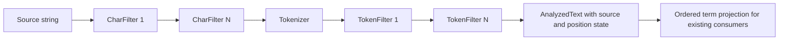
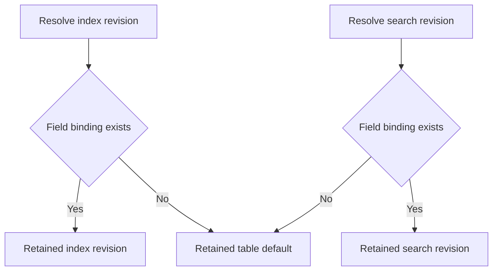
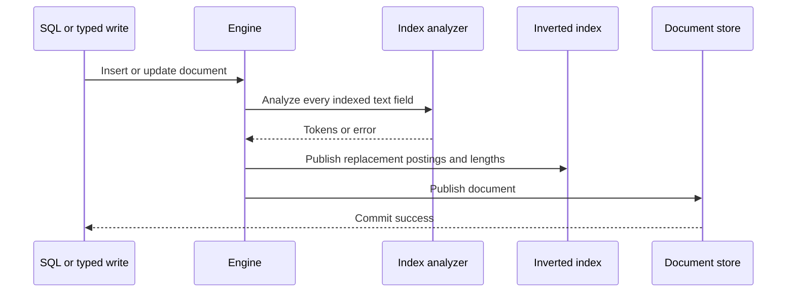
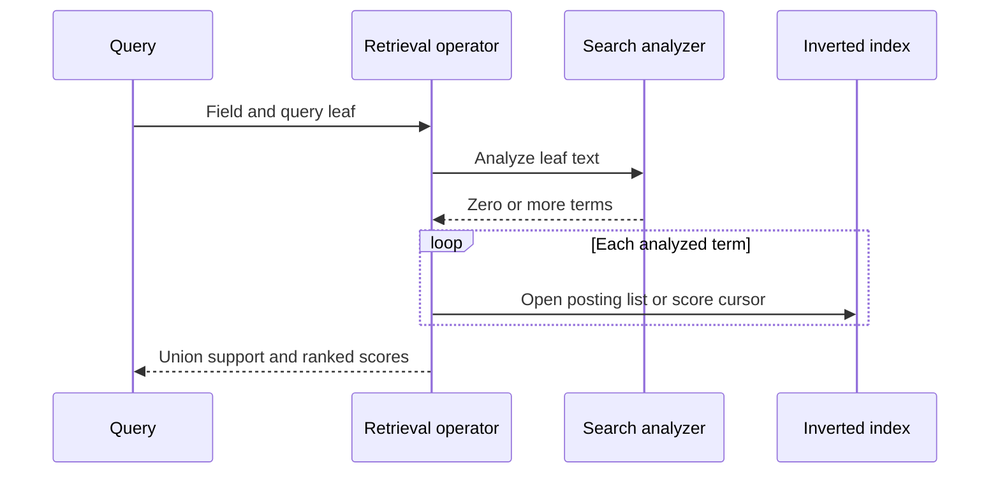

# Analyzer Pipeline Internals

Analyzer behavior crosses analysis, storage, engine catalog, SQL execution, and retrieval operator boundaries. This chapter identifies the owning representations and the invariants required to keep indexed and queried vocabularies compatible.

## Ownership map

| Concern | Owner | Primary representation |
| --- | --- | --- |
| Shared byte allowances and allocation leases | `uqa-core::memory` | `MemoryBudget`, `MemoryReservation`, `Budgeted`, `BudgetedVec`, `BudgetedDeque`, `BudgetedString` |
| Pipeline stages and validation | `uqa-analysis` | `Analyzer`, `CharFilter`, `Tokenizer`, `TokenFilter` |
| Source mapping and token graph | `uqa-analysis` | `FilteredText`, `TextCoordinates`, `AnalysisToken`, `AnalyzedText` |
| Built-in and process-global registry | `uqa-analysis::registry` | Immutable built-ins plus a process-global custom map |
| Persistent named definitions | `uqa-engine` and `CatalogFacade` | Analyzer name to canonical descriptor and resolved diagnostic configuration |
| Persistent field binding | `uqa-engine`, `uqa-storage`, and `CatalogFacade` | Independent named or default revisions, owner, and last-assignment label |
| Index and search analyzer instances | `InvertedIndex` implementations | Independent immutable handles in `AnalyzerBindings` |
| SQL lifecycle | `uqa-execution::query::table_functions::analyzers` | Mutating table functions and `fts_index_stats` |
| Query-time resolution | `uqa-operators` and engine search paths | `search_analyzer_revision(field)` |

The engine catalog stores exact descriptor snapshots, while inverted-index instances retain their immutable `CompiledAnalyzer` handles with resolved resources. A definition update does not mutate installed revisions; an owning GIN definition must be recreated or a field assignment must be reapplied.

Native Korean tokenization can share a `MemoryBudget` with other allocation owners. The analysis crate reserves UTF-16 input, rolling lattice slots and candidates, pending/output token buffers, readings, and morphemes before allocation; replacement buffers coexist with their predecessors in the allowance. Removing lattice candidates does not release retained capacity. The returned `Budgeted<NoriOutput>` holds output reservations until destruction or explicit ownership transfer. Cancellation and allocation errors unwind the call without releasing another owner's reservation. The common tokenizer bridge transfers morphology leases and reserves both encodings during canonical term conversion. It releases consumed native token buffers after replacing them and retains the source-copy and projection payload leases. The common compiled analyzer, token-filter stages, provider cursors, and highlight rendering still need caller propagation to share one end-to-end allowance.

Character edits now stream source slices and prepared replacement fragments into reserved string/map buffers. They do not first collect every match or materialize an expanded replacement string per capture. Scalar-coordinate buffers and shared source payloads retain leases, and source clones share those allocations. The edit sequence copies only when an older view still retains it or a new allocation owner is supplied. Korean token contexts retain the same map/coordinate leases after the original view is dropped. Literal/regex matching still uses library searches; cancellation is checked between searches and during analysis-owned loops. Generic tokenizer word scans emit ranges incrementally, gram boundaries and terms reserve their buffers, and final position validation polls. Failed tokenization uses private coordinate-cache initialization and leaves the borrowed view unchanged. Caller budget propagation through the common compiled pipeline, token filters, provider cursors, and rendering remains open; library regex workspaces and internal interruption also remain outside the complete runtime gate.

## Analysis execution

Porter stemming keeps reserved character and consonant arrays. Appending or replacing suffix elements updates their classification once; prefix measure and vowel scans use that state with cancellation checks. Repeated `y` no longer recursively recomputes preceding classifications. The stemmer reserves its scalar or lossless output while scratch remains live and drops scratch before transferring the result lease. ASCII folding uses the existing normalization library's public single-scalar decomposition callback and emits directly into `TermBuffer`; scalar terms stay UTF-8, while raw terms preserve isolated units. It does not allocate a per-character normalized string or a temporary scalar segment for raw input. Common token-filter and compiled caller propagation remains open.

Full lowercase emits into the same reserved term buffer. Two borrowed forward iterators retain original-input context for Greek final sigma without allocating scalar segments or rescanning an ignored run for each token element. Prepared `Cased` and `Case_Ignorable` ranges come from the existing regex-syntax dependency's public HIR API; execution searches those immutable ranges without a regex workspace. Isolated UTF-16 units pass through unchanged and delimit context. Both source traversals and raw-term finalization poll for cancellation. Descriptor resolution hashes the context classes and preserves the existing Rust Unicode 16 profile only for the verified matching tables; a different version or table content contributes explicit hashes. Exhaustive scalar/context comparisons verify compatibility with Rust string lowercasing.

Reserved copying is owned by the representation modules: `term/allocation.rs` copies scalar/raw terms and builds both encoding coordinates; `nori/attributes/allocation.rs` copies readings and morpheme buffers; `token/allocation/cloning.rs` preserves source/graph attributes and assembles complete result copies. Each copied allocation retains its own lease, while existing source projection/map allocations remain shared. Morphology builders destroy owned values before releasing their aggregate reservations. Synonym expansion supplies the replacement term directly. Gram expansion counts boundaries before reserving the complete table, then reuses its UTF-16 coordinates instead of rescanning a token prefix for every output. This avoids replacement-buffer peaks when the final table fits the allowance. Whole-filter input/output/removal ownership and generic/Korean/compiled caller propagation remain open.

`Analyzer::analyze_tokens` carries `FilteredText` through the character-filter loop, tokenizes once, and moves `AnalyzedText` through the token filters. Character edits map filtered UTF-8 and UTF-16 coordinates back to the original input; token filters preserve source spans, graph increments and lengths, keyword state, and final skipped positions. `Analyzer::analyze` projects this canonical result into ordered terms. Every stage is fallible. An empty stream is a valid result; an invalid regular expression, invalid gram range, failed synonym-file read, or position overflow is an error and must not be converted into an empty result.

Generic terms use `TokenTerm`, with canonical scalar strings and explicit raw UTF-16 storage for unpaired units. Checked string projection fails for a non-scalar term. Nori streams convert directly into this representation, retaining optional Korean morphology and pre-correction coordinates while projecting exact original UTF-16 and safe UTF-8 source ranges. An opaque terminal token preserves attribute changes when an upstream filter is exhausted; subsequent filters must retain that state independently of the emitted token list. The native bridge is exercised against all 803 successful text cases across the tokenizer, analyzer, and number corpora.

Removal filters accumulate skipped increments, including trailing removals. Synonym and gram-filter expansions share the input position and length; tokenizer grams occupy consecutive positions. Unchanged substrings preserve precise source offsets, while rewritten terms retain covering spans. Memory, Key/Value, and SQLite storage consume the rich result and preserve occurrence graphs and original source metadata. Quoted full-text matching retains the field search revision and checks connected occurrence paths. Remaining runtime controls and public delivery requirements are tracked in the [Nori implementation plan](../../plans/0006-nori-analyzer.md). The [Rust reference](../reference/06-text-analyzers.md#structured-tokens) defines the public metadata contract.

Configuration uses Serde tagged enums. Most serialized tags derive from Rust variant spelling, including `n_gram` for `Tokenizer::NGram` and `ngram` for `TokenFilter::Ngram`. Acronym-bearing variants have explicit stable names: `html_strip` for `CharFilter::HTMLStrip` and `ascii_folding` for `TokenFilter::ASCIIFolding`. Deserialization also accepts the derived spellings `h_t_m_l_strip` and `a_s_c_i_i_folding` that releases up to 0.1.2 persisted, so catalogs written before the stable names still open; serialization always emits the stable names. Engine parsing normalizes string shorthand only for the tokenizer and token-filter arrays; canonical object tags remain the compatibility contract.

## Definition validation

`parse_analyzer_config` performs four steps:

1. Parse the source as JSON.
2. Normalize supported string shorthand into tagged objects.
3. Deserialize an `Analyzer`.
4. Call `Analyzer::validate` before catalog publication.

Validation compiles pattern tokenizers and pattern-replacement character filters, checks positive ordered gram bounds, and reads a configured synonym file. Uncompiled execution repeats fallible checks. Index providers compile a revision before installing it and retain its resolved inputs; subsequent execution of that handle does not reread synonym files. Legacy catalog restoration still validates named configuration inputs.

## Analyzer resolution

`Engine::resolve_analyzer_revision` trims and rejects an empty name, then resolves in this order:

1. The process-global `uqa_analysis` registry, including built-ins.
2. The engine's persistent named-analyzer map.

The process-global registry checks its custom entries before built-ins. Name collisions can therefore shadow persistent definitions and make behavior process-dependent. Durable applications must use distinct names and register catalog-owned definitions through `Engine::register_named_analyzer` or SQL `create_analyzer`.

The built-in default name is `standard`. `list_analyzers()` constructs a SQL-visible set from persistent custom names plus the four built-ins. `Engine::list_named_analyzers` and the CLI `\da` expose only the engine's persistent custom-name map.

## Field binding and phase resolution

Memory, Key/Value, and SQLite indexes share `AnalyzerBindings`. It retains immutable `Arc<CompiledAnalyzer>` handles for independent index and search sides. Infallible constructors defer default validation until first successful resolution and then retain that exact default. Explicit field assignment compiles before either side changes. Effective revisions are:

`AnalyzerPhase::Index` replaces only the index revision, `Search` replaces only the search revision, and `Both` installs one revision on both sides. A first phase-specific assignment retains the prior default on the unselected side. The phase parser accepts `index`, `search`, the `query` alias, and `both`; the engine persists `query` as normalized `search`.

`FieldAnalyzerBinding` retains independent index and search descriptors, optional names, an `AnalyzerBindingOwner`, and the last explicit assignment phase. The versioned JSON envelope embeds each strict descriptor directly; restoration rejects unknown properties, corrupt fingerprints, invalid names, and inconsistent owner or assignment metadata. `set_field_analyzer_revisions` installs both compiled sides atomically without resolving an unused table default. A phase-specific Engine assignment persists the complete pair; the compatibility label remains only the most recent explicit assignment.

## Indexing path

Document writes project only registered FTS fields whose values are strings. The inverted-index write is a replacement operation so an update that removes indexed text cannot leave stale postings. Analyzer failure aborts before the document store publishes the new row. Transaction snapshots cover analyzer instances and catalog state so a later failure can restore the prior visible state.

`CREATE INDEX ... USING gin` calls `add_fts_field_with_analyzer` for every indexed column. It compiles an optional analyzer name before publication, stages the full index from existing documents, and publishes its replacement postings with both analyzer sides. Field registration and catalog updates are covered by the owning transaction. The catalog index row stores the analyzer option for reopen.

`set_table_field_analyzer` first requires a real `TEXT` column already registered in the physical FTS index. An `index` or `both` assignment uses the provider's atomic revision/source rebuild; a search-only assignment changes query analysis without touching postings. Failure retains or restores the old compiled index and search handles and prior postings without reopening their resources.

Memory and Key/Value indexes publish canonical `TokenTermKey` values and complete `TokenOccurrence` lists with each document field's `IndexedFieldMetadata`. The metadata retains the exact analyzer fingerprint, length policy, final original offsets, and trailing position gaps, including fields that emit no tokens. Changing a populated field's index revision requires a source rebuild. String posting lists expose unique starts for compatibility, while score cursors count every occurrence. The [occurrence format](../../design/occurrence-posting-format.md) defines exact-key and graph lookup methods, snapshot ownership, failure atomicity, and Key/Value source migrations. SQLite graph storage and graph-aware query execution remain in the Nori plan.

## Query path

`TermOperator` retains `search_analyzer_revision(field)`, analyzes its term, returns empty support for zero tokens, and unions posting lists for multiple tokens. Search-time synonym expansion therefore broadens one leaf without requiring synonym postings for the source query token itself, provided each expansion already exists in the index vocabulary.

Engine text scoring, calibration, hybrid search, top-K execution, multi-field retrieval, retrieval planning, and the operator-tree driver retain the field search revision. Detached portal indexes install the exact compiled handles from their source index. Scoring code uses the analyzed term sequence for term-frequency and query-term accounting. Duplicate analyzed terms can remain semantically relevant and must not be deduplicated casually.

SQL `uqa_highlight` accepts an analyzer name after its six existing arguments. SQL owns argument validation, execution retains the selected compiled revision through `AnalyzerRevisions`, and `uqa-analysis::highlight_compiled` analyzes complete source/query inputs, matches lossless terms, and renders their corrected original-source spans. Overlapping spans merge only for presentation; fragment windows retain a complete selected match. Engine supplies the named-resource adapter. Calls without a name retain whitespace-separated query candidates and English word scanning. Highlighting has no table/field identity and never infers a field analyzer. The typed `highlight` helper uses the rich path when given an analyzer, and `highlight_compiled` accepts a retained revision directly.

## Catalog persistence and reopen

Persistent backends store named descriptors separately from complete field-binding envelopes. SQLite schema version 47 adds descriptor columns to the existing catalog tables; Key/Value stores descriptors under separate name and field keys. Reopen verifies each named descriptor against its resolved diagnostic configuration, validates each field envelope and compatibility label, and installs both exact handles before restoring catalog indexes. Existing bound revisions are independent of later updates to their names. Anonymous default bindings also persist for typed tables with undeclared columns.

GIN definitions validate the persisted owner and name without replaying mutable definitions over an existing revision. An explicit GIN owner requires the same named revision on both sides and rejects competing field assignments. Multiple explicit GIN references must agree. Removing the last explicit owner while another GIN retains the field rebuilds the source under the table default and publishes a default binding in the same transaction.

Dropping a table or its last logical GIN reference removes field analyzer metadata. Dropping a named analyzer fails while any durable table-field assignment references its name. Column renames install the old revisions on the new physical field before rewriting any document, then retire the old field binding. Table and column deletion remove complete catalog envelopes along with their labels.

## Synonym resources

Inline synonyms and resolved file contents are copied into the analyzer descriptor. Registration, a fresh configuration compilation, uncompiled analysis, and legacy catalog migration read synonym files. Named definitions and provider bindings retain compiled snapshots with inline resolved maps. The parser supports blank lines, `#` comments, one-way `left => right` mappings, and comma-separated equivalent groups.

Registered definitions and installed revisions keep their output after the file is edited or removed, including after reopen. A binding to a catalog name uses its retained revision; re-registering the name reads changed source contents. A missing file fails new registration or compilation, an unresolved deferred default, and initial migration of legacy path-only definitions. Legacy phase rows migrate to independent descriptors after all inputs and owners validate; affected indexes rebuild from original sources, and descriptor, binding, and posting writes share the owning catalog transaction.

## Transaction and cache behavior

Analyzer lifecycle functions are classified as mutating SQL even though they appear as table functions under `SELECT`. Implicit statement transactions and explicit transaction snapshots include named analyzers, table assignments, retained compiled handles, and affected postings. `rebuild_with_analyzer_revision` stages a replacement under the candidate handle and publishes its postings and selected binding sides together. Memory builds an independent replacement; Key/Value uses one batch; SQLite uses its transactional rebuild. Failed publication retains the previous binding. Memory bulk insertion also publishes only after the complete batch succeeds. An outer expression failure after `create_analyzer` has produced a row still rolls the creation back.

Named definition and assignment publication advances catalog or table epochs. Other sessions synchronize registry and table catalogs before use, and prepared or stored plans cannot treat cached analyzer-dependent execution state as authoritative after those epochs change.

## Required invariants

- A registered analyzer must validate before it becomes visible or persistent.
- A configured field must exist, be `TEXT`, and be a physical FTS field.
- Index-time analyzer changes must rebuild existing postings atomically.
- Search-time output must be compatible with the indexed vocabulary unless empty support is intended.
- Analyzer errors must remain errors; they cannot become empty tokens, empty results, or partial writes.
- Persistent definitions must resolve without process-local registration on every reopen.
- A named analyzer cannot be removed while a durable field assignment still references it.
- GIN DDL ownership and standalone field-assignment ownership must not compete for the same field.

## Verification evidence

| Contract | Test area |
| --- | --- |
| Component behavior and JSON round trips | `crates/uqa-analysis/tests/analysis` |
| Invalid regex, gram bounds, and built-in registry rules | `crates/uqa-analysis/tests/analysis/validation.rs` |
| Inline and reloadable file synonyms | `crates/uqa-analysis/tests/analysis/synonym_file.rs` |
| Provider phase behavior and atomic revision pairs | `crates/uqa-storage-sqlite/tests/cases/analyzer_revisions.rs` |
| Durable sides, ownership, source migration, rename, rollback, and sessions | `crates/uqa-engine/tests/catalog/analyzer_revisions.rs` |
| SQL create, list, bind, drop, rollback, and reopen | `crates/uqa-engine/tests/sql_analyzer_lifecycle.rs` |
| GIN backfill and analyzer option restoration | `crates/uqa-engine/tests/sql_fts_index_lifecycle.rs` |
| Statement rollback for mutating table functions | `crates/uqa-engine/tests/transaction_lifecycle.rs` |

## Source entry points

| Area | Path |
| --- | --- |
| Pipeline | [`crates/uqa-analysis/src/analyzer.rs`](../../../crates/uqa-analysis/src/analyzer.rs) |
| Character filters | [`crates/uqa-analysis/src/char_filter.rs`](../../../crates/uqa-analysis/src/char_filter.rs) |
| Tokenizers | [`crates/uqa-analysis/src/tokenizer.rs`](../../../crates/uqa-analysis/src/tokenizer.rs) |
| Token filters | [`crates/uqa-analysis/src/token_filter.rs`](../../../crates/uqa-analysis/src/token_filter.rs) |
| Engine catalog lifecycle | [`crates/uqa-engine/src/analyzers.rs`](../../../crates/uqa-engine/src/analyzers.rs) |
| Field registration and rebuild | [`crates/uqa-engine/src/table_storage/fts.rs`](../../../crates/uqa-engine/src/table_storage/fts.rs) |
| SQL argument rules | [`crates/uqa-sql/src/semantics/table_function_arguments.rs`](../../../crates/uqa-sql/src/semantics/table_function_arguments.rs) |
| SQL table-function execution | [`crates/uqa-execution/src/query/table_functions/analyzers.rs`](../../../crates/uqa-execution/src/query/table_functions/analyzers.rs) |
| Inverted-index contract | [`crates/uqa-storage/src/inverted_index/contract.rs`](../../../crates/uqa-storage/src/inverted_index/contract.rs) |

## Related documentation

- [Text analyzer reference](../reference/06-text-analyzers.md)
- [Analyzer SQL](../sql/05-analyzers.md)
- [Analyzer pipeline tutorial](../tutorials/03-analyzer-pipelines.md)
- [Search and ranking internals](05-search-and-ranking.md)
