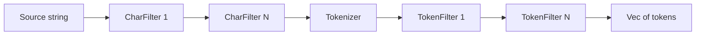
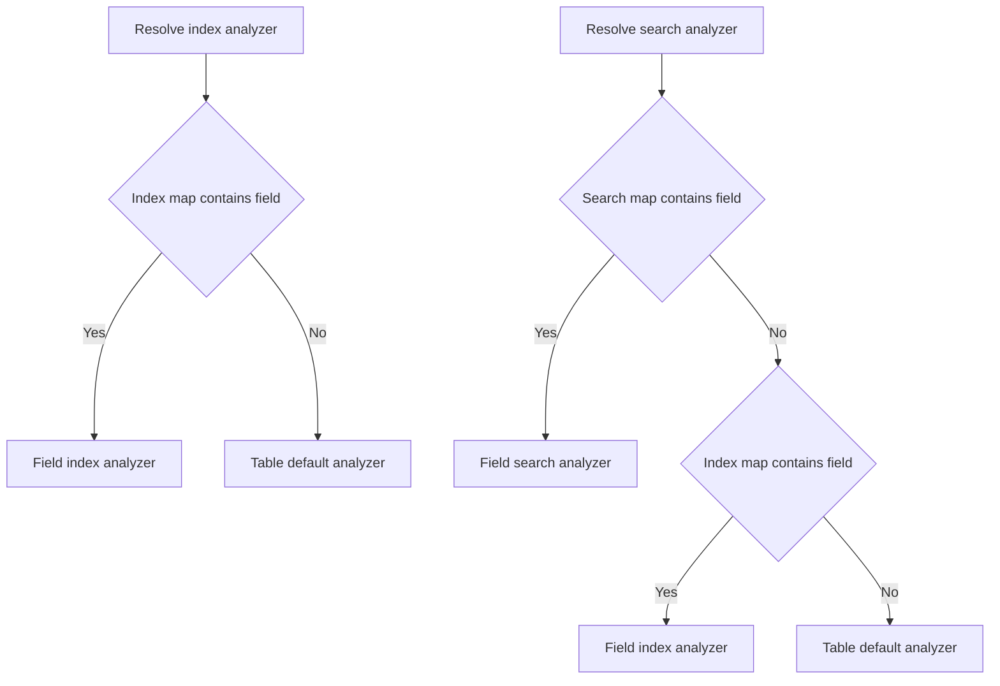
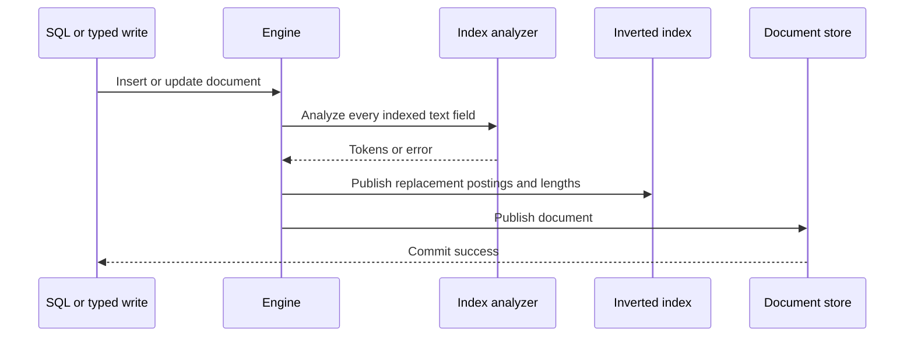
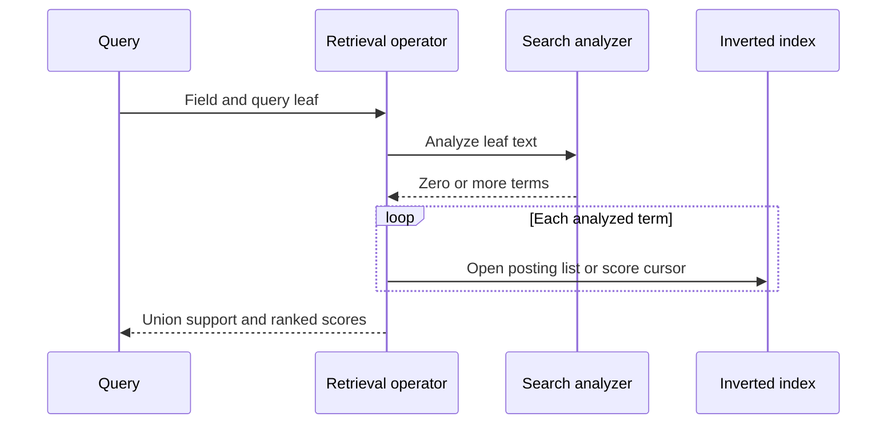

# Analyzer Pipeline Internals

Analyzer behavior crosses analysis, storage, engine catalog, SQL execution, and retrieval operator boundaries. This chapter identifies the owning representations and the invariants required to keep indexed and queried vocabularies compatible.

## Ownership map

| Concern | Owner | Primary representation |
| --- | --- | --- |
| Pipeline stages and validation | `uqa-analysis` | `Analyzer`, `CharFilter`, `Tokenizer`, `TokenFilter` |
| Built-in and process-global registry | `uqa-analysis::registry` | Immutable built-ins plus a process-global custom map |
| Persistent named definitions | `uqa-engine` and `CatalogFacade` | Analyzer name to JSON configuration |
| Persistent field assignment | `uqa-engine` and `CatalogFacade` | Table, field, normalized phase, analyzer name |
| Index and search analyzer instances | `InvertedIndex` implementations | Per-field index and search analyzer maps |
| SQL lifecycle | `uqa-engine::sql::from_rows` | Mutating table functions and `fts_index_stats` |
| Query-time resolution | `uqa-operators` and engine search paths | `get_search_analyzer(field)` |

The engine catalog stores JSON and names, while inverted-index instances hold cloned, validated `Analyzer` values. A definition update therefore does not mutate every installed clone automatically; an owning GIN definition must be recreated or a field assignment must be reapplied.

## Analysis execution

`Analyzer::analyze` owns a mutable string through the character-filter loop, tokenizes once, and moves the token vector through each token filter. Every stage is fallible. An empty vector is a valid result; an invalid regular expression, invalid gram range, or failed synonym-file read is an error and must not be converted into an empty result.

Configuration uses Serde tagged enums. The current serialized tags derive directly from Rust variant spelling, which produces `n_gram` for `Tokenizer::NGram`, `ngram` for `TokenFilter::Ngram`, `h_t_m_l_strip` for `CharFilter::HTMLStrip`, and `a_s_c_i_i_folding` for `TokenFilter::ASCIIFolding`. Engine parsing normalizes string shorthand only for the tokenizer and token-filter arrays; canonical object tags remain the compatibility contract.

## Definition validation

`parse_analyzer_config` performs four steps:

1. Parse the source as JSON.
2. Normalize supported string shorthand into tagged objects.
3. Deserialize an `Analyzer`.
4. Call `Analyzer::validate` before catalog publication.

Validation compiles pattern tokenizers and pattern-replacement character filters, checks positive ordered gram bounds, and reads a configured synonym file. Execution repeats fallible checks because legacy persisted values or external resource changes can invalidate a pipeline after registration.

## Analyzer resolution

`Engine::resolve_analyzer` trims and rejects an empty name, then resolves in this order:

1. The process-global `uqa_analysis` registry, including built-ins.
2. The engine's persistent named-analyzer map.

The process-global registry checks its custom entries before built-ins. Name collisions can therefore shadow persistent definitions and make behavior process-dependent. Durable applications must use distinct names and register catalog-owned definitions through `Engine::register_named_analyzer` or SQL `create_analyzer`.

The built-in default name is `standard`. `list_analyzers()` constructs a SQL-visible set from persistent custom names plus the four built-ins. `Engine::list_named_analyzers` and the CLI `\da` expose only the engine's persistent custom-name map.

## Field binding and phase resolution

Each inverted index has a table-level default analyzer plus per-field index and search maps. The effective analyzers are:

`AnalyzerPhase::Index` writes only the index map, `Search` writes only the search map, and `Both` writes both. The phase parser accepts `index`, `search`, the `query` alias, and `both`; the engine persists `query` as normalized `search`.

The engine currently retains one durable assignment record per `(table, field)`. Calling `set_table_field_analyzer` replaces the previous record and phase. The underlying index trait can hold two different in-memory analyzer values, and a phase-specific call does not clear the unselected map, but the engine catalog API does not expose two independently persistent phase records for one field. Layered phase calls can therefore differ before and after reopen; documentation and tests must require one assignment or prove that transition explicitly.

## Indexing path

Document writes project only registered FTS fields whose values are strings. The inverted-index write is a replacement operation so an update that removes indexed text cannot leave stale postings. Analyzer failure aborts before the document store publishes the new row. Transaction snapshots cover analyzer instances and catalog state so a later failure can restore the prior visible state.

`CREATE INDEX ... USING gin` calls `add_fts_field_with_analyzer` for every indexed column. It validates an optional analyzer name, installs it for both phases, registers the FTS field, and rebuilds the full index from existing documents. The catalog index row stores the analyzer option for reopen.

`set_table_field_analyzer` first requires a real `TEXT` column already registered in the physical FTS index. An `index` or `both` assignment installs the analyzer and calls `rebuild_fts_index`; a search-only assignment changes query analysis without touching postings. Persistence failure or rebuild failure restores the old index and search analyzers and rebuilds the prior posting state when required.

## Query path

`TermOperator` resolves `get_search_analyzer(field)`, analyzes its term, returns empty support for zero tokens, and unions posting lists for multiple tokens. Search-time synonym expansion therefore broadens one leaf without requiring synonym postings for the source query token itself, provided each expansion already exists in the index vocabulary.

Engine text scoring, calibration, hybrid search, top-K execution, multi-field retrieval, and the operator-tree driver all resolve the field search analyzer. Scoring code uses the analyzed term sequence for term-frequency and query-term accounting. Duplicate analyzed terms can remain semantically relevant and must not be deduplicated casually.

The SQL `uqa_highlight` scalar path is an exception: it extracts whitespace-separated query candidates and uses `standard_analyzer("english")` directly. It does not receive a table and field identity, so it cannot resolve a field analyzer. The typed highlighting API accepts an explicit analyzer.

## Catalog persistence and reopen

Persistent backends store named analyzer JSON separately from table-field assignment rows. Reopen validates and loads named definitions, validates each target field, resolves the assigned name, restores the normalized phase into the inverted index, and restores catalog indexes.

A GIN analyzer option and a later standalone field assignment are separate catalog owners. GIN restoration replays its analyzer option as part of the index definition. Callers should use one ownership path per field instead of relying on restoration order between two competing definitions.

Dropping a table or its last logical GIN reference removes field analyzer metadata. Dropping a named analyzer fails while any durable table-field assignment references its name. A DDL-owned analyzer must also remain resolvable for its GIN catalog index to reopen.

## Synonym resources

Inline synonyms are copied into the analyzer JSON. File-backed synonyms persist a path and read the file during registration validation and every analysis execution. The parser supports blank lines, `#` comments, one-way `left => right` mappings, and comma-separated equivalent groups.

Repeated reads make file edits visible without republishing catalog state, but they also make file availability part of every indexing and search operation. A missing file during a document mutation must abort both posting and row publication. A missing file during reopen validation or query analysis must surface as an explicit error. Production deployment must version, distribute, permission, and monitor this external resource with the database.

## Transaction and cache behavior

Analyzer lifecycle functions are classified as mutating SQL even though they appear as table functions under `SELECT`. Implicit statement transactions and explicit transaction snapshots include named analyzers, table assignments, table analyzer clones, and affected postings. An outer expression failure after `create_analyzer` has produced a row still rolls the creation back.

Named definition and assignment publication advances catalog or table epochs. Other sessions synchronize registry and table catalogs before use, and prepared or stored plans cannot treat cached analyzer-dependent execution state as authoritative after those epochs change.

## Required invariants

- A registered analyzer must validate before it becomes visible or persistent.
- A configured field must exist, be `TEXT`, and be a physical FTS field.
- Index-time analyzer changes must rebuild existing postings atomically.
- Search-time output must be compatible with the indexed vocabulary unless empty support is intended.
- Analyzer errors must remain errors; they cannot become empty tokens, empty results, or partial writes.
- Persistent definitions must resolve without process-local registration on every reopen.
- A named analyzer cannot be removed while a durable field assignment still references it.
- GIN DDL ownership and standalone field-assignment ownership must not compete for the same field.

## Verification evidence

| Contract | Test area |
| --- | --- |
| Component behavior and JSON round trips | `crates/uqa-analysis/tests/analysis` |
| Invalid regex, gram bounds, and built-in registry rules | `crates/uqa-analysis/tests/analysis/validation.rs` |
| Inline and reloadable file synonyms | `crates/uqa-analysis/tests/analysis/synonym_file.rs` |
| In-memory and SQLite phase behavior | `crates/uqa-storage/tests/inverted_index_analyzer.rs` |
| SQL create, list, bind, drop, rollback, and reopen | `crates/uqa-engine/tests/sql_analyzer_lifecycle.rs` |
| GIN backfill and analyzer option restoration | `crates/uqa-engine/tests/sql_fts_index_lifecycle.rs` |
| Statement rollback for mutating table functions | `crates/uqa-engine/tests/transaction_lifecycle.rs` |

## Source entry points

| Area | Path |
| --- | --- |
| Pipeline | [`crates/uqa-analysis/src/analyzer.rs`](../../../crates/uqa-analysis/src/analyzer.rs) |
| Character filters | [`crates/uqa-analysis/src/char_filter.rs`](../../../crates/uqa-analysis/src/char_filter.rs) |
| Tokenizers | [`crates/uqa-analysis/src/tokenizer.rs`](../../../crates/uqa-analysis/src/tokenizer.rs) |
| Token filters | [`crates/uqa-analysis/src/token_filter.rs`](../../../crates/uqa-analysis/src/token_filter.rs) |
| Engine catalog lifecycle | [`crates/uqa-engine/src/engine_analyzers.rs`](../../../crates/uqa-engine/src/engine_analyzers.rs) |
| Field registration and rebuild | [`crates/uqa-engine/src/engine_table_storage/fts.rs`](../../../crates/uqa-engine/src/engine_table_storage/fts.rs) |
| SQL table functions | [`crates/uqa-engine/src/sql/from_rows/table_function_dispatch.rs`](../../../crates/uqa-engine/src/sql/from_rows/table_function_dispatch.rs) |
| Inverted-index contract | [`crates/uqa-storage/src/inverted_index/contract.rs`](../../../crates/uqa-storage/src/inverted_index/contract.rs) |

## Related documentation

- [Text analyzer reference](../reference/06-text-analyzers.md)
- [Analyzer SQL](../sql/05-analyzers.md)
- [Analyzer pipeline tutorial](../tutorials/03-analyzer-pipelines.md)
- [Search and ranking internals](05-search-and-ranking.md)
