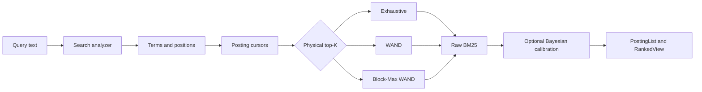

# Search and Ranking Internals

Search execution separates analysis, storage order, scoring domains, ranking order, calibration, and fusion. Keeping those boundaries explicit prevents an optimization from changing the meaning of a score.

## Text path

Index and search analyzer assignment is field-specific. Documents add analyzed text to a persistent or memory inverted index. Query analysis preserves duplicate terms as separate cursors because duplicate query terms can change scoring. Pipeline stage ownership, JSON tags, phase fallback, atomic rebuilds, catalog restoration, and synonym resources are documented in [Analyzer pipeline internals](04-analyzer-pipeline.md).

## BM25 domains

Raw BM25 is a ranking score, not a probability. For term $t$:

$$
\operatorname{IDF}(t) = \ln\left(\frac{N - n_t + 0.5}{n_t + 0.5} + 1\right),
$$

and the term contribution uses frequency and length normalization with defaults $k_1 = 1.2$ and $b = 0.75$.

`uqa-scoring` uses distinct types for raw BM25, evidence logits, prior logits, and posterior probabilities. Conversions are named and validated so a posterior cannot be accidentally added as prior-free evidence.

## Query-level Bayesian calibration

Bayesian BM25 sums raw term contributions and calibrates once:

$$
P(R = 1 \mid s) = \sigma(\alpha(s - \beta)).
$$

The complete query score is the calibration input. Independently transforming each term and adding the results would define a different model.

Field parameter loads are cached within an execution epoch after validation. Table or catalog writes, publication, refresh, external committed-version observation, and rollback invalidate or synchronize that cache according to the state contract.

## Exact text top-K

For one field-bound score-ordered text leaf, the planner creates `TextTopKPlan`. Execution bulk-loads scorer-versioned term bounds. Block-Max WAND is selected only when every non-empty posting has bounds whose fingerprint matches active BM25 parameters and field statistics. Otherwise execution uses exact WAND or exhaustive scoring.

WAND and Block-Max WAND skip only when an upper bound proves that a candidate cannot enter the current top-K. Therefore they are exact top-K algorithms under valid bounds. A write atomically invalidates persisted block bounds, and a validity change causes safe fallback.

Boolean and fusion parents do not receive child text top-K pushdown because truncating one child can change the parent support and ranking.

## Posting cursor behavior

Persistent score cursors use the clustered format described in [Storage](03-storage.md). Exhaustive multi-term ranking advances sorted cursors together and reuses score buffers rather than constructing one map entry per document. WAND and BMW bulk-read bounds instead of issuing one backend request per term or document.

`Engine::search_profiled` reports algorithm, scored candidates, total candidate bound, cursor advances, skip rate, and elapsed time. Profile counters diagnose physical work but do not measure relevance quality.

## Vector path

| Physical path | Internal contract |
| --- | --- |
| Brute force | Score every stored vector with exact cosine similarity |
| IVF | Train centroids, assign vectors to lists, probe selected lists, then score candidates |
| HNSW | Navigate a layered proximity graph with construction and search breadth controls |

Vector dimension and finiteness are validated before execution. Tensor storage associates multiple same-dimensional vectors with one row; retrieval keeps the maximum element similarity as the row score.

IVF and HNSW have separate catalog identities, persistence, construction, and mutation logic. They are not aliases of a generic approximate index. See the [vector index design](../../design/vector-indexes.md).

## Vector calibration

Model-based vector calibration records schema and model versions plus corpus, index, embedding model, dimensions, and candidate-K provenance. Execution validates provenance before applying a fixed transform.

The compatibility pool transform is explicitly query-local and unsupervised. It must not be reported as an identified probability model.

## Fusion

Exact Bayesian evidence adds one prior and signed likelihood-ratio evidence:

$$
L = \operatorname{logit}(\pi) + \sum_i \ell_i, \qquad P = \sigma(L).
$$

Robust positive-evidence pooling has a separate type and name. It applies gating, confidence scaling, and optional adaptive weights as a ranking heuristic. The code does not claim that its output is an exact posterior.

Independent fusion inputs can execute concurrently on the shared parallel executor. Their outputs merge only at the typed fusion node, and any child error aborts the parent rather than disappearing as an empty signal.

## Learned and attention fusion

Learned fusion and attention operators consume explicit feature vectors or signal carriers and registered model specifications. Model version, input ordering, normalization, and training provenance are part of the semantic contract. A cached model is invalidated when its durable identity changes.

## Calibration verification

Held out labels support reliability bins, expected calibration error, Brier score, log loss, deterministic bootstrap intervals, threshold transfer, and candidate-K drift checks. Training-set fit and unlabeled percentile transforms are not sufficient calibration evidence.

Approximate vector quality uses exact brute-force identities as the ground truth for recall. Hybrid relevance uses labeled metrics independently from vector recall and probability calibration.

## Source entry points

| Area | Path |
| --- | --- |
| Analysis | [`crates/uqa-analysis/src/lib.rs`](../../../crates/uqa-analysis/src/lib.rs) |
| Analyzer catalog | [`crates/uqa-engine/src/engine_analyzers.rs`](../../../crates/uqa-engine/src/engine_analyzers.rs) |
| Scoring | [`crates/uqa-scoring/src/lib.rs`](../../../crates/uqa-scoring/src/lib.rs) |
| Fusion | [`crates/uqa-fusion/src/lib.rs`](../../../crates/uqa-fusion/src/lib.rs) |
| Operator algebra | [`crates/uqa-operators/src/lib.rs`](../../../crates/uqa-operators/src/lib.rs) |
| Engine search | [`crates/uqa-engine/src/engine_search`](../../../crates/uqa-engine/src/engine_search) |
| Retrieval lowering | [`crates/uqa-engine/src/operator_tree_bridge`](../../../crates/uqa-engine/src/operator_tree_bridge) |
