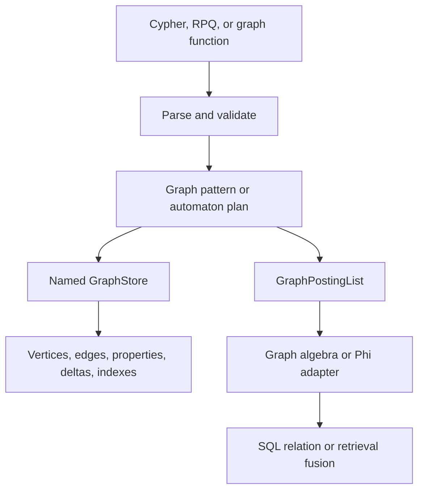

# Graph Runtime Internals

`uqa-graph` owns named graph storage, pattern execution, Cypher parsing and mutation, regular path automata, graph algebra, centrality, temporal traversal, embeddings, and graph indexes. The engine exposes those capabilities without reducing graph context to an untyped row side channel.

## Runtime layers

## Named graph state

A graph name identifies a workspace with vertices, edges, labels, properties, temporal deltas, and path indexes. Memory and persistent stores implement graph operations, while engine catalog ownership restores named graph identities and metadata.

Persistent engines keep only session-bound `PersistentGraphStore` handles. Vertex, edge, membership, and adjacency records remain in the physical backend: neither opening, session creation, catalog refresh, nor handle cloning constructs a complete resident graph. `MemoryGraphStore` is primary storage for `Engine::new()`, not a cache for persistent engines. Standalone `uqa_storage_sqlite::SQLiteGraphStore` follows the same direct-access contract through graph's `GraphStorage` and `GraphWriteTransaction` interfaces. Physical SQLite queries live in the provider crate.

Point reads return owned entities; scans use bounded ID pages, and label and adjacency predicates start at selective physical indexes. Corrupt payloads fail when accessed rather than forcing every unrelated entity to be decoded at startup. Individual analytical queries can still require result-sized or algorithm-specific working sets, such as PageRank scores or traversal frontiers; those are not persistent graph replicas.

Vertex and edge identities are non-negative internal identifiers. Application properties such as `member_id` are separate values and should be used explicitly when joining graph objects to relational tables.

## Cypher pipeline

The Cypher parser produces an owned query representation for supported clauses. Execution carries a binding environment across `MATCH`, `OPTIONAL MATCH`, `UNWIND`, `WITH`, filtering, projection, grouping, ordering, skip, and limit. Mutation paths implement create, merge, set, delete, and detach delete semantics against the named store.

`MERGE` separates its matched and created paths so `ON MATCH SET` and `ON CREATE SET` apply only to the correct branch. A mutation returning no values still enters SQL through a defined table-function schema.

`uqa-sql::semantics::age_cypher` validates SQL call shapes, converts Cypher parameter maps, and applies concrete SQL output types. `uqa-core::agtype` owns the shared graph value model, ordering, and rendering, and remains available through `uqa_graph::agtype`. `uqa-execution::query::cypher` checks transaction access, resolves the graph, invokes Cypher, and constructs physical rows. Engine binds the existing live graph state and public graph transaction boundary.

## Pattern matching

Patterns retain node labels, relationship labels, direction, fixed or variable length, property predicates, and path variables. Optional matching preserves the incoming binding when no extension matches and emits NULL-compatible outputs for the optional side.

Variable-length traversal must avoid invalid repeated states according to the path semantics and obey explicit bounds when supplied. Filters are pushed only where doing so preserves optional and path behavior.

## Regular path queries

RPQ syntax compiles with Thompson construction to an NFA and can convert to a DFA. Evaluation traverses the product of graph vertex and automaton state:

$$
(v, q) \xrightarrow{a} (v', q')
$$

when the graph contains an edge $v \xrightarrow{a} v'$ and the automaton contains transition $q \xrightarrow{a} q'$.

The visited set is over product states, not graph vertices alone, because one vertex reached in different automaton states can have different future acceptance behavior.

Parser depth is bounded at 256 and NFA or DFA states at 16,384. Weighted RPQ evaluates the stored path predicate and score contract; it does not reuse a planner selectivity estimate as an output score.

## GraphPostingList

`GraphPostingList` pairs document support with graph payload while enforcing that graph payload keys belong to the support set. Union, intersection, difference, graph-name conflict, and overlapping subgraph operations use explicit policies.

Generic posting collision rules do not define graph overlap automatically. Every graph algebra operation must state whether it merges, selects, rejects, or removes graph context.

## Phi codec boundary

The Phi representation is a versioned lossless codec between `GraphPostingList` and reserved posting payload fields. It is an adapter for graph and document composition, not a claim that arbitrary graphs and document sets are isomorphic.

Round-trip tests must compare complete graph payload, support, names, and reserved-field versions. An adapter that preserves only document identities is not lossless.

## Centrality and traversal support

PageRank, HITS, and betweenness produce scored graph support. Traversal, neighbors, graph edges, temporal traversal, and RPQ produce membership or decorated support according to their node type. The engine then intersects, filters, joins, or fuses that carrier with relational and retrieval data.

## SQL composition

The `cypher` table function returns a relation and therefore joins through ordinary SQL execution. Graph support predicates instead align graph vertex identity with the current table document identity. The distinction is important: a table-function join uses explicit projected properties, while a support predicate assumes an identity domain.

## Durable reads and transactions

Graph mutation participates in the engine statement boundary. Storage transactions and savepoints own atomicity, including rollback on errors or panics; mutation candidates clone handles, not graph payloads. Catalog generations refresh graph names and label metadata. Shared entity changes update physical indexes for all owning graphs.

REPEATABLE READ and SERIALIZABLE retain a fixed physical reader and overlay only the identities changed by the current transaction. Unchanged entities are fetched from the fixed reader; changed entities are fetched from the writer. Savepoints retain changed-ID checkpoints, and conflicting concurrent changes report a serialization failure instead of overwriting an unseen version. Promoting an unrelated relational write cannot replace the fixed graph read view.

Cursors retain their declaration-time graph view independently of later writes and transaction completion. Native pinned readers are reused when possible. Rollback-journal backends cannot retain a reader while acquiring a writer; these fixed snapshots are streamed into encrypted temporary storage. A cursor containing earlier uncommitted graph writes uses the same bounded, storage-backed mechanism for its graph dependencies, not a resident graph copy. Ordinary opens and new sessions never take that detachment path.

Persistent path indexes store reachability pairs in physical indexed pages. Construction is checkpointed, so a failed rebuild restores the prior definition and data. Graph writes invalidate materializations atomically; query-time reads of a legacy or invalidated materialization evaluate only the requested path sequence and do not rebuild or retain an index. Temporary cursor and transaction views cannot use live materializations that belong to a different graph snapshot. `VersionedGraphStore` retains explicit operation-level undo history and restores overwritten global entities and exact memberships; it does not snapshot a complete graph for rollback.

Durable path-index reads retain their selected backend's original serializable participant, cancellation and observation allowance. Cached reachability observes graph-scoped starting vertices and the requested edge labels, including empty results; it does not reconstruct paths or decode entity properties to record those reads. Invalidated-sequence evaluation and index construction bind the same graph observer. Escaped versioned handles open an independent read transaction over the selected retained view, preserving its data and participant rather than opening a newer snapshot. The remaining automatic SQL serializable lifecycle is tracked in the concurrent-storage plan.

Semantic graph-name and path-index-definition lookups retain their original transaction dependencies even when answered from Engine catalog caches. Names and complete listings observe absent entries as well as present ones; durable path lookup observes the live definition it validates. Named graph selection also depends on that graph remaining present; creation/removal observes its existence decision even when no data changes. Graph owns these reads, common storage owns bounded logical addresses and each provider stages actual definition changes with its evaluated batch. Identical definitions, standalone registry-only updates and planner statistics do not manufacture name dependencies. Label definitions are observed separately from graph presence and path definitions. Label-kind lookups, including absent names and reserved default labels, retain precise definition points; label listings retain the selected graph's complete definition set. ID allocation reads only its selected label and required default, while internal registry restoration does not become a whole-catalog read. Explicit registry export observes the original registry record. Autonomous sequence floors retain their existing allocation semantics; counter-only publication does not change a label definition. Automatic public SQL serializable admission remains incomplete.

Execution attaches the original query participant to a retained `CatalogReadView` for virtual-row consumption. Graph names, label definitions, label sequences and graph entities use the same Graph-owned observers as direct reads, including empty graph catalogs. `ag_graph` and graph-derived namespace rows read graph presence without loading unrelated labels. Persistent handles share their retained resources; primary in-memory stores remain borrowed. Engine supplies the original context and cancellation through its catalog adapter.

Virtual catalog rows are produced on the first row pull through the existing deferred source. Binding and planner snapshots stay unobserved, and `LIMIT 0` or an unused child does not create catalog-read dependencies. Typed cancellation, resource exhaustion and serialization diagnostics survive catalog projection. These graph paths do not complete the remaining relational catalog observations or enable automatic public SQL serializable admission.

Transaction recovery restores the saved graph overlay before rebuilding catalogs from the rolled-back provider. Transaction and savepoint rollback, statement abort and failed transaction completion therefore resolve names against the restored boundary, preserving the original error instead of failing again on a cancelled graph definition.

## Source entry points

| Area | Path |
| --- | --- |
| Graph crate | [`crates/uqa-graph/src/lib.rs`](../../../crates/uqa-graph/src/lib.rs) |
| SQLite graph provider | [`crates/uqa-storage-sqlite/src/graph.rs`](../../../crates/uqa-storage-sqlite/src/graph.rs) |
| Cypher parser | [`crates/uqa-graph/src/cypher/parser.rs`](../../../crates/uqa-graph/src/cypher/parser.rs) |
| RPQ implementation | [`crates/uqa-graph/src/rpq.rs`](../../../crates/uqa-graph/src/rpq.rs) |
| Engine graph API | [`crates/uqa-engine/src/graphs.rs`](../../../crates/uqa-engine/src/graphs.rs) |
| Shared graph values | [`crates/uqa-core/src/agtype.rs`](../../../crates/uqa-core/src/agtype.rs) |
| SQL Cypher rules | [`crates/uqa-sql/src/semantics/age_cypher.rs`](../../../crates/uqa-sql/src/semantics/age_cypher.rs) |
| SQL Cypher execution | [`crates/uqa-execution/src/query/cypher.rs`](../../../crates/uqa-execution/src/query/cypher.rs) |
