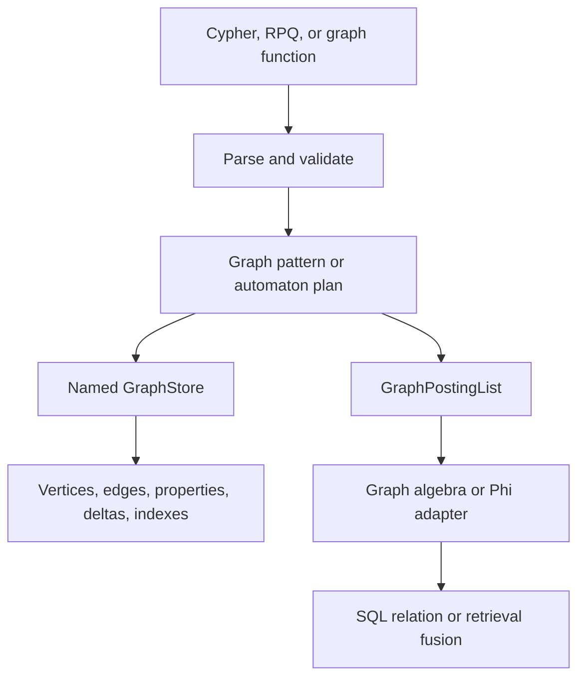

# Graph Runtime Internals

`uqa-graph` owns named graph storage, pattern execution, Cypher parsing and mutation, regular path automata, graph algebra, centrality, temporal traversal, embeddings, and graph indexes. The engine exposes those capabilities without reducing graph context to an untyped row side channel.

## Runtime layers

## Named graph state

A graph name identifies a workspace with vertices, edges, labels, properties, temporal deltas, and path indexes. Memory and persistent stores implement graph operations, while engine catalog ownership restores named graph identities and metadata.

Vertex and edge identities are non-negative internal identifiers. Application properties such as `member_id` are separate values and should be used explicitly when joining graph objects to relational tables.

## Cypher pipeline

The Cypher parser produces an owned query representation for supported clauses. Execution carries a binding environment across `MATCH`, `OPTIONAL MATCH`, `UNWIND`, `WITH`, filtering, projection, grouping, ordering, skip, and limit. Mutation paths implement create, merge, set, delete, and detach delete semantics against the named store.

`MERGE` separates its matched and created paths so `ON MATCH SET` and `ON CREATE SET` apply only to the correct branch. A mutation returning no values still enters SQL through a defined table-function schema.

The SQL adapter in `uqa-engine/src/sql/age_cypher.rs` converts between SQL arguments, Cypher parameters, canonical `agtype`, and concrete SQL output types.

## Pattern matching

Patterns retain node labels, relationship labels, direction, fixed or variable length, property predicates, and path variables. Optional matching preserves the incoming binding when no extension matches and emits NULL-compatible outputs for the optional side.

Variable-length traversal must avoid invalid repeated states according to the path semantics and obey explicit bounds when supplied. Filters are pushed only where doing so preserves optional and path behavior.

## Regular path queries

RPQ syntax compiles with Thompson construction to an NFA and can convert to a DFA. Evaluation traverses the product of graph vertex and automaton state:

$$
(v, q) \xrightarrow{a} (v', q')
$$

when the graph contains an edge $v \xrightarrow{a} v'$ and the automaton contains transition $q \xrightarrow{a} q'$.

The visited set is over product states, not graph vertices alone, because one vertex reached in different automaton states can have different future acceptance behavior.

Parser depth is bounded at 256 and NFA or DFA states at 16,384. Weighted RPQ evaluates the stored path predicate and score contract; it does not reuse a planner selectivity estimate as an output score.

## GraphPostingList

`GraphPostingList` pairs document support with graph payload while enforcing that graph payload keys belong to the support set. Union, intersection, difference, graph-name conflict, and overlapping subgraph operations use explicit policies.

Generic posting collision rules do not define graph overlap automatically. Every graph algebra operation must state whether it merges, selects, rejects, or removes graph context.

## Phi codec boundary

The Phi representation is a versioned lossless codec between `GraphPostingList` and reserved posting payload fields. It is an adapter for graph and document composition, not a claim that arbitrary graphs and document sets are isomorphic.

Round-trip tests must compare complete graph payload, support, names, and reserved-field versions. An adapter that preserves only document identities is not lossless.

## Centrality and traversal support

PageRank, HITS, and betweenness produce scored graph support. Traversal, neighbors, graph edges, temporal traversal, and RPQ produce membership or decorated support according to their node type. The engine then intersects, filters, joins, or fuses that carrier with relational and retrieval data.

## SQL composition

The `cypher` table function returns a relation and therefore joins through ordinary SQL execution. Graph support predicates instead align graph vertex identity with the current table document identity. The distinction is important: a table-function join uses explicit projected properties, while a support predicate assumes an identity domain.

## Transaction and cache behavior

Graph mutation participates in the engine statement boundary. Candidate graph and catalog state is durable before it becomes published in caches. Rollback restores graph registries and provider state. Epoch publication informs sibling sessions that their private graph cache needs refresh.

Path indexes and graph deltas are durable objects and must follow the same create, validate, publish, invalidate, and reopen sequence as relational or vector indexes.

## Source entry points

| Area | Path |
| --- | --- |
| Graph crate | [`crates/uqa-graph/src/lib.rs`](../../../crates/uqa-graph/src/lib.rs) |
| Cypher parser | [`crates/uqa-graph/src/cypher/parser.rs`](../../../crates/uqa-graph/src/cypher/parser.rs) |
| RPQ implementation | [`crates/uqa-graph/src/rpq.rs`](../../../crates/uqa-graph/src/rpq.rs) |
| Engine graph API | [`crates/uqa-engine/src/engine_graphs.rs`](../../../crates/uqa-engine/src/engine_graphs.rs) |
| SQL Cypher adapter | [`crates/uqa-engine/src/sql/age_cypher.rs`](../../../crates/uqa-engine/src/sql/age_cypher.rs) |
