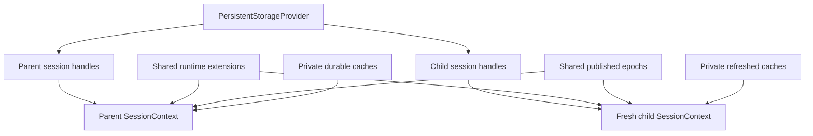
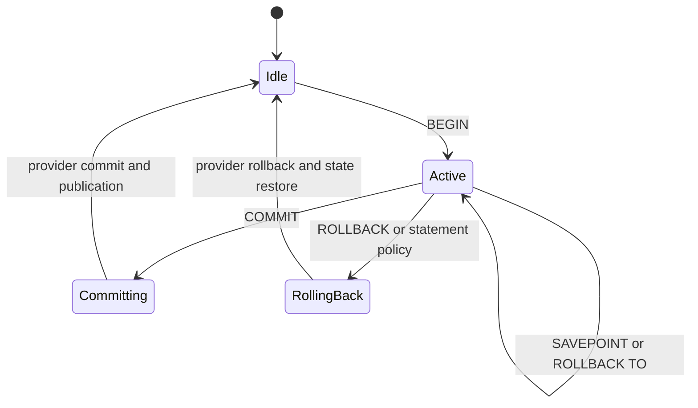

# State and Transactions

`Engine` coordinates six ownership domains. Correct session isolation and publication depend on keeping mutable state in its designated domain.

## Ownership domains

| Domain | Owns | Sharing rule |
| --- | --- | --- |
| `StorageContext` | Session-bound table handles, catalog and backend facades, provider factory | Rebuilt per logical session; provider is a shared factory |
| `DurableCatalogState` | Graph, model, scoring, view, schema, sequence, analyzer, FDW, index, and SQL-routine caches | Private per session and synchronized by epochs |
| `SessionContext` | Search path, variables, PRNG, sequence `currval`, prepared plans, statement cache, and transaction stack | Never shared between sessions |
| `RuntimeExtensions` | Runtime callbacks and in-memory FDW rows | Deliberately shared by derived sessions |
| `EpochCoordinator` | Published and observed generations, dirty bits, and refresh serialization | Published counters shared; observations local |
| `QueryRuntime` | Statement gate, cancellation, notices, and routine-depth policy | Private per session |

The detailed normative record is [Engine state ownership](../../design/engine-state-ownership.md).

## Execution capabilities

The composition facade constructs narrow capabilities over these owners. `CatalogReadView` owns an immutable `Arc` snapshot of statement-visible table definitions and durable registries; `RelationNameResolution` owns the matching search path and temporary namespace; `SessionExecutionView` exposes users, variables, and transaction-visible identity; `QueryRuntimeView` exposes cancellation, `work_mem`, callbacks, and diagnostics; and `MutationCoordinator` owns schema transitions, catalog publication, and the command mutation-overlay lifetime. None can dereference or otherwise recover the enclosing `Engine`.

`UnifiedPlanExecutor` captures the session, query-runtime, and mutation capabilities at statement construction while retaining one exhaustive top-level plan match. `CteScope` captures one catalog and name-resolution snapshot and passes it through binding, filter pushdown, virtual and local scans, evaluation, and physical construction. Static catalog builders and pure query leaves therefore cannot access transaction mutation, locks, storage publication, or unrelated registries. SQL `CREATE SCHEMA` and the public schema facade share the same `MutationCoordinator` implementation, including persistence-before-publication and rollback behavior. Every DML entry chooses an implicit transaction only when no explicit transaction exists, and a scoped overlay makes staged insert, rewrite, delete, conflict, rule, trigger, referential, and partition effects visible to the rest of that command; dropping the scope always removes the overlay. The transaction stack, savepoint lifecycle, row-lock manager, and committed-change observation remain the transaction-and-concurrency owners described below.

Session portal dependency discovery is owned by [`engine_session/portals/dependencies.rs`](../../../crates/uqa-engine/src/engine_session/portals/dependencies.rs), which recursively expands CTE, view, routine, hierarchy, and table-function dependencies before a portal is sealed. Rule and trigger definition validation are separate owners under [`engine_events/validation/`](../../../crates/uqa-engine/src/engine_events/validation), so catalog publication does not mix the two event contracts or bypass their relation and row-type checks.

## Session derivation

`new_session` asks the provider for catalog and data handles bound to a new transaction context. SQLite binds another managed connection; redb binds independent read or write transaction state over the shared database. The child creates fresh session and query runtime state, shares runtime extensions and published epoch counters, and restores its own durable caches.

## Statement boundary

The re-entrant statement gate serializes unsafe mutation within one logical session and protects multi-registry snapshots. Public operations that access transactional state enter this boundary unless their implementation documents a safe exception.

Public methods do not return lock guards. Storage I/O occurs while building candidate state, and the in-memory registry is updated only after persistence succeeds.

## Transaction lifecycle

An implicit statement transaction performs the same candidate, persistence, and publication ordering within one statement. An explicit transaction retains staged state across statements until commit or rollback.

`Engine::transaction` gives one scoped owner the frame depth it opened. The owner commits on success, rolls back returned errors and panics, and performs a final rollback if it is dropped before either transition completes. `sql_batch` uses the same owner and commits its complete statement list or rolls the list back.

Transaction coordination is decomposed under [`engine_transactions/`](../../../crates/uqa-engine/src/engine_transactions) into explicit control, implicit callbacks, savepoints, snapshots, backend transitions, publication, cleanup, characteristics, deferred checks, and row-lock session integration. Lock ownership is decomposed under [`row_locks/`](../../../crates/uqa-engine/src/row_locks) into identities, grants, relation locks, waits and deadlocks, release cleanup, change observation and publication, registry sharing, and the durable cross-process adapter. The roots define the lifecycle and shared types; no child or root reaches the 1,000-line ceiling or hides descendant structural warnings.

## Snapshot and restore

Transactional session fields live behind one `SessionContext.state` lock, so a snapshot cannot combine an old search path with a new prepared cache, PRNG state, or sequence map.

Memory transaction snapshot order is statement gate, table registry and per-table state, durable registries in the coordinator-declared order, then in-memory FDW rows. Restore uses the same durable-registry order through the matching `DurableCatalogState` method. Adding a registry requires updating both directions and the coordinator's lock-order contract.

Runtime extension registrations are outside SQL catalog rollback by design. In-memory FDW row data is the exception with an explicit transaction snapshot because rows are mutable query-visible data.

## Savepoints

A savepoint captures provider and transaction-owned in-memory state at an inner boundary. `ROLLBACK TO` restores that state while preserving the outer transaction. `RELEASE` discards the marker. Every new mutable subsystem participating in SQL must define how it snapshots or stages across savepoints.

## Epoch coordination

Each epoch channel keeps its published generation, local observation, dirty flag, and refresh mutex together. Sibling sessions share published counters but not their local observations. `share_published_from` resets child observations before first synchronization.

A backend committed-change version detects commits made outside the in-process session family. Before using a private durable cache, a session compares versions and refreshes under the channel mutex when required.

Epochs are invalidation signals, not data. A refresh still reads and validates authoritative provider state.

## Cache publication rules

- Persist and validate a candidate before inserting it into a published registry.
- Advance the relevant generation only after successful commit.
- On rollback, restore local registries and mark or synchronize affected caches.
- Never clear an error by returning an empty cache result.
- Statement and prepared-plan caches must include every schema, routine, analyzer, index, model, and parameter dependency that can change execution.

## Locking rules

Avoid holding a registry lock across provider I/O, callback execution, or another subsystem's unbounded work. Prepare data outside the lock, acquire locks in the documented canonical order, publish quickly, and release before calling external code.

One logical operation that needs several registries should use the domain snapshot or publication method rather than acquiring individual locks in an ad hoc order.

The lock manager separates stable identities, in-process grants, relation locks, wait-graph and deadlock traversal, committed row-change publication, shared manager registration, and the durable cross-process adapter. Scoped snapshot, publication, wait-advertisement, row-observation, statement, and transaction owners release their claims on every ordinary return and on drop; timeout and cancellation paths remove the same wait edges before they return an error.

## Cancellation and notices

Cancellation tokens and SQL notices belong to `QueryRuntime`, so one session does not cancel or drain another session's work. Cancellation is cooperative and is checked at execution boundaries. Resetting the token is explicit before later work proceeds.

## Adding mutable state

Every new mutable field must answer:

1. Which of the six domains owns it?
2. Is it session-local, shared runtime state, or durable cached state?
3. How is it created for `new_session`?
4. How does it behave in implicit transactions, explicit transactions, and savepoints?
5. What is the persistence-before-publication order?
6. Which epoch invalidates it, including external commits?
7. Which lock order and statement gate protect it?
8. Which failure, rollback, reopen, and concurrency tests prove the contract?
