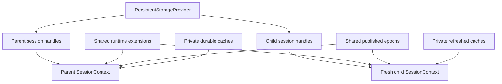
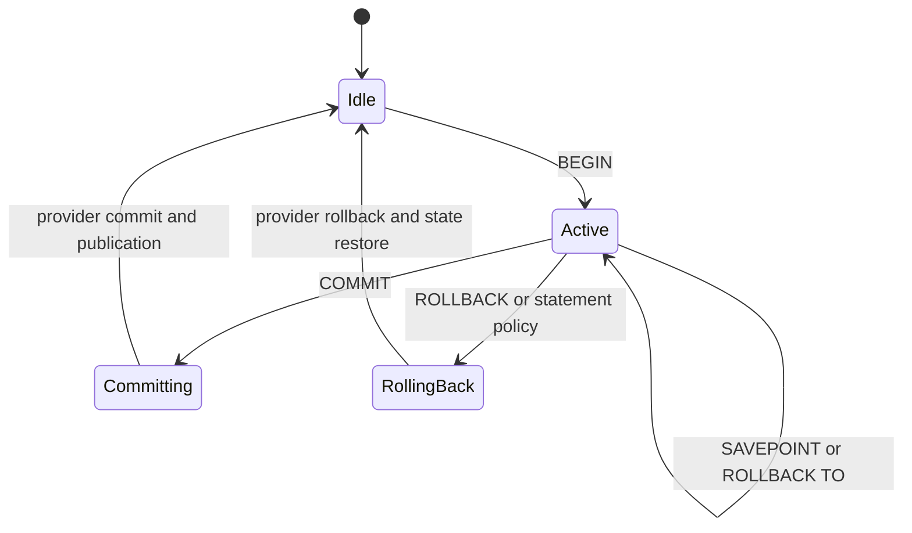

# State and Transactions

`Engine` coordinates six ownership domains. Correct session isolation and publication depend on keeping mutable state in its designated domain.

## Ownership domains

| Domain | Owns | Sharing rule |
| --- | --- | --- |
| `StorageContext` | Session-bound table handles, catalog and backend facades, provider factory | Rebuilt per logical session; provider is a shared factory |
| `DurableCatalogState` | Graph, model, scoring, view, schema, sequence, analyzer, FDW, index, and SQL-routine caches | Private per session and synchronized by epochs |
| `SessionContext` | Search path, variables, PRNG, sequence `currval`, prepared plans, statement cache, and transaction stack | Never shared between sessions |
| `RuntimeExtensions` | Runtime callbacks and in-memory FDW rows | Deliberately shared by derived sessions |
| `EpochCoordinator` | Published and observed generations, dirty bits, and refresh serialization | Published counters shared; observations local |
| `QueryRuntime` | Statement gate, cancellation, notices, and routine-depth policy | Private per session |

The detailed normative record is [Engine state ownership](../../design/engine-state-ownership.md).

## Session derivation

`new_session` asks the provider for catalog and data handles bound to a new transaction context. SQLite binds another managed connection; redb binds independent read or write transaction state over the shared database. The child creates fresh session and query runtime state, shares runtime extensions and published epoch counters, and restores its own durable caches.

## Statement boundary

The re-entrant statement gate serializes unsafe mutation within one logical session and protects multi-registry snapshots. Public operations that access transactional state enter this boundary unless their implementation documents a safe exception.

Public methods do not return lock guards. Storage I/O occurs while building candidate state, and the in-memory registry is updated only after persistence succeeds.

## Transaction lifecycle

An implicit statement transaction performs the same candidate, persistence, and publication ordering within one statement. An explicit transaction retains staged state across statements until commit or rollback.

`Engine::transaction` catches both returned errors and panics, rolls back, and then propagates the failure. `sql_batch` commits its complete statement list or rolls the list back.

## Snapshot and restore

Transactional session fields live behind one `SessionContext.state` lock, so a snapshot cannot combine an old search path with a new prepared cache, PRNG state, or sequence map.

Memory transactions snapshot durable registries through one `DurableCatalogState` method and restore them through its matching method. Those methods define the canonical registry lock order. Adding a registry requires updating both directions and the lock-order contract.

Runtime extension registrations are outside SQL catalog rollback by design. In-memory FDW row data is the exception with an explicit transaction snapshot because rows are mutable query-visible data.

## Savepoints

A savepoint captures provider and transaction-owned in-memory state at an inner boundary. `ROLLBACK TO` restores that state while preserving the outer transaction. `RELEASE` discards the marker. Every new mutable subsystem participating in SQL must define how it snapshots or stages across savepoints.

## Epoch coordination

Each epoch channel keeps its published generation, local observation, dirty flag, and refresh mutex together. Sibling sessions share published counters but not their local observations. `share_published_from` resets child observations before first synchronization.

A backend committed-change version detects commits made outside the in-process session family. Before using a private durable cache, a session compares versions and refreshes under the channel mutex when required.

Epochs are invalidation signals, not data. A refresh still reads and validates authoritative provider state.

## Cache publication rules

- Persist and validate a candidate before inserting it into a published registry.
- Advance the relevant generation only after successful commit.
- On rollback, restore local registries and mark or synchronize affected caches.
- Never clear an error by returning an empty cache result.
- Statement and prepared-plan caches must include every schema, routine, analyzer, index, model, and parameter dependency that can change execution.

## Locking rules

Avoid holding a registry lock across provider I/O, callback execution, or another subsystem's unbounded work. Prepare data outside the lock, acquire locks in the documented canonical order, publish quickly, and release before calling external code.

One logical operation that needs several registries should use the domain snapshot or publication method rather than acquiring individual locks in an ad hoc order.

## Cancellation and notices

Cancellation tokens and SQL notices belong to `QueryRuntime`, so one session does not cancel or drain another session's work. Cancellation is cooperative and is checked at execution boundaries. Resetting the token is explicit before later work proceeds.

## Adding mutable state

Every new mutable field must answer:

1. Which of the six domains owns it?
2. Is it session-local, shared runtime state, or durable cached state?
3. How is it created for `new_session`?
4. How does it behave in implicit transactions, explicit transactions, and savepoints?
5. What is the persistence-before-publication order?
6. Which epoch invalidates it, including external commits?
7. Which lock order and statement gate protect it?
8. Which failure, rollback, reopen, and concurrency tests prove the contract?
