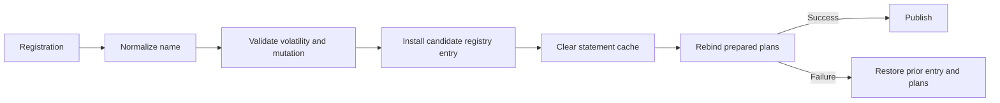

# Extension Points

UQA Engine extends through runtime SQL functions, foreign data handlers, model specifications, fluent query construction, protocol codecs, and language bindings. Extensions attach at explicit boundaries instead of modifying the SQL parser for every backend.

## Runtime SQL functions

The engine registries accept scalar, table, and aggregate implementations:

| Trait | Execution role |
| --- | --- |
| `SQLScalarFunction` | Receives `&[Value]` and returns one `Value` or `SQLError` |
| `SQLTableFunction` | Returns a table result or pull-based `SQLTableFunctionStream` |
| `SQLAggregateFunction` | Creates one `SQLAggregateState` per group |
| `SQLAggregateState` | Observes argument rows and returns a final value |

The `register_*_function_with_options` methods attach volatility and mutation properties. The default is `VOLATILE` and may mutate, which prevents unsafe optimizer assumptions.

Aggregate registration can change whether an expression is projection or grouping, so it necessarily invalidates structural plans. Registration failure restores the prior entry and attempts to restore prepared plans before returning an error.

## Function safety

An immutable function depends only on arguments. A stable function may observe statement context but remains stable during that statement. A volatile function may change per call. Any callback that may mutate engine-visible state must be volatile.

Callbacks are shared by derived sessions and are not stored in the durable catalog. Register them before creating worker sessions or accepting queries. Do not hold engine registry locks while invoking callback code.

Host-language callbacks need a reverse call boundary in addition to the forward method dispatch used by a generated binding. Node.js must move callback execution from an engine worker back to the owning JavaScript thread, while browser WASM must re-enter JavaScript through Emscripten and retain callback and aggregate-state identities for the full registry lifetime. Without those lifecycle-safe bridges, registration would violate runtime thread ownership or leave dangling callback state, so forward binding generation alone cannot expose UDF callbacks correctly.

Node.js owns a strong function reference for same-thread execution and a weak thread-safe function bridge for asynchronous SQL workers. A worker sends converted arguments to the owning JavaScript thread, waits for the synchronous result, and converts thrown errors into SQL errors. The package wrapper rejects `Engine` method re-entry while a callback is active.

Browser WASM assigns numeric callback and aggregate-state identifiers in JavaScript. Emscripten imports perform synchronous reverse dispatch across a JSON value bridge, and aggregate state is released after finish, query failure, or engine-group teardown. Derived sessions retain the shared callback group until its last engine closes, and the wrapper rejects `Engine` method re-entry during reverse dispatch.

Streaming table functions can yield a late error after rows. The physical pipeline propagates that error and does not convert it into an apparently complete truncated relation.

## SQL and PL/pgSQL routines

Durable SQL routines are compiled by `uqa-sql` and owned by the engine catalog. Their source, signature, volatility, language, defaults, return shape, and compiled plan identity survive reopen. They are distinct from runtime host-language callbacks.

Routine depth is bounded in `QueryRuntime`. Dynamic SQL re-enters normal parse, plan, transaction, and error boundaries.

## Foreign data wrappers

`uqa-fdw` defines foreign servers, foreign tables, projection, predicates, limit pushdown, and handler contracts. Concrete handlers are:

- In-memory relations
- DuckDB databases, expressions, and file sources
- Arrow IPC files and streams

The SQL compiler owns generic `CREATE SERVER` and `CREATE FOREIGN TABLE` syntax but does not depend on DuckDB or Arrow. `uqa-engine` resolves a server type to a handler at the extension boundary.

A handler must validate options, report unsupported pushdown, preserve row and type errors, and avoid claiming a predicate was pushed when it remains required as an engine residual.

## QueryBuilder

`uqa-api::QueryBuilder` is a fluent client layer over engine SQL and retrieval primitives. It does not define a second planner. Builder output enters the same `Engine::sql`, columnar, Arrow, or Parquet execution boundaries.

New builder methods should compose existing engine syntax or typed operations and include exact SQL-generation tests. Raw expression hooks remain trust boundaries.

## Models

`uqa-ml` owns serializable model specifications, CPU inference, and analytical training. Its current `mlx` feature is an experimental direct-crate probe, not an engine-selected or packaged runtime; the replacement model, runtime, isolation, and distribution contracts are tracked in the [MLX runtime support plan](../../plans/0004-mlx-runtime-support.md). Model catalog records are durable, while backend process objects and runtime resources must remain process-local and reconstructible.

The current bare `DeepModel` JSON is a legacy unversioned format. A replacement or additional model kind must version input schema, layer specification, parameter encoding, normalization, precision, output semantics, and backend requirements, and loading must validate all of them before publication.

## PostgreSQL wire codec

`uqa-pg-wire` decodes frontend and encodes backend PostgreSQL v3 messages. Its shared format-code resolver expands extended-query and function-call zero, one, or one-per-value text/binary formats; its authentication exchange decodes the context-dependent password, MD5, GSS, SSPI, and SASL response shapes while enforcing message order; and its cancellation-key API preserves opaque downstream secrets through bounded middleware prefixes. It deliberately does not own sockets, TLS, credential verification or storage, scheduling, SQL planning, transaction policy, pooling, or process recovery. An embedding server maps protocol messages to independent engine sessions and closes malformed peers.

## Language bindings

Python, Node.js, and Emscripten WASM wrap the engine rather than reimplement SQL semantics. Binding conversion code owns language-native values, errors, async scheduling, and lifecycle.

| Binding | Special boundary |
| --- | --- |
| Python | pyo3 value conversion, interpreter lock release, and Python callbacks |
| Node.js | Node-API promises, synchronous variants, buffers, typed arrays, cancellation, and thread-safe JavaScript callback dispatch |
| WASM | Emscripten request and reverse-callback dispatch, browser async lifecycle, callback-state ownership, and IndexedDB synchronization |

When adding an engine method, decide explicitly whether each binding can support its storage, threading, native-library, callback, and security requirements. Absence from a binding should be deliberate and documented.

## Adding an extension

1. Put syntax-only behavior in `uqa-sql` and concrete execution behind an owning trait or engine boundary.
2. Define input and output carriers, error behavior, and type conversion.
3. Declare transaction class, volatility, mutation, and session sharing.
4. Define persistence and reopen behavior, or state that the extension is runtime-only.
5. Define cache dependencies and epoch invalidation.
6. Add unit tests for the implementation and engine integration tests for registration, execution, failure, rollback, and rebind.
7. Add binding and type-declaration coverage where the capability is exposed.
8. Update the workspace dependency policy if a runtime dependency edge changes.

## Source entry points

| Area | Path |
| --- | --- |
| Function traits | [`crates/uqa-engine/src/functions.rs`](../../../crates/uqa-engine/src/functions.rs) |
| Function registry | [`crates/uqa-engine/src/engine_sql_registry.rs`](../../../crates/uqa-engine/src/engine_sql_registry.rs) |
| FDW contracts | [`crates/uqa-fdw/src/lib.rs`](../../../crates/uqa-fdw/src/lib.rs) |
| QueryBuilder | [`crates/uqa-api/src/query_builder.rs`](../../../crates/uqa-api/src/query_builder.rs) |
| ML runtime | [`crates/uqa-ml/src/lib.rs`](../../../crates/uqa-ml/src/lib.rs) |
| Wire codec | [`crates/uqa-pg-wire/src/lib.rs`](../../../crates/uqa-pg-wire/src/lib.rs) |
