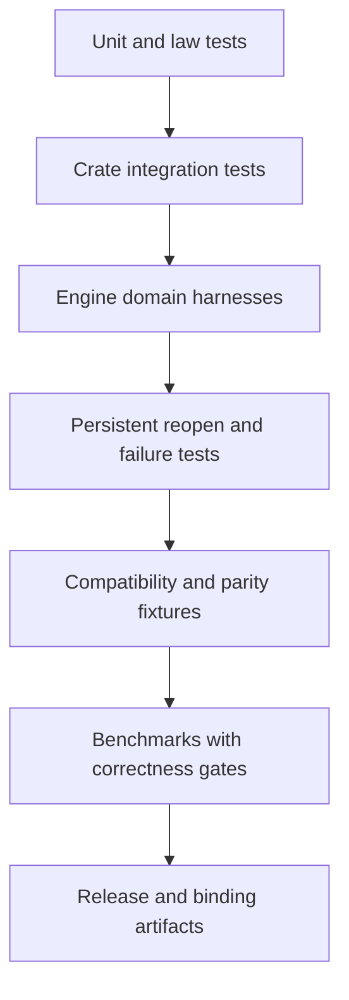

# Verification and Evidence

UQA Engine uses layered verification because algebra, SQL compatibility, storage atomicity, retrieval exactness, graph semantics, bindings, and performance have different oracles. A green unit test in one layer does not replace end-to-end evidence in another.

## Verification layers



## Test taxonomy

| Evidence | Examples |
| --- | --- |
| Algebraic laws | `uqa-core` document and posting algebra, graph algebra, RPQ algebra |
| Property and differential tests | WAND exactness against exhaustive scoring, join correctness, parser fuzz-style tests |
| SQL domain tests | DDL, DML, CTE, joins, windows, JSON, temporal, routines, retrieval, graph SQL |
| Storage tests | Catalog round trips, document stores, B-tree indexes, clustered postings, SQLite and redb parity |
| Atomicity tests | Catalog, document, schema, graph, index, callback, transaction, and savepoint failure paths |
| Reopen tests | SQLite DML, vector indexes, graph path indexes, analyzers, scoring parameters, routines |
| Compatibility fixtures | PostgreSQL AGE shapes, TPC-H-derived PostgreSQL 18 results, SQL golden files |
| Binding tests | CLI integration and parity, Python, Node.js, and WASM package checks in their build workflows |

## Standard workspace gates

```sh
cargo fmt --all -- --check
cargo check --workspace --all-targets --locked
cargo clippy --workspace --all-targets --locked -- -D warnings
cargo test --workspace --all-targets --locked
```

The workspace declares `unsafe_code = "deny"` and `unused_must_use = "deny"`. Clippy enables `all` and `pedantic` with an explicit small allowlist in the root manifest.

## Focused tests

Integration domains can be selected by test harness and module path:

```sh
cargo test -p uqa-engine --test integration engine_queries::sql_joins::
cargo test -p uqa-engine --test integration sql_tpch::
cargo test -p uqa-scoring --test integration wand_exactness::
cargo test -p uqa-graph --test integration rpq::
cargo test -p uqa-sql --test integration parser_fuzz::
```

Choose the narrow command during iteration, then run every affected crate and cross-crate engine path. A storage or transaction change requires memory and persistent coverage plus close and reopen.

## Architecture and repository policies

```sh
python3 scripts/check-workspace-dependencies.py
python3 scripts/check-integration-test-harnesses.py
python3 scripts/check-benchmark-coverage.py
bash scripts/check-rust-file-headers.sh
bash scripts/check-rust-file-lines.sh
bash scripts/check-public-repository-hygiene.sh
```

The dependency checker enforces crate layering. The harness checker prevents uncontrolled integration-test process growth. Benchmark coverage ensures workload entry points and semantic evidence remain represented. Header, line, and hygiene scripts enforce repository publication rules.

## Exactness oracles

WAND and Block-Max WAND output is compared with exhaustive BM25 over the same postings and parameters. Approximate vector indexes are compared with brute-force cosine top-K. Join algorithms are compared with a simpler semantic path or property-generated expected result. Graph codec round trips compare complete payload, not only support identities.

An optimization may reduce work only after its result is compared with the exact oracle across ties, duplicates, NULLs, errors, and parameter boundaries.

## Compatibility evidence

The TPC-H-derived fixture runs all 22 queries and compares exact columns, row order, NULLs, text bytes, and type-aware canonical numeric values with checked-in PostgreSQL 18.4 output:

```sh
cargo test -p uqa-engine --test integration sql_tpch::
```

The live compatibility runner validates the manifest and executes every side-effect-free probe against PostgreSQL 18.4 and the release `usql` binary. At this revision `probes.sql` contains 793 probes; result rows must match after the documented normalization, and rejected statements must have the same SQLSTATE:

```sh
cargo build --release -p uqa-cli
python3 tests/parity/pg18/run_diff.py --validate-manifest
python3 tests/parity/pg18/run_diff.py
```

Stateful compatibility suites keep one PostgreSQL schema while reopening the UQA database between cases. They cover 129 routine cases, 162 constraint cases, 49 type-and-temporal cases, 132 trigger cases, and 177 rewrite-rule cases:

```sh
python3 tests/parity/pg18/run_routines_stateful.py
python3 tests/parity/pg18/run_routines_stateful.py --suite constraints
python3 tests/parity/pg18/run_routines_stateful.py --suite type-temporal
python3 tests/parity/pg18/run_routines_stateful.py --suite triggers
python3 tests/parity/pg18/run_routines_stateful.py --suite rules
```

Run the live TPC-H and driver gates when query output or PostgreSQL-facing I/O changes:

```sh
python3 scripts/run-tpch-pg18.py --iterations 3
bash tests/parity/pg18/clients/run.sh
```

Graph compatibility tests exercise AGE-shaped `cypher` calls and `agtype` behavior. SQL golden fixtures cover deterministic engine output. The [parity design](../../design/parity.md) records fixture provenance and update rules.

## Benchmarks

Benchmarks are performance evidence only when they declare data, warmup, sample count, measured boundary, build profile, executable provenance, correctness gates, and limitations.

Useful focused commands include:

```sh
cargo bench -p uqa-engine --bench text_top_k --locked -- --warm-up-time 2 --measurement-time 5 --sample-size 30 --noplot
bash scripts/run-vector-search-benchmark.sh
bash scripts/run-beir-benchmark.sh
python3 scripts/run-analytical-regression.py <base-commit>
```

Benchmark results are same-machine regression evidence unless independently reproduced. Cross-engine ratios are advisory and require matching semantics and measured boundaries. See the [performance design](../../design/performance.md).

## Failure testing

Inject failure before persistence, during provider write, during callback execution, during spill iteration, during commit, and during reopen migration where the subsystem permits it. Assert the original durable and visible state remains intact and that the error reaches the caller.

A failure test must verify absence of partial rows, indexes, graph objects, models, registry entries, or epoch publication. Merely checking that an error was returned is insufficient.

## Documentation verification

Manual changes should check:

- Every relative link resolves.
- Every new document is ASCII-only.
- Paragraphs are stored on one physical line, excluding structural Markdown, tables, code, Mermaid, and LaTeX blocks.
- Mermaid fences are balanced and diagrams use valid identifiers.
- SQL and API examples match current tests or compile in a focused fixture.
- Compatibility pages list unsupported shapes discovered while documenting the implementation.

## Change-specific minimums

| Change | Required evidence |
| --- | --- |
| Carrier or optimizer law | Unit law test, counterexample cases, engine integration, exact oracle |
| SQL syntax | Compiler success and rejection tests, engine result test, compatibility update |
| Storage format | Migration, failure atomicity, reopen, provider parity, old-format fixture |
| Transactional state | Implicit, explicit, savepoint, rollback, sibling session, external commit |
| Retrieval scoring | Exact fixture, calibration or relevance evidence, physical profile |
| Approximate vector index | Exact recall, mutation, reopen, parameter boundaries |
| Graph behavior | Parser or algebra test, execution result, SQL adapter, persistence if durable |
| Binding surface | Native engine test, conversion and error test, declaration or stub update |
| Performance claim | Reproducible benchmark with semantic gate and provenance |

## Review rule

Correctness claims belong to tests and explicit invariants. Performance claims belong to reproducible evidence. Neither should be inferred from code shape or a single successful example.
