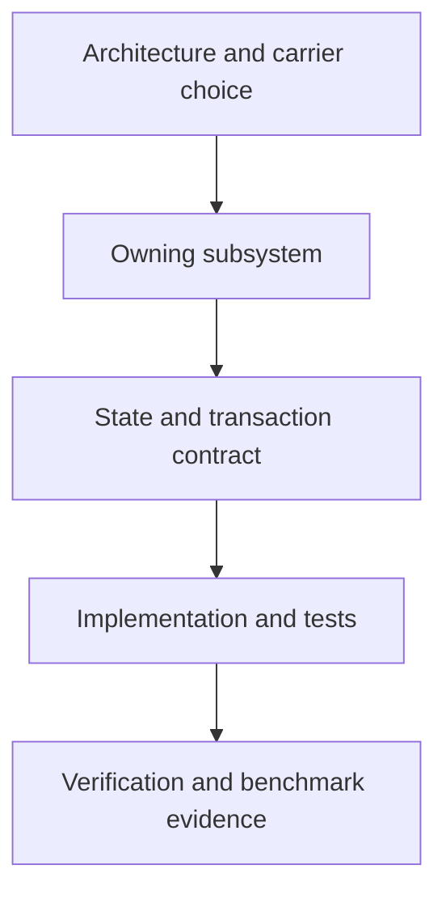

# Internal Technical Manual

This manual explains implementation ownership, data carriers, state boundaries, and correctness invariants for contributors. It complements the detailed design records under `docs/design` and points to current source entry points.

| Document | Main question |
| --- | --- |
| [Architecture](01-architecture.md) | Which crate owns each concept, and which carriers cross boundaries? |
| [Planning and execution](02-planning-and-execution.md) | How does SQL become a physical row, retrieval, or command plan? |
| [Storage](03-storage.md) | How are durable catalogs, rows, postings, vectors, and migrations represented? |
| [Analyzer pipeline](04-analyzer-pipeline.md) | How are analysis stages validated, bound, persisted, executed, and restored? |
| [Search and ranking](05-search-and-ranking.md) | How do analysis, scoring, exact top-K, vector indexes, calibration, and fusion work? |
| [Graph runtime](06-graph-runtime.md) | How do named graphs, Cypher, RPQ, graph carriers, and SQL composition work? |
| [State and transactions](07-state-and-transactions.md) | What is session-local, shared, transactional, cached, and invalidated? |
| [Extension points](08-extension-points.md) | How do UDFs, FDWs, models, protocol adapters, and bindings attach? |
| [Verification](09-verification.md) | Which tests, policies, benchmarks, and evidence protect each contract? |

## Contributor reading order

Before changing a subsystem, identify its owner crate, executable representation, transaction boundary, cache invalidation rule, failure behavior, and test oracle. A performance optimization is acceptable only after those semantic contracts remain proved.
