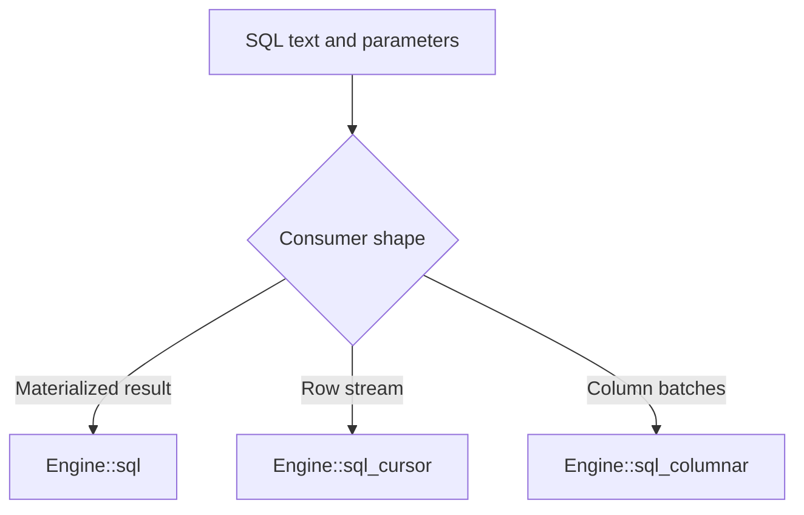

# Rust Engine API

The `uqa` facade is the primary application dependency and re-exports the `uqa-engine` crate documented here. `uqa-engine` owns durable storage, session-local SQL state, runtime extensions, epochs, and query execution and remains available as a direct dependency.

## Construct an engine

| API | Result |
| --- | --- |
| `Engine::new()` | In-memory engine |
| `Engine::open(path)` | Default persistent SQLite engine |
| `Engine::detect_database_file(path)` | File format detection without opening the engine |
| `Engine::open_auto(path, key)` | Detect plain, encrypted, compressed, or compressed-encrypted SQLite formats |
| `Engine::open_encrypted(path, key)` | SQLCipher-backed persistent engine |
| `Engine::open_compressed(path, options)` | Compressed SQLite container |
| `Engine::open_compressed_encrypted(path, key, options)` | Compressed and encrypted container |
| `Engine::open_compressed_encrypted_with_anchor(...)` | Compressed and encrypted container with a trusted rollback anchor |
| `Engine::from_persistent_provider(provider)` | Engine over a `PersistentStorageProvider`, including redb |

Use `Engine::close()` when the application needs an explicit close boundary. Normal Rust ownership still closes resources when the engine is dropped.

## Execute SQL

The central method is:

```rust
pub fn sql(
    &self,
    query: &str,
    params: &[SQLParam],
) -> Result<SQLResult, SQLError>
```

`SQLParam` accepts scalar values and also has explicit vector and tensor constructors. Positional placeholders are `$1`, `$2`, and so on.

```rust
use uqa_core::Value;
use uqa_engine::{Engine, SQLParam};

let engine = Engine::new();
engine.sql(
    "CREATE TABLE items (id INTEGER PRIMARY KEY, embedding VECTOR(3))",
    &[],
)?;
engine.sql(
    "INSERT INTO items (id, embedding) VALUES ($1, $2)",
    &[
        SQLParam::scalar(Value::Int(1)),
        SQLParam::vector(vec![1.0, 0.0, 0.0]),
    ],
)?;
# Ok::<(), Box<dyn std::error::Error>>(())
```

`SQLResult` contains:

- `columns`: projected column labels in order
- `column_types`: SQL types in projection order, including empty results
- `rows`: compatibility rows represented as `BTreeMap<String, Value>`
- `value_at(row, column)`: positional access that distinguishes repeated labels
- `affected_rows`: the DML row count
- `command_tag`: optional PostgreSQL command completion text, such as `SELECT 2`, `INSERT 0 1`, or `CREATE TABLE`
- `kind`: `SQLResultKind::Command` or `Rows`, distinguishing commands from zero-column queries; clients without descriptor information use `Unknown`

When projected labels repeat, `SQLResult` retains the distinct final values in a positional carrier while keeping `rows` for existing named-map callers. Use `value_at`, a cursor, or the columnar path to address repeated labels by position.

`REGTYPE` results, including `pg_typeof`, use `Value::Int` for the catalog OID. Request `pg_typeof(expression)::text` for the visible type name, or use `sql::format_postgres_text(value, column_type, Some(&engine))` with the result's declared type. `sql::postgres_result_type` returns the PostgreSQL type OID, size, and modifier; scalar domain results expose their base type in a PostgreSQL client descriptor.

### Simple Query messages

`Engine::sql_simple_query(query, params, consume)` accepts a SQL message containing zero or more statements and a `FnMut(&SQLResult) -> Result<(), SQLError>` callback. It parses the complete message before executing any statement, then delivers results in statement order. An empty message delivers one empty result with no `command_tag`.

Statements outside explicit transaction blocks share an implicit transaction segment. Explicit transaction commands control the segment boundaries. The final result is delivered after its implicit transaction commits, so a deferred constraint failure prevents that final callback. Earlier callbacks may already have observed results when a later statement fails; those earlier results do not establish that the segment committed. An execution error stops the remaining statements, and a callback error rolls back an implicit segment that is still open. A final callback runs after commit and cannot undo that commit.

```rust
let engine = uqa_engine::Engine::new();
let mut tags = Vec::new();
engine.sql_simple_query("SELECT 1; SELECT 2", &[], |result| {
    tags.push(result.command_tag.clone());
    Ok(())
})?;
assert_eq!(tags, [Some("SELECT 1".into()), Some("SELECT 1".into())]);
# Ok::<(), uqa_engine::SQLError>(())
```

## Stream results

`Engine::sql_cursor` accepts one read query and returns a row cursor. The engine uses bounded spill when needed, and the read snapshot is committed before the cursor is returned. This makes the cursor suitable for large results without holding an open storage transaction for the consumer lifetime.

`Engine::sql_columnar` consumes result batches through a callback. It is the preferred path for column-oriented consumers and export code.



## COPY streams

`Engine::copy_from(statement, reader)` consumes a `COPY relation [(column, ...)] FROM STDIN` text or CSV stream and returns the inserted row count. `Engine::copy_to(statement, writer)` emits `COPY relation [(column, ...)] TO STDOUT` or `COPY (query) TO STDOUT` and returns the emitted row count. COPY options are parsed with the PostgreSQL 18 grammar; the embedded stream endpoints implement text and CSV with `DELIMITER`, `NULL`, `HEADER`, `QUOTE`, `ESCAPE`, and UTF-8 `ENCODING`.

```rust
let engine = uqa_engine::Engine::new();
engine.sql(
    "CREATE TABLE events (id INTEGER, payload TEXT DEFAULT 'pending')",
    &[],
)?;
engine.copy_from(
    "COPY events (id) FROM STDIN",
    b"1\n2\n".as_slice(),
)?;
let mut output = Vec::new();
engine.copy_to(
    "COPY (SELECT id, payload FROM events ORDER BY id) TO STDOUT",
    &mut output,
)?;
assert_eq!(output, b"1\tpending\n2\tpending\n");
# Ok::<(), Box<dyn std::error::Error>>(())
```

`COPY FROM` uses the ordinary INSERT path as one statement: declarative partition parents route each row after defaults, identity allocation, and stored generation; a direct partition validates every ancestor bound; ordinary inheritance writes only the named relation; and any format, conversion, or constraint error publishes no rows. Direct `COPY relation TO` reads only the named physical relation and omits generated columns, so a partitioned parent raises `42809`; use `COPY (SELECT ... FROM parent) TO STDOUT` to include descendants or put `ONLY` inside that query to exclude them. A generated column named in a direct COPY column list is `42P10`, duplicate and missing names are `42701` and `42703`, malformed row widths are `22P04`, invalid text conversion uses the target type's PostgreSQL SQLSTATE, and a COPY failure aborts the current explicit transaction.

## Transactions and batches

The engine exposes explicit transaction primitives:

- `begin`, `commit`, and `rollback`
- `savepoint`, `release_savepoint`, and `rollback_to_savepoint`
- `transaction_failed` and `pending_transaction_completion` for failed or unresolved transaction state; `pending_commit` exposes only a physical write identity
- SQL forms such as `BEGIN`, `SAVEPOINT`, and `COMMIT`

`Engine::transaction` executes a Rust closure as one transaction. An error or panic from the closure rolls the transaction back; a successful closure attempts to commit it.

Development versioned provider sessions retain uncertain completion. A commit whose durable result cannot be confirmed returns SQLSTATE `08007` and leaves `Engine::pending_transaction_completion()` set to `TransactionOutcomeId::Records` for a physical publication or `TransactionOutcomeId::Serializable` for logical SSI completion without a write receipt. `pending_commit()` continues to expose only a physical write identity; its absence does not establish that logical completion finished. Ordinary SQL, nested BEGIN and savepoint commands are blocked until the caller resolves the attempt with `commit`/`COMMIT` or requests whole-transaction rollback. `transaction_failed()` is false for unresolved completion; check `pending_transaction_completion()` before resuming work. SQL statements, SQL cursors and the direct document, retrieval and graph queries described below admit their SERIALIZABLE participant at the first data snapshot through the common storage session. The [implementation plan](../../plans/0008-concurrent-storage-transactions.md) tracks remaining transaction and provider acceptance.

Repeating COMMIT resolves the same evaluated storage batch and does not rerun the Rust callback, deferred triggers, held-cursor materialization or temporary-table COMMIT actions. If rollback discovers a matching committed receipt, Engine finishes that commit's session publication and returns `25000` explaining that rollback could not undo it. If a later COMMIT confirms a recorded abort, Engine restores the rolled-back session state and returns `25000` instead of a successful COMMIT.

An unresolved result must not be treated as proof of rollback or a reason to replay application operations. Session receipt resolution does not provide crash-safe publication recovery or exactly-once acknowledgement after process loss.

The development transaction adapter preserves typed storage diagnostics: a rejected MVCC row or definition conflict reports `40001`, cancellation reports `57014` as `SQLError::Cancelled`, and memory exhaustion reports `53200`. Embedded SQL diagnostics, including constraint errors, retain their SQLSTATE; an unrelated provider error is not classified as a serialization failure. An indeterminate outer commit remains `08007` even when its underlying diagnostic describes a conflict. A rejected commit restores the session after storage rollback, preserves independently committed data, and does not replay application callbacks. These diagnostics do not enable the unfinished concurrent SQL transaction model.

An error or panic while applying a direct mutation or document read inside an explicit transaction uses the same abort boundary as SQL: private data, index changes and logical write intents roll back to the active user savepoint or transaction frame. `transaction_failed()` remains true until recovery. `ROLLBACK TO SAVEPOINT` restores the usable savepoint while preserving earlier writes; COMMIT of an unrecovered failed frame performs rollback. The original error or panic is preserved when cleanup succeeds, and a cleanup failure reports both causes. Existing read dependencies remain retained according to the isolation contract.

`get_document(table, doc_id)`, `table_doc_ids(table)` and `document_count(table)` use the active transaction's selected data view and retain an AccessShare relation lock until transaction completion. A persistent session without an explicit transaction opens and completes one implicit read transaction using its default isolation, read-only and deferrable settings. A direct read inside a SQL callback shares that statement's snapshot. SERIALIZABLE observes absent document IDs and empty scans/counts as well as returned data; concurrent changes can therefore cause commit to report `40001`. An unknown table reports `42P01`, a read in a failed transaction reports `25P02`, and cancellation of deferrable admission reports `57014`. For example, after `begin()`, calling `get_document("items", id)` and then `commit()` keeps the read and its retained lock in that transaction. Internal execution adapters retain their caller's existing scope and keep query reads separate from current-row mutation checks. `document_count` counts documents retained by the table's text index; a row without indexed text fields contributes no indexed document.

`has_table`, `table_columns`, `table_has_column`, `table_names`, `describe_table` and their `try_` aliases use the same first-query transaction boundary before metadata lookup. A first metadata query establishes the data snapshot used by subsequent REPEATABLE READ or SERIALIZABLE queries, including after savepoint undo. Implicit queries use the persistent session's defaults and complete before returning; nested callbacks retain their enclosing statement's view. Failed or unresolved transactions and cancelled admission retain their typed diagnostics through `StorageBackendError`. Metadata lookup preserves existing catalog visibility and does not manufacture a user-row read dependency. Internal execution and restoration adapters use their already selected scope.

Schema and namespace lookup/enumeration, current-schema resolution, index metadata, sequence listing/state snapshots, view lookup/enumeration, named and field analyzer lookup, `analyze_text`, foreign server/table lookup/enumeration, table constraint/default-expression queries, `load_model` and `deep_predict_features` enter this same boundary. Their `try_` aliases have the same transaction behavior. `SQLError` and `StorageBackendError` results retain typed transaction diagnostics; APIs returning `String` return the transaction diagnostic as text. Lookup or validation failure aborts the active transaction frame or savepoint, and unresolved completion rejects the query before catalog lookup. Backend-owned fixed readers keep their existing snapshot and completion owner.

`find_doc_id_by_field(table, field, value)` and `find_conflict(table, columns, values)` use the same transaction boundary, selected table view and retained AccessShare lock as document reads. Field lookup requires a stored field equal to the supplied value; conflict lookup treats a missing field as NULL and returns `None` for an empty or mismatched key. Those early results still honor transaction admission, failed-frame rejection and pending completion. Conflict lookup selects the integer primary-key slot, the first answerable column index or an evaluated scan. SERIALIZABLE records the chosen row or index key, observes candidate rows used to check additional fields, and observes the relation for scans, including absent results. Private row changes mask their original documents and supply replacement matches. Internal mutation checks retain their current document/index view and reuse the enclosing statement.

`column_stats`, `try_column_stats`, `fts_index_stats` and standalone `optimised_tree_for` also enter the selected transaction before lookup or planning, including cached statistics and predicates that produce no operator tree. Column-statistics refresh retains the existing `ANALYZE` maintenance, read-only and rollback behavior. Full-text statistics read the selected table/index data and retain its relation identity and lock; enumeration on an attached reader uses that reader's table inventory. Internal SQL statistics and planner workers reuse their enclosing statement without entering another public query boundary.

Public text, profiled text, KNN, vector similarity, model-calibrated vector and hybrid search use this same boundary before planning or accessing analyzers and indexes. Their table binding retains an identity-checked AccessShare lock. `bayesian_params_for`, `calibration_report`, `deep_predict` and public `EngineDriver::execute_node` also enter the selected transaction before reading their inputs. Queries that may persist automatic calibration own a writable rollback snapshot when necessary, including on memory engines. Read-only transactions estimate missing or stale automatic calibration from their selected corpus without reserving a parameter writer or publishing parameters; explicit parameter saves and learning still report `25006`. A later writable query estimates and persists parameters normally. A later query error rolls back any calibration publication, and parameter names retain the caller's original table spelling. Graph reads, graph/label/path-index lookup and listing, and `run_cypher` use the same session defaults and first-snapshot boundary. Errors returned by these operations abort an active frame or savepoint; owned implicit frames finish before results are returned. Nested calls retain their enclosing statement's view, and physical worker adapters use that existing scope.

`Engine::sql_batch` executes a slice of SQL statement and parameter pairs in one transaction. A statement failure rolls the batch back; an indeterminate commit follows the resolution contract above.

```rust
use uqa_core::Value;
use uqa_engine::SQLParam;

let first = [
    SQLParam::scalar(Value::Int(1)),
    SQLParam::scalar(Value::Int(100)),
];
let second = [
    SQLParam::scalar(Value::Int(2)),
    SQLParam::scalar(Value::Int(50)),
];
let statements = [
    ("INSERT INTO accounts (id, balance) VALUES ($1, $2)",
     &first[..]),
    ("INSERT INTO accounts (id, balance) VALUES ($1, $2)",
     &second[..]),
];
engine.sql_batch(&statements)?;
# Ok::<(), Box<dyn std::error::Error>>(())
```

Do not issue concurrent statements through the same session while an explicit transaction is active. Create independent sessions instead.

## Sessions

`Engine::new_session()` creates a new SQL session over the same persistent provider. Each session has independent transaction state, session variables, prepared statements, statement caches, and cancellation tokens. Durable rows, catalog objects, indexes, graph data, and runtime UDF registries are shared.

`Engine::new_session_for_user(user)` opens an independent session for a role authenticated by the embedding host. It verifies that the role exists, has `LOGIN`, and has database `CONNECT`, then sets both `session_user` and `current_user` to that role. The host owns credential verification and connection limits. The [PostgreSQL TCP server](11-postgresql-server.md) uses this entry point after its configured authentication policy accepts a connection.

Session creation requires a persistent backend that can return an independent, transaction-affine catalog/data pair. Engine retains an explicit provider or adapts the backend's session factory when constructed through `from_persistent_backends`.

When the parent has a stable committed catalog and no private transaction or temporary namespace, a new session shares immutable schema, constraint, and durable-registry allocations instead of reloading and decoding them. Each session retains its own mutable catalog owners and physical storage handles; a mutation detaches the affected catalog value. A parent with private state, a changed storage generation, or a provider without a usable commit monitor requires a load from the new session's committed storage view. Statement catalog snapshots also share these immutable values.

Persistent engines automatically maintain statistics in a separate database-level worker session; applications need not issue ANALYZE. The first collection runs automatically, subsequent refreshes become eligible after `50 + analyzed_row_count / 10` committed changes or 60 seconds with pending changes, and the worker checks approximately once per second. Updates are sampled from at most 4,096 hierarchy rows, project scalar columns, and do not hydrate opaque media/vector/JSON payloads. Existing statistics remain available until replacement. Pending changes survive reopen and follow transaction/savepoint rollback. `Engine::automatic_statistics_status()` reports worker activity, completed refreshes, and the last failure; failures retain pending work for retry. `Engine::column_stats(table)` returns current cached statistics, including sampled scalar statistics, and refreshes dirty statistics through the same transaction boundary as `ANALYZE`, including its read-only and rollback behavior. Explicit `ANALYZE` or `Engine::run_analyze` forces full collection regardless of cached statistics. Collected column statistics remain private until the transaction commits and revert on transaction or savepoint rollback, including in a read-only SQL transaction. Clean statistics are reused after reopen, and persistent SQL query planning never invokes this synchronous maintenance API. Memory-only engines retain automatic lazy collection without a persistent worker.

## Receive SQL notifications

Execute `LISTEN`, `UNLISTEN`, `NOTIFY`, and `pg_notify` through `Engine::sql`. `Engine::poll_sql_notifications()` imports committed messages without draining them, `Engine::wait_for_sql_notifications(timeout)` waits for availability, and `Engine::take_sql_notifications()` drains them as `SQLNotification { process_id, channel, payload }`, where `process_id` matches the sending session's `Engine::backend_process_id()` and SQL `pg_backend_pid()`. Sessions made with `new_session()` and independently opened engines share one bounded database-scoped queue while retaining independent subscriptions, cursors, and drained messages; on native file-backed databases the same queue also coordinates independent OS processes.

```rust
let directory = tempfile::tempdir()?;
let root = uqa_engine::Engine::open(&directory.path().join("notifications.db"))?;
let listener = root.new_session()?;
let sender = root.new_session()?;
listener.sql("LISTEN jobs", &[])?;
sender.sql("NOTIFY jobs, 'ready'", &[])?;
assert!(listener.wait_for_sql_notifications(std::time::Duration::from_secs(1))?);
let messages = listener.take_sql_notifications();
assert_eq!(messages[0].channel, "jobs");
assert_eq!(messages[0].payload, "ready");
assert_eq!(messages[0].process_id, sender.backend_process_id());
# Ok::<(), Box<dyn std::error::Error>>(())
```

Subscription changes and outgoing messages take effect at outer commit, rollback and savepoint rollback discard their transactional changes, and identical channel-and-payload pairs are delivered once per transaction. Polling, waiting, or draining while the listener has an open transaction returns no messages and leaves them queued until the transaction ends. SQL exposes committed channels through `pg_listening_channels()` and queue occupancy through `pg_notification_queue_usage()`. Native file-backed coordination uses an explicitly versioned sidecar for the queue, database-wide backend-process identifier allocation, and listener-liveness leases; opaque identities and targets without native process support remain process-local. An embedding server must drain messages and encode the existing `uqa-pg-wire::NotificationResponse` itself because the engine does not own its client connection.

`open_encrypted`, encrypted `open_auto`, and compressed-encrypted constructors protect notification payloads and channels in the sidecar with the same credential as the main database. SQLite provider and backend factories preserve that protection for independently opened engines and new sessions. An existing plaintext sidecar or a mismatched sidecar key causes open to fail; it is never silently overwritten or opened without encryption. Custom encrypted file providers must implement `auxiliary_encryption_key` on their provider and backend. See [auxiliary storage encryption](../internals/03-storage.md#encryption-and-compression) for ownership and upgrade boundaries.

## Document and retrieval APIs

The API also exposes typed operations that bypass SQL text:

- Table and field setup: `create_default_table`, `create_vector_field`
- Documents: `add_document`, `add_document_with_vectors`, `get_document`, `delete_document`, `document_count`
- Vectors: `add_vector`, `knn_search`, `vector_similarity_search`
- Text: `search`, `search_profiled`
- Hybrid: `hybrid_search` for exact single-prior log-odds fusion and `robust_hybrid_search` for explicitly requested positive-evidence pooling
- Calibration: Bayesian parameter fitting and calibration reports

SQL and typed operations use the same durable state and indexes. Applications can mix them, but a single transaction boundary should use one clear ownership path.

Direct document insertion, replacement, field updates and deletion register changed persistent row identities with the active SERIALIZABLE transaction, independently of text, value or vector index changes. Field updates, patches and deletion observe their selected persistent row before fetching it, including an absent row. An absent target registers a point read without registering a row write, so it participates in serialization conflicts even when no document changes. Statement and savepoint rollback discard write intents together with the private changes; read observations and dependencies already established with other transactions remain. Whole-transaction rollback releases that transaction's read observations too.

## Analyzer APIs

Persistent custom analyzers are managed with `register_named_analyzer`, `list_named_analyzers`, `set_table_field_analyzer`, `table_field_analyzer`, `get_table_analyzer`, and `drop_named_analyzer`. Compatibility aliases use the shorter create, set, and drop names. An index-time or both-phase assignment rebuilds current postings; a search-only assignment changes query analysis without a rebuild.

The `uqa-analysis` crate exposes `Analyzer`, `CharFilter`, `Tokenizer`, and `TokenFilter` for constructing and previewing pipelines directly. Its process-global registry is not a replacement for engine catalog persistence. See [Text analyzer pipelines](06-text-analyzers.md) for JSON tags, component behavior, phase resolution, SQL examples, synonyms, and failure rules.

## Graph APIs

Named graph methods cover graph creation, deletion, listing, vertex and edge mutation, Cypher execution, traversal, and path indexes. SQL can address the same graph state through `cypher`, `rpq`, and `graph_*` functions. See [Graphs](07-graphs.md).

## Runtime extensions

Register scalar, table, and aggregate functions with:

- `register_scalar_function` and `register_scalar_function_with_options`
- `register_table_function` and `register_table_function_with_options`
- `register_aggregate_function` and `register_aggregate_function_with_options`

Default options are conservative: a function is `VOLATILE` and may mutate. Use `SQLFunctionOptions::read_only(volatility)` only when the callback is truly read-only. A callback that mutates state must remain `VOLATILE`.

Runtime callbacks are not serialized to persistent storage. Register them each time the process constructs an engine. New sessions share the runtime registry of their parent engine.

## Cancellation

Each session has its own cancellation token. `cancel()` requests cancellation, `is_cancelled()` observes it, and the reset API clears the request before later work. Long-running execution paths poll the token at safe boundaries.

Cancellation is cooperative. Handle the returned error, inspect `transaction_failed()` and recover an aborted explicit transaction through rollback or an available savepoint before continuing. Reset the session cancellation token before issuing subsequent work.

## QueryBuilder

The `uqa-api` crate provides `QueryBuilder` for fluent construction of select, filter, retrieval, graph, aggregate, facet, fusion, and model expressions. Use it when programmatic composition is clearer than assembling SQL text. Always bind user data or use builder methods that quote values; do not interpolate untrusted strings into raw fragments.

See [Bindings and extensions](08-bindings-and-extensions.md) for a broader API matrix.
