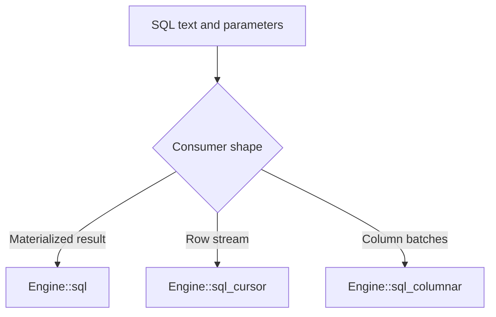

# Rust Engine API

The `uqa` facade is the primary application dependency and re-exports the `uqa-engine` crate documented here. `uqa-engine` owns durable storage, session-local SQL state, runtime extensions, epochs, and query execution and remains available as a direct dependency.

## Construct an engine

| API | Result |
| --- | --- |
| `Engine::new()` | In-memory engine |
| `Engine::open(path)` | Default persistent SQLite engine |
| `Engine::detect_database_file(path)` | File format detection without opening the engine |
| `Engine::open_auto(path, key)` | Detect plain, encrypted, compressed, or compressed-encrypted SQLite formats |
| `Engine::open_encrypted(path, key)` | SQLCipher-backed persistent engine |
| `Engine::open_compressed(path, options)` | Compressed SQLite container |
| `Engine::open_compressed_encrypted(path, key, options)` | Compressed and encrypted container |
| `Engine::open_compressed_encrypted_with_anchor(...)` | Compressed and encrypted container with a trusted rollback anchor |
| `Engine::from_persistent_provider(provider)` | Engine over a `PersistentStorageProvider`, including redb |

Use `Engine::close()` when the application needs an explicit close boundary. Normal Rust ownership still closes resources when the engine is dropped.

## Execute SQL

The central method is:

```rust
pub fn sql(
    &self,
    query: &str,
    params: &[SQLParam],
) -> Result<SQLResult, SQLError>
```

`SQLParam` accepts scalar values and also has explicit vector and tensor constructors. Positional placeholders are `$1`, `$2`, and so on.

```rust
use uqa_core::Value;
use uqa_engine::{Engine, SQLParam};

let engine = Engine::new();
engine.sql(
    "CREATE TABLE items (id INTEGER PRIMARY KEY, embedding VECTOR(3))",
    &[],
)?;
engine.sql(
    "INSERT INTO items (id, embedding) VALUES ($1, $2)",
    &[
        SQLParam::scalar(Value::Int(1)),
        SQLParam::vector(vec![1.0, 0.0, 0.0]),
    ],
)?;
# Ok::<(), Box<dyn std::error::Error>>(())
```

`SQLResult` contains:

- `columns`: projected column labels in order
- `rows`: compatibility rows represented as `BTreeMap<String, Value>`
- `value_at(row, column)`: positional access that distinguishes repeated labels
- `affected_rows`: the DML row count

When projected labels repeat, `SQLResult` retains the distinct final values in a positional carrier while keeping `rows` for existing named-map callers. Use `value_at`, a cursor, or the columnar path to address repeated labels by position.

## Stream results

`Engine::sql_cursor` accepts one read query and returns a row cursor. The engine uses bounded spill when needed, and the read snapshot is committed before the cursor is returned. This makes the cursor suitable for large results without holding an open storage transaction for the consumer lifetime.

`Engine::sql_columnar` consumes result batches through a callback. It is the preferred path for column-oriented consumers and export code.



## COPY streams

`Engine::copy_from(statement, reader)` consumes a `COPY relation [(column, ...)] FROM STDIN` text or CSV stream and returns the inserted row count. `Engine::copy_to(statement, writer)` emits `COPY relation [(column, ...)] TO STDOUT` or `COPY (query) TO STDOUT` and returns the emitted row count. COPY options are parsed with the PostgreSQL 18 grammar; the embedded stream endpoints implement text and CSV with `DELIMITER`, `NULL`, `HEADER`, `QUOTE`, `ESCAPE`, and UTF-8 `ENCODING`.

```rust
let engine = uqa_engine::Engine::new();
engine.sql(
    "CREATE TABLE events (id INTEGER, payload TEXT DEFAULT 'pending')",
    &[],
)?;
engine.copy_from(
    "COPY events (id) FROM STDIN",
    b"1\n2\n".as_slice(),
)?;
let mut output = Vec::new();
engine.copy_to(
    "COPY (SELECT id, payload FROM events ORDER BY id) TO STDOUT",
    &mut output,
)?;
assert_eq!(output, b"1\tpending\n2\tpending\n");
# Ok::<(), Box<dyn std::error::Error>>(())
```

`COPY FROM` uses the ordinary INSERT path as one statement: declarative partition parents route each row after defaults, identity allocation, and stored generation; a direct partition validates every ancestor bound; ordinary inheritance writes only the named relation; and any format, conversion, or constraint error publishes no rows. Direct `COPY relation TO` reads only the named physical relation and omits generated columns, so a partitioned parent raises `42809`; use `COPY (SELECT ... FROM parent) TO STDOUT` to include descendants or put `ONLY` inside that query to exclude them. A generated column named in a direct COPY column list is `42P10`, duplicate and missing names are `42701` and `42703`, malformed row widths are `22P04`, invalid text conversion uses the target type's PostgreSQL SQLSTATE, and a COPY failure aborts the current explicit transaction.

## Transactions and batches

The engine exposes explicit transaction primitives:

- `begin`, `commit`, and `rollback`
- `savepoint`, `release_savepoint`, and `rollback_to_savepoint`
- SQL forms such as `BEGIN`, `SAVEPOINT`, and `COMMIT`

`Engine::transaction` executes a Rust closure as one transaction. An error or a panic rolls the transaction back; a successful closure commits it.

`Engine::sql_batch` executes a slice of SQL statement and parameter pairs in one transaction. The entire batch rolls back when any statement fails.

```rust
use uqa_core::Value;
use uqa_engine::SQLParam;

let first = [
    SQLParam::scalar(Value::Int(1)),
    SQLParam::scalar(Value::Int(100)),
];
let second = [
    SQLParam::scalar(Value::Int(2)),
    SQLParam::scalar(Value::Int(50)),
];
let statements = [
    ("INSERT INTO accounts (id, balance) VALUES ($1, $2)",
     &first[..]),
    ("INSERT INTO accounts (id, balance) VALUES ($1, $2)",
     &second[..]),
];
engine.sql_batch(&statements)?;
# Ok::<(), Box<dyn std::error::Error>>(())
```

Do not issue concurrent statements through the same session while an explicit transaction is active. Create independent sessions instead.

## Sessions

`Engine::new_session()` creates a new SQL session over the same persistent provider. Each session has independent transaction state, session variables, prepared statements, statement caches, and cancellation tokens. Durable rows, catalog objects, indexes, graph data, and runtime UDF registries are shared.

Session creation is available for engines backed by one persistent provider. An engine assembled from separate persistent backends does not provide the single provider needed to create a new session.

## Receive SQL notifications

Execute `LISTEN`, `UNLISTEN`, `NOTIFY`, and `pg_notify` through `Engine::sql`. `Engine::take_sql_notifications()` drains the current session's committed messages as `SQLNotification { process_id, channel, payload }`, where `process_id` matches the sending session's `Engine::backend_process_id()` and SQL `pg_backend_pid()`. Sessions made with `new_session()` and independently opened engines over the same durable database share one bounded notification queue inside the process, while their subscriptions, queue cursors, and drained messages remain independent.

```rust
let directory = tempfile::tempdir()?;
let root = uqa_engine::Engine::open(&directory.path().join("notifications.db"))?;
let listener = root.new_session()?;
let sender = root.new_session()?;
listener.sql("LISTEN jobs", &[])?;
sender.sql("NOTIFY jobs, 'ready'", &[])?;
let messages = listener.take_sql_notifications();
assert_eq!(messages[0].channel, "jobs");
assert_eq!(messages[0].payload, "ready");
assert_eq!(messages[0].process_id, sender.backend_process_id());
# Ok::<(), Box<dyn std::error::Error>>(())
```

Subscription changes and outgoing messages take effect at outer commit, rollback and savepoint rollback discard their transactional changes, and identical channel-and-payload pairs are delivered once per transaction. A receive drain attempted while the listener has an open transaction returns no messages and leaves them queued until the transaction ends. SQL exposes committed channels through `pg_listening_channels()` and queue occupancy through `pg_notification_queue_usage()`. Cross-process delivery and live server forwarding remain open compatibility work.

## Document and retrieval APIs

The API also exposes typed operations that bypass SQL text:

- Table and field setup: `create_default_table`, `create_vector_field`
- Documents: `add_document`, `add_document_with_vectors`, `get_document`, `delete_document`, `document_count`
- Vectors: `add_vector`, `knn_search`, `vector_similarity_search`
- Text: `search`, `search_profiled`
- Hybrid: `hybrid_search` for exact single-prior log-odds fusion and `robust_hybrid_search` for explicitly requested positive-evidence pooling
- Calibration: Bayesian parameter fitting and calibration reports

SQL and typed operations use the same durable state and indexes. Applications can mix them, but a single transaction boundary should use one clear ownership path.

## Analyzer APIs

Persistent custom analyzers are managed with `register_named_analyzer`, `list_named_analyzers`, `set_table_field_analyzer`, `table_field_analyzer`, `get_table_analyzer`, and `drop_named_analyzer`. Compatibility aliases use the shorter create, set, and drop names. An index-time or both-phase assignment rebuilds current postings; a search-only assignment changes query analysis without a rebuild.

The `uqa-analysis` crate exposes `Analyzer`, `CharFilter`, `Tokenizer`, and `TokenFilter` for constructing and previewing pipelines directly. Its process-global registry is not a replacement for engine catalog persistence. See [Text analyzer pipelines](06-text-analyzers.md) for JSON tags, component behavior, phase resolution, SQL examples, synonyms, and failure rules.

## Graph APIs

Named graph methods cover graph creation, deletion, listing, vertex and edge mutation, Cypher execution, traversal, and path indexes. SQL can address the same graph state through `cypher`, `rpq`, and `graph_*` functions. See [Graphs](07-graphs.md).

## Runtime extensions

Register scalar, table, and aggregate functions with:

- `register_scalar_function` and `register_scalar_function_with_options`
- `register_table_function` and `register_table_function_with_options`
- `register_aggregate_function` and `register_aggregate_function_with_options`

Default options are conservative: a function is `VOLATILE` and may mutate. Use `SQLFunctionOptions::read_only(volatility)` only when the callback is truly read-only. A callback that mutates state must remain `VOLATILE`.

Runtime callbacks are not serialized to persistent storage. Register them each time the process constructs an engine. New sessions share the runtime registry of their parent engine.

## Cancellation

Each session has its own cancellation token. `cancel()` requests cancellation, `is_cancelled()` observes it, and the reset API clears the request before later work. Long-running execution paths poll the token at safe boundaries.

Cancellation is cooperative. The caller must still handle the returned error and decide whether an explicit transaction should be rolled back.

## QueryBuilder

The `uqa-api` crate provides `QueryBuilder` for fluent construction of select, filter, retrieval, graph, aggregate, facet, fusion, and model expressions. Use it when programmatic composition is clearer than assembling SQL text. Always bind user data or use builder methods that quote values; do not interpolate untrusted strings into raw fragments.

See [Bindings and extensions](08-bindings-and-extensions.md) for a broader API matrix.
