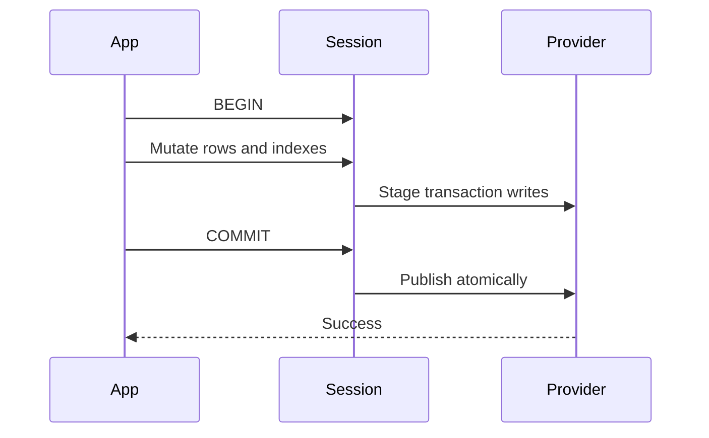

# Storage and Security

UQA Engine separates the query API from the persistence provider. Choose a backend according to durability, deployment, and security requirements rather than SQL syntax: SQL and retrieval behavior are shared across supported providers.

## Backend matrix

| Backend | Construction | Persistence | Encryption at rest | Typical use |
| --- | --- | --- | --- | --- |
| Memory | `Engine::new()` | None | Not applicable | Tests, experiments, disposable state |
| SQLite | `Engine::open(path)` | Single database file | Plain by default | General embedded deployment |
| SQLCipher | `Engine::open_encrypted(path, key)` | Single database file | Yes | Security-sensitive persistent deployment |
| Compressed SQLite | `Engine::open_compressed(...)` | Compressed container | Optional | Storage-constrained deployment |
| redb | `Engine::from_persistent_provider(...)` | Pure-Rust single file | No | Pure-Rust persistence and Key/Value integration |

SQLite is the default persistent provider. The redb provider supports the durable catalog, documents, text indexes, graphs, B-tree indexes, exact vector search, IVF and HNSW indexes, transactions, and savepoints.

## Open and reopen

```rust
use std::path::Path;
use uqa_engine::Engine;

let engine = Engine::open(Path::new("catalog.uqa"))?;
engine.sql("CREATE TABLE IF NOT EXISTS settings (id INTEGER PRIMARY KEY)", &[])?;
engine.close()?;

let reopened = Engine::open(Path::new("catalog.uqa"))?;
# Ok::<(), Box<dyn std::error::Error>>(())
```

Persistent reopen restores durable schemas, tables, rows, text postings, vector indexes, named graphs, views, sequences, statistics, scoring parameters, and models. Runtime callbacks are process objects and must be registered again.

`Engine::open_auto(path, key)` examines the file and selects the matching SQLite path. Use it when an application intentionally accepts more than one container format. Use an explicit open method when the deployment requires one specific format and should reject all others.

## redb provider

```rust
use std::sync::Arc;
use uqa_engine::Engine;
use uqa_storage::PersistentStorageProvider;
use uqa_storage_redb::RedbStorage;

let provider: Arc<dyn PersistentStorageProvider> =
    Arc::new(RedbStorage::open("catalog.redb")?);
let engine = Engine::from_persistent_provider(provider)?;
# Ok::<(), Box<dyn std::error::Error>>(())
```

All sessions created from this engine share the provider and durable data while keeping SQL transaction and session state independent.

## Cross-session cache refresh

Sessions created with `Engine::new_session()` share immutable committed definitions and statistics while retaining independent statement gates, transactions, and physical storage handles. Persistent graph handles bind directly to each session's storage; they do not contain a complete in-memory graph. Reuse these sessions for independent database operations; cloning an `Arc<Engine>` still shares one SQL session and its statement gate.

SQLite catalogs expose `CatalogFacade::cache_revisions()` as lightweight generations for table definitions, registries, table data, column statistics, and statistics-maintenance records. The counters are read from the same pinned transaction snapshot as the data and advance atomically with storage mutations, including direct catalog writes. Rollback and savepoint rollback restore both the mutation and its counters. A data-only commit refreshes only the affected table's physical caches; unchanged schemas and statistics remain shared. Statistics-only commits replace the affected statistics snapshot and reuse its decoded contents across readers. Unchanged snapshots do not reread the counter map.

Graph generations are tracked separately from other registries. Graph refresh binds names and small label metadata without loading vertex, edge, membership, adjacency, or path-index replicas. `CatalogFacade` provides indexed point reads, bounded ID pages, filtered counts, and membership lookups. Mutations use physical transactions and savepoints. Fixed transaction views and cursors retain storage-backed snapshots, with changed-ID overlays for their own writes; see [Graph runtime internals](../internals/06-graph-runtime.md) for native-reader and encrypted temporary snapshot ownership.

Custom providers can implement this optional method with the same transaction-visible contract. Returning `None` retains conservative catalog refresh; an empty `Some(CatalogCacheRevisions::default())` asserts that nothing has changed and is not a substitute for unsupported tracking. The optional `graphs` map enables graph-scoped tracking; providers that leave it as `None` must include graph changes in the registry generation. Providers must implement the direct graph-access and path-page catalog methods in the same physical transaction as their data. Bulk graph snapshots remain an explicit export/compatibility API, not the engine's execution path. Revisions must not be recycled while old handles can still exist, including graph deletion and recreation. SQLite catalog version 46 adds physical path-index pages and atomic validity tracking; older binaries must not reopen the upgraded database. Key-value catalogs explicitly migrate their graph lookup indexes before use; read-only opens do not silently build them.

## Automatic column statistics

Persistent query planning consumes saved estimates instead of synchronously scanning tables. A database-level background worker gathers a projected sample of at most 4,096 rows per relation hierarchy, releases its read snapshot, and publishes only if the table identity and committed change generation still match. First collection, committed-change thresholds, and a maximum dirty age of 60 seconds schedule refreshes automatically. Existing estimates remain available while maintenance is pending; explicit `ANALYZE` scans the full requested relation hierarchy.

Both collection paths omit text and binary values above 1,024 bytes from stored range, histogram, and most-common-value (MCV) samples. Other encoded values have an 8,192-byte budget. Values are omitted rather than truncated, so no invented prefix becomes an equality or ordering key; stored table data is unchanged. Row and NULL counts include these observations, and each omitted non-null observation contributes one conservatively distinct value to the estimate. The bounded-value policy follows the approach used by [PostgreSQL scalar analysis](https://github.com/postgres/postgres/blob/REL_18_STABLE/src/backend/commands/analyze.c).

On reopening an older catalog, oversized statistical payloads are not decoded into unbounded value collections. Usable counts and bounded samples remain available, and a durable statistics-format marker schedules one background replacement even when no new rows are written. An analyzed relation with no eligible automatic columns does not repeatedly schedule work merely because its statistics map is empty.

## SQLCipher

`Engine::open_encrypted` uses the SQLCipher storage path. The key is required for every open and is not recoverable from the database. Operational rules are:

- Generate keys with a cryptographically secure secret manager.
- Do not place production keys in source code, shell history, logs, panic messages, or database paths.
- Protect backups and exported data independently.
- Exercise restore procedures with the same key-management boundary used in production.
- Treat an authentication or open failure as a hard failure; do not retry by opening the file as plain SQLite.

The CLI accepts `--key`, `--key-file`, or `UQA_KEY`. A protected key file or a deployment secret mechanism avoids exposing a key in process arguments.

## Compressed encrypted containers

Compressed encryption provides confidentiality and authenticated container metadata, but its rollback guarantees are narrower than a normal SQLCipher database. An attacker who can replace the entire file with an older valid copy cannot be detected from data stored only inside that same file.

Use `Engine::open_compressed_encrypted_with_anchor` with an external trusted anchor when whole-file rollback detection is required. The anchor must live in a trust domain that cannot be rolled back together with the database.

Read the complete [compressed VFS security contract](../../design/compressed-vfs-security.md) before selecting this format.

## Transactions and durability

Persistent mutations become visible according to the provider transaction contract. UQA Engine coordinates relational rows, catalog records, text postings, vector indexes, and graph state so commit publishes a consistent state and rollback discards the transaction changes.



Use explicit transactions for multi-statement invariants. Use savepoints when part of a larger transaction may be retried or abandoned independently.

## Schema and index migrations

Opening an older supported database can run provider migrations. Clustered full-text postings, for example, replace older per-document posting storage atomically and idempotently. A failed migration leaves the old representation unchanged.

Before upgrading an application:

1. Make a recoverable backup.
2. Test opening a copy with the exact new binary.
3. Run representative SQL, text, vector, and graph checks.
4. Verify that the older binary is not expected to open a newly migrated file.

Storage formats may evolve before a stable release, so application and database rollouts should be coordinated. The [0.2.2 upgrade guide](10-upgrading.md) covers typed tuple metadata, named expression-index storage, and catalog dependency migrations introduced in the 0.2 series.

## Backups and copies

Do not copy a live database file with a generic file copy and assume the result is transactionally consistent. Stop writers and close the engine, or use a provider-specific consistent backup method. Copy external rollback anchors and key metadata according to their own recovery procedures, without placing keys inside the database backup.

## Browser persistence

The Emscripten WASM binding uses a SQLite filesystem synchronized with IndexedDB. `UQA.load()` restores a mounted directory and `UQA.persist()` flushes it. The browser lifecycle can terminate without a final callback, so persist at application-defined checkpoints rather than only during page shutdown.

Browser WASM does not expose SQLCipher encryption. Protect sensitive browser data using the application's threat model and platform storage controls.

## Related internal contracts

- [Storage internals](../internals/03-storage.md)
- [State and transactions](../internals/07-state-and-transactions.md)
- [Key/Value storage design](../../design/kv-storage-backends.md)
- [Engine state ownership](../../design/engine-state-ownership.md)
