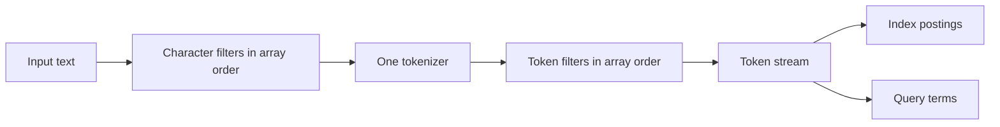

# Text Analyzer Pipelines

An analyzer converts source text into the token stream used by a full-text index or a search expression. UQA Engine analyzers are ordered, named, field-bound pipelines; analyzer selection is therefore part of the search schema rather than a presentation-only setting.

## Pipeline model

Every analyzer executes the same three stages:



Character filters transform the complete string before tokenization. The tokenizer creates tokens. Token filters then transform, remove, or expand those tokens in the configured order. Array order is semantic: moving lowercase, stemming, stop-word removal, synonyms, or n-grams changes the resulting vocabulary.

The indexing phase analyzes document field values before writing postings. The search phase analyzes query leaves before posting lookup and scoring. A field can use an analyzer for `index`, `search`, or `both`; `both` is the default and is the safest choice when one vocabulary must be shared by documents and queries.

## Built-in analyzers

| Name | Pipeline | Typical use |
| --- | --- | --- |
| `standard` | `standard` tokenizer, lowercase, ASCII folding, English stop words, Porter stemming | Default English-oriented prose |
| `whitespace` | `whitespace` tokenizer, lowercase | Pre-segmented text whose punctuation must remain inside tokens |
| `standard_cjk` | `standard` pipeline followed by character n-grams from 2 through 3 with short-token retention | CJK-style text and substring-oriented matching |
| `keyword` | `keyword` tokenizer with no filters | Treat the complete non-empty field as one exact token |

`standard` is the default analyzer when a GIN field has no explicit assignment. `standard_cjk` is a character n-gram extension, not a language-specific morphological segmenter. SQL `list_analyzers()` includes the four built-ins and custom catalog analyzers.

Bind the CJK-oriented built-in directly to an indexed field; it does not need a custom JSON definition:

```sql
SELECT * FROM set_table_analyzer(
    'articles',
    'body',
    'standard_cjk',
    'both'
);
```

## JSON configuration shape

A custom analyzer is stored as JSON with one tokenizer and optional ordered filter arrays:

```json
{
  "char_filters": [
    {"type": "html_strip"}
  ],
  "tokenizer": {"type": "standard"},
  "token_filters": [
    {"type": "lowercase"},
    {"type": "ascii_folding"},
    {"type": "stop", "language": "english", "custom_words": ["manual"]},
    {"type": "synonym", "synonyms": {"car": ["automobile"], "automobile": ["car"]}},
    {"type": "length", "min_length": 2, "max_length": 24}
  ]
}
```

`html_strip` and `ascii_folding` are the serialized names and must be written exactly. The tokenizer defaults to `whitespace` when omitted; both filter arrays default to empty. This empty default is case-sensitive and differs from the built-in analyzer named `whitespace`, which adds lowercase filtering. The tokenizer and parameterless token filters also accept string shorthand, such as `{"tokenizer":"keyword","token_filters":["lowercase"]}`, but canonical object form is clearer when configurations are reviewed or generated.

## Character filters

| JSON type | Configuration | Behavior |
| --- | --- | --- |
| `html_strip` | None | Replaces tag-shaped text with spaces and decodes the built-in `amp`, `lt`, `gt`, `quot`, `#39`, `apos`, and `nbsp` entities |
| `cjk_width` | None | Folds fullwidth ASCII and halfwidth Katakana, composing compatible following halfwidth voiced marks and preserving original source spans |
| `kuromoji_iteration_mark` | `normalize_kanji`, `normalize_kana`, both default `true`; requires the Rust `kuromoji` feature | Expands Japanese horizontal iteration marks using the original input and pinned span/voicing rules, preserving UTF-16 length and original source coordinates |
| `mapping` | `mapping` object | Applies string replacements longest-key-first |
| `pattern_replace` | `pattern`, optional `replacement` | Replaces every Rust regular-expression match; replacement defaults to an empty string |

The HTML filter is a search normalization filter, not a validating HTML parser or sanitizer. Sanitize untrusted HTML at the application boundary according to its rendering context.

`cjk_width` maps U+FF01–U+FF5E and U+FF65–U+FF9F. For example, `ｶﾞＡ①` becomes `ガA①`, and `ガ` retains the source span covering both `ｶ` and `ﾞ`. Other compatibility characters, ideographic spaces, and halfwidth punctuation U+FF61–U+FF64 remain unchanged. This stage is available independently of dictionary features and uses the same budgeted character-filter APIs and cancellation controls as the other stages. Composed outputs retain mappings through preceding character edits.

`CharFilter::KuromojiIterationMark { normalize_kanji, normalize_kana }` is available with `uqa-analysis/kuromoji`. It handles `々`, `ゝ`, `ゞ`, `ヽ` and `ヾ`; vertical marks remain unchanged. A run refers to original input characters rather than earlier replacements. Full stop `。` and supplementary characters delimit spans; excess marks at an illegal boundary pass through unchanged. Reference script and voicing quirks are retained: `?ゝ` becomes `??`, and `なゝ` becomes `など`. Both flags false preserve the input. The character-filter APIs retain original UTF-8/UTF-16 coordinates through prior HTML, mapping and width stages, and compiled generic pipelines snapshot the explicit flags. Standalone Japanese analyzers can consume its result through `analyze_mapped`; their default chain and ordinary normalization do not add this optional stage. Upper-layer Japanese feature forwarding remains part of the pending binding integration.

## Tokenizers

| JSON type | Configuration | Behavior |
| --- | --- | --- |
| `whitespace` | None | Splits with Unicode whitespace boundaries |
| `standard` | None | Extracts Unicode regular-expression word runs, including letters, digits, and underscores |
| `letter` | None | Extracts ASCII letter runs with `[a-zA-Z]+` |
| `n_gram` | `min_gram`, `max_gram` | Emits every character n-gram in the inclusive range for each whitespace-delimited word |
| `pattern` | `pattern` | Splits on a Rust regular expression and discards empty pieces |
| `keyword` | None | Emits the complete non-empty input as one token |

N-gram bounds require `min_gram > 0` and `max_gram >= min_gram`. A pattern tokenizer must contain a valid Rust regular expression.

## Token filters

| JSON type | Configuration | Behavior |
| --- | --- | --- |
| `lowercase` | None | Applies Unicode lowercase conversion |
| `unicode_simple_lowercase` | Optional legacy Nori string `unicode_profile`, or an explicit provider/dictionary object | Applies the pinned Java simple mapping from that profile; see [profile selection](#simple-lowercase-profile-selection) |
| Japanese base form, stem, kana, reading and number filters | See [Japanese filters in compiled pipelines](#japanese-filters-in-compiled-pipelines) | Reuses Japanese token attributes or term rules without loading a dictionary |
| `stop` | Optional `language`, optional `custom_words` | Removes built-in English stop words plus exact custom words; the default language is `english` |
| `porter_stem` | None | Applies the built-in Porter stemmer |
| `ascii_folding` | None | Uses Unicode decomposition to fold characters with ASCII equivalents and preserves characters without one |
| `synonym` | Inline `synonyms` or `synonyms_path` | Retains each source token and appends its configured expansions |
| `ngram` | `min_gram`, `max_gram`, optional `keep_short` | Emits every character n-gram; a shorter token is retained only when `keep_short` is true |
| `edge_ngram` | `min_gram`, `max_gram` | Emits token prefixes in the inclusive range |
| `length` | Optional `min_length`, optional `max_length` | Retains tokens inside the character-count range; `max_length = 0` means no upper bound |

Only `english` has a built-in stop-word list. Other language strings contribute no built-in words, although `custom_words` still apply. Put `lowercase` before stop words or lowercase synonym keys when matching should be case-insensitive. Put synonyms before or after stemming deliberately because synonym keys and expansions are interpreted at that exact point in the stream.

## Create and bind an analyzer with SQL

Register the JSON under a catalog name:

```sql
SELECT * FROM create_analyzer(
    'html_vehicle',
    $analyzer$
{
  "char_filters": [{"type": "html_strip"}],
  "tokenizer": {"type": "standard"},
  "token_filters": [
    {"type": "lowercase"},
    {"type": "synonym", "synonyms": {"car": ["automobile"], "automobile": ["car"]}}
  ]
}
$analyzer$
);
```

List SQL catalog and built-in analyzer names:

```sql
SELECT analyzer_name
FROM list_analyzers()
ORDER BY analyzer_name;
```

There are two binding paths. A GIN index can own the analyzer as part of its DDL:

```sql
CREATE INDEX articles_body_gin
ON articles USING gin (body)
WITH (analyzer = 'html_vehicle');
```

The DDL path applies the analyzer to both indexing and search, validates the name, and backfills existing rows. Because the analyzer name remains part of the durable index definition, change this choice by dropping and recreating the GIN index.

Alternatively, create the GIN index without an analyzer option and manage the field assignment separately:

```sql
CREATE INDEX articles_body_gin
ON articles USING gin (body);

SELECT * FROM set_table_analyzer(
    'articles',
    'body',
    'html_vehicle',
    'both'
);
```

`set_table_analyzer` requires an existing `TEXT` column already present in a physical GIN index. A phase-specific call updates only its selected side and retains the other revision. Both exact descriptors survive rollback, catalog refresh, renames, and reopen. Asymmetric pipelines must still emit compatible index and query vocabularies. GIN analyzer ownership and field-assignment ownership cannot compete for one field; a field assignment on a GIN-owned analyzer fails. Dropping the last explicit GIN analyzer owner while a plain GIN remains rebuilds the field with its table default.

Built-in storage providers retain compiled revisions, and Engine persists their resolved descriptors. File edits or removal do not change registered definitions or installed revisions. Re-register a named configuration to read changed files, then reapply the selected binding. Rebuilds publish the candidate revision and replacement postings together. Initial open resolves legacy definitions and phase rows once, rebuilding affected indexes from source within the catalog transaction; later restoration verifies exact descriptors and never rereads their original synonym paths.

## Analyzer phases

| Phase | Document writes | Existing postings | Query analysis |
| --- | --- | --- | --- |
| `index` | Uses the assigned analyzer | Rebuilt immediately when assigned | Retains the previous search revision, including the default on first assignment |
| `search` or `query` | Keeps the current index analyzer | Not rebuilt | Uses the assigned analyzer |
| `both` | Uses the assigned analyzer | Rebuilt immediately when assigned | Uses the assigned analyzer |

Asymmetric phases are useful only when the resulting search terms remain compatible with the indexed vocabulary. Search-time synonym expansion is a common intentional asymmetry because one query token can be unioned across several existing posting terms. Index-only stemming or n-grams require a compatible search pipeline or queries can produce terms that do not exist in the index.

## Search and inspect the result

All text retrieval paths resolve the field's search analyzer, including typed text search, `text_match`, `fts_match`, Bayesian BM25, and multi-field retrieval:

```sql
SELECT id, title, _score
FROM articles
WHERE text_match(body, 'car')
ORDER BY _score DESC, id ASC;
```

Inspect physical index counts and the recorded analyzer name:

```sql
SELECT table_name, field, analyzer, posting_count,
       indexed_doc_count, term_count, total_field_length
FROM fts_index_stats('articles')
ORDER BY field;
```

The CLI command `\da` and `Engine::list_named_analyzers` list custom engine-catalog analyzer names. SQL `list_analyzers()` additionally includes the four built-ins.

## Change or remove a custom analyzer

An assigned analyzer cannot be dropped. For a field-assignment-owned analyzer, assign a replacement first and then drop the custom definition:

```sql
SELECT * FROM set_table_analyzer(
    'articles',
    'body',
    'standard',
    'both'
);

SELECT * FROM drop_analyzer('html_vehicle');
```

Changing the `index` or `both` phase rebuilds the complete full-text index before the assignment is published. A failure restores the prior analyzer and postings. If the analyzer was named in `CREATE INDEX ... WITH (analyzer = ...)`, drop and recreate that index with the replacement before dropping the custom analyzer.

## Rust APIs

Durable engine configuration uses JSON through `Engine`:

```rust
use uqa_engine::Engine;

let engine = Engine::new();
let config = r#"{
  "tokenizer":{"type":"standard"},
  "token_filters":[{"type":"lowercase"},{"type":"porter_stem"}],
  "char_filters":[{"type":"html_strip"}]
}"#;

engine.register_named_analyzer("html_english", config)?;
engine.sql("CREATE TABLE docs (id INTEGER PRIMARY KEY, body TEXT)", &[])?;
engine.sql("CREATE INDEX docs_body_gin ON docs USING gin (body)", &[])?;
engine.set_table_field_analyzer("docs", "body", "html_english", "both")?;

let assignment = engine.table_field_analyzer("docs", "body")?;
assert_eq!(assignment, Some(("html_english".into(), "both".into())));
# Ok::<(), Box<dyn std::error::Error>>(())
```

The corresponding methods are `register_named_analyzer`, `list_named_analyzers`, `set_table_field_analyzer`, `table_field_analyzer`, `get_table_analyzer`, and `drop_named_analyzer`; compatibility aliases use `create_analyzer`, `set_table_analyzer`, and `drop_analyzer`.

Construct an analyzer directly when an application needs to preview tokens or use analysis outside an engine catalog:

```rust
use uqa_analysis::{Analyzer, CharFilter, TokenFilter, Tokenizer};

let analyzer = Analyzer::new(
    Tokenizer::Standard,
    vec![TokenFilter::Lowercase, TokenFilter::PorterStem],
    vec![CharFilter::HTMLStrip],
);
assert_eq!(analyzer.analyze("<p>Running</p>")?, vec!["run"]);
# Ok::<(), Box<dyn std::error::Error>>(())
```

The process-global `uqa_analysis::register_analyzer` registry is not catalog persistence. Use the engine or SQL registration path for a persistent field assignment; otherwise a later process can reopen a field mapping whose process-local analyzer was never registered.

### Immutable pipeline compilation

`Analyzer::compile()` returns an `Arc<CompiledAnalyzer>` containing immutable prepared stages and a resolved descriptor. Resolution checks limits and expression syntax, validates gram bounds, and snapshots file-backed synonym stages. Compilation prepares executable expressions and can additionally reject expressions that exceed the regex program limits. Prepared stages retain ordered character mappings, fixed stop-word sets, and resolved synonym maps. Compilation changes no source configuration, registry, catalog, binding, or index state.

`CompiledAnalyzer::analyze_tokens(input)` returns the complete `AnalyzedText`; `analyze(input)` returns its checked ordered string projection. Each call owns its output and source state. Cloning the `Arc` shares the prepared stages, and concurrent calls may reuse that handle. These methods execute the same token, graph, and source-edit algorithms as the uncompiled APIs, without rebuilding expressions or stop sets, cloning synonym maps, or opening synonym files during execution.

The compiled handle remains stable after source configuration changes, file edits, deletion, or replacement. Compile again to observe a new synonym-file revision. Existing `Analyzer::analyze`, `analyze_tokens`, and individual uncompiled stage methods retain their current execution order and synonym-file reload behavior. A missing file therefore still fails a new compilation or an uncompiled call even when an older compiled handle remains usable. Repeated compilations share a retained handle when their resolved descriptors match.

```rust
use uqa_analysis::standard_analyzer;

let compiled = standard_analyzer("english").compile()?;
let result = compiled.analyze_tokens("The cats and")?;
assert_eq!(result.tokens()[0].term(), "cat");
assert_eq!(result.tokens()[0].offsets().unwrap().utf8, 4..8);
assert_eq!(result.tokens()[0].position_increment(), 2);
assert_eq!(result.final_position_increment(), 1);
assert_eq!(compiled.analyze("Dogs")?, ["dog"]);
# Ok::<(), uqa_analysis::AnalysisError>(())
```

This example executes as a Rust doctest. Existing index and query consumers still use the analyzer interfaces described below; compilation alone does not change stored occurrences or field revisions.

### Resolved descriptors and compilation resources

`AnalyzerDescriptor::resolve(&config, length_policy, limits)` snapshots a pipeline into an `Arc<AnalyzerDescriptor>`. `CompiledAnalyzer::descriptor()` exposes that descriptor, `fingerprint()` returns its `AnalyzerFingerprint`, and `canonical_json()` returns its portable JSON. The wire object contains `descriptor` and `fingerprint`; the fingerprint is SHA-256 over the domain `UQA analyzer descriptor` followed by a zero byte and the compact descriptor JSON with recursively sorted object keys. The descriptor declares format `uqa-analyzer`, format version 1, algorithm revision 1, source-mapping revision 1, a length policy, the resolved pipeline, and runtime profiles.

Resolution writes explicit component defaults, expands built-in stop languages into a sorted unique word set, and reads each synonym file into an inline map with a null file path. Synonym file parsing retains its established ordered deduplication, including self-expansion from duplicate equivalent members; inline synonym lists retain their exact order and duplicates. File paths and comments do not identify a resolved synonym map. `TokenLengthPolicy::EmittedTokens` declares a count of every emitted token, while `DiscountOverlaps` declares a count only of tokens with a positive position increment. The policy contributes to the fingerprint; existing storage consumers still use their documented emitted-token counts.

Runtime profiles identify Rust Unicode tables only for whitespace/gram tokenization or full lowercase, and normalization tables only for ASCII folding or CJK width conversion. Every regex stage also hashes its parsed expression structure with expanded Unicode character ranges; Unicode word-boundary expressions include the expanded word class. Full lowercase also identifies its contextual case-property tables: the verified Unicode 16 tables retain their existing Rust Unicode 16 identity, while any other table/version combination includes explicit class hashes. `AnalyzerDescriptor::from_json(json, limits)` rejects a changed fingerprint, unsupported revision, mismatched runtime profile, duplicate or unknown properties, implicit resolved defaults, or any remaining synonym file path. Restoration opens no synonym file. A resolved descriptor still requires executable compilation, which may reject regex program-size limits.

`AnalyzerResources::default()` shares a process-local compilation cache. `AnalyzerResources::new(limits)` creates an independent owner; clones share that owner's fixed limits and retained handles. `compile(&config)` and `Analyzer::compile_with_resources(&resources)` use `DiscountOverlaps` when the pipeline contains Korean stages and `EmittedTokens` otherwise; `compile_with_length_policy(&config, policy)` selects an explicit policy. `restore(descriptor)` or `restore_json(json)` compiles verified immutable inputs. Compilation of a retained fingerprint reuses its handle; a cache miss prepares expressions and fixed filter state once under the owner lock. Mutable file reads occur outside that lock and still run on a new configuration compilation. Failures publish no compiled entry. Eviction removes cache ownership while existing callers retain valid handles.

Default `AnalyzerLimits` allow 16 MiB of configuration/descriptor JSON and each synonym source, 256 stages including the tokenizer, and cached ownership of 128 analyzers totaling at most 8 MiB of canonical descriptor JSON. Synonym resolution checks the expanded map's JSON size before inserting another key or expansion, so a small equivalent group cannot allocate an unbounded resolved map. Final descriptor encoding is also bounded. `cache_stats()` reports retained analyzer count and descriptor bytes; these byte totals exclude executable heap allocations and caller-owned handles. A zero cache-entry limit disables retention. A valid descriptor larger than only the cache byte budget returns an uncached handle. These analysis-only APIs do not themselves persist catalog definitions or field bindings; Engine owns that lifecycle.

```rust
use uqa_analysis::{standard_analyzer, AnalyzerLimits, AnalyzerResources};

let resources = AnalyzerResources::new(AnalyzerLimits::default());
let compiled = resources.compile(&standard_analyzer("english"))?;
let saved = compiled.descriptor().canonical_json();
let restored = resources.restore_json(saved)?;
assert!(std::sync::Arc::ptr_eq(&compiled, &restored));
assert_eq!(restored.analyze("The cats and")?, ["cat"]);
# Ok::<(), uqa_analysis::AnalysisError>(())
```

This example executes as a Rust doctest. Saving descriptor JSON and restoring it through a fresh resource owner preserves its resolved inputs without requiring the original synonym files.

### Explicit normalization plans

`Analyzer::with_normalization(plan)` sets the optional analyzer-level `normalization` field. `CompiledAnalyzer::normalize` and `normalize_budgeted` execute that retained plan independently of character filters, tokenization, stopwords and other analysis stages. The methods are available without either language feature. `normalize_budgeted` retains its output reservation and releases partial output and scratch on cancellation or byte-limit failure.

| Normalization JSON | Behavior | Required feature |
| --- | --- | --- |
| Omitted | Existing Nori tokenizer profile performs simple lowercase; other pipelines return `NormalizationUnavailable` | Existing Nori inference requires `nori` |
| `{"type":"unavailable"}` | Explicitly disables normalization, including Nori inference | None |
| `{"type":"cjk_width"}` | Restricted CJK width conversion, preserving case | None |
| `{"type":"unicode_simple_lowercase","profile":{"provider":"kuromoji","dictionary":"lucene-10.5.1"}}` | Pinned Java simple lowercase over the complete input | `kuromoji` |
| `{"type":"cjk_width_simple_lowercase","profile":{"provider":"kuromoji","dictionary":"lucene-10.5.1"}}` | CJK width conversion followed by pinned Java simple lowercase | `kuromoji` |

Both lowercase plans also accept `provider: "nori"` when `nori` is enabled. The dictionary value is a required name or `sha256:<artifact hash>`. Compilation freezes the typed provider and exact artifact hash; restoration accepts only canonical exact hashes and validates the bytes. Profiles and width tables contribute to the descriptor identity, and normalization stages count toward `AnalyzerLimits::max_stages`. Unavailable providers, missing profiles and unknown normalization properties are errors.

An omitted field serializes without a null or default entry, preserving existing generic and Nori descriptor bytes, revisions and fingerprints. An explicit plan creates a distinct revision even when its output happens to equal the inferred behavior. Resolving a shared dictionary alias once per language within a pipeline keeps tokenizer, filter and normalization snapshots consistent. Retained compiled handles preserve their profile after alias changes or cache eviction. This configuration is available in 0.3.5; Japanese tokenizer/filter configuration and both built-ins are available through the common analysis pipeline; native provider and SQL lifecycle integration are verified, and actual Python/Node.js/WASM artifacts execute the shared SQL contract.

```rust
use uqa_analysis::{Analyzer, NormalizationConfig};
let compiled = Analyzer::default()
    .with_normalization(NormalizationConfig::CJKWidth)
    .compile()?;
assert_eq!(compiled.normalize("ＵＱＡ ｶﾞ")?, "UQA ガ");
```

### Simple-lowercase profile selection

The common `unicode_simple_lowercase` token filter accepts `{"unicode_profile":{"provider":"kuromoji","dictionary":"lucene-10.5.1"}}` with `uqa-analysis/kuromoji`; use `provider: "nori"` to select the Korean dictionary with `uqa-analysis/nori`. The provider is independent of the tokenizer and of explicit normalization. Compilation freezes its exact artifact hash and restoration requires that hash. Tokenizer, filter and normalization references to the same alias share one verified dictionary snapshot per language. Prepared filters retain their own lookup state and never resolve resources during analysis.

Omitting `unicode_profile` still selects the historical Nori `"jdk21"` string. Existing string values and resolved string hashes retain their original serialized form and fingerprint contribution. Strings always require `nori`, including in a Kuromoji-only build; they never select the Japanese dictionary implicitly. The special `"jdk21"` alias applies only to the legacy string form. In an explicit provider object, `dictionary` follows ordinary dictionary-name or `sha256:` resolution. Unknown properties and unavailable providers are rejected.

In Rust, `SimpleLowercaseConfig` and `UnicodeProfileSource` belong to the common analysis API; `nori::SimpleLowercaseConfig` remains a re-export. Use `UnicodeProfile::Kuromoji { dictionary: "lucene-10.5.1".into() }.into()` for the config field, or convert an existing legacy string with `.into()`. Simple lowercase preserves positions, source spans, keyword flags and morphology. It does not perform contextual final-sigma conversion or expand a character into multiple scalars. Both compiled and uncompiled forms execute the existing language filter over the common stream.

### Structured tokens

`Analyzer::analyze_tokens(input)` returns `AnalyzedText`. Its `tokens()` slice contains ordered `AnalysisToken` values with `term()`, `offsets()`, `position_increment()`, `position_length()`, and `is_keyword()`. Tokens emitted by the built-in tokenizers carry `Some(SourceOffsets)` in both original UTF-8 bytes and UTF-16 code units. Start the absolute position at `-1` and add each increment; the token's graph edge ends at that position plus its length. The first increment is positive, later increments may be zero, and lengths are positive. `final_offsets()` identifies the original input end, and `final_position_increment()` counts positions removed after the last emitted token.

`term()` returns `&TokenTerm`. `TokenTerm::from(text)` constructs scalar text; `from_utf16(units)` also accepts isolated surrogate units. `as_str()` returns `Some(&str)` only for scalar text, `utf16()` returns lossless units, and `into_string()` performs a checked string projection. Valid UTF-16 and string construction share the same term identity. JSON retains the existing string form for scalar terms and uses `{"utf16":[...]}` for unpaired units. `AnalyzedText::into_terms()` returns `AnalysisResult<Vec<String>>`; a non-scalar term produces `UnpairedTokenSurrogate` instead of a replacement character. Existing string-only analyzer, tokenizer, and filter entry points retain their signatures and results.

`Tokenizer::tokenize_with_offsets(input)` provides the same representation without character or token filters. `TokenFilter::filter_analyzed(previous_result)` applies one filter while preserving source and stream-end metadata. These operations do not alter catalog or transaction state. Invalid configuration, invalid source boundaries, and position overflow return an `AnalysisError`.

```rust
use uqa_analysis::standard_analyzer;

let analyzed = standard_analyzer("english").analyze_tokens("The cats and")?;
let token = &analyzed.tokens()[0];
assert_eq!(token.term(), "cat");
assert_eq!(token.offsets().unwrap().utf8, 4..8);
assert_eq!(token.position_increment(), 2);
assert_eq!(analyzed.final_position_increment(), 1);
assert_eq!(analyzed.final_offsets().utf8, 12..12);
# Ok::<(), uqa_analysis::AnalysisError>(())
```

Stop-word and length filters carry removed position increments to the next retained token or the stream end. Synonym expansions retain the original token, source range, and position length, and use increment zero; repeated configured alternatives remain repeated. N-gram and edge n-gram token filters also stack each input token's grams at its position. In contrast, the n-gram tokenizer assigns a separate position to each emitted gram. Gram filters use exact substring offsets when a token still equals its original source; after a term rewrite they retain the covering source range. Lowercase, ASCII folding, and stemming retain source ranges, and stemming leaves keyword tokens unchanged.

Generic filters also accept Nori's lossless terms. Lowercase and ASCII folding transform scalar segments while preserving isolated units. Porter stemming processes the complete token with each scalar or isolated unit as one element, and preserves keyword tokens. Length and gram filters count a surrogate pair as one scalar and each isolated unit as one element. String stop/synonym keys cannot match a non-scalar term. Token expansions and rewrites retain Korean morphology; removal filters preserve attributes observed during upstream exhaustion for later stages.

`Analyzer::analyze`, `Tokenizer::tokenize`, and `TokenFilter::filter` remain the ordered `Vec<String>` projection. Memory, Key/Value, and SQLite indexes retain complete occurrences and original-source metadata; string posting APIs expose unique positions for compatibility. Quoted full-text phrases use the retained search revision and match connected occurrence paths. The [Nori implementation plan](../../plans/0006-nori-analyzer.md) tracks the remaining runtime controls and public delivery requirements.

### Tokenizer allocation ownership

`Tokenizer::tokenize_with_offsets_budgeted(input, &budget, poll)` and `tokenize_mapped_budgeted(&filtered, &budget, poll)` return `Budgeted<AnalyzedText>`. Token buffers, term strings, temporary gram boundaries, regex search workspace, native Nori buffers and morphology, newly built coordinate indexes, and retained source copies reserve their requested layouts before allocation. Replacement buffers coexist with their predecessors in the allowance. Built-in Standard and Letter word boundaries and every prepared pattern search are scanned incrementally under callback control. Patterns that cannot use the bounded DFA, including Unicode word boundaries, use a cancellable NFA traversal with reserved frontiers, offset slots, and an explicit traversal stack. Search scratch is released before return. The callback returns `AnalysisResult<()>`; byte-limit failures return `AnalysisError::Memory(MemoryError::Limit { required, limit })`, and callback errors return no partial token result. A failed call leaves the borrowed input's coordinate caches unchanged.

`reserved_bytes()` on this result covers its uniquely owned token, term, morphology, and terminal-attribute buffers. Shared source maps, coordinates, and projection payloads retain their own leases; `MemoryBudget::used()` also includes those leases when they belong to the same allowance. Previously prepared source data keeps its existing allocation owner. Dropping a result frees its owned buffers before returning their reservation. `into_parts()` transfers both the value and its unique lease; `into_shared()` additionally reserves the shared payload, and clones of that `Arc` retain the same allocations. Ordinary `Clone::clone` on the underlying `AnalyzedText` creates separately owned token buffers outside this allowance.

`TokenTerm::clone_budgeted(&budget, poll)`, `AnalysisToken::clone_budgeted(&budget, poll)`, and `AnalyzedText::clone_budgeted(&budget, poll)` return independently reserved copies of their borrowed inputs. Complete-result copies reserve the token vector, each term, readings, morpheme vectors and surfaces, and the hidden terminal token while preserving positions, source coordinates, keyword flags and final gaps. Retained source projections and maps continue sharing their existing leases; a different destination budget owns the new token buffers and does not take over those shared source allocations. The callback interrupts copying and final position validation. Failure returns no partial copy and leaves the input unchanged; dropping the original does not invalidate a successful copy.

`TokenTerm::from_utf16_budgeted(units, poll)` consumes a `Budgeted<Vec<u16>>` carrying its buffer reservation. It validates the complete scalar encoding before allocating UTF-8, preserves invalid UTF-16 exactly, and releases a valid input's UTF-16 buffer only after the UTF-8 replacement exists. Validation and decoding poll for cancellation. Borrowed input, immutable preparation resources, and allocator/reference-count bookkeeping remain outside these runtime buffer reservations. Runtime pattern search and capture workspaces are included in the caller allowance; this API is not a total process-memory bound.

```rust
use uqa_analysis::{CharFilter, Tokenizer};
use uqa_core::memory::MemoryBudget;

let budget = MemoryBudget::new(16 * 1024);
let filtered = CharFilter::HTMLStrip.filter_with_offsets_budgeted(
    "<b>韓🙂</b>", &budget, &mut || Ok(()),
)?;
let tokens = Tokenizer::Whitespace.tokenize_mapped_budgeted(
    &filtered, &budget, || Ok(()),
)?;
assert_eq!(tokens.tokens()[0].term(), "韓🙂");
assert_eq!(tokens.tokens()[0].offsets().unwrap().utf8, 3..10);
drop(filtered);
assert!(budget.used() > 0);
drop(tokens);
assert_eq!(budget.used(), 0);
# Ok::<(), uqa_analysis::AnalysisError>(())
```

This example executes as a Rust doctest with and without Nori enabled.

### Pipeline allocation ownership

`Analyzer::analyze_tokens_budgeted(input, &budget, poll)` and `CompiledAnalyzer::analyze_tokens_budgeted(input, &budget, poll)` return `Budgeted<AnalyzedText>`. Character edits, tokenization, common/Korean filters, source projection, and final position validation share the supplied runtime allowance and callback. `TokenFilter::filter_analyzed_budgeted(input, poll)` consumes a complete reserved analyzed result and returns one retaining the same allowance. Use the returned guard when chaining stages so token buffers, morphology, and hidden terminal attributes keep their reservations.

The compiled method reuses resolved immutable resources. The uncompiled method retains per-call preparation and synonym-file reload behavior; preparation resources are outside the runtime buffer allowance. The callback returns `AnalysisResult<()>`. A byte-limit failure returns `AnalysisError::Memory`, and callback errors propagate without a partial result. Count limits and invalid-graph errors retain their existing contracts. These calls change no catalog, index, or transaction state. Highlighting propagates the allowance through analysis, matching and rendering, including SQL callers. Pattern searches and capture resolution include their runtime buffers and cancellation checks; this API is not a total process-memory bound.

```rust
use uqa_analysis::standard_analyzer;
use uqa_core::memory::MemoryBudget;
let compiled = standard_analyzer("english").compile()?;
let budget = MemoryBudget::new(64 * 1024);
let result = compiled.analyze_tokens_budgeted("The cats and", &budget, || Ok(()))?;
assert_eq!(result.tokens()[0].term(), "cat");
assert_eq!(result.final_position_increment(), 1);
drop(result);
assert_eq!(budget.used(), 0);
# Ok::<(), uqa_analysis::AnalysisError>(())
```

This example executes as a Rust doctest with and without Nori enabled. Complete-pipeline regressions verify allocation failure and cancellation with an unrelated live owner, shared output lifetime, original spans, trailing gaps, and compiled versus uncompiled synonym-file behavior.

### Highlight allocation ownership

`highlight_budgeted(text, query_inputs, analyzer, options, &budget, poll)` and `highlight_compiled_budgeted(text, query_inputs, &compiled, options, &budget, poll)` return `Budgeted<String>`. They retain one allowance through query/source analysis, exact scalar or raw-term lookup, source-span merging, fragment selection, and output encoding. Query terms move their existing buffers while unused morphology, hidden terminal state, and source projections are released. The result keeps only its own string-capacity reservation after scratch is destroyed.

`uqa_analysis::highlight::highlight_words_budgeted(text, query_inputs, analyzer, options, &budget, poll)` accepts borrowed query strings through an iterator and preserves independent word analysis. Its native Unicode word scanner uses the same immutable character class as the existing regex contract, with cancellation checks inside long words. An uncompiled analyzer retains per-query and per-source-word resource reload behavior. Without an analyzer, borrowed text uses full contextual lowercase.

The renderer scans source coordinates without building a full-source character table, preserves source order when fragment densities tie, and writes selected windows and markers directly into the final buffer. It reserves terms, spans, clusters, windows and output before allocation and polls during ordering, lookup, scanning and encoding. A selected match stays whole. Limits or callback errors return no partial highlighted string and release only the call's allocations. Caller-owned input/options and immutable preparation resources retain their separate ownership; this is not a total process-memory bound.

```rust
use uqa_analysis::{highlight_budgeted, HighlightOptions};
use uqa_core::memory::MemoryBudget;
let budget = MemoryBudget::new(64 * 1024);
let result = highlight_budgeted("the quick fox", &["FOX".into()], None, &HighlightOptions::default(), &budget, || Ok(()))?;
assert_eq!(&**result, "the quick <b>fox</b>");
assert_eq!(budget.used(), result.reserved_bytes());
drop(result);
assert_eq!(budget.used(), 0);
# Ok::<(), uqa_analysis::AnalysisError>(())
```

The same example is a Rust doctest on `highlight_budgeted`. SQL execution supplies the live session allowance and cancellation token; see the [SQL highlight contract](../sql/06-retrieval.md#highlighting-and-facets).

### Word transformation allocation ownership

`uqa_analysis::porter::stem_budgeted(input, &budget, poll)` accepts borrowed scalar text and returns `Budgeted<String>`. `stem_term_budgeted(&term, &budget, poll)` accepts a complete `TokenTerm` and returns `Budgeted<TokenTerm>`, retaining isolated surrogate elements. Both reserve character/consonant scratch and output buffers before allocation. Scratch stays reserved while the result is encoded and is released before return; the result retains its own reservation. Byte-limit failures return `AnalysisError::Memory`, and callback errors propagate without a partial result. Loading, prefix scans, suffix stages, and output encoding check the callback. Consonant state for repeated `y` is computed without recursive prefix walks, so long words do not require a larger call stack. The existing `porter::stem` keeps its string result and uses the same algorithm without a byte limit.

```rust
use uqa_analysis::porter::stem_budgeted;
use uqa_core::memory::MemoryBudget;

let budget = MemoryBudget::new(4096);
let result = stem_budgeted("relational", &budget, || Ok(()))?;
assert_eq!(&**result, "relat");
assert_eq!(budget.used(), result.reserved_bytes());
assert!(budget.peak() > budget.used());
drop(result);
assert_eq!(budget.used(), 0);
# Ok::<(), uqa_analysis::AnalysisError>(())
```

This example also executes as a Rust doctest in both configurations. ASCII folding emits each scalar's ASCII compatibility decomposition directly into a reserved term buffer, without a separate decomposition string or decoded raw-term segment. A scalar with no ASCII decomposition remains unchanged, and isolated UTF-16 units stay exact. Budgeted token-filter and analyzer methods retain these reservations across the complete configured pipeline. SQL `work_mem` still requires caller integration.

Full lowercase likewise writes directly into a reserved term buffer and retains contextual Greek final sigma. It reads original scalar context through two forward iterators, skips case-ignorable characters, and preserves isolated UTF-16 units as context boundaries. Long context runs and output encoding check cancellation without allocating a temporary scalar segment. Immutable case-property tables are prepared outside the per-call allowance. Common token filters internally retain token-vector, term, and morphology reservations through replacements, removals, and expansions. Ordinary entry points use an unlimited owner; budgeted analyzer methods propagate the caller allowance and callback through common and Korean stages. Phrase and highlighting consumers propagate runtime control through their owning crates.

Synonym expansion copies the replacement term and retained attributes without first copying the discarded original term. Gram filters count characters, reserve the complete boundary table, and compute stored-representation and UTF-16 coordinates once per input token. They use those coordinates for exact substring offsets without intermediate table replacements or repeated prefix scans. Reserved substring copies preserve raw units and canonicalize scalar-only portions. The ordinary filter API still uses an unlimited allowance. Common stages retain input/output/removal reservations internally; Korean stage ownership and compiled caller controls remain open.

### Character-filter source coordinates

`CharFilter::filter_with_offsets(input)` returns `FilteredText` with transformed text and mappings to the original input. Chain stages with `filter_mapped(previous_result)`. `source_offsets(range)` accepts a half-open UTF-8 byte range in the filtered text and returns its covering original UTF-8 and UTF-16 ranges; `source_offsets_utf16(range)` accepts filtered UTF-16 coordinates instead. Reversed ranges, out-of-range offsets, and boundaries inside UTF-8 characters or UTF-16 surrogate pairs return an `AnalysisError`.

```rust
use uqa_analysis::CharFilter;

let input = "<b>한&amp;🙂</b>";
let filtered = CharFilter::HTMLStrip.filter_with_offsets(input)?;
assert_eq!(filtered.as_str(), " 한&🙂 ");
let entity = filtered.source_offsets(4..5)?;
assert_eq!(&input[entity.utf8], "&amp;");
assert_eq!(entity.utf16, 4..9);
# Ok::<(), uqa_analysis::AnalysisError>(())
```

`source_covering_offsets_utf16(range)` explicitly accepts boundaries inside a surrogate pair. It projects the exact UTF-16 range through each edit map, then supplies the smallest UTF-8 range covering the affected original scalars. The returned `utf16` range keeps the exact original unit coordinates; the `utf8` range is safe to slice. An empty UTF-16 range inside a pair covers that scalar in UTF-8, while an empty range at a scalar boundary remains empty. `TextCoordinates::covering_offsets_utf16(range)` provides the same covering conversion without character filters. Existing strict methods still reject split pairs.

```rust
use uqa_analysis::CharFilter;

let filtered = CharFilter::HTMLStrip.filter_with_offsets("<b>🙂a</b>")?;
let source = filtered.source_covering_offsets_utf16(2..3)?;
assert_eq!(source.utf16, 4..5);
assert_eq!(source.utf8, 3..7);
assert_eq!(&filtered.original()[source.utf8], "🙂");
# Ok::<(), uqa_analysis::AnalysisError>(())
```

Unchanged text maps exactly. Replacements cover the full replaced source range, including regex replacements that reorder captures; inserted text maps to its original insertion boundary. Empty ranges select the following source boundary, and `final_offsets()` retains the original end even after trailing or complete deletion. These APIs are read-only analysis operations with no catalog or transaction effects. `filter` continues to return only the transformed string.

`CharFilter::filter_with_offsets_budgeted(input, &budget, poll)` and `filter_mapped_budgeted(previous, &budget, poll)` reserve transformed text, edit-map segments, regex frontiers, capture-offset slots and traversal stack, shared data payloads, and source-coordinate buffers before allocation. The budget is `uqa_core::memory::MemoryBudget`, and the callback returns `AnalysisResult<()>`. A byte-limit error is `AnalysisError::Memory(MemoryError::Limit { required, limit })`; callback errors propagate without a partial result. Immutable preparation resources, reference-count/allocator bookkeeping, and borrowed input are separate from this runtime allowance. Literal, built-in HTML, and all configured regex scans poll while traversing their input. Capture-bearing replacements and patterns without a bounded DFA use cancellable NFA execution; capture slots have an analysis-owned representation without assumptions about private dependency layouts. Search scratch is released before returning the retained source result, including identity replacements. Copying, source comparison, map copying, and coordinate construction remain cancellable. No catalog, index, or transaction state changes.

`FilteredText::clone()` shares retained text, edit maps, and coordinate indexes with their reservations. A later edit keeps the older view intact and reserves any newly required map sequence from the supplied budget. Input resources that already have a different owner retain that owner's reservation. Retained Korean token contexts also keep these source reservations after the input view is dropped. `into_string()` leaves the managed source view and returns a caller-owned string. `TextCoordinates::new_budgeted(text, &budget, poll)` returns `Budgeted<TextCoordinates>` with the same failure contract; ASCII needs no scalar-boundary buffer, while other text reserves one entry per scalar plus its end boundary.

```rust
use uqa_analysis::CharFilter;
use uqa_core::memory::MemoryBudget;

let budget = MemoryBudget::new(16 * 1024);
let filtered = CharFilter::HTMLStrip.filter_with_offsets_budgeted(
    "<b>한&amp;🙂</b>", &budget, &mut || Ok(()),
)?;
let retained = filtered.clone();
drop(filtered);
assert_eq!(retained.as_str(), " 한&🙂 ");
assert_eq!(retained.source_offsets(1..4)?.utf8, 3..6);
assert!(budget.used() > 0);
drop(retained);
assert_eq!(budget.used(), 0);
# Ok::<(), uqa_analysis::AnalysisError>(())
```

## Standalone Korean tokenization

With the optional `uqa-analysis/nori` feature, `NoriDictionary::from_bytes(bytes, limits)` loads and validates a portable dictionary, `UserDictionary::compile(source, &model, limits)` compiles optional UTF-8 noun rules, and `KoreanTokenizer::new(model, user, options)` constructs an immutable tokenizer. `tokenize(input)` returns a complete `NoriOutput`. Supply the shipped `uqa_nori_data::BUNDLE` or bytes conforming to the [bundle format](../../design/nori-bundle-format.md); loading and execution require no JVM, network, or dictionary download.

`NoriOptions` has `decompound_mode` (`none`, `discard`, or `mixed`, default `discard`), `output_unknown_unigrams` (default `false`), and `discard_punctuation` (default `true`). These options control tokenization before any filters. `none` retains the original token, `discard` emits decomposition components when present, and `mixed` retains the original graph edge plus its components. Missing decomposition differs from an explicitly empty decomposition. Punctuation retention includes reference space tokens; unknown unigram emission follows its own punctuation behavior.

User rules contain one surface followed by optional segmentation labels. Empty and comment-only sources return `None`. The compiler retains the exact source, stable UTF-16 ordering, and the first duplicate surface. Labels contribute UTF-16 lengths and may differ from the surface text or cover only its prefix; a sum longer than the surface is an error. Comment and whitespace processing follow the pinned Java implementation, including the final processed line character used for right-context selection. The compiled rules retain their model identity, and constructing a tokenizer with a different model returns an error.

Each `NoriToken` contains `term_utf16`, `start_utf16`, `end_utf16`, `position_increment`, `position_length`, `keyword`, `pos_type`, `left_pos`, `right_pos`, nullable `reading`, nullable ordered `morphemes`, and `origin` (`known`, `unknown`, or `user`). Each morpheme contains `surface_utf16` and `pos`. Offsets address the supplied UTF-16 input; absolute graph positions start at `-1` and accumulate increments. `NoriOutput` retains the final input offset even for empty output, with tokenizer final increment zero. Null reading/decomposition differs from an empty value. `NoriOutput::from_tokens(tokens, final_offset_utf16, final_position_increment)` constructs an explicit source stream. Filtered outputs also retain opaque attributes changed while the upstream stream is exhausted; keep the returned output when chaining filters because reconstructing it from its public token list or JSON loses that state.

Terms and morphemes use raw `Vec<u16>` because valid UTF-8 input and accepted user rules can cause Lucene to split a surrogate pair. For example, `🙂a 가 나` supplies two one-unit segment lengths and produces unpaired surrogate terms. `String::from_utf16` is therefore fallible. Shortened compound segmentations also use back-anchored reference offsets, which can differ from the substring that supplied the term. Retain these exact values when inspecting reference behavior; replacing invalid units loses information.

All calls are read-only and publish no catalog, index, or transaction state. Dictionary and user-rule handles are shared through `Arc`; each tokenization call owns its lattice and output. Invalid rules, dictionary mismatch, checked size/position overflow, and resource limits return an analysis or dictionary error without a partial successful result. `tokenize_controlled(input, limits, poll)` accepts a cancellation callback returning `AnalysisResult<()>`; a callback error propagates and leaves the tokenizer reusable. `tokenize_utf16(units, limits, poll)` accepts raw UTF-16 units directly.

`tokenize_budgeted(input, limits, &budget, poll)` and `tokenize_utf16_budgeted(units, limits, &budget, poll)` additionally accept a shared `uqa_core::memory::MemoryBudget`. They return `Budgeted<NoriOutput>`, which exposes the immutable output and `reserved_bytes()`; `into_parts()` transfers the output and its unique reservation to another owner. A byte-limit failure returns `AnalysisError::Memory(MemoryError::Limit { required, limit })` without a partial result. Reservations cover requested input, lattice, pending/output, reading, and morpheme buffer layouts, including both buffers during growth. Borrowed caller input, immutable dictionary/user resources, and allocator bookkeeping are outside that allowance. `MemoryBudget::used()` reports live reservations and `peak()` reports their high-water mark. Dropping the result frees its allocations before returning its reservation; other owners sharing the budget retain theirs. The existing entry points retain count limits without imposing a byte limit. The common tokenizer bridge now preserves these reservations through canonical term conversion and retained source creation. Native and common analyzer/filter entry points preserve one supplied allowance across their configured stages. Provider cursors, SQL callers, and rendering still require caller budget propagation.

| Limit | Default | Scope |
| --- | --- | --- |
| User-rule bytes / nonempty processed lines / surface UTF-16 units | 4 MiB / 100,000 / 65,535 | Compilation, including duplicate lines in the line budget |
| Input UTF-16 units | 16 Mi units | One call |
| Live lattice positions / candidates | 131,072 / 1,000,000 | Retained rolling lattice |
| Emitted tokens | 4,000,000 | One call |
| Output UTF-16 units | 64 Mi units | Terms, readings, morpheme surfaces, and retained terminal attributes; also bounds numeric input, intermediate coefficients, and formatting, and prospective source metadata before decomposition |

These are explicit operation bounds, not measured peak-memory or latency guarantees. Dictionary decode limits are documented with the bundle format.

```rust
use uqa_analysis::nori::{
    DictionaryLimits, KoreanAnalyzer, KoreanTokenizer, NoriDictionary, NoriOptions,
    UserDictionary, UserDictionaryLimits,
};

let model = NoriDictionary::from_bytes(uqa_nori_data::BUNDLE, DictionaryLimits::default())?;
let user = UserDictionary::compile("세종시 세종 시", &model, UserDictionaryLimits::default())?;
let tokenizer = KoreanTokenizer::new(model.clone(), user, NoriOptions::default())?;
let output = tokenizer.tokenize("세종시")?;
let terms: Result<Vec<_>, _> = output.tokens.iter()
    .map(|token| String::from_utf16(&token.term_utf16)).collect();
assert_eq!(terms?, ["세종", "시"]);
assert_eq!(output.final_offset_utf16, 3);

let analyzer = KoreanAnalyzer::new(model, None, NoriOptions::default())?;
let output = analyzer.analyze("나물은")?;
assert_eq!(String::from_utf16(&output.tokens[0].term_utf16)?, "나물");
assert_eq!(output.final_position_increment, 1);
assert_eq!(analyzer.normalize("喜悲哀歡 İ UQA")?, "喜悲哀歡 i uqa");
# Ok::<(), Box<dyn std::error::Error>>(())
```

The same example executes as a Nori module doctest. The native tokenizer is checked against the [Docker reference corpus](../../../tests/parity/nori/README.md). Generic Korean pipeline configuration and compilation are described below. Durable Nori registration, graph retrieval, and binding SQL execution are implemented; broader graph differentials and release measurements remain tracked in the [implementation plan](../../plans/0006-nori-analyzer.md). The feature-enabled built-in analyzer inventory includes `nori`.

### Immutable Korean dictionary resources

`NoriResources::default().load_default()` resolves the release-pinned `lucene-10.5.1` bundle through a process-shared, lazy resource owner. The optional `nori` feature includes `uqa-nori-data`; feature-disabled runtime dependency trees exclude it. The default resolver serves the static bundled bytes without copying them and performs no file access, downloads, or JVM calls. `NoriDictionary::from_bytes` remains available for direct loading.

`load(&DictionaryRequest::Name(name))` resolves an alias at that call. `load(&DictionaryRequest::Sha256(hash))` requests exact artifact bytes, using an already validated cached handle when available. The returned `Arc<ResolvedDictionary>` exposes `sha256()`, `bytes()`, and `model()`. The model's `id()` is its semantic dictionary identity, distinct from the hash of the encoded artifact. Artifact hashes use the `ResourceHash` type, whose serialized representation is 64 lowercase hexadecimal digits.

`NoriResources::with_resolver(Arc<dyn DictionaryResolver>, ResourceLimits)` creates independent resource ownership with an explicit host resolver. The trait also accepts a thread-safe closure. Its `resolve` method returns an optional `DictionaryArtifact` with a declared hash and `DictionaryBytes::Static` or `DictionaryBytes::Shared(Arc<[u8]>)`; those bytes and hashes are untrusted until the owner validates them. The default resolver is not a fallback for a custom resolver. An absent resource, declared or requested hash mismatch, invalid bundle, or per-resource limit returns a typed `DictionaryError` before cache publication.

`compile_user(source, &model)` returns an `Arc<ResolvedUserDictionary>` keyed by semantic model identity and exact source hash. `source()`, `sha256()`, and `model_id()` retain the revision inputs; `dictionary()` returns the optional compiled user-rule handle for `KoreanTokenizer::new`. Empty or comment-only rules keep their exact source and hash while returning no compiled entries. Failed rule compilation leaves no cache entry. Existing tokenizers continue to use their immutable rules after later compilation or cache eviction.

Cloning `NoriResources` shares its resolver and caches. Concurrent misses publish one validated handle while it remains cached; resolver callbacks execute outside cache locks. Aliases always consult the resolver, so updating one resolves new content without changing an existing handle. Caches evict the least recently used ownership when adding an entry would exceed a configured count or byte budget. An individually valid resource larger than the cache budget is returned without retention. Eviction does not invalidate handles held by callers.

Default `ResourceLimits` retain at most 2 dictionary artifacts totaling 32 MiB of encoded bytes, and at most 64 user-rule snapshots totaling 8 MiB of UTF-8 source. Per-resource `DictionaryLimits` and `UserDictionaryLimits` also apply before publication. `cache_stats()` reports retained counts and those byte totals; they measure encoded/source sizes, not decoded heap usage or caller-owned handles. A zero entry limit disables the respective cache. These resource APIs change no catalog, field binding, or index state; `AnalyzerResources::with_nori_resources` composes them with generic analyzer descriptors as described below.

```rust
use uqa_analysis::nori::{DictionaryRequest, KoreanTokenizer, NoriOptions, NoriResources};

let resources = NoriResources::default();
let dictionary = resources.load_default()?;
let exact = resources.load(&DictionaryRequest::Sha256(dictionary.sha256()))?;
assert!(std::sync::Arc::ptr_eq(&dictionary, &exact));
let rules = resources.compile_user("세종시 세종 시\n", dictionary.model())?;
let tokenizer = KoreanTokenizer::new(
    dictionary.model().clone(), rules.dictionary().cloned(), NoriOptions::default(),
)?;
let tokens = tokenizer.tokenize("세종시")?;
assert_eq!(String::from_utf16(&tokens.tokens[0].term_utf16)?, "세종");
assert_eq!(String::from_utf16(&tokens.tokens[1].term_utf16)?, "시");
```

The same resource example executes as a Rust doctest.

### Korean analysis in the common token representation

`KoreanAnalyzer::analyze_tokens(input)` returns the common `AnalyzedText`, including `TokenTerm`, exact UTF-16 and covering UTF-8 source offsets, graph attributes, keyword state, Korean morphology, and complete stream end. `analyze_mapped(&filtered_text)` accepts prior character-filter output and applies source correction once. `NoriOutput::into_analyzed(&filtered_text)` converts an already computed stream; supply the same filtered text used for tokenization. A different input length, invalid token range, or invalid graph returns a typed analysis error.

`AnalysisToken::korean_morphology()` returns the optional `KoreanMorphology` with POS type, left/right POS, reading, raw morpheme units, and origin. `filtered_utf16()` retains the tokenizer's pre-correction source range when supplied. Gram filters refine that range when the unchanged token has matching source width; otherwise they retain its covering range along with the morphology. Unpaired terms remain available through `term().utf16()`. For the accepted `🙂a 가 나` rule after HTML removal, the first token retains the single `0xd83d` unit, original UTF-16 range `4..5`, and safe original UTF-8 range `3..7`.

```rust
use uqa_analysis::CharFilter;
use uqa_analysis::nori::{
    DictionaryLimits, KoreanAnalyzer, NoriDictionary, NoriOptions,
    UserDictionary, UserDictionaryLimits,
};

let model = NoriDictionary::from_bytes(uqa_nori_data::BUNDLE, DictionaryLimits::default())?;
let user = UserDictionary::compile("🙂a 가 나", &model, UserDictionaryLimits::default())?;
let analyzer = KoreanAnalyzer::with_filters(model, user, NoriOptions::default(), &[])?;
let filtered = CharFilter::HTMLStrip.filter_with_offsets("<b>🙂a</b>")?;
let output = analyzer.analyze_mapped(&filtered)?;
assert_eq!(output.tokens()[0].term().utf16().as_ref(), [0xd83d]);
assert_eq!(output.tokens()[0].offsets().unwrap().utf16, 4..5);
assert_eq!(output.tokens()[0].offsets().unwrap().utf8, 3..7);
# Ok::<(), Box<dyn std::error::Error>>(())
```

A returned common stream can be passed directly to `TokenFilter::filter_analyzed` or `KoreanFilter::filter_analyzed(stream, &model)`. Both native and common streams use the same Korean filter algorithms. A common token without Korean morphology stays without it: POS stops retain the token, and reading conversion leaves its term unchanged. Simple lowercase and number composition also accept ordinary tokenizer output. Number composition inherits the lookahead token's optional morphology, including its absence.

With the `nori` feature enabled, a common stream owns a shared original-text snapshot, character-edit maps, and coordinate indexes so later composition remains valid after the caller's text and `FilteredText` are dropped. Every source tokenizer records `filtered_utf16()` before source correction. A composing filter combines those raw ranges and projects the result once; it cannot combine already-corrected boundaries because deletions and empty spans can make them inconsistent. If a rewritten term exactly matches its original source span, subsequent gram filters recover precise character spans. This retained source state is absent in feature-disabled builds.

`KoreanFilter::filter_analyzed_controlled(stream, &model, limits, poll)` adds the same bounds and cancellation contract as the native filter methods; the input-unit limit measures filtered input. Invalid output graphs return a typed error. Keep the stream object when chaining: serialized diagnostic tokens omit the opaque exhaustion attributes and source projector. These stream APIs change no registry or catalog state.

### Korean stages in common pipelines

With `uqa-analysis/nori`, `Analyzer` JSON accepts `nori_tokenizer`, `nori_part_of_speech`, `nori_readingform`, `unicode_simple_lowercase`, and `nori_number`. `nori::nori_analyzer()` constructs the default tokenizer/POS/reading/simple-lowercase configuration. It does not register a built-in name. Character filters and existing generic token filters can appear in the same pipeline; `analyze_tokens` preserves morphology, raw surrogate terms, graph/end state, and original source mappings through those stages. `analyze` remains the checked string projection. Feature-disabled deserialization rejects these component tags.

```json
{
  "char_filters": [],
  "tokenizer": {
    "type": "nori_tokenizer",
    "dictionary": "lucene-10.5.1",
    "decompound_mode": "mixed",
    "output_unknown_unigrams": false,
    "discard_punctuation": true,
    "user_dictionary": "세종시 세종 시\n"
  },
  "token_filters": [
    {"type": "nori_part_of_speech"},
    {"type": "nori_readingform"},
    {"type": "unicode_simple_lowercase", "unicode_profile": "jdk21"}
  ]
}
```

`Tokenizer::Nori(NoriTokenizerConfig)` uses the same options and defaults as `NoriOptions`, plus `dictionary` (default `lucene-10.5.1`) and `user_dictionary` (default null). A resource string is a resolver name or `sha256:<64 hexadecimal digits>`; names have no implicit file/network meaning. `NoriPOSConfig.stop_tags` defaults to the reference stop set; an empty array retains every tag. `SimpleLowercaseConfig.unicode_profile` defaults to `jdk21`, which identifies the exact shipped bundle's Java profile. Other explicit names or hashes use the supplied resolver. Reading and number filters take no properties. Unknown properties, modes, tags, and unavailable resources fail. `EmptyFilterConfig` is the Rust parameter type for reading and number stages.

`AnalyzerResources::with_nori_resources(limits, resources)` installs an explicit `NoriResources` owner with no default fallback. `nori_resources()` exposes that owner. Compilation resolves each alias once within the pipeline and reuses an already verified artifact for its exact hash, including with resource-cache retention disabled. Resolver callbacks run outside the analyzer-cache lock. The descriptor records exact bundle/profile hashes, explicit tokenizer defaults, the sorted POS stop set, and exact optional user-rule source, distinguishing null, empty, and comment-only input. Identical retained fingerprints share a compiled handle; later alias changes or user-rule revisions cannot mutate an existing handle.

`AnalyzerDescriptor::from_json` validates canonical structure and exact resource identifiers without loading Korean resources. `AnalyzerResources::restore` and `restore_json` load required exact artifacts and validate/compile user rules before publishing a cache miss. Cached compiled revisions need no later resolver call. Restoring through a new owner requires that owner to provide the descriptor's artifacts and satisfy its own dictionary/user limits. POS, reading, and number stages over ordinary tokens need no dictionary; simple lowercase requires its Unicode profile. Native tokenization and Korean filters use their default `NoriLimits` in these composed entry points.

With the feature enabled, `CompiledAnalyzer::normalize(input)` applies simple lowercase to the complete input using the Korean tokenizer's resolved dictionary profile. Character filters, tokenization, user rules, POS stops, readings, and the configured token-filter chain do not run. A pipeline without a Korean tokenizer returns `AnalysisError::NormalizationUnavailable`. Existing generic full lowercase behavior remains unchanged. Pipelines containing Korean stages declare `DiscountOverlaps` by default; the explicit compilation method can select another length policy.

```rust
use uqa_analysis::{AnalyzerLimits, AnalyzerResources, Tokenizer};
use uqa_analysis::nori::nori_analyzer;

let mut config = nori_analyzer();
if let Tokenizer::Nori(tokenizer) = &mut config.tokenizer {
    tokenizer.user_dictionary = Some("세종시 세종 시".into());
}
let compiled = config.compile()?;
assert_eq!(compiled.analyze("세종시")?, ["세종", "시"]);
assert_eq!(compiled.normalize("喜悲哀歡 İ UQA")?, "喜悲哀歡 i uqa");
let restored = AnalyzerResources::new(AnalyzerLimits::default())
    .restore_json(compiled.descriptor().canonical_json())?;
assert_eq!(restored.analyze_tokens("세종시")?, compiled.analyze_tokens("세종시")?);
# Ok::<(), uqa_analysis::AnalysisError>(())
```

This example executes as a Rust doctest with the Nori feature. Memory and Key/Value indexes accept these compiled pipelines and retain canonical term keys, complete occurrence graphs, declared normalization lengths, and original source-end metadata. Exact graph access uses `get_occurrence_postings` or `get_occurrences` with `TokenTermKey`; string posting lists remain a unique-position projection. Changing a populated field's index revision requires `rebuild_with_analyzer_revision` with original sources. Key/Value initial open rebuilds old positional data from original documents under restored descriptors; its standalone provider rejects legacy reads until a source rebuild. SQLite also retains complete graphs and restores analyzer revisions during its source migration. `Analyzer::uses_korean_stages()` supports capability preflight. Quoted full-text phrases match connected occurrence paths under the retained search revision. Provider, SQL, rendering, and binding resource propagation are implemented; broader graph differentials and release measurements remain in the implementation plan. The feature-enabled built-in registry includes `nori`.

### Korean filters and normalization

`KoreanAnalyzer::new(model, user, options)` compiles the tokenizer with the default POS stop filter, reading-form conversion, and pinned Unicode simple lowercase, in that order. `analyze(input)` returns the same lossless `NoriOutput` representation with retained morphology and stream-end gaps. `KoreanAnalyzer::with_filters(model, user, options, filters)` compiles an explicit `&[KoreanFilter]` chain; an empty chain performs tokenization only. Both constructors share immutable dictionary/user resources and keep analysis state local to each call.

| Rust filter | Serialized type | Behavior |
| --- | --- | --- |
| `KoreanFilter::PartOfSpeech { stop_tags }` | `nori_part_of_speech` | Removes tokens by left POS, carrying skipped increments to the next retained token or stream end |
| `KoreanFilter::ReadingForm` | `nori_readingform` | Replaces only the term with a present reading, including a present empty string |
| `KoreanFilter::SimpleLowercase` | `unicode_simple_lowercase` | Applies the model's pinned Java simple lowercase while retaining unpaired UTF-16 units and all metadata |
| `KoreanFilter::Number` | `nori_number` | Optionally composes Korean numbers with exact decimals and reference lookahead attributes; excluded from the default analyzer |

For the POS filter, omitted or null `stop_tags` uses `DEFAULT_STOP_TAGS`; `[]` keeps all tags. Exact tag spelling is required. The default set is `EP`, `EF`, `EC`, `ETN`, `ETM`, `IC`, `JKS`, `JKC`, `JKG`, `JKO`, `JKB`, `JKV`, `JKQ`, `JX`, `JC`, `MAG`, `MAJ`, `MM`, `SP`, `SSC`, `SSO`, `SC`, `SE`, `XPN`, `XSA`, `XSN`, `XSV`, `UNA`, `NA`, and `VSV`. Unknown filter properties or tags fail deserialization. The standalone Rust `KoreanFilter` type and the common pipeline configurations above share these algorithms. Custom durable Nori definitions and retrieval are implemented, and the feature-enabled built-in registry includes `nori`.

`KoreanFilter::apply(output, &model)` applies one stage to a complete output; `apply_controlled(output, &model, limits, poll)` also enforces token/output bounds and cancellation. POS, reading-form, and lowercase filters preserve retained tokens' offsets, position lengths, keyword state, origin, and nullable morphology. POS filtering adds increments with checked arithmetic, including final skipped positions. Reading conversion and lowercase do not modify reading or morpheme metadata.

`KoreanAnalyzer::analyze_budgeted(input, limits, &budget, poll)` returns `Budgeted<NoriOutput>` and retains one allowance through tokenization and every configured filter. `analyze_tokens_budgeted(input, limits, &budget, poll)` returns the common `Budgeted<AnalyzedText>` representation; `analyze_mapped_budgeted(&filtered, limits, &budget, poll)` additionally preserves an existing character-filter projection and leaves borrowed coordinate caches unchanged. `KoreanFilter::apply_budgeted(output, &model, limits, poll)` and `filter_analyzed_budgeted(output, &model, limits, poll)` consume the corresponding reserved native/common streams. Terms, readings, morphemes, output capacity, numeric scratch, lookahead copies, and hidden terminal attributes retain their owners until destruction. Byte/count limits and callback errors return no partial output.

`KoreanAnalyzer::normalize(input)` returns one `String` after simple lowercase of the complete input. It runs neither tokenization, user-rule matching, POS stops, nor reading conversion, and remains independent of an explicitly configured analysis chain. Thus `喜悲哀歡 İ UQA` normalizes to `喜悲哀歡 i uqa`. Existing generic `lowercase` retains its Rust full-lowercase behavior. `normalize_controlled` adds the same limits/cancellation arguments; `normalize_utf16(units, limits, poll)` exposes lossless simple normalization of raw units. A custom profile whose lowercase mapping changes UTF-16 width returns an error because the reference filter writes in place.

`KoreanAnalyzer::normalize_budgeted(input, limits, &budget, poll)` returns `Budgeted<String>`; `normalize_utf16_budgeted(units, limits, &budget, poll)` returns `Budgeted<Vec<u16>>` with isolated units unchanged. `CompiledAnalyzer::normalize_budgeted(input, &budget, poll)` uses the retained Korean tokenizer profile and default count limits; a pipeline without that profile returns `NormalizationUnavailable`. Encoding and output buffers coexist in the allowance until replacement is complete. Returned reservations cover the final owned capacity.

The default constructor uses the default POS/readings/lowercase chain with `NoriOptions::default()` matching Lucene's `KoreanAnalyzer` defaults. Explicit punctuation and unigram options remain those of the tokenizer, and explicit filter order remains observable. These operations change no catalog or index state. Limits, cancellation, invalid profiles, and position overflow return errors without publishing partial successful output; the compiled analyzer remains reusable.

### Optional Korean number composition

`KoreanFilter::Number` composes adjacent numeric tokens and intervening decimal/grouping punctuation. It uses exact decimal arithmetic for Arabic, fullwidth, and Korean digits and powers through `해`, without floating-point rounding or SQL `NUMERIC` precision limits. It preserves Lucene's keyword protection, stacked-token fallthrough, aborted-composition state, and stream-end behavior. Resource limits and cancellation remain errors; malformed decimals retain their original units.

The filter changes the composed term and covering offsets but inherits the shared attributes present after lookahead, including POS, reading, keyword, position increment, and position length. A later filter therefore observes the lookahead metadata on the normalized number. For example, composing before the default POS filter can remove a number that inherited the following space's `SP` tag. Reading conversion after number composition can replace the numeric term with the following word's reading. An exhausted upstream POS filter can also change these attributes without emitting another token.

For a concrete numeric chain, retain punctuation, remove only `SP` tokens, then compose numbers. The following chain produces `3200`, `원`, and `157` from `３．２천 원 15,7`. Removing punctuation in the tokenizer changes `３．２천` to `32000`; replacing this explicitly ordered chain changes its reference behavior.

```rust
use uqa_analysis::nori::{
    DecompoundMode, DictionaryLimits, KoreanAnalyzer, KoreanFilter,
    NoriDictionary, NoriOptions, POSTag,
};

let model = NoriDictionary::from_bytes(uqa_nori_data::BUNDLE, DictionaryLimits::default())?;
let numbers = KoreanAnalyzer::with_filters(model, None, NoriOptions {
    decompound_mode: DecompoundMode::None,
    discard_punctuation: false,
    ..NoriOptions::default()
}, &[
    KoreanFilter::PartOfSpeech { stop_tags: Some(vec![POSTag::SP]) },
    KoreanFilter::Number,
])?;
let output = numbers.analyze("３．２천 원 15,7")?;
let terms: Result<Vec<_>, _> = output.tokens.iter()
    .map(|token| String::from_utf16(&token.term_utf16)).collect();
assert_eq!(terms?, ["3200", "원", "157"]);
# Ok::<(), Box<dyn std::error::Error>>(())
```

`normalize_number(input)` is a separate direct helper and does not tokenize or require a dictionary. It normalizes the successfully parsed numeric prefix, so `12원` becomes `12`, while a malformed decimal such as `1.2.3` or absent numeric prefix retains the complete input. `normalize_number_utf16(units, limits, poll)` provides the same operation for raw UTF-16 with cancellation. This prefix API differs from the filter's whole-token numeric eligibility. Both forms leave the default Korean analyzer and its simple-lowercase `normalize` operation unchanged.

`normalize_number_budgeted(input, limits, &budget, poll)` and `normalize_number_utf16_budgeted(units, limits, &budget, poll)` return reserved scalar/raw results with the same numeric-prefix behavior. Decimal coefficients, formatting, encoding conversion, and malformed-input fallback copies reserve their buffers before allocation. Allocation and callback failures propagate as errors instead of triggering a successful fallback.

## Standalone Japanese tokenization

The independent `uqa-analysis/kuromoji` feature exposes `JapaneseTokenizer`, `KuromojiOptions`, `KuromojiMode`, `KuromojiLimits`, `KuromojiToken` and `KuromojiOutput`. It includes the immutable dictionary from `uqa-kuromoji-data`. The standalone API, common-pipeline configuration, optional filters and built-in registration are implemented; provider, SQL and binding integration are verified and included in 0.3.5. The standalone default analyzer and its filters are described below. The [implementation plan](../../plans/0007-kuromoji-analyzer.md) records the completed contracts and verification.

`JapaneseTokenizer::new(model, user, options)` retains the selected immutable dictionary and optional compiled Japanese user rules. Rules compiled against another semantic model return a typed analysis error. `KuromojiResources::default().load_default()` returns the bundled resource handle; explicit resolvers and `compile_user` retain the same artifact/model/source identities described in the [bundle specification](../../design/kuromoji-bundle-format.md). Later resource alias changes do not mutate a constructed tokenizer.

`KuromojiOptions::default()` selects `KuromojiMode::Search` with `discard_punctuation` and `discard_compound_token` both true, and `n_best_cost` zero. NORMAL selects the least-cost segmentation; SEARCH applies Japanese compound resegmentation, and EXTENDED additionally emits unknown unigrams. Turning compound discard off preserves alternate compound edges in the search graph. The standalone tokenizer processes its supplied text directly; apply the `cjk_width` character filter explicitly when width conversion is required.

```rust
use uqa_analysis::kuromoji::{JapaneseTokenizer, KuromojiOptions, KuromojiResources};

let dictionary = KuromojiResources::default().load_default()?;
let tokenizer = JapaneseTokenizer::new(
    dictionary.model().clone(), None, KuromojiOptions::default(),
)?;
let output = tokenizer.tokenize("関西国際空港")?;
let terms: Vec<_> = output.tokens.iter()
    .map(|token| String::from_utf16(&token.term_utf16).unwrap())
    .collect();
assert_eq!(terms, ["関西", "国際", "空港"]);
# Ok::<(), Box<dyn std::error::Error>>(())
```

The same example runs as a tokenizer doctest. `KuromojiToken` retains lossless `term_utf16`, `start_utf16`, `end_utf16`, `position_increment`, `position_length`, `keyword` and `origin` (`Known`, `Unknown` or `User`). Its six independent optional strings are `part_of_speech`, `base_form`, `reading`, `pronunciation`, `inflection_type` and `inflection_form`. `KuromojiToken::new(term_utf16, span, origin)` constructs a token with unit increment/length, no keyword mark and absent optional attributes; callers can then populate its public fields. `KuromojiOutput::from_tokens(tokens, final_offset_utf16, final_position_increment)` constructs a materialized stream while keeping opaque exhaustion state private. `KuromojiOutput` owns the ordered tokens, `final_offset_utf16` and `final_position_increment`. Positions describe the graph without flattening compound alternatives; offsets refer to the supplied input in UTF-16 units. Raw unpaired input and token units remain representable through `tokenize_utf16` and the raw term vectors.

`tokenize_controlled(input, limits, poll)` adds count limits and cancellation to string input. `tokenize_utf16(units, limits, poll)` accepts borrowed raw units. `tokenize_budgeted(input, limits, &budget, poll)` and `tokenize_utf16_budgeted(units, limits, &budget, poll)` return `Budgeted<KuromojiOutput>` and reserve all call-owned input, lattice, resegmentation, N-best graph/fixup, token and attribute capacity through one `uqa_core::memory::MemoryBudget`; borrowed UTF-16 input remains caller-owned. Returned reservations retain the output buffers until destruction or explicit transfer. Errors publish no partial stream, release that call's allocations and preserve other owners sharing the allowance.

Default limits are 16,777,216 input UTF-16 units, 131,072 retained lattice positions, 1,000,000 retained candidates, 4,000,000 cumulative emission candidates (including N-best alternatives before deduplication), 67,108,864 output UTF-16 units including attributes, 1,000,000 arcs per resegmentation and 16,000,000 total resegmentation work steps. N-best additionally permits 1,000,000 alternative nodes per fragment including boundaries, 16,000,000 additional graph/probe work steps per call and 1,024 nonempty preparation examples. Callers can supply tighter `KuromojiLimits`. Immutable dictionary and user-rule preparation use their own separate limits. The [209-case Docker tokenizer corpus](../../../tests/parity/kuromoji/README.md) verifies ordered terms, all six attributes, graph/keyword values, offsets, terminal state and expected errors across all modes and discard choices; native owner tests cover retained memory, cancellation and recovery after failure.

### N-best costs and examples

A positive `KuromojiOptions::n_best_cost` enables Lucene's alternative-path selection, stable span deduplication and graph-length fixups. Non-positive costs preserve single-path behavior and allocate no alternative arrays. Signed cost accumulation and threshold comparisons follow the pinned reference, including overflow behavior. `JapaneseTokenizer::n_best_cost()` returns the effective allowance.

`calc_n_best_cost(examples)` estimates the maximum extra cost for slash-separated `input-requiredToken` pairs. `with_n_best_examples(examples)` returns a new tokenizer using the greater of its explicit and estimated costs; it preserves the original tokenizer and selected immutable models. Empty slash components are ignored, trailing empty hyphen fields follow Java splitting, and each nonempty example must leave exactly two fields. Only the first occurrence is probed. A missing substring contributes zero; a present span without a matching lattice node follows Lucene's signed cost arithmetic and can contribute a large positive result. No trimming or custom example normalization is applied.

```rust
use uqa_analysis::kuromoji::{JapaneseTokenizer, KuromojiOptions, KuromojiResources};
let dictionary = KuromojiResources::default().load_default()?;
let tokenizer = JapaneseTokenizer::new(dictionary.model().clone(), None,
    KuromojiOptions { n_best_cost: 2000, ..KuromojiOptions::default() })?;
let configured = tokenizer.with_n_best_examples("関西国際空港-関西")?;
assert_eq!(configured.n_best_cost(), 9325);
assert_eq!(tokenizer.n_best_cost(), 2000);
# Ok::<(), Box<dyn std::error::Error>>(())
```

This example runs as a tokenizer doctest. `calc_n_best_cost_budgeted` and `with_n_best_examples_budgeted` take `(examples, limits, &budget, poll)`. The input-unit limit also bounds the entire examples string, and all probes share one additional-work allowance. Preparation reserves encodings, substring-search storage, lattices and fixups before allocation, retains no scratch on completion, and preserves existing owners on cancellation or error. Probes observe costs without reading dictionary attributes; malformed user attributes can therefore remain valid during estimation and fail only when actual tokenization accesses them. The separate [98-case N-best corpus](../../../tests/parity/kuromoji/README.md) verifies complete ordered attributes, graphs, terminal state, cost boundaries, examples and errors.

### Japanese tokenizers in compiled pipelines

With `uqa-analysis/kuromoji`, `Tokenizer::Kuromoji(KuromojiTokenizerConfig)` and JSON `kuromoji_tokenizer` execute the native tokenizer through the common analyzer pipeline. Defaults are dictionary `lucene-10.5.1`, `mode: "search"`, both discard flags `true`, no user dictionary, signed `n_best_cost: 0`, and no `n_best_examples`. These match the pinned [JapaneseTokenizerFactory](https://github.com/apache/lucene/blob/64ce863a2bea79c69c19c4d56268c26710ff0ff9/lucene/analysis/kuromoji/src/java/org/apache/lucene/analysis/ja/JapaneseTokenizerFactory.java). Unknown properties, invalid modes and out-of-range costs fail during configuration decoding. Tokenizer selection adds no width filter, stop set, stemming or normalization; configure those independently.

Compilation resolves the selected immutable dictionary and exact UTF-8 user source, estimates optional N-best examples with the native preparation limits, and stores the effective signed cost. Canonical descriptors contain an exact dictionary hash and `n_best_examples: null`; reopening never repeats example probes. Unresolved examples, aliases and missing defaults are rejected during restoration. Different user-source bytes remain distinct revisions, including absent, empty and comment-only sources. The tokenizer and an explicit normalization profile share one resolution of the same dictionary alias within a pipeline.

```rust
use uqa_analysis::{Analyzer, AnalyzerLimits, AnalyzerResources, Tokenizer};
use uqa_analysis::kuromoji::KuromojiTokenizerConfig;
let config = Analyzer::new(Tokenizer::Kuromoji(KuromojiTokenizerConfig {
    user_dictionary: Some("東京大学,東京 大学,トウキョウ ダイガク,名詞".into()),
    ..Default::default()
}), Vec::new(), Vec::new());
let compiled = config.compile()?;
assert_eq!(compiled.analyze("東京大学")?, ["東京", "大学"]);
let restored = AnalyzerResources::new(AnalyzerLimits::default())
    .restore_json(compiled.descriptor().canonical_json())?;
assert_eq!(restored.analyze_tokens("東京大学")?, compiled.analyze_tokens("東京大学")?);
```

The native bridge retains all Japanese attributes, raw token terms, token graphs, terminal state and corrected source spans. Both compiled and uncompiled analyzer chains defer user-attribute failures until a filter actually accesses the field or the completed stream is returned; a later generic stop filter can remove an otherwise invalid token. Standalone tokenizer and token-filter calls still validate their public output. Compiled Japanese tokenizers default to overlap-discounted field lengths. Linear term/position adapters reject them because they require immutable revisions and complete occurrence storage. Native/common memory ownership and every-callback cancellation are tested after HTML/width edits and N-best graph expansion. This analysis support is available in 0.3.5. All Japanese filters and both built-ins below compile and restore. Native provider and SQL lifecycle contracts pass; actual Python/Node.js/WASM and real Chrome IndexedDB delivery are verified.

### Japanese filters in compiled pipelines

With `uqa-analysis/kuromoji`, the common `TokenFilter` configuration accepts the following stages independently of the tokenizer. These filters need no dictionary lookup or retained model. They compile and restore even when the language resource resolver cannot provide any dictionary, and they retain the native filter's source, graph, keyword and attribute rules.

| JSON type | Settings and defaults | Native implementation |
| --- | --- | --- |
| `kuromoji_baseform` | None | `JapaneseFilter::BaseForm` |
| `kuromoji_stemmer` | `minimum_length: 4`; values below one fail validation | `JapaneseFilter::KatakanaStem` |
| `kuromoji_hiragana_uppercase` | None | `JapaneseFilter::HiraganaUppercase` |
| `kuromoji_katakana_uppercase` | None | `JapaneseFilter::KatakanaUppercase` |
| `kuromoji_readingform` | `use_romaji: false` | `JapaneseFilter::ReadingForm` |
| `kuromoji_number` | None | `JapaneseFilter::Number` |

All six configurations reject unknown fields, including unused dictionary properties. Compiled descriptors make stem and reading defaults explicit. The Rust configurations are `kuromoji::KuromojiStemConfig`, `kuromoji::KuromojiReadingFormConfig` and the common `EmptyFilterConfig`; Nori's existing empty-config import remains a re-export. A Japanese tokenizer may still require its own dictionary, while these filters use the attributes already carried by tokens. Bare term lists and generic tokenizer output also work according to the native missing-attribute rules. The compiled resource owner retains prepared filters by stage index, and runtime mutation shares the caller's byte allowance and cancellation callback.

The profiled simple-lowercase stage is described [above](#simple-lowercase-profile-selection). The remaining Japanese stages use resources only for default sets, Unicode mappings or completion:

| JSON type | Settings and defaults | Resource requirement |
| --- | --- | --- |
| `kuromoji_part_of_speech` | `stop_tags: null`, `dictionary: null` | Omitted/null tags select the dictionary defaults; an explicit array, including an empty array, needs no dictionary |
| `kuromoji_stop` | `words: null`, `ignore_case: true`, `dictionary: null` | Omitted/null words select the dictionary defaults; ignoring case requires its pinned simple-lowercase mapping, including for explicit words |
| `kuromoji_completion` | `mode: "index"`, `dictionary: "lucene-10.5.1"` | Always requires the dictionary's completion and Unicode resources; mode also accepts `"query"` |

For POS and stop filters, a null/omitted dictionary selects `lucene-10.5.1` only when a resource is required. An explicit dictionary on an explicit POS set or a case-sensitive explicit word set is rejected as unused. Unknown fields and unavailable resources fail before publication. The Rust types are `kuromoji::KuromojiPOSConfig`, `KuromojiStopConfig` and `KuromojiCompletionConfig`.

Compilation expands default stop sets, then sorts and deduplicates their original strings in the descriptor. It preserves original case so restoration applies the selected Unicode mapping exactly once. A resolved POS filter and a resolved case-sensitive stop filter no longer reference or retain the dictionary used to supply defaults; they restore after that source is removed. Case-insensitive stops and completion retain an exact dictionary hash. Tokenizer, filters and normalization share one resolution of each alias per pipeline. Expansion is checked against descriptor limits before resolving later stages, and execution never calls a resolver.

### Japanese built-in configurations

With `uqa-analysis/kuromoji`, the registry reserves `kuromoji` and `kuromoji_completion`. `kuromoji::kuromoji_analyzer()` and `kuromoji::kuromoji_completion_analyzer()` construct the same configurations without I/O. Both apply CJK width filtering before tokenization and discard punctuation and original compound tokens. Their remaining stages and independent normalization follow the pinned [JapaneseAnalyzer](https://github.com/apache/lucene/blob/64ce863a2bea79c69c19c4d56268c26710ff0ff9/lucene/analysis/kuromoji/src/java/org/apache/lucene/analysis/ja/JapaneseAnalyzer.java) and [JapaneseCompletionAnalyzer](https://github.com/apache/lucene/blob/64ce863a2bea79c69c19c4d56268c26710ff0ff9/lucene/analysis/kuromoji/src/java/org/apache/lucene/analysis/ja/JapaneseCompletionAnalyzer.java).

| Name | Tokenizer and ordered filters | Normalization |
| --- | --- | --- |
| `kuromoji` | SEARCH; base form, default POS stops, default word stops with `ignore_case: true`, Katakana stemmer with minimum length 4, pinned simple lowercase | Width followed by pinned simple lowercase |
| `kuromoji_completion` | NORMAL; INDEX completion, pinned simple lowercase | Width only |

For example, ordinary analysis of `ＵＱＡで走りました` produces `uqa` and `走る`; ordinary normalization produces `uqaで走りました`. Completion analysis of `ＵＱＡ` produces `uqa`, while its normalization produces `UQA`. These examples also execute as Rust doctests. Built-ins cannot be overwritten or dropped. These APIs are available in 0.3.5. Native Engine and CLI SQL support is verified with `kuromoji`; actual Python/Node.js/WASM packages and real Chrome execute the same persistent SQL contract.

### Japanese tokens in the common representation

`JapaneseTokenizer::tokenize_mapped(&filtered)` returns `AnalyzedText` over a `FilteredText` view. `tokenize_mapped_budgeted(&filtered, limits, &budget, poll)` preserves one allowance through native tokenization and common conversion; existing shared source allocations retain their original leases. `KuromojiOutput::into_analyzed(&filtered)` converts an already materialized native stream and rejects mismatched input length or invalid graph/source coordinates.

```rust
use uqa_analysis::CharFilter;
use uqa_analysis::kuromoji::{JapaneseTokenizer, KuromojiOptions, KuromojiResources};
let dictionary = KuromojiResources::default().load_default()?;
let tokenizer = JapaneseTokenizer::new(dictionary.model().clone(), None, KuromojiOptions::default())?;
let input = CharFilter::CJKWidth.filter_with_offsets("ｶﾞ")?;
let output = tokenizer.tokenize_mapped(&input)?;
assert_eq!(output.tokens()[0].term().as_str(), Some("ガ"));
assert_eq!(output.tokens()[0].offsets().unwrap().utf16, 0..2);
assert!(output.tokens()[0].japanese_morphology().is_some());
# Ok::<(), Box<dyn std::error::Error>>(())
```

This example also runs as a mapped-tokenizer doctest. Common tokens retain filtered UTF-16 ranges, corrected original UTF-16 ranges and covering UTF-8 spans, including a raw token that splits a surrogate pair. `japanese_morphology()` exposes `JapaneseMorphology` with the same six optional strings and origin; absent and empty values remain distinct. Its serialized field is `japanese_morphology`. The existing `korean_morphology` field and accessor retain their original format, and a token carries at most one language's morphology. Ordinary tokens omit both fields.

The returned stream can pass through common `TokenFilter` operations, including synonyms, grams and stop removal, while preserving Japanese attributes, graph/end state and retained source ownership. Korean POS and reading filters see Japanese tokens as lacking Korean attributes and leave them unchanged. Mapped calls initialize private coordinate caches, so a cancellation or allocation failure returns no partial result and does not mutate the borrowed character-filter view.

## Python, Node.js, and browser WASM

Every binding can create, bind, inspect, search with, and drop analyzers by executing the SQL functions in this chapter. Python exposes `list_named_analyzers()`. Node.js and browser WASM expose `listNamedAnalyzers()`; these direct methods list custom engine-catalog names, while SQL `list_analyzers()` also includes built-ins. Direct construction from `CharFilter`, `Tokenizer`, and `TokenFilter` is a Rust API, so other bindings define the pipeline as JSON passed to SQL.

## File-backed synonyms

The synonym filter accepts a reloadable file path:

```json
{
  "type": "synonym",
  "synonyms_path": "/srv/uqa/synonyms.txt"
}
```

The file format accepts comments, one-way mappings, and equivalent groups:

```text
# One-way expansion
car => automobile, vehicle

# Every member expands to the others
fast, quick, rapid
```

Uncompiled `Analyzer` and token-filter execution reload the file on each call, so edits become visible and later deletion or permission loss returns an error. Compilation resolves the file contents into an immutable descriptor. Engine registration and field binding retain that compiled revision, including its resolved synonym map, across file edits and reopen. Re-register the name to load changed contents, and rebind a field to install the new revision there. The typed `highlight` helper compiles its explicit analyzer once per call; `highlight_compiled` retains the caller-provided revision.

## Standalone Japanese analysis and filters

The `kuromoji` feature exposes `JapaneseAnalyzer` and `JapaneseFilter`. These standalone Rust APIs share their algorithms with the compiled Japanese configurations and built-ins described above. Native Engine SQL uses the same compiled revisions when its `kuromoji` feature is enabled.

`JapaneseAnalyzer::new(model, user, mode)` applies CJK width character filtering, the selected tokenizer mode with both discard flags true, base-form replacement, the model's 27 exact POS stops and 109 Japanese stopwords, Katakana stemming with minimum length four, and the model's Java simple lowercase. Use `KuromojiMode::Search` for the Lucene default. Returned `AnalyzedText` preserves Japanese attributes, graph positions and corrected original UTF-16/UTF-8 source spans.

```rust
use uqa_analysis::kuromoji::{JapaneseAnalyzer, KuromojiMode, KuromojiResources};
let dictionary = KuromojiResources::default().load_default()?;
let analyzer = JapaneseAnalyzer::new(dictionary.model().clone(), None, KuromojiMode::Search)?;
let output = analyzer.analyze("ＵＱＡで走りました")?;
let terms: Vec<_> = output.tokens().iter().map(|token| token.term().as_str().unwrap()).collect();
assert_eq!(terms, ["uqa", "走る"]);
assert_eq!(analyzer.normalize("ＵＱＡで走りました")?, "uqaで走りました");
# Ok::<(), Box<dyn std::error::Error>>(())
```

The example runs as a doctest. `with_filters(model, user, options, filters)` compiles an explicit ordered chain while retaining width character filtering; its tokenizer options also support positive N-best costs. `normalize(input)` always applies width and simple lowercase to the complete string, independently of that chain. It does not tokenize, change base forms, stem Katakana or remove stops.

| `JapaneseFilter` | Behavior |
| --- | --- |
| `BaseForm` | Replace a non-keyword term when its Japanese base form is present. An explicitly empty base form produces an empty term; absent morphology retains the original term. |
| `PartOfSpeech { stop_tags }` | Omission uses model defaults, an empty list retains all tags, and custom tags match exactly. Absent Japanese POS is retained; keyword marks do not exempt stop tags. |
| `Stop { words, ignore_case }` | Omission uses Japanese defaults; an empty list removes nothing. Case-insensitive lookup uses the selected Java simple-lowercase profile. Keyword marks do not exempt stopwords. |
| `KatakanaStem { minimum_length }` | The minimum must be at least one. Non-keyword terms of at least that UTF-16 length lose one trailing `ー` only when every unit belongs to the Katakana block. Halfwidth, Hiragana and mixed terms remain unchanged unless an earlier stage converts them. |
| `HiraganaUppercase` | Expand the 12 small Hiragana forms to ordinary Hiragana. Keyword marks do not exempt a term. |
| `KatakanaUppercase` | Expand the 28 small Katakana and Ainu forms; `ㇷ゚` contracts to `プ`. Original offsets, graph and morphology stay unchanged; keyword terms are also transformed. Halfwidth and supplementary small forms remain unchanged unless another stage transforms them. |
| `ReadingForm { use_romaji }` | Default `false` replaces the term with its Japanese reading when present, including an explicitly empty reading. If reading is absent, Hiragana U+3041–U+3096 in the original term becomes Katakana; otherwise kana mode keeps that term. `true` applies the pinned modified-Hepburn reading rules, with at most three units of lookahead and context-specific long vowels, gemination and nasal output. Keyword marks do not exempt a term, and attributes/source/graph coordinates stay unchanged. This is separate from completion romanization. |
| `Number` | Compose consecutive numeral and numeric-punctuation tokens using exact decimals. Initial keyword or stacked tokens bypass composition; later keyword tokens may join a run. Cover the consumed source span and preserve Lucene’s lookahead/terminal morphology and graph attributes. |
| `Completion { mode }` | Default `index` emits the original surface followed by ordered romanized alternatives. `query` also joins adjacent kana and recovers a following lowercase IME suffix. Width conversion must precede this filter. Generated tokens have increments 1/0, position length 1, keyword false, no dictionary origin and no morphology; source spans cover the joined input. |
| `SimpleLowercase` | Apply the selected Java simple mapping, preserving raw unpaired UTF-16 units. Keyword marks do not disable lowercasing. |

`JapaneseFilter` serializes with the respective tags `kuromoji_baseform`, `kuromoji_part_of_speech`, `kuromoji_stop`, `kuromoji_stemmer`, `kuromoji_hiragana_uppercase`, `kuromoji_katakana_uppercase`, `kuromoji_readingform`, `kuromoji_number` and `unicode_simple_lowercase`. Standalone deserialization rejects unknown properties; omitted stop-case and stem settings resolve to `true` and `4`, while `use_romaji` defaults to `false`. These tags describe standalone Rust filter configuration. The six dictionary-independent stages also use these tags in common `TokenFilter` configuration, while common `unicode_simple_lowercase` additionally carries an explicit profile. Common Japanese POS/word-stop/completion configuration also uses these stages with the resource-selection properties documented above.

Each filter provides `apply`/`apply_controlled` for `KuromojiOutput` and `filter_analyzed`/`filter_analyzed_controlled` for `AnalyzedText`. Its `apply_budgeted` and `filter_analyzed_budgeted` forms take `(input, model, limits, poll)` and retain the input allowance through lookup preparation and mutation. Both representations share one algorithm. Removed tokens preserve skipped increments, trailing holes and opaque exhaustion attributes. Term-only transformations preserve independent morphology and graph fields. Number composition takes the keyword, position increment/length and all six morphology attributes from its lookahead or terminal state, as Lucene does; it replaces only the term and covering source span. A stacked lookahead aborts composition and preserves replay state, including any accumulated numeric prefix. Whitespace gaps and later keyword marks do not end an eligible numeric run.

`JapaneseAnalyzer::analyze_budgeted` takes `(input, limits, budget, poll)`; `analyze_mapped_budgeted` takes a retained `FilteredText` view and composes existing edits with width conversion. `normalize_budgeted` uses the same argument shape as string analysis. Constructor `with_filters_budgeted` additionally takes `(limits, budget, poll)` after its ordinary arguments and retains prepared lookup buffers separately from runtime output. `max_filter_entries` defaults to 65,536 and bounds chain stage counts and individual lookup sets; `max_filter_utf16` defaults to 16,777,216 and bounds each prepared set. The output-unit limit includes retained terminal attributes. Cancellation and allocation errors publish no partial result and release only that operation's owners.

Custom chains preserve lazy user-field errors: a stopword filter can remove a token whose POS accessor would fail, but reading that POS or publishing the token returns the checked dictionary error. Invalid access is distinct from an absent optional attribute and is not exposed as an empty string. The [195-case Docker corpus](../../../tests/parity/kuromoji/README.md) verifies default and custom chains, individual native/common filters, normalized strings, original offsets, complete attributes and these errors, plus all 65,536 UTF-16 units for each small-kana filter and pair contractions, all reading fallback units, the complete Katakana context matrix with relevant third units, and lazy invalid-reading failures. Native owner tests additionally verify preparation/runtime limits, memory lifetime, cancellation and recovery.

`kuromoji::normalize_number(text)` exposes Lucene’s exact Japanese numeric-prefix normalizer without a tokenizer or dictionary argument. It accepts ASCII/fullwidth digits, `〇一二三四五六七八九`, powers `十百千万億兆京垓`, ASCII/fullwidth decimal points and commas. For example, `３．２千` becomes `3200`, and `一億二千万` becomes `120000000`. A successfully parsed prefix drops its suffix; absent prefixes and malformed decimal input retain the complete input. Signs, `零`, formal numerals such as `壱`, and fractional units such as `分` are outside this numeric grammar. Stream eligibility is separate: the number filter begins with an all-numeral token and can consume subsequent all-numeral or all-numeric-punctuation tokens.

`normalize_number_budgeted(text, limits, budget, poll)` reserves scalar encoding, decimal coefficients and the returned string. `normalize_number_utf16(units, limits, poll)` preserves unpaired units, and `normalize_number_utf16_budgeted(units, limits, budget, poll)` retains its output reservation. Input limits and the output/numeric-unit ceiling apply before allocation; malformed-input fallback never absorbs count, byte or cancellation failures. All numeric parsing and stream composition use the shared morphology owner with Japanese symbol, attribute and error policies. The separate 220-case Docker corpus verifies 134 prefix examples, 81 complete streams, four errors and a 131,072-input matrix over every UTF-16 unit alone and between digits. Standalone analyzer normalization remains width plus simple lowercase and never runs this optional filter.

`romanize_completion_utf16` and `romanize_completion_utf16_budgeted` provide ordered completion alternatives from raw UTF-16 and a selected immutable Japanese model. The longest mapped key wins at each position; after the first unmatched unit, the complete remaining suffix is appended to every candidate. An unmatched initial unit yields no alternatives. Later mapping alternatives form the outer product order, so `シン` produces `sin`, `shin`, `sinn`, `shinn`. This uses the completion map rather than reading-form Hepburn rules. The budgeted call retains the vector and every candidate buffer, checks complete candidate counts and UTF-16 output totals before emission, and bounds lookup, counting and emission through `KuromojiLimits::max_completion_work`. The model derives its lookup index through the shared lexical-rank owner without changing bundle bytes or identity. `JapaneseFilter::Completion` applies these alternatives to native or common streams. Its `CompletionMode::Index` and `CompletionMode::Query` serialize as `index` and `query`; omitted mode selects `index`. `JapaneseAnalyzer::completion(model, user, mode)` and `completion_budgeted` select width conversion, NORMAL tokenization with both discard flags, completion and simple lowercase. Their `normalize`/`normalize_budgeted` methods apply width only, so `ＵＱＡ` becomes `UQA`; ordinary and `with_filters` analyzers retain width-plus-lowercase normalization. Completion creates fresh tokens, discarding Japanese or foreign morphology, keyword marks and input graph gaps/lengths. Native `KuromojiToken::origin` and `JapaneseMorphology::origin` are optional; tokenizer outputs retain `Some(Known|Unknown|User)`, and generated completion tokens have `None`. Converting generated native tokens to common tokens preserves morphology absence. Empty inputs and hidden upstream terminal state are retained unless a pending output clears that state. Count and output limits include original surfaces and all alternatives; work and byte limits also bound pending reading and surface buffers.

## Validation and operational rules

- Registration parses JSON, normalizes supported string shorthand, validates regular expressions and gram bounds, and validates a configured synonym file before publishing catalog state.
- Analyzer names must be non-empty when resolved. Use custom names that do not collide with `standard`, `whitespace`, `standard_cjk`, or `keyword`.
- A field assignment requires an existing table, a `TEXT` column, and a physical GIN field.
- Index-time analysis failure aborts the document write without publishing partial row or posting state.
- Persistent analyzer definitions and assignments are restored during engine reopen; an invalid catalog configuration makes reopen fail explicitly.
- SQL `uqa_highlight` accepts an explicit analyzer name as its seventh argument and highlights complete-source analysis at corrected original offsets. Calls without a name retain English word scanning. The typed `uqa_analysis::highlight` helper accepts an analyzer, and `highlight_compiled` accepts an immutable compiled revision. Neither API infers a table-field analyzer; see the [highlighting contract](../sql/06-retrieval.md#highlighting-and-facets).

## Related documentation

- [Analyzer SQL](../sql/05-analyzers.md)
- [Analyzer pipeline tutorial](../tutorials/03-analyzer-pipelines.md)
- [Search and ranking](05-search-and-ranking.md)
- [Analyzer internals](../internals/04-analyzer-pipeline.md)
