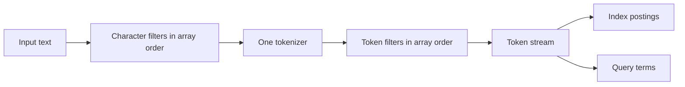

# Text Analyzer Pipelines

An analyzer converts source text into the token stream used by a full-text index or a search expression. UQA-RS analyzers are ordered, named, field-bound pipelines; analyzer selection is therefore part of the search schema rather than a presentation-only setting.

## Pipeline model

Every analyzer executes the same three stages:



Character filters transform the complete string before tokenization. The tokenizer creates tokens. Token filters then transform, remove, or expand those tokens in the configured order. Array order is semantic: moving lowercase, stemming, stop-word removal, synonyms, or n-grams changes the resulting vocabulary.

The indexing phase analyzes document field values before writing postings. The search phase analyzes query leaves before posting lookup and scoring. A field can use an analyzer for `index`, `search`, or `both`; `both` is the default and is the safest choice when one vocabulary must be shared by documents and queries.

## Built-in analyzers

| Name | Pipeline | Typical use |
| --- | --- | --- |
| `standard` | `standard` tokenizer, lowercase, ASCII folding, English stop words, Porter stemming | Default English-oriented prose |
| `whitespace` | `whitespace` tokenizer, lowercase | Pre-segmented text whose punctuation must remain inside tokens |
| `standard_cjk` | `standard` pipeline followed by character n-grams from 2 through 3 with short-token retention | CJK-style text and substring-oriented matching |
| `keyword` | `keyword` tokenizer with no filters | Treat the complete non-empty field as one exact token |

`standard` is the default analyzer when a GIN field has no explicit assignment. `standard_cjk` is a character n-gram extension, not a language-specific morphological segmenter. SQL `list_analyzers()` includes the four built-ins and custom catalog analyzers.

Bind the CJK-oriented built-in directly to an indexed field; it does not need a custom JSON definition:

```sql
SELECT * FROM set_table_analyzer(
    'articles',
    'body',
    'standard_cjk',
    'both'
);
```

## JSON configuration shape

A custom analyzer is stored as JSON with one tokenizer and optional ordered filter arrays:

```json
{
  "char_filters": [
    {"type": "html_strip"}
  ],
  "tokenizer": {"type": "standard"},
  "token_filters": [
    {"type": "lowercase"},
    {"type": "ascii_folding"},
    {"type": "stop", "language": "english", "custom_words": ["manual"]},
    {"type": "synonym", "synonyms": {"car": ["automobile"], "automobile": ["car"]}},
    {"type": "length", "min_length": 2, "max_length": 24}
  ]
}
```

`html_strip` and `ascii_folding` are the serialized names and must be written exactly. The tokenizer defaults to `whitespace` when omitted; both filter arrays default to empty. This empty default is case-sensitive and differs from the built-in analyzer named `whitespace`, which adds lowercase filtering. The tokenizer and parameterless token filters also accept string shorthand, such as `{"tokenizer":"keyword","token_filters":["lowercase"]}`, but canonical object form is clearer when configurations are reviewed or generated.

## Character filters

| JSON type | Configuration | Behavior |
| --- | --- | --- |
| `html_strip` | None | Replaces tag-shaped text with spaces and decodes the built-in `amp`, `lt`, `gt`, `quot`, `#39`, `apos`, and `nbsp` entities |
| `mapping` | `mapping` object | Applies string replacements longest-key-first |
| `pattern_replace` | `pattern`, optional `replacement` | Replaces every Rust regular-expression match; replacement defaults to an empty string |

The HTML filter is a search normalization filter, not a validating HTML parser or sanitizer. Sanitize untrusted HTML at the application boundary according to its rendering context.

## Tokenizers

| JSON type | Configuration | Behavior |
| --- | --- | --- |
| `whitespace` | None | Splits with Unicode whitespace boundaries |
| `standard` | None | Extracts Unicode regular-expression word runs, including letters, digits, and underscores |
| `letter` | None | Extracts ASCII letter runs with `[a-zA-Z]+` |
| `n_gram` | `min_gram`, `max_gram` | Emits every character n-gram in the inclusive range for each whitespace-delimited word |
| `pattern` | `pattern` | Splits on a Rust regular expression and discards empty pieces |
| `keyword` | None | Emits the complete non-empty input as one token |

N-gram bounds require `min_gram > 0` and `max_gram >= min_gram`. A pattern tokenizer must contain a valid Rust regular expression.

## Token filters

| JSON type | Configuration | Behavior |
| --- | --- | --- |
| `lowercase` | None | Applies Unicode lowercase conversion |
| `stop` | Optional `language`, optional `custom_words` | Removes built-in English stop words plus exact custom words; the default language is `english` |
| `porter_stem` | None | Applies the built-in Porter stemmer |
| `ascii_folding` | None | Uses Unicode decomposition to fold characters with ASCII equivalents and preserves characters without one |
| `synonym` | Inline `synonyms` or `synonyms_path` | Retains each source token and appends its configured expansions |
| `ngram` | `min_gram`, `max_gram`, optional `keep_short` | Emits every character n-gram; a shorter token is retained only when `keep_short` is true |
| `edge_ngram` | `min_gram`, `max_gram` | Emits token prefixes in the inclusive range |
| `length` | Optional `min_length`, optional `max_length` | Retains tokens inside the character-count range; `max_length = 0` means no upper bound |

Only `english` has a built-in stop-word list. Other language strings contribute no built-in words, although `custom_words` still apply. Put `lowercase` before stop words or lowercase synonym keys when matching should be case-insensitive. Put synonyms before or after stemming deliberately because synonym keys and expansions are interpreted at that exact point in the stream.

## Create and bind an analyzer with SQL

Register the JSON under a catalog name:

```sql
SELECT * FROM create_analyzer(
    'html_vehicle',
    $analyzer$
{
  "char_filters": [{"type": "html_strip"}],
  "tokenizer": {"type": "standard"},
  "token_filters": [
    {"type": "lowercase"},
    {"type": "synonym", "synonyms": {"car": ["automobile"], "automobile": ["car"]}}
  ]
}
$analyzer$
);
```

List SQL catalog and built-in analyzer names:

```sql
SELECT analyzer_name
FROM list_analyzers()
ORDER BY analyzer_name;
```

There are two binding paths. A GIN index can own the analyzer as part of its DDL:

```sql
CREATE INDEX articles_body_gin
ON articles USING gin (body)
WITH (analyzer = 'html_vehicle');
```

The DDL path applies the analyzer to both indexing and search, validates the name, and backfills existing rows. Because the analyzer name remains part of the durable index definition, change this choice by dropping and recreating the GIN index.

Alternatively, create the GIN index without an analyzer option and manage the field assignment separately:

```sql
CREATE INDEX articles_body_gin
ON articles USING gin (body);

SELECT * FROM set_table_analyzer(
    'articles',
    'body',
    'html_vehicle',
    'both'
);
```

`set_table_analyzer` requires an existing `TEXT` column already present in a physical GIN index. One durable assignment is recorded per table field, so a later call replaces the previous catalog record. A phase-specific call updates only its selected in-memory side and does not clear the other side; do not layer separate index and search calls because only the last assignment is restored after reopen. Prefer one `both` assignment unless an asymmetric pipeline has a tested lifecycle. Use either DDL ownership or field-assignment ownership for a field; do not depend on a mixture of both catalog paths.

## Analyzer phases

| Phase | Document writes | Existing postings | Query analysis |
| --- | --- | --- | --- |
| `index` | Uses the assigned analyzer | Rebuilt immediately when assigned | Uses an explicit search analyzer when present, otherwise falls back to the index analyzer |
| `search` or `query` | Keeps the current index analyzer | Not rebuilt | Uses the assigned analyzer |
| `both` | Uses the assigned analyzer | Rebuilt immediately when assigned | Uses the assigned analyzer |

Asymmetric phases are useful only when the resulting search terms remain compatible with the indexed vocabulary. Search-time synonym expansion is a common intentional asymmetry because one query token can be unioned across several existing posting terms. Index-only stemming or n-grams require a compatible search pipeline or queries can produce terms that do not exist in the index.

## Search and inspect the result

All text retrieval paths resolve the field's search analyzer, including typed text search, `text_match`, `fts_match`, Bayesian BM25, and multi-field retrieval:

```sql
SELECT id, title, _score
FROM articles
WHERE text_match(body, 'car')
ORDER BY _score DESC, id ASC;
```

Inspect physical index counts and the recorded analyzer name:

```sql
SELECT table_name, field, analyzer, posting_count,
       indexed_doc_count, term_count, total_field_length
FROM fts_index_stats('articles')
ORDER BY field;
```

The CLI command `\da` and `Engine::list_named_analyzers` list custom engine-catalog analyzer names. SQL `list_analyzers()` additionally includes the four built-ins.

## Change or remove a custom analyzer

An assigned analyzer cannot be dropped. For a field-assignment-owned analyzer, assign a replacement first and then drop the custom definition:

```sql
SELECT * FROM set_table_analyzer(
    'articles',
    'body',
    'standard',
    'both'
);

SELECT * FROM drop_analyzer('html_vehicle');
```

Changing the `index` or `both` phase rebuilds the complete full-text index before the assignment is published. A failure restores the prior analyzer and postings. If the analyzer was named in `CREATE INDEX ... WITH (analyzer = ...)`, drop and recreate that index with the replacement before dropping the custom analyzer.

## Rust APIs

Durable engine configuration uses JSON through `Engine`:

```rust
use uqa_engine::Engine;

let engine = Engine::new();
let config = r#"{
  "tokenizer":{"type":"standard"},
  "token_filters":[{"type":"lowercase"},{"type":"porter_stem"}],
  "char_filters":[{"type":"html_strip"}]
}"#;

engine.register_named_analyzer("html_english", config)?;
engine.sql("CREATE TABLE docs (id INTEGER PRIMARY KEY, body TEXT)", &[])?;
engine.sql("CREATE INDEX docs_body_gin ON docs USING gin (body)", &[])?;
engine.set_table_field_analyzer("docs", "body", "html_english", "both")?;

let assignment = engine.table_field_analyzer("docs", "body")?;
assert_eq!(assignment, Some(("html_english".into(), "both".into())));
# Ok::<(), Box<dyn std::error::Error>>(())
```

The corresponding methods are `register_named_analyzer`, `list_named_analyzers`, `set_table_field_analyzer`, `table_field_analyzer`, `get_table_analyzer`, and `drop_named_analyzer`; compatibility aliases use `create_analyzer`, `set_table_analyzer`, and `drop_analyzer`.

Construct an analyzer directly when an application needs to preview tokens or use analysis outside an engine catalog:

```rust
use uqa_analysis::{Analyzer, CharFilter, TokenFilter, Tokenizer};

let analyzer = Analyzer::new(
    Tokenizer::Standard,
    vec![TokenFilter::Lowercase, TokenFilter::PorterStem],
    vec![CharFilter::HTMLStrip],
);
assert_eq!(analyzer.analyze("<p>Running</p>")?, vec!["run"]);
# Ok::<(), Box<dyn std::error::Error>>(())
```

The process-global `uqa_analysis::register_analyzer` registry is not catalog persistence. Use the engine or SQL registration path for a persistent field assignment; otherwise a later process can reopen a field mapping whose process-local analyzer was never registered.

## Python, Node.js, and browser WASM

Every binding can create, bind, inspect, search with, and drop analyzers by executing the SQL functions in this chapter. Python exposes `list_named_analyzers()`. Node.js and browser WASM expose `listNamedAnalyzers()`; these direct methods list custom engine-catalog names, while SQL `list_analyzers()` also includes built-ins. Direct construction from `CharFilter`, `Tokenizer`, and `TokenFilter` is a Rust API, so other bindings define the pipeline as JSON passed to SQL.

## File-backed synonyms

The synonym filter accepts a reloadable file path:

```json
{
  "type": "synonym",
  "synonyms_path": "/srv/uqa/synonyms.txt"
}
```

The file format accepts comments, one-way mappings, and equivalent groups:

```text
# One-way expansion
car => automobile, vehicle

# Every member expands to the others
fast, quick, rapid
```

Registration reads the file once to reject a missing or unreadable path. Analysis reads it again on every execution, so edits are visible without re-registering the analyzer and later deletion or permission loss becomes an explicit indexing or search error. The catalog stores the path, not a copy of the file; every process and reopen environment must provide the same resource. Use inline synonyms when the catalog must be self-contained.

## Validation and operational rules

- Registration parses JSON, normalizes supported string shorthand, validates regular expressions and gram bounds, and validates a configured synonym file before publishing catalog state.
- Analyzer names must be non-empty when resolved. Use custom names that do not collide with `standard`, `whitespace`, `standard_cjk`, or `keyword`.
- A field assignment requires an existing table, a `TEXT` column, and a physical GIN field.
- Index-time analysis failure aborts the document write without publishing partial row or posting state.
- Persistent analyzer definitions and assignments are restored during engine reopen; an invalid catalog configuration makes reopen fail explicitly.
- SQL `uqa_highlight` currently uses the built-in English `standard` analyzer and does not inherit a table-field analyzer. The typed `uqa_analysis::highlight` API accepts an explicit analyzer.

## Related documentation

- [Analyzer SQL](../sql/05-analyzers.md)
- [Analyzer pipeline tutorial](../tutorials/03-analyzer-pipelines.md)
- [Search and ranking](05-search-and-ranking.md)
- [Analyzer internals](../internals/04-analyzer-pipeline.md)
