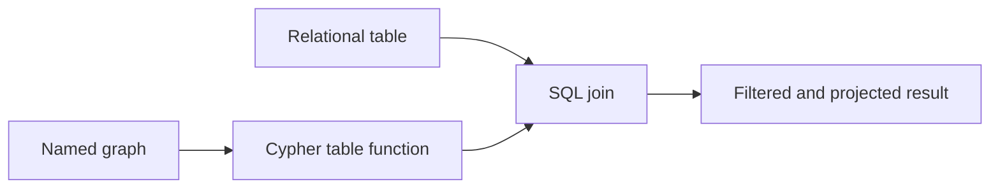

# Graphs

UQA-RS stores named property graphs and composes graph results with relational SQL. Applications can use typed engine methods, Cypher through a SQL table function, regular path queries, and graph analytics functions.

## Create a named graph

From SQL:

```sql
SELECT create_graph('social') AS created;
```

From Rust:

```rust
engine.create_graph("social")?;
```

Graph names share durable catalog state. `drop_graph` removes a graph and its contents, so treat it as destructive DDL.

## Execute Cypher through SQL

The PostgreSQL AGE-shaped entry point is the `cypher` table function:

```sql
SELECT *
FROM cypher('social', $$
    CREATE (n:Person {member_id: 1, name: 'alice', age: 34})
$$) AS (ignored agtype);
```

Every table function call needs a column definition list. Use an ignored `agtype` column for a mutation that returns no values.

Create an edge:

```sql
SELECT *
FROM cypher('social', $$
    MATCH (a:Person {name: 'alice'}), (b:Person {name: 'bob'})
    CREATE (a)-[:FOLLOWS]->(b)
$$) AS (ignored agtype);
```

Read graph values:

```sql
SELECT name, age
FROM cypher('social', $$
    MATCH (n:Person)
    WHERE n.age > 30
    RETURN n.name, n.age
$$) AS (name agtype, age agtype)
ORDER BY name;
```

UQA-RS accepts typed definition lists such as `member_id int` when the returned property should join directly to a relational integer. This is a UQA-RS extension to the AGE-shaped interface.

## Supported Cypher surface

The implemented subset includes:

- `MATCH` and `OPTIONAL MATCH`
- Node, directed edge, fixed-length, and variable-length patterns
- Path variables
- `CREATE` and `MERGE`
- `ON CREATE SET` and `ON MATCH SET`
- `SET`, `DELETE`, and `DETACH DELETE`
- `WHERE`, `RETURN`, `WITH`, and `DISTINCT`
- Aggregation, `ORDER BY`, `SKIP`, and `LIMIT`
- `UNWIND`
- Parameters through the typed `run_cypher` API

Consult [Graph SQL and Cypher](../sql/07-graph.md) for grammar details and compatibility boundaries.

## Compose graph and relational data

A Cypher result is a relation, so it can be joined, filtered, grouped, or used inside a subquery:

```sql
SELECT m.member_id, m.name, m.city
FROM members AS m
JOIN cypher('social', $$
    MATCH (:Person {name: 'alice'})-[:FOLLOWS]->(p:Person)
    RETURN p.member_id
$$) AS followed(member_id int)
    ON followed.member_id = m.member_id
WHERE m.city = 'seoul'
ORDER BY m.member_id;
```



## Typed Cypher API

`Engine::run_cypher(graph, query, params)` executes Cypher directly and returns an `SQLResult`. Bind parameter values through the provided map rather than building untrusted Cypher text.

Python exposes `run_cypher`, Node.js exposes `runCypher` and `runCypherSync`, and browser WASM exposes the corresponding asynchronous request path.

## Regular path queries

`rpq` evaluates a regular expression over edge labels. Its expression language supports:

- A label atom
- Parentheses
- Concatenation with `/`
- Alternation with `|`
- Repetition with `*` or `{min,max}`

Precedence is repetition, then concatenation, then alternation. The compiler limits syntax depth and automaton size to bound hostile or accidental query growth. The current limits are 256 AST levels and 16,384 NFA or DFA states.

## Traversal and analytics

SQL retrieval functions include graph traversal, neighbors, edge inspection, PageRank, HITS, and betweenness centrality. Graph results can also participate in scored retrieval and fusion. Function signatures are listed in [Graph SQL and Cypher](../sql/07-graph.md).

## Mutation behavior

Graph mutations participate in engine transaction state. Use an explicit SQL transaction when graph and relational changes must commit together. `MERGE` is the idempotent creation path for a matched pattern; `CREATE` always creates. `DELETE` requires normal relationship safety, while `DETACH DELETE` removes incident relationships with the node.

## Path indexes

The engine API can create, list, and drop path indexes for repeated graph path workloads. A path index is durable with the graph catalog. Validate its query shape and refresh behavior against the workload before relying on it for a latency target.

## Related material

- [Graph tutorial](../tutorials/05-graphs-and-cypher.md)
- [Graph SQL reference](../sql/07-graph.md)
- [Graph runtime internals](../internals/06-graph-runtime.md)
