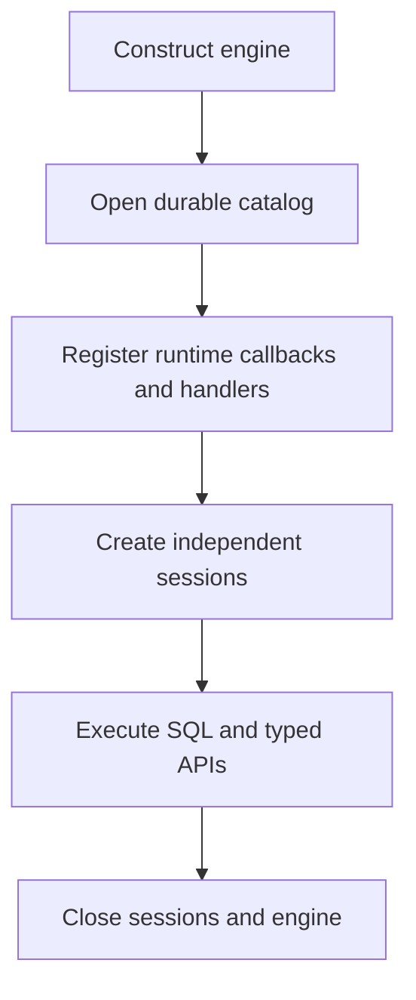

# Bindings and Extensions

UQA-RS exposes the same durable engine through Rust, Python, Node.js, and browser WASM. Rust has the widest low-level extension surface; other bindings focus on SQL, retrieval, graphs, and common runtime integrations.

## Capability overview

| Capability | Rust | Python | Node.js | Browser WASM |
| --- | --- | --- | --- | --- |
| In-memory SQL | Yes | Yes | Yes | Yes |
| Persistent SQLite | Yes | Yes | Yes | IndexedDB-backed filesystem |
| SQLCipher | Yes | Yes | Yes | No |
| Text, vector, and hybrid APIs | Yes | Yes | Yes | Yes |
| Custom analyzer catalog through SQL | Yes | Yes | Yes | Yes |
| Cypher | Yes | Yes | Yes | Yes |
| Runtime scalar/table/aggregate callbacks | Yes | Yes | No | No |
| Native DuckDB and Arrow FDWs | Yes | Build dependent | Build dependent | No |
| Independent persistent sessions | Yes | Engine dependent | Yes | Yes |

Check the type declaration files in the target package for the exact release surface.

Across every binding, `hybrid_search` or `hybridSearch` uses exact signed single-prior log-odds fusion and has no `alpha` argument. The separately named `robust_hybrid_search` or `robustHybridSearch` accepts `alpha` and selects gated, confidence-scaled positive-evidence pooling. SQL follows the same split: mixed same-relation text and vector conjunctions are exact by default, `fuse_bayesian_evidence` and `fuse_log_odds` are exact explicit functions, and `pool_positive_evidence` is the explicit heuristic.

## Rust QueryBuilder

`uqa_api::QueryBuilder` builds SQL-shaped plans fluently:

```rust
use uqa_api::QueryBuilder;

let result = QueryBuilder::new(&engine, "articles")
    .select_columns(&["id", "title", "_score"])
    .text_match("body", "embedded database")
    .order_by_desc("_score")
    .limit(10)
    .execute()?;
# Ok::<(), Box<dyn std::error::Error>>(())
```

The builder covers comparison predicates, text and KNN matching, multi-field and staged retrieval, aggregation, facets, graph traversal, RPQ, temporal traversal, highlighting, Bayesian and learned fusion, sparse thresholds, and model operators. `to_sql()` is useful for diagnostics. Raw fragments still require application-side trust validation.

Columnar execution helpers support Arrow and Parquet consumers where those features are enabled.

## Python

The Python package is named `uqa` and is built with pyo3 and maturin. It targets the stable `abi3` interface beginning with Python 3.8.

```python
import uqa

engine = uqa.Engine()
engine.sql("CREATE TABLE notes (id INTEGER PRIMARY KEY, body TEXT)")
engine.sql(
    "INSERT INTO notes (id, body) VALUES ($1, $2)",
    [1, "hello"],
)
result = engine.sql("SELECT id, body FROM notes WHERE id = $1", [1])
print(result.rows)
engine.close()
```

Use `uqa.vector(values)` and `uqa.tensor(rows)` for explicit retrieval parameters. The binding includes document, search, calibration, graph, introspection, cancellation, batch SQL, encrypted and compressed open paths, and scalar, table, and aggregate Python callbacks.

Heavy engine work releases the Python interpreter lock where the method contract permits it. A Python callback necessarily re-enters Python.

## Node.js

The Node-API package requires Node.js 16 or newer. Expensive query and search methods have asynchronous forms; selected operations also expose `Sync` variants.

```typescript
import { Engine } from "uqa";

const engine = new Engine();
await engine.sql("CREATE TABLE notes (id INTEGER PRIMARY KEY, body TEXT)");
await engine.sql(
  "INSERT INTO notes (id, body) VALUES ($1, $2)",
  [1, "hello"],
);
const result = await engine.sql(
  "SELECT id, body FROM notes WHERE id = $1",
  [1],
);
console.log(result.rows);
engine.close();
```

Use `SQLParam.vector` or a typed numeric array for vector input. Node.js does not expose native JavaScript UDF callbacks; implement reusable logic in SQL, Rust, or an external data source.

## Browser WASM

The browser binding uses an Emscripten build. Initialization is asynchronous, and persistent files are synchronized to IndexedDB.

```javascript
await UQA.load();
const engine = await Engine.open(`${UQA.persistDir}/notes.uqa`);
await engine.sql("CREATE TABLE IF NOT EXISTS notes (id INTEGER PRIMARY KEY)");
await UQA.persist();
```

Persist after important application checkpoints. SQLCipher and native DuckDB or Arrow FDW handlers are unavailable in the browser build.

## Analyzer pipelines across bindings

All four bindings can execute `create_analyzer`, `list_analyzers`, `set_table_analyzer`, `fts_index_stats`, and `drop_analyzer` through SQL. Python also exposes `list_named_analyzers()`, while Node.js and browser WASM expose `listNamedAnalyzers()` for custom engine-catalog names. Rust alone exposes direct `Analyzer`, `CharFilter`, `Tokenizer`, and `TokenFilter` construction. See [Text analyzer pipelines](06-text-analyzers.md) for the JSON schema and lifecycle.

## Rust and Python SQL functions

Scalar functions return one value per call. Table functions return a relation. Aggregate functions create per-group state, observe input rows, and finish with one result.

Registration options communicate optimizer safety:

| Property | Meaning |
| --- | --- |
| `IMMUTABLE` | Same result for the same arguments and no external state |
| `STABLE` | Stable within the statement but may observe statement context |
| `VOLATILE` | May vary per call or mutate state |
| Read-only | Callback cannot mutate engine-visible state |
| May mutate | Callback can change state and must be `VOLATILE` |

The default registration is `VOLATILE` and may mutate. Only request a more permissive optimizer contract after proving it. Runtime registrations are not durable and must be recreated after process restart.

See [Custom functions](../tutorials/07-custom-functions.md) and [Extension points](../internals/08-extension-points.md).

## Foreign data wrappers

SQL can register foreign servers and foreign tables. Built-in native server types are:

- `memory_fdw` for an in-process foreign relation
- `duckdb_fdw` for DuckDB sources and file expressions
- `arrow_fdw` for Arrow IPC files or streams

DuckDB server options include a database path, extensions, and S3 connection fields. Foreign table options select a DuckDB table or expression, or a Parquet, CSV, JSON, or NDJSON source with optional Hive partitioning. Arrow foreign tables select a file or stream IPC format.

Availability depends on the target build. Validate server type and options at registration time, and never place long-lived secrets in SQL files or catalog options that are exported or logged.

## Extension lifecycle



Register extensions before accepting concurrent work. Because new sessions share runtime registries, a process can establish one extension set and then create isolated SQL sessions over it.
