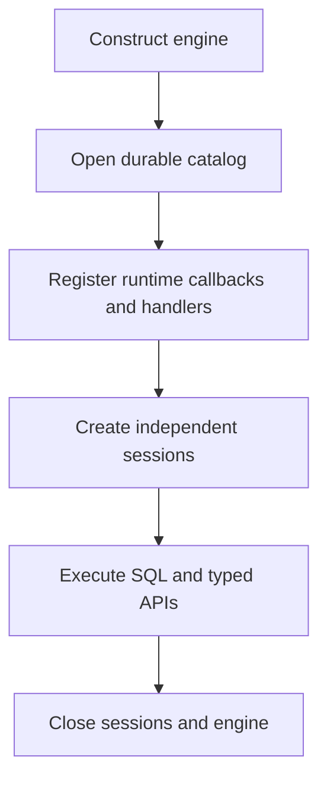

# Bindings and Extensions

UQA Engine exposes the same durable embedded engine through Rust, Python, Node.js, and browser WASM, and exposes direct local and Cloud HTTP SQL in those same environments. Rust has the widest low-level extension surface; other bindings focus on SQL, retrieval, graphs, and common runtime integrations.

## Capability overview

| Capability | Rust | Python | Node.js | Browser WASM |
| --- | --- | --- | --- | --- |
| In-memory SQL | Yes | Yes | Yes | Yes |
| Persistent SQLite | Yes | Yes | Yes | IndexedDB-backed filesystem |
| SQLCipher | Yes | Yes | Yes | No |
| Text, vector, and hybrid APIs | Yes | Yes | Yes | Yes |
| Custom analyzer catalog through SQL | Yes | Yes | Yes | Yes |
| Native Nori analyzer and `analyze_text` diagnostics | Feature-enabled | Bundled | Bundled | Bundled |
| Native Kuromoji, completion and Japanese diagnostics | Feature-enabled | Default | Default | Default |
| Cypher | Yes | Yes | Yes | Yes |
| Runtime scalar/table/aggregate callbacks | Yes | Yes | Yes | Yes |
| Native DuckDB and Arrow FDWs | Yes | Build dependent | Build dependent | No |
| Independent persistent sessions | Yes | Engine dependent | Yes | Yes |
| Local and Cloud HTTP SQL/batch/stream | Yes | Yes | Yes | Yes, subject to CORS |
| Project lookup through installed `uqa` CLI | Yes | Yes | Yes | No |

Check the type declaration files in the target package for the exact release surface.

The 0.4.9 CLI and language-binding builds enable both `nori` and `kuromoji`; the Rust Engine and facade retain empty defaults. Use `--no-default-features` and optional `--features nori` or `--features kuromoji` for a smaller custom artifact. Each process opening a persistent database must provide its retained analyzer features and exact resources. The [Japanese binding contract](../../../tests/parity/kuromoji/BINDINGS.md) describes shared SQL verification, and the [upgrade notes](10-upgrading.md#japanese-analysis-and-distribution-features) describe feature selection and Rust source migration from 0.3.0.

The HTTP class is named `HttpEngine` in every package. Rust and Python reuse `uqa-client`; Node.js implements the same typed protocol in JavaScript using its built-in HTTP modules. All three can resolve local or Cloud projects through the installed CLI once during construction. Browsers use `fetch` and require explicit connection material. See the [HTTP Engine reference](09-http-engine.md) for construction, lifecycle, CORS, request metadata, and streaming contracts.

Across every binding, `hybrid_search` or `hybridSearch` uses exact signed single-prior log-odds fusion and has no `alpha` argument. The separately named `robust_hybrid_search` or `robustHybridSearch` accepts `alpha` and selects gated, confidence-scaled positive-evidence pooling. SQL follows the same split: mixed same-relation text and vector conjunctions are exact by default, `fuse_bayesian_evidence` and `fuse_log_odds` are exact explicit functions, and `pool_positive_evidence` is the explicit heuristic.

## Runnable parity suite

The repository provides the same five complete scenarios for every public binding: unified search, vector KNN, graph and Cypher, storage and transactions, and extensibility. Use the [example matrix](../../../examples/README.md) to move between equivalent implementations.

| Target | Examples |
| --- | --- |
| Rust | [`examples/rust`](../../../examples/rust) |
| Python | [`examples/python`](../../../examples/python) |
| Node.js | [`examples/node`](../../../examples/node) |
| Browser WASM | [`examples/browser`](../../../examples/browser) |

The binding workflows execute all five scenarios through their built artifacts. The vector example compares exact, HNSW, IVF and DiskANN access, binds vector/query parameters, and checks canonical scores, private rollback, committed changes and closed reopen. DiskANN configuration uses the same [SQL options](../sql/02-ddl.md#diskann-vector-indexes) in every binding and is independent of Nori/Kuromoji features. The Browser WASM directory also provides an HTML runner for interactive use. Its modules run against the generated Emscripten package under Node.js and in real Chrome; `scripts/verify-examples-browser.py` additionally verifies DiskANN after an IndexedDB checkpoint and a fresh page/module load.

The binding transaction tests also exercise an independent session's commit while the first session retains private writes, then verify commit, rollback or savepoint undo and closed reopen. Python and Node.js cover ordinary, compressed, encrypted and compressed-encrypted native SQLite files; WASM covers ordinary and compressed files. Each target checks READ UNCOMMITTED/READ COMMITTED command refresh and REPEATABLE READ/SERIALIZABLE fixed visibility against the shared PostgreSQL reference fixture. `scripts/verify-concurrent-transactions-browser.py` additionally runs the browser cases in real Chrome and verifies committed state after an IndexedDB checkpoint and a fresh page/module load. These schedules exercise the providers exposed by each binding; redb remains covered through its Rust provider APIs.

## Rust QueryBuilder

`uqa_api::QueryBuilder` builds SQL-shaped plans fluently:

```rust
use uqa_api::QueryBuilder;

let result = QueryBuilder::new(&engine, "articles")
    .select_columns(&["id", "title", "_score"])
    .text_match("body", "embedded database")
    .order_by_desc("_score")
    .limit(10)
    .execute()?;
# Ok::<(), Box<dyn std::error::Error>>(())
```

The builder covers comparison predicates, text and KNN matching, multi-field and staged retrieval, aggregation, facets, graph traversal, RPQ, temporal traversal, highlighting, Bayesian and learned fusion, sparse thresholds, and model operators. `to_sql()` is useful for diagnostics. Raw fragments still require application-side trust validation.

Columnar execution helpers support Arrow and Parquet consumers where those features are enabled.

## Python

The Python package is named `uqa` and is built with pyo3 and maturin. It targets the stable `abi3` interface beginning with Python 3.8. Installing it also installs the `usql` console command into the same Python environment.

```python
import uqa

engine = uqa.Engine()
engine.sql("CREATE TABLE notes (id INTEGER PRIMARY KEY, body TEXT)")
engine.sql(
    "INSERT INTO notes (id, body) VALUES ($1, $2)",
    [1, "hello"],
)
result = engine.sql("SELECT id, body FROM notes WHERE id = $1", [1])
print(result.rows)
engine.close()
```

Use `uqa.vector(values)` and `uqa.tensor(rows)` for explicit retrieval parameters. The binding includes document, search, calibration, graph, introspection, cancellation, batch SQL, encrypted and compressed open paths, and scalar, table, and aggregate Python callbacks. Callback registration accepts keyword-only `volatility` and `may_mutate_engine` options.

Heavy engine work releases the Python interpreter lock where the method contract permits it. A Python callback necessarily re-enters Python.

### Notification subscriptions

UQA Engine 0.4.9 provides `engine.subscribe_notifications(channels, *, options)` and `engine.subscribe_notifications_async(channels, *, options)` to both `Engine` and `HttpEngine`. The synchronous call returns a ready `NotificationSubscription` supporting `with`, iteration, `next_event()` and `close()`. The asynchronous call returns a one-use awaitable and asynchronous context manager; awaiting it returns an `AsyncNotificationSubscription` supporting `async for` and `aclose()`. HTTP readiness requires a valid protocol `ready` event, and an unsupported endpoint raises `NotificationError` without falling back to SQL `LISTEN`. The installed Python HTTP adapter is tested against the actual authenticated Cloud Node; see the [source-bound evidence and deployment scope](../../plans/0015-sql-notifications-and-sse.md).

`channels` is a nonempty sequence of unique, nonempty, NUL-free exact UTF-8 strings, each at most 63 bytes. Embedded options use `NotificationSubscriptionOptions` with five required positive limits: `max_active_subscriptions`, `max_channels`, `max_queued_notifications`, `max_queued_bytes` and `max_registry_entries_per_poll`. They retain the [Rust listener's admission and queue accounting](02-rust-engine-api.md#independent-owned-listeners). HTTP uses `HttpNotificationOptions` with required positive `max_channels`, `max_queued_events`, `max_queued_bytes`, `max_transport_chunk_bytes`, `connect_timeout_ms`, `ready_timeout_ms` and `max_idle_timeout_ms`. Optional `retry` accepts `NotificationRetryOptions(max_attempts=..., episode_timeout_ms=..., initial_backoff_ms=..., max_backoff_ms=..., max_retry_after_ms=...)`; `None` disables reconnect. These map directly to the [Rust HTTP limits and budget validation](09-http-engine.md#rust-notification-subscriptions), without inferred deployment defaults.

Creating an embedded asynchronous registration reserves its original Engine's shared subscription capacity immediately, before returning the awaitable or submitting executor work. An unstarted registration therefore counts toward `max_active_subscriptions`, and capacity exhaustion can raise `NotificationError` from the factory call itself. Starting the awaitable transfers the same reservation into its listener; failed or abandoned registration cleanup releases it.

Each frozen `NotificationEvent` has `kind` equal to `notification`, `resync_required` or `reconnected`, plus `epoch` and optional `request_id`. Notification events additionally expose exact Python integer `sequence` and `process_id`, and unchanged string `channel` and `payload`; these four fields are `None` for lifecycle events. A resynchronization event supplies a stable `cause` code. Python integers preserve the entire unsigned 64-bit sequence range. `Reconnected` changes the handle's visible identity before that event is returned and precedes replacement data. An embedded handle has no HTTP request identity.

An embedded subscription retains the original memory or persistent database, encryption and selected role independently of its creating Engine's transaction and low-level SQL listener. Closing the creating Engine does not close that subscription. Synchronous registration, receive and cleanup release the GIL; asynchronous receive waits without occupying a Python executor thread. Use one consumer and one asyncio loop per asynchronous handle. Receive/registration cancellation signals and joins the actual native operation and resource cleanup before raising `asyncio.CancelledError`, including when the task is cancelled again while cleaning up. `close()` and `aclose()` are idempotent; explicit closure ends a pending iteration normally. Garbage collection schedules fallback cleanup but is not a completion boundary. Close every retained subscription before replacing database files.

Native failures raise `NotificationError` with a content-free `code` and typed `failure`. `NotificationFailure` exposes its code, optional HTTP status, original/last-attempt retry failures and an explicitly requested private `diagnostic`. Normal representations omit payloads, channels and credentials. Invalid concurrent consumers and repeated registration awaits use the same stable `NOTIFICATION_INVALID_REQUEST` error. Python argument type/range conversion can also raise ordinary Python exceptions before admission. `is_closed` describes ended delivery; explicit close/context exit establishes cleanup completion. The [Python preservation proof](../../design/python-notification-subscriptions.md) states exact conversion, lifecycle correspondence and resource-accounting limits.

The following limits serve this small memory fixture and are not capacity recommendations:

```python
import asyncio
import uqa

options = uqa.NotificationSubscriptionOptions(
    max_active_subscriptions=2, max_channels=1,
    max_queued_notifications=2, max_queued_bytes=8192,
    max_registry_entries_per_poll=2,
)
engine = uqa.Engine()
with engine.subscribe_notifications(["jobs"], options=options) as subscription:
    engine.sql("NOTIFY jobs, 'committed'")
    event = next(subscription)
    assert (event.sequence, event.payload) == (1, "committed")

async def consume():
    async with engine.subscribe_notifications_async(["jobs"], options=options) as subscription:
        engine.sql("NOTIFY jobs, 'async'")
        async for event in subscription:
            assert event.payload == "async"
            break

asyncio.run(consume())
engine.close()
```

## Node.js

The Node-API package requires Node.js 16 or newer. Expensive query and search methods have asynchronous forms; selected operations also expose `Sync` variants.

Install the `@cognica-io/uqa` package from npm. npm selects the matching exact-version native optional package published under `@cognica-io` for the current supported operating system and CPU.

HTTP-only applications can use `npm install --omit=optional @cognica-io/uqa`. Importing `HttpEngine`, its streaming class, and SQL parameter helpers from either `@cognica-io/uqa` or `@cognica-io/uqa/http` works without a native addon. Embedded engine constructors and operations load the addon when first used.

```sh
npm install @cognica-io/uqa
```

```typescript
import { Engine } from "@cognica-io/uqa";

const engine = new Engine();
await engine.sql("CREATE TABLE notes (id INTEGER PRIMARY KEY, body TEXT)");
await engine.sql(
  "INSERT INTO notes (id, body) VALUES ($1, $2)",
  [1, "hello"],
);
const result = await engine.sql(
  "SELECT id, body FROM notes WHERE id = $1",
  [1],
);
console.log(result.rows);
engine.close();
```

Node.js exposes scalar, table, and aggregate JavaScript callbacks through `registerScalarFunction`, `registerTableFunction`, and `registerAggregateFunction`:

```javascript
engine.registerScalarFunction(
  "normalize_label",
  (value) => value.trim().toLowerCase().replaceAll(" ", "-"),
  { volatility: "immutable", mayMutateEngine: false },
);
const normalized = await engine.sql("SELECT normalize_label($1) AS label", [" SQL Manual "]);
```

Use `SQLParam.vector` or a typed numeric array for vector input. JavaScript callbacks always return synchronously, including when SQL is executed through `sql`; returning a `Promise` is an error. The asynchronous SQL path runs the engine on a worker and dispatches callback execution to the owning JavaScript thread.

### Native notification subscriptions

UQA Engine 0.4.9 provides `await engine.subscribeNotifications(channels, options)`. The Promise returns a ready `NotificationSubscription` with `nextEvent()`, `next()`, asynchronous iteration, `close()`, `return()` and `throw(error)`. The same method name on `HttpEngine` uses the [HTTP notification contract](09-http-engine.md#nodejs-http-notification-subscriptions). An embedded subscription uses its original Engine hub and provider directly.

`channels` is a nonempty array of unique, nonempty, NUL-free strings, each at most 63 UTF-8 bytes. Names retain exact case and Unicode; lone surrogates are rejected. `options` requires five positive safe integers: `maxActiveSubscriptions`, `maxChannels`, `maxQueuedNotifications`, `maxQueuedBytes` and `maxRegistryEntriesPerPoll`. They map to the [Rust admission and queue limits](02-rust-engine-api.md#independent-owned-listeners). Optional `signal` accepts an AbortSignal. These are explicit caller limits, not measured deployment defaults.

Native registration reserves the original Engine's shared allowance before entering the libuv work pool. Queued registrations count toward `maxActiveSubscriptions` alongside live handles, and another call cannot bypass a retained stricter limit. A full allowance rejects the Promise before submitting another registration task; readiness and close transfer and release the same reservation.

Each frozen event has `kind`, `epoch` and `requestId`. A native request identity is `null`. A `notification` additionally exposes exact unsigned 64-bit `sequence` as `bigint`, signed 32-bit `processId` as `number`, and unchanged string `channel` and `payload`; its `cause` is `null`. Lifecycle variants use the shared [event declarations](../../../crates/uqa-node/notifications.d.ts). `nextEvent()` returns `null` after normal close, and asynchronous iteration then ends. A second pending receive rejects with `NOTIFICATION_INVALID_REQUEST`.

Creation registers an independent idle listener without committing, rolling back or consuming the caller's transaction or SQL notification queue. Closing the query Engine leaves the retained subscription alive. Await `close()` or leave a `for await` loop to join original provider cleanup; repeated close calls join the same work. AbortSignal cancels registration or delivery, waits for cleanup and rejects pending receipt with `NOTIFICATION_CANCELLED`. `isClosed` reports ended delivery, not completed resource release. Idle waits do not occupy the libuv work pool. Garbage collection is a fallback; explicit close provides the resource-release boundary.

Failures use `NotificationError` with a stable content-free `code` and explicit private `diagnostic`. Queue overflow raises `NOTIFICATION_BACKPRESSURE`; the native failed inbox discards unread values, and its error remains observable after close, including concurrent close and receive. Ordinary inspection omits payload and channel content. The [native preservation and ownership proof](../../design/node-native-notifications.md) covers exact conversion, close races and Node environment teardown. Complete Cloud, platform and process-resource qualification remains in the [implementation ledger](../../plans/0015-sql-notifications-and-sse.md).

```javascript
import { Engine } from "@cognica-io/uqa";

const engine = new Engine();
const subscription = await engine.subscribeNotifications(["jobs"], {
  maxActiveSubscriptions: 2, maxChannels: 1,
  maxQueuedNotifications: 2, maxQueuedBytes: 8192,
  maxRegistryEntriesPerPoll: 2,
});
try {
  await engine.sql("NOTIFY jobs, 'refresh'");
  for await (const event of subscription) {
    if (event.kind === "notification") {
      console.log(event.sequence, event.payload);
      break;
    }
  }
} finally {
  await subscription.close();
  engine.close();
}
```

## Browser WASM

The browser binding uses an Emscripten build. Initialization is asynchronous, and persistent files are synchronized to IndexedDB.

```sh
npm install @cognica-io/uqa-wasm
```

```javascript
await UQA.load();
const engine = await Engine.open(`${UQA.persistDir}/notes.uqa`);
await engine.sql("CREATE TABLE IF NOT EXISTS notes (id INTEGER PRIMARY KEY)");
await engine.registerScalarFunction(
  "normalize_label",
  (value) => value.trim().toLowerCase().replaceAll(" ", "-"),
  { volatility: "immutable", mayMutateEngine: false },
);
await UQA.persist();
```

Persist after important application checkpoints. Browser callbacks use synchronous reverse dispatch from WASM into JavaScript; returning a `Promise` is an error. SQLCipher and native DuckDB or Arrow FDW handlers are unavailable in the browser build.

### Direct browser notification subscriptions

UQA Engine 0.4.9 exposes `await engine.subscribeNotifications(channels, options)` and the exported `NotificationSubscription` and `NotificationError` types. Channels are exact, unique, nonempty UTF-8 names of at most 63 bytes. Supply positive integer `maxActiveSubscriptions`, `maxChannels`, `maxQueuedNotifications`, `maxQueuedBytes` and `maxRegistryEntriesPerPoll` limits, plus an optional `signal: AbortSignal`. Browser limits must also fit the WASM addressable integer range. Registration snapshots input and resolves after all channels are ready, independently of the caller's SQL transaction.

The result is an async iterator with `nextEvent`, `next`, `return`, `throw`, `close`, `epoch`, `requestId` and `isClosed`. Event fields and typed failures match the [direct Node contract](#native-notification-subscriptions): notification sequences are exact `bigint`, direct request identities are null, overflow remains visible after cleanup, and only one receive may be pending. Waiting permits unrelated JavaScript execution. Abort and iterator cleanup stop the actual retained listener; repeated close joins that same cleanup. The source remains attached to its original WASM module after the query Engine closes, including memory, plain SQLite and compressed providers. Memory-only query Engines retain their existing restriction against `newSession`; a direct subscription does not invoke that factory.

```javascript
const engine = await Engine.inMemory();
const subscription = await engine.subscribeNotifications(["jobs"], {
  maxActiveSubscriptions: 8, maxChannels: 2, maxQueuedNotifications: 16,
  maxQueuedBytes: 65536, maxRegistryEntriesPerPoll: 8,
});
try {
  await engine.sql("NOTIFY jobs, 'ready'");
  const event = await subscription.nextEvent();
  if (event.sequence !== 1n || event.payload !== "ready") throw new Error("unexpected notification");
} finally {
  await subscription.close();
  await engine.close();
}
```

Use explicit close for deterministic cleanup. Registration and close use the existing synchronous WASM call boundary; idle receipt uses a native Future and a microtask wake, without a blocking wait or an additional Worker. Persisted SQL data can be restored in another runtime, but equal filenames in different pages, Workers or modules do not share notification delivery or provide replay. See the [preservation proof](../../design/wasm-direct-notifications.md) and [qualification ledger](../../plans/0015-sql-notifications-and-sse.md). Remote browser subscriptions use the separate [HTTP Fetch API](09-http-engine.md#browser-notification-subscriptions).

## Analyzer pipelines across bindings

All four bindings can execute `create_analyzer`, `list_analyzers`, `analyze_text`, `set_table_analyzer`, `fts_index_stats`, and `drop_analyzer` through SQL. The 0.4.9 Python, Node.js and browser WASM packages enable both `nori` and `kuromoji` by default. A build with that feature includes the native bundle: `list_analyzers` reports `nori`, and `analyze_text('nori', input)` returns the complete token and source-coordinate diagnostic. Python also exposes `list_named_analyzers()`, while Node.js and browser WASM expose `listNamedAnalyzers()` for custom engine-catalog names. Rust alone exposes direct `Analyzer`, `CharFilter`, `Tokenizer`, and `TokenFilter` construction. See [Text analyzer pipelines](06-text-analyzers.md) for the JSON schema and lifecycle.

The [persistent Nori binding contract](../../../tests/parity/nori/BINDINGS.md) exercises the same user dictionary, complete diagnostics, graph phrases, original-source highlighting, failed registration, rollback, and retained revisions through all four APIs. Actual custom builds without Nori also verify explicit missing-feature errors and generic analyzer persistence. Use `--no-default-features` with maturin, NAPI, or `scripts/build-wasm.sh` to produce those custom artifacts. The WASM build script accepts `--output-dir DIR` for a separate generated `uqa.js`/`uqa.wasm` pair; use the matching `index.mjs` wrapper with it. [Real-browser verification](../../../benchmarks/nori/BROWSER.md) additionally closes the Engine, synchronizes IndexedDB, reloads the whole page/WASM module, and verifies the restored catalog and index.

The 0.4.9 Python, Node.js and WASM artifacts retain complete upstream Nori and Kuromoji notices, including IPADIC attribution, source modifications and both source-resource/model manifests in `THIRD-PARTY/`. Python wheels also list those files in their license metadata. Both dictionaries stay embedded in each runtime artifact; package verification compares their complete bytes with the pinned bundles and rejects missing or changed notices. WASM verification reconstructs active data segments and zero-filled gaps before comparison, because optimization may split a dictionary across file sections. The Japanese contract checks both built-ins, six attributes, custom pipelines and retained lifecycle through the same shared binding assertions as Nori.

## Runtime SQL callbacks

Scalar functions return one value per call. Table functions return a relation. Aggregate functions create per-group state, observe input rows, and finish with one result.

Python table callbacks accept a dictionary with `columns` and `rows`, a `(columns, rows)` tuple, or iterable dictionary rows. Node.js and browser WASM callbacks accept `{ columns, rows }`, a `[columns, rows]` pair, or an array of object rows. Aggregate factories return a new state object for each SQL group; that object must provide `observe` or `step` and `finish` or `finalize` methods. Errors thrown by a host callback become SQL errors.

Registration options communicate optimizer safety:

| Property | Meaning |
| --- | --- |
| `IMMUTABLE` | Same result for the same arguments and no external state |
| `STABLE` | Stable within the statement but may observe statement context |
| `VOLATILE` | May vary per call or mutate state |
| Read-only | Callback cannot mutate engine-visible state |
| May mutate | Callback can change state and must be `VOLATILE` |

The default registration is `VOLATILE` and may mutate. Only request a more permissive optimizer contract after proving it. Runtime registrations are not durable and must be recreated after process restart. Node.js and browser WASM reject calls to binding `Engine` methods while a JavaScript SQL callback is active, which prevents callback re-entry from blocking or recursively entering the current statement; the mutation declaration classifies callback side effects but does not authorize binding re-entry.

See [Custom functions](../tutorials/07-custom-functions.md) and [Extension points](../internals/08-extension-points.md).

## Foreign data wrappers

SQL can register foreign servers and foreign tables. Built-in native server types are:

- `memory_fdw` for an in-process foreign relation
- `duckdb_fdw` for DuckDB sources and file expressions
- `arrow_fdw` for Arrow IPC files or streams

DuckDB server options include a database path, extensions, and S3 connection fields. Foreign table options select a DuckDB table or expression, or a Parquet, CSV, JSON, or NDJSON source with optional Hive partitioning. Arrow foreign tables select a file or stream IPC format.

Availability depends on the target build. Validate server type and options at registration time, and never place long-lived secrets in SQL files or catalog options that are exported or logged.

## Extension lifecycle


```mermaid
flowchart TD
    A[Construct engine] --> B[Open durable catalog]
    B --> C[Register runtime callbacks and handlers]
    C --> D[Create independent sessions]
    D --> E[Execute SQL and typed APIs]
    E --> F[Close sessions and engine]
```

Register extensions before accepting concurrent work. Because new sessions share runtime registries, a process can establish one extension set and then create isolated SQL sessions over it. JavaScript callback references remain available while any engine or derived session that shares the registry remains open.

The Python and Node.js `close()` methods are idempotent and release that binding object's native engine reference immediately. Operations on the closed object fail with an `engine is closed` error. A persistent database file becomes fully releasable after every engine and derived session that refers to it has been closed and every in-flight asynchronous operation has finished, so applications must close sessions and await operations before removing or replacing the file.
