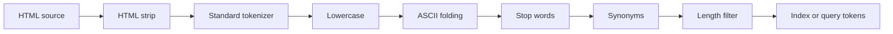

# Tutorial 3: Analyzer Pipelines

This tutorial defines a custom text-analysis pipeline, binds it to a GIN field, verifies synonym expansion through search results, inspects the physical index, reopens durable state, and removes the analyzer safely.

## 1. Open a persistent tutorial database

```sh
cargo run -p uqa-cli --bin usql -- --db analyzer-tutorial.uqa
```

Use a new database path so every statement has the expected catalog state.

## 2. Design the pipeline

The example will remove HTML tags, split standard word tokens, lowercase them, fold characters with ASCII equivalents, remove English and custom stop words, expand vehicle synonyms, and reject tokens outside the configured length range.



The order is intentional. Lowercase runs before stop words and synonyms so their configured lowercase keys match. Synonyms run before the length filter so every expansion is checked by the same length policy.

## 3. Register the named analyzer

Use tagged dollar quoting for readable JSON:

```sql
SELECT * FROM create_analyzer(
    'html_vehicle',
    $analyzer$
{
  "char_filters": [
    {"type": "h_t_m_l_strip"}
  ],
  "tokenizer": {"type": "standard"},
  "token_filters": [
    {"type": "lowercase"},
    {"type": "a_s_c_i_i_folding"},
    {"type": "stop", "language": "english", "custom_words": ["manual"]},
    {"type": "synonym", "synonyms": {"car": ["automobile"], "automobile": ["car"]}},
    {"type": "length", "min_length": 2, "max_length": 24}
  ]
}
$analyzer$
);
```

Registration validates the JSON, component names, regular expressions, n-gram bounds, and configured synonym resources before publishing the name.

Confirm the custom name is visible:

```sql
SELECT analyzer_name
FROM list_analyzers()
WHERE analyzer_name = 'html_vehicle';
```

The result contains one `html_vehicle` row. `list_analyzers()` also returns the built-in `keyword`, `standard`, `standard_cjk`, and `whitespace` names.

## 4. Create a table and GIN index

```sql
CREATE TABLE analyzer_articles (
    id INTEGER PRIMARY KEY,
    title TEXT NOT NULL,
    body TEXT NOT NULL
);

CREATE INDEX analyzer_articles_body_gin
ON analyzer_articles USING gin (body);
```

The field must be in a physical GIN index before `set_table_analyzer` can bind it. This tutorial leaves the analyzer out of the index DDL so the field assignment has one clear catalog owner.

## 5. Bind both analysis phases

```sql
SELECT * FROM set_table_analyzer(
    'analyzer_articles',
    'body',
    'html_vehicle',
    'both'
);
```

`both` makes document writes and query leaves use the same pipeline. It is also the default when the fourth argument is omitted. Assigning `index` or `both` rebuilds existing postings; the table is empty here, so the rebuild is immediate.

## 6. Insert HTML-bearing content

```sql
INSERT INTO analyzer_articles (id, title, body) VALUES
    (1, 'Car setup', '<p>A fast car setup manual</p>'),
    (2, 'Maintenance', '<p>Automobile maintenance guide</p>'),
    (3, 'Browser', '<p>Browser cache guide</p>');
```

For row 1, HTML tags are removed, `A` is lowercased and removed as an English stop word, `manual` is removed as a custom stop word, and `car` expands to `automobile`. For row 2, `automobile` expands to `car`. The original token is retained beside each synonym expansion.

## 7. Query through the same analyzer

```sql
SELECT id, title, _score
FROM analyzer_articles
WHERE text_match(body, 'car')
ORDER BY _score DESC, id ASC;
```

The expected identities are 1 and 2. Search analysis turns `car` into both `car` and `automobile`, unions their posting lists, and BM25 ranks the resulting support. Row 3 has neither term and is excluded.

The inverse query returns the same support:

```sql
SELECT id, title, _score
FROM analyzer_articles
WHERE text_match(body, 'automobile')
ORDER BY _score DESC, id ASC;
```

## 8. Inspect index state

```sql
SELECT table_name, field, analyzer,
       indexed_doc_count, term_count, total_field_length
FROM fts_index_stats('analyzer_articles');
```

The row reports `body`, analyzer `html_vehicle`, and three indexed documents. `term_count` and `total_field_length` reflect the tokens after filtering and expansion rather than the source word count.

In `usql`, `\da` lists custom catalog analyzer names:

```text
\da
```

## 9. Verify persistence

Reopen the current database from the CLI:

```text
\reset
```

Run the `car` query again. The custom JSON definition, field assignment, rows, and postings survive reopen. A file-backed synonym pipeline would additionally require its external file to remain readable at the stored path.

## 10. Understand phase choices

| Phase | When to use it | Rebuild on assignment |
| --- | --- | --- |
| `both` | The index and query must share normalization | Yes |
| `index` | Documents need a special vocabulary and search falls back to it | Yes |
| `search` or `query` | Queries expand into terms already present in the index | No |

Search-only synonym expansion can avoid indexing every synonym, but its expansions must match the index vocabulary. N-grams or stemming on only one side commonly produce incompatible terms, so prove asymmetric designs with exact token fixtures and retrieval tests.

## 11. Replace and drop safely

An analyzer cannot be dropped while its name is assigned to a field. Replace it with the built-in `standard` analyzer first:

```sql
SELECT * FROM set_table_analyzer(
    'analyzer_articles',
    'body',
    'standard',
    'both'
);

SELECT * FROM drop_analyzer('html_vehicle');
```

The first statement rebuilds postings with `standard`; the second removes the now-unreferenced custom definition. If an analyzer was declared in `CREATE INDEX ... WITH (analyzer = ...)`, change it by dropping and recreating that GIN index instead.

## 12. Preview tokens in Rust

SQL does not expose a token-preview function. Build the same component types directly when tests need to assert exact analysis output:

```rust
use uqa_analysis::{Analyzer, CharFilter, TokenFilter, Tokenizer};

let analyzer = Analyzer::new(
    Tokenizer::Standard,
    vec![TokenFilter::Lowercase, TokenFilter::PorterStem],
    vec![CharFilter::HTMLStrip],
);

let tokens = analyzer.analyze("<p>The Running Cars</p>")?;
assert_eq!(tokens, vec!["the", "run", "car"]);
# Ok::<(), Box<dyn std::error::Error>>(())
```

This direct `Analyzer` value is useful for token fixtures. Use `Engine::register_named_analyzer` or SQL `create_analyzer` when the definition and field assignment must persist in an engine catalog.

Continue with the [text analyzer reference](../reference/06-text-analyzers.md) for every component option, file-backed synonym format, Rust lifecycle method, and failure rule.
