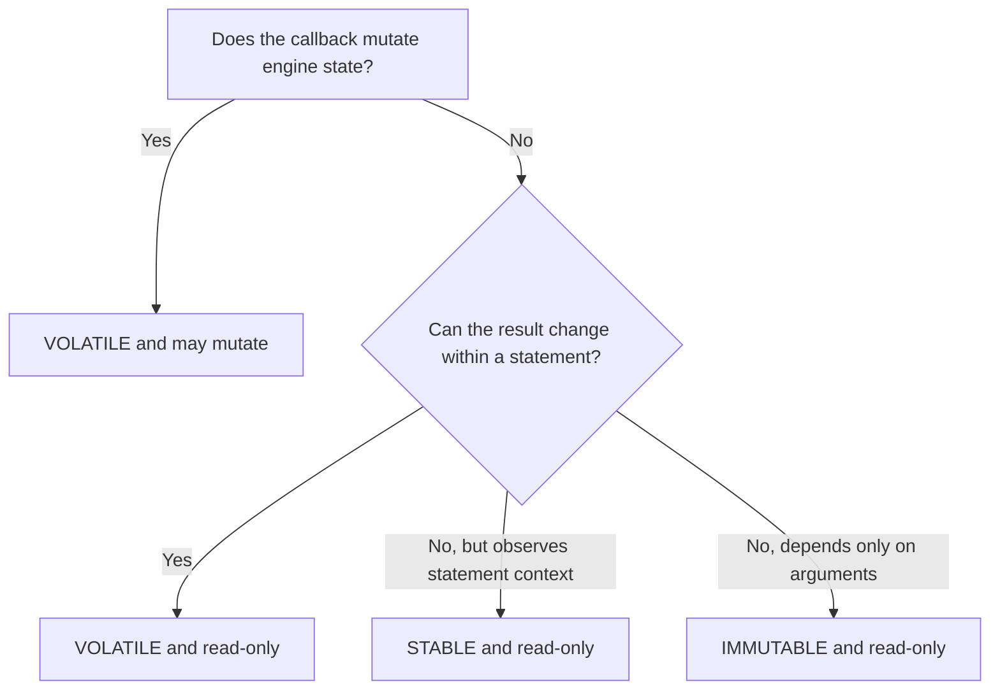

# Tutorial 7: Custom Functions

This tutorial registers the same read-only scalar callback in Rust, Python, Node.js, and browser WASM, then shows the shared table and aggregate contracts. Runtime functions are process-local and must be registered after every engine construction. Complete scalar, table, and aggregate programs for all four targets are linked from the [extensibility row of the example matrix](../../../examples/README.md).

## 1. Register a Rust scalar function

```rust
use uqa_core::Value;
use uqa_engine::{
    Engine, SQLFunctionOptions, SQLFunctionVolatility,
};
use uqa_sql::SQLError;

fn main() -> Result<(), Box<dyn std::error::Error>> {
    let engine = Engine::new();
    engine.register_scalar_function_with_options(
        "normalize_label",
        SQLFunctionOptions::read_only(SQLFunctionVolatility::Immutable),
        |args: &[Value]| -> Result<Value, SQLError> {
            let [Value::Str(input)] = args else {
                return Err(SQLError::BadArity {
                    name: "normalize_label".into(),
                    expected: "1 text argument".into(),
                    actual: args.len(),
                });
            };
            Ok(Value::Str(
                input.trim().to_lowercase().replace(' ', "-"),
            ))
        },
    )?;

    let result = engine.sql(
        "SELECT normalize_label(' SQL Manual ') AS label",
        &[],
    )?;
    println!("{result:?}");
    Ok(())
}
```

The callback is immutable because the same input always produces the same output and it does not observe or mutate engine state. If either claim is false, select `STABLE` or `VOLATILE` as appropriate.

## 2. Register a Rust table function

```rust
use uqa_core::Value;
use uqa_engine::{Engine, SQLTableFunctionResult};
use uqa_sql::SQLError;

fn main() -> Result<(), Box<dyn std::error::Error>> {
    let engine = Engine::new();
    engine.register_table_function(
        "repeat_rows",
        |args: &[Value]| -> Result<SQLTableFunctionResult, SQLError> {
            let [Value::Str(label), Value::Int(times)] = args else {
                return Err(SQLError::BadArity {
                    name: "repeat_rows".into(),
                    expected: "text, integer".into(),
                    actual: args.len(),
                });
            };
            let rows = (0..*times)
                .map(|index| vec![Value::Str(label.clone()), Value::Int(index)])
                .collect();
            Ok(SQLTableFunctionResult::new(["label", "index"], rows))
        },
    )?;

    let result = engine.sql(
        "SELECT label, index FROM repeat_rows('item', 3) AS r(label, index) ORDER BY index",
        &[],
    )?;
    println!("{result:?}");
    Ok(())
}
```

The default function options are conservative: `VOLATILE` and allowed to mutate. A large table function can implement the pull-based `SQLTableFunctionStream` interface so rows are produced incrementally and late errors remain visible.

## 3. Register a Python scalar function

```python
import uqa

engine = uqa.Engine()

def normalize_label(value: str) -> str:
    return value.strip().lower().replace(" ", "-")

engine.register_scalar_function(
    "normalize_label",
    normalize_label,
    volatility="immutable",
    may_mutate_engine=False,
)
result = engine.sql(
    "SELECT normalize_label($1) AS label",
    [" SQL Manual "],
)
print(result.rows)
engine.close()
```

The explicit options allow constant folding and other safe rewrites because this callback depends only on its arguments and has no engine-visible side effects.

## 4. Register the Node.js scalar function

```javascript
const { Engine } = require("uqa");

const engine = new Engine();
engine.registerScalarFunction(
  "normalize_label",
  (value) => value.trim().toLowerCase().replaceAll(" ", "-"),
  { volatility: "immutable", mayMutateEngine: false },
);
const result = await engine.sql(
  "SELECT normalize_label($1) AS label",
  [" SQL Manual "],
);
console.log(result.rows);
engine.close();
```

Registration is synchronous. The callback also returns synchronously even when the containing query uses `engine.sql`; a returned `Promise` is rejected as a SQL callback error.

## 5. Register the browser WASM scalar function

```javascript
import { Engine } from "uqa-wasm";

const engine = await Engine.inMemory();
await engine.registerScalarFunction(
  "normalize_label",
  (value) => value.trim().toLowerCase().replaceAll(" ", "-"),
  { volatility: "immutable", mayMutateEngine: false },
);
const result = await engine.sql(
  "SELECT normalize_label($1) AS label",
  [" SQL Manual "],
);
console.log(result.rows);
await engine.close();
```

WASM registration is asynchronous at the binding surface, but callback invocation is synchronous reverse dispatch from the engine into JavaScript. A callback cannot return a `Promise`.

## 6. Implement table and aggregate callbacks

Python table callbacks return a dictionary with `columns` and `rows`, a `(columns, rows)` tuple, or iterable dictionary rows. Node.js and browser WASM table callbacks return `{ columns, rows }`, `[columns, rows]`, or an array of object rows. Row arrays require explicit columns, and every row array must have the same width as the column list.

```javascript
engine.registerTableFunction("repeat_rows", (label, times) => ({
  columns: ["label", "index"],
  rows: Array.from({ length: times }, (_, index) => [label, index]),
}));
```

An aggregate registration receives a factory, and the engine calls that factory once per SQL group. The state object provides `observe` or `step` plus `finish` or `finalize`; methods run with the state object as `this` in JavaScript.

```javascript
engine.registerAggregateFunction("sum_squares", () => ({
  total: 0,
  observe(value) {
    if (value !== null) {
      this.total += value * value;
    }
  },
  finish() {
    return this.total;
  },
}));
```

Use `await` for both registrations in browser WASM. Rust can additionally implement `SQLTableFunctionStream` for pull-based production; host-language table callbacks materialize the returned rows at the binding boundary.

## 7. Apply lifecycle and execution rules

Register callbacks before serving concurrent queries. A new persistent session shares the runtime registry with its parent engine, but closing and reopening the process does not restore callback code from storage.

Callback errors become SQL errors. Validate arity and input variants explicitly, avoid panics, and keep callback work short. Node.js dispatches callbacks from asynchronous SQL work back to the owning JavaScript thread, so a slow callback blocks the event loop while it runs.

Node.js and browser WASM reject binding `Engine` method calls made from an active JavaScript SQL callback. Schedule independent work after the callback returns instead of recursively entering the current statement.

## 8. Declare optimizer safety accurately



The engine rejects a callback declared as mutating with non-volatile semantics. An inaccurate read-only or immutability claim can enable invalid optimizer rewrites, so use the narrowest claim that is provably true.

Continue with [Extension points](../internals/08-extension-points.md) for registry, planning, and session ownership details.
