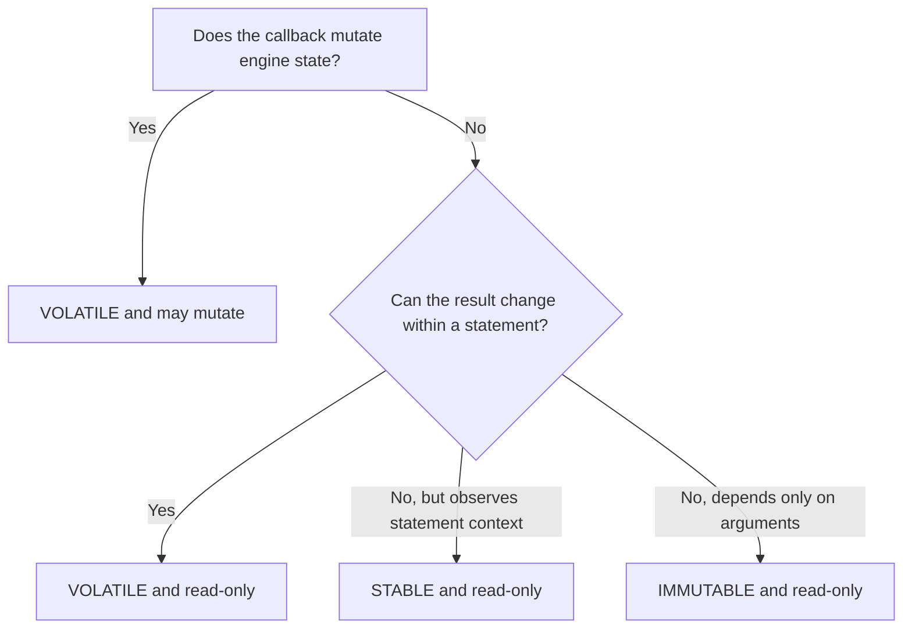

# Tutorial 7: Custom Functions

This tutorial registers a read-only Rust scalar callback, a Rust table callback, and a Python scalar callback. Runtime functions are process-local and must be registered after every engine construction.

## 1. Register a Rust scalar function

```rust
use uqa_core::Value;
use uqa_engine::{
    Engine, SQLFunctionOptions, SQLFunctionVolatility,
};
use uqa_sql::SQLError;

fn main() -> Result<(), Box<dyn std::error::Error>> {
    let engine = Engine::new();
    engine.register_scalar_function_with_options(
        "tag_text",
        SQLFunctionOptions::read_only(SQLFunctionVolatility::Immutable),
        |args: &[Value]| -> Result<Value, SQLError> {
            let [Value::Str(input)] = args else {
                return Err(SQLError::BadArity {
                    name: "tag_text".into(),
                    expected: "1 text argument".into(),
                    actual: args.len(),
                });
            };
            Ok(Value::Str(format!("tag:{input}")))
        },
    )?;

    let result = engine.sql("SELECT tag_text('manual') AS tagged", &[])?;
    println!("{result:?}");
    Ok(())
}
```

The callback is immutable because the same input always produces the same output and it does not observe or mutate engine state. If either claim is false, select `STABLE` or `VOLATILE` as appropriate.

## 2. Register a Rust table function

```rust
use uqa_core::Value;
use uqa_engine::{Engine, SQLTableFunctionResult};
use uqa_sql::SQLError;

fn main() -> Result<(), Box<dyn std::error::Error>> {
    let engine = Engine::new();
    engine.register_table_function(
        "repeat_rows",
        |args: &[Value]| -> Result<SQLTableFunctionResult, SQLError> {
            let [Value::Str(label), Value::Int(times)] = args else {
                return Err(SQLError::BadArity {
                    name: "repeat_rows".into(),
                    expected: "text, integer".into(),
                    actual: args.len(),
                });
            };
            let rows = (0..*times)
                .map(|index| vec![Value::Str(label.clone()), Value::Int(index)])
                .collect();
            Ok(SQLTableFunctionResult::new(["label", "index"], rows))
        },
    )?;

    let result = engine.sql(
        "SELECT label, index FROM repeat_rows('item', 3) AS r(label, index) ORDER BY index",
        &[],
    )?;
    println!("{result:?}");
    Ok(())
}
```

The default function options are conservative: `VOLATILE` and allowed to mutate. A large table function can implement the pull-based `SQLTableFunctionStream` interface so rows are produced incrementally and late errors remain visible.

## 3. Register a Python scalar function

```python
import uqa

engine = uqa.Engine()

def normalize_label(value: str) -> str:
    return value.strip().lower().replace(" ", "-")

engine.register_scalar_function("normalize_label", normalize_label)
result = engine.sql(
    "SELECT normalize_label($1) AS label",
    [" SQL Manual "],
)
print(result.rows)
engine.close()
```

Python table callbacks return column metadata and rows in one of the shapes accepted by the package type stubs. Aggregate callbacks use a factory that creates per-group state with `observe` and `finish` methods.

## 4. Apply lifecycle rules

Register callbacks before serving concurrent queries. A new persistent session shares the runtime registry with its parent engine, but closing and reopening the process does not restore callback code from storage.

Callback errors become SQL errors. Validate arity and input variants explicitly, avoid panics, and keep expensive blocking work outside shared critical sections.

## 5. Declare optimizer safety accurately



The engine rejects a callback declared as mutating with non-volatile semantics. An inaccurate read-only or immutability claim can enable invalid optimizer rewrites, so use the narrowest claim that is provably true.

Continue with [Extension points](../internals/08-extension-points.md) for registry, planning, and session ownership details.
