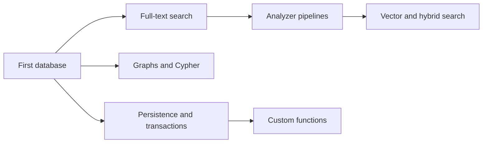

# Tutorials

These tutorials are ordered so that each exercise reuses concepts introduced earlier. They use the `usql` shell for visible SQL behavior and Rust where an engine-only API is the subject.

| Tutorial | Outcome |
| --- | --- |
| [1. Your first database](01-first-database.md) | Create a constrained schema, load rows, query it, and use a transaction |
| [2. Full-text search](02-full-text-search.md) | Build a GIN index and run deterministic BM25 queries |
| [3. Analyzer pipelines](03-analyzer-pipelines.md) | Define, bind, persist, inspect, and safely replace a custom text analyzer |
| [4. Vector and hybrid search](04-vector-and-hybrid-search.md) | Compare exact, HNSW, and IVF KNN, then fuse text and vector evidence |
| [5. Graphs and Cypher](05-graphs-and-cypher.md) | Create a named graph and join a traversal to relational data |
| [6. Persistence and transactions](06-persistence-and-transactions.md) | Reopen durable state, use savepoints, batches, and independent sessions |
| [7. Custom functions](07-custom-functions.md) | Register safe Rust, Python, Node.js, and browser WASM callbacks for SQL |

Run shell commands from the workspace root. The tutorials use small deterministic data sets so results can be inspected directly. Production index and ranking parameters must be evaluated with production-shaped data.
