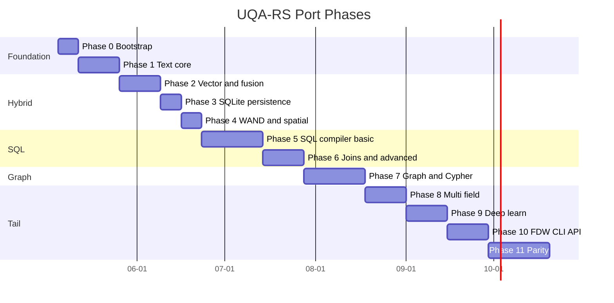

# Plan 0001: Port UQA from Python to Rust

Status: Draft for review
Author: Initial scoping pass
Target repo: `uqa-rs` (this repository)
Source repo: `/Users/jaepil/work/research/uqa` (Python UQA, version 0.25.11)
Source size: ~47k LOC Python source + ~40k LOC tests (2,959 tests across 85 files)

## 1. Goal and non-goals

### 1.1 Goal

Produce a Rust implementation of the Unified Query Algebra (UQA) that is:

1. **Algebraically faithful.** All formal invariants from Papers 1-5 hold bit-for-bit. The Rust `PostingList` is the same Boolean algebra as the Python one; the Rust `BayesianBM25Scorer` produces the same calibrated probabilities (within `1e-9`); the graph `Phi` homomorphism preserves Boolean structure end to end.
2. **API-compatible at the surface.** The same SQL dialect (PostgreSQL 17 superset with UQA extensions: `text_match`, `knn_match`, `fuse_log_odds`, `staged_retrieval`, `deep_fusion`, `traverse_match`, etc.) and the same fluent `QueryBuilder` API (Rust idioms permitted: builder consumes `self`).
3. **Faster.** Target: 3-10x throughput on representative workloads (hybrid search top-k, BMW, IVF KNN, hash join, RPQ traversal) versus the Python baseline.
4. **Embeddable.** Library crate plus a `usql` CLI binary. No service, no network. Single static binary on macOS/Linux x86_64 and aarch64.
5. **Production-grade.** SQLite-backed write-through persistence with crash safety, online catalog migration, and a deterministic startup/shutdown contract.

### 1.2 Non-goals (initial port)

- Distributed execution. The Python engine is single-process; the Rust port stays single-process.
- Python interop. We do not embed CPython, do not call `numpy`, and do not depend on `pglast`. PyO3 bindings can be added later as a separate crate, but are not in scope.
- A new SQL dialect. We mirror the Python compiler's accepted grammar exactly (PostgreSQL-flavored).
- Backward compatibility with old Python catalog files is not a hard requirement, but the SQLite schema laid down by the Python engine should be readable. We can ship a one-shot migration tool if needed.
- HNSW vector index. The Python code reserves the enum slot but never implements it; we leave it stubbed (return `not_implemented`) and build the IVF backend first.
- The initial 0.1.0 port deferred deep-learning training (`deep_learn`) to a late phase. The current Rust layout keeps model specs, deep-fusion inference, analytical training, and optional MLX acceleration in `uqa-ml`; `uqa-engine` owns catalog persistence and SQL adapters.

## 2. Theoretical anchors (must hold)

The Rust port must satisfy a small list of invariants drawn directly from the papers. These become the property-test surface in `crates/uqa-core/tests/algebra.rs` and similar files in scoring and graph crates.

### 2.1 Paper 1 (UQA core)

- **Boolean algebra on `PostingList`.** `(L, union, intersect, complement, empty, universal)` is a complete Boolean algebra: commutativity, associativity, both distributive laws, identity (with `empty` and `universal`), complement, De Morgan. Tested with `proptest` over randomly-generated id sets.
- **PL/doc isomorphism.** `PL(doc(L)) == L` and `doc(PL(D)) == D` for all `L` and document sets `D`; combinations via `union`/`intersect`/`difference` in `L` equal those in `2^D` post-translation.
- **Operator-rewrite equivalences.** Filter pushdown: `Filter_f(A union B) == Filter_f(A) union Filter_f(B)`. Vector threshold merging: `V_theta1(q) intersect V_theta2(q) == V_max(theta1,theta2)(q)`. Facet additivity over disjoint union. Join distributes over union; join associativity up to tuple restructure.
- **Aggregation monoid decomposition.** For disjoint `L1`, `L2`: `Aggregate_f,agg(L1 union L2) == Aggregate_f,agg(L1) (+)_agg Aggregate_f,agg(L2)`.
- **Hierarchical paths.** `eval(h, p1 ++ p2) == eval(eval(h, p1), p2)`; `PathProject_P` idempotent; `PathFilter` distributes over union and intersect.

### 2.2 Paper 2 (graph)

- **`Phi` homomorphism.** For any composition of `union_G`, `intersect_G`, `complement_G` on graph posting lists, `Phi(result)` equals the same composition applied to standard posting lists. Tested by round-tripping randomly-generated graph fragments.
- **Pattern-match equivalence under graph homomorphism.** `P1 ~ P2` (pattern isomorphism) implies `GMatch_P1 == GMatch_P2`.
- **Filter pushdown into pattern.** `Filter_F(GMatch_P(L_G)) == GMatch_{P + F}(L_G)`.
- **Join-pattern fusion.** `GMatch_P1 join GMatch_P2 == GMatch_{P1 ⊔ P2}`.
- **RPQ semantics.** Regular path queries `R ::= l | R1.R2 | R1|R2 | R*` evaluate via NFA-to-DFA subset construction; the algebraic simplifications `a|a == a`, `(a*)* == a*`, `a*|a == a*` are tested directly on the AST.

### 2.3 Paper 3 (Bayesian BM25)

- **BM25 monotonicity and bounds.** Stable form: with `w = boost * IDF`, `inv_norm = 1 / (k1 * ((1-b) + b*n/avgdl))`, `score(f, n) = w - w/(1 + f * inv_norm)`, supremum `w`. Monotone increasing in tf, decreasing in dl. IDF non-negative and decreasing in df.
- **Posterior decomposition.** Three-term form `logit P(R=1 | s, f, n_hat) = logit L(s) + logit b_r + logit p_prior(f, n_hat)` where `L(s) = sigmoid(alpha*(s - beta))`. The two-update probability-space implementation must match the closed-form within `1e-9`.
- **WAND/BMW exactness.** Top-k from WAND or BMW with the Bayesian upper bound (`ub_bayes(t)`) equals exhaustive scoring on randomized queries.
- **Boolean fusion.** AND in log space: `P(AND) = exp(sum(log p_i))`; OR: `1 - exp(sum(log(1 - p_i)))`. Probability clamp `epsilon = 1e-10` at all boundaries.

### 2.4 Paper 4 (log-odds fusion)

- **Confidence-scaled log-odds.** `P_final = sigmoid((1 / n^(1-alpha)) * sum(logit(P_i)))`; default `alpha = 0.5` gives the `sqrt(n)` law.
- **Identity laws.** `n=1` always returns `P_1` (Proposition 4.3.2). Scale neutrality (`P_i = p` for all i implies `P_final = p`) holds only at `alpha = 0`; the default `alpha = 0.5` deliberately amplifies agreement.
- **Sign preservation.** `sgn(P_final - 0.5) = sgn(mean_logit(P_i))` (Theorem 4.2.2).
- **Irrelevance / relevance preservation.** `max P_i < 0.5 => P_final < 0.5`; `min P_i > 0.5 => P_final > 0.5`.
- **Symmetric disagreement.** Logits that sum to zero collapse `P_final` to `0.5`.
- **Logit-sigmoid duality.** `sigmoid(logit(p)) == p` and `logit(sigmoid(x)) == x` numerically (within machine epsilon away from 0 and 1).

### 2.5 Paper 5 (vector calibration)

- **Likelihood ratio.** `ev_vec(d) = log(f_R_hat(d) / f_G(d))`; sign of `ev_vec` matches sign of `f_R_hat - f_G`.
- **Importance-weighted KDE.** `f_R_hat(d) = (1 / sum w_i) * sum(w_i * K_h(d - d_i))`. Silverman bandwidth `h = 1.06 * sigma_w * K_eff^(-1/5)` with `K_eff = (sum w_i)^2 / sum(w_i^2)`. Bandwidth scaling `c in [0.2, 0.5]` per the paper's ablation.
- **GMM-EM convergence.** Two-component mixture with `theta_G` fixed at index time; informed init `gamma_i^(0) = w_i`; achieves at least the initial log-likelihood after EM.
- **Hybrid additive fusion.** `logit P(R | s_bm25, d_vec) = log(f_R_hat(d_vec)/f_G(d_vec)) + alpha*(s_bm25 - beta) + logit P_base`. When combined via Paper 4 conjunction at `n=2, alpha=1`, the two formulations agree.

### 2.6 Implementation contract

A short suite of property and golden tests covers all of the above. They live in `crates/*/tests/` and run on every PR.

## 3. Crate layout

The Rust port is a Cargo workspace. One crate per Python subpackage gives clean dependency boundaries and parallel buildability, but the layering must mirror the algebraic dependency order: `core` is at the bottom, `engine` is at the top.

```mermaid
graph TD
    core[uqa-core]
    analysis[uqa-analysis]
    storage[uqa-storage]
    scoring[uqa-scoring]
    fusion[uqa-fusion]
    operators[uqa-operators]
    graph[uqa-graph]
    joins[uqa-joins]
    planner[uqa-planner]
    execution[uqa-execution]
    sqlc[uqa-sql]
    fdw[uqa-fdw]
    engine[uqa-engine]
    cli[uqa-cli]
    api[uqa-api]

    analysis --> core
    storage --> core
    storage --> analysis
    scoring --> core
    scoring --> storage
    fusion --> core
    fusion --> scoring
    operators --> core
    operators --> storage
    operators --> scoring
    operators --> fusion
    graph --> core
    graph --> storage
    graph --> operators
    joins --> core
    joins --> operators
    joins --> analysis
    joins --> graph
    planner --> core
    planner --> operators
    planner --> joins
    execution --> core
    execution --> operators
    execution --> planner
    sqlc --> core
    sqlc --> operators
    sqlc --> planner
    sqlc --> execution
    sqlc --> graph
    fdw --> core
    fdw --> execution
    api --> engine
    engine --> sqlc
    engine --> fdw
    cli --> engine
```

### 3.1 Per-crate scope and target LOC

| Crate | Maps from | Estimated Rust LOC | Notes |
|-------|-----------|-------------------:|-------|
| `uqa-core` | `core/` | 1,500 | `PostingList`, `GeneralizedPostingList`, `Predicate`, ID/payload types, hierarchical path types |
| `uqa-analysis` | `analysis/` | 2,500 | Tokenizers, char filters, token filters, `Analyzer` registry |
| `uqa-storage` | `storage/` | 6,000 | `DocumentStore`, `InvertedIndex`, `IVFIndex`, `BTreeIndex`, `SpatialIndex`, `BlockMaxIndex`, `Catalog`, transactions |
| `uqa-scoring` | `scoring/` | 3,500 | `BM25Scorer`, `BayesianBM25Scorer`, `WANDScorer`, `BlockMaxWANDScorer`, calibration, parameter learner |
| `uqa-fusion` | `fusion/` | 1,500 | Log-odds, attention, learned fusion, query features |
| `uqa-operators` | `operators/` | 3,500 | `Operator` trait + primitives + boolean + hybrid + aggregation + sparse + multi-stage + multi-field |
| `uqa-ml` | `operators/deep_fusion.py`, `operators/deep_learn.py` | 2,000 | Serializable deep models, CPU inference with dense/CNN/RNN/LSTM layers, analytical training, optional MLX backend |
| `uqa-graph` | `graph/` | 5,500 | `GraphStore`, vertex/edge types, pattern, RPQ, Cypher (lexer/parser/AST/compiler), centrality, message passing, temporal, versioned |
| `uqa-joins` | `joins/` | 2,500 | Hash inner, outer, semi, cross, sort-merge, index, cross-paradigm |
| `uqa-planner` | `planner/` | 4,000 | Cost model, cardinality, DPccp join enumeration, optimizer rewrites |
| `uqa-execution` | `execution/` | 5,000 | Volcano `PhysicalOperator`, `Batch` (Arrow), scan, filter/project/sort/agg/window, spill |
| `uqa-sql` | `sql/` | 8,000 | AST wrapper around `libpg_query-sys`, compiler, expression evaluator, FTS query mini-language, table |
| `uqa-fdw` | `fdw/` | 1,000 | Foreign data wrappers (DuckDB and Arrow IPC) |
| `uqa-engine` | `engine.py` | 2,000 | `Engine` struct, schema-aware table store, catalog restore |
| `uqa-api` | `api/` | 1,500 | `QueryBuilder` fluent API |
| `uqa-cli` | `cli.py`, `cancel.py` | 1,200 | `usql` REPL |
| **Total** | | **~49,000** | Roughly the same as Python source LOC; Rust verbosity is offset by macros and trait derives |

This is the source LOC target; the test surface is a separate workspace member (`tests/`) and is sized at ~50% of source LOC initially, with the long tail of the 2,959 Python tests ported as parity coverage in Phase 11.

## 4. Dependency choices

The mapping below replaces every Python dependency. Where multiple Rust crates compete, the column "Why" gives the deciding factor. Versions are placeholders; pinning happens in Phase 0.

| Python dep | Used for | Rust replacement | Why |
|------------|----------|------------------|-----|
| `numpy` | Vectors, calibration math, attention weights | `ndarray` for matrix ops; plain `Vec<f32>` for hot inner loops | `ndarray` mirrors NumPy ergonomics; bare slices with `wide` SIMD for BM25 / cosine inner loops |
| `pyarrow` | Columnar batches in execution | `arrow` (the `arrow-rs` crate) | Same Arrow IPC format, zero-copy via Arrow C Data Interface for FFI later |
| `duckdb` | Foreign-table pushdown, ad hoc relational | `duckdb` Rust crate (binds the same C++ engine) | Keeps semantic parity for FDW; avoids reimplementation |
| `pglast` | PostgreSQL AST parsing | `libpg_query-sys` (Rust bindings to `libpg_query`, which vendors the real PostgreSQL parser) | `pglast` itself wraps `libpg_query`, so this gives bit-identical AST shapes to the Python compiler. Avoids the dialect drift risk of pure-Rust re-implementations like `sqlparser-rs` |
| `bayesian-bm25` (Cognica internal) | Probability transforms, sigmoid, learnable weights | Port as a sibling crate `uqa-scoring::bayesian` (the math is small and self-contained; the C++ port at `aeca/fts/.../bayesian_bm25_similarity.cpp` is a useful reference) | Avoids FFI; keeps perf wins |
| `prompt-toolkit` | REPL line editing | `rustyline` | Direct ergonomic match |
| `pygments` | Syntax highlighting in REPL | `syntect` | Same TextMate grammar approach |
| `pytest`, `hypothesis` | Tests, property tests | `cargo test`, `proptest`, `rstest` | Stable, established |
| `pytest-benchmark` | Benchmarks | `criterion` | Stable, established |
| `sqlite` (via Python `sqlite3` and DuckDB) | Catalog, document store, inverted index, IVF lists, R*Tree | `rusqlite` 0.31+ with `bundled` feature | One backend, no system SQLite drift; bundled SQLite gives R*Tree, JSON1, FTS5 if needed |

Additional Rust-only crates the port pulls in:

| Crate | Purpose |
|-------|---------|
| `serde`, `serde_json` | Catalog JSON columns, analyzer config, model snapshots |
| `bincode` or `postcard` | Fast in-storage payload serialization |
| `rayon` | Data-parallel operators (parallel union, intersect, scoring) |
| `parking_lot` | Mutex/RwLock with better perf than `std::sync` |
| `bitvec` | Compact set membership for posting list internals where helpful |
| `roaring` | Roaring bitmaps for very large doc-id sets (optional, evaluated in Phase 1) |
| `rstar` | R*Tree spatial index |
| `petgraph` | Graph algorithms reference (centrality, BFS/DFS) - we keep our own adjacency for the persistent path |
| `regex`, `regex-automata` | Tokenizer and `LIKE` pattern compilation |
| `unicode-segmentation`, `unicode-normalization` | Standard tokenizer, ASCII folding |
| `rust-stemmers` | Snowball stemmers (Porter and language stemmers) |
| `time` or `chrono` | Date/datetime predicates and temporal graph queries |
| `thiserror`, `anyhow` | Error types (`thiserror` for crate-internal, `anyhow` only in `uqa-cli`) |
| `tracing` | Structured diagnostic logging (replaces `print` and `logging` calls) |
| `wide` or `std::simd` (nightly opt-in via cfg) | SIMD inner loops; `wide` is stable-Rust friendly |

Notably absent: `tokio`. The engine is sync. Cancellation uses an `Arc<AtomicBool>` and a `CancellationToken` newtype; long-running operators check it in their hot loops.

## 5. Module-by-module mapping

This section is the "find the file" reference. For every Python source file we either name the Rust target or mark it as "deferred". File paths use `crates/<crate-name>/src/<path>.rs`.

### 5.1 `core/`

| Python file | Rust file | Notes |
|-------------|-----------|-------|
| `core/types.py` | `uqa-core/src/types.rs` | `DocId = u64`, `FieldName = SmolStr`, `Payload`, `PostingEntry`, `GeneralizedPostingEntry`, `Vertex`, `Edge`, `IndexStats`, `Predicate` enum |
| `core/posting_list.py` | `uqa-core/src/posting_list.rs` | `PostingList`, `GeneralizedPostingList`. Two-pointer merges. The `from_sorted` constructor maps to `PostingList::from_sorted_unchecked` (unsafe-but-checked-debug). |
| `core/functor.py` | `uqa-core/src/functor.rs` | `PL`, `doc` bijections (free functions; documented as the algebraic translation layer) |
| `core/hierarchical.py` | `uqa-core/src/hierarchical.rs` | `HierarchicalPath`, `HierarchicalPostingList`, `eval`, `PathProject` etc. |

`Predicate` is a Rust enum, not a trait, so it is `Send + Sync + Clone` and can be checked exhaustively at the call sites that special-case `IsNull`/`IsNotNull`. The Python `Predicate.evaluate(value)` becomes `fn eval(&self, value: &Value) -> bool` where `Value` is the same dynamic value type used by `expr_evaluator`.

### 5.2 `analysis/`

| Python file | Rust file | Notes |
|-------------|-----------|-------|
| `analysis/tokenizer.py` | `uqa-analysis/src/tokenizer.rs` | `Tokenizer` trait + concrete impls. `StandardTokenizer` uses `regex-automata` Unicode word match; `NGramTokenizer` is a windowed iterator. |
| `analysis/char_filter.py` | `uqa-analysis/src/char_filter.rs` | HTML strip via a small SAX walk (no `html5ever` for hot path); mapping and pattern-replace via `regex` |
| `analysis/token_filter.py` | `uqa-analysis/src/token_filter.rs` | `LowerCase`, `StopWord` (multi-language list shipped as a const), `PorterStemFilter` via `rust-stemmers`, `ASCIIFolding` via `unicode-normalization`, `SynonymFilter`, `NGramFilter`, `EdgeNGramFilter`, `LengthFilter` |
| `analysis/analyzer.py` | `uqa-analysis/src/analyzer.rs` | `Analyzer` struct, `from_dict`/`to_dict` via `serde`. Global registry behind a `RwLock<FxHashMap<String, Analyzer>>` |

### 5.3 `storage/`

The most painful subpackage to port because it owns the SQLite schema. The strategy is to lift the schema into a single Rust module (`uqa-storage::schema`) and version it. Migrations are explicit (`MIGRATIONS: &[(u32, &str)]`) and applied on `Catalog::open`.

| Python file | Rust file | Notes |
|-------------|-----------|-------|
| `storage/abc/document_store.py` | `uqa-storage/src/document_store.rs` | `DocumentStore` trait |
| `storage/abc/inverted_index.py` | `uqa-storage/src/inverted_index.rs` | `InvertedIndex` trait |
| `storage/abc/graph_store.py` | `uqa-graph/src/store.rs` | `GraphStore` trait (lives in graph crate; here for completeness) |
| `storage/document_store.py` | `uqa-storage/src/memory/document_store.rs` | `MemoryDocumentStore` |
| `storage/sqlite_document_store.py` | `uqa-storage/src/sqlite/document_store.rs` | `SQLiteDocumentStore` |
| `storage/inverted_index.py` | `uqa-storage/src/memory/inverted_index.rs` | `MemoryInvertedIndex` |
| `storage/sqlite_inverted_index.py` | `uqa-storage/src/sqlite/inverted_index.rs` | `SQLiteInvertedIndex`. Lazy per-field tables, skip pointers, block-max blobs |
| `storage/btree_index.py` | `uqa-storage/src/btree_index.rs` | Wraps SQLite `CREATE INDEX` |
| `storage/block_max_index.py` | `uqa-storage/src/block_max_index.rs` | Per-block max contributions for BMW |
| `storage/ivf_index.py` | `uqa-storage/src/ivf_index.rs` | IVF: in-memory centroids, per-cell posting lists in SQLite. K-means training. |
| `storage/spatial_index.py` | `uqa-storage/src/spatial_index.rs` | Wraps SQLite R*Tree virtual table. Brute-force fallback uses Haversine. |
| `storage/vector_index.py` | `uqa-storage/src/vector_index.rs` | `VectorIndex` trait |
| `storage/index_abc.py`, `index_types.py`, `index_manager.py` | `uqa-storage/src/index/{abc,types,manager}.rs` | `Index` trait, `IndexType` enum (drop unused HNSW/GIN), `IndexManager` |
| `storage/catalog.py` | `uqa-storage/src/catalog.rs` | Schema versioning, migrations, save/load named graphs, foreign servers/tables, scoring params, models, path indexes, analyzers, table-field analyzer mapping |
| `storage/managed_connection.py` | `uqa-storage/src/connection.rs` | `Arc<Mutex<Connection>>` wrapper with WAL pragma and busy timeout |
| `storage/transaction.py` | `uqa-storage/src/transaction.rs` | `Transaction`, `InMemoryTransaction` |
| `storage/sqlite_graph_store.py` | `uqa-graph/src/sqlite_store.rs` | (lives in graph crate) |

### 5.4 `scoring/`

| Python file | Rust file | Notes |
|-------------|-----------|-------|
| `scoring/bm25.py` | `uqa-scoring/src/bm25.rs` | `BM25Scorer`, `BM25Params { k1, b }`, `idf(df, N)`, `score(tf, dl, df)`, `score_with_idf`, `upper_bound` |
| `scoring/bayesian_bm25.py` | `uqa-scoring/src/bayesian.rs` | Three-term posterior, sigmoid likelihood `L(s)`, composite empirical-Bayes prior, base-rate prior, `BayesianBM25Scorer`, `BayesianBM25Params` |
| `scoring/calibration.py` | `uqa-scoring/src/calibration.rs` | `CalibrationMetrics::report` (ECE, Brier, log loss) |
| `scoring/parameter_learner.py` | `uqa-scoring/src/parameter_learner.rs` | Online and offline fit modes (`balanced`, `prior_aware`, `prior_free`), gradients per Paper 3 |
| `scoring/external_prior.py` | `uqa-scoring/src/external_prior.rs` | `recency_prior`, `authority_prior`, `ExternalPriorScorer` |
| `scoring/fusion_wand.py` | `uqa-scoring/src/fusion_wand.rs` | WAND for multi-signal fusion; uses `BoundTightnessAnalyzer` |
| `scoring/wand.py` | `uqa-scoring/src/wand.rs` | `WANDScorer`, `BlockMaxWANDScorer`, `BoundTightnessAnalyzer`, `AdaptiveWANDScorer` |
| `scoring/multi_field.py` | `uqa-scoring/src/multi_field.rs` | `MultiFieldBayesianScorer`; per-field calibrated, log-odds combined |
| `scoring/vector.py` | `uqa-scoring/src/vector.rs` | `VectorScorer`, `cosine_to_probability`, `calibrated_probabilities` (Paper 5) |

### 5.5 `fusion/`

| Python file | Rust file | Notes |
|-------------|-----------|-------|
| `fusion/log_odds.py` | `uqa-fusion/src/log_odds.rs` | `LogOddsFusion`, `AdaptiveLogOddsFusion`, `SignalQuality`. Pure math; `f64` end-to-end |
| `fusion/attention.py` | `uqa-fusion/src/attention.rs` | `AttentionFusion`, `MultiHeadAttentionFusion`. Uses `ndarray` for `W` matrix |
| `fusion/learned.py` | `uqa-fusion/src/learned.rs` | `LearnedFusion` with `fit`/`update`/`state_dict` |
| `fusion/boolean.py` | `uqa-fusion/src/boolean.rs` | `ProbabilisticBoolean` (AND/OR/NOT in log space) |
| `fusion/query_features.py` | `uqa-fusion/src/query_features.rs` | Feature extraction for attention fusion |

### 5.6 `operators/`

The `Operator` trait has one method (`execute(&self, ctx: &ExecutionContext) -> Result<PostingList>`). Everything else (cost, parallel hints, can-be-skipped) is a default-implemented method. Operators are owned `Arc<dyn Operator>` so they can be cloned into worker threads cheaply.

| Python file | Rust file | Notes |
|-------------|-----------|-------|
| `operators/base.py` | `uqa-operators/src/base.rs` | `Operator` trait, `ExecutionContext`, `ComposedOperator` |
| `operators/_backend.py` | `uqa-operators/src/backend.rs` | Pluggable backend hook (numpy-equivalent fast path) |
| `operators/primitive.py` | `uqa-operators/src/primitive.rs` | `TermOperator`, `VectorSimilarityOperator`, `KNNOperator`, `SpatialWithinOperator`, `FilterOperator`, `FacetOperator`, `ScoreOperator`, `IndexScanOperator` |
| `operators/boolean.py` | `uqa-operators/src/boolean.rs` | `UnionOperator`, `IntersectOperator`, `ComplementOperator` |
| `operators/hybrid.py` | `uqa-operators/src/hybrid.rs` | `HybridTextVectorOperator`, `SemanticFilterOperator`, `LogOddsFusionOperator` |
| `operators/calibrated_vector.py` | `uqa-operators/src/calibrated_vector.rs` | Vector-as-likelihood-ratio operator (Paper 5) |
| `operators/aggregation.py` | `uqa-operators/src/aggregation.rs` | `AggregationMonoid`, `Count/Sum/Avg/Min/Max/QuantileMonoid`, `AggregateOperator` |
| `operators/attention.py` | `uqa-operators/src/attention.rs` | `AttentionFusionOperator` |
| `operators/sparse.py` | `uqa-operators/src/sparse.rs` | `SparseThresholdOperator` (ReLU thresholding) |
| `operators/multi_field.py` | `uqa-operators/src/multi_field.rs` | `MultiFieldMatchOperator` |
| `operators/multi_stage.py` | `uqa-operators/src/multi_stage.rs` | `StagedRetrievalOperator` |
| `operators/learned_fusion.py` | `uqa-operators/src/learned_fusion.rs` | `LearnedFusionOperator` |
| `operators/progressive_fusion.py` | `uqa-operators/src/progressive_fusion.rs` | Progressive fusion (incremental log-odds update) |
| `operators/deep_fusion.py` | `uqa-ml/src/deep_fusion.rs` | Deep-fusion inference (`CNN1D`, `CNN2D`, `RNN`, `LSTM`, graph `Conv`, `Pool`, `Flatten`, `Dense`, `Softmax`) |
| `operators/deep_learn.py` | `uqa-ml/src/training.rs` | Analytical training (no backprop). Phase 9. |
| `operators/hierarchical.py` | `uqa-operators/src/hierarchical.rs` | Path/array/object navigation operators |

### 5.7 `graph/`

| Python file | Rust file | Notes |
|-------------|-----------|-------|
| `graph/store.py` | `uqa-graph/src/store.rs` | `GraphStore` trait, `MemoryGraphStore` |
| `graph/sqlite_graph_store.py` | `uqa-graph/src/sqlite_store.rs` | `SQLiteGraphStore` (write-through) |
| `graph/posting_list.py` | `uqa-graph/src/posting_list.rs` | `GraphPostingList`, `Phi` homomorphism |
| `graph/operators.py` | `uqa-graph/src/operators.rs` | `Traverse`, `Match`, `GMatch`, `RPQ`, `VertexAgg` |
| `graph/cross_paradigm.py` | `uqa-graph/src/cross_paradigm.rs` | `ToGraph`, `FromGraph`, `TextToGraph`, `VectorMatch`, `SemanticGraphSearch` |
| `graph/pattern.py` | `uqa-graph/src/pattern.rs` | `GraphPattern`, label/property constraints |
| `graph/incremental_match.py` | `uqa-graph/src/incremental_match.rs` | Incremental pattern matching |
| `graph/index.py` | `uqa-graph/src/index.rs` | `PathIndex` (precomputed RPQ reachability) |
| `graph/rpq_optimizer.py` | `uqa-graph/src/rpq.rs` | `R ::= l | R.R | R|R | R*`, NFA, DFA via subset construction, simplifications |
| `graph/centrality.py` | `uqa-graph/src/centrality.rs` | PageRank, betweenness, closeness, degree |
| `graph/message_passing.py` | `uqa-graph/src/message_passing.rs` | Pregel-style iterative computation |
| `graph/graph_embedding.py` | `uqa-graph/src/embedding.rs` | Graph embedding (random walks, etc.) |
| `graph/temporal_filter.py`, `temporal_pattern_match.py`, `temporal_traverse.py` | `uqa-graph/src/temporal/*.rs` | Time-bounded queries |
| `graph/versioned_store.py` | `uqa-graph/src/versioned_store.rs` | Delta application, version tracking |
| `graph/delta.py` | `uqa-graph/src/delta.rs` | Add/remove vertex/edge deltas |
| `graph/join.py` | `uqa-graph/src/join.rs` | `GraphJoin`, `CrossJoin` |
| `graph/cypher/lexer.py` | `uqa-graph/src/cypher/lexer.rs` | Hand-written or `logos` |
| `graph/cypher/parser.py` | `uqa-graph/src/cypher/parser.rs` | Recursive descent (matches Python parser exactly for the supported subset) |
| `graph/cypher/ast.py` | `uqa-graph/src/cypher/ast.rs` | AST nodes |
| `graph/cypher/compiler.py` | `uqa-graph/src/cypher/compiler.rs` | Cypher AST -> graph operators |

### 5.8 `joins/`

| Python file | Rust file | Notes |
|-------------|-----------|-------|
| `joins/base.py` | `uqa-joins/src/base.rs` | `JoinOperator` trait |
| `joins/inner.py` | `uqa-joins/src/inner.rs` | Hash inner join |
| `joins/outer.py` | `uqa-joins/src/outer.rs` | Left/right/full outer with NULL padding |
| `joins/semi.py` | `uqa-joins/src/semi.rs` | Semi-join, anti-join, deferred for correlated EXISTS |
| `joins/cross.py` | `uqa-joins/src/cross.rs` | Cartesian product |
| `joins/sort_merge.py` | `uqa-joins/src/sort_merge.rs` | Sort-merge join |
| `joins/index.py` | `uqa-joins/src/index.rs` | Index-backed join |
| `joins/cross_paradigm.py` | `uqa-joins/src/cross_paradigm.rs` | Text-similarity join, vector-similarity join, graph join |

### 5.9 `planner/`

| Python file | Rust file | Notes |
|-------------|-----------|-------|
| `planner/optimizer.py` | `uqa-planner/src/optimizer.rs` | Filter pushdown, vector threshold merging, facet distribution, Boolean simplifications |
| `planner/cost_model.py` | `uqa-planner/src/cost_model.rs` | Trait `CostEstimator` with one impl per operator type. Operator enum to avoid pattern-matching across crates |
| `planner/cardinality.py` | `uqa-planner/src/cardinality.rs` | Cardinality estimation with `GraphStats` for graph-scoped independence |
| `planner/join_enumerator.py` | `uqa-planner/src/join_enumerator.rs` | DPccp (Moerkotte and Neumann 2006). Bitmask integers (`u64`) for relation subsets, `FxHashMap` for the DP cache |
| `planner/join_order.py` | `uqa-planner/src/join_order.rs` | Public API on top of the enumerator |
| `planner/join_graph.py` | `uqa-planner/src/join_graph.rs` | `JoinEdge`, `JoinGraph` |
| `planner/parallel.py` | `uqa-planner/src/parallel.rs` | `ParallelExecutor` (rayon thread pool) |
| `planner/executor.py` | `uqa-planner/src/executor.rs` | Planner-to-physical-operator bridge |

### 5.10 `execution/`

| Python file | Rust file | Notes |
|-------------|-----------|-------|
| `execution/physical.py` | `uqa-execution/src/physical.rs` | `PhysicalOperator` trait (`open`, `next`, `close`) |
| `execution/batch.py` | `uqa-execution/src/batch.rs` | `Batch` (wraps `RecordBatch` from `arrow-rs`); row-tuple extraction |
| `execution/scan.py` | `uqa-execution/src/scan.rs` | `TableScan`, `IndexScan`, `PostingListScan` |
| `execution/relational.py` | `uqa-execution/src/relational/*.rs` | Split into `filter.rs`, `project.rs`, `sort.rs`, `hash_agg.rs`, `window.rs`, `limit.rs` |
| `execution/spill.py` | `uqa-execution/src/spill.rs` | Disk spill for blocking ops; uses temp file + memory threshold |

### 5.11 `sql/`

This is the largest single-file port (`compiler.py`, 11k LOC). Strategy: split it ruthlessly.

| Python file | Rust file(s) | Notes |
|-------------|-------------|-------|
| `sql/__init__.py` | `uqa-sql/src/lib.rs` | Crate root |
| `sql/compiler.py` | `uqa-sql/src/compiler/{mod,select,insert,update,delete,create,drop,with_recursive,prepare,explain}.rs` | One submodule per top-level statement type. Routes `_compile_where` to the new file `compile_where.rs` (the function dispatch on UQA functions is a registry; see `function_registry.rs`) |
| | `uqa-sql/src/compiler/function_registry.rs` | The `FunctionRegistry` hashmap of name -> factory. Dispatches `text_match`, `knn_match`, `fuse_log_odds`, `staged_retrieval`, `bayesian_match`, `multi_field_match`, `traverse_match`, `deep_fusion`, `deep_predict`, `convolve`, `pool`, `flatten`, `dense`, `softmax`, `attention`, `model`, `layer`, `temporal_traverse`, `graph_neighbors`, `graph_traverse`, `graph_edges`, `graph_create`, `graph_drop`, `uqa_facets`, `uqa_highlight` |
| `sql/expr_evaluator.py` | `uqa-sql/src/expr_evaluator.rs` | Scalar expression evaluator. Pure Rust; uses `Value` enum for dynamic types |
| `sql/fts_query.py` | `uqa-sql/src/fts_query.rs` | Mini-language parser for `body @@ 'database AND query'`; produces a tree fed into the operator factory |
| `sql/table.py` | `uqa-sql/src/table.rs` | `Table`, `ColumnDef`, `ColumnStats`, `_SQL_TYPE_MAP` |

### 5.12 `engine.py`, `cancel.py`, `cli.py`, `api/`

| Python file | Rust file | Notes |
|-------------|-----------|-------|
| `engine.py` | `uqa-engine/src/engine.rs` | `Engine` struct, `SchemaAwareTableStore`, catalog restore, named graphs, models, scoring params, transaction interface, `sql()` entry point |
| `cancel.py` | `uqa-core/src/cancel.rs` | `CancellationToken`, `QueryCancelled` error |
| `cli.py` | `uqa-cli/src/main.rs` | `usql` REPL with `rustyline` and `syntect` |
| `api/query_builder.py` | `uqa-api/src/query_builder.rs` | Fluent builder, consumes `&mut self` |
| `fdw/` | `uqa-fdw/src/*.rs` | `FDWHandler` trait, `DuckDBHandler`, `ArrowHandler`, `ForeignServer`, `ForeignTable` |

## 6. Phased delivery

The Python port lands in 11 phases. Each phase is independently testable, and each closes with a `cargo test --workspace` green and a tagged release.



The dates are illustrative and assume a single full-time engineer. Each phase has a concrete entry and exit criterion.

### Phase 0: Bootstrap (1 week)

**Entry:** Empty `uqa-rs/` directory.
**Deliverables:**
- Cargo workspace with all 16 crates as empty `lib.rs` shells
- CI: `cargo fmt --check`, `cargo clippy -D warnings`, `cargo test --workspace`, `cargo build --release`
- `rust-toolchain.toml` pinning to a stable version (e.g. 1.79+)
- `.editorconfig`, `.gitignore`, `LICENSE` (AGPL-3.0-only matching upstream), `README.md`
- `uqa-core` first cut: `DocId`, `Payload`, `PostingEntry`, `PostingList` with `union`/`intersect`/`difference`/`complement`, `from_sorted` constructor
- `proptest` suite that proves the eleven Boolean axioms on `PostingList`
**Exit:** `cargo test -p uqa-core` green; CI green.

### Phase 1: Single-table text search (2 weeks)

**Entry:** Phase 0 done.
**Deliverables:**
- `uqa-analysis`: tokenizers, char filters, token filters, `Analyzer` registry
- `uqa-storage` (in-memory only): `MemoryDocumentStore`, `MemoryInvertedIndex`, `IndexStats`
- `uqa-scoring`: `BM25Scorer`, `BayesianBM25Scorer`, `CalibrationMetrics`
- `uqa-operators`: `TermOperator`, `FilterOperator`, `FacetOperator`, `ScoreOperator`, `IntersectOperator`, `UnionOperator`, `ComplementOperator`
- `uqa-engine`: minimal `Engine` with `add_document`, `delete_document`, `get_document`, `query` returning a result iterator
- Property tests for BM25 monotonicity, posterior decomposition, log-space AND/OR
**Exit:** Round-trip text-search example: insert 1k documents, do AND/OR queries with BM25 and Bayesian BM25 scoring, top-k matches Python output bit-for-bit.

### Phase 2: Vector and hybrid (2 weeks)

**Entry:** Phase 1 done.
**Deliverables:**
- `uqa-storage`: `IVFIndex` (in-memory centroids + per-cell posting lists), `VectorIndex` trait with brute-force fallback
- `uqa-scoring`: `VectorScorer`, `cosine_to_probability`, calibrated probabilities (Paper 5 importance-weighted KDE)
- `uqa-fusion`: `LogOddsFusion`, `AdaptiveLogOddsFusion`, `ProbabilisticBoolean`
- `uqa-operators`: `VectorSimilarityOperator`, `KNNOperator`, `HybridTextVectorOperator`, `SemanticFilterOperator`, `LogOddsFusionOperator`, `CalibratedVectorOperator`
- Property tests for log-odds invariants (Paper 4 Theorems 4.2.x)
**Exit:** Hybrid search example matches the Python `examples/showcase` output for the same input.

### Phase 3: SQLite persistence (1 week)

**Entry:** Phase 2 done.
**Deliverables:**
- `uqa-storage::sqlite::*`: `SQLiteDocumentStore`, `SQLiteInvertedIndex`, IVF persistence (centroids and lists), B-tree, R*Tree, block-max
- `uqa-storage::catalog::Catalog`: schema versioning, migrations, save/load named graphs (placeholder), foreign servers/tables (placeholder), scoring params, models (placeholder), analyzers, table-field analyzer mapping
- `uqa-storage::transaction::{Transaction, InMemoryTransaction}`
- `Engine::open(db_path)` restores from catalog
- Crash-safety smoke test: open, write, kill, reopen, verify state
**Exit:** Phase 1 and Phase 2 tests pass against both `MemoryDocumentStore`/`MemoryInvertedIndex` and `SQLite*` backends.

### Phase 4: WAND, BMW, spatial, indexes (1 week)

**Entry:** Phase 3 done.
**Deliverables:**
- `uqa-scoring`: `WANDScorer`, `BlockMaxWANDScorer`, `BoundTightnessAnalyzer`, `AdaptiveWANDScorer`, `FusionWANDScorer`
- `uqa-storage`: `BlockMaxIndex` (block-max metadata), `SpatialIndex` (R*Tree), `BTreeIndex`
- `uqa-operators`: `SpatialWithinOperator`, `IndexScanOperator`
- Exactness tests: random query/index pairs, top-k from WAND/BMW equals exhaustive scoring
**Exit:** WAND skip-rate at least 60% on standard query/corpus mix; BMW at least 75%.

### Phase 5: SQL parser and basic compiler (3 weeks)

**Entry:** Phase 4 done.
**Deliverables:**
- `uqa-sql::ast`: AST wrapper around `libpg_query-sys`. Returns the protobuf-encoded PostgreSQL AST, which the compiler walks via generated `prost` types. Same node names (`SelectStmt`, `RangeVar`, `FuncCall`, `A_Expr`, `BoolExpr`, ...) as the Python `pglast` AST, so the compiler logic ports node-for-node.
- `uqa-sql::compiler::select`: SELECT with FROM, WHERE, ORDER BY, LIMIT, OFFSET, basic GROUP BY (no JOIN, no window yet)
- `uqa-sql::compiler::function_registry::FunctionRegistry`: dispatch table for all 27 UQA functions. Initial registrations: `text_match`, `knn_match`, `bayesian_match`, `fuse_log_odds`, `uqa_facets`, `uqa_highlight`, `multi_field_match`
- `uqa-sql::expr_evaluator`: scalar expression evaluator
- `uqa-sql::fts_query`: mini-language for `@@`
- `uqa-sql::compiler::{insert, update, delete}`: row-level mutations
- `uqa-sql::compiler::create`: CREATE TABLE, CREATE INDEX (BTree, GIN, IVF, RTREE), CREATE VIEW, CREATE SCHEMA, CREATE ANALYZER
- `uqa-sql::compiler::drop`: DROP TABLE/INDEX/VIEW/SCHEMA with CASCADE
- `uqa-execution::physical`: `PhysicalOperator` trait
- `uqa-execution::batch`: `Batch` over `arrow-rs` RecordBatch
- `uqa-execution::relational::{filter, project, sort, limit}`: basic Volcano operators
- `uqa-execution::scan::TableScan`
- `Engine::sql(query, params)` end-to-end on the supported subset
**Exit:** `examples/sql/quickstart` script ports cleanly. The first 200 of the Python `test_sql_*.py` tests pass.

### Phase 6: Joins and advanced SQL (2 weeks)

**Entry:** Phase 5 done.
**Deliverables:**
- `uqa-joins`: hash inner, outer (left/right/full), semi/anti, cross, sort-merge, index-backed
- `uqa-execution::relational::hash_agg`: HashAggOp with FILTER, CASE pivots
- `uqa-execution::relational::window`: ROW_NUMBER, RANK, DENSE_RANK, LAG, LEAD, NTILE, frame ROWS/RANGE
- `uqa-execution::relational::recursive_cte`: WITH RECURSIVE
- `uqa-planner::cost_model`: `CostEstimator` per operator
- `uqa-planner::cardinality`: cardinality estimation
- `uqa-planner::join_enumerator`: DPccp join order
- `uqa-planner::optimizer`: filter pushdown and rewrites
- `uqa-execution::spill`: disk spill for blocking operators
**Exit:** All TPC-H-style queries supported by the Python engine produce identical output. Window function tests pass.

### Phase 7: Graph and Cypher (3 weeks)

**Entry:** Phase 6 done.
**Deliverables:**
- `uqa-graph`: `MemoryGraphStore`, `SQLiteGraphStore`, `Vertex`, `Edge`, vertex/edge property indexes
- `uqa-graph::pattern`: `GraphPattern`, label and property constraints
- `uqa-graph::rpq`: NFA, DFA via subset construction, simplifications
- `uqa-graph::operators`: `Traverse`, `Match`, `GMatch`, `RPQ`, `VertexAgg`
- `uqa-graph::index::PathIndex`: precomputed RPQ reachability
- `uqa-graph::cypher::{lexer, parser, ast, compiler}`: full port of the Python Cypher subset (MATCH, OPTIONAL MATCH, WHERE, RETURN, WITH, UNWIND, CREATE, MERGE, SET, DELETE, DETACH DELETE)
- `uqa-graph::cross_paradigm`: `ToGraph`, `FromGraph`, `TextToGraph`, `VectorMatch`, `SemanticGraphSearch`
- `uqa-graph::join`: `GraphJoin`, `CrossJoin`
- `uqa-graph::centrality`, `message_passing`, `embedding`, `temporal::*`, `versioned_store`, `delta`, `incremental_match`
- `uqa-sql::compiler::function_registry`: register `traverse_match`, `temporal_traverse`, `graph_neighbors`, `graph_traverse`, `graph_edges`, `graph_create`, `graph_drop`
- `uqa-joins::cross_paradigm`: text-similarity join, vector-similarity join, graph join
**Exit:** `Phi` homomorphism property tests pass. The Python graph test suite (test_graph_*.py, ~20 files, ~6k LOC) ports.

### Phase 8: Multi-field, multi-stage, fusion advanced (2 weeks)

**Entry:** Phase 7 done.
**Deliverables:**
- `uqa-scoring::multi_field::MultiFieldBayesianScorer`
- `uqa-scoring::parameter_learner`
- `uqa-fusion::attention::{AttentionFusion, MultiHeadAttentionFusion}`
- `uqa-fusion::learned::LearnedFusion`
- `uqa-fusion::query_features`
- `uqa-operators::{multi_field, multi_stage, learned_fusion, progressive_fusion, attention, sparse, hierarchical}`
- `uqa-ml::{deep_fusion, model}`
- `uqa-sql::compiler::function_registry`: register `staged_retrieval`, `multi_field_match`, `deep_fusion`, `convolve`, `pool`, `flatten`, `dense`, `softmax`, `attention`, `layer`, `model`, `deep_predict`
**Exit:** Deep-fusion inference example matches Python.

### Phase 9: Deep learn (2 weeks)

**Entry:** Phase 8 done.
**Deliverables:**
- `uqa-ml::deep_learn`: analytical training (no backprop) per Paper 4 framework
- Model persistence to catalog; `Engine::save_model` / `load_model` / `delete_model` / `deep_learn` / `deep_predict`
- Convolution weight estimation (`Engine::estimate_conv_weights`) via spatial autocorrelation
**Exit:** MNIST CNN training example reaches the same accuracy as the Python implementation (within 1pp).

### Phase 10: FDW, query builder, CLI (2 weeks)

**Entry:** Phase 9 done.
**Deliverables:**
- `uqa-fdw`: `FDWHandler`, `DuckDBHandler` (uses `duckdb` Rust crate), `ArrowHandler`, `ForeignServer`, `ForeignTable`
- `uqa-api::query_builder`: fluent API
- `uqa-cli`: `usql` REPL with line editing, syntax highlighting, multi-line input, history file
**Exit:** End-to-end CLI works against a live SQLite database.

### Phase 11: Parity verification and benchmarks (3 weeks)

**Entry:** Phase 10 done.
**Deliverables:**
- Golden-file harness: a Python driver runs every Python test, captures (input, output) JSON pairs, and a Rust harness asserts the Rust implementation produces the same output. The first cut covers Phase 1-7 functionality; long-tail tests (e.g. obscure SQL edge cases) are added incrementally.
- `criterion` benchmarks for: posting list union/intersect, BM25 inner loop, BMW skip rate, IVF KNN throughput, hash join, RPQ traversal, end-to-end SQL on a 1M-document corpus
- Performance gate: each benchmark must be at least 2x faster than the Python equivalent on the same hardware
- BEIR-style relevance benchmark to verify scoring parity
- README, examples, design docs in `docs/`
**Exit:** Tagged 0.1.0. CI is green on at least macOS aarch64 and Linux x86_64.

## 7. Testing strategy

### 7.1 Unit tests

Per-crate unit tests live in `crates/<crate>/src/<file>.rs` under `#[cfg(test)] mod tests`. They cover happy paths, edge cases, and one negative case per code path.

### 7.2 Property tests

`proptest` suites in `crates/<crate>/tests/<area>.rs` prove the algebraic invariants from Section 2. The minimum surface:

- `uqa-core/tests/algebra.rs`: eleven Boolean axioms; `from_sorted_unchecked` round-trip; difference-via-set equals two-pointer difference
- `uqa-scoring/tests/bm25.rs`: monotonicity, supremum, IDF non-negativity, posterior decomposition, log-space AND/OR
- `uqa-fusion/tests/log_odds.rs`: identity, sign preservation, irrelevance preservation, relevance preservation, symmetric cancellation
- `uqa-graph/tests/phi.rs`: `Phi` homomorphism on randomly-generated graph posting lists
- `uqa-operators/tests/rewrites.rs`: filter pushdown, vector threshold merging, facet additivity over disjoint union

### 7.3 Golden-file parity tests

A separate workspace member `tests/parity/` holds:

- `python_driver.py`: walks the Python test suite, captures (test_id, sql_or_api_call, params, expected_output) into `tests/parity/golden/<test_id>.json`
- `rust_runner.rs`: loads each golden JSON, runs the same call through the Rust engine, asserts the output matches

The golden harness is the primary gate against silent regressions. We run it on every CI build of Phase 5 and later.

### 7.4 Benchmarks

`criterion` benchmarks live in `crates/<crate>/benches/`. Each phase that ships hot-path code adds at least one benchmark. Phase 11 adds end-to-end benchmarks against a 1M-document corpus.

### 7.5 Fuzz tests

`cargo fuzz` targets:

- SQL parser robustness: feed random byte sequences into `libpg_query-sys` and our adapter, must not panic
- FTS mini-language parser
- Cypher parser
- Posting list deserialization

These are configured in Phase 11 and run on a nightly CI cron.

## 8. Performance targets

The Python baseline is single-threaded with GIL contention on parallel operators. The Rust target is roughly:

| Workload | Python baseline | Rust target |
|----------|----------------:|------------:|
| Posting list intersect (1M ids each, 50% overlap) | ~150 ms | <30 ms |
| BM25 score over 100k matches | ~80 ms | <20 ms |
| BMW top-10 over 10M-doc index | ~500 ms | <100 ms |
| IVF KNN k=10 over 1M 768-d vectors | ~200 ms | <50 ms |
| Hash inner join, 100k x 100k rows | ~600 ms | <150 ms |
| RPQ `(knows.likes)*` over 1M-edge graph | ~2 s | <500 ms |
| End-to-end hybrid search SQL, 1M docs | ~250 ms | <60 ms |

Rust beats Python by 4-5x at the simplest operations and by more at parallelizable ones. The targets above reflect that.

## 9. Risks and mitigations

### 9.1 SQL compiler scope

**Risk:** `sql/compiler.py` is 11k LOC, dispatches 27 UQA functions, and handles every PG statement variant. Porting in one go is impossible; porting in pieces creates many "doesn't compile yet" states.
**Mitigation:** Drive the compiler port from the Python test corpus. Each phase picks a slice of statements (Phase 5: SELECT/INSERT/UPDATE/DELETE/CREATE/DROP; Phase 6: JOIN/window/CTE; Phase 7: graph functions; etc.). Each slice ships passing the relevant Python tests via the golden harness.

### 9.2 SQL dialect drift

**Risk:** A pure-Rust re-implementation of the PostgreSQL parser inevitably diverges from the real grammar; unsupported syntax shows up only when a test fails.
**Mitigation:** Use `libpg_query-sys`, the Rust bindings to `libpg_query` (the same C library that `pglast` wraps in Python). The vendored parser is lifted directly from the PostgreSQL source tree, so any statement the Python compiler accepts via `pglast` is parsed identically here. The trade-off is a C dependency in the build (cc/clang required), and a slightly heavier `cargo build`. The trade-off is worth it: zero dialect drift, and the compiler port becomes a node-for-node translation rather than a search for parser workarounds.

### 9.3 PyArrow interop

**Risk:** If we need to call Python during transition (e.g., to keep `numpy` for `deep_learn` in Phase 9), zero-copy is non-obvious.
**Mitigation:** Use the Arrow C Data Interface for any cross-language batch passing. Avoid the issue entirely by porting `deep_learn` to pure Rust (the analytical training is small and well-defined).

### 9.4 Numerical drift

**Risk:** Python `numpy` and Rust `ndarray` differ in default precisions (`f64` vs `f32` for some reductions), summation order (Kahan vs naive), and small RNG details. A 1e-9 epsilon target may be too tight.
**Mitigation:** Use `f64` end-to-end in scoring and fusion; document a 1e-9 epsilon as the contract; for any operation where order matters (e.g., importance-weighted KDE), define a deterministic ordering and test it on Python and Rust side by side.

### 9.5 SQLite schema compatibility

**Risk:** Existing Python catalog files use a specific schema (per-table tables `_data_<table>`, `_inverted_<table>_<field>`, etc.). The Rust catalog must read these.
**Mitigation:** Lift the schema into a `MIGRATIONS: &[(u32, &str)]` table in `uqa-storage::catalog`. Migration 0001 is "ensure schema matches Python 0.25.11". The Rust `Catalog::open` runs migrations on first contact. We add a parity test that opens a Python-created catalog and round-trips queries.

### 9.6 Cancellation and parallelism

**Risk:** Python uses thread pools via `concurrent.futures.ThreadPoolExecutor`. Rust uses `rayon`, which has different cancellation semantics (no cooperative interruption out of the box).
**Mitigation:** Wrap the parallel sections with manual checkpoints: each parallel chunk sees a snapshot of `Arc<AtomicBool>` and short-circuits if cancelled. Long-running operators check the token at chunk boundaries.

### 9.7 Test surface

**Risk:** 2,959 tests are too many to port all at once.
**Mitigation:** The golden-file harness sidesteps the porting cost. We compile and run the Rust engine against captured Python outputs. We port individual tests to native Rust only for the most exercised paths (the algebra, BM25, fusion, joins, graph homomorphism).

### 9.8 IVF training performance

**Risk:** Naive K-means in pure Rust for IVF training on 1M+ vectors will be slow.
**Mitigation:** Use SIMD-friendly batch math via `wide` or `std::simd`; parallelize via `rayon`; keep the centroid computation in a tight loop with no allocation. Benchmark at Phase 2 close.

### 9.9 Cypher subset drift

**Risk:** The Python Cypher parser supports a specific subset; the Rust port might over- or under-shoot.
**Mitigation:** Mirror the Python parser line by line. Where Python is opportunistically lenient (e.g., trailing commas), we either match exactly or document the difference.

### 9.10 Crate versioning

**Risk:** We pull in a few "new and shiny" crates (`arrow-rs`, `libpg_query-sys`, `duckdb`) that move quickly. Major version bumps mid-port cost time.
**Mitigation:** Pin minor versions in `Cargo.toml`. Track upstream releases in `docs/upstream-deps.md`. Bump deliberately, behind PRs that include a CI run with the new version. For `libpg_query-sys`, also pin the underlying PostgreSQL major version (e.g. PG17) so the AST node shapes do not shift under us.

## 10. Open questions

1. **Async vs sync engine.** The Python engine is sync. Rust ecosystem trends async, but tokio bloats the binary and complicates lifetime management. Recommendation: stay sync; expose an `async fn` adapter in `uqa-engine` only if a user requests it.
2. **Workspace vs single crate.** Splitting into 16 crates means 16 `Cargo.toml` files and 16 sets of feature flags. Recommendation: workspace, but with one shared `uqa-prelude` re-export so downstream users only depend on `uqa` (a meta-crate that re-exports).
3. **Error model.** `thiserror` per crate, `anyhow::Error` only at API boundaries. Confirm this is what we want.
4. **MSRV.** Pin `rust-toolchain.toml` to the latest stable at port start. Update on a quarterly cadence.
5. **License.** AGPL-3.0-only matches upstream Python. Confirm.
6. **Repo layout.** Single repo with all crates, or per-crate repos? Recommendation: monorepo (matches Python).
7. **Supported targets.** macOS aarch64, Linux x86_64 are required for CI. Windows is best-effort.
8. **Vector index second-pass.** Phase 2 ships IVF only. Do we want to add HNSW in Phase 11 (matching the Python enum slot), or punt entirely? Recommendation: punt.
9. **GIN vs inverted index.** The Python code labels its inverted index "GIN" in some SQL DDL but stores it differently than Postgres GIN. We mirror the Python behavior. Confirm.
10. **PyO3 surface.** Should we ship a Python binding crate (`uqa-py`) so existing Python users can switch backends transparently? Out of scope for the initial port; potential follow-on.

## 11. Definition of done

The port ships when:

- All 11 phases are complete and tagged
- The golden-file parity harness has at least 90% pass rate on the Python test corpus (the remaining 10% are documented and tracked as known divergences)
- All `criterion` benchmarks meet or exceed the Section 8 targets on the reference hardware
- `cargo audit` is clean
- `cargo deny check` is clean
- `cargo doc --workspace --no-deps` produces complete docs
- `examples/` directory mirrors the Python `examples/` directory
- The README is rewritten for Rust users

## 12. Appendix: dependency-order build sequence

When you cold-build the workspace, this is the order Cargo picks. Useful for sanity-checking the dependency graph above.

```
1. uqa-core
2. uqa-analysis
3. uqa-storage
4. uqa-scoring
5. uqa-fusion
6. uqa-operators
7. uqa-graph
8. uqa-joins
9. uqa-planner
10. uqa-execution
11. uqa-sql
12. uqa-fdw
13. uqa-engine
14. uqa-api
15. uqa-cli
```

If circular dependencies show up at any stage of the port, that is a signal to revisit the abstraction at the bottom of the cycle.
