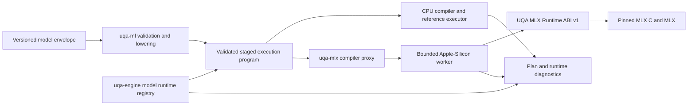

# MLX runtime support plan

Status: Active design and implementation plan

Update rule: Update this plan whenever the model format, backend contract, native-runtime lock, supported platform matrix, package layout, rollout phase, or release evidence changes. Do not describe MLX as a supported UQA Engine backend until every release gate in this plan is complete.

## 1. Decision

UQA Engine will support MLX as an explicit, observable inference runtime for UQA deep models on native Apple Silicon. The existing `uqa-ml/mlx` feature is only an experimental proof: it links whatever Homebrew libraries happen to be present, accelerates only an exact `Input -> Dense -> Softmax` feature-batch shape, executes `predict` and `deep_learn` on the CPU, silently sends every other feature model to the CPU, rebuilds all MLX arrays on every call, and is not selected by `uqa-engine` or any shipped binding. Passing its two MLX tests is not release evidence.

The production boundary will consist of a backend-neutral validated execution program in `uqa-ml`, a content-addressed model runtime in `uqa-engine`, a safe Rust MLX adapter in a new `uqa-mlx` crate, and a versioned private native library named `libuqa_mlx_runtime.1.dylib`. The private library will contain the pinned MLX C and MLX implementation and export only UQA's narrow C ABI, so UQA neither binds handwritten upstream enum values nor replaces an embedding process's global MLX error handler.

MLX training, arbitrary MLX Python functions, MLX-LM generation, and arbitrary Hugging Face model loading are not part of this plan. The model envelope and compiler registry leave room for additional model kinds, but adding one requires its own input, output, tokenizer, artifact-security, persistence, and verification contract.

## 2. Goals and non-goals

The first supported target is deterministic batch inference for persisted `UqaDeepFusionV1` models on `aarch64-apple-darwin` with macOS 14 or newer. CPU behavior remains available on every current UQA target and remains the default until the `Auto` policy has independent correctness and performance evidence.

The implementation must satisfy all of the following goals:

- A requested strict MLX execution either runs every planned tensor stage on MLX or fails before inference; it never returns a CPU result under an MLX label.
- CPU and MLX consume the same validated model and normalized execution program, with an explicit precision policy and declared numerical tolerances.
- Persisted model data is backend-neutral, versioned, checksummed, transaction-safe, and portable between CPU-only and MLX-capable installations.
- Native library failures become structured Rust errors; malformed models and unavailable devices never terminate the host process.
- MLX devices, streams, arrays, compiled functions, and parameter buffers have one auditable owner and never rely on unchecked `Send` or `Sync` implementations.
- Official Python, Node.js, and CLI packages can install and run MLX without Homebrew, `/opt/homebrew` rpaths, an Xcode toolchain, or network access during package installation.
- Runtime inspection and `EXPLAIN ANALYZE` show the requested policy, actual stage placement, device, precision, model digest, compilation state, queue time, and any plan-time CPU choice.

The following are deliberate non-goals for the first supported release:

- MLX on Intel macOS, Linux, Windows, mobile targets, or browser WebAssembly.
- Transparent GPU selection as the default.
- Runtime recovery by replaying a failed MLX request on the CPU.
- GPU preemption in the middle of a submitted MLX graph.
- Distributed inference or training.
- Persisting compiled MLX handles, generated kernels, device identities, or runtime caches in the database catalog.

## 3. Audited current boundary

The repository audit on 2026-08-27 found the following gaps between the existing implementation and a supportable runtime:

| Boundary | Current repository behavior | Required replacement |
| --- | --- | --- |
| Backend API | `MLBackend` combines execution-context inference, feature inference, and training in one trait. | Separate validation and lowering, inference compilation, compiled execution, and training contracts. |
| Engine use | `Engine::deep_predict*` calls `DeepModel` CPU helpers directly; `uqa-engine` has no MLX feature, registry, or configuration. | Route every model execution through a shared runtime registry and an explicit backend policy. |
| Layer coverage | MLX recognizes only an exact `Input -> Dense -> Softmax` feature model and silently calls CPU code for every other model. | Produce a complete capability plan before execution and reject unsupported strict plans without fallback. |
| FFI | `mlx.rs` declares opaque layouts, dtype and device enum values, and functions by hand. | Generate bindings for a UQA-owned versioned ABI and keep upstream MLX handles inside the private runtime. |
| Native resolution | `build.rs` scans environment variables, Homebrew prefixes, `/opt/homebrew/lib`, and `/usr/local/lib`, then writes runtime rpaths to those directories. | Load one verified UQA runtime artifact from an explicit or package-provided absolute path. |
| Error behavior | Upstream MLX C's default handler prints and calls `exit(-1)`; UQA does not replace it. | Install a non-terminating handler inside the private runtime and return a structured status plus a bounded error message. |
| Lifecycle | Input, weights, bias, and result arrays are converted and allocated for every call; no compiled graph or resident-parameter cache exists. | Compile once per content and input signature, retain immutable parameters, and evaluate once per batch. |
| Threading | One raw device and stream are stored directly in `MLXBackend`; the ownership relationship to engine sessions is undefined. | Own all native objects on a dedicated worker thread and share only a bounded request channel. |
| Model format | The catalog stores an unversioned JSON `DeepModel` containing `layers`, `alpha`, and `gating`. | Store a versioned envelope with feature, normalization, precision, output, compatibility, and digest metadata. |
| Precision | Inputs and parameters are silently narrowed from `f64` to `f32`, then results are widened to `f64`. | Make narrowing an explicit model execution policy and compare MLX with a CPU `f32` reference. |
| Packaging | No Python wheel, Node platform package, CLI artifact, or release job enables or bundles MLX. | Publish a separate signed Apple-Silicon runtime payload and smoke-test it in an environment without system MLX. |
| Evidence | Two crate tests run only when a developer has compatible libraries installed. | Run one shared backend contract suite, engine integration tests, process-survival tests, package tests, and benchmarks that prove actual MLX counters changed. |

On the audited Apple-Silicon host, `cargo test -p uqa-ml --features mlx` passed 26 tests against Homebrew MLX C 0.6.0_2 and MLX 0.31.2. `otool` showed absolute Homebrew dependencies, and the installed artifacts occupied approximately 732 KiB for `libmlxc.dylib`, 15 MiB for `libmlx.dylib`, and 150 MiB for `mlx.metallib`. These measurements explain the current probe but are not portable build or release inputs.

## 4. Architecture



### 4.1 Crate ownership

| Component | Ownership |
| --- | --- |
| `uqa-ml` | Model envelope, legacy migration, semantic validation, shape inference, staged execution IR, backend traits, CPU compiler, CPU `f64` behavior, CPU `f32` parity reference, and analytical trainer. It has no MLX linkage or native handles. |
| `uqa-mlx-sys` | Dynamic loading and generated bindings for the UQA-owned runtime ABI, ABI negotiation, status and string ownership, and no model semantics. Its unsafe code is isolated and reviewed at the function-table boundary. |
| `uqa-mlx` | Safe MLX backend descriptor, compiler proxy, worker actor, request queue, compiled-model proxies, cache accounting, cancellation checks, and conversion between `uqa-ml` tensor programs and the native ABI. |
| `native/mlx-runtime` | C++ private library that validates tensor-program bytes, installs the non-terminating MLX C error handler, owns every upstream object, builds and compiles MLX graphs, executes batches, and exports only `uqa_mlx_runtime_get_api_v1`. |
| `uqa-engine` | Runtime registry, engine and session policy, content-addressed compiled-model cache, transaction-aware model resolution, SQL/API error mapping, `EXPLAIN` annotations, and introspection. |
| Python, Node.js, and CLI packages | Locate the matching signed runtime payload, pass its canonical path to the engine, expose backend selection and diagnostics, and preserve CPU-only installation. |

The current `uqa-ml/mlx` feature and `MLXBackend` type are removed after the replacement backend passes the focused contract suite. A temporary deprecated alias may exist for one release only if it constructs the new runtime and cannot preserve the old silent fallback behavior.

### 4.2 Durable and process-local ownership

| State | Owner | Sharing and lifetime |
| --- | --- | --- |
| `ModelEnvelopeV1` and canonical content digest | Durable catalog and session-local catalog cache | Transactional and portable; a session resolves the model version visible to its transaction. |
| Backend policy | Engine default plus session or request override | Session-local unless explicitly set on an individual request. |
| Runtime registry and compiled-artifact LRU | `RuntimeExtensions` | Shared by sibling sessions in one process; keyed by content rather than mutable model name. |
| Request queue and worker handle | One `uqa-mlx` runtime per physical device | Shared through `Arc`; queue capacity and memory budget are configured at runtime creation. |
| MLX device, stream, arrays, closures, and native model handles | Dedicated worker thread | Created, used, and destroyed on that thread only. |
| Query cancellation and deadline | Query runtime/request | Checked before enqueue, before compilation, before dispatch, and after synchronization; an in-flight GPU graph is not claimed to be preemptible. |

No native pointer receives an unsafe `Send` or `Sync` implementation. `CompiledModel` is a thread-safe proxy containing an immutable plan description, cache key, and worker channel, while the corresponding native handle remains in the worker's handle table.

### 4.3 Backend contracts

The existing all-in-one `MLBackend` trait is replaced by contracts with distinct responsibilities. Exact Rust names may change during implementation, but the separation is mandatory.

```rust
pub trait ModelCompiler: Send + Sync {
    fn descriptor(&self) -> BackendDescriptor;
    fn capabilities(&self) -> BackendCapabilities;
    fn compile(&self, model: &ValidatedModel, plan: &ExecutionPlan, options: &CompileOptions) -> MLResult<Arc<dyn CompiledModel>>;
}

pub trait CompiledModel: Send + Sync {
    fn execution_plan(&self) -> &ExecutionPlan;
    fn infer(&self, input: InferenceInput<'_>, control: &InferenceControl) -> MLResult<InferenceOutput>;
}

pub trait ModelTrainer: Send + Sync {
    fn train(&self, training_set: &TrainingSet, options: &LearnOptions) -> MLResult<TrainedModel>;
}
```

Analytical CPU training implements `ModelTrainer`; it is not a method on an MLX inference compiler. An MLX trainer can be added later without making CPU training look like MLX training.

### 4.4 Backend policy

| Policy | Contract |
| --- | --- |
| `Cpu` | Compile and execute every stage with the CPU backend. This is the initial default and the universal compatibility path. |
| `MlxStrict` | Require one fully MLX-lowerable tensor program on an available supported device; reject host graph stages and unsupported tensor operations before execution. |
| `Hybrid` | Permit explicitly reported host stages for graph and engine operations while requiring every tensor stage to lower to MLX; reject an unsupported tensor stage rather than hiding it on the CPU. |
| `Auto` | Select a complete placement at plan time from availability, capability, input shape, and measured crossover data; expose the selected placement and reason. Never replay a runtime MLX failure on CPU. |

`Auto` is not enabled as the default or advertised as performance-aware until its benchmark manifest and crossover rules are stable. Availability fallback is therefore a plan decision with visible diagnostics, not exception handling around execution.

## 5. Model envelope and migration

`ModelEnvelopeV1` is the only new catalog write format. It contains at least the following fields:

| Field | Contract |
| --- | --- |
| `schema_version` | Integer `1`; unknown versions fail before catalog publication or execution. |
| `model_kind` | Initially `uqa_deep_fusion_v1`; dispatch is closed and validated rather than inferred from JSON shape. |
| `features` | Ordered names or explicit positional identity, dimensions, scalar type, shape rules, null policy, and normalization specification. |
| `parameters` | Storage dtype and encoding, declared byte order where relevant, finite-value requirements, and parameter count and shape metadata. |
| `compute` | Allowed precision policies and whether narrowing to `f32` is permitted. Backend names are constraints, not persisted handles. |
| `outputs` | Score and optional class-probability semantics, class order, shape, and score extraction rule. |
| `model` | The versioned deep-layer graph, `alpha`, and gating behavior. |
| `compatibility` | Minimum engine model-schema version and any required semantic capability identifiers. |
| `provenance` | Optional trainer, dataset, feature-contract, and creation metadata that does not affect inference semantics. |
| `semantic_digest` | SHA-256 over UQA's canonical inference semantics, excluding digest fields and non-semantic provenance; this is the compiled-cache identity. |
| `envelope_checksum` | SHA-256 over the complete canonical envelope, including provenance and `semantic_digest` but excluding this checksum field. |

`uqa-ml` owns one deterministic canonical encoder with golden vectors; cache keys and integrity checks never hash incidental JSON whitespace or map ordering. Model save validates the envelope, recomputes both digests, persists the candidate inside the surrounding transaction, and publishes the session-visible registry only under the existing commit rules.

An existing bare `DeepModel` decodes as legacy schema version 0 with positional features, current layer semantics, CPU `f64` compute, and current output extraction. Reading does not rewrite the catalog. Saving or retraining that model writes V1, and migration tests open legacy memory, SQLite, and redb catalogs before verifying identical CPU output. Legacy V0 requires an explicit `AllowF32Narrowing` execution override before strict MLX use because the old format never consented to precision loss.

Compiled artifacts are keyed by the semantic digest rather than model name. Replacing or rolling back a named model therefore selects the correct artifact without mutating an artifact that another transaction may still use; unreachable artifacts are reclaimed by bounded LRU eviction.

## 6. Validation, lowering, and execution

### 6.1 Validation order

Every inference request follows one ordered pipeline:

1. Decode the envelope with allocation and nesting limits, reject unknown fields where the version contract requires it, verify the digest, and validate all numeric values and dimensions.
2. Infer every intermediate shape and check parameter counts, channel agreements, convolution geometry, recurrent state sizes, graph prerequisites, output shape, and overflow before choosing a backend.
3. Lower the model to a backend-neutral `ExecutionProgram` containing host stages and tensor stages with explicit doc-id mappings and dtypes.
4. Ask the selected compiler for a capability and placement plan for the whole program; strict policies fail here without allocating native objects.
5. Resolve or compile a content-addressed artifact, enqueue one bounded inference request, evaluate the lazy MLX graph once for the batch, validate output shape and finite values, and widen the declared `f32` result to the public `f64` carrier if required.

Validation is shared by CPU and MLX. A backend may reject a valid semantic program as unsupported, but it may not reinterpret an invalid model or change public score extraction.

### 6.2 Stage partitioning

The current model combines tensor math with operations over `ExecutionContext`, graph adjacency, doc ids, and operator signals. Pretending that every layer is a device tensor operation would either duplicate engine state inside MLX or change semantics, so lowering partitions maximal contiguous tensor regions while retaining engine-owned work as host stages.

| Model operation | Initial placement | Completion requirement |
| --- | --- | --- |
| Input and embedding materialization | Host boundary into a tensor stage | Preserve ordered doc-id association and declared dimensions. |
| Dense, gating, flatten, global pool, softmax, batch normalization, inference dropout | MLX tensor stage | Exact shape and inference-mode semantics against the CPU `f32` interpreter. |
| CNN1D and CNN2D | MLX tensor stage | Match current stride, padding, layout, bias, and gating semantics. |
| Attention, RNN, and LSTM | MLX tensor stage | Match sequence order, scaling, gate order, hidden-state initialization, and `return_sequences`. |
| Graph propagate, graph convolution, and graph pool | Host stage | Preserve graph direction, edge-label filtering, aggregation, BFS grouping, representative doc id, and residual behavior. |
| Runtime signal operators | Host stage | Preserve operator execution and log-odds fusion before entering the next tensor region. |

`MlxStrict` accepts only a program without host stages. `Hybrid` makes each boundary visible in its plan and executes host and MLX stages in order. There is no policy that silently interprets one unsupported tensor operator on the CPU in the middle of a nominally MLX stage.

### 6.3 Tensor program and native compilation

`uqa-ml` lowers tensor stages to a versioned, bounds-checkable `TensorProgramV1` with declared inputs, constants, operations, outputs, shapes, and dtypes. The CPU `f32` reference interpreter and the native MLX compiler consume the same program, preventing two independent layer-semantics implementations.

The UQA runtime ABI accepts a deterministic serialized tensor program and immutable parameter buffers at compile time, then accepts contiguous input batches at inference time. Raw `mlx_array`, stream, device, closure, and string objects never cross the private library boundary. The native decoder validates magic, ABI version, lengths, indexes, shapes, byte counts, and checksums before constructing any MLX object.

The native compiler retains parameter arrays and a compiled pure function. MLX operations remain lazy until one output evaluation per request. The first implementation keys compiled functions by exact input rank, dtype, and dimensions; bounded exact-shape caching is safer than shapeless compilation until upstream behavior has dedicated conformance and memory tests.

Managed or zero-copy input buffers are an optimization, not a prerequisite. They may replace the initial owned copy only after lifetime, cancellation, concurrent request, and deallocation tests prove that Rust memory remains valid through MLX evaluation.

### 6.4 Precision and result parity

Current public scores and probabilities remain `f64`. CPU compatibility execution remains `f64`, while MLX initially computes `f32` and widens results only at the output boundary. A model that requires `f64` is rejected by `MlxStrict`; narrowing never happens because the feature was merely enabled.

The shared contract suite compares MLX with the CPU interpreter of the same `TensorProgramV1` in `f32`, then separately measures the declared difference from legacy CPU `f64`. Each operation family has checked absolute and relative tolerances, class ordering, tie behavior, stable softmax behavior, NaN and infinity rejection, and deterministic repeated-run evidence. Tolerances are recorded by operation and accumulated graph depth rather than using one permissive global epsilon.

### 6.5 Cache identity and limits

A compiled cache key includes the model semantic digest, backend implementation id, UQA runtime ABI, pinned MLX C and MLX build ids, device registry id, precision, complete stage placement, compile flags, tensor-program version, and exact input signature. Cache entries retain immutable model parameters and compiled functions and are held by `Arc` while a request is in flight.

The cache is bounded by entry count and accounted native bytes. Eviction removes only the registry reference and lets the owning worker destroy the native handle after in-flight references drain. Save, drop, rollback, catalog reopen, and sibling-session visibility tests prove that name resolution never reuses an artifact with the wrong digest.

## 7. Native runtime safety and lifecycle

### 7.1 Private ABI and dependency lock

`native/mlx-runtime/include/uqa_mlx_runtime.h` defines a size-tagged function table returned by `uqa_mlx_runtime_get_api_v1`. Every structure begins with a size and version, every buffer carries a pointer and length, every returned allocation has a paired free function, and every call returns a UQA status code. Rust bindings are generated from this header and checked in; CI regenerates them and rejects drift.

`native/mlx-runtime.lock.toml` records exact MLX C and MLX commits, source archive SHA-256 values, reviewed post-tag patches, license identities, minimum deployment target, compiler and SDK requirements, build flags, and the UQA ABI revision. The initial compatibility baseline starts from MLX C 0.6.0's declared MLX v0.31.2 pairing and includes only separately recorded fixes that pass the full contract. A version bump is one reviewed change to the lock, generated notices, SBOM, ABI tests, and runtime matrix.

Cargo build scripts do not clone repositories or download archives. An explicit bootstrap script materializes verified sources in a build cache for local native-runtime development and release CI; normal CPU builds never invoke CMake or require Xcode.

The native payload is one UQA-named dynamic library with a unique install name. MLX C and MLX are linked privately with hidden visibility, and an export list exposes only the ABI entry point. Release checks use `otool -L`, `nm`, and a clean-host loader test to reject Homebrew paths, unexpected public MLX symbols, unresolved non-system libraries, or a mismatched deployment target.

The initial payload uses `MLX_METAL_JIT=ON`, disables unneeded MLX CPU, SafeTensors, and GGUF components, and measures cold compilation separately. This avoids shipping the audited Homebrew build's approximately 150 MiB `mlx.metallib`; a future switch to a bundled metallib requires package-size, resource-location, signing, cold-start, and cache evidence in this plan.

### 7.2 Error containment

Upstream MLX C's default error handler calls `exit(-1)`. The private runtime installs its own non-terminating handler before any other MLX C call, records the bounded UTF-8 message in worker-thread-local state, lets the upstream wrapper return its status, and converts that status into a UQA ABI error. No C++ exception, Rust panic, callback unwind, or pointer to thread-local storage crosses the ABI.

The private copy prevents UQA from replacing or depending on another library's process-global MLX C handler. A subprocess test loads another MLX consumer before and after UQA, submits malformed programs and unavailable-device requests, and proves that the process remains alive and both handlers retain their expected behavior.

### 7.3 Worker, queue, cancellation, and shutdown

One worker initially owns one GPU device and one stream. Requests enter a bounded queue with a byte reservation; queue saturation returns resource exhaustion or waits only within the caller's declared deadline. Compilation and inference commands are serialized first, while batching or additional streams require benchmark and race evidence before changing this invariant.

Cancellation before dispatch removes or skips the request. Cancellation or deadline expiry after dispatch marks the response abandoned, but the worker synchronizes and releases all native resources before taking the next command because MLX graph execution is not claimed to be preemptible. Engine shutdown closes admission, drains or cancels queued work, synchronizes the worker, destroys compiled models before the stream and device, unloads the library last, and reports teardown errors without panicking in `Drop`.

The runtime config sets queue capacity, compiled-cache budget, MLX memory limit, wired-memory limit where supported, and maximum input/output bytes. Runtime statistics include queue depth, queue wait, compile count and duration, cache hits and evictions, execution duration, active and cached MLX bytes, peak memory, cancellations, failures, and abandoned completions.

## 8. Engine and public surfaces

`RuntimeExtensions` gains a shared `ModelRuntimeRegistry`. Engine construction registers CPU unconditionally and may register MLX from an explicit `ModelRuntimeConfig`; new persistent sessions share the process-local registry and compiled cache but retain their own transaction-visible model catalog and backend policy.

The Rust API gains an engine-level default policy, a per-request override for feature and execution-context prediction, runtime descriptors, and a dry-run model plan. Python and Node expose equivalent string enums and structured diagnostics. SQL uses a UQA session setting for the default and a request option where syntax already supports one; unsupported values fail during binding rather than being ignored.

The following information is available through Rust and binding APIs and through UQA-owned SQL introspection table functions:

- Registered backend id, availability, unavailability reason, runtime ABI, MLX C and MLX build versions, device name, supported dtypes, and capability set.
- Requested policy and actual ordered host/CPU/MLX stage placement for a named model and input signature.
- Model schema version, semantic digest, precision, compile key, cache state, and explicit plan-time selection reason.
- Aggregate queue, compilation, execution, cache, memory, cancellation, and error counters without exposing raw pointers or sensitive filesystem paths.

`EXPLAIN` reports planned placement and validation diagnostics. `EXPLAIN ANALYZE` adds actual backend, compile/cache outcome, queue time, execution time, and rows or batches while preserving the normal query result. Tests must assert an MLX execution counter or stage marker, so a numerically correct CPU fallback cannot satisfy MLX coverage.

Backend failures map consistently to API errors and SQLSTATEs: invalid model or input to `22023`, unsupported model capability to `0A000`, resource exhaustion to `53200`, cancellation or deadline to `57014`, unavailable explicitly requested runtime to `58000`, and an unexpected native invariant failure to `XX000`. The implementation verifies exact PostgreSQL behavior where a standard SQL boundary exists and keeps UQA-specific diagnostic fields supplemental.

## 9. Build and distribution

### 9.1 Target matrix

| Target | CPU | MLX runtime loader | Official MLX payload | Behavior when MLX is requested |
| --- | --- | --- | --- | --- |
| macOS 14+ Apple Silicon | Supported | Included when the engine `mlx` feature is enabled | Supported | Load the signed arm64 payload, verify ABI and versions, then compile or return a structured error. |
| macOS Apple Silicon below 14 | Supported | May be present | Not compatible | Report the minimum-OS requirement without attempting to load. |
| macOS Intel | Supported | Stub or omitted | None | Report unsupported architecture. |
| Linux, Windows, and other native targets | Supported | Stub or omitted | None in this plan | Report unsupported platform; never search for or load MLX. |
| Browser Emscripten/WASM | Supported where current CPU model execution is supported | Omitted | None | MLX is absent from the binding and build graph. |

Although current upstream MLX also documents Linux CPU and CUDA builds, UQA does not inherit support merely because upstream can compile there. Each additional backend and target requires a runtime ABI build, package, device lifecycle, numerical contract, and clean-host evidence equivalent to the Apple-Silicon matrix.

### 9.2 Cargo features

`uqa-ml` becomes native-runtime independent. `uqa-engine` adds an `mlx` feature that enables the safe loader and adapter through target-specific dependencies, and `uqa` propagates it. Enabling the feature on an unsupported target remains buildable and reports a typed unavailable backend, which keeps cross-platform dependency graphs coherent without pretending that a payload exists.

The release binding crates compile loader support on Apple Silicon, but the base CPU package does not eagerly load MLX. Runtime discovery uses, in order, an explicit engine path, a binding-provided signed package resource, or a clearly documented developer override. It never scans Homebrew prefixes, `/usr/local`, the current directory, or an ambient library search path.

### 9.3 Python, Node.js, and CLI packaging

The Python base wheel remains CPU-compatible. A `uqa-mlx-runtime` wheel for `macosx_14_0_arm64` contains the signed private dylib and manifest, and the `uqa[mlx]` extra selects it on Darwin arm64. The Python module resolves the resource with package APIs and passes the canonical path into the engine; importing `uqa` never loads MLX by itself.

The Node root and existing platform addon packages remain CPU-capable. An explicit `@cognica-io/uqa-mlx` package selects `@cognica-io/uqa-mlx-darwin-arm64`, and the JavaScript loader passes that package's verified runtime path to the addon. The MLX payload is not hidden in an unrelated Linux, Intel macOS, or Windows package.

The PyPI-installed `usql` executable uses the same Python runtime package and backend flags. Standalone CLI archives place the dylib in a signed resource directory and pass its resolved path explicitly. All packages include the dependency lock summary, licenses, notices, SBOM, checksums, minimum OS, and diagnostic command that prints runtime availability without executing a model.

Release smoke tests install from the produced wheel or npm tarball in a clean macOS 14+ arm64 environment with Homebrew MLX absent, run a strict MLX model, assert the MLX runtime and execution counters, inspect dependencies and signatures, uninstall the runtime payload, and assert that CPU still works while strict MLX reports unavailable.

## 10. Verification and performance gates

### 10.1 Shared backend contract

One table-driven contract suite runs the normalized model matrix through CPU `f32` and MLX. It covers every supported layer and gating combination, boundary dimensions, empty and multi-row batches, multiple output channels, stable softmax, convolution layouts, recurrent state, graph-to-tensor transitions, invalid shapes, integer overflow, allocation limits, NaN and infinity, deterministic repetition, and cleanup after every failure.

The suite records which backend and stage executed. An MLX test fails if no native compilation and execution counter changes. Unsupported strict plans assert the exact first unsupported operation and do not assert a CPU result.

### 10.2 Engine and lifecycle tests

- Save, load, legacy migration, reopen, replacement, drop, explicit transaction rollback, savepoint rollback, and sibling-session visibility use the correct semantic digest and cache entry.
- Concurrent sessions submit bounded requests without sharing raw handles, exceeding memory limits, deadlocking shutdown, or returning one request's doc ids or output to another.
- Cancellation is tested before enqueue, while queued, before dispatch, and after dispatch with the documented non-preemptive completion behavior.
- Invalid native input, missing runtime, ABI mismatch, unsupported device, MLX error, worker panic containment, and teardown failure preserve the host process and structured error contract.
- Python releases GIL ownership while waiting; Node uses its asynchronous worker boundary; closing either engine during inference drains resources safely.
- CPU-only targets compile and run the shared engine model tests without a native-runtime dependency or loader attempt.

### 10.3 CI shape

PR CI keeps one fast CPU contract job and path-filters one focused Apple-Silicon MLX contract job to model, runtime, engine-model, binding-loader, native-lock, and package-script changes. Superseded runs are cancelled, the verified native SDK is content-addressed by the lock file, and one ready-to-merge or merge-queue run supplies the required hardware result instead of rebuilding the complete package matrix for every intermediate commit.

Nightly CI runs sanitizer and stress variants, repeated concurrent-session tests, the full platform CPU matrix, and cold and warm benchmarks. Release CI alone builds and signs every distributable payload and runs clean-host Python, Node, and CLI installation tests. A lock-file update invalidates every native cache and forces all native, package, license, and ABI jobs.

### 10.4 Benchmarks and `Auto`

Benchmarks separate runtime load, first-kernel JIT, first model compilation, warm cache, host-to-runtime input preparation, execution, output materialization, and end-to-end query time. They cover exact batch and feature shapes, dense, convolutional, recurrent, attention, and hybrid graph pipelines on recorded hardware and compare the same output digest and tolerance checks before timing.

No acceleration claim is published from a microbenchmark alone. A designated workload may be called accelerated only when warm end-to-end p50 is at least 1.25 times CPU `f32`, p95 is not worse, memory stays within the declared budget, and results pass the contract; cold-start cost remains reported separately. `Auto` uses only checked-in crossover rules derived from those workloads and falls back at planning time with an inspectable reason.

## 11. Implementation sequence

Each slice is independently reviewable and leaves public claims no broader than passing evidence.

### Phase 0: Make the current boundary truthful and safe

- Mark the existing feature as an experimental direct-crate probe in current architecture, manual, plan, and crate documentation.
- Replace its silent unsupported-shape CPU fallback with a capability error and install a non-terminating error handler before retaining the probe for development.
- Add a subprocess survival test and keep the feature out of engine and release packages.

Exit gate: No current documentation calls the probe a supported engine backend, and malformed MLX calls cannot terminate the test process.

### Phase 1: Version the model and split backend responsibilities

- Add `ModelEnvelopeV1`, canonical encoding and digest, legacy V0 decoding, full validation and shape inference, precision policy, staged execution IR, and separate compiler, compiled-model, and trainer traits.
- Refactor current CPU `f64` execution through the validated program and add a CPU `f32` tensor-program interpreter.
- Migrate catalog save, load, transaction snapshots, and reopen tests without requiring MLX.

Exit gate: Every current CPU model and catalog test passes through the new envelope and validator, legacy catalogs reopen identically, and model-name replacement is digest-safe across rollback.

### Phase 2: Build the isolated native runtime

- Add the dependency lock, verified bootstrap, private C ABI, generated sys bindings, hidden-symbol dynamic library, error containment, version handshake, and runtime loader.
- Implement the worker actor, bounded queue, resource limits, ordered shutdown, statistics, and process-survival matrix before layer acceleration.

Exit gate: A clean Apple-Silicon test loads the private runtime without Homebrew, executes an ABI self-test, survives every injected failure, and exposes no upstream MLX symbols or non-system path dependencies.

### Phase 3: Complete tensor-model inference

- Lower and verify dense, gating, reshape, pooling, softmax, normalization, dropout, CNN1D, CNN2D, attention, RNN, and LSTM operations through `TensorProgramV1`.
- Retain immutable parameters and compiled functions, implement bounded exact-shape caching, and verify all outputs against CPU `f32`.
- Remove the old `uqa-ml/mlx` implementation after the replacement suite covers its valid case.

Exit gate: `MlxStrict` supports every model made solely from the documented tensor layers, rejects every unsupported operation before native allocation, and passes numerical, leak, concurrency, and cache tests.

### Phase 4: Integrate engine placement and hybrid execution

- Add the shared model runtime registry, policy configuration, content-addressed cache, host and tensor stage executor, transaction-aware name resolution, diagnostics, SQL/API error mapping, and `EXPLAIN` evidence.
- Verify graph and signal host stages around MLX tensor stages without losing doc-id identity or changing score semantics.

Exit gate: `deep_predict` and `deep_predict_features` use the registry, strict and hybrid policies are observable and deterministic, and multi-session persistent tests pass without native-state leakage.

### Phase 5: Ship supported packages

- Add the Python runtime wheel and extra, Node runtime packages, CLI resource layout, feature propagation, signing, licenses, notices, SBOM, and release inventory.
- Add clean-host package installation, execution, dependency inspection, uninstall, and CPU-only fallback tests.

Exit gate: All official Apple-Silicon surfaces run the same strict MLX fixture without system MLX, every other target remains CPU-correct, and support documentation states the exact OS, architecture, policy, model kind, layer, and precision matrix.

### Phase 6: Enable measured automatic placement

- Publish benchmark provenance and crossover rules, add stable cache and runtime metrics, and enable `Auto` only for shapes with evidence.
- Evaluate additional streams or dynamic batching only after the serialized worker baseline is correct and benchmarked.

Exit gate: `Auto` decisions are reproducible, inspectable, within memory and latency budgets, and never use runtime-error replay as fallback.

MLX training is a separate plan after Phase 5. Until then, `deep_learn` truthfully reports CPU analytical training even when the resulting model is later compiled for MLX inference.

## 12. Release definition of done

MLX support is complete for the declared first-release scope only when all of these statements are true:

- No current public document or package metadata overstates the old probe or an unverified layer, target, training path, or automatic selection path.
- `uqa-ml` contains no upstream native bindings, raw MLX handles, or MLX build script.
- The private runtime is reproducible from a reviewed lock, has a stable UQA ABI, contains no Homebrew dependency, does not export upstream MLX symbols, and cannot terminate the embedding process through the MLX C default handler.
- The complete tensor-layer matrix and declared hybrid graph boundaries pass CPU `f32` versus MLX parity with operation-specific tolerances and actual-backend evidence.
- Model format migration, digest identity, transaction rollback, persistent reopen, cache eviction, multi-session execution, cancellation, limits, and shutdown all pass.
- Python, Node.js, and CLI clean-host package tests pass on macOS 14+ arm64; Intel macOS, Linux, Windows, and WASM CPU tests prove MLX is absent or explicitly unavailable.
- Cold-start, warm, memory, and crossover benchmarks are published with executable, runtime-lock, model, input, and device provenance before `Auto` or acceleration claims are enabled.

## 13. Upstream facts used by this design

- [MLX installation and build documentation](https://ml-explore.github.io/mlx/build/html/install.html) defines the Apple-Silicon Python requirement, macOS 14 minimum, source-build toolchain, static-link metallib placement, `MLX_METAL_JIT`, and its cold-start tradeoff.
- [MLX unified-memory documentation](https://ml-explore.github.io/mlx/build/html/usage/unified_memory.html) explains that arrays share unified memory and operations select a device or stream, which is why stage placement and stream ownership belong to execution rather than persisted model data.
- [MLX compilation documentation](https://ml-explore.github.io/mlx/build/html/usage/compile.html) documents lazy first compilation, cache reuse, recompilation when input signatures change, and pure-function constraints.
- [MLX C](https://github.com/ml-explore/mlx-c) is the official C API; its current CMake source identifies MLX C 0.6.0, builds static by default, and pins MLX v0.31.2 when it does not use a system installation.
- [MLX C object and array ownership](https://ml-explore.github.io/mlx-c/build/html/overview.html), [closures](https://ml-explore.github.io/mlx-c/build/html/closure.html), and [streams](https://ml-explore.github.io/mlx-c/build/html/stream.html) require exact handle lifecycle and explicit stream-aware execution.
- [The upstream MLX C error implementation](https://github.com/ml-explore/mlx-c/blob/main/mlx/c/error.cpp) shows that its default handler calls `exit(-1)`, making private error-handler ownership a correctness requirement rather than an optional diagnostic improvement.
