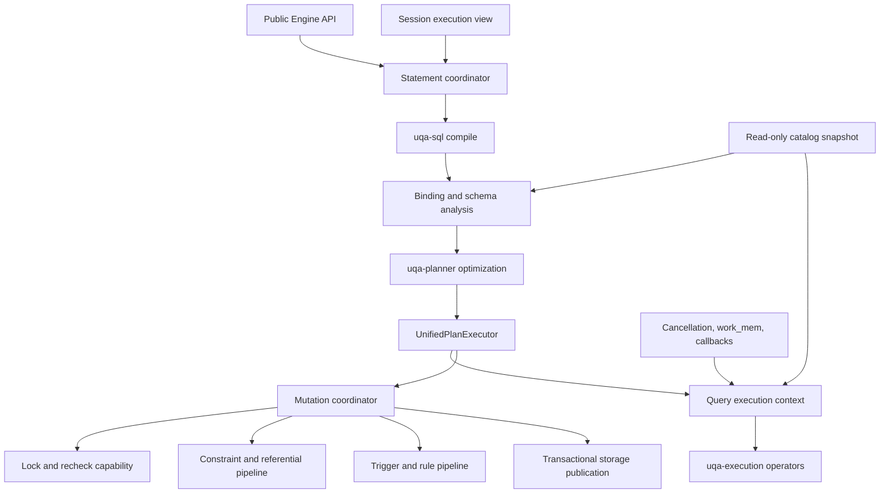

# Rust workspace refactoring plan

Status: Active architecture refactoring plan

Current implementation position: Phase 0 and Phase 1 are complete. The checked-in transition ratchet now inventories 66 files at or above 1,000 physical lines, four narrow capability views govern selected statement boundaries, the facade roots and sole dispatcher have been reduced without adding an execution path, and Phase 2 catalog and query-planning migration is next.

Update rule: Update this plan whenever a listed structural hotspot, capability boundary, crate responsibility, line-budget gate, test ownership rule, rollout phase, or completion metric changes. A file move or line-count reduction is not complete evidence unless the resulting owner, dependency direction, behavior contract, and focused tests satisfy this plan.

## 1. Decision

UQA Engine will refactor the Rust workspace around explicit ownership boundaries rather than repeatedly splitting files just below the current 1,500-line ceiling. `uqa-engine` remains the public composition root, but SQL binding, catalog projection, relational execution, mutation coordination, transaction state, and locking algorithms must receive only the capabilities they require instead of using `&Engine` as a general service locator.

The work preserves one compiled SQL path through `UnifiedPlan` and `UnifiedPlanExecutor`, the existing public `Engine` API, persistent catalog compatibility, structural executor-only column identities, PostgreSQL 18 behavior, and the single integration-test target per crate. Refactoring must not introduce a second dispatcher, a parallel SQL dialect, fabricated internal SQL names, silent fallback, compatibility waivers, or a new crate whose only purpose is to hide line count.

## 2. Goals and non-goals

The refactoring has the following goals:

- Make the crate responsibilities declared in [`0001-uqa-engine-implementation-plan.md`](0001-uqa-engine-implementation-plan.md) and the [internal architecture manual](../manual/internals/01-architecture.md) true at implementation boundaries.
- Keep `Engine` as a thin public facade and composition owner while moving reusable pure algorithms and state machines behind narrow domain interfaces.
- Separate statement compilation, binding, optimization, physical construction, execution, mutation, and publication so each stage can be reviewed and tested without importing the complete engine namespace.
- Split every hand-maintained oversized Rust source by responsibility and finish with a 1,000-physical-line hard ceiling rather than treating 1,500 lines as a design target.
- Replace module- or crate-wide Clippy exemptions for complexity symptoms with local remediation or narrowly justified exemptions at the irreducible algorithm boundary.
- Preserve focused development speed by keeping each change behavior-neutral, running owning tests locally, and dispatching the full pre-merge suite only after the final review head converges.
- Reduce duplicated integration-test setup and organize tests by behavior contract without adding another top-level Cargo test target.

The following are non-goals:

- Rewriting the engine from scratch or replacing working algorithms solely to reduce LOC.
- Changing public SQL, Rust API, result layout, SQLSTATE, catalog format, persistence semantics, score semantics, transaction isolation, or lock behavior as an incidental part of a move.
- Combining an independently discovered PostgreSQL 18 behavior fix with a structural move; record and verify the bug through the PostgreSQL 18 plan, then apply the smallest semantic fix in a separate commit or PR.
- Moving stateful engine orchestration into a lower crate by adding a reverse dependency on `uqa-engine`.
- Splitting `OperatorTree` and relational SQL into competing top-level execution paths.
- Refactoring the imported `uqa-pg-query` source; its generated and synchronized files remain governed by the upstream synchronization process.
- Adding test executables to make a large test target appear smaller.
- Renaming established all-capital initialisms such as CPU, MLX, and UQA in prose or Rust identifiers.

## 3. Audited current boundary

The implementation baseline audit was performed on 2026-08-31 at commit `7571d18b2e7d8efeb5635e4bd2c276bc5adb1c20`. The worktree was clean. `python3 scripts/check-workspace-dependencies.py` passed with 94 runtime edges across 30 crates, and `python3 scripts/check-integration-test-harnesses.py` passed with 218 registered sources in 18 targets across 18 crates. The former all-or-nothing 1,500-line script failed on six files at that audit. Phase 0 replaced it with the checked-in exact-baseline transition ratchet and then resolved all six urgent entries without changing the public behavior or integration-test target topology.

The `cloc 2.08` totals below come from `cloc --include-lang=Rust crates`. This scope excludes build output and includes tests, benches, examples, build scripts, imported parser code, and generated Rust. The previous-plan column preserves the 2026-08-27 audit so growth is explicit rather than silently replacing the baseline.

| Metric | 2026-08-27 | 2026-08-31 | Change |
| --- | ---: | ---: | ---: |
| Cargo crates under `crates/` | 25 | 25 | 0 |
| Rust files | 1,246 | 1,269 | +23 |
| Code | 364,251 LOC | 401,203 LOC | +36,952 LOC |
| Comments | 18,559 LOC | 18,785 LOC | +226 LOC |
| Blank lines | 25,203 LOC | 26,707 LOC | +1,504 LOC |
| `src/`, including inline tests | 271,603 LOC | 297,400 LOC | +25,797 LOC |
| Top-level `tests/` | 83,287 LOC | 94,411 LOC | +11,124 LOC |
| `benches/` | 7,866 LOC | 7,897 LOC | +31 LOC |
| `examples/` | 1,299 LOC | 1,299 LOC | 0 LOC |
| Root build scripts | 196 LOC | 196 LOC | 0 LOC |

At the 2026-08-31 baseline, the largest ownership concentrations were:

| Boundary | Files | Code LOC | Workspace share | Change from 2026-08-27 | Relevant detail |
| --- | ---: | ---: | ---: | ---: | --- |
| `uqa-engine` total | 554 | 211,882 | 52.81% | +33,848 LOC | Includes 126,986 LOC under `src/`, 79,232 LOC under top-level `tests/`, 4,365 LOC of benches, and 1,299 LOC of examples. |
| `uqa-engine/src/sql`, including `sql.rs` | 174 | 81,952 | 20.43% | +15,837 LOC | Represents 64.54% of `uqa-engine/src`; most recent growth is concentrated in PostgreSQL 18 view DML and its tests. |
| `uqa-storage` | 153 | 35,002 | 8.72% | +1,123 LOC | Storage remains the largest lower-crate owner. |
| `uqa-sql` | 103 | 33,341 | 8.31% | +1,210 LOC | Its crate root still grants `too_many_lines` to every descendant. |
| `uqa-execution` | 79 | 25,640 | 6.39% | +87 LOC | Its crate root still grants `too_many_lines` to every descendant. |

The generated `uqa-pg-query/src/protobuf.rs` still contributes 9,077 code lines to the raw `cloc` total. It remains included in total repository size but excluded, together with the rest of imported `uqa-pg-query`, from hand-maintained file-size gates.

The oversized-file population has grown at every measured threshold despite one focused SQL split. Counts exclude `uqa-pg-query` and use physical lines so they match the repository policy:

| Minimum physical lines | 2026-08-27 | 2026-08-31 | Phase 0 boundary | Boundary change from audit |
| --- | ---: | ---: | ---: | ---: |
| 1,000 | 52 | 69 | 68 | -1 |
| 1,200 | 32 | 43 | 42 | -1 |
| 1,350 | 19 | 35 | 33 | -2 |
| 1,400 | 15 | 29 | 26 | -3 |
| 1,450 | 8 | 17 | 12 | -5 |
| 1,501 | Not recorded | 6 | 0 | -6 |

The six emergency-ceiling violations at the audit were `sql/dml/view_automatic.rs` at 4,114 lines, `tests/sql_views/automatic_updatability.rs` at 3,486, `sql/dml.rs` at 1,877, `sql/dml/merge.rs` at 1,732, `sql/dml/insert.rs` at 1,731, and `sql/dml/view_triggers.rs` at 1,698. Phase 0 resolved them as follows without deleting or compressing PostgreSQL 18 compatibility assertions:

| Former hotspot | Boundary root after Phase 0 | Responsibility-owned children added in Phase 0 |
| --- | ---: | --- |
| `sql/dml/view_automatic.rs` | 1,290 | `validation.rs`, `correlation.rs`, `returning.rs`, `rewrite_insert.rs`, `rewrite_update_delete.rs`, and `rewrite_merge.rs` |
| `tests/sql_views/automatic_updatability.rs` | 93 | `classification.rs`, `correlation.rs`, `insert.rs`, `update_delete.rs`, `merge.rs`, `returning.rs`, and `rules.rs`; the same two `#[test]` entry points and all 74 functions remain |
| `sql/dml.rs` | 1,428 | `view_rules.rs` owns view-rule projection, batching, and returning capture |
| `sql/dml/merge.rs` | 1,455 | `merge/returning.rs` owns MERGE row-image and projection construction |
| `sql/dml/insert.rs` | 1,350 | `insert/staging.rs` owns prepared-row validation, staging, publication, defaults, and vector extraction |
| `sql/dml/view_triggers.rs` | 1,432 | `view_triggers/insert.rs` owns the `INSTEAD OF INSERT` workflow |

Engine coupling also increased. The counts below use the same file-level searches as the previous audit; they measure surface concentration rather than architectural quality by themselves.

| Coupling measure | 2026-08-27 | 2026-08-31 | Phase 0 boundary | Boundary change from audit |
| --- | ---: | ---: | ---: | ---: |
| Rust files under `uqa-engine/src` | 284 | 297 | 307 | +10 |
| Files mentioning `Engine` | 210 | 222 | 232 | +10 |
| Files containing literal `impl Engine` | 68 | 73 | 73 | 0 |
| SQL files, including `sql.rs` | 165 | 174 | 184 | +10 |
| SQL files mentioning `Engine` | 123 | 132 | 142 | +10 |
| SQL files importing their parent module | 152 | 160 | 170 | +10 |
| SQL files using `use super::*;` | 7 | 7 | 7 | 0 |

The existing state split remains the foundation: `StorageContext`, `DurableCatalogState`, `SessionContext`, `RuntimeExtensions`, `EpochCoordinator`, and `QueryRuntime` distinguish ownership domains. The current tree now wraps those owners with `CatalogReadView`, `SessionExecutionView`, `QueryRuntimeView`, and `MutationCoordinator`; engine-free `pg_namespace` and `pg_settings` builders plus the `CREATE SCHEMA` path prove the selected read and write boundaries, while the remaining catalog, query, and mutation migration belongs to the later domain bundles.

The three broad lint boundaries also remain. Phase 0 temporarily removed each root `clippy::too_many_lines` allowance and ran the owning library with `-D warnings`: `uqa-engine/src/sql.rs` exposed 115 existing long-function diagnostics, `uqa-execution/src/lib.rs` exposed 16, and `uqa-sql/src/lib.rs` exposed 40. Phase 1 reduced `sql.rs` from 1,115 to 337 physical lines, but removing its descendant-wide allowance still requires the catalog, query, and mutation ownership moves; the two lower-crate allowances remain Phase 5 work, so none has been replaced by unreviewed local waivers.

### 3.1 Phase 0 boundary measurement

The Phase 0 boundary was measured on 2026-08-31 with `bash scripts/measure-rust-refactoring.sh`. `cloc 2.08` reports 1,286 Rust files, 401,389 code lines, 18,877 comment lines, and 26,741 blank lines under `crates/`; the hand-maintained physical-line report excludes imported `uqa-pg-query` and reports 1,281 files, 431,716 physical lines, 68 inventoried files, and no file above 1,500 lines. The largest governed file is `uqa-sql/src/expr.rs` at 1,493 physical lines.

| Crate | Rust files | Physical lines | Crate | Rust files | Physical lines |
| --- | ---: | ---: | --- | ---: | ---: |
| `uqa` | 1 | 24 | `uqa-analysis` | 16 | 3,092 |
| `uqa-api` | 6 | 2,212 | `uqa-cli` | 14 | 4,258 |
| `uqa-client` | 12 | 1,864 | `uqa-core` | 24 | 7,746 |
| `uqa-engine` | 571 | 230,448 | `uqa-execution` | 79 | 28,942 |
| `uqa-fdw` | 5 | 2,424 | `uqa-fusion` | 15 | 3,007 |
| `uqa-graph` | 74 | 19,817 | `uqa-joins` | 6 | 1,993 |
| `uqa-ml` | 18 | 4,524 | `uqa-node` | 14 | 2,654 |
| `uqa-operators` | 26 | 6,650 | `uqa-pg-wire` | 11 | 4,553 |
| `uqa-planner` | 50 | 13,442 | `uqa-python` | 22 | 2,111 |
| `uqa-scoring` | 42 | 9,952 | `uqa-sql` | 103 | 37,153 |
| `uqa-storage` | 153 | 40,147 | `uqa-storage-redb` | 6 | 1,126 |
| `uqa-storage-sqlite` | 1 | 826 | `uqa-wasm` | 4 | 1,570 |

At the Phase 0 boundary, `uqa-engine/src/sql` contained 184 Rust files and 87,528 physical lines. The increase in file and `Engine`-mention counts from behavior-neutral decomposition was not credited as capability decoupling; the following bundle therefore had to reduce ambient facade access through typed capability boundaries rather than manipulate the raw count.

The fixed runner is `cargo test -p uqa-engine --test integration --no-run --locked --offline`. On Rust and Cargo 1.90.0 for `aarch64-apple-darwin`, a new isolated target directory completed the full offline compile and link in 142.76 seconds (`user` 986.44 seconds, `sys` 164.62 seconds), and the unchanged warm no-op completed in 0.30 seconds. These machine-specific values are a local regression baseline, not a cross-machine performance claim.

### 3.2 Phase 1 boundary measurement

The Phase 1 boundary was measured on 2026-08-31 with `bash scripts/measure-rust-refactoring.sh`. `cloc 2.08` reports 1,294 Rust files, 401,863 code lines, 18,917 comment lines, and 26,829 blank lines under `crates/`; the hand-maintained report excludes imported `uqa-pg-query` and reports 1,289 files, 432,318 physical lines, 66 inventoried files, and no file above 1,500 lines. The largest governed file remains `uqa-sql/src/expr.rs` at 1,493 physical lines.

| Boundary | Rust files | Physical lines or current size |
| --- | ---: | ---: |
| `uqa-engine` | 579 | 231,050 |
| `uqa-engine/src/sql`, including `sql.rs` | 187 | 87,467 |
| `uqa-engine/src/lib.rs` | 1 | 885 |
| `uqa-engine/src/sql.rs` | 1 | 337 |
| `UnifiedPlanExecutor` owner | 1 | 557 |
| `engine_capabilities.rs` | 1 | 582 |

The raw coupling scan reports 313 Rust files under `uqa-engine/src`, 236 files mentioning `Engine`, 75 files containing literal `impl Engine`, 143 SQL files mentioning `Engine`, 173 SQL files importing their parent module, and seven SQL files using a parent glob. These counts are not credited as migration by themselves: the enforceable evidence is the checked-in capability policy covering 14 files, with 12 declared facade or orchestration adapters and two engine-free catalog leaves, together with rejection of catch-all services, `Deref`, stored `&Engine`, and engine-recovery methods.

The representative read path builds `pg_namespace` and `pg_settings` rows from catalog and session views. The representative write path promotes the statement transaction before delegating `CREATE SCHEMA` to `MutationCoordinator`, preserves rollback, commit, sibling-session visibility, and reopen behavior, and has no fallback to the deleted direct inner path. The single `uqa-engine` integration executable reports 2,067 passed, two ignored, and no failures across 2,069 discovered tests.

The current release `usql` was executed against the pinned Docker PostgreSQL 18.4 with Apache AGE oracle, not a dry run. All 797 differential probes matched, and the stateful suites matched routines 129/129, roles 136/136, constraints 162/162, type-temporal 49/49, triggers 584/584, rules 194/194, and transactions 61/61.

### 3.3 Phase status at the current implementation

| Phase | Status | Current evidence |
| --- | --- | --- |
| Phase 0: structural ratchet | Complete | The exact transition ratchet inventories 66 current files, rejects growth and new 1,000-line files, all six inherited 1,500-line violations are responsibility-split, the root lint debt is explicitly counted, and the fixed runner has clean and warm timing baselines. |
| Phase 1: capability boundaries and facade roots | Complete | Four narrow borrowed capabilities exist without an `Engine` escape hatch; `pg_namespace`, `pg_settings`, and `CREATE SCHEMA` prove read and write paths; the ownership checker enforces the selected leaves and adapters; `lib.rs`, `sql.rs`, and the sole executor are 885, 337, and 557 physical lines. |
| Phase 2: catalog and read path | Preliminary decomposition; next bundle | Catalog, schema-binding, evaluation, and physical-plan child modules exist, and two catalog builders now consume narrow views, but broader binding and physical construction still require engine-backed resolution. |
| Phase 3: mutation path | Preliminary boundary only; compatibility growth is not architectural completion | `MutationCoordinator` proves the transactional schema path, and shared carriers and lock helpers exist in `dml.rs`, but INSERT, MERGE, automatic-view rewriting, and view-trigger execution remain large command-oriented paths that accept `&Engine`; the complete shared mutation protocol has not reached its exit gate. |
| Phase 4: transactions and locks | Preliminary decomposition only | `engine_transactions/` and `row_locks/` contain focused child modules, but their roots remain 1,469 and 1,429 physical lines and continue to own multiple transitions through broad facade methods. |
| Phase 5: lower crates | Not complete | `uqa-sql/src/expr.rs`, `uqa-execution/src/scalar.rs`, and `uqa-scoring/src/wand.rs` remain between 1,455 and 1,493 physical lines, and the planned ownership moves have not passed their exit gates. |
| Phase 6: tests and final ceiling | Broader phase not started; initial hotspot resolved | `uqa-engine/tests` contains 86,889 physical lines across 238 files and 237 nested module declarations, and the single integration executable discovers 2,069 tests. The 3,486-line automatic-view source is now seven behavior modules of at most 826 lines, but other inventoried test sources and the final 1,000-line hard ceiling remain Phase 6 work. |

The implementation sequence now moves to Phase 2. The completed capability bundle leaves CI topology unchanged: the harness checker still reports 218 direct integration sources in 18 targets across 18 crates, `UnifiedPlanExecutor` remains the only dispatcher, and the full `uqa-engine` integration target plus focused catalog, schema, cache, cursor, TRUNCATE, and automatic-view tests pass.

## 4. Findings and root problems

### 4.1 The composition root is also an implementation container

`uqa-engine` is correctly the only crate that can compose storage, planner, execution, graph, scoring, model, FDW, session, transaction, and extension behavior. That does not require every algorithm to accept `&Engine`. The selected catalog, session, runtime, and schema-mutation paths now expose their needs through borrowed capability types, but the remaining method surface still lets many lower SQL modules acquire unrelated capabilities transitively, so later domain bundles must continue the migration.

This problem must be fixed with capability-oriented parameters and owned workflow types. Replacing `&Engine` with a single `EngineServices` trait or a context that dereferences back to `Engine` would preserve the same service locator and is not an acceptable result.

### 4.2 The SQL module root is an ambient namespace

`uqa-engine/src/sql.rs` is now 337 physical lines after its tests and cursor-worker implementation moved to responsibility-owned modules, so it is no longer an oversized implementation container. It still grants a broad lint exception to descendants, and of 187 SQL files, 173 import their parent module while seven use a parent glob import; later read- and write-path bundles must reduce that ambient namespace without manipulating the count as a proxy for ownership.

The SQL root should contain public entry points, top-level orchestration exports, and module declarations. Domain constants, catalog helpers, DML carriers, physical helpers, and function dispatch belong to their owning modules and should be imported directly from those owners.

### 4.3 Vertical workflows mix distinct correctness stages

The largest DML, SELECT, catalog, transaction, and lock roots do not merely contain many similar helpers. Phase 1 moved TRUNCATE and session-portal workflows out of `UnifiedPlanExecutor`, moved hook and statement-cache algorithms out of `lib.rs`, and made `pg_namespace` and `pg_settings` engine-independent leaves; the remaining root files still combine stages with different invariants:

- `sql/dml.rs` still combines mutation lock targets, prepared rewrite and delete codecs, referential action state, row-image construction, view checks, identity handling, mutation expression evaluation, and MERGE pairing; `sql/dml/view_rules.rs` now owns view-rule projection, batching, and returning capture.
- `sql/dml/view_automatic.rs` now owns automatic-view layer discovery, source/scalar rewriting, rule projection, and updatability classification; child modules own public validation, correlated-subquery rewriting, `RETURNING` and check propagation, and the four command rewrite workflows.
- `sql/dml/insert.rs` retains streaming INSERT coordination, triggers/rules, conflict handling, constraints, and FTS batching; `insert/staging.rs` owns prepared-row validation, default completion, storage staging, publication, and vector extraction.
- `sql/dml/merge.rs` retains source execution, action selection, scope validation, target locking, prepared spill encoding, mutation application, and trigger/rule coordination; `merge/returning.rs` owns MERGE row-image and projection construction.
- `sql/dml/view_triggers.rs` retains target resolution, materialization, assignment evaluation, rule suppression, UPDATE/DELETE execution, and result finishing; `view_triggers/insert.rs` owns the `INSTEAD OF INSERT` workflow.
- `sql/dml/constraints.rs` combines non-key checks, key locking, deferred foreign keys, period overlap, parent lookup, partition movement, referential recursion, staging, and final application.
- `sql/select/physical_plan.rs` combines star expansion, projection binding, ordering, distinct keys, aggregate preparation, row-lock insertion, physical operator assembly, result finishing, and general expression walking.
- `sql/select/schema_binding.rs` combines scope construction, source binding, function overload resolution, output projection, pseudo-columns, CTE typing, set typing, and outer-scope overlay.
- `sql/select/evaluation.rs` combines CTE lifetime, subquery caches, lock-recheck state, RAII scopes, expression evaluation, function typing, callback dispatch, and subquery execution.
- `sql/catalog/pg_catalog.rs` and `sql/catalog/helpers.rs` combine unrelated virtual relations, static PostgreSQL type metadata, OID policy, information-schema projections, constraint state, and expression dependency extraction.
- `engine_transactions.rs` and `row_locks.rs` each contain several independent state machines whose ordering must remain explicit but whose implementation does not need to occupy one file.

Splitting these files at arbitrary line positions would hide the issue. Each resulting module must own one state transition or one projection family and expose a small typed boundary.

### 4.4 Lower-crate ownership is partially blurred

`uqa-execution` currently owns physical rows and operators, but it also owns the full SQL type-resolution tree and routine-signature matching. Some resolution code needs `RowSchema`, while much of the common-type, polymorphic, variadic, and fixed-overload policy is independent of physical execution. The split must follow dependency direction: pure SQL typing policy moves to `uqa-sql` when it can depend only on SQL AST and core values; row-schema adapters remain with planning or execution until a lower neutral interface exists.

Similarly, `uqa-execution/src/scalar.rs` combines the scalar physical IR, tree inspection, subquery protocol, evaluation context, function-call argument validation, and evaluator; `join.rs` combines row storage, in-memory indexing, disk indexing, and the hash-join driver; `uqa-sql/src/expr/casting.rs` combines scalar, binary, array, range, and temporal conversion; and `uqa-scoring/src/wand.rs` combines cursor mechanics, bounds, and search execution. These are module-level ownership problems first and crate moves only where the dependency graph proves a better owner.

### 4.5 Test consolidation controls executables but not test complexity

The one-target policy is working and must remain: the harness checker accounts for all 218 direct integration sources in 18 targets. `uqa-engine` now has 86,889 physical lines across 238 files under `tests/`, 237 nested module declarations, and 2,069 tests discovered by its single integration executable. The former 3,486-line automatic-view source is split into seven behavior modules without changing its two test entry points or 74-function body inventory; repeated setup, row decoding, reopen loops, SQLSTATE assertions, and parity fixtures elsewhere should still be consolidated under resource-domain support modules while distinct semantic branches remain explicit and discoverable.

## 5. Target architecture

### 5.1 Composition and capability flow



The exact internal Rust names may change during implementation, but the following capability separation is mandatory:

| Capability | Required content | Forbidden content |
| --- | --- | --- |
| Catalog read view | Resolved relations, columns, indexes, routines, graphs, views, statistics, roles, triggers, rules, and stable epochs needed by one statement snapshot. | Transaction mutation, lock acquisition, cache publication, or an escape hatch to `Engine`. |
| Session execution view | Search path, current and session user, statement parameters, prepared or portal identity, session variables, and transaction-visible snapshot identity. | Durable registry mutation or storage backend ownership. |
| Query runtime view | Cancellation, `work_mem`, callback lookup, subquery runner, row sources, and diagnostics required by physical execution. | DDL, DML publication, catalog writes, or transaction-stack mutation. |
| Mutation coordinator | Statement snapshot, target resolution, locks, trigger and rule queues, constraint checks, staged row changes, savepoint ownership, and atomic publication. | General-purpose query planning or unrelated durable registries. |
| Engine facade | Stable public constructors and methods, ownership of state domains, session creation, and delegation into statement or direct-API workflows. | Large binding, catalog-row construction, physical operator, constraint, deadlock, or spill-codec algorithms. |

Capability implementations may borrow the existing state-domain structs directly. They must not clone whole catalogs per row, introduce dynamic dispatch on hot per-value paths without evidence, or create overlapping lock orders.

### 5.2 SQL pipeline ownership

One statement must continue to follow `compile -> lower/bind -> optimize -> execute -> publish/result`. `UnifiedPlanExecutor` retains the single exhaustive top-level `UnifiedPlan` and `CommandPlan` match, but individual command arms delegate to domain handlers. It must not contain complete TRUNCATE, view, routine, role, trigger, or rule algorithms inline.

Binding and analysis operate over an immutable catalog and session view. Physical construction operates over bound schemas, plans, and a query runtime view. Mutation execution operates over a mutation coordinator. A leaf module that only inspects a schema or expression cannot accept `&Engine`.

### 5.3 Mutation pipeline ownership

INSERT, UPDATE, DELETE, MERGE, ON CONFLICT, partition movement, referential actions, triggers, rules, and `RETURNING` share one ordered mutation protocol:

1. Resolve the target and statement snapshot.
2. Produce candidate identities and source rows.
3. Acquire relation and row locks, follow committed update chains, and recheck the candidate when required.
4. Build structural OLD, NEW, source, merge-action, and lock identities without SQL-visible temporary names.
5. Run BEFORE behavior and compute generated values.
6. Validate immediate constraints and register deferred checks.
7. Stage the row mutation, indexes, graph effects, referential actions, and statement-trigger work.
8. Publish atomically through the surrounding transaction or roll back every staged effect.
9. Run AFTER behavior at the documented time and construct the exact `RETURNING` row.

Each DML command supplies its command-specific candidate and action policy to this protocol. It must not reimplement transaction entry, lock cleanup, constraint order, trigger timing, or result-row identity independently. The common protocol must remain typed; spill serialization uses a dedicated validated codec rather than making encoded `Value::Map` layout part of unrelated DML logic.

### 5.4 Crate ownership rule

Code moves downward only when its inputs and outputs can be expressed without importing an upper crate. Pure PostgreSQL type and overload policy may move from `uqa-execution` to `uqa-sql`; physical `RowSchema` traversal and operator construction stay in `uqa-execution` or `uqa-planner`; live engine catalog projection and transactional mutation stay in `uqa-engine`. A new crate requires a stable independent contract, at least two real consumers or a necessary cycle break, dependency-policy review, and updates to plan 0001 and the architecture manual.

## 6. Structural invariants

Every refactoring slice must preserve all of the following:

- The manual remains authoritative for public behavior, and every difference from PostgreSQL 18 remains a bug rather than a documented waiver.
- `UnifiedPlanExecutor` remains the only top-level executable plan dispatcher.
- Parser acceptance is never used as evidence of execution support.
- Executor-only row identities remain structural and cannot collide with user `_score`, `_doc_id`, `_merge_action`, or former `__uqa_*` spellings.
- Transaction snapshots, savepoints, dirty-state publication, cache invalidation, relation-lock ordering, row-lock ordering, deadlock detection, and cross-process lock behavior remain explicit and covered by failure-path tests.
- Memory, SQLite, SQLCipher where supported, and redb persistence retain equivalent logical behavior and reopen evidence.
- Errors propagate; a refactor cannot convert a parsing, binding, planning, storage, callback, spill, lock, or execution error into empty support or a default value.
- Public Rust types, SQL result columns, duplicate-label positional rows, SQLSTATEs, affected-row counts, and serialized catalog data remain unchanged unless a separately tracked migration or compatibility fix explicitly changes them.
- Each crate keeps exactly one integration-test target, and every integration source remains registered exactly once.
- Rust identifiers and prose preserve established all-capital initialisms including CPU, MLX, and UQA.

## 7. Workstreams

### 7.1 Structural measurement and ratchet

- Maintain the checked-in machine-readable inventory that began with 69 non-imported Rust files at or above 1,000 physical lines and now contains 66, recording each audited size, owner, responsibility groups, target modules, and migration state.
- Replace the single 1,500-line check with a transition ratchet: existing oversized files cannot grow, new files cannot exceed 1,000 lines, and a file removed from the oversized inventory cannot return.
- Treat the six files already above 1,500 lines as urgent inventory entries and split them by behavior ownership before beginning Phase 1; do not discard or compress PostgreSQL 18 compatibility cases to satisfy the limit.
- Lower the final hard limit to 1,000 physical lines after the inventory reaches zero; keep `uqa-pg-query` excluded because it is imported and generated through its own reviewed process.
- Record `cloc` totals, per-crate totals, `uqa-engine/src/sql` totals, oversized-file counts, broad `Engine`-use counts, root lint allowances, and fixed-runner compile/link timings at each phase boundary.
- Treat LOC reduction only as a guard. A split is incomplete if both resulting modules still depend on the same broad ambient namespace or one becomes a forwarding dump.

Exit gate: The ratchet rejects growth immediately, the inventory accounts for every oversized hand-maintained file, and the baseline can be reproduced without network access.

### 7.2 Engine facade and state capabilities

- Keep the current storage, durable-catalog, session, extension, epoch, query-runtime, row-lock, and session-identity ownership domains.
- Add narrow borrowed capability views at statement boundaries and migrate leaf modules away from `&Engine` in dependency order.
- Keep public `impl Engine` methods as stable facade methods that validate API inputs and delegate to an owning workflow; move large private algorithms out of facade implementations.
- Add a policy check that permits `&Engine` only in declared API and orchestration modules once each SQL domain migrates; do not enforce a raw count without an ownership allowlist.
- Remove direct state-domain field access outside the state owner and explicit adapter modules.

Exit gate: SQL leaf modules cannot acquire unrelated engine capabilities, no context dereferences to `Engine`, and state ownership and lock order remain visible in types and tests.

### 7.3 SQL root, binding, and physical query construction

- Reduce `sql.rs` to module declarations, public cursor exports, top-level SQL entry points, and narrowly scoped orchestration exports.
- Move metadata constants, builtin dispatch, expression helpers, DML carriers, and physical helpers to their owners and replace parent glob imports with direct owner imports.
- Split `schema_binding.rs` into scope construction, source binding, projection binding, routine/type binding, CTE and set typing, and outer-scope overlay.
- Split `evaluation.rs` into CTE state, subquery cache, lock/recheck scopes, expression callback adapter, and physical subquery runner.
- Split `physical_plan.rs` into projection expansion, order/distinct key preparation, aggregate/window preparation, operator assembly, row-lock attachment, and output finishing.
- Keep pure expression walkers with the scalar IR owner instead of duplicating recursive traversal in SELECT, volatility, correlation, and DML modules.
- Keep plan optimization in `uqa-planner`; engine-specific statistics and access capabilities implement narrow planner interfaces and preserve the first error rather than returning guessed statistics.

Exit gate: The SQL root is a facade rather than an ambient namespace, the binder can be tested against a deterministic catalog fixture without a full engine, and physical construction can be tested with bound plans and explicit runtime capabilities.

### 7.4 Catalog projection

- Split `pg_catalog.rs` by virtual relation family: relations and namespaces, attributes and defaults, constraints, indexes, types and ranges, roles and settings, and sequences.
- Split `catalog/helpers.rs` into value/row construction, stable OID policy, PostgreSQL type metadata, information-schema type projection, index definition rendering, constraint catalog projection, and expression dependency collection.
- Build one immutable catalog snapshot per statement or stable epoch and pass it to virtual-relation builders; do not reacquire unrelated engine locks for each row.
- Keep static PostgreSQL metadata separate from live engine state so static builders require no `Engine` parameter.
- Preserve exact catalog column order, types, OIDs, visibility, relation lifecycle, stored expression text, and PostgreSQL 18 plus Apache AGE oracle rows.

Exit gate: Each virtual relation has one owning builder module, static catalogs are engine-independent, live builders consume a read-only snapshot, and catalog differential tests and reopen tests pass unchanged.

### 7.5 Unified DML and event pipeline

- Define the shared mutation protocol and typed candidate, row-image, prepared-action, deferred-check, event-queue, and publication carriers.
- Refactor INSERT and ON CONFLICT together so they share target resolution, conflict locking, generated values, triggers, rules, constraints, staging, and `RETURNING` without duplicate image construction.
- Refactor UPDATE, DELETE, referential actions, and partition movement together because they share committed-chain following, key locks, recursive actions, row movement, and statement-trigger lifecycle.
- Refactor MERGE against the same protocol in one complete slice covering every action kind, source and target scopes, target-once enforcement, `DO NOTHING`, triggers, rules, partitions, and `RETURNING`; do not leave one action kind on the old path.
- Extract the prepared rewrite and MERGE spill codecs with round-trip, malformed-input, and version/width tests.
- Keep rule and trigger execution ordered and structural; no compatibility helper may fabricate hidden SQL column names.

Exit gate: All DML commands use one transaction and publication protocol, command-specific modules contain only command policy, and the PostgreSQL 18 DML, trigger, rule, constraint, hierarchy, and `RETURNING` matrices pass.

### 7.6 Transactions and locks

- Split `engine_transactions.rs` into transaction coordinator, implicit-statement lifecycle, explicit transaction control, savepoints, snapshot/restore, deferred completion, publication, and failure cleanup.
- Split `row_locks.rs` into lock identity and modes, in-process grant table, wait graph and deadlock detection, relation locks, row-change observation/publication, shared manager registry, and cross-process adapter.
- Represent transaction and lock transitions with typed states or scoped guards so every success, error, panic, timeout, cancellation, and drop path has one cleanup owner.
- Preserve the canonical multi-registry snapshot lock order and document it next to the coordinator rather than across callers.
- Test memory and persistent providers, sibling sessions, independent processes, savepoint rollback, failed transaction state, writer waits, deadlock cycles, update chains, and publication epochs.

Exit gate: No central transaction or lock file exceeds the final limit, cleanup ownership is explicit, and concurrency stress tests show no leaked grants, hidden dirty state, stale cache publication, or changed SQL behavior.

### 7.7 Lower-crate decomposition

The lower-crate work follows dependency order and is grouped by semantic owner rather than one PR per file:

| Current hotspot | Required ownership split |
| --- | --- |
| `uqa-execution/src/scalar.rs` | Scalar physical IR and traversal, subquery protocol/result, evaluation context, call-argument validation, and evaluator operations. |
| `uqa-execution/src/type_resolution/routine_signature.rs` | Call mapping, polymorphic-family substitution, variadic planning, coercion targets, and ranked match result; move pure SQL policy downward only after dependency proof. |
| `uqa-execution/src/join.rs` | Row store, direct in-memory index, canonical/disk index, spill transition, and hash-join driver. |
| `uqa-execution/src/distinct.rs` | Canonical row encoding/hash, memory set, spill set, and operator wrapper. |
| `uqa-sql/src/expr.rs` | Evaluation context and row lookup, call dispatch, named/variadic argument normalization, builtin execution, and value type diagnostics. |
| `uqa-sql/src/expr/casting.rs` | Scalar/numeric, OID and binary, array, temporal, and range/multirange conversion. |
| `uqa-scoring/src/wand.rs` | Cursor state, bound computation, WAND loop, Block-Max WAND loop, and diagnostics. |
| `uqa-storage/src/sqlite/catalog/migration.rs` | Migration registry plus one module per catalog-version step, with a single ordered dispatcher and reopen fixtures. |
| `uqa-core/src/types/decimal.rs` | Representation and normalization, parsing/formatting, arithmetic, conversion, and comparison. |

Exit gate: Each lower crate matches its documented ownership, no reverse dependency is introduced, public re-exports preserve compatibility, and focused crate tests plus cross-crate engine tests pass.

### 7.8 Test architecture and documentation

- Keep one integration target per crate and preserve every registered test source.
- Split oversized test files by behavior domain under the existing target hierarchy, not by arbitrary numbered chunks.
- Consolidate repeated engine setup, backend matrices, reopen cycles, row/value decoding, SQLSTATE assertions, and oracle loading into narrow `tests/support` modules.
- Convert genuinely table-driven parity cases to data fixtures and one driver only when failure output still names the exact case and semantic assertions remain equivalent.
- Keep concurrency schedules, transaction failure paths, and behaviorally distinct regressions as explicit Rust tests rather than compressing them into opaque snapshots.
- Update the internal architecture, planning/execution, state/transactions, and verification manuals when each target boundary becomes current; never document the target architecture as implemented before its exit gate passes.

Exit gate: No hand-maintained test file exceeds 1,000 lines, duplicated fixtures are removed without reducing case coverage, the harness checker passes, and manual source links resolve to the new owners.

## 8. Implementation sequence and PR bundles

Each bundle is independently reviewable and must leave the repository behaviorally complete. Do not create one PR per source file, and do not mix unrelated subsystems merely to reduce PR count.

### Phase 0: Install the structural ratchet

- Add the 69-file oversized inventory, reproducible metrics command, transition line ratchet, and policy tests from the 2026-08-31 audit.
- Split the six current 1,500-line violations into responsibility-owned modules, keeping `automatic_updatability.rs` inside the existing `uqa-engine` integration target and preserving all compatibility assertions.
- Remove root `too_many_lines` allowances where they can be removed without code movement; record remaining root allowances as explicit incomplete items.
- Capture focused test and fixed-runner compile/link baselines.

Exit gate: New debt and growth are blocked before movement begins, while existing behavior and CI topology are unchanged.

### Phase 1: Establish capability boundaries and slim facade roots

- Introduce the read-only catalog, session, query-runtime, and mutation capability boundaries over existing state owners.
- Slim `lib.rs`, `sql.rs`, and `UnifiedPlanExecutor` by delegating domain algorithms without creating another dispatcher.
- Migrate one representative read query and one representative mutation end to end to prove the interfaces, then migrate the remaining callers within the same boundary bundle.

Exit gate: Capability interfaces are proven by both read and write paths, no catch-all service trait exists, and old direct paths are removed rather than retained as fallback.

### Phase 2: Refactor catalog and query planning as one read-path bundle

- Split catalog projection and consume its immutable snapshot from binding and virtual scans.
- Split schema binding, evaluation scopes, and physical-plan construction around the new read capabilities.
- Move reusable pure walkers and typing policy to their proven owner and update dependency policy when necessary.

Exit gate: Read queries, catalogs, views, CTEs, joins, aggregation, windows, retrieval, graph composition, cursors, and columnar results pass focused and differential evidence through one path.

### Phase 3: Refactor the complete mutation path

- Land the shared mutation protocol and migrate INSERT/ON CONFLICT, UPDATE/DELETE/referential actions/partition movement, and MERGE in dependency order.
- Integrate triggers, rules, generated columns, constraints, row images, structural internal identities, and `RETURNING` in each migration slice.
- Delete superseded command-specific transaction, lock-cleanup, and row-image paths as each group moves.

Exit gate: Every DML command and action kind uses the common protocol, no compatibility behavior is split between old and new paths, and the full affected PostgreSQL 18 with Apache AGE matrix passes.

### Phase 4: Refactor transaction and concurrency state machines

- Decompose transaction and lock owners together because mutation publication, savepoints, lock release, row-change observation, and failure cleanup share lifecycle boundaries.
- Preserve public facade methods while making transition ownership explicit.

Exit gate: All memory, persistent, multi-session, multi-process, deadlock, timeout, rollback, and panic-cleanup tests pass without an alternate legacy path.

### Phase 5: Refactor lower-crate hotspots in dependency order

- Refactor pure SQL typing and expression modules before execution adapters.
- Refactor scalar execution, joins, distinct, and spill ownership before engine physical construction imports their final surfaces.
- Refactor scoring, storage migrations, and core decimal code as separate coherent owner bundles because they do not share the SQL transaction migration risk.

Exit gate: Every owner crate passes its tests and documentation, workspace dependency policy has no unreviewed edge, and downstream engine tests use the final surface.

### Phase 6: Finish test consolidation and lower the hard ceiling

- Complete behavior-domain test splits and support extraction after production module names stabilize.
- Bring every non-imported hand-maintained Rust file below 1,000 physical lines and lower the repository check to that value.
- Remove the transition inventory and every obsolete root lint allowance, update current architecture documents, and publish final metrics.

Exit gate: The final definition of done below is fully evidenced on the current tree.

## 9. Verification strategy

Every PR runs formatting and the focused tests for the owning boundary before review:

```sh
cargo fmt --all --check
git diff --check
python3 scripts/check-workspace-dependencies.py
python3 scripts/check-integration-test-harnesses.py
bash scripts/check-rust-file-lines.sh
```

Run `cargo clippy -p <affected-crate> --all-targets -- -D warnings` and the affected crate's unit and single integration target. Engine filters must cover the exact moved resource domains, including catalog, query, DML, transaction, lock, persistence, graph, retrieval, and callback behavior as applicable.

Any change touching PostgreSQL-shaped binding, catalog rows, DML, transactions, triggers, rules, constraints, routines, row locking, or result shape also runs manifest validation and the relevant live Docker PostgreSQL 18.4 with Apache AGE oracle matrix:

```sh
python3 tests/parity/pg18/run_diff.py --validate-manifest
```

Moving catalog serialization, storage state, transaction snapshots, or migration code requires memory, SQLite, and redb reopen and rollback evidence. Moving physical rows, scalar evaluation, blocking operators, or spill code requires in-memory and forced-spill differential tests with the same positional schema and result values. Moving public re-exports requires `cargo check` and tests for every direct downstream workspace consumer identified by Cargo metadata.

Once implementation and review changes converge, run the change-aware full suite exactly once for the final remote head:

```sh
bash scripts/run-premerge-ci.sh
```

A later push invalidates that result. Refactoring PRs must not spend full-suite CI on intermediate commits, but they also cannot merge based only on narrow tests when the final diff crosses multiple ownership boundaries.

## 10. Definition of done

This plan is complete only when all of the following are true on the same current tree:

- Every non-imported hand-maintained Rust file is at most 1,000 physical lines and the repository policy enforces that limit without a transition allowlist.
- No module- or crate-root blanket allowance hides `too_many_lines`, `too_many_arguments`, or equivalent structural warnings from a descendant tree; every remaining local allowance has a specific invariant-based justification.
- `uqa-engine` is demonstrably a facade and composition root: leaf SQL, catalog, physical-query, DML, transaction, and lock algorithms consume declared capabilities and cannot recover the whole `Engine`.
- `sql.rs`, `lib.rs`, and other facade roots contain declarations, stable exports, and orchestration rather than unrelated algorithms or ambient import surfaces.
- Catalog projection, query binding, physical construction, DML mutation, transactions, and locking each have a documented owner and one executable path; no old fallback implementation remains.
- Lower-crate modules match the architecture manual, pure policy has moved only in the permitted dependency direction, and the workspace dependency check has no unreviewed edge.
- The one-integration-target invariant holds, every test source is registered once, no hand-maintained test file exceeds the final limit, and test consolidation has not reduced manifest, oracle, regression, or failure-path coverage.
- PostgreSQL 18 and Apache AGE differential evidence, memory and persistent backend tests, focused crate tests, Clippy, formatting, policy scripts, and the final change-aware pre-merge suite all pass for the final tree.
- The current architecture and verification manuals, plan 0001, and this plan describe the same implemented ownership boundaries and contain final reproducible metrics.

Absence of a failing test, a smaller total LOC count, or compliance with the line ceiling alone does not prove completion.
